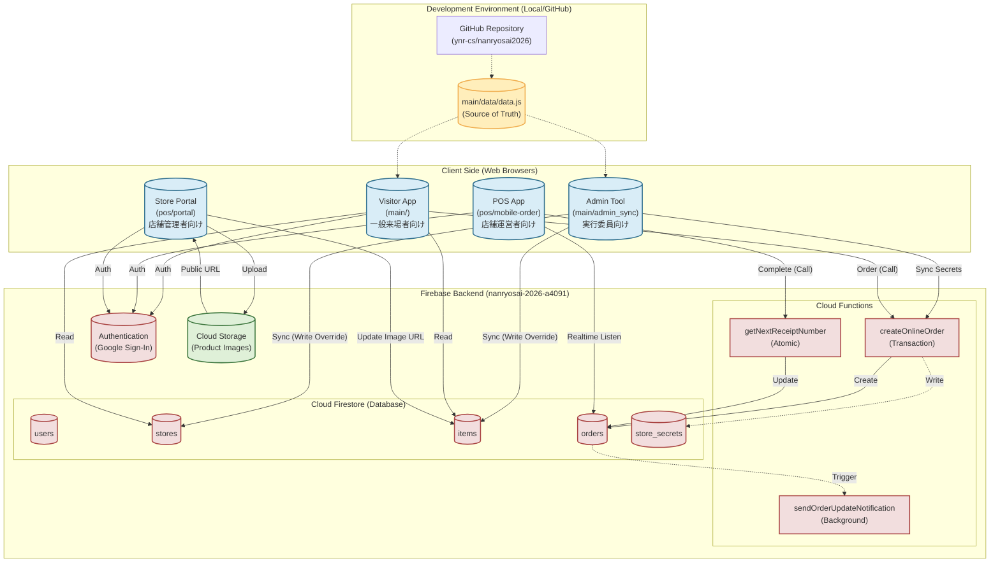
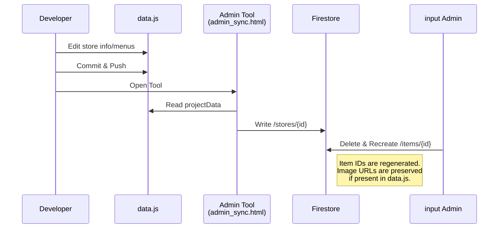
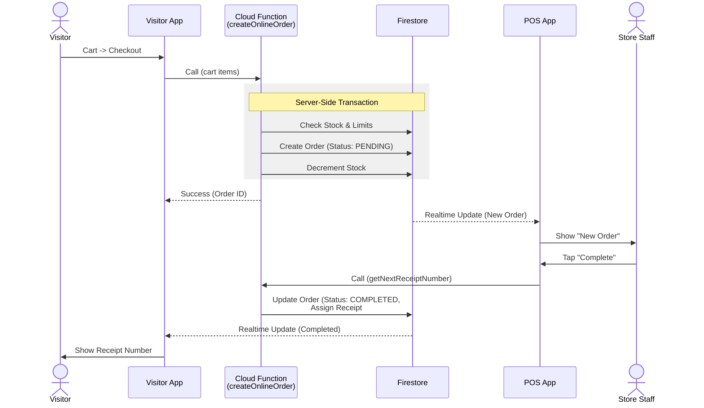
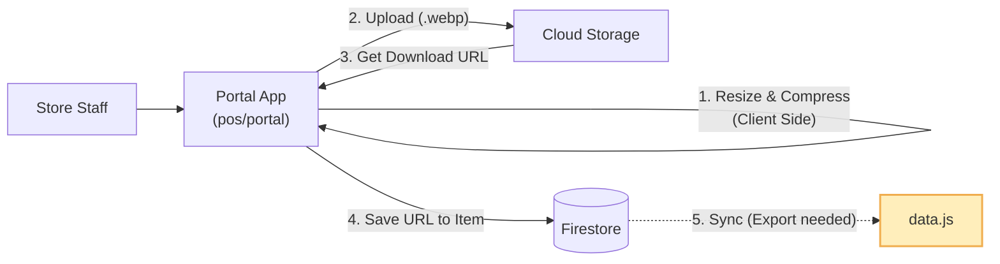
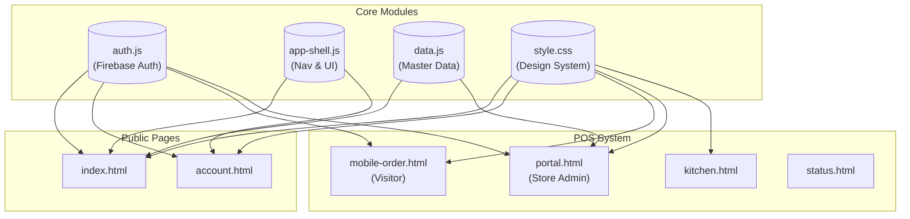
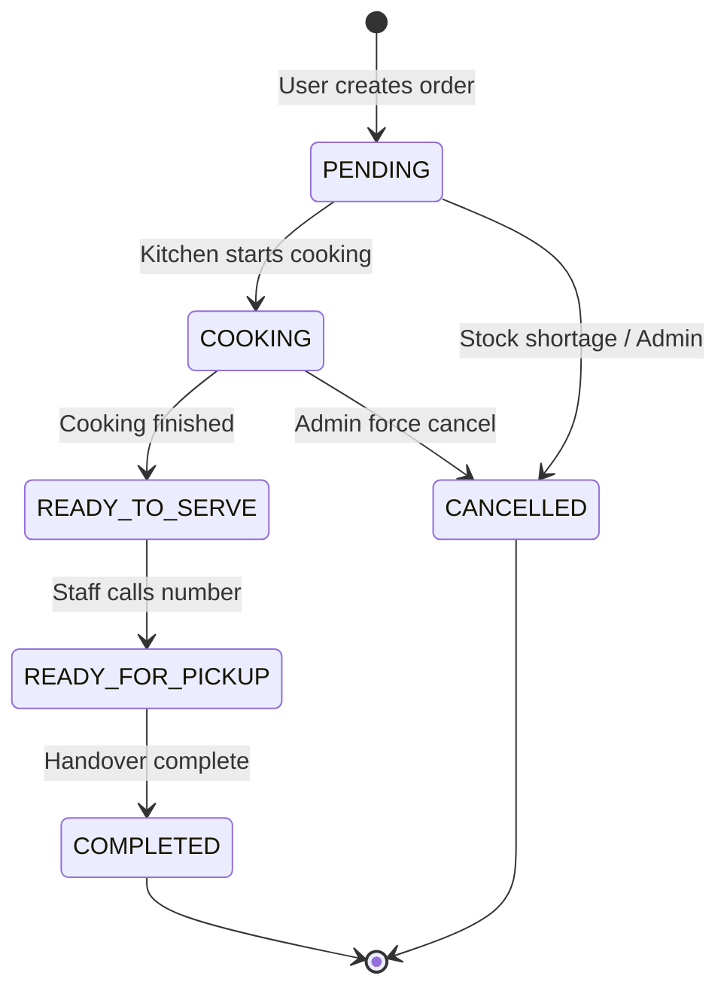

# システムアーキテクチャ図 (System Architecture)

本ドキュメントは、南陵祭2026プロジェクトのシステム構成とデータフローを可視化したものです。
Mermaid記法を使用しており、GitHub上で閲覧すると自動的に図としてレンダリングされます。

## 1. 全体アーキテクチャ (High-Level Architecture)

システムは、GitHub管理された静的サイト、Firebaseバックエンド、およびそれらを繋ぐ同期ツールで構成されています。



## 2. データの流れ (Data Flow Scenarios)

### シナリオA: マスタデータの同期 (Master Data Sync)

情報の正本である `data.js` を Firestore に反映するフロー。これは一方通行であり、Firestore上の手動変更は上書きされます（画像URLを除く）。



### シナリオB: モバイルオーダー (Mobile Order Transaction)

来場者が注文を行い、店舗がそれを受け付けるまでのフロー。不正防止のため、注文作成は必ず Cloud Functions を経由します。



### シナリオC: 商品画像の登録 (Product Image Upload)

店舗担当者が自分たちの端末から商品画像をアップロードするフロー。`data.js` を経由せず直接クラウドに保存されます。



## 3. コンポーネント依存関係図 (Component Dependencies)

主要なHTMLファイルと、共通モジュール (`auth.js`, `app-shell.js` 等) の依存関係を示します。



## 4. Firestore データモデル詳細 (Detailed Data Model)

Firestore の主要なコレクションとサブコレクションの構造定義です。

```mermaid
classDiagram
    note "Collections Schema"

    class User {
        string uid
        string displayName
        string email
        timestamp lastLogin
        string fcmToken
        string deviceType
    }
    class CartItem {
        string productId
        int quantity
        array customizations
    }
    class Order {
        string id
        string userId
        string storeId
        string status
        int totalAmount
        timestamp createdAt
    }
    class Store {
        string id
        string name
        string loginId
        bool isOpen
    }

    User "1" --> "*" CartItem : subcollection: cart
    User "1" -- "1" Order : creates
    Store "1" -- "*" Order : receives
```

## 5. 注文ステータスマシン (Order State Machine)

注文ステータスの遷移ロジックです。不正な遷移はサーバーサイドでブロックされます。


