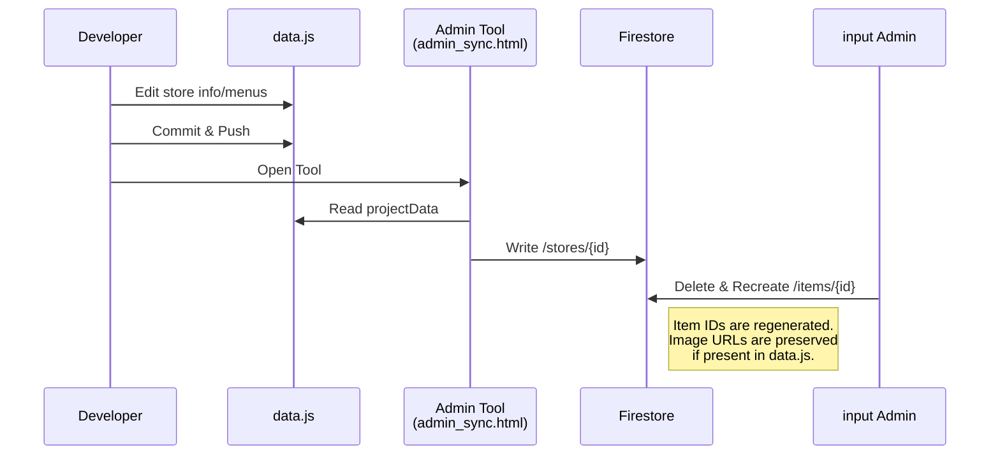
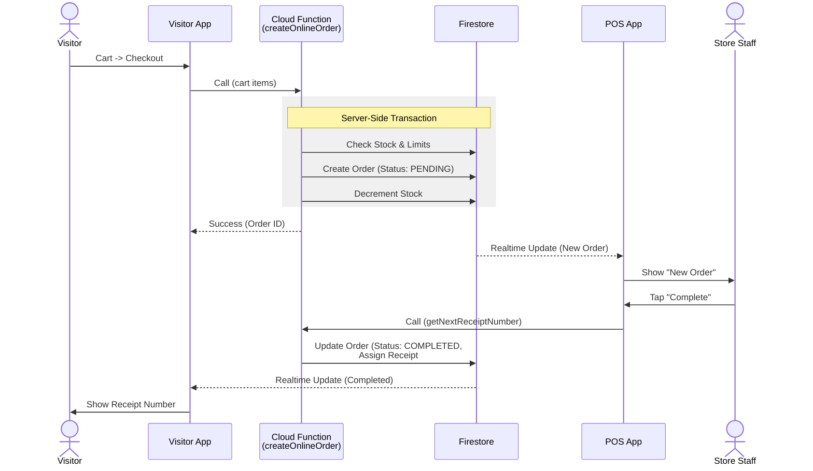

# システムアーキテクチャ図 (System Architecture)

本ドキュメントは、南陵祭2026プロジェクトのシステム構成とデータフローを可視化したものです。
Mermaid記法を使用しており、GitHub上で閲覧すると自動的に図としてレンダリングされます。

## 1. 全体アーキテクチャ (High-Level Architecture)

システムは、GitHub管理された静的サイト、Firebaseバックエンド、およびそれらを繋ぐ同期ツールで構成されています。

```mermaid
graph TD
    %% 定義: スタイル
    classDef master fill:#ffeebb,stroke:#f0ad4e,stroke-width:2px;
    classDef client fill:#d9edf7,stroke:#31708f,stroke-width:2px;
    classDef firebase fill:#f2dede,stroke:#a94442,stroke-width:2px;
    classDef storage fill:#dff0d8,stroke:#3c763d,stroke-width:2px;

    %% ---------------------------------------------------------
    %% 開発環境
    %% ---------------------------------------------------------
    subgraph "Development Environment (Local/GitHub)"
        GitRepo[GitHub Repository<br/>(ynr-cs/nanryosai2026)]
        DataJS[("main/data/data.js<br/>(Source of Truth)")]:::master
    end

    %% ---------------------------------------------------------
    %% クライアントサイド
    %% ---------------------------------------------------------
    subgraph "Client Side (Web Browsers)"
        VisitorApp[("Visitor App<br/>(main/)<br/>一般来場者向け")]:::client
        POSApp[("POS App<br/>(pos/mobile-order)<br/>店舗運営者向け")]:::client
        Portal[("Store Portal<br/>(pos/portal)<br/>店舗管理者向け")]:::client
        AdminSync[("Admin Tool<br/>(main/admin_sync)<br/>実行委員向け")]:::client
    end

    %% ---------------------------------------------------------
    %% Firebase Backend
    %% ---------------------------------------------------------
    subgraph "Firebase Backend (nanryosai-2026-a4091)"
        FirebaseAuth[("Authentication<br/>(Google Sign-In)")]:::firebase

        subgraph Firestore["Cloud Firestore (Database)"]
            direction TB
            UserDB[("users")]:::firebase
            StoreDB[("stores")]:::firebase
            ItemDB[("items")]:::firebase
            OrderDB[("orders")]:::firebase
            SecretDB[("store_secrets")]:::firebase
        end

        CloudStorage[("Cloud Storage<br/>(Product Images)")]:::storage

        subgraph Functions["Cloud Functions"]
            FuncOrder["createOnlineOrder<br/>(Transaction)"]:::firebase
            FuncReceipt["getNextReceiptNumber<br/>(Atomic)"]:::firebase
            FuncNotify["sendOrderUpdateNotification<br/>(Background)"]:::firebase
        end
    end

    %% ---------------------------------------------------------
    %% データフロー接続
    %% ---------------------------------------------------------

    %% コードベースからのデプロイ/参照
    GitRepo -.-> DataJS
    DataJS -.-> AdminSync
    DataJS -.-> VisitorApp

    %% マスタデータ同期 (Admin Sync)
    AdminSync -- "Sync (Write Override)" --> StoreDB
    AdminSync -- "Sync (Write Override)" --> ItemDB
    AdminSync -- "Sync Secrets" --> FuncOrder
    FuncOrder -. "Write" .-> SecretDB

    %% 来場者 (Visitor) のアクション
    VisitorApp -- "Auth" --> FirebaseAuth
    VisitorApp -- "Read" --> StoreDB
    VisitorApp -- "Read" --> ItemDB
    VisitorApp -- "Order (Call)" --> FuncOrder
    FuncOrder -- "Create" --> OrderDB

    %% 店舗運営 (POS) のアクション
    POSApp -- "Auth" --> FirebaseAuth
    POSApp -- "Realtime Listen" --> OrderDB
    POSApp -- "Complete (Call)" --> FuncReceipt
    FuncReceipt -- "Update" --> OrderDB

    %% 店舗ポータル (Portal) のアクション
    Portal -- "Auth" --> FirebaseAuth
    Portal -- "Upload" --> CloudStorage
    CloudStorage -- "Public URL" --> Portal
    Portal -- "Update Image URL" --> ItemDB

    %% 通知
    OrderDB -. "Trigger" .-> FuncNotify
```

## 2. データの流れ (Data Flow Scenarios)

### シナリオA: マスタデータの同期 (Master Data Sync)

情報の正本である `data.js` を Firestore に反映するフロー。これは一方通行であり、Firestore上の手動変更は上書きされます（画像URLを除く）。



### シナリオB: モバイルオーダー (Mobile Order Transaction)

来場者が注文を行い、店舗がそれを受け付けるまでのフロー。不正防止のため、注文作成は必ず Cloud Functions を経由します。



### シナリオC: 商品画像の登録 (Product Image Upload)

店舗担当者が自分たちの端末から商品画像をアップロードするフロー。`data.js` を経由せず直接クラウドに保存されます。

```mermaid
graph LR
    Staff[Store Staff] --> Portal[Portal App<br/>(pos/portal)]
    Portal -- "1. Resize & Compress<br/>(Client Side)" --> Portal
    Portal -- "2. Upload (.webp)" --> Storage[Cloud Storage]
    Storage -- "3. Get Download URL" --> Portal
    Portal -- "4. Save URL to Item" --> Firestore[(Firestore)]
    Firestore -. "5. Sync (Export needed)" .-> JS[data.js]

    style JS fill:#ffeebb,stroke:#f0ad4e,stroke-width:2px
```
