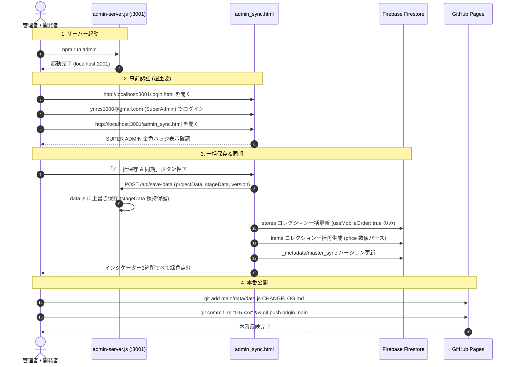

# 南陵祭2026 データ入力・同期・リアルタイム運用 完全ワークフロー仕様書

本ドキュメントは、南陵祭2026システムにおけるマスターデータ（`data.js`）の入力・編集、Firestore データベースへの同期、各模擬店専用の売上スプレッドシート自動連携、ステージ進行のリアルタイム配信、および当日の障害回避策を完全網羅した公式運用マニュアルです。

---

## 1. システム全体像とデータフロー

南陵祭2026のシステムは、**「静的マスター（Git管理）」**、**「リアルタイムDB（Firestore）」**、および**「売上集計台帳（Googleスプレッドシート）」**が有機的に連動する3層アーキテクチャで構築されています。

```mermaid
flowchart TD
    subgraph MasterLayer [① マスターデータ層 (Git管理)]
        DATA[main/data/data.js<br>projectData & stageData]
    end

    subgraph SyncLayer [② 同期・管理層 (Local / Admin)]
        ADMIN_SERVER[admin-server.js<br>ローカル保存API :3001]
        ADMIN_SYNC[main/admin_sync.html<br>同期ダッシュボード]
    end

    subgraph DynamicLayer [③ リアルタイム・クラウド層 (Firebase)]
        FIRESTORE_STORES[(Firestore: stores<br>店舗基本情報)]
        FIRESTORE_ITEMS[(Firestore: items<br>メニュー・在庫)]
        FIRESTORE_VENUES[(Firestore: venues<br>ステージ進行状況)]
        FUNCTIONS[Cloud Functions<br>syncOrdersToSheets]
    end

    subgraph OperationLayer [④ 現場運用・フロントエンド層]
        WEB_VISITOR[来場者Web index.html / detail.html]
        ORDER_APP[モバイルオーダー & POSレジ]
        VENUE_ADMIN[会場管理ポータル venue.html]
        PORTAL[店舗ポータル portal.html]
        SHEETS[各店舗専用 Googleスプレッドシート<br>注文履歴タブ 10列]
    end

    DATA -->|静的配信| WEB_VISITOR
    DATA <-->|双方向同期| ADMIN_SYNC
    ADMIN_SYNC -->|ローカル保存| ADMIN_SERVER --> DATA
    ADMIN_SYNC -->|店舗・メニュー同期| FIRESTORE_STORES & FIRESTORE_ITEMS

    FIRESTORE_STORES & FIRESTORE_ITEMS --> ORDER_APP
    ORDER_APP -->|注文発生| FUNCTIONS
    FUNCTIONS -->|毎分バッチ自動記帳| SHEETS
    PORTAL -->|閲覧リンク| SHEETS

    VENUE_ADMIN -->|ステータス更新| FIRESTORE_VENUES
    FIRESTORE_VENUES -->|onSnapshot リアルタイム受信| WEB_VISITOR
```

---

## 2. マスターデータ（`main/data/data.js`）入力仕様書

マスターデータはすべての情報源（Single Source of Truth: SSOT）です。

### 2.1 企画・店舗データ (`projectData`)

| フィールド名 | 型 | 必須 | 説明・書式ルール | 設定例 / 許容値 |
| :--- | :--- | :--- | :--- | :--- |
| **`id`** | 文字列 | **必須** | 企画の一意な識別子。<br>・クラス: 半角数字3桁（`"101"`〜`"308"`）<br>・部活/有志: 半角英小文字スネーク（`"keion"`, `"cs"`） | `"301"`, `"keion"` |
| **`loginId`** | 文字列 | **必須** | POSポータル・キッチンログイン用ID。 | `"class301"` |
| **`groupName`** | 文字列 | **必須** | **団体名**（クラス・部活動名）。<br>★ `stageData.groupName` と1文字の狂いもなく完全一致必須。 | `"3年1組"`, `"軽音楽部"` |
| **`name`** | 文字列 | **必須** | **企画名・店名**。カード見出し・H1タイトル。 | `"やきそばスター"` |
| **`place`** | 文字列 | **必須** | 開催場所の人間可読文字列。 | `"中庭テントA"`, `"南棟 3F 301"` |
| **`floor`** | 数値 | **必須** | 所在階数（半角整数）。階数順ソートで使用。 | `1`, `2`, `3` |
| **`roomId`** | 文字列 | 任意 | キャンパスマップ連動用の部屋キー。 | `"tent_a"`, `"room_301"` |
| **`category`** | 文字列 | **必須** | 企画ジャンル（4種固定）。 | `"food"`, `"shop"`, `"exhibit"`, `"stage"` |
| **`useMobileOrder`** | 真偽値 | **必須** | モバイルオーダー利用フラグ。<br>・`true`: 模擬店（Firestoreへ同期）<br>・`false`: 展示・手売り（Firestore同期除外） | `true` / `false` |
| **`catchphrase`** | 文字列 | 任意 | 一覧カード用キャッチコピー（15〜25文字）。 | `"星3つの味をあなたに"` |
| **`description`** | 文字列 | **必須** | 企画の詳しいPR紹介文（80〜250文字）。 | `"秘伝のソースが決め手！..."` |
| **`tags`** | 配列 | 任意 | 検索・バッジ用タグ配列。 | `["食品", "焼きそば"]` |
| **`contentType`** | 文字列 | **必須** | 詳細ページのタブ構成（`"menu"` または `"gallery"`）。 | `"menu"` |
| **`menu`** | 配列 | 条件付 | 商品データ配列（食品企画は必須）。構造は 2.2 参照。 | `[ ... ]` |

#### 拡張表示フィールド（`detail.html` 自動連動）
- **`sns`** (`object`): `{ instagram: "https://...", twitter: "https://..." }`  
  詳細ページに各ブランド公式カラーのリンクボタンを自動生成。
- **`votingEnabled`** (`boolean`): `true` にすると「🏆 この企画に投票する」ボタンが出現（`voteUrl` に Google Forms 等を指定可能）。
- **`menuNote`** (`string`): メニュー上部に金色のこだわりバナー（例: `"極太生麺を使用！"`）を表示。

---

### 2.2 メニューデータ (`projectData[i].menu`)

```javascript
{
  name: "ソース焼きそば",
  price: "300円",                // ※半角数字必須（全角「３００」は厳禁）
  description: "特製ブレンドソースが香る王道の味。",
  imageUrl: "",                 // ※ローカルパス厳禁。Storage URL または空文字 ""
  isRecommended: true,          // true でおすすめバッジ＆最上位自動ソート
  isAvailable: true,            // false で SOLD OUT 表示＆注文ボタン無効化
  allowedToppings: ["マヨネーズ", "紅生姜", "青のり"], // 余計な空白を含めないこと
  allergens: ["小麦", "豚肉", "大豆"], // アレルギー表示バッジ
  note: "紅生姜抜き対応可能です"       // こだわり注記
}
```

> [!CAUTION]
> ### 画像パスに関する絶対ルール
> - **店舗アイコン（看板画像）**: `data.js` にパスは書かない。リポジトリの `images/` に `{id}.png`（例: `images/301.png`）として保存するだけで全自動解決されます。
> - **商品写真 (`imageUrl`)**: ローカルパス（`images/yakisoba.png` 等）は**絶対に使用不可**。必ず Firebase Storage の完全URL（`https://firebasestorage.googleapis.com/...`）である必要があります。未設定時は空文字 `""` にしてください。

---

### 2.3 ステージデータ (`stageData`)

ステージ出演スケジュール（全25枠）は `stageData` 配列で一元管理します。

```javascript
{
  id: "keion_gym_d1",           // {団体}_{場所}_d{日程}
  day: 1,                       // 数値の 1 または 2（文字列 "Day1" は不可）
  time: "11:00 - 12:15",        // "HH:MM - HH:MM"（半角スペースとハイフン厳守）
  groupName: "軽音楽部",         // ★ projectData.groupName と完全一致必須
  name: "NANRYOFES",            // 演目名
  place: "体育館",               // "体育館" | "視聴覚室" | "音楽室" を含む文字列
  description: "教員バンドの直後からスタート！熱狂の体育館ライブ！",
  tags: ["Day1", "音楽"]
}
```

---

## 3. データ同期運用フロー（手順書）



### ステップ詳細

1. **ローカルサーバーの起動**:
   ```powershell
   npm run admin
   ```
2. **管理者認証（事前ログインの厳守）**:
   - 直接 `admin_sync.html` を開くと未認証エラーで弾かれます。
   - まず **`http://localhost:3001/login.html`** を開き、管理者アカウントでログインしてから `admin_sync.html` を開きます。
3. **一括保存＆同期の実行**:
   - 画面左上の **「⚡ 一括保存 & 同期」** を押します。
   - `admin-server.js` の二重安全機構により、手動登録されたステージ枠全25枠を完全保護したまま、`data.js` のローカル保存と Firestore（`stores`・`items`）の同期が全自動で完了します。
4. **本番公開**:
   - 変更された `main/data/data.js` を Git でコミット＆プッシュします。

---

## 4. 店舗専用 売上スプレッドシート連携仕様

模擬店の全注文（モバイルオーダー・有人POS・店頭SOK）は、Cloud Functions の定期バッチ（`syncOrdersToSheets`）により、**各店舗専用の Google スプレッドシートへ毎分リアルタイム自動記帳**されます。

### 4.1 スプレッドシート出力構成（A列〜J列）

| 列 | 項目名 | 内容 / フォーマット |
| :---: | :--- | :--- |
| **A** | **注文ID** | Firestore Document ID（一意キー） |
| **B** | **呼出番号** | POS (`100-999`), モバイル (`7000-7999`), SOK (`2000-2999`) |
| **C** | **注文方法** | `POS` / `モバイル` / `SOK` |
| **D** | **現在の状況** | 🍳 調理中 / ✅ 提供口で準備中 / 📢 呼び出し中 / 🎉 提供完了 / ❌ 取消 / ⚠️ 放置終了 |
| **E** | **合計金額** | 請求金額（半角数値） |
| **F** | **商品詳細** | `ソース焼きそばx2(マヨネーズ追加, 紅生姜抜き)` 形式 |
| **G** | **注文日時** | `YYYY/MM/DD HH:MM:SS` (JST) |
| **H** | **調理完了日時** | `readyToServeAt` (JST) |
| **I** | **呼出開始日時** | `readyForPickupAt` (JST) |
| **J** | **完了/終了日時** | `completedAt` / `cancelledAt` / `abandonedAt` (JST) |

### 4.2 店舗スプレッドシートの初期紐付け手順（プロビジョニング）

1. **Google Drive 共有フォルダの準備**:
   - 指定共有フォルダ（ID: `1Rbe6SRErVZ0-8z7scsV12wzeHiUI4WYO`）を開きます。
2. **店舗シートの作成**:
   - フォルダ内に各店舗用のシート（例: `【売上台帳】301_やきそばスター`）を新規作成し、URLからスプレッドシートIDを控えます。
3. **紐付け関数の実行 (`linkStoreSheet`)**:
   - 管理者権限で Cloud Functions `linkStoreSheet({ storeId: "301", spreadsheetId: "..." })` を実行します（または `node functions/run_admin_callables.js` を利用）。
   - システムが全自動で：
     - タブ名を **「注文履歴」** に変更
     - 1行目を固定化（`frozenRowCount: 1`）
     - A1〜J1 に公式ヘッダー列を自動書き込み
     - Firestore `stores/{storeId}` に `spreadsheetId` と `spreadsheetUrl` を保存
4. **店舗ポータルでの確認**:
   - 店舗管理画面（`pos/portal.html?store=301`）のアプリアイコン一覧に **「📈 売上スプレッドシート」** カードが表示され、タップすると自店舗のシートが開くことを確認します。

---

## 5. ステージ進行リアルタイム配信運用 (`venue.html`)

文化祭当日、会場担当者（体育館・音楽室・視聴覚室）がブラウザから演目とステータスを操作します。

```
[会場担当者URL (?token=...&venue=gym)] ──> [パスワード認証 (teacher_password_2026)]
                                                │
                                                ▼
[現在の演目を選択] ──> 【オートプレディクト】次の演目を自動セット
        │
        ▼ 200ms デバウンス自動保存
[Firestore: venues/{venueId} 更新] ──> [来場者トップ index.html に即時リアルタイム反映]
```

### 運用手順
1. **専用URLアクセス**:
   - 体育館: `https://.../main/admin/venue.html?token=token_a8f3e2c9d1&venue=gym`
   - 音楽室: `https://.../main/admin/venue.html?token=token_a8f3e2c9d1&venue=music_room`
   - 視聴覚室: `https://.../main/admin/venue.html?token=token_a8f3e2c9d1&venue=av_room`
2. **認証**: パスワード `teacher_password_2026` でログイン。
3. **操作**:
   - 「現在の演目」を選択すると、**同じ会場の次の演目が「次の演目」に自動入力（オートプレディクト）**されます。
   - ステータス（`live` / `soon` / `preparing` / `ended`）を選択すると、200ms後に自動保存され、来場者トップページのリアルタイムカードが瞬時に切り替わります。
   - ※予定時刻を10分超過してもステータスが変わらない場合、画面上部に赤色の**遅延警告**が自動表示されます。

---

## 6. 事後会計・監査ワークフロー（文化祭終了後）

文化祭終了後の会計報告は、蓄積されたスプレッドシートを用いて迅速に実施します。

1. **キャッシュレス（AirPay）売上との突合**:
   - スプレッドシート **E列（合計金額）** のうち、C列が `AirPay` または `キャッシュレス` の行を集計し、決済端末側の売上総額と突合します。
2. **保健所申告上限（食数）の監査**:
   - F列（商品詳細）の販売個数を集計し、保健所に提出した販売上限数（例: 焼きそば500食）を超えていないかを即座に監査・確認します。
3. **公式会計決算書の作成**:
   - 各クラスが学校・生徒会に提出する「仕入れ・売上計画」の実績欄に、スプレッドシートの確定数値をそのまま転記します。

---

## 7. 安全運用・障害防止マトリクス（改定版）

| 項目 | 以前のリスクと挙動 | 改修後の仕様・推奨運用 |
| :--- | :--- | :--- |
| **文化祭営業時間中のメニュー同期 (`syncItems`)** | （旧）Firestore の商品IDが全削除・再採番され、カート内商品が無効化され注文が全停止した。 | **【解消済・安全】** 差分同期（Upsert）により既存IDを100%維持。営業時間中の価格改定や説明文修正もカートを壊さず安全に同期可能。店舗の売切状態（`isAvailable: false`）や写真も保護。 |
| **`admin_sync.html` の本番読込 (`importFromProduction`)** | （旧）食品店舗のみ読み込まれ、展示・ステージなど全26企画が画面上から蒸発した。 | **【解消済・安全】** 非破壊マージ（Preserving Merge）により、既存の展示・ステージ・部活企画全26件を完全保持。食品店舗の最新情報（写真URLやID）のみを安全に取り込み可能。 |
| **メニュー価格に全角数字（`３００円`）を入れる** | 数値パースが `0円` になり、Cloud Functions の金額計算がクラッシュする。 | 必ず半角数字（`"300円"` または `300`）で記述する。 |
| **トッピング名の前後に空白（`"マヨネーズ "`）を含める** | モバイルオーダーの選択ボタンと完全一致せず、カスタマイズ注文が不整合を起こす。 | 空白を取り除き `"マヨネーズ"` と記述する。 |
| **商品写真にローカルパス（`images/food.png`）を指定する** | モバイルオーダーや詳細ページで画像リンク切れ（404）になる。 | Firebase Storage の完全URLを指定するか、空文字 `""` にする。 |
| **スプレッドシート破損時の放置** | 毎分の自動追記が失敗し続ける。 | 管理者が `rebuildStoreSheet({ storeId })` を実行し、Firestore から全件時系列順に即時再構築する。 |

