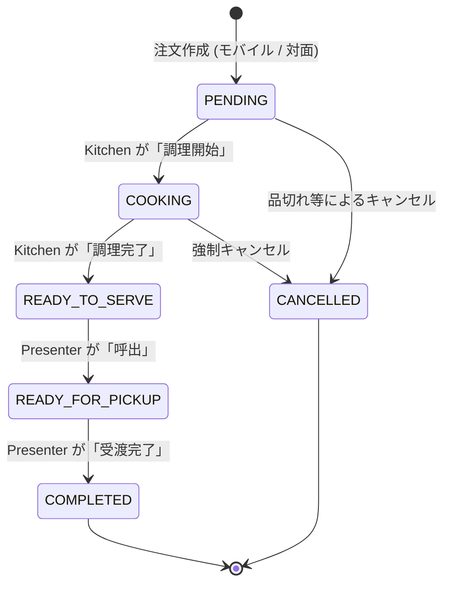

# 南陵祭 2026 POS・オーダーシステム解析レポート

## 1. システム概要

本システムは、南陵祭2026向けに構築された分散型Webオーダー・POSシステムです。
単一の管理用POSレジだけでなく、モバイルオーダー機能や会場ステータス管理機能も統合された包括的な構成となっています。
**Mobile First**（スマホ操作前提のUI）と **Security First**（Firebaseによる堅牢なアクセス制御）を基本方針とし、ビルド不要の Vanilla JS (ES Modules) と Firebase (Firestore, Auth, Functions, Storage) を組み合わせて構築されています。

## 2. モジュール構成と役割 (ファイル別)

`pos/` ディレクトリ（および一部の `main/` ディレクトリ）内の主要アプリの役割は以下の通りです。

| ファイル名 | 役割・機能概要 | 対象ユーザー |
| :--- | :--- | :--- |
| **`portal.html`** | **[認証ハブ・店舗管理]** ・各運営ツール(POS, Kitchen等)へのハブ画面。 ・不正アクセスを弾く **Auth Guard** の役割を担う。 ・メニューの登録・編集、商品画像(.webp圧縮)のアップロード。 ・売上サマリーの表示。 | 店舗責任者 実行委員 |
| **`pos.html`** | **[レジ]** ・対面注文の入力・トッピング対応。 ・Cloud Functions (`getNextReceiptNumber`) による安全なレシート連番発番。 ・注文完了処理。 | レジ担当者 |
| **`kitchen.html`** | **[厨房・KDS]** ・注文（`PENDING` / `COOKING`）のリアルタイム表示とステータス更新。 ・調理完了処理（`READY_TO_SERVE`）。通知音の再生。 | 厨房スタッフ |
| **`presenter.html`** | **[提供口・呼び出し]** ・調理完了品の一覧表示と呼び出し（`READY_FOR_PICKUP`）。 ・受渡完了処理（`COMPLETED`）。強制キャンセル機能。 | 受渡担当者 |
| **`monitor.html`** | **[客用モニター]** ・呼び出し中のレシート番号を大画面表示。 | 来場者 (客) |
| **`mobile-order.html`** | **[モバイルオーダー (客用)]** ・来場者自身のスマホから注文（`createOnlineOrder` 経由）。 ・学校指定ドメイン（`@gl.pen-kanagawa.ed.jp`）でのログイン制限。 | 来場者（在校生） |
| **`status.html`** | **[注文ステータス確認]** ・自分の注文状況（調理中/呼出中/完了）をリアルタイム確認。 | 来場者 (客) |

> ※ 旧設計に存在した `simulator.html`, `sok.html`, `pay.html` は現在未実装・廃止となっています。

## 3. 業務フローとデータステータス遷移

注文データ（`orders`）の `status` フィールドにより、トランザクションの状態を管理します。

### 注文ステータス遷移図 (Order State Machine)

### 注文の合流
モバイルオーダー（スマホから）と対面注文（POSレジから）はどちらも `PENDING` または `COOKING` として `orders` コレクションに登録され、`kitchen.html` の画面上で区別なくシームレスに合流します。

## 4. データベース設計 (Firestore Schema)

主要なコレクション構造と役割です。

### マスタ・メタデータ
- **`stores`**: 店舗メタデータ。団体名(`name`)、店名(`teamName`)、スプレッドシートへのリンク(`spreadsheetId`)を保持。
- **`items`**: 商品マスタ。価格(`price`)、トッピング設定(`allowedToppings`)、販売状態(`isAvailable`)、商品画像URL(`imageUrl`)を保持。

### トランザクション
- **`orders`**: 注文データ。注文内容（`items`配列）、合計金額（`totalAmount`）、ステータス（`status`）、支払方法（`paymentMethod`）を保持。作成は必ず Cloud Function 経由（またはPOS）に制限。
- **`users/{uid}`**: ユーザープロフィール。内部にカート情報（`cart` サブコレクション）を保持。
- **`counters/receipt`**: トランザクション時の排他制御されたレシート番号発番用のアトミックカウンタ。

### セキュリティ・システム用
- **`store_secrets`**: 店舗パスワードなどの機密情報。クライアントからのアクセスは完全禁止（Firebase Rules で保護）。
- **`venues` / `venue_admin_sessions`**: 会場ステータス（体育館など）のリアルタイム管理用データおよび独自のセッショントークン。

## 5. 技術・アーキテクチャの特徴

### 5.1. 認証ハブと Popup-only 戦略
- `main/auth.js` が認証やFirebase初期化を一元管理（SSOT）しています。
- **GitHub Pagesの制限（サードパーティCookie制限）により、`signInWithRedirect` は動作しない**ため、システム全体で **`signInWithPopup` (Popup-only戦略)** を採用しています。
- モバイル端末等のポップアップブロック対策として、ブロック検知時（`auth/popup-blocked`）には自動的に回避用の「ガイダンスUI」を表示し、ユーザー自身による再試行を促します。
- **Auth Guard**: スタッフ用ツール（`pos.html` など）は単独でのログイン画面を持たず、未ログイン状態では全て `portal.html` へ強制リダイレクトされ、そこで認証と権限チェックが行われます。

### 5.2. セキュリティ強化 (App Check とドメイン制限)
- **App Check**: 不正なAPI呼び出しを防ぐため、reCAPTCHA v3 / Enterprise による App Check を全域で導入しています。ポップアップブロックを防ぐため、トークンは初期化時に非同期で「ウォームアップ（事前取得）」する設計としています。
- **ドメイン制限**: モバイルオーダー等の特定機能は、ログイン時に学校指定のメールアドレス（`@gl.pen-kanagawa.ed.jp`）であることを検証し、外部ユーザーからの注文を弾くロジックを実装しています。

### 5.3. バックエンド (Cloud Functions)
クライアントからの直接書き込みを防ぎ、安全なトランザクションを確保するために以下の機能を実装しています。
- **`createOnlineOrder`**: モバイルオーダー注文作成。在庫チェックと発番をトランザクション内で実行。
- **`getNextReceiptNumber`**: POS用。アトミックな連番発番処理。
- **`sendOrderUpdateNotification`**: 注文ステータス変更時に、ユーザーの端末へ FCM プッシュ通知を送信。
- **`syncOrderToSpreadsheet`**: 注文作成・更新時に、各店舗用の Google スプレッドシートへ自動でデータを追記する処理。

### 5.4. ストレージと画像処理
商品画像のアップロードは `portal.html` から行われます。
通信量削減のため、クライアントサイド（Canvas API）で長辺1200pxにリサイズし、**WebP形式 (q=0.8)** に圧縮してから Cloud Storage へ送信されます。

### 5.5. UI/UX (ダークモードとリアルタイム性)
- CSS変数（`var(--bg-color)` など）を活用し、OSのシステム設定に連動した完全な**ダークモード**をサポート。
- Firestore の `onSnapshot` を活用し、POS・Kitchen・Presenter の全画面間でリロード不要の**リアルタイム同期**を実現。

## 6. 実装保留・廃止事項 (2026年5月時点)

以下の初期構想機能は、テスト運用の結果や仕様変更により意図的に保留・廃止されています。
- **セルフオーダー端末 (SOK) / スマホ決済 (Pay)**: 未実装・当面保留。AirPay等の本格決済API連携も見送られ、モック処理となっています。
- **SendGrid 連携**: 受付完了メールなどのEメール送信機能は仕様から削除されました。
- **放置ペナルティ (BAN / Scheduler)**: 開発サイクル阻害防止のため、放置注文の自動キャンセルおよびBAN機能の組み込みは現在保留しています。
