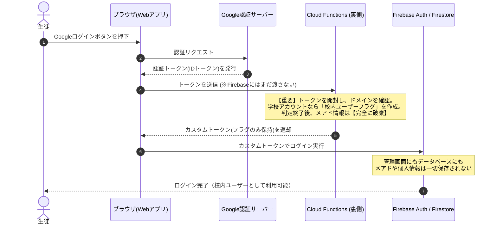
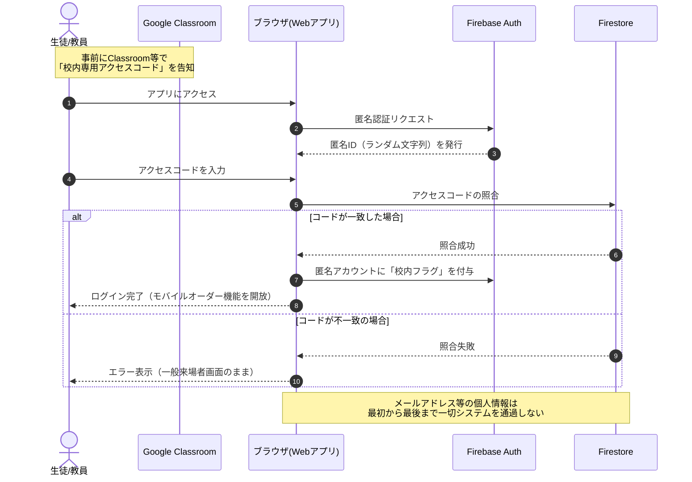

# 南陵祭モバイルオーダー ログインシステム案

## はじめに

本ドキュメントは、南陵祭用モバイルオーダーシステムにおける「校内関係者の識別」と「個人情報の保護」を両立するための認証システム設計案です。
学校側のプライバシーポリシーやセキュリティ要件に応じ、2つのプラン（プランA・プランB）をご提案いたします。

---

## プランA：Cloud Functionsを利用したカスタム認証

### 概要

Googleログインの仕組みを利用しつつ、バックエンド（Cloud Functions）で学校ドメイン（`@gl.pen-kanagawa.ed.jp`）を自動判定します。
判定直後に**メールアドレス情報はシステム上から即座に破棄**されるため、データベース（Firestore）や Firebase Authentication には一切保存されません。

### 処理フロー

### 特徴

| 項目           | 内容                                                                                                                                                               |
| :------------- | :----------------------------------------------------------------------------------------------------------------------------------------------------------------- |
| **メリット**   | ・「Googleでログイン」ボタンを押すだけのスムーズなUX ・学校ドメイン所持者を確実かつ自動的に識別可能 ・ハッシュ化処理等を挟むことでさらにセキュアな運用が可能 |
| **デメリット** | ・処理過程で「一時的」にメールアドレスを通過させるため、「取得自体が完全NG」という厳格な校内ルールの場合は抵触する懸念がある                                       |

---

## プランB：匿名認証とアクセスコード

### 概要

メールアドレスやGoogleアカウントをシステムと一切連携させず、自動発行される「匿名ID」のみでログインします。
その後、Google Classroom等で事前配布されたアクセスコードを入力することで、校内ユーザーとしての権限を付与します。

### 処理フロー

### 特徴

| 項目           | 内容                                                                                                                                                               |
| :------------- | :----------------------------------------------------------------------------------------------------------------------------------------------------------------- |
| **メリット**   | ・メールアドレス等の個人情報がシステムを「取得・通過・保存」するプロセスが一切存在しない ・**個人情報保護の観点で最も安全であり、学校側の承認を極めて得やすい** |
| **デメリット** | ・初回利用時にアクセスコードを入力する手間が増加する ・アクセスコードが漏洩した場合、本当に校内の人間かをシステムで保証できない ・個人の特定が難しくなるため、悪質ユーザーへのBAN制度等が事実上機能しなくなる |

---

## 結論と推奨案

- **プランAが適しているケース:** ユーザーの利便性（UX）とシステムとしての確実性（BAN機能やドメインによる本人保証）を重視し、「最終的にデータとして保存されないのであれば、システム内の一時的な処理・通過は許容される」という合意が学校側から得られる場合。
- **プランBが適しているケース:** 個人情報の保護を最重要視し、「システム上にメールアドレスを通過させること自体を完全に回避したい」場合。

**まとめ:**
どちらのプランも一長一短があり、**「個人情報の厳密な保護」と「システムとしての安全性・機能性（BAN等の運用）」はトレードオフの関係**にあります。学校としてのコンプライアンス（法令・校内規定）を第一に考えるか、実際の運用上の確実性を取るかでご判断いただくのが最適です。
