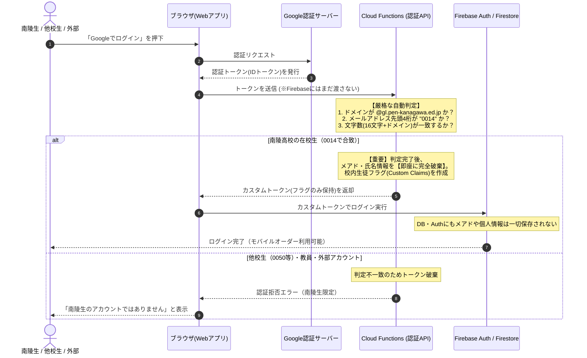

# 南陵祭モバイルオーダー ログインシステム案

## はじめに

本ドキュメントは、南陵祭用モバイルオーダーシステムにおける「校内関係者の識別」と「個人情報の保護」を両立するための認証システム設計案です。
学校側のプライバシーポリシーやセキュリティ要件に応じ、これまでの2プラン（プランA・プランB）に加え、最新の調査結果を踏まえた最も確実な新案（**プランC**）をご提案いたします。

---

## 調査結果：生徒アカウント（メールアドレス）の構造と法則性

事前調査により、神奈川県立高校で配布されているGoogleアカウント（`@gl.pen-kanagawa.ed.jp`）の生徒アドレスに明確な命名法則が存在することが判明しました。

### アカウントの全体構造

生徒アカウントは**16文字の固定長**（数字12桁＋英数字ランダム4文字）で構成されています。

```text
0014 **** **** **** @gl.pen-kanagawa.ed.jp   南陵高校 生徒アカウント（例）
0050 **** **** **** @gl.pen-kanagawa.ed.jp   他校 生徒アカウント（例：栄高校）
 │    │    │    └─ 13〜16桁目：推測防止用ランダム英数字？【未確認・推測段階】
 │    │    └────── 9〜12桁目：年次・生徒識別連番？【未確認・推測段階】
 │    └─────────── 5〜8桁目：区分・学科コード？（南陵0000／他校0002等）【未確認・推測段階】
 └──────────────── 1〜4桁目：学校整理番号のゼロ埋め4桁【確定・判定に使用】
```

### 各部の詳細

1. **1〜4桁目：学校整理番号の4桁ゼロ埋め【確定：判定に使用】**
   - **南陵高校は `0014`**（整理番号014の4桁ゼロ埋め）。
   - 他校（例：栄高校は整理番号050のため `0050`）とも県教委の学校整理番号一覧と完全に一致。
   - ドメイン（`@gl.pen-kanagawa.ed.jp`）は県立高校全144校で共通ですが、**この先頭4桁を見るだけで「南陵高校の生徒であるか」を100%確実に特定可能**です。
2. **5〜16桁目：【未確認・推測段階・システム判定への依存厳禁】**
   - 5〜8桁目はおそらく区分・学科コード、9〜12桁目はおそらく入学年度や連番、末尾4文字は推測防止のランダム英数字と思われますが、学校ごとの違いやサンプル不足により**現時点では未確認であり、まだ正確な仕様は分かっていません**。
   - したがって、システム判定としては「先頭4桁が `0014` であること」および「全体の文字数（16文字＋ドメイン）」のみを厳密に検証し、**5桁目以降の内容には一切依存・関与しない**安全な設計とします。
3. **教員アカウントについて**
   - `姓ローマ字-3文字程度` の形式であり、学校整理番号（0014）は一切含まれません（校務用アカウントの流用）。
   - 本システムにおいて、**モバイルオーダーは生徒専用機能（在校生特典）とし、教員には利用させない**方針のため、教員向けの例外判定やホワイトリスト等は一切設けず、`0014` 以外の全アカウントを一律で弾くシンプルな設計とします。

---

## 各プランの提案

---

### プランC（新案・推奨）：学校整理番号（0014）自動判定による南陵生専用カスタム認証

#### 概要

Googleログインを利用し、Cloud Functions内で「ドメインが `@gl.pen-kanagawa.ed.jp` かつ 先頭4桁が `0014` であるか」を自動判定します。
南陵生と確認できた場合のみカスタムトークンを発行し、**メールアドレス・氏名などの個人情報は判定直後にシステム上から即座に完全破棄**します。

#### 処理フロー



#### 特徴

| 項目           | 内容                                                                                                                                                                                                                                                                                                                           |
| :------------- | :----------------------------------------------------------------------------------------------------------------------------------------------------------------------------------------------------------------------------------------------------------------------------------------------------------------------------- |
| **メリット**   | ・**南陵高校の生徒のみを100%確実に自動識別**（他校生や部外者の誤入・不正注文を完全に排除）<br>・「Googleでログイン」ボタンを押すだけの極めてスムーズなUX（コード入力の手間なし）<br>・判定直後にメールアドレスを完全破棄するため、**個人情報非保持と安全性を両立**<br>・架空注文や放置に対するUID単位のBAN制裁が有効に機能する |
| **デメリット** | ・判定処理の瞬間にのみ、暗号化通信越しにCloud Functionsのメモリ上をメールアドレスが一時通過する（保存は一切されない）                                                                                                                                                                                                          |

---

### プランA：ドメインのみによるカスタム認証（従来案）

#### 概要

Googleログインを利用し、Cloud Functionsで学校ドメイン（`@gl.pen-kanagawa.ed.jp`）のみを判定してカスタムトークンを発行する案です。

#### 特徴

| 項目           | 内容                                                                                              |
| :------------- | :------------------------------------------------------------------------------------------------ |
| **メリット**   | ・「Googleでログイン」ボタンのみでログイン可能<br>・メールアドレス情報は即座に破棄される          |
| **デメリット** | ・**ドメインが県立全144校共通のため、他校生徒もログインできてしまう**（学校特定の確実性に欠ける） |

---

### プランB：匿名認証とアクセスコード入力

#### 概要

メールアドレスやGoogleアカウントを一切連携せず、Firebaseの「匿名ID」のみでログインし、Google Classroom等で事前配布した共通アクセスコードを手動入力して校内権限を付与する案です。

#### 特徴

| 項目           | 内容                                                                                                                                                                                          |
| :------------- | :-------------------------------------------------------------------------------------------------------------------------------------------------------------------------------------------- |
| **メリット**   | ・メールアドレス等の個人情報がシステムを一時通過することすら一切ない（最も保守的なプライバシー保護）                                                                                          |
| **デメリット** | ・生徒全員にアクセスコードを手動入力させる手間（UXの低下）<br>・アクセスコードが外部や他校生に漏洩した場合、防ぐ手段がない<br>・個人の一意性が担保されず、放置注文に対するBAN制度が形骸化する |

---

## 3プランの比較まとめ

| 比較項目                     | プランC（整理番号0014判定）【推奨・確実】    | プランA（ドメイン判定のみ）   | プランB（匿名＋アクセスコード）    |
| :--------------------------- | :------------------------------------------- | :---------------------------- | :--------------------------------- |
| **南陵生の確実な識別**       | **◎ 完全識別（0014で100%特定）**             | △ 不可（他校生も通過）        | ✕ 不可（コード漏洩に極めて脆弱）   |
| **個人情報の保護**           | **◎ 完全破棄（DB/Auth保存ゼロ）**            | ◎ 完全破棄（DB/Auth保存ゼロ） | ◎ 完全非通過（通過すらしない）     |
| **生徒の操作性 (UX)**        | **◎ ボタン1タップで完了**                    | ◎ ボタン1タップで完了         | △ コード手動入力の手間あり         |
| **悪質・放置注文対策 (BAN)** | **◎ 有効（生徒端末・UIDが一意）**            | ◎ 有効（生徒端末・UIDが一意） | ✕ 機能しない（再匿名化で回避可能） |
| **教員の扱い**               | **生徒専用のため一律除外**                   | 生徒専用のため一律除外        | コードを知っていれば利用可能       |
| **安全性（総合評価）**       | **◎ 極めて安全（完全識別＋個人情報完全破棄）** | △ 他校生混入のリスクあり      | △ コード漏洩・なりすましリスクあり |

---

## 結論と推奨

**【結論】「プランC（学校整理番号 0014 判定）」の採用を強く推奨します。**

- **理由1（完全な学校識別）**: 神奈川県教委の共通ドメイン仕様に対し、学校整理番号 `0014` を検証することで、他校生の混入や外部からの不正アクセスを確実に遮断できます。
- **理由2（プライバシーの担保）**: メールアドレスはFunctionsの判定ロジックを通過した瞬間に破棄され、データベースや管理画面には一切残りません。
- **理由3（生徒専用・運用の単純さ）**: モバイルオーダーを「南陵生限定」と割り切ることで、複雑な教員判別リスト等の管理コストをゼロにできます。

---

## 【重要】カスタム認証（プランA / プランC）導入に伴うシステム改修の必須要件

プランAまたはプランCを採用する場合、Firebase Auth上にはメールアドレス情報（`user.email`）が保存されません。

現状のフロントエンド各所（9ファイル以上）やCloud Functions内に存在する、特定のメールアドレスによるハードコード判定（`user.email === "..."`）はすべて排除し、**Custom Claims（カスタムクレーム）ベースの権限管理へ完全移行**する必要があります。

### 必須改修内容

1. **Cloud FunctionsでのCustom Claims付与**:
   - 認証時に発行するCustom Tokenに、適切な権限フラグ（例: `role: 'student'`, 管理者には `role: 'super_admin'`）を付与する。
2. **システム全体の検証ロジック書き換え**:
   - `firestore.rules`: 許可条件を `request.auth.token.role == 'super_admin'` や `request.auth.token.role == 'student'` 等に統一。
   - フロントエンド: `user.email` の同期的チェックを削除し、`getIdTokenResult()` による Custom Claims 検証へ移行。

---

## 参考文献・公的資料（根拠・裏付けデータ）

本ドキュメントの設計およびメールアドレス仕様の分析は、以下の公的資料・報道資料・学校公式案内を根拠としています。

1. **神奈川県教育委員会 臨教第19号議案「令和8年度使用希望教科書選定一覧」**
   - [https://www.pref.kanagawa.jp/documents/123694/rinkyo19.pdf](https://www.pref.kanagawa.jp/documents/123694/rinkyo19.pdf)
   - **確認内容**: 神奈川県公式の教育委員会会議資料。全県立高校の「学校番号（整理番号）」一覧が掲載されており、**横浜南陵高校の学校番号が「14」（ゼロ埋め4桁で `0014`）**、横浜栄高校が「50（`0050`）」等であることが公的文書として裏付けられています。

2. **教育家庭新聞（2020年4月6日号）「ＵＴＭでＷｅｂフィルタリング アカウント管理は各学校で～神奈川県教育委員会」**
   - [https://www.kknews.co.jp/post_ict/20200406_4a](https://www.kknews.co.jp/post_ict/20200406_4a)
   - **確認内容**: 神奈川県教育委員会高校教育課・指導主事による講演記録。「全県一括ドメイン構成とし、学校番号（3桁）を基準に、教員は校務用アカウント（Office 365）を流用。生徒は学校番号＋年度を含んだ8桁＋任意文字で構成」という**県立高校Googleアカウントの基本命名仕様が公的に言及**されています。

3. **カナガク「神奈川県立高校 学校整理番号 全校一覧 2022」**
   - [https://kanagaku.com/archives/58496](https://kanagaku.com/archives/58496)
   - （元資料：神奈川県教育委員会 保健体育課 [各県立高等学校・中等教育学校における部活動等一覧 (Excel: r3.xlsx)](http://web.archive.org/web/20220816123846/https://www.pref.kanagawa.jp/documents/30068/r3.xlsx)）
   - **確認内容**: 神奈川県教育委員会の公式Excelデータを基にした、県立高校全校の学校整理番号一覧の整理資料。

4. **神奈川県立市ケ尾高等学校「Google Classroom利用に関するお問合せ」**
   - [https://www.pen-kanagawa.ed.jp/ichigao-h/hogosha/r203google-class.html](https://www.pen-kanagawa.ed.jp/ichigao-h/hogosha/r203google-class.html)
   - **確認内容**: 「授業用アカウントは『×××@gl.pen-kanagawa.ed.jp』」と明記されており、県共通ドメインの実地利用を示す学校公式ページ。

5. **神奈川県立厚木西高等学校「GoogleClassroomについて」**
   - [https://www.pen-kanagawa.ed.jp/atsuginishi-h/hogosha/gc.html](https://www.pen-kanagawa.ed.jp/atsuginishi-h/hogosha/gc.html)
   - **確認内容**: 「神奈川県立高校の全生徒が利用可能」「Google for Educationで県が一括契約」「生徒用アカウント（末尾が @gl.pen-kanagawa.ed.jp）」と明記されている学校公式ページ。
