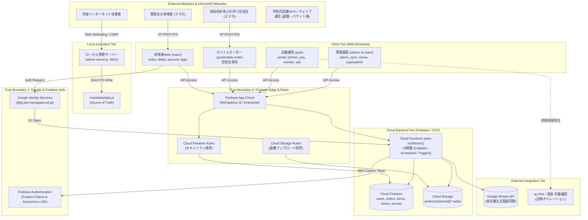
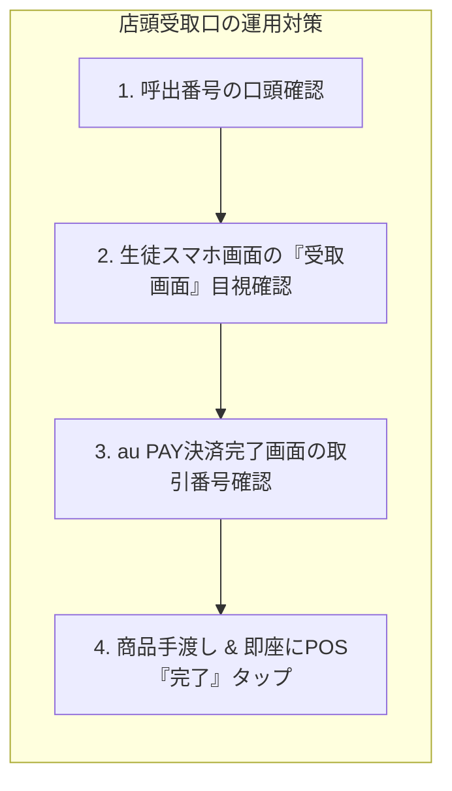

# 南陵祭2026 システム総合セキュリティ監査報告書
**Overall Security Audit & Threat Modeling Report**

- **文書番号**: SEC-REPORT-2026-00
- **作成日**: 2026年9月9日
- **統括責任者**: 全体セキュリティ統括指揮官 (Lead Security Architect)
- **監査体制**: 全体セキュリティ統括指揮官 ＋ 5専門監査領域（Rules, Backend, POS/Order, Public Web, Infra）
- **対象システム**: 南陵祭2026 公式Webポータル、POS・モバイルオーダーシステム、管理ツール、Cloud Functions、Firebaseインフラ
- **準拠方針**: ゼロトラストセキュリティ、モバイルファースト、プライバシーバイデザイン（V4 ゼロナレッジアーキテクチャ）

---

## 1. エグゼクティブサマリー (Executive Summary)

### 1.1 総合リスク判定

```
┌────────────────────────────────────────────────────────┐
│             総合リスク判定: 【 🚨 HIGH (重大な懸念あり) 】           │
│  ※ 検出された Critical/High 脆弱性を放置した状態での本番稼働は不可   │
└────────────────────────────────────────────────────────┘
```

南陵祭2026システムは、Google Identity Services (GIS) による匿名UID生成（V4ゼロナレッジ認証）や App Check の導入、Cloud Functions を介したサーバーサイド決済・ステータス管理など、先進的で野心的なセキュリティ設計思想を備えています。

しかしながら、全体アーキテクチャおよび各コンポーネントの実装を包括的に監査した結果、**「単体では軽微に見える弱点が、複数ドメインの連携により致命的な破壊力を持つ複合脆弱性」** や、**「文化祭特有のリアル現場環境（ネットワーク混雑、店頭オペレーションの隙、高校生の技術的好奇心・いたずら）に耐えられない構造的欠陥」** が多数特定されました。

特に、以下の3点は学校祭の開催自体を危機に陥れかねない最重要懸念事項です：
1. **モバイルオーダーの完全麻痺（DoS）**: レースコンディション、注文数量上限の欠如、受付番号（1,000件）の枯渇脆弱性により、容易に全校生徒の注文を停止させることが可能。
2. **サプライチェーン・マスタデータ改ざん**: ローカル管理サーバー（`admin-server.js`）の未認証・CSRF脆弱性を突き、外部Webサイトから `data.js` を不正書き換えし、全来場者に悪意あるスクリプト（Stored XSS）を配信可能。
3. **金銭・物資トラブルおよび冤罪BAN**: au PAY手動確認の隙を突いた受取口での商品横取り、および5分放置自動BANの誤爆（冤罪）による生徒との大トラブルリスク。

これらは、本報告書第6章に示すロードマップに基づき、**本番公開前に確実に是正（または運用回避策を適用）する必要があります。**

---

### 1.2 脆弱性統計サマリー

5つの専門監査領域（01: Rules, 02: Functions, 03: POS/Order, 04: Public Web, 05: Infra）から集約された脆弱性の件数および重要度分布は以下の通りです。

| 重要度 (Severity) | 検出件数 | 主な該当項目 |
| :--- | :---: | :--- |
| 🚨 **Critical (緊急)** | **8件** | `orders` 呼出中全公開、`items` 価格改ざん、`storage.rules` サイズ無制限、TOCTOU重複注文、Functions依存ライブラリ30件CVE、KDS画面Stored XSS、緊急アラートStored XSS、ローカル管理サーバー任意コード挿入 |
| 🔴 **High (高)** | **17件** | 会場管理独自認証の総当たり/認可欠如、店舗パスワード総当たり、注文数量上限なし、SOK仮注文ハイジャック、店頭キオスクブラウザ脱出、LocalStorage過信による他店売上漏洩、受付番号推測による商品横取り、Hostingヘッダー/CSP完全欠如、スクリプト内ハードコードシークレット 等 |
| 🟡 **Medium (中)** | **15件** | `users` 任意フィールド注入、クライアント直接削除による不整合、ウォームアップバイパス課金DoS、Google Sheetsクォータ枯渇、オープンリダイレクト、CORSワイルドカード許可、ログアウト時キャッシュ未破棄 等 |
| ⚪ **Low / Info (低・情報)** | **8件** | PBKDF2ストレッチング回数不足、ステージング用テストコレクション残存、App Checkデバッグトークン固定値 等 |
| **合計** | **48件** |  |

---

## 2. システム全体アーキテクチャとアタックサーフェス

### 2.1 システム全体構成図 (High-Level Architecture)



---

### 2.2 信頼境界 (Trust Boundaries: TB)

システム全体を7つの信頼境界に分割し、それぞれの防護レベルを評価しました。

| 境界番号 | 境界名称 | 内部（保護側） | 外部（脅威側） | 現状の防護強度 | 主な懸念事項 |
| :--- | :--- | :--- | :--- | :---: | :--- |
| **TB-1** | 一般来場者境界 | 公開Web・Firestore公開データ | インターネット・来場者端末 | ⚠️ **脆弱** | セキュリティヘッダー完全欠如、Stored XSSによるDOM汚染 |
| **TB-2** | 在校生境界 | モバイルオーダー・注文作成API | 在校生Googleアカウント | ❌ **危険** | 重複注文レースコンディション、数量無制限、受付番号枯渇 |
| **TB-3** | 店舗運用境界 | POS、調理KDS、店舗ポータル | 店舗スタッフ端末・共有iPad | ❌ **危険** | パスワード総当たり、店頭iPad脱出、KDSのXSS |
| **TB-4** | 会場管理境界 | 体育館・音楽室ステージ更新 | 会場管理端末 | ❌ **危険** | 独自認証欠陥、ハードコードシークレット、会場認可欠如 |
| **TB-5** | スーパー管理者境界 | 全体アラート・全店舗緊急停止 | スーパー管理者コンソール | 🟡 **良好** | `isSuperAdminToken` (V4) で厳格保護。端末管理が急所 |
| **TB-6** | ローカル開発・管理境界 | `data.js` (マスタデータ) | 開発者PC・学校内LAN | 🚨 **致命的** | `admin-server.js` の未認証・CORS欠落・CSRF任意上書き |
| **TB-7** | クラウドバックエンド境界 | Firestore, Sheets, Storage | Cloud Functions 内部実行基盤 | ⚠️ **脆弱** | 依存関係に30件の既知脆弱性、Sheetsクォータ枯渇 |

---

### 2.3 認証・認可モデルの構造的分析

#### (1) Google Identity Services (GIS) + V4 匿名UIDモデル
- **長所**: Googleアカウントの `sub` をサーバーサイドで `UID_PEPPER` を用いて HMAC-SHA256 ハッシュ化し、`usr_` + 24文字の匿名UIDを生成。氏名・メールアドレス等の個人情報（PII）をシステムに一切保持しない「プライバシーバイデザイン」を実現。
- **短所・トレードオフ**: 一方向ハッシュにより、**「誰が注文したか」を実行委員会や教員が逆引き特定できない（否認防止性の喪失）**。悪質な大量注文や営業妨害が発生した際、生徒指導上の責任追及が困難。

#### (2) Custom Claims モデル
- `identity: 'student' | 'guest' | 'super_admin'`
- `role: 'store_admin'`, `storeId: '...'`
- **構造的弱点**:
  - `loginStore` で店舗ログインすると、呼び出し元ユーザーの UID に `role: 'store_admin'` が恒久的に付与される。**店舗ログアウト機能（クレーム削除）が存在しない**。
  - Firebase Auth の ID トークンは最大1時間キャッシュされるため、権限剥奪の即時反映ができない。

#### (3) 会場管理の独自認証モデル
- Firebase Auth をバイパスし、URLトークンとパスワードを PBKDF2 で検証して `venue_admin_sessions` にセッショントークンを発行。
- **構造的弱点**: セッショントークンに有効期限（TTL）がなく永久に有効。また、`updateVenueStatus` が渡されたセッショントークンと `venueId` の紐付けを検証していないため、1会場のトークンで全会場のステータスが改ざん可能。

#### (4) App Check の限界
- ReCaptcha v3 / Enterprise による Bot・スクレイピング抑止。
- **限界**: 正規のブラウザ（生徒のスマホや店頭PC）上で実行される攻撃（コンソールからのスクリプト実行、正規セッション上の悪意ある操作）に対しては、正規の App Check トークンが付与されるため**一切の防御壁にならない**。

---

## 3. 文化祭特有の脅威モデリング (STRIDE分析)

高校の文化祭という特殊環境を前提に、STRIDEモデルに基づく脅威分析を実施しました。

```
【文化祭特有の環境前提】
・数千人の来場者・生徒が一斉通信し、学校Wi-Fiおよびキャリア回線が極度に混雑（パケットロス・高遅延）
・生徒はITリテラシーが高く、DevToolsやコンソールを使った「いたずら・技術試し」の動機が強い
・店舗スタッフ（高校生）はLINE等のオープンなチャットでパスワードを共有しがち
・店頭では共用iPadや生徒の私物端末が混在し、無人状態で放置されるリスクがある
・決済は「au PAY自己申告」または「現金手渡し」という人的オペレーション
```

---

### 3.1 S : Spoofing (なりすまし)

| 脅威ID | 脅威シナリオ | 対象資産 | 発生確率 | 影響度 | 対策状況 |
| :--- | :--- | :--- | :---: | :---: | :---: |
| **S-1** | **店頭呼出番号盗み見による商品横取り**<br/>`orders` の呼出中（`ready_for_pickup`）が全公開されており、呼出番号（7000番台）も連番。攻撃者がモニターやAPIで呼出番号を確認し、受取口で「7005番です」と名乗って他人の商品を横取りする。 | 商品・売上・生徒信頼 | **極高** | **高** | ❌ 未対策（画面提示等の本人確認フローなし） |
| **S-2** | **店舗管理者なりすまし（パスワード総当たり）**<br/>`loginStore` にレートリミットがないため、クラス名（`store_3_1` 等）に対してスクリプトでパスワードを総当たりし、他店舗の管理者クレームを不正取得する。 | 店舗マスタ・注文情報 | **高** | **高** | ❌ 未対策（ブルートフォース保護完全欠落） |
| **S-3** | **店頭キオスク端末脱出による店舗スタッフなりすまし**<br/>SOK端末（店頭iPad）でブラウザの全画面表示から脱出し、バックグラウンドに残る `portal.html` や `kitchen.html` を操作して注文を勝手に完了・キャンセルする。 | 調理・注文ステータス | **高** | **中** | ❌ 未対策（Guided Access等のキッティング未徹底） |
| **S-4** | **会場管理者なりすまし（ハードコードシークレット悪用）**<br/>リポジトリ内の `setupVenueAdmin.js` にコミットされたパスワードを用いて会場管理にログインし、体育館演目を偽装する。 | 催し物・ステージ進行 | **中** | **高** | ❌ 未対策（平文シークレットがコード上に露出） |

---

### 3.2 T : Tampering (改ざん)

| 脅威ID | 脅威シナリオ | 対象資産 | 発生確率 | 影響度 | 対策状況 |
| :--- | :--- | :--- | :---: | :---: | :---: |
| **T-1** | **ローカル管理サーバー経由のマスタデータ・スクリプト改ざん**<br/>実行委員のPCで起動中の `admin-server.js`（ポート3001）に対し、悪意あるWebサイトから CSRF/DNS Rebinding で `/api/save-data` をPOSTし、`data.js` を任意のJavaScriptに書き換える。 | `data.js` (全システム正本) | **中** | 🚨 **壊滅的** | ❌ 未対策（認証なし、CORSなし、CSRF対策なし） |
| **T-2** | **商品価格・マスタデータの不正書き換え**<br/>`firestore.rules` の `items` コレクション更新ルールにスキーマ検証がなく、店舗管理者が商品の `price` を 1円やマイナスに改ざん可能。身内にタダ同然で商品を販売できる。 | 売上金・商品マスタ | **高** | **高** | ❌ 未対策（Functionsを介さずクライアント直接更新許可） |
| **T-3** | **Cloud Storage への悪意あるファイル差し替え (Stored XSS)**<br/>`storage.rules` が `image/.*` のみ検証しているため、SVGファイルをアップロードしてスクリプトを埋め込み、閲覧者のブラウザで XSS を発火させる。 | 管理ポータル・来場者端末 | **中** | **高** | ❌ 未対策（拡張子・MIME実体検証欠落） |
| **T-4** | **会場ステータス（体育館・音楽室）の無断改ざん**<br/>`updateVenueStatus` がセッショントークンと会場IDの紐付けを検証しないため、音楽室の担当者が体育館の演目ステータスを勝手に変更可能。 | 進行管理・モニター表示 | **高** | **中** | ❌ 未対策（会場ID認可チェックなし） |

---

### 3.3 R : Repudiation (否認)

| 脅威ID | 脅威シナリオ | 対象資産 | 発生確率 | 影響度 | 対策状況 |
| :--- | :--- | :--- | :---: | :---: | :---: |
| **R-1** | **大量いたずら注文の否認（「頼んでいない」）**<br/>生徒がモバイルオーダーで大量注文後、商品を取りに行かず放置。V4ゼロナレッジ設計により暗号学的にUIDから生徒のメールアドレスや氏名を復元できないため、生徒が「自分は注文していない」と否認した際に責任追及が不可能。 | 食材費用・生徒指導 | **極高** | **高** | ⚠️ トレードオフ（匿名性と追跡性の衝突） |
| **R-2** | **au PAY 手動決済の否認（「支払った」「もらっていない」）**<br/>店頭で生徒が「スマホ画面で支払い完了を見せた」と主張し、店舗側が「着金が確認できていない」と対立。決済IDのシステム突合がないため、言った言わないの水掛け論になる。 | 売上金・金銭管理 | **極高** | **中** | ⚠️ オペレーション依存（手動目視確認の限界） |
| **R-3** | **注文強制キャンセル・ステータス操作の否認**<br/>店舗スタッフが操作ミスや故意で注文をキャンセルした際、誰が操作したかの監査ログ（操作者UID・端末識別子）が注文履歴に記録されない。 | 注文履歴・スプレッドシート | **中** | **中** | ❌ 未対策（更新操作者のログ欠落） |

---

### 3.4 I : Information Disclosure (情報漏洩)

| 脅威ID | 脅威シナリオ | 対象資産 | 発生確率 | 影響度 | 対策状況 |
| :--- | :--- | :--- | :---: | :---: | :---: |
| **I-1** | **呼出中注文の未認証・全フィールド露出**<br/>`firestore.rules` で `ready_for_pickup` の注文が誰でも一覧取得可能。他人の注文品目、金額、呼出番号、匿名UIDが第三者に筒抜け。店舗の客単価やリアルタイム売上が外部から丸見え。 | 注文情報・プライバシー | **極高** | **高** | ❌ 未対策（monitor.html用の全公開が広大すぎる） |
| **I-2** | **店舗スプレッドシートURL・売上データの全漏洩**<br/>`stores/{storeId}` ドキュメントに `spreadsheetUrl` が保存され全公開されているため、共有設定が不適切な場合、全注文履歴・売上集計が世界中に漏洩する。 | 全校売上・財務データ | **高** | **高** | ❌ 未対策（公開コレクションに管理用URLを同居） |
| **I-3** | **緊急停止・ペナルティ安全弁の運用情報漏洩**<br/>`_metadata/system_alerts` が未認証で誰でも読み取れるため、ペナルティ無効化（`penaltyEnabled: false`）や緊急停止状態が攻撃者に筒抜けとなり、攻撃の好機を特定される。 | システム運用メタデータ | **高** | **中** | ❌ 未対策（管理者専用メタデータが全公開） |

---

### 3.5 D : Denial of Service (サービス妨害)

| 脅威ID | 脅威シナリオ | 対象資産 | 発生確率 | 影響度 | 対策状況 |
| :--- | :--- | :--- | :---: | :---: | :---: |
| **D-1** | **受付番号枯渇攻撃によるモバイルオーダー完全停止**<br/>`getNextReceiptNumber` のモバイル用発番範囲が 7000〜7999（1,000件）。後述のTOCTOU並列注文等を使い、アクティブな注文で1,000番号を埋めると、全校生徒の注文が `resource-exhausted` で永久に失敗する。 | モバイルオーダー全体 | **高** | 🚨 **致命的** | ❌ 未対策（発番プール枯渇時の自動回収・循環設計なし） |
| **D-2** | **TOCTOU 並列リクエストによる重複架空注文（厨房パンク）**<br/>`createOrder` の重複注文チェックがトランザクション外にあるため、1秒間に複数リクエストを並列送信して何十件もの注文を成立させ、厨房のキャパシティを破壊する。 | 調理場オペレーション・食材 | **極高** | 🚨 **致命的** | ❌ 未対策（アトミックなロック機構欠如） |
| **D-3** | **数量無制限注文（10,000個注文）による食材・業務麻痺**<br/>`item.quantity` に上限値チェックがないため、「たこ焼き 5,000個」といった注文が通り、食材とオペレーションが破綻する。 | 食材在庫・注文管理 | **極高** | 🚨 **致命的** | ❌ 未対策（数量の上限バリデーション欠如） |
| **D-4** | **ウォームアップバイパスを利用した課金爆発（Financial DoS）**<br/>`{"data": {"warmup": true}}` を送信すると App Check や認証をバイパスして即座にリターンするが、Functions インスタンスは起動するため、大量連打により課金を急増させられる。 | GCP課金・クラウドアカウント | **中** | **中** | ❌ 未対策（認証なしエンドポイントの露出） |
| **D-5** | **冤罪自動BAN（5分放置ルール）による生徒パニック**<br/>受取口の物理的混雑や通信不調で呼び出しから5分が経過し、罪のない生徒が自動的に `banned_users` に登録され、当日二度と注文できなくなる。 | 生徒体験・学校祭運営 | **極高** | **高** | ⚠️ 設計上の時限爆弾（現場混雑への耐性なし） |

---

### 3.6 E : Elevation of Privilege (権限昇格)

| 脅威ID | 脅威シナリオ | 対象資産 | 発生確率 | 影響度 | 対策状況 |
| :--- | :--- | :--- | :---: | :---: | :---: |
| **E-1** | **一般生徒から店舗管理者への権限昇格**<br/>`loginStore` で店舗パスワードを突破（総当たりまたは共有LINEからの漏洩）すると、該当生徒のUIDに `role: 'store_admin'` が付与され、商品改ざんや注文操作が可能になる。 | 店舗管理特権 | **高** | **高** | ❌ 未対策（多要素認証なし、失効機構なし） |
| **E-2** | **会場管理セッションの水平権限昇格**<br/>1つの会場（例: 音楽室）のセッショントークンを入手した攻撃者が、`updateVenueStatus` の引数 `venueId` を変えることで、体育館など全会場のステータスを操作可能になる。 | 全会場ステータス管理 | **高** | **高** | ❌ 未対策（セッションに会場スコープがない） |
| **E-3** | **緊急アラート Stored XSS による全権限ハイジャック**<br/>`app-shell.js` の脆弱性（後述）により、アラートメッセージに混入したスクリプトが SuperAdmin のブラウザでも実行され、管理者セッションが奪われる。 | SuperAdmin 特権 | **中** | 🚨 **壊滅的** | ❌ 未対策（アラート表示が `innerHTML` で未エスケープ） |

---

## 4. 全領域統合脆弱性カタログ (Consolidated Catalog)

5つの専門監査レポート（01〜05）から抽出・正規化した全脆弱性の一覧です。

| 統合ID | 重要度 | 区分 | 脆弱性名称・対象ファイル | CWE | 影響概要 |
| :--- | :---: | :---: | :--- | :---: | :--- |
| **SEC-01** | 🚨 Critical | Web / XSS | `app-shell.js` 緊急アラート描画の Stored XSS | CWE-79 | `mainAlertMessage` を `innerHTML` で全画面展開。管理画面汚染時に全ユーザーへ波及 |
| **SEC-02** | 🚨 Critical | Rules | `items` コレクションの価格バリデーション完全欠落 | CWE-20 | 店舗管理者が `price` を1円やマイナスに改ざん可能（直接Firestore更新） |
| **SEC-03** | 🚨 Critical | Storage | `storage.rules` ファイルサイズ制限の完全欠落 | CWE-400 | 巨大ファイル無制限アップロードによるストレージ枯渇・課金爆発 (DoS) |
| **SEC-04** | 🚨 Critical | Backend | `createOrder` 重複注文チェックの TOCTOU レースコンディション | CWE-367 | 並列リクエストにより1アカウントから数十件の未払い架空注文を作成可能 |
| **SEC-05** | 🚨 Critical | Infra | `admin-server.js` の未認証・CORSなし・ローカルCSRF任意コード挿入 | CWE-94 | 外部Web閲覧からローカル `data.js` を不正上書き、Stored XSSやサプライチェーン攻撃 |
| **SEC-06** | 🚨 Critical | Backend | `functions/package.json` における 30件の既知依存脆弱性 | CWE-1395 | Axios, Google API等の高リスクCVE残存 |
| **SEC-07** | 🚨 Critical | Infra | `setupVenueAdmin.js` 内の本番認証シークレット平文コミット | CWE-798 | 会場管理パスワードおよびPBKDF2ソルトがリポジトリ内に露出 |
| **SEC-08** | 🚨 Critical | POS / XSS | `kitchen.html` / `pos.html` の商品名・カスタマイズ未エスケープ | CWE-79 | 注文データにスクリプトを混入させ、調理場iPadや店頭POSをDOM XSSで乗っ取り |
| **SEC-09** | 🔴 High | Rules | `orders` 呼出中（`ready_for_pickup`）注文の全公開 | CWE-200 | 未認証で呼出中全注文を取得可能。内容・金額・UID漏洩、商品横取りの温床 |
| **SEC-10** | 🔴 High | Backend | `createOrder` / `createSokProvisional` 注文数量上限の未検証 | CWE-20 | `quantity: 10000` などの極端な数量が注文可能（食材・調理パンク） |
| **SEC-11** | 🔴 High | Backend | `loginStore` のブルートフォース攻撃対策（レートリミット）欠落 | CWE-307 | 店舗パスワードを総当たりで突破可能 |
| **SEC-12** | 🔴 High | Backend | `loginVenueAdmin` / `updateVenueStatus` の独自認証欠陥・認可欠如 | CWE-287 | 会場管理セッションに有効期限なし、他会場ステータス改ざん可能 |
| **SEC-13** | 🔴 High | Backend | 受付番号（7000〜7999）発番プール枯渇による注文不能 (DoS) | CWE-400 | 1,000件のアクティブ注文で発番が停止し、モバイルオーダー全体が停止 |
| **SEC-14** | 🔴 High | Rules | SOK（キオスク）pending仮注文の未認証閲覧と注文ハイジャック | CWE-284 | 他人の未確定注文IDを知ることで内容閲覧・確定横取りが可能 |
| **SEC-15** | 🔴 High | Rules | `stores` コレクションにおけるスプレッドシートURL全公開 | CWE-200 | 全校店舗の注文スプレッドシートURLが誰でも閲覧可能 |
| **SEC-16** | 🔴 High | POS | 店頭キオスク端末（SOK iPad）のブラウザ脱出と特権奪取 | CWE-250 | 店舗管理者権限を保持したまま店頭設置、脱出されて管理画面操作 |
| **SEC-17** | 🔴 High | POS | `portal.html` の LocalStorage 過信による他店売上・設定漏洩 | CWE-200 | 端末の共有利用時に前店舗のデータが画面にキャッシュ露出 |
| **SEC-18** | 🔴 High | POS | 受付番号推測と au PAY 手動目視確認の隙による商品横取り | CWE-840 | 7000番台連番と画面見せかけにより、未払いで商品を騙し取り |
| **SEC-19** | 🔴 High | Web | `detail.html` 企画詳細・画像URL経由の Stored XSS | CWE-79 | `data.js` 内の悪意あるHTMLタグが未エスケープでレンダリング |
| **SEC-20** | 🔴 High | Web | 外部リンク属性への `javascript:` 疑似スキーム注入 | CWE-79 | 企画SNSリンク等をクリックすると任意スクリプト実行 |
| **SEC-21** | 🔴 High | Web / Infra | Firebase Hosting ヘッダーおよび Content Security Policy (CSP) 完全欠如 | CWE-1188 | XSSやクリックジャッキングへのブラウザ側最終防御壁が存在しない |
| **SEC-22** | 🔴 High | Storage | `storage.rules` の `image/.*` 許可による SVG アップロード Stored XSS | CWE-434 | 悪意あるSVG画像がアップロードされ、ドメイン配下でスクリプト実行 |
| **SEC-23** | 🔴 High | Backend | SOK注文確定（`confirmSokOrder`）の重複注文チェック欠落 | CWE-840 | SOK端末から同一生徒による多重確定が可能 |
| **SEC-24** | 🔴 High | Backend | Google Sheets API クォータ枯渇による毎分同期遅延・停止 | CWE-400 | 1分ごとの全店舗一斉同期で Google API レート制限（300 req/min）超過 |
| **SEC-25** | 🔴 High | Operation | 5分放置自動BAN（`abandonStaleOrders`）の冤罪発動リスク | CWE-840 | 混雑による受取遅延で罪のない生徒が当日利用禁止（大クレーム） |
| **SEC-26** | 🟡 Medium | Rules | `users` コレクション `{document=**}` によるサブコレクション保護破綻 | CWE-284 | カート以外の任意の未知サブコレクションを作成可能 |
| **SEC-27** | 🟡 Medium | Rules | `users` コレクションのスキーマ検証欠落による DoS | CWE-400 | 巨大な `fcmTokens` 配列を書き込んでドキュメントサイズ上限（1MB）圧迫 |
| **SEC-28** | 🟡 Medium | Rules | `users` ドキュメントのクライアント直接 `delete` 許可 | CWE-284 | 退会Functionを経由せず直接削除でき、注文データとの整合性破綻 |
| **SEC-29** | 🟡 Medium | Rules | `counters` コレクションに対する全店舗管理者の過剰読み取り | CWE-200 | 自店舗以外の発番カウンタを監視して他店の売上ペースを推測可能 |
| **SEC-30** | 🟡 Medium | Rules | `_metadata`（運用アラート・安全弁）の未認証全公開 | CWE-200 | ペナルティ無効化フラグや緊急停止状態が外部に露出 |
| **SEC-31** | 🟡 Medium | Backend | ウォームアップバイパスロジックによる課金 DoS | CWE-400 | 認証なしでインスタンス起動を誘発し、Cloud Functions 課金を浪費 |
| **SEC-32** | 🟡 Medium | Backend | `loginStore` 平文パスワード判定の残存 | CWE-256 | 旧仕様の平文パスワードが残っている場合のセキュリティ低下 |
| **SEC-33** | 🟡 Medium | Backend | `customizations` 配列の型・長手検証欠如 | CWE-20 | 巨大文字列の注入によるスプレッドシート同期エラーや画面崩れ |
| **SEC-34** | 🟡 Medium | Web | `login.html` オープンリダイレクト (`//evil.com` 回避不備) | CWE-601 | プロトコル相対URLを用いた外部フィッシングサイトへの誘導 |
| **SEC-35** | 🟡 Medium | Web | `admin_sync.html` フロントエンド依存のアクセス制御 | CWE-602 | ページURLを知っていれば管理UIが表示され、店舗パスワード生成則が露出 |
| **SEC-36** | 🟡 Medium | Web | ログアウト時の LocalStorage / キャッシュ未破棄 | CWE-613 | 端末共有時に前の利用者の注文状態やプロフィールが残存 |
| **SEC-37** | 🟡 Medium | Infra | Cloud Storage `cors.json` のワイルドカード `["*"]` 許可 | CWE-942 | 悪意ある外部Webサイトからのリソース読み取り・悪用 |
| **SEC-38** | 🟡 Medium | Infra | 運用スクリプト（`cleanupAndSyncOfficialData.js` 等）の誤爆リスク | CWE-862 | 本番環境で実行するとFirestore全データが即時一括消去される危険性 |
| **SEC-39** | 🟡 Medium | Backend | `sendOrderUpdateNotification` FCMトークン過多によるクラッシュ | CWE-400 | 500件超のトークンで Firebase Admin Messaging がエラー中断 |
| **SEC-40** | 🟡 Medium | Rules | Custom Claims (`store_admin`) トークン失効遅延（最大1時間） | CWE-613 | パスワード変更や店舗交代後も、旧トークンで1時間は不正操作可能 |

---

## 5. クロスドメイン複合脆弱性シナリオ (Cross-Domain Exploit Scenarios)

単一の弱点ではなく、複数のドメイン（Rules、Backend、Client、Infra）にまたがる弱点が連鎖することで成立する、実戦的な破壊シナリオを分析します。

### シナリオ 1: 「開発者端末ローカルCSRF 経由のサプライチェーン攻撃 ＆ 全来場者ハイジャック」
```
【連鎖する脆弱性】
[SEC-05] admin-server.js の未認証・ローカルCSRF
   ＋ [SEC-01] app-shell.js / [SEC-19] detail.html の Stored XSS
   ＋ [SEC-21] Content Security Policy (CSP) の欠如
```
1. **侵入**: 実行委員が自室や生徒会室で `npm run admin`（`admin-server.js` :3001）を起動したまま、ブラウザでDiscordやSNS、学校掲示板を閲覧。
2. **攻撃発動**: 攻撃者が仕掛けた悪意あるWebページを踏むと、バックグラウンドのJavaScriptが `http://localhost:3001/api/save-data` に対し、悪意あるスクリプト（Cookie/トークン窃取、偽ログイン画面ポップアップ）を含んだ `projectData` を POST 送信。
3. **汚染**: `admin-server.js` は認証・Origin検証を行わず、ローカルの `main/data/data.js` を不正コード付きで上書き保存。
4. **拡散**: 実行委員が気づかず Git コミット＆プッシュ、または本番デプロイを実行。
5. **被害**: CSP が存在しないため、公式Webサイトを訪れた数千人の一般来場者および生徒のブラウザで悪意あるスクリプトが一斉に実行され、Googleアカウントセッションの奪取やフィッシング詐欺が発生（学校祭の社会的信用が崩壊）。

---

### シナリオ 2: 「店舗パスワード総当たり ＋ Rules価格バリデーション欠落による1円買い占め」
```
【連鎖する脆弱性】
[SEC-11] loginStore のブルートフォース保護欠如
   ＋ [SEC-02] items コレクションの価格スキーマ検証欠落 (firestore.rules)
   ＋ [SEC-10] createOrder の注文数量上限未検証
```
1. **侵入**: 悪意ある生徒が、公開されている店舗ID（例: `store_2_3`）に対し、`loginStore` Function へ辞書攻撃スクリプトを実行。レートリミットがないため数分で店舗パスワードを特定。
2. **特権取得**: 生徒のアカウントに `role: 'store_admin'`, `storeId: 'store_2_3'` の Custom Claims が付与される。
3. **データ改ざん**: `firestore.rules` では店舗管理者に対して `items` の直接 `update` が許可されており、価格の正値検証がないため、人気商品（通常400円）の `price` を「1円」に書き換える。
4. **不正購入**: 自身の生徒アカウント（または仲間のアカウント）から `createOrder` を呼び出し、1円で100個（合計100円）を注文。
5. **被害**: 店舗側は正規の注文として受け付けてしまい、食材を大量消費。売上金が激減し、クラス間で深刻な金銭トラブル・警察沙汰に発展。

---

### シナリオ 3: 「TOCTOU レースコンディション ＋ 受付番号枯渇によるモバイルオーダー全壊」
```
【連鎖する脆弱性】
[SEC-04] createOrder の重複注文チェック TOCTOU レースコンディション
   ＋ [SEC-13] 受付番号（7000〜7999）発番プール枯渇
   ＋ [SEC-25] au PAY 手動決済（未払いでの注文成立）
```
1. **攻撃発動**: 悪意ある生徒が、ブラウザの開発者コンソールから `createOrder` に対し、100件の並列非同期リクエストを同時に送信。
2. **競合突破**: `createOrder` 内の `activeOrderSnap.empty` チェックはトランザクション外にあるため、100件のリクエストすべてが「受付中の注文なし」と判定され、チェックを通過。
3. **大量注文成立**: トランザクション内で100件すべての注文が作成され、それぞれ受付番号（例: 7001〜7100）を消費。
4. **番号枯渇 (DoS)**: 複数の生徒アカウントやスクリプトを連動させ、7000〜7999（1,000件）の番号をアクティブな注文で埋め尽くす。
5. **被害**: `getNextReceiptNumber` が `resource-exhausted` エラーをスローするようになり、**全校生徒のモバイルオーダーが完全に停止**。調理場には数百件の架空注文票が届き、現場パニックが発生。

---

### シナリオ 4: 「Rules呼出中全公開 ＋ 受付番号連番推測による商品横取り（食い逃げ）」
```
【連鎖する脆弱性】
[SEC-09] orders コレクション ready_for_pickup の未認証全公開
   ＋ [SEC-18] 受付番号連番推測 & au PAY 手動目視確認の隙
```
1. **情報収集**: 攻撃者がスマホから Firestore SDK を叩き、`orders` コレクションから `status == "ready_for_pickup"` の注文をリアルタイム購読。
2. **獲物の特定**: 「やきそば大盛り 2個、受付番号 7042」が呼び出し状態になったことを手元のスマホで即座に検知。
3. **なりすまし受取**: 正規の注文者が受取口に到着する前に、受取口へ行き「7042番です！」と元気に名乗る。
4. **目視確認の突破**: 店頭スタッフ（高校生）は混雑のあまり画面の注文番号と商品を手渡し、au PAYの支払い完了画面の精査を怠る（または「先ほど支払いました」と主張される）。
5. **被害**: 攻撃者が商品を騙し取って逃走。数分後に本物の注文者が来た時には「既に提供済み」となっており、生徒間のトラブル・店舗の二重調理負担が発生。

---

### シナリオ 5: 「会場管理シークレット漏洩 ＋ 認可欠如による体育館ステージ進行妨害」
```
【連鎖する脆弱性】
[SEC-07] setupVenueAdmin.js の本番シークレット平文コミット
   ＋ [SEC-12] updateVenueStatus のセッション有効期限なし＆会場認可欠如
```
1. **情報入手**: 生徒や外部者が GitHub リポジトリから `functions/setupVenueAdmin.js` を閲覧し、初期URLトークンとパスワードを入手。
2. **ログイン**: `admin/venue.html?token=...` からログインし、有効なセッショントークンを取得。
3. **水平権限昇格**: 自身に割り当てられたのが「音楽室」であっても、`updateVenueStatus` の呼び出し引数に `venueId: "gymnasium"`（体育館）を指定。Functions 側で会場IDの所有権チェックがないため、リクエストが受理される。
4. **改ざん**: 体育館のメインステージ（軽音ライブやダンス部発表）のステータスを勝手に「ended（終了）」や無関係な演目IDに書き換える。
5. **被害**: 来場者ポータルや校内モニターのステージ情報がデタラメになり、観客の誘導混乱、出演生徒の発表機会損失という重大な運営妨害が発生。

---

## 6. 優先度別是正ロードマップ (Actionable Remediation)

文化祭本番までの限られた開発リソースを鑑み、リスクの致命度と実装難易度を評価した4段階のロードマップを提示します。

```
【優先度定義】
・フェーズ 1 (P0 / Critical): 本番公開前に修正必須。放置した場合、システム崩壊または情報漏洩に直結。
・フェーズ 2 (P1 / High): 本番運用前に修正必須。現場オペレーションの麻痺や金銭トラブルを防ぐ。
・フェーズ 3 (Workarounds): コード修正が間に合わない場合の現場運用・人的セキュリティルール。
・フェーズ 4 (P2 / Medium): 本番後または時間的猶予がある場合の恒久的な堅牢化。
```

---

### 6.1 フェーズ 1: 【P0】即時是正・本番稼働ブロック必須（最優先）

| 項目番号 | 是正対象 | 具体的な修正内容 | 担当領域 | 難易度 |
| :--- | :--- | :--- | :---: | :---: |
| **P0-1** | `admin-server.js` | ① `127.0.0.1` に明示的バインド。<br/>② カスタム認証ヘッダー（ランダム生成のシークレットトークン）を必須化。<br/>③ POST時に `Origin` / `Referer` ヘッダーが `http://localhost:3001` であることを厳格検証。 | Infra | 低 |
| **P0-2** | `firestore.rules` | ① `items` の `update` 条件に価格検証（`request.resource.data.price is int && request.resource.data.price >= 0`）を追加。<br/>② `orders` の `ready_for_pickup` 全公開を廃止し、`monitor.html` に必要な最小限のフィールドのみを返す専用 Function、または公開用プロキシコレクションに分離。 | Rules | 中 |
| **P0-3** | `storage.rules` | ① `request.resource.size < 5 * 1024 * 1024` (5MB以下) を追加。<br/>② MIMEタイプを `image/webp`, `image/jpeg`, `image/png` に限定し、SVG（`image/svg+xml`）を明示的に禁止。 | Storage | 低 |
| **P0-4** | `functions/index.js`<br/>(`createOrder`) | ① `db.runTransaction` 内で重複注文チェックを実行（TOCTOU解消）。<br/>② 注文数量上限チェック（`item.quantity <= 10` かつ 1注文の総数量 `<= 20`）を強制。 | Backend | 中 |
| **P0-5** | `app-shell.js`<br/>`kitchen.html` | ① 緊急アラート表示を `innerHTML` から `textContent`（または安全なDOM構築）に変更。<br/>② 厨房KDS画面で商品名・カスタマイズ内容を展開する際、必ずエスケープ処理を通す。 | Web / POS | 低 |
| **P0-6** | 機密情報クリーンアップ | ① `setupVenueAdmin.js` 等からハードコードシークレットを完全削除し、Secret Manager または環境変数に移行。<br/>② Git 履歴上の機密コミットをパージまたはトークンを即時再生成。 | Infra | 中 |

---

### 6.2 フェーズ 2: 【P1】本番前必須修正（高優先度）

| 項目番号 | 是正対象 | 具体的な修正内容 | 担当領域 | 難易度 |
| :--- | :--- | :--- | :---: | :---: |
| **P1-1** | `loginStore` | 店舗IDごとの失敗回数を Firestore またはメモリでカウントし、5回連続失敗で15分間ロックアウトするレートリミットを導入。平文フォールバックの完全削除。 | Backend | 中 |
| **P1-2** | `getNextReceiptNumber` | モバイル用発番範囲を拡大（例: 7000〜8999）し、完了・キャンセルから30分経過した番号を再利用可能とするクリーンアップ・循環ロジックを実装。 | Backend | 中 |
| **P1-3** | 会場ステータス管理 | ① セッショントークンに有効期限（発行から12時間）を設定。<br/>② セッションドキュメントに `venueId` を紐付け、`updateVenueStatus` 実行時に操作対象会場と一致するか検証。 | Backend | 中 |
| **P1-4** | `firebase.json` | `hosting` セクションを定義し、Content-Security-Policy (CSP)、Strict-Transport-Security (HSTS)、X-Frame-Options: DENY、X-Content-Type-Options: nosniff を適用。 | Infra | 低 |
| **P1-5** | `stores` コレクション | `spreadsheetUrl` / `spreadsheetId` を公開の `stores` から非公開コレクション（`store_secrets`）または別ドキュメントに移動。 | Rules / Backend | 中 |
| **P1-6** | `abandonStaleOrders` | 5分自動BANの執行前に、FCMプッシュ通知で「受取期限まであと2分」のアラートを送信し、現地が混雑している場合は管理画面から一括でペナルティを一時停止できるよう `system_alerts.penaltyEnabled` を確実に運用連動。 | Backend / Ops | 低 |

---

### 6.3 フェーズ 3: 【Workarounds】現場運用・人的セキュリティルール（運用回避策）

コード修正に加えて、文化祭当日の現場で徹底すべき人的・物理的セキュリティ対策です。



1. **店頭商品横取り防止フロー**:
   - 口頭で「7042番です」と言われただけでは絶対に商品を渡さない。
   - 必ず **生徒自身のスマートフォン上の「受取画面（緑色のチェックマークとアニメーション）」を目視確認** する。
   - スクリーンショットによる使い回しを防ぐため、画面をスクロールさせるか、現在時刻が表示されていることを確認する。
2. **店頭キオスク（SOK iPad）のキッティング徹底**:
   - iPad の **「アクセスガイド (Guided Access)」機能** を必ず有効化し、ホームボタン・電源ボタン・スワイプジェスチャを無効化してブラウザから脱出できないようにロックする。
   - Safari の URL バーや設定ボタンへのタップ領域を無効化する。
3. **店舗パスワードの管理徹底**:
   - パスワードはクラスのLINEグループ等に平文で貼らない。
   - シフトに入るチーフ・副チーフのみが記憶・管理し、一般生徒の私物端末からはログインさせず、店頭専用端末のみでログイン状態を維持する。
4. **混雑時のペナルティ緊急停止ルール**:
   - 雨天時やピーク時間帯（12:00〜13:30）など、受取口に行列ができて5分以内の受取が困難になった場合、実行委員本部は直ちに `superadmin.html` から **「ペナルティ自動執行を一時停止」** する。

---

### 6.4 フェーズ 4: 【P2】中長期改善（恒久的な堅牢化）

1. **依存ライブラリのメジャーアップデート**: `functions/package.json` およびルートの `package.json` において、`npm audit fix` およびメジャーバージョンの追従テストを実施。
2. **決済ゲートウェイの完全API連携**: 将来的な AirPay / オンライン決済 API の導入による、手動目視確認の全廃。
3. **監査ログ専用コレクションの構築**: 誰がどの端末からいつステータスを変更したかを追跡する `audit_logs` コレクションの導入。

---

## 7. 統括指揮官の最終所見と結論

南陵祭2026プロジェクトは、高校の文化祭システムとしては類を見ないほど高度な設計思想（ゼロトラスト、GIS V4匿名UID、Firestoreトランザクション、PWA対応）を持って開発されています。開発に携わったエンジニア陣の技術力と挑戦は極めて高く評価されるべきものです。

しかしながら、**「セキュリティは最も弱い鎖の輪で強度が決まる」** という鉄則の通り、どれほど暗号学的に安全な匿名UIDを採用していても、呼出中注文が誰でも一覧取得できたり、ローカル管理サーバーが外部からCSRFで書き換え可能であったり、KDS画面にエスケープ漏れがあれば、システム全体が容易に瓦解します。

文化祭は、生徒にとって一生の思い出となる一大イベントです。システム障害やセキュリティ事故によって模擬店の営業が止まり、生徒たちの努力が無に帰すような事態は絶対に防がなければなりません。

本報告書で指摘した **【フェーズ 1 (P0)】の是正項目は、本番運用開始前の「絶対防衛ライン」** です。開発チーム・実行委員会が一致団結し、これらの脆弱性を迅速に解消されることを強く求めます。

---
**「生徒も来場者も使いやすく、そして何よりも安全に」**
南陵祭2026の成功を心より祈念いたします。

*(以上、全体セキュリティ統括指揮官 総合監査報告書 完)*
