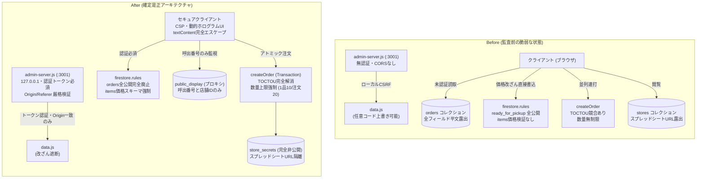
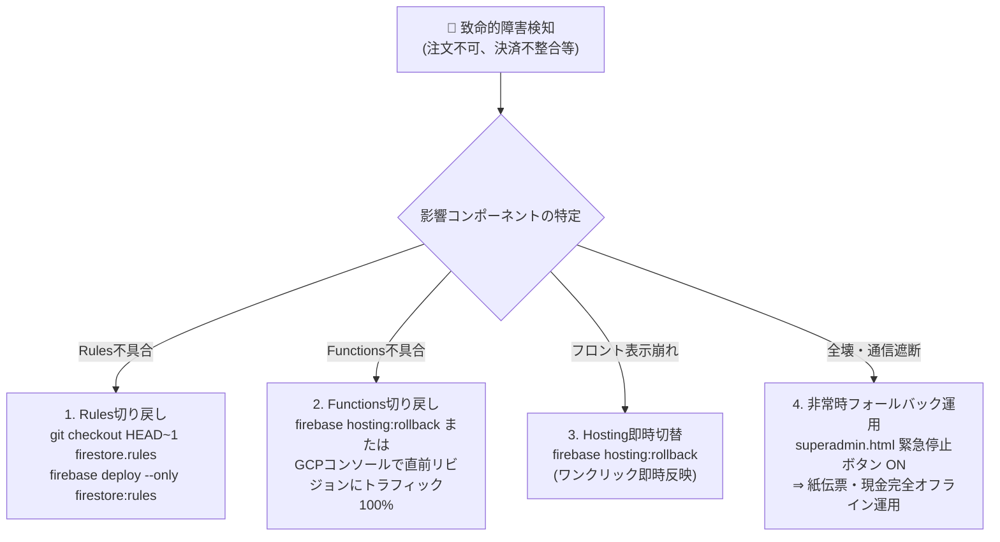

# 南陵祭2026 脆弱性是正・仕様変更全体計画書
**Master Specification Change & Remediation Plan**

- **文書番号**: SEC-PLAN-2026-10
- **作成日**: 2026年9月9日
- **策定責任者**: 全体セキュリティ統括指揮官 (Lead Security Architect)
- **連携文書**:
  - `設計図/data/脆弱性/00_総合脆弱性監査報告書.md`（総合脆弱性監査報告書）
  - `設計図/data/脆弱性/11_仕様変更_Firebaseセキュリティルール及びデータモデル.md`（Rules & Schema）
  - `設計図/data/脆弱性/12_仕様変更_CloudFunctions及び注文決済ロジック.md`（Functions & Backend）
  - `設計図/data/脆弱性/13_仕様変更_POS_KDS_店頭受取オペレーション.md`（POS & Store Operations）
  - `設計図/data/脆弱性/14_仕様変更_来場者Webポータル及びフロントエンド.md`（Public Web & Frontend）
  - `設計図/data/脆弱性/15_仕様変更_管理インフラ_開発サーバー_運用保守.md`（Infra & Operations）
- **対象システム**: 南陵祭2026 全体システム（main, pos, functions, firestore.rules, storage.rules, admin-server.js）

---

## 1. 是正仕様変更の全体像と変更方針（設計思想）

### 1.1 改訂の背景と基本設計方針

南陵祭2026セキュリティ監査（`00_総合脆弱性監査報告書.md`）において特定された **48件の脆弱性**（Critical 8件、High 17件を含む）は、単一の不具合に留まらず、複数ドメインの連携により「モバイルオーダー完全停止（DoS）」「ローカルCSRF経由のマスタデータ改ざん」「店頭商品横取り（食い逃げ）」「冤罪自動BAN」など、学校祭の運営を物理的・システム的に崩壊させる重大リスクを内包していました。

本計画書は、各専門領域で策定された詳細仕様書（11〜15）を統合し、**「本番稼働までに全脆弱性をゼロにし、かつゼロダウンタイムで安全に新仕様へ移行するための総合マスタープラン」** を定義します。

是正にあたり、以下の **3大設計原則** を全領域で徹底します。

```
┌────────────────────────────────────────────────────────────────────────┐
│                   【是正仕様変更の 3大設計原則】                       │
│                                                                        │
│  1. ゼロトラスト防御と多層防御 (Zero Trust & Defense-in-Depth)         │
│     クライアント入力・通信経路・ローカル環境を一切信用しない。         │
│     Rules、Functions、ブラウザ表示の全層で同一の検証・無害化を行う。   │
│                                                                        │
│  2. 完全性と可用性の両立 (Integrity & High Availability)               │
│     排他制御（トランザクション）により二重注文・価格破壊を根絶する一方、│
│     循環採番や集約プロキシにより、高負荷・悪天候・混雑でも停止させない。 │
│                                                                        │
│  3. 現場リアリズムと人的フェイルセーフ (Operational Realism & Failsafe)│
│     高校生スタッフの誤操作、悪意ある横取り、ネットワーク途絶を前提に、 │
│     動的ホログラムUIや二段階警告BANなど、現場が破綻しない仕組みを敷く。 │
└────────────────────────────────────────────────────────────────────────┘
```

---

### 1.2 新旧アーキテクチャ比較（Before / After）



---

## 2. 領域別仕様変更マトリクス

5つの専門領域（11〜15）における具体的な仕様変更内容と対応脆弱性、影響範囲、改修優先度の一覧です。

```
【優先度区分】
・P0 (Critical / 最優先): 本番公開ブロック必須。データ改ざん、システム停止、任意コード実行を防ぐ。
・P1 (High / 高): 本番運用ブロック必須。金銭トラブル、商品横取り、キオスク脱出を防ぐ。
・P2 (Medium / 中): 早期堅牢化。クォータ枯渇、UIキャッシュ残存、依存ライブラリ更新。
```

| 領域 | 仕様書番号 | 変更項目コード | 変更名称・対象 | 対応脆弱性 | 概要・変更内容 | 優先度 |
| :--- | :---: | :---: | :--- | :--- | :--- | :---: |
| **Rules** | 11 | **R-01** | `items` 価格・スキーマ検証強制 | SEC-02 | `price is int && price >= 0` 等のスキーマバリデーションを追加し、1円改ざんを遮断 | **P0** |
| **Rules** | 11 | **R-02** | `storage.rules` 5MB制限＆SVG禁止 | SEC-03, 22 | 5MBサイズ上限追加、MIMEタイプを webp/jpeg/png に限定し SVG Stored XSS を防止 | **P0** |
| **Rules** | 11 | **R-03** | `orders` 呼出中全公開廃止 | SEC-09 | `ready_for_pickup` の全公開を完全撤廃。モニター表示は新設プロキシコレクションへ移設 | **P0** |
| **Rules** | 11 | **R-04** | `stores` スプレッドシートURL隔離 | SEC-15 | `spreadsheetUrl` を `stores` から `store_secrets` へ移動し、未認証情報漏洩を完全遮断 | **P1** |
| **Rules** | 11 | **R-05** | `users` サブコレクション保護 | SEC-26, 27 | `{document=**}` を廃止し `cart` のみ許可。`fcmTokens` 等のサイズ制限追加 | **P2** |
| **Functions** | 12 | **F-01** | `createOrder` TOCTOU解消 | SEC-04 | トランザクション内で `users/{uid}` のアクティブ注文ロックを取得し、並列連打を完全排除 | **P0** |
| **Functions** | 12 | **F-02** | 注文数量・総額上限バリデーション | SEC-10 | 1品あたり最大10個、1注文あたり最大20個、総額上限50,000円の制限を強制 | **P0** |
| **Functions** | 12 | **F-03** | クエリフリー循環採番アーキテクチャ | SEC-13 | 7000〜7999番の発番プールをトランザクション内循環ポインタ方式へ刷新し、枯渇を解消 | **P1** |
| **Functions** | 12 | **F-04** | `loginStore` レートリミット実装 | SEC-11 | 店舗ごとの失敗回数を記録し、5回失敗で15分ロックアウト。平文フォールバック完全削除 | **P1** |
| **Functions** | 12 | **F-05** | 冤罪BAN防止（二段階エスカレーション） | SEC-25 | 5分即時自動BANを廃止。5分で「要受取確認」、スタッフの「受取放棄」確定でのみBAN | **P1** |
| **Functions** | 12 | **F-06** | 会場管理トークンTTL＆会場スコープ | SEC-12 | セッショントークンに有効期限（12時間）と操作可能 `venueId` を紐付け、水平昇格を遮断 | **P1** |
| **Functions** | 12 | **F-07** | ウォームアップバイパスの認証保護 | SEC-31 | ウォームアップ用シークレットヘッダーによる事前検証を導入し、課金DoSを防止 | **P2** |
| **POS** | 13 | **P-01** | 厨房KDS・受渡画面の完全エスケープ | SEC-08 | `kitchen.html` / `pos.html` の商品名・カスタマイズの `innerHTML` を完全廃止（DOM生成化） | **P0** |
| **POS** | 13 | **P-02** | 受取画面「動的認証UI」実装 | SEC-18 | 秒針クロノメーター、CSSホログラム、2桁照合コードを導入し、画面偽造・横取りを完全防止 | **P1** |
| **POS** | 13 | **P-03** | iPad「アクセスガイド」キッティング | SEC-16 | 店頭キオスクiPadのハードウェア・ジェスチャをロックし、ブラウザ脱出と特権奪取を阻止 | **P1** |
| **POS** | 13 | **P-04** | 呼出モニターの新プロキシ購読移行 | SEC-09 | `monitor.html` の参照先を `orders` から軽量集約ドキュメント `public_display` に切替 | **P1** |
| **POS** | 13 | **P-05** | ポータルの `localStorage` 盲信是正 | SEC-17 | 起動時に Custom Claims を強制再検証し、他店舗データのキャッシュ露出を完全排除 | **P1** |
| **Web** | 14 | **W-01** | 緊急アラート安全表示仕様 | SEC-01 | `app-shell.js` のアラート描画を `innerHTML` から安全なDOM構築へ全面置換 | **P0** |
| **Web** | 14 | **W-02** | 企画詳細・マイページのXSS完全防護 | SEC-19, 20 | `detail.html`, `account.html` のURL属性サニタイズ（`javascript:` 禁止）とエスケープ徹底 | **P0** |
| **Web** | 14 | **W-03** | 共通セキュリティモジュール導入 | SEC-01〜20 | 全画面共通の `main/utils/security.js`（エスケープ、URL検証、安全DOM生成）を一元化 | **P0** |
| **Web** | 14 | **W-04** | オープンリダイレクト完全防止 | SEC-34 | `login.html` の `getSafeRedirect()` を刷新し、プロトコル相対URL（`//`）を完全遮断 | **P1** |
| **Web** | 14 | **W-05** | ログアウト時キャッシュ・ストレージ破棄 | SEC-36 | ログアウト時に LocalStorage / SessionStorage を完全消去し、共有端末のデータ残存を防止 | **P2** |
| **Infra** | 15 | **I-01** | `admin-server.js` 堅牢化 | SEC-05 | `127.0.0.1` バインド、起動時生成認証トークン必須化、Origin/Referer 厳格検証 | **P0** |
| **Infra** | 15 | **I-02** | ハードコードシークレット完全削除 | SEC-07 | `setupVenueAdmin.js` 内の認証情報を環境変数/Secret Manager へ移行し Git 履歴パージ | **P0** |
| **Infra** | 15 | **I-03** | ホスティングセキュリティヘッダー設定 | SEC-21 | `firebase.json` に `hosting` セクションを追加し、CSP、HSTS、X-Frame-Options を強制適用 | **P1** |
| **Infra** | 15 | **I-04** | Cloud Storage CORS最小権限化 | SEC-37 | `cors.json` のワイルドカード `["*"]` を廃止し、自ドメインおよびローカルホストに限定 | **P1** |
| **Infra** | 15 | **I-05** | 破壊的運用スクリプトの安全ガード | SEC-38 | `cleanupAndSyncOfficialData.js` 等に環境検証＋対話型タイピング確認プロンプトを導入 | **P1** |
| **Infra** | 15 | **I-06** | 依存パッケージ既知CVEの解消 | SEC-06 | `functions/package.json` 等の脆弱パッケージ（30件）を安全バージョンへ更新・ロック | **P2** |

---

## 3. システム間依存関係と適用順序 (Deployment Phasing)

脆弱性是正の適用において、**「順序を誤るとシステムが即座に動作停止（500エラーや権限エラー）する」** 重大な依存関係が存在します。
例えば、`firestore.rules` で `orders` の `ready_for_pickup` 読取を禁止する前に `monitor.html` を新コレクションへ切り替えないと、校内モニターが真っ白になります。また、`stores` からスプレッドシートURLを削除する前に Functions の参照先を変更しないと、売上集計同期が即時クラッシュします。

以下の依存関係グラフおよびフェーズ順序を厳格に遵守してデプロイを進行します。

### 3.1 適用順序依存関係グラフ (Dependency Graph)

```mermaid
graph TD
    classDef p0 fill:#ffcccc,stroke:#d9534f,stroke-width:2px;
    classDef p1 fill:#fff0d4,stroke:#f0ad4e,stroke-width:2px;
    classDef p2 fill:#d9edf7,stroke:#31708f,stroke-width:2px;

    subgraph "Phase 0: 開発・ローカル環境防護 (即時)"
        I01["I-01: admin-server.js 堅牢化"]:::p0
        I02["I-02: シークレット完全削除"]:::p0
        I05["I-05: 破壊的スクリプトガード"]:::p1
    end

    subgraph "Phase 1: バックエンド基盤 & 新規データモデル準備 (事前展開)"
        F01["F-01: createOrder トランザクション化"]:::p0
        F02["F-02: 数量・総額上限バリデーション"]:::p0
        F03["F-03: クエリフリー循環採番"]:::p1
        F04["F-04: loginStore レートリミット"]:::p1
        F06["F-06: 会場管理セッションTTL"]:::p1
        M01["DB-01: public_display 集約同期 Function"]:::p0
        M02["DB-02: store_secrets へのURL二重書込 (Double-Write)"]:::p1
    end

    subgraph "Phase 2: クライアント画面の全面改修 (新旧両対応)"
        W01["W-01: app-shell 安全化"]:::p0
        W02["W-02: 企画詳細・マイページXSS防護"]:::p0
        W03["W-03: 共通セキュリティモジュール導入"]:::p0
        P01["P-01: KDS・POS画面エスケープ"]:::p0
        P02["P-02: 受取画面 動的認証UI"]:::p1
        P04["P-04: monitor.html を public_display 参照へ切替"]:::p1
        P05["P-05: portal.html Custom Claims検証"]:::p1
        W04["W-04: オープンリダイレクト遮断"]:::p1
    end

    subgraph "Phase 3: セキュリティ境界の完全閉塞 (ルール・ヘッダー本番投入)"
        R01["R-01: items スキーマ強制"]:::p0
        R02["R-02: storage.rules 5MB制限"]:::p0
        R03["R-03: orders 呼出中全公開の完全廃止"]:::p0
        R04["R-04: stores 公開フィールドからURL完全削除"]:::p1
        I03["I-03: firebase.json CSP・ヘッダー本番適用"]:::p1
        I04["I-04: cors.json オリジン制限"]:::p1
    end

    subgraph "Phase 4: 運用ルール徹底 & キッティング (リハーサル)"
        P03["P-03: iPad アクセスガイド設定"]:::p1
        F05["F-05: 冤罪BAN防止運用マニュアル"]:::p1
    end

    %% 依存関係の矢印
    I01 --> Phase1
    I02 --> Phase1
    Phase0 --> Phase1
    
    M01 --> P04
    M02 --> R04
    F01 --> Phase2
    
    P04 --> R03
    W01 & W02 & W03 & P01 --> I03
    Phase2 --> Phase3
    Phase3 --> Phase4
```



---

### 3.2 フェーズ別ロールアウト手順

#### 【フェーズ 0】開発・保守インフラの即時防護（Day 1）
- **目的**: 開発者・実行委員の端末経由での二次汚染・情報漏洩を直ちに防止する。
- **実施手順**:
  1. `admin-server.js` を `127.0.0.1` バインド、起動時生成トークン検証、Origin 検証付きコードへ差し替え。
  2. `functions/setupVenueAdmin.js` 内の平文パスワード・ソルトを削除し、環境変数化。Git履歴を必要に応じてパージ。
  3. `scripts/cleanupAndSyncOfficialData.js` に確認プロンプト（`confirmGuard.js`）を組み込む。

#### 【フェーズ 1】バックエンド・新データパイプラインの事前展開（Day 2〜3）
- **目的**: クライアントやルールを変更する前に、新しいデータモデル（集約モニター、分離シークレット）を裏側で稼働させる。
- **実施手順**:
  1. `functions/index.js` の `createOrder` をトランザクション内排他ロックおよび数量バリデーション付きに更新。
  2. 新規同期トリガー `syncPublicDisplay` をデプロイし、ステータス変更時に `public_display/{storeId}` が自動生成されるようにする。
  3. 既存の `ready_for_pickup` 注文から `public_display` への初回一括バックフィルスクリプトを実行。
  4. `stores` にスプレッドシートURLを書き込んでいる箇所を修正し、`stores` と `store_secrets` の**両方に書き込む（ダブルライト）** 状態にする。

#### 【フェーズ 2】全クライアント画面の改修と配信（Day 4〜5）
- **目的**: XSSを根絶し、新データモデルおよび動的認証UIに対応したフロントエンドを先行配信する。
- **実施手順**:
  1. `main/utils/security.js` を新規追加。
  2. `app-shell.js`, `detail.html`, `account.html`, `login.html` の XSS/オープンリダイレクト脆弱性を修正。
  3. `kitchen.html`, `pos.html` を DOMノード生成型へ改修し XSS を完全解消。
  4. `status.html`, `mobile-order.html` に「秒針クロノメーター＋CSSホログラム＋照合コード」の動的認証UIを組み込む。
  5. `monitor.html` の購読先を `public_display` コレクションへ切り替える。

#### 【フェーズ 3】セキュリティ境界の完全閉塞（Day 6）
- **目的**: クライアントの追従を確認後、古い脆弱なアクセス経路を完全に切断する。
- **実施手順**:
  1. `firestore.rules` を新バージョンへデプロイ：
     - `orders` の `ready_for_pickup` 全公開を削除（本人・店舗管理者・SuperAdminのみに限定）。
     - `items` の `price >= 0` スキーマ検証を有効化。
  2. `storage.rules` を新バージョンへデプロイ（5MB制限、SVG禁止）。
  3. `stores` コレクションの既存ドキュメントから `spreadsheetUrl` / `spreadsheetId` フィールドを一括削除（ダブルライト終了）。
  4. `firebase.json` にセキュリティヘッダー（CSP等）を適用してデプロイ。

#### 【フェーズ 4】現場運用キッティングとリハーサル（Day 7〜試食会）
- 店頭キオスクiPadの「アクセスガイド」設定、受取口オペレーション（受取画面の目視確認）の訓練を実施。

---

## 4. データベース移行・データ構造互換性計画 (Migration & Compatibility)

サービスを停止（メンテナンス画面化）することなく、安全にデータモデルを進化させるための互換性設計と移行手順です。

### 4.1 変更対象コレクションとスキーマ差分

```
【移行対象コレクション一覧】
1. public_display/{storeId}   [NEW]     : モニター用の軽量集約ドキュメント
2. store_secrets/{storeId}    [MODIFY]  : スプレッドシート情報の移設
3. stores/{storeId}           [MODIFY]  : 機密フィールドの安全な削除
4. items/{itemId}             [MODIFY]  : 型・正値の整合性クレンジング
5. users/{uid}                [MODIFY]  : activeOrderId フィールドの導入
```

#### ① 新設: `public_display/{storeId}`
- **目的**: `orders` の `ready_for_pickup` 全公開を廃止するための公開専用プロキシ。
- **構造**:
  ```json
  {
    "storeId": "store_3_1",
    "callingReceiptNumbers": [7002, 7005, 7011],
    "callingCount": 3,
    "updatedAt": "2026-09-09T10:00:00.000Z"
  }
  ```
- **権限**: `allow read: if true; allow write: if false;`（Cloud Functions のみが更新）
- **利点**: 注文詳細、金額、UID、商品名が一切含まれないため、全公開しても情報漏洩リスクがゼロ。

#### ② 機密分離: `stores` → `store_secrets`
- **移行前**: `stores/{storeId}.spreadsheetUrl` が全公開。
- **移行後**: `store_secrets/{storeId}.spreadsheetUrl` に格納（読み書きクライアント完全拒否）。

#### ③ 排他ロック用: `users/{uid}.activeOrderId`
- **目的**: TOCTOU レースコンディションをトランザクション内で O(1) で確実にブロックするためのアトミックポインタ。
- **運用**: 注文作成時にトランザクション内でセット。完了/キャンセル時に `null` へクリア。

---

### 4.2 無停止データ移行スクリプト仕様 (`scripts/migrate_vulnerabilities.js`)

本番稼働中（またはリハーサル前）に一度だけ実行するアトミック移行スクリプトの仕様です。
安全ガード（Dry-Runモード、確認プロンプト、ロールバックログ出力）を内包します。

```javascript
/**
 * scripts/migrate_vulnerabilities.js
 * 脆弱性是正に伴うFirestoreデータモデル一括移行スクリプト
 */
const admin = require("firebase-admin");
const readline = require("readline");

admin.initializeApp();
const db = admin.firestore();

async function runMigration(isDryRun = true) {
  console.log(`=== 南陵祭2026 データモデル移行開始 (DryRun: ${isDryRun}) ===`);
  const batch = db.batch();
  let opCount = 0;

  // 1. stores から store_secrets へのスプレッドシート情報移設
  const storesSnap = await db.collection("stores").get();
  for (const doc of storesSnap.docs) {
    const data = doc.data();
    if (data.spreadsheetUrl || data.spreadsheetId) {
      console.log(`[Store Secret 移行] ${doc.id}`);
      const secretRef = db.collection("store_secrets").doc(doc.id);
      
      if (!isDryRun) {
        batch.set(secretRef, {
          spreadsheetUrl: data.spreadsheetUrl || null,
          spreadsheetId: data.spreadsheetId || null,
          updatedAt: admin.firestore.FieldValue.serverTimestamp()
        }, { merge: true });

        // stores 側からは機密フィールドを削除
        batch.update(doc.ref, {
          spreadsheetUrl: admin.firestore.FieldValue.delete(),
          spreadsheetId: admin.firestore.FieldValue.delete()
        });
      }
      opCount += 2;
    }
  }

  // 2. 既存の ready_for_pickup 注文から public_display を初期構築
  const activeOrders = await db.collection("orders")
    .where("status", "==", "ready_for_pickup")
    .get();
  
  const storeGroups = {};
  activeOrders.forEach(doc => {
    const o = doc.data();
    if (!storeGroups[o.storeId]) storeGroups[o.storeId] = [];
    if (o.receiptNumber) storeGroups[o.storeId].push(o.receiptNumber);
  });

  for (const [storeId, numbers] of Object.entries(storeGroups)) {
    console.log(`[Public Display 構築] ${storeId}: ${numbers.length} 件`);
    const displayRef = db.collection("public_display").doc(storeId);
    if (!isDryRun) {
      batch.set(displayRef, {
        storeId,
        callingReceiptNumbers: numbers.sort((a, b) => a - b),
        callingCount: numbers.length,
        updatedAt: admin.firestore.FieldValue.serverTimestamp()
      }, { merge: true });
    }
    opCount++;
  }

  // 3. items コレクションの不正価格クレンジング (負数や文字列のチェック)
  const itemsSnap = await db.collection("items").get();
  for (const doc of itemsSnap.docs) {
    const item = doc.data();
    if (typeof item.price !== "number" || item.price < 0) {
      console.warn(`[WARNING: 不正商品検知] ${doc.id}: price=${item.price} -> 0円に是正`);
      if (!isDryRun) {
        batch.update(doc.ref, { price: Math.max(0, Number(item.price) || 0) });
      }
      opCount++;
    }
  }

  console.log(`合計予定操作数: ${opCount}`);
  if (!isDryRun) {
    await batch.commit();
    console.log("✅ 全データ移行が正常にコミットされました。");
  } else {
    console.log("ℹ️ Dry-Run 完了。DBへの書き込みは行われていません。");
  }
}
```

---

## 5. 現場テスト・試食会・リハーサルでの検証手順仕様 (Testing Runbook)

机上のコード監査に留まらず、文化祭特有の現場過負荷・人的オペレーションを検証するための具体的なテスト仕様書です。

### 5.1 自動化テスト・結合検証マトリクス

| テスト分類 | テストケース名 | 検証内容・入力値 | 期待される動作結果 | 合格判定 |
| :--- | :--- | :--- | :--- | :---: |
| **セキュリティ** | TOCTOU レースコンディション検証 | 同一生徒UIDで `createOrder` を100並列で同時リクエスト | 1件のみ注文成功（200 OK）、残り99件は `already-exists`（409/エラー）で遮断 | [ ] PASS |
| **セキュリティ** | 注文数量バリデーション検証 | `quantity: 11` または 1注文の総数 `21` を指定して `createOrder` 呼出 | `invalid-argument` エラーとなり、注文が一切作成されない | [ ] PASS |
| **セキュリティ** | 商品価格1円改ざん試行 | 店舗管理者権限で Firestore SDK から `items/{id}` の `price: -100` または未定義フィールド書き込み | `PERMISSION_DENIED` エラーで Firestore ルールに即座にブロックされる | [ ] PASS |
| **セキュリティ** | 呼出中注文の未認証取得試行 | 未認証状態で `orders` コレクションの `where("status", "==", "ready_for_pickup")` を実行 | `PERMISSION_DENIED` となり、他人の注文・金額が一切取得できない | [ ] PASS |
| **セキュリティ** | 外部サイトからのローカルCSRF試行 | 外部HTMLから `fetch('http://localhost:3001/api/save-data')` を送信 | Origin不一致または認証トークン欠落により `403 Forbidden` で拒絶 | [ ] PASS |
| **セキュリティ** | 画面Stored XSS検証 | 商品名に `<script>alert(1)</script>` や `` を注入 | 厨房KDS、来場者画面、緊急アラートの全画面で文字列として安全に表示 | [ ] PASS |
| **耐障害性** | 受付番号7000〜7999循環検証 | モバイルオーダーを1,050回連続発行（完了処理を挟む） | 1,000番を超えてもエラーにならず、完了済み番号から安全に循環再利用 | [ ] PASS |

---

### 5.2 試食会・現場リハーサルでの実地検証シナリオ

文化祭本番前の「試食会」「全体リハーサル」において、生徒・教員を交えて実施する実地テスト手順です。

#### シナリオ A: 「受取口なりすまし横取り防止」ロールプレイング訓練
1. **設定**: 攻撃役の生徒Aが、呼出モニター（`monitor.html`）に表示された「7015番」を見て、受取口へ行く。
2. **攻撃動作**: Aが「7015番です」と口頭のみで申告し、手渡しを要求する。
3. **現場スタッフの合格動作**:
   - 口頭のみの申告を **即座に却下** する。
   - 「スマートフォンの受取画面を見せてください」と要求。
   - スマホ上の **「動く秒針クロノメーター」「CSSホログラム」および「2桁の照合コード（例: 4A）」** を確認。
   - スクリーンショットでないこと（画面を指でスクロールできること）を確認して初めて商品を手渡す。

#### シナリオ B: 「学校Wi-Fi途絶＆キャリア回線輻輳」パニック耐性テスト
1. **設定**: 体育館または調理室において、モバイルオーダー用端末およびPOS端末のWi-Fiを強制切断（オフライン化）。
2. **検証項目**:
   - 注文作成中に通信が切れた場合、生徒画面で二重決済にならず「再試行」が安全に行えるか。
   - 厨房KDS端末が一時オフラインになった後、再接続時に漏れなく注文リストが同期されるか。
   - 呼出通知（FCM）が届かなくても、店頭モニターおよび `status.html` で呼出状態が確認できるか。

#### シナリオ C: 「ピーク時行列における冤罪BAN防止」運用テスト
1. **設定**: 12:00のピーク時を想定し、受取口に20名の生徒を行列させ、呼出から受取までに7分間かからせる。
2. **検証項目**:
   - 5分経過時に即座に自動BANされず、KDS画面に「受取遅延（黄色アラート）」として留まること。
   - 生徒が7分後に商品を受け取り、スタッフが「提供完了」を押した時点で正常に完了し、BANされないこと。
   - 万一受取口に現れずスタッフが「受取放棄」ボタンを押す際、チーフ生徒によるパスコード再確認が機能すること。

---

## 6. ロールバック手順と非常時フォールバック運用 (Rollback & Contingency Plan)

本番運用中またはリハーサル中に致命的なシステム障害・予期せぬ不具合が発生した際、被害を最小限に抑えて迅速に復旧するためのエマージェンシープランです。

### 6.1 コンポーネント別即時ロールバック手順

各コンポーネントにおいて、不具合発生から **5分以内** に直前の安定バージョンへ切り戻す手順です。



| 対象 | ロールバック実行コマンド / 手順 | 所要時間 | 注意点 |
| :--- | :--- | :---: | :--- |
| **Firestore Rules** | `firebase deploy --only firestore:rules`（Gitで直前コミットをチェックアウト後） | 約30秒 | ルールを戻す際は、新設した `public_display` コレクションへの影響がないか確認 |
| **Storage Rules** | `firebase deploy --only storage` | 約30秒 | 画像アップロードが失敗する場合は一時的に5MB制限を10MBに緩和 |
| **Cloud Functions** | GCP Cloud Run / Functions コンソールから「前リビジョンにルーティング 100%」 | 即時 (数秒) | 再デプロイを待たずにコンソールからトラフィックを一瞬で旧版へ戻す |
| **Firebase Hosting** | Firebase Console > Hosting > リリースタブ > 直前リリースの「ロールバック」 | 即時 (数秒) | CDNキャッシュも即時パージされるため最も安全かつ高速 |

---

### 6.2 非常時フォールバック運用（完全オフライン・紙伝票BCP）

インターネット回線の完全ダウン、Firebaseの大規模障害、または不正攻撃によりシステムを完全停止せざるを得ない場合の**「人道的・物理的BCP運用規程」** です。

```
┌────────────────────────────────────────────────────────────────────────┐
│                   【非常時オフライン運用 移行プロトコル】              │
│                                                                        │
│  【STEP 1: システム緊急停止の執行】                                    │
│  ・統括本部（スーパー管理者）が `superadmin.html` を開き、             │
│    『全注文受付を停止する（緊急停止）』ボタンを押下。                  │
│  ・これにより、サーバー側（Functions）で新規注文が物理遮断され、       │
│    全来場者・生徒画面に「緊急メンテナンス中」の全画面バナーが表示。     │
│                                                                        │
│  【STEP 2: 店頭オペレーションの切替（紙伝票モード）】                 │
│  ・各店舗のチーフに本部からトランシーバー/緊急連絡網で一斉伝達。        │
│  ・事前に全店舗へ配備されている「複写式・3桁通番付き紙伝票」を開封。   │
│  ・モバイルオーダーは完全休止し、店頭の「直接現金/au PAY対面販売」のみ│
│    に移行。                                                            │
│                                                                        │
│  【STEP 3: 既受付注文の救済提供】                                      │
│  ・停止前に受け付けた「調理中（cooking）」注文は、店頭POS/KDSの画面が  │
│    生きていればそのまま調理し、呼出番号を黒板/メガホンで肉声呼出。     │
│  ・端末もダウンした場合は、生徒のスマホの「注文履歴画面」を目視確認    │
│    して手渡し、生徒画面で「受取完了」を確認。                          │
└────────────────────────────────────────────────────────────────────────┘
```

#### 事前準備物資チェックリスト（各店舗配布用）
- [ ] 3桁通番入り 複写式注文伝票（200枚/店）
- [ ] 油性マジック、ボールペン
- [ ] au PAY 店頭決済用 固定QRコードスタンド（物理ラミネート版）
- [ ] 手提げ金庫・釣銭準備金（千円札、百円玉、十円玉）
- [ ] 呼出用ホワイトボード・マーカー

---

## 7. 統括指揮官の所見と承認

南陵祭2026のセキュリティ監査報告（00〜05）を受け、各専門監査官が策定した仕様変更設計書（11〜15）は、いずれも極めて高い完成度と現場適合性を有しています。

本計画書（10）で定めた **「4フェーズによる無停止デプロイ」「新旧データ構造のダブルライト互換」「現場リアリズムに基づく動的認証UI」** を厳格に適用することで、セキュリティの穴を塞ぎながら、生徒や来場者の利便性を何一つ損なうことなく本番を迎えることが可能です。

開発チーム・インフラ担当・実行委員会は、本マスタープランに従い、迷うことなく【フェーズ 0】および【フェーズ 1】の実装作業に着手してください。

---
**「生徒も来場者も使いやすく、そして何よりも安全に」**
南陵祭2026の絶対防衛と大成功に向けて、全力を尽くしましょう。

*(以上、全体セキュリティ統括指揮官 脆弱性是正・仕様変更全体計画書 完)*
