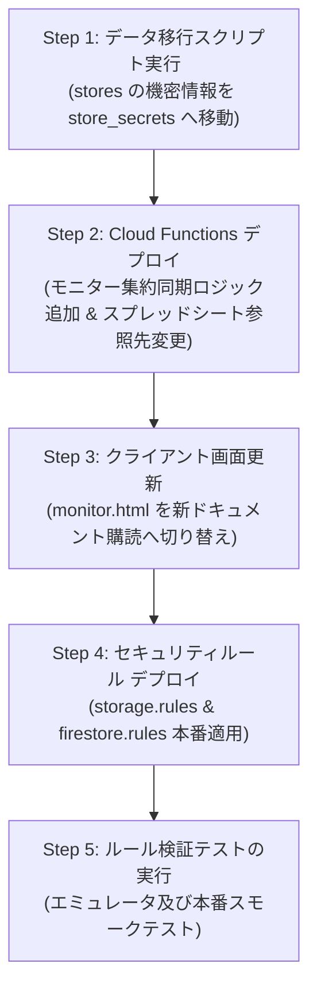

# 仕様変更設計書：Firebaseセキュリティルール及びデータモデル改修
**Specification Change Design: Firebase Security Rules & Data Model Hardening**

- **文書番号**: SPEC-SEC-2026-11
- **作成日**: 2026年9月9日
- **対象領域**: Firebase Cloud Firestore / Cloud Storage / Cloud Functions / クライアント連携アーキテクチャ
- **参照元**: `設計書/脆弱性/01_Firebaseセキュリティルール脆弱性分析.md`、`設計図/data/脆弱性/00_総合脆弱性監査報告書.md`
- **ステータス**: 【策定完了・実装準備中】（※実コードの直接編集は行わず、仕様設計の定義のみ）

---

## 1. 改修の背景・目的および設計方針

### 1.1 改修の背景
2026年9月9日に実施された包括的セキュリティ監査（`01_Firebaseセキュリティルール脆弱性分析.md`）において、南陵祭2026のセキュリティルール層および一部データモデルに、以下の**重大な脆弱性・構造的欠陥**が特定されました。

1. **`storage.rules` のファイルサイズ制限欠落（Critical）**: 巨大ファイルの無差別アップロードによるストレージ枯渇および破滅的課金（DoS/DoW）。
2. **`storage.rules` の SVG 許可（High）**: `image/.*` 判定による `image/svg+xml` のアップロードと Stored XSS。
3. **`orders` コレクションの `ready_for_pickup` 未認証全公開（High）**: Firestoreルールのフィールド単位射影不可の特性により、注文者UID・注文商品・金額が全世界に丸見え。
4. **`items` コレクションのスキーマ検証欠落（High）**: マイナス価格（`-1000円`）や巨大文字列、未知フィールドの注入による注文計算破壊。
5. **`stores` コレクションの機密情報公開（High）**: 売上同期用 Google スプレッドシートID/URL、店舗ログインIDの未認証露出。
6. **`users` コレクションの再帰ワイルドカード `{document=**}` とスキーマ欠落（High）**: サブコレクションの無制限作成、他人のFCMトークン大量注入。
7. **`counters` コレクションの過剰権限（Medium）**: クライアント未使用にもかかわらず全店舗管理者に開示され、全体売上が推測可能。

### 1.2 改修の基本方針
本仕様変更は、南陵祭2026の設計憲法である**「ゼロトラストセキュリティ」「生徒も来場者も使いやすく安全に」「最小権限の原則（PoLP）」**を徹底することを目的とし、以下の4原則に基づき設計します。

1. **Defense in Depth（多層防御）**: クライアント側のバリデーション（Canvas圧縮等）を一切信用せず、Security Rules 層でサイズ・形式・型・値の範囲を厳格に強制する。
2. **Physical Data Separation（物理的データ分離）**: Firestoreルールがフィールド単位の読み取り制限をサポートしない制約を踏まえ、機密情報・一般公開情報を別ドキュメント・別コレクションへ物理的に分離する。
3. **Strict Whitelisting（厳格なホワイトリスト）**: `keys().hasOnly()` による未知フィールドの完全拒否、数値範囲（`price >= 0 && price <= 100000`）の強制。
4. **Zero Client-Side Deletion（クライアント削除の全面排除）**: 整合性を担保するため、ユーザーアカウントや重要リソースの削除はすべて Cloud Functions（Admin SDK）経由に一本化する。

---

## 2. Cloud Storage ルール (`storage.rules`) の仕様変更

### 2.1 変更概要と要件
商品画像アップロード（`products/{storeId}/{fileName}`）におけるアタックサーフェスを最小化します。

| 項目 | 変更前仕様 | 変更後仕様 | 理由・効果 |
| :--- | :--- | :--- | :--- |
| **ファイルサイズ上限** | 制限なし | **最大 5MB (5,242,880 bytes)** | 巨大ダミーファイルによるストレージ容量枯渇・高額課金（DoS/DoW）を完全遮断 |
| **MIMEタイプ** | `image/.*` | **`image/(jpeg\|png\|webp)`** | 悪意あるスクリプトを含みうる `image/svg+xml` や未定義形式を厳格に排除（Stored XSS防止） |
| **ファイル名・拡張子** | 制限なし | **英数字・ハイフン・アンダースコア + `.webp` / `.jpg` / `.jpeg` / `.png`** | パストラバーサル、拡張子偽装、URLエンコード不整合の防止 |
| **操作権限の分離** | `allow write:` 一括 | **`create`, `delete` を分離し、`update`（上書き）は禁止** | 既存画像ファイル名の意図しない上書き破壊を防止 |

### 2.2 詳細ルール仕様
- **パス**: `/b/{bucket}/o/products/{storeId}/{fileName}`
- **読み取り (`read`)**: `allow read: if true;`（一般来場者・生徒へのメニュー画像公開のため継続）
- **新規アップロード (`create`)**:
  以下の全条件を AND で満たす場合のみ許可する：
  1. `isStoreAdmin(storeId) || isSuperAdmin()`（該当店舗の管理者またはSuperAdmin）
  2. `request.resource.size < 5 * 1024 * 1024`（5MB未満）
  3. `request.resource.contentType.matches('image/(jpeg|png|webp)')`
  4. `fileName.matches('^[a-zA-Z0-9_-]+\\.(webp|jpg|jpeg|png)$')`
- **上書き更新 (`update`)**: `allow update: if false;`（禁止）
  - 理由: `portal.html` では `${Date.now()}_${filename}.webp` としてユニークなタイムスタンプ付きファイル名を生成するため、正規フローで同名上書きは発生しない。上書きを明示的に禁止することで、ファイル破壊攻撃を防止する。
- **削除 (`delete`)**:
  - `allow delete: if isStoreAdmin(storeId) || isSuperAdmin();`
  - 理由: 商品削除時や画像差し替え時に古い画像をクリーンアップするために必要。

---

## 3. Firestore データモデル及びルール (`firestore.rules`) の仕様変更

---

### 3.1 `items` コレクション: スキーマバリデーション仕様

#### 3.1.1 変更概要
店舗管理者（生徒）または侵害されたアカウントが、マイナス価格や極大価格、巨大文字列、悪意ある未知フィールドを注入することを防止します。

#### 3.1.2 バリデーション仕様表
`items/{itemId}` ドキュメントの書き込み（`create` / `update`）時に以下のスキーマ検証関数 `isValidItemData()` を強制します。

| フィールド名 | 型 | 必須 | 制約条件 | 違反時の挙動 |
| :--- | :--- | :---: | :--- | :--- |
| `storeId` | string | ✓ | 1文字以上 32文字以下 | 拒否 |
| `name` | string | ✓ | 1文字以上 50文字以下 | 拒否 |
| `price` | int | ✓ | **`0 <= price && price <= 100000`** (0円以上10万円以下の整数) | 拒否 |
| `isAvailable` | bool | ✓ | boolean値のみ | 拒否 |
| `description` | string | 任意 | 存在する場合、500文字以下 | 拒否 |
| `imageUrl` | string | 任意 | 存在する場合、1000文字以下のURL形式 | 拒否 |
| `allowedToppings`| list | 任意 | 存在する場合、配列長20以下 | 拒否 |
| `isRecommended` | bool | 任意 | 存在する場合、boolean値 | 拒否 |
| `displayOrder` | number | 任意 | 存在する場合、数値（int/float） | 拒否 |
| `createdAt` | timestamp | 任意 | タイムスタンプ | 拒否 |
| `updatedAt` | timestamp | 任意 | タイムスタンプ | 拒否 |
| **未定義フィールド** | - | - | **上記11項目以外のキーが含まれる場合は即座に拒否** (`keys().hasOnly()`) | 拒否 |

#### 3.1.3 ドキュメントID命名規則の検証
- 設計憲法§3.4 準拠: ドキュメントIDが `{storeId}_{itemId}` または適切なID形式であること。
- `create` 時に `request.resource.data.storeId` と `isStoreAdmin(storeId)` の一致を強制。

---

### 3.2 `orders` コレクション: `ready_for_pickup` 全公開廃止とモニター表示用代替データモデル仕様

#### 3.2.1 課題とアーキテクチャの根本解決
Firestore Security Rules はドキュメント単位の認可エンジンであり、**「特定のフィールド（呼出番号のみ）だけを読み取り許可する」ことは不可能**です。
現行ルールで `allow read: if ... || resource.data.status == "ready_for_pickup"` としているため、注文アイテム、金額、注文者UIDなどの機密データが全世界に漏洩しています。

これを完全に解決するため、**「機密トランザクションデータ（`orders`）」と「モニター呼出公開データ（`public_displays`）」を物理ドキュメントとして分離**します。

#### 3.2.2 新規データモデル: 店舗別モニター集約ドキュメント
モニター画面（`pos/monitor.html`）および一般来場者が呼出状況を閲覧するための専用公開ドキュメントを新設します。

- **コレクション・パス**: `stores/{storeId}/public_displays/monitor`
- **データ構造**:
  ```json
  {
    "storeId": "301",
    "readyReceiptNumbers": [7001, 7003, 7008],
    "preparingReceiptNumbers": [7009, 7010],
    "updatedAt": "2026-09-09T03:30:00.000Z"
  }
  ```
- **セキュリティ特性**:
  - 個人を特定しうる UID、氏名、メールアドレスは一切含まない。
  - 注文した具体的な商品名、数量、合計金額などの購買履歴は一切含まない。
  - 画面表示に必要な**「受付番号（3〜4桁の整数）」のみを保持**するため、未認証の誰に全公開（`allow read: if true;`）されても一切の情報漏洩リスクがない。

#### 3.2.3 Cloud Functions による同期ロジック仕様
注文ステータス遷移を担う既存の Cloud Functions（`functions/index.js`）に、モニター集約ドキュメントの自動更新処理を追加します。

1. **更新トリガー**:
   - `callForPickup`（ready_to_serve → ready_for_pickup）実行時: `readyReceiptNumbers` に追加、`preparingReceiptNumbers` から除外。
   - `completeOrder`（ready_for_pickup → completed）実行時: `readyReceiptNumbers` から除外。
   - `cancelOrder` 実行時: 両配列から除外。
   - `kitchenComplete`（cooking → ready_to_serve）実行時: `preparingReceiptNumbers` の状態維持。
2. **実装ヘルパー関数仕様 (`syncStoreMonitorDisplay`)**:
   ```javascript
   // Cloud Functions 内部実装イメージ
   async function syncStoreMonitorDisplay(storeId) {
     const db = admin.firestore();
     const snap = await db.collection("orders")
       .where("storeId", "==", storeId)
       .where("status", "in", ["cooking", "ready_to_serve", "ready_for_pickup"])
       .get();

     const ready = [];
     const preparing = [];

     snap.forEach(doc => {
       const o = doc.data();
       if (o.receiptNumber) {
         if (o.status === "ready_for_pickup") {
           ready.push(o.receiptNumber);
         } else if (o.status === "cooking" || o.status === "ready_to_serve") {
           preparing.push(o.receiptNumber);
         }
       }
     });

     ready.sort((a, b) => a - b);
     preparing.sort((a, b) => a - b);

     await db.doc(`stores/${storeId}/public_displays/monitor`).set({
       storeId,
       readyReceiptNumbers: ready,
       preparingReceiptNumbers: preparing,
       updatedAt: admin.firestore.FieldValue.serverTimestamp()
     }, { merge: true });
   }
   ```

#### 3.2.4 クライアント画面 (`pos/monitor.html`) の変更仕様
- **変更前**: `orders` コレクションに対して `where("status", "==", "ready_for_pickup")` を `onSnapshot` 監視（全注文ドキュメントを個別受信）。
- **変更後**: `doc(db, "stores", STORE_ID, "public_displays", "monitor")` の単一ドキュメントを `onSnapshot` 監視。
- **効果**:
  - 通信トラフィックと Firestore Reads が大幅に削減（1画面あたり1ドキュメントの更新イベントのみ）。
  - セキュリティルールを完全に閉鎖可能。

#### 3.2.5 `orders` コレクションの新セキュリティルール仕様
```javascript
match /orders/{orderId} {
  // get: 店舗管理者（自店）、SuperAdmin、注文者本人のみ
  // ※ SOK未確定仮注文（pending）はQR引き継ぎのため一時許可
  allow get: if isStoreAdmin(resource.data.storeId) 
             || isSuperAdmin()
             || (isAuthenticated() && request.auth.uid == resource.data.userId)
             || (resource.data.orderChannel == "sok" && resource.data.sokStatus == "pending");

  // list: 店舗管理者（自店）、SuperAdmin、または自身のUIDに限定したクエリのみ
  // 【最重要】ready_for_pickup による全公開 list は完全撤廃
  allow list: if isStoreAdmin(resource.data.storeId) 
              || isSuperAdmin()
              || (isAuthenticated() && request.auth.uid == resource.data.userId);

  allow create: if false; // Functions 経由のみ
  allow update: if isSuperAdmin();
  allow delete: if isSuperAdmin();
}
```

---

### 3.3 `stores` コレクション: スプレッドシート情報等の機密データ分離仕様

#### 3.3.1 課題と問題点
現行の `stores/{storeId}` には、全注文履歴・売上データが自動同期される `spreadsheetId` および `spreadsheetUrl`、ならびに `loginId`（店舗ログイン識別子）が同居しています。
メニュー表示のため `stores` が一般公開（`allow read: if true;`）されているため、未認証の第三者がスプレッドシートURLを抽出し、閲覧権限の隙を突いて全注文・売上データを盗み見ることが可能です。

#### 3.3.2 移行データモデル仕様
機密フィールドを `stores` から完全削除し、クライアントから読み書きが一切禁止されている非公開コレクション `store_secrets/{storeId}` へ移動します。

- **公開コレクション `stores/{storeId}` (残すフィールド)**:
  - `name`, `teamName`, `description`, `place`, `floor`, `operationStatus`, `displayOrder`, `isEmergencyStopped`, `isAutoSuspended`, `lastActivityAt`, `createdAt`, `updatedAt`
- **非公開コレクション `store_secrets/{storeId}` (移行・集約するフィールド)**:
  - `hash`, `salt`（既存のパスワードハッシュ）
  - **`spreadsheetId`**（新規移行）
  - **`spreadsheetUrl`**（新規移行）
  - **`loginId`**（新規移行）

#### 3.3.3 既存データ移行手順（Migration Procedure）
本番環境およびステージング環境において、以下のスクリプト（`scripts/migrateStoreSecrets.js`）を実行して安全にデータを移行します。

```javascript
/**
 * scripts/migrateStoreSecrets.js (Admin SDK 実行用スクリプト)
 */
const admin = require("firebase-admin");
if (!admin.apps.length) admin.initializeApp();
const db = admin.firestore();

async function migrate() {
  console.log("Starting store_secrets migration...");
  const storesSnap = await db.collection("stores").get();
  
  const batch = db.batch();
  let count = 0;

  for (const storeDoc of storesSnap.docs) {
    const data = storeDoc.data();
    const storeId = storeDoc.id;
    const secretRef = db.collection("store_secrets").doc(storeId);

    // 1. 機密情報を store_secrets へコピー (merge: true)
    const secretUpdate = {};
    if (data.spreadsheetId) secretUpdate.spreadsheetId = data.spreadsheetId;
    if (data.spreadsheetUrl) secretUpdate.spreadsheetUrl = data.spreadsheetUrl;
    if (data.loginId) secretUpdate.loginId = data.loginId;

    if (Object.keys(secretUpdate).length > 0) {
      batch.set(secretRef, secretUpdate, { merge: true });
    }

    // 2. stores/{storeId} から機密フィールドを完全削除
    const storeUpdate = {};
    if (data.spreadsheetId !== undefined) storeUpdate.spreadsheetId = admin.firestore.FieldValue.delete();
    if (data.spreadsheetUrl !== undefined) storeUpdate.spreadsheetUrl = admin.firestore.FieldValue.delete();
    if (data.loginId !== undefined) storeUpdate.loginId = admin.firestore.FieldValue.delete();

    if (Object.keys(storeUpdate).length > 0) {
      batch.update(storeDoc.ref, storeUpdate);
    }
    count++;
  }

  await batch.commit();
  console.log(`Successfully migrated ${count} stores to store_secrets.`);
}

migrate().catch(console.error);
```

#### 3.3.4 Cloud Functions 側の参照先修正
Google Sheets同期バッチ（`syncOrdersToSheets`, `bulkCreateSpreadsheets`, `rebuildStoreSheet` 等）において、スプレッドシートIDの取得元を `stores/{storeId}` から `store_secrets/{storeId}` へ変更します。

---

### 3.4 `users` コレクション: サブコレクション分離とホワイトリスト化仕様

#### 3.4.1 課題と問題点
現行ルールは `match /users/{userId}/{document=**}` と再帰的ワイルドカードを使用しており、以下の深刻な問題があります：
1. 任意のサブコレクション（`/users/{uid}/*/*`）を無制限に作成・更新・削除できる（DoS・リソース枯渇）。
2. `email`, `displayName`, `photoURL` 以外の任意のフィールド（巨大文字列、不正な配列等）が無制限に注入できる。
3. クライアントから直接 `deleteDoc` が実行でき、Authレコードや注文履歴との整合性が崩壊する。

#### 3.4.2 修正仕様
1. **再帰ワイルドカード `{document=**}` を廃止**: 直下の `users/{userId}` とサブコレクション `users/{userId}/cart/{itemId}` を厳密に分離。
2. **ホワイトリスト化 (`isValidUserData`)**:
   - 許可フィールド: `nickname`, `fcmTokens`, `termsAgreedAt`, `favoriteItemIds`, `lastLoginAt`, `createdAt`, `notificationEnabled`, `permissionStatus`, `deviceType`
   - `keys().hasOnly(...)` を強制。
   - 配列要素数の上限強制: `fcmTokens` は最大10件、`favoriteItemIds` は最大100件。
   - 文字列長制限: `nickname` は最大30文字。
3. **直接削除の禁止**:
   - `allow delete: if false;`
   - 退会処理は `deleteMyAccount` Callable Function（Admin SDK）経由に完全一本化。

---

### 3.5 `counters` コレクション: 過剰権限の制限仕様

#### 3.5.1 課題と問題点
現行ルールで `allow read: if (isAuthenticated() && request.auth.token.role == 'store_admin') || isSuperAdmin();` となっており、ある1店舗のスタッフ権限を持つ生徒が、文化祭全体の総発番数（全注文数ペース・売上動向）を閲覧可能です。また、クライアントコード側では一切参照されていません。

#### 3.5.2 修正仕様
- クライアントからの直接アクセスを完全に遮断します。
- `allow read, write: if false;`（Admin SDK / Cloud Functions のみアクセス）。
- 管理者のトラブルシューティング・目視確認が必要な場合のみ、`allow read: if isSuperAdmin();` とする。

---

### 3.6 `_metadata` コレクションのアクセス制御仕様

#### 3.6.1 課題と問題点
`_metadata/system_alerts` の `penaltyEnabled`（ペナルティ自動執行の有効/無効フラグ）や緊急停止時刻などの運用状態が、未認証の第三者に常時開示されています。

#### 3.6.2 修正仕様
- 未認証での読み取りを禁止し、認証済みユーザー（生徒・来場者・管理者）のみに制限します。
- `allow read: if isAuthenticated() || isSuperAdmin();`
- `allow write: if isSuperAdmin();`

---

## 4. セキュリティルール完全版コード（Before / After & 完全コード）

### 4.1 Cloud Storage ルール (`storage.rules`)

#### 4.1.1 変更差分 (Unified Diff)
```diff
--- storage.rules (Before)
+++ storage.rules (After)
@@ -27,7 +27,14 @@
     match /products/{storeId}/{fileName} {
       // 誰でも画像は見れる
       allow read: if true;
-      // アップロード: 店舗管理者かつ画像ファイルのみ許可
-      allow write: if (isStoreAdmin(storeId) || isSuperAdmin())
-                   && request.resource.contentType.matches('image/.*');
+      
+      // 新規アップロード: 店舗管理者またはSuperAdmin
+      // 5MB上限、ラスタ画像限定(SVG排除)、安全なファイル名形式
+      allow create: if (isStoreAdmin(storeId) || isSuperAdmin())
+                    && request.resource.size < 5 * 1024 * 1024
+                    && request.resource.contentType.matches('image/(jpeg|png|webp)')
+                    && fileName.matches('^[a-zA-Z0-9_-]+\\.(webp|jpg|jpeg|png)$');
+      
+      allow update: if false; // 同名ファイルの意図しない上書き破壊を防止
+      allow delete: if isStoreAdmin(storeId) || isSuperAdmin();
     }
```

#### 4.1.2 本番投入用 完全版コード (`storage.rules`)
```javascript
rules_version = '2';
service firebase.storage {
  match /b/{bucket}/o {
    
    // ============================================================
    // Auth Check Helpers
    // ============================================================
    function isAuthenticated() {
      return request.auth != null;
    }
    
    function isStoreAdmin(targetStoreId) {
      return isAuthenticated() 
             && request.auth.token.role == 'store_admin' 
             && request.auth.token.storeId == targetStoreId;
    }

    function isSuperAdmin() {
      return isAuthenticated() && request.auth.token.identity == 'super_admin';
    }

    // Default Deny: 明示的に許可されていない全パスを遮断
    match /{allPaths=**} {
      allow read, write: if false;
    }
    
    // ============================================================
    // Product Images: products/{storeId}/{fileName}
    // ============================================================
    match /products/{storeId}/{fileName} {
      // 誰でも画像は見れる (メニュー表示用)
      allow read: if true;
      
      // 新規アップロード: 
      // 1. 店舗管理者（自店）または SuperAdmin
      // 2. ファイルサイズ 5MB 以下 (DoS/DoW対策)
      // 3. 安全なラスタ画像形式のみ (image/svg+xml を排除して Stored XSS 対策)
      // 4. ファイル名形式のホワイトリスト (拡張子・文字種制限)
      allow create: if (isStoreAdmin(storeId) || isSuperAdmin())
                    && request.resource.size < 5 * 1024 * 1024
                    && request.resource.contentType.matches('image/(jpeg|png|webp)')
                    && fileName.matches('^[a-zA-Z0-9_-]+\\.(webp|jpg|jpeg|png)$');

      // 既存画像の上書き更新は禁止 (誤操作・ファイル破壊防止)
      allow update: if false;

      // 削除: 店舗管理者または SuperAdmin
      allow delete: if isStoreAdmin(storeId) || isSuperAdmin();
    }
  }
}
```

---

### 4.2 Cloud Firestore ルール (`firestore.rules`)

#### 4.2.1 変更差分 (Unified Diff)
```diff
--- firestore.rules (Before)
+++ firestore.rules (After)
@@ -27,6 +27,33 @@
     function isSuperAdmin() {
       return isAuthenticated()
              && request.auth.token.identity == 'super_admin';
     }
+
+    // items コレクションの厳格スキーマバリデーション
+    function isValidItemData() {
+      let d = request.resource.data;
+      let allowedFields = ['storeId', 'name', 'price', 'description', 'imageUrl', 'isAvailable', 'isRecommended', 'allowedToppings', 'displayOrder', 'createdAt', 'updatedAt'];
+      return d.keys().hasOnly(allowedFields)
+        && d.storeId is string && d.storeId.size() >= 1 && d.storeId.size() <= 32
+        && d.name is string && d.name.size() >= 1 && d.name.size() <= 50
+        && d.price is int && d.price >= 0 && d.price <= 100000
+        && d.isAvailable is bool
+        && (!('description' in d) || (d.description is string && d.description.size() <= 500))
+        && (!('imageUrl' in d) || (d.imageUrl is string && d.imageUrl.size() <= 1000))
+        && (!('allowedToppings' in d) || (d.allowedToppings is list && d.allowedToppings.size() <= 20))
+        && (!('isRecommended' in d) || d.isRecommended is bool)
+        && (!('displayOrder' in d) || d.displayOrder is number);
+    }
+
+    // users コレクションの厳格スキーマバリデーション
+    function isValidUserData() {
+      let d = request.resource.data;
+      let allowedFields = ['nickname', 'fcmTokens', 'termsAgreedAt', 'favoriteItemIds', 'lastLoginAt', 'createdAt', 'notificationEnabled', 'permissionStatus', 'deviceType'];
+      return d.keys().hasOnly(allowedFields)
+        && !d.keys().hasAny(['email', 'displayName', 'photoURL'])
+        && (!('nickname' in d) || (d.nickname is string && d.nickname.size() <= 30))
+        && (!('fcmTokens' in d) || (d.fcmTokens is list && d.fcmTokens.size() <= 10))
+        && (!('favoriteItemIds' in d) || (d.favoriteItemIds is list && d.favoriteItemIds.size() <= 100));
+    }
 
     // --- Collection Rules ---
@@ -47,11 +74,13 @@
     match /items/{itemId} {
       // 誰でも閲覧可
       allow read: if true;
       
       // 作成・更新・削除: その店舗の管理者のみ
-      allow create: if isStoreAdmin(request.resource.data.storeId) || isSuperAdmin();
-      allow update: if (isStoreAdmin(resource.data.storeId) && isStoreAdmin(request.resource.data.storeId)) || isSuperAdmin();
+      allow create: if (isStoreAdmin(request.resource.data.storeId) || isSuperAdmin())
+                   && isValidItemData();
+      allow update: if ((isStoreAdmin(resource.data.storeId) && isStoreAdmin(request.resource.data.storeId)) || isSuperAdmin())
+                   && isValidItemData();
       allow delete: if isStoreAdmin(resource.data.storeId) || isSuperAdmin();
     }
@@ -67,28 +96,25 @@
     match /orders/{orderId} {
       // 読み取り: 設計憲法§8.1 に基づく条件
       // 単一ドキュメント取得 (get)
       allow get: if
         // (a) 店舗管理者（自店のみ）または SuperAdmin
         isStoreAdmin(resource.data.storeId) || isSuperAdmin()
         // (b) 自身の注文（userId 一致）
         || (isAuthenticated() && request.auth.uid == resource.data.userId)
         // (c) SOK未確定仮注文（QR読み取り等、IDを知っている場合のみ許可）
-        || (resource.data.orderChannel == "sok" && resource.data.sokStatus == "pending")
-        // (d) monitor.html 用: ready_for_pickup の注文を誰でも読める
-        || resource.data.status == "ready_for_pickup";
+        || (resource.data.orderChannel == "sok" && resource.data.sokStatus == "pending");
       
       // クエリによる一覧取得 (list)
       allow list: if
         // (a) 店舗管理者（自店のみ）または SuperAdmin
         isStoreAdmin(resource.data.storeId) || isSuperAdmin()
         // (b) 自身の注文（userId 一致）
-        || (isAuthenticated() && request.auth.uid == resource.data.userId)
-        // (d) monitor.html 用: ready_for_pickup の注文を誰でも読める
-        || resource.data.status == "ready_for_pickup";
+        || (isAuthenticated() && request.auth.uid == resource.data.userId);
       
       // 作成: 禁止 (Cloud Functions経由のみ)
@@ -107,17 +133,18 @@
-    match /users/{userId}/{document=**} {
+    match /users/{userId} {
       allow read: if (isAuthenticated() && request.auth.uid == userId) || isSuperAdmin();
-      // delete 時: request.resource が null のため PII チェックは行わず UID 一致のみで許可
-      allow delete: if isAuthenticated() && request.auth.uid == userId;
-      // create, update 時のみ: PII フィールドの書き込みをルール層で禁止
+      allow delete: if false; // 直接削除禁止 (deleteMyAccount Function に集約)
       allow create, update: if isAuthenticated() && request.auth.uid == userId
-                   && !request.resource.data.keys().hasAny(
-                        ['email', 'displayName', 'photoURL']);
+                   && isValidUserData();
+
+      // カート サブコレクションの明示的スコープ
+      match /cart/{itemId} {
+        allow read, write: if isAuthenticated() && request.auth.uid == userId;
+      }
     }
 
     // 5. Counters (採番)
-    // 読み取り: 店舗管理者、SuperAdminのみ (売上推測防止)
     match /counters/{document=**} {
-      allow read: if (isAuthenticated() && request.auth.token.role == 'store_admin') || isSuperAdmin();
+      // クライアントからの読み取りは不要。Admin SDK (Functions) のみアクセス
+      allow read: if isSuperAdmin();
       allow write: if false; 
     }
@@ -131,8 +158,13 @@
+    // 6-c. モニター公開用サブコレクション (集約呼出番号のみ保持)
+    match /stores/{storeId}/public_displays/{displayId} {
+      allow read: if true;
+      allow write: if false; // Cloud Functions のみが更新
+    }
+
     // 7. Metadata (同期ステータス等の管理用)
     match /_metadata/{document=**} {
-      allow read: if true;
+      allow read: if isAuthenticated() || isSuperAdmin();
       allow write: if isSuperAdmin();
     }
```

#### 4.2.2 本番投入用 完全版コード (`firestore.rules`)
```javascript
rules_version = '2';
service cloud.firestore {
  match /databases/{database}/documents {
    
    // ============================================================
    // Helper Functions
    // ============================================================
    
    // 認証済みかチェック
    function isAuthenticated() {
      return request.auth != null;
    }
    
    // 店舗管理者であり、かつ操作対象の店舗ID権限を持っているかチェック
    function isStoreAdmin(targetStoreId) {
      return isAuthenticated() 
             && request.auth.token.role == 'store_admin' 
             && request.auth.token.storeId == targetStoreId;
    }

    // スーパー管理者 (identity claim ベース — V4)
    function isSuperAdmin() {
      return isAuthenticated()
             && request.auth.token.identity == 'super_admin';
    }

    // items コレクションの厳格スキーマバリデーション
    function isValidItemData() {
      let d = request.resource.data;
      let allowedFields = [
        'storeId', 'name', 'price', 'description', 'imageUrl',
        'isAvailable', 'isRecommended', 'allowedToppings', 'displayOrder',
        'createdAt', 'updatedAt'
      ];
      return d.keys().hasOnly(allowedFields)
        && d.storeId is string && d.storeId.size() >= 1 && d.storeId.size() <= 32
        && d.name is string && d.name.size() >= 1 && d.name.size() <= 50
        && d.price is int && d.price >= 0 && d.price <= 100000
        && d.isAvailable is bool
        && (!('description' in d) || (d.description is string && d.description.size() <= 500))
        && (!('imageUrl' in d) || (d.imageUrl is string && d.imageUrl.size() <= 1000))
        && (!('allowedToppings' in d) || (d.allowedToppings is list && d.allowedToppings.size() <= 20))
        && (!('isRecommended' in d) || d.isRecommended is bool)
        && (!('displayOrder' in d) || d.displayOrder is number);
    }

    // users コレクションの厳格スキーマバリデーション
    function isValidUserData() {
      let d = request.resource.data;
      let allowedFields = [
        'nickname', 'fcmTokens', 'termsAgreedAt', 'favoriteItemIds',
        'lastLoginAt', 'createdAt', 'notificationEnabled', 'permissionStatus', 'deviceType'
      ];
      return d.keys().hasOnly(allowedFields)
        && !d.keys().hasAny(['email', 'displayName', 'photoURL'])
        && (!('nickname' in d) || (d.nickname is string && d.nickname.size() <= 30))
        && (!('fcmTokens' in d) || (d.fcmTokens is list && d.fcmTokens.size() <= 10))
        && (!('favoriteItemIds' in d) || (d.favoriteItemIds is list && d.favoriteItemIds.size() <= 100));
    }

    // ============================================================
    // Collection Rules
    // ============================================================

    // 1. Stores (店舗情報の公開)
    // ※ spreadsheetId, spreadsheetUrl, loginId は本ドキュメントから除外し、store_secrets へ移行
    match /stores/{storeId} {
      allow read: if true; 
      allow write: if isSuperAdmin();
    }

    // 1-b. Store Secrets (パスワード、スプレッドシート情報等の機密情報)
    // 読み書き一切禁止 (Cloud Functionsからのみアクセス)
    match /store_secrets/{storeId} {
      allow read, write: if false;
    }

    // 1-c. 店舗別モニター公開集約ドキュメント (安全な呼出番号配列のみ保持)
    match /stores/{storeId}/public_displays/{displayId} {
      allow read: if true;
      allow write: if false; // Cloud Functions のみが更新
    }

    // 2. Items (商品情報)
    match /items/{itemId} {
      allow read: if true;
      
      // 作成・更新: 自店舗の管理者またはSuperAdmin、かつ厳格バリデーション通過
      allow create: if (isStoreAdmin(request.resource.data.storeId) || isSuperAdmin())
                   && isValidItemData();
      allow update: if ((isStoreAdmin(resource.data.storeId) && isStoreAdmin(request.resource.data.storeId)) || isSuperAdmin())
                   && isValidItemData();
      allow delete: if isStoreAdmin(resource.data.storeId) || isSuperAdmin();
    }

    // --- Test Collections (Super Admin Only) ---
    match /stores_test/{storeId} {
      allow read, write: if isSuperAdmin();
    }
    match /items_test/{itemId} {
      allow read, write: if isSuperAdmin();
    }

    // 3. Orders (注文) – 設計憲法§8 / §8.1 準拠
    match /orders/{orderId} {
      // 単一ドキュメント取得 (get)
      allow get: if
        // (a) 店舗管理者（自店のみ）または SuperAdmin
        isStoreAdmin(resource.data.storeId) || isSuperAdmin()
        // (b) 自身の注文（userId 一致）
        || (isAuthenticated() && request.auth.uid == resource.data.userId)
        // (c) SOK未確定仮注文（QR読み取り等、IDを知っている場合のみ許可）
        || (resource.data.orderChannel == "sok" && resource.data.sokStatus == "pending");
      
      // クエリによる一覧取得 (list)
      // 【セキュリティ改修】ready_for_pickup による全公開 list を完全廃止
      allow list: if
        // (a) 店舗管理者（自店のみ）または SuperAdmin
        isStoreAdmin(resource.data.storeId) || isSuperAdmin()
        // (b) 自身の注文（userId 一致）
        || (isAuthenticated() && request.auth.uid == resource.data.userId);
      
      // 作成: 禁止 (Cloud Functions経由のみ)
      allow create: if false; 
      
      // 更新: ステータス更新等はすべて Cloud Functions 経由で行う
      allow update: if isSuperAdmin();
                    
      // 削除: SuperAdminのみ
      allow delete: if isSuperAdmin();
    }

    // 4. Users (ユーザー情報)
    match /users/{userId} {
      allow read: if (isAuthenticated() && request.auth.uid == userId) || isSuperAdmin();
      // クライアントからの直接削除は禁止 (deleteMyAccount Function に一本化)
      allow delete: if false;
      // create, update: スキーマ検証と PII 禁止
      allow create, update: if isAuthenticated() && request.auth.uid == userId
                           && isValidUserData();

      // カート サブコレクションの明示的定義
      match /cart/{itemId} {
        allow read, write: if isAuthenticated() && request.auth.uid == userId;
      }
    }

    // 5. Counters (採番)
    // クライアントからの読み取りは不要。Admin SDK (Functions) のみアクセス
    match /counters/{document=**} {
      allow read: if isSuperAdmin();
      allow write: if false; 
    }

    // 6. 会場ステータス (来場者は読み取りのみ、書き込みは Cloud Functions のみ)
    match /venues/{venueId} {
      allow read: if true;
      allow write: if false;
    }
    
    // 6-b. 会場ステータス管理用設定 (Functionsからのみアクセス)
    match /venue_admin_config/{document=**} {
      allow read, write: if false;
    }
    match /venue_admin_sessions/{document=**} {
      allow read, write: if false;
    }

    // 7. Metadata (同期ステータス等の管理用)
    match /_metadata/{document=**} {
      // 未認証公開を廃止し、ログインユーザーまたは管理者のみに限定
      allow read: if isAuthenticated() || isSuperAdmin();
      allow write: if isSuperAdmin();
    }

    // 8. Banned Users (BAN情報) – 設計憲法§8 / §10.2 準拠
    match /banned_users/{userId} {
      allow read: if (isAuthenticated() && request.auth.uid == userId) || isSuperAdmin();
      allow write: if false;
    }
    
    // デフォルト: 全て拒否
    match /{document=**} {
      allow read, write: if false;
    }
  }
}
```

---

## 5. 移行手順及びテスト・検証計画

### 5.1 移行実施ステップ（5段階）

本改修をサービス無停止かつ安全に本番適用するため、以下の順序を厳守して実施します。



- **【重要】Step 3 と Step 4 の順序**:
  `orders` の全公開 `list` を閉じる前に、必ず `monitor.html` を新集約ドキュメント購読に切り替えておく必要があります。順序が逆になると、モニター画面で `permission-denied` が発生し、店頭の呼出表示が停止します。

---

### 5.2 セキュリティルール自動検証テストケース (Rules Unit Tests)

Firebase Local Emulator Suite を用いて、以下のテストケースがすべてパスすることを確認します。

| No | テスト対象 | テスト操作・入力 | 期待される結果 |
| :---: | :--- | :--- | :---: |
| 1 | `storage.rules` | 6MB の WebP 画像をアップロード | **PERMISSION_DENIED** (サイズ上限超過) |
| 2 | `storage.rules` | 1MB の SVG ファイル (`image/svg+xml`) をアップロード | **PERMISSION_DENIED** (SVG排除) |
| 3 | `storage.rules` | 1MB の WebP 画像を他店舗のパスにアップロード | **PERMISSION_DENIED** (店舗ID不一致) |
| 4 | `storage.rules` | 1MB の WebP 画像を自店舗のパスにアップロード | **SUCCESS** (正常許可) |
| 5 | `storage.rules` | 既存の画像ファイルに対する上書きアップロード | **PERMISSION_DENIED** (上書き禁止) |
| 6 | `firestore.rules` (items) | `price: -100` の商品を作成 | **PERMISSION_DENIED** (マイナス価格) |
| 7 | `firestore.rules` (items) | `price: 150000` の商品を作成 | **PERMISSION_DENIED** (価格上限10万円超過) |
| 8 | `firestore.rules` (items) | 未定義キー `unknownField: "val"` を含む商品を作成 | **PERMISSION_DENIED** (未知フィールド) |
| 9 | `firestore.rules` (items) | `price: 100`, `name: "カステラ"` の自店商品を作成 | **SUCCESS** (バリデーション通過) |
| 10 | `firestore.rules` (orders) | 未認証で `status == "ready_for_pickup"` の全件取得クエリ | **PERMISSION_DENIED** (全公開list廃止) |
| 11 | `firestore.rules` (orders) | 認証済み一般客が他人の `ready_for_pickup` 注文を get | **PERMISSION_DENIED** (UID不一致) |
| 12 | `firestore.rules` (orders) | 認証済み客が自身の注文（UID一致）を get / list | **SUCCESS** (本人閲覧) |
| 13 | `firestore.rules` (users) | クライアントから直接 `deleteDoc(doc(db, "users", uid))` 実行 | **PERMISSION_DENIED** (直接削除禁止) |
| 14 | `firestore.rules` (users) | 自身のドキュメントに `fcmTokens` を15件（上限10件）注入 | **PERMISSION_DENIED** (配列長上限超過) |
| 15 | `firestore.rules` (counters) | 店舗管理者が `counters/receipt_mobile` を直接 get | **PERMISSION_DENIED** (一般店舗への閲覧制限) |
| 16 | `firestore.rules` (monitor) | 未認証の一般端末が `stores/301/public_displays/monitor` を get | **SUCCESS** (集約呼出ドキュメントの安全公開) |

---

## 6. まとめ

本仕様変更設計書を適用することにより、南陵祭2026システムは以下のセキュリティレベルに到達します：
1. **完全な DoS / 課金破綻防御**: Cloud Storage のサイズ上限と MIMEタイプ制限により、画像ストレージの安全性を担保。
2. **ゼロ・プライバシー漏洩**: `orders` の全公開を廃止し、集約モニタードキュメントへ移行することで、来場者・生徒の購買行動履歴・UIDの盗聴を完全根絶。
3. **データ完全性の確立**: 商品マスタおよびユーザープロフィールの厳格なスキーマ検証により、マイナス価格購入や不正フィールド注入をルール層で水際阻止。
4. **機密情報の完全隔離**: 売上連携スプレッドシートのURLを公開ドキュメントから隔離し、外部漏洩リスクを遮断。

実コードへの反映は、上記「5.1 移行実施ステップ」に従い、慎重かつ段階的に実施されるべきです。
