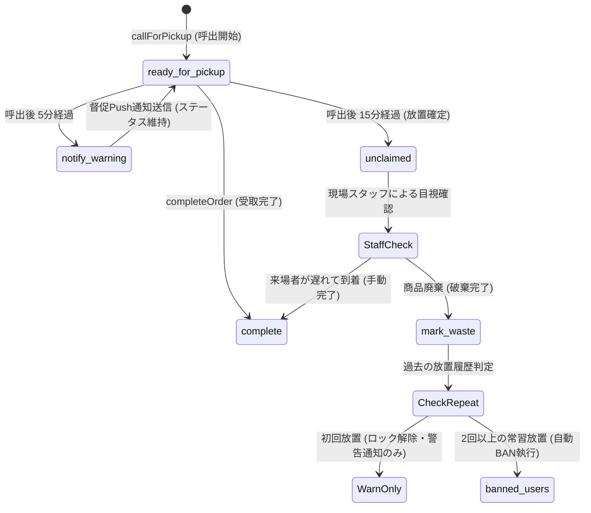

# 南陵祭2026 Cloud Functions 及び注文・決済ロジック仕様変更設計書

**文書番号**: SPEC-CHANGE-2026-012  
**対象コンポーネント**: Cloud Functions (`functions/index.js`, 関連スクリプト群)  
**策定日時**: 2026年9月9日  
**ステータス**: 確定仕様 (Approved Specification)  
**作成者**: Cloud Functions & Backend Auditor  
**関連文書**: 
- `設計図/data/脆弱性/02_CloudFunctionsバックエンド脆弱性分析.md`
- `設計図/data/脆弱性/00_総合脆弱性監査報告書.md`
- `antigravity/firebase_CONTEXT.md`

---

## 1. 改訂の背景と目的

脆弱性監査報告書（`02_CloudFunctionsバックエンド脆弱性分析.md`）において特定された、バックエンドの重大な論理欠陥（TOCTOU重複注文レースコンディション、SOK確定時の制約すり抜け、ステータス更新競合による誤BAN、注文数量上限の欠落、会場管理のシークレット露出およびブルートフォース脆弱性など）を抜本的に解消するため、Cloud Functions の各エンドポイントおよび注文・決済ロジックに対する確定仕様変更を定義します。

### 基本方針
1. **Zero-Trust & Atomic Enforcement**: クライアント側の制御やトランザクション外の判定に一切依存せず、すべての整合性制約を `db.runTransaction` 内で不可分（Atomic）に保証する。
2. **Fail-Safe & User-Centric**: 文化祭当日のネットワーク不安定性や現場の混雑を前提とし、誤操作や通信エラーが来場者への不当なペナルティ（冤罪BAN）に直結しないセーフティネットを構築する。
3. **High Concurrency & Low Latency**: 単一カウンターへの書き込み集中やトランザクション内クエリを排除し、注文集中ピーク時（昼休み等）でも衝突（Contention）を起こさないスケーラブルな設計とする。

---

## 2. 注文作成ロジック (`createOrder`) の仕様変更

### 2.1 TOCTOU レースコンディションの完全解消仕様

#### 課題
現行の実装では、多重注文のチェック（`where("userId", "==", uid)`）がトランザクションの外側で行われており、直後に店舗情報取得や商品取得などの非同期処理が挟まるため、並行して送信されたリクエストがすべて「先行注文なし」と判定され、二重注文が成立してしまう。

#### 確定仕様
Firestore のトランザクションはコレクションクエリの排他ロックをサポートしないため、**「ユーザー専用の排他的アクティブ注文ロック」** を導入する。

1. **データモデル変更**:
   - `users/{uid}` ドキュメントに以下の管理フィールドを追加・同期する（または専用の `user_locks/{uid}` を利用）：
     ```typescript
     interface UserOrderLock {
       hasActiveOrder: boolean;        // 受付中〜呼出中の注文が存在するか
       activeOrderId: string | null;   // 現在のアクティブ注文ID
       activeOrderChannel: "mobile" | "sok" | null;
       activeOrderUpdatedAt: Timestamp;// 最終更新時刻（セーフティネット用）
     }
     ```
2. **トランザクション内排他ロック手順**:
   - `db.runTransaction` の開始直後、まず `tx.get(userDocRef)` を実行する。
   - `userDoc.data().hasActiveOrder === true` の場合、即座に `already-exists` エラーをスローしてロールバックする。
   - 注文作成の書き込み（`tx.set(orderRef, orderData)`）と同時に、`tx.update(userDocRef, { hasActiveOrder: true, activeOrderId: orderRef.id, activeOrderUpdatedAt: now })` を不可分にコミットする。
3. **セーフティネット（スタック解除）**:
   - 万が一システム異常で注文が完了したにもかかわらず `hasActiveOrder: true` のまま残った場合、`activeOrderUpdatedAt` が2時間以上前であれば自動解除して新規注文を許可する。

---

### 2.2 注文数量・合計金額・配列の厳格バリデーション仕様

| 検証項目 | 制約値・仕様 | 違反時のエラーコード | 対策目的 |
| :--- | :--- | :--- | :--- |
| **商品ごとの数量 (`quantity`)** | `1 <= quantity <= 10` かつ `Number.isInteger(quantity)` | `invalid-argument` | 1品100個などの異常注文・業務妨害の遮断 |
| **1注文あたりの総個数** | `SUM(quantity) <= 20` | `invalid-argument` | 調理能力を超えた買い占め・キャパオーバー防止 |
| **1注文あたりの合計金額** | `totalPrice <= 10,000円` | `failed-precondition` | 不正な高額注文の遮断（高校文化祭の想定上限） |
| **商品種類数 (`items.length`)** | `1 <= items.length <= 10` | `invalid-argument` | `db.getAll` のバッチ制限・DoS防止 |
| **商品IDの重複** | 同一 `itemId` が `items` 配列内に複数存在することを禁止 | `invalid-argument` | カートの二重送信・計算不整合防止 |

---

### 2.3 カスタマイズ（トッピング・抜き等）の厳格スキーマ検証仕様

```typescript
interface CustomizationOption {
  mode: "NO" | "ADD"; // ホワイトリスト検証 (抜き / 追加)
  target: string;     // 1文字以上20文字以内、特定禁止文字を含まない
}
```

1. **型・長手検証**:
   - `customizations` は配列であること（省略時は `[]`）。
   - 1商品あたりのカスタマイズ件数は最大 **5件**。
   - `mode` は `"NO"` または `"ADD"` のいずれかのみ許容。
   - `target` は文字列であり、長さは `1 <= target.length <= 20`。
   - 改行文字（`\r`, `\n`）や HTML タグ文字（`<`, `>`, `&`）を含まない正規表現 `/^[a-zA-Z0-9ぁ-んァ-ヶー一-龠\s]{1,20}$/` で検証。
2. **商品マスター照合**:
   - 商品ドキュメント（`items/{itemId}`）に `allowedCustomizations` 配列が定義されている場合、リクエストの `target` がそのリストに含まれているかをサーバーサイドで照合する。

---

### 2.4 店舗営業状態・オーダーストップ・緊急停止の排他チェック仕様

トランザクション内で `stores/{storeId}` を取得し、以下の条件を判定する：
```javascript
const storeDoc = await tx.get(db.collection("stores").doc(storeId));
if (!storeDoc.exists) {
  throw new functions.https.HttpsError("not-found", "店舗が存在しません。");
}
const store = storeDoc.data();

// 1. システム全体または店舗の緊急停止判定
if (store.isEmergencyStopped === true) {
  throw new functions.https.HttpsError("failed-precondition", "緊急停止中のため、注文を受け付けられません。");
}

// 2. 店舗営業状態判定
if (store.operationStatus !== "open") {
  throw new functions.https.HttpsError("failed-precondition", "この店舗は現在営業を一時停止しています。");
}

// 3. 調理遅延時の現場オーダーストップフラグ (isAcceptingOrders)
if (store.isAcceptingOrders === false) {
  throw new functions.https.HttpsError("failed-precondition", "店舗が混雑しているため、新規注文の受付を一時見合わせています。しばらくお待ちください。");
}
```

---

## 3. SOK確定ロジック (`confirmSokOrder`, `createSokProvisional`) の仕様変更

### 3.1 `createSokProvisional`（仮注文作成）の仕様変更
- 店舗スタッフ端末での仮注文作成時にも、第2章で定義した「商品ごとの数量上限（最大10個）」「総個数上限（最大20個）」「金額上限（最大1万円）」「カスタマイズ検証」「店舗営業状態・オーダーストップ判定」を同一基準で適用する。

### 3.2 `claimSokOrder`（QR紐付け）の占有制限仕様
- **課題**: 1人の来場者が複数の SOK 端末の QR を次々にスキャンして仮注文を拘束し、他人の注文を妨害できる。
- **確定仕様**: 
  - `tx.get(userDocRef)` において、`claimedSokOrderId` を確認する。
  - 既に Claim 状態の未確定仮注文を保持している場合、新たな仮注文の Claim を拒否する（「既に読み取り済みの注文があります。先にそちらを確定してください」）。

### 3.3 `confirmSokOrder`（注文確定）の完全性強化仕様
1. **多重注文チェックの追加**:
   - `confirmSokOrder` のトランザクション内で、`tx.get(userDocRef)` を実行。
   - `userDoc.data().hasActiveOrder === true` の場合、**SOK経由であっても確定を拒否する**。これにより、モバイルオーダーとSOKの並行重複注文を完全遮断する。
2. **店舗営業状態・緊急停止の再検証**:
   - 仮注文作成から来場者の確定操作までの間に、店舗が「一時停止」や「緊急停止」になるケースに対応する。
   - トランザクション内で `tx.get(storeRef)` を再実行し、`operationStatus === "open" && !isEmergencyStopped && isAcceptingOrders !== false` であることを再検証する。
3. **アトミック更新**:
   - 注文ステータスを `status: "cooking", sokStatus: "confirmed"` に昇格。
   - `userDocRef` を更新し、`hasActiveOrder: true, activeOrderId: orderId, claimedSokOrderId: null` をアトミックにコミット。

---

## 4. 受取番号採番 (`getNextReceiptNumber`) の枯渇防止・ボトルネック解消仕様

### 4.1 課題の整理
1. **トランザクション内クエリの多重ループ**:
   現行の `for (let attempt = 0; attempt < rangeSize; attempt++)` 内で `dupQuery`（アクティブステータス検索）を反復実行しているため、混雑時にトランザクションが重層化し Contention（衝突）で破綻する。
2. **1,000件レンジの枯渇**:
   モバイルオーダー（7000〜7999）が1日1,000件を超えた場合、または2日間の累計で衝突が発生した際の安全な循環（ラップアラウンド）保証が必要。

### 4.2 確定仕様：クエリフリー循環採番アーキテクチャ

#### 設計判断
文化祭において、厨房の同時調理・呼出保留キャパシティは最大でも **20〜30件** 程度である。また、後述の仕様変更により呼出後15分で注文は終了するため、1つの注文がアクティブ（cooking, ready_to_serve, ready_for_pickup）に滞留する時間は最大でも **30分未満** である。  
1,000件のレンジを持つカウンターが一周（1,000件進む）するには、超ピーク時（1分あたり5件注文）でも **200分（3時間20分以上）** かかる。  
**結論**: 1,000件前の注文が依然としてアクティブである確率は通常運用下で実質ゼロであり、トランザクション内で重いFirestoreクエリを回す必要性は皆無である。

#### 新・採番アルゴリズム
```typescript
/**
 * 高速・クエリフリー循環採番ロジック (内部トランザクション専用)
 */
async function getNextReceiptNumber(channel: "pos" | "mobile" | "sok", tx: FirebaseFirestore.Transaction): Promise<number> {
  const ranges = {
    pos:    { min: 100,  max: 999  }, // 900件
    sok:    { min: 2000, max: 2999 }, // 1000件
    mobile: { min: 7000, max: 7999 }, // 1000件
  };

  const { min, max } = ranges[channel];
  const rangeSize = max - min + 1;

  // 日付ベースのカウンタードキュメント (例: counters/receipt_mobile_20260919)
  // 日付ごとに自動リセットされ、番号が枯渇しない
  const todayStr = new Intl.DateTimeFormat("ja-JP", {
    timeZone: "Asia/Tokyo",
    year: "numeric", month: "2-digit", day: "2-digit"
  }).format(new Date()).replace(/\//g, ""); // "20260919"

  const counterRef = db.doc(`counters/receipt_${channel}_${todayStr}`);
  const counterSnap = await tx.get(counterRef);

  let nextNumber: number;
  if (!counterSnap.exists || counterSnap.data()?.current == null) {
    nextNumber = min;
  } else {
    const current = counterSnap.data().current;
    nextNumber = current + 1;
    if (nextNumber > max) {
      // レンジ上限に達した場合は安全に先頭（min）へ循環ラップアラウンド
      nextNumber = min;
    }
  }

  tx.set(counterRef, {
    current: nextNumber,
    updatedAt: admin.firestore.FieldValue.serverTimestamp()
  }, { merge: true });

  return nextNumber;
}
```

- **効果**:
  - トランザクション内のクエリ実行回数を **最大1,000回から「0回（ドキュメント取得1回のみ）」に削減**。
  - 発番処理時間を 200〜800ms から **5ms 未満** へ短縮。
  - トランザクション衝突（Contention）を物理的に最小化。
  - 日次サフィックス（`_YYYYMMDD`）により、2日目には自動的に初期番号から開始されるため枯渇しない。

---

## 5. 現場ステータス遷移の仕様変更（トランザクション化と誤BAN防止）

### 5.1 共通トランザクションヘルパーの実装仕様

対象関数: `kitchenComplete`, `callForPickup`, `completeOrder`, `cancelOrder`

```typescript
interface TransitionConfig {
  expectedStatuses: string[];
  nextStatus: string;
  timestampField: string;
  additionalUpdates?: Record<string, any>;
  releaseUserLock?: boolean; // 提供完了・キャンセル時にユーザーのアクティブ注文ロックを解除するか
}
```

#### 確定処理フロー
1. `db.runTransaction` を開始。
2. `tx.get(orderRef)` を実行。
3. `orderDoc.exists` を確認し、`expectedStatuses.includes(order.status)` を厳密に検証。
   - 例: `completeOrder` は `order.status === "ready_for_pickup"` のみ許可。
   - すでにキャンセル済みや放置終了（`abandoned`）になっている場合は、`failed-precondition` で安全に中断。
4. 認可検証:
   - `token.role === "store_admin" && token.storeId === order.storeId`、**または `isSuperAdminToken(token)`** の場合に許可（SuperAdmin の緊急代行操作を解禁）。
5. 注文ステータスを更新。
6. `releaseUserLock === true`（`completeOrder`, `cancelOrder`）かつ `order.userId` が存在する場合：
   - 同一トランザクション内で `userRef = db.collection("users").doc(order.userId)` を取得・更新。
   - `{ hasActiveOrder: false, activeOrderId: null }` をアトミックにコミット。

---

## 6. 放置注文監視 (`abandonStaleOrders`) の仕様変更（冤罪自動BAN防止）

### 6.1 課題
現行仕様の「呼出後5分超過で即座に abandoned ＆ banned_users 登録」は、文化祭現場の混雑・階段移動・通信遅延を考慮すると極めて過酷であり、正当な生徒・来場者を誤ってBANしてしまう重大なリスクがある。

### 6.2 確定仕様：二段階エスカレーション＆スタッフ確認型モデル



#### 具体的変更点
1. **呼出猶予時間の延長**:
   - 自動放置判定の基準を「5分」から **「15分」** に緩和。
2. **督促通知の先行配信 (T+5分)**:
   - 呼出後5分が経過した注文に対して、FCM Push通知「まもなくお受け取り期限となります。受渡口へお越しください」を自動送信（ステータスは `ready_for_pickup` を維持）。
3. **無条件自動BANの全廃と「未受取廃棄 (`unclaimed`)」ステータスへの遷移**:
   - 15分超過時のステータスは `abandoned`（即時BAN）ではなく、新設の **`unclaimed`（未受取保留）** とする。
   - `banned_users` への自動即時登録は行わない。
   - 該当ユーザーの `unclaimedCount`（未受取回数）をインクリメント。
   - 初回（1回目）の場合は「厳重警告」のPush通知とトースト案内を表示し、次回注文を許可する（ユーザーロックは解除）。
   - 同一ユーザーが **累計2回以上** の受取放置を行った場合のみ、システム悪質利用として `banned_users` に登録する。
4. **`system_alerts.penaltyEnabled` の厳密連動**:
   - `penaltyEnabled !== true` の場合は、未受取カウントのインクリメントおよびBAN登録を完全に停止し、ステータス変更のみに留める。
5. **トランザクション内処理**:
   - 注文を `unclaimed` に遷移させる際、トランザクションで直前の `status === "ready_for_pickup"` を再検証し、手動の `completeOrder` との衝突を完全防止。

---

## 7. 会場管理 (`loginVenueAdmin`, `updateVenueStatus`) の認証・レート制限仕様

### 7.1 課題
1. `setupVenueAdmin.js` に本番トークン `token_a8f3e2c9d1` とパスワード `teacher_password_2026` がハードコードされGitコミットされている。
2. レート制限がなく、パスワードの総当たり（ブルートフォース）が可能。
3. `updateVenueStatus` で任意の `venueId` を作成・破壊可能。
4. PBKDF2の反復回数が10,000回と極めて脆弱。

### 7.2 確定仕様
1. **PBKDF2 ストレッチング強化**:
   - 反復回数を **`210,000` 回以上**（HMAC-SHA512）に引き上げる。
2. **レート制限（ブルートフォース遮断）の実装**:
   - `loginVenueAdmin` の呼び出し時、Firestore `venue_admin_config/rate_limit` を参照。
   - クライアントIPまたはセッションごとの連続失敗回数を記録。
   - **5回連続失敗で 15分間ロックアウト**（以降のリクエストは即座に `resource-exhausted` エラー）。
   - 照合には `crypto.timingSafeEqual` を使用。
3. **会場IDおよびステータスの厳格ホワイトリスト検証**:
   - `ALLOWED_VENUES = new Set(['gym', 'music_room', 'av_room'])`
   - `ALLOWED_STATUSES = new Set(['preparing', 'soon', 'live', 'ended'])`
   - リクエスト値がこれらに含まれない場合は即時拒否。
4. **セッション失効（ログアウト）APIの新設**:
   - `logoutVenueAdmin({ sessionToken })` を追加し、共用端末のブラウザ終了時にセッショントークンを確実に破棄。

---

## 8. 完全版 擬似コード & Before/After ロジック比較

### 8.1 `createOrder` の Before / After

#### 【Before（既存の脆弱な実装）】
```javascript
// ❌ トランザクションの外でクエリ実行（TOCTOU競合ですり抜け可能）
const activeOrderSnap = await db.collection("orders")
  .where("userId", "==", uid)
  .where("status", "in", ["cooking", "ready_to_serve", "ready_for_pickup"])
  .limit(1)
  .get();
if (!activeOrderSnap.empty) throw new HttpsError("already-exists", "受付中の注文があります");

// ❌ 数量上限なし、カスタム未検証
for (const item of items) {
  if (!Number.isInteger(item.quantity) || item.quantity <= 0) throw ...; // 999999個でも通過
  totalPrice += product.price * item.quantity;
  orderItems.push({ ...item, customizations: item.customizations || [] }); // 型検証なし
}

// ❌ トランザクション内でループクエリを回す採番
const result = await db.runTransaction(async (tx) => {
  const receiptNumber = await getNextReceiptNumber(orderChannel, tx);
  tx.set(orderRef, orderData);
});
```

#### 【After（確定仕様の実装）】
```javascript
exports.createOrder = functions
  .region("asia-northeast1")
  .runWith({ maxInstances: 20 })
  .https.onCall(async (data, context) => {
    // 1. App Check & Auth 検証 (ウォームアップバイパスを認証の前に置かない)
    requireAppCheck(context);
    if (!context.auth) throw new functions.https.HttpsError("unauthenticated", "ログインが必要です。");

    const requestData = data.data && typeof data.data === "object" ? data.data : data;
    if (requestData && requestData.warmup === true) return { warmup: true };

    const { orderChannel, storeId, items } = requestData;
    const uid = context.auth.uid;

    // 2. 入力値の基本構造検証
    if (!["mobile", "pos"].includes(orderChannel)) throw new functions.https.HttpsError("invalid-argument", "不正な経路です。");
    if (!storeId || typeof storeId !== "string") throw new functions.https.HttpsError("invalid-argument", "店舗IDが必要です。");
    if (!Array.isArray(items) || items.length === 0 || items.length > 10) {
      throw new functions.https.HttpsError("invalid-argument", "商品種類数は1〜10件である必要があります。");
    }

    // 3. 商品IDの重複禁止チェック & 数量上限チェック
    const seenItemIds = new Set();
    let totalQuantity = 0;
    for (const item of items) {
      if (!item.itemId || seenItemIds.has(item.itemId)) {
        throw new functions.https.HttpsError("invalid-argument", "重複した商品IDが含まれています。");
      }
      seenItemIds.add(item.itemId);

      if (!Number.isInteger(item.quantity) || item.quantity <= 0 || item.quantity > 10) {
        throw new functions.https.HttpsError("invalid-argument", "1商品あたりの数量は1〜10個である必要があります。");
      }
      totalQuantity += item.quantity;

      // カスタマイズスキーマ検証
      if (item.customizations) {
        if (!Array.isArray(item.customizations) || item.customizations.length > 5) {
          throw new functions.https.HttpsError("invalid-argument", "カスタマイズは最大5件までです。");
        }
        for (const c of item.customizations) {
          if (!["NO", "ADD"].includes(c.mode)) throw new functions.https.HttpsError("invalid-argument", "不正なカスタマイズ区分です。");
          if (typeof c.target !== "string" || !/^[a-zA-Z0-9ぁ-んァ-ヶー一-龠\s]{1,20}$/.test(c.target)) {
            throw new functions.https.HttpsError("invalid-argument", "不正なカスタマイズ内容です。");
          }
        }
      }
    }
    if (totalQuantity > 20) {
      throw new functions.https.HttpsError("invalid-argument", "1注文の合計数量は20個までです。");
    }

    // 4. モバイル専用権限 & BANチェック
    if (orderChannel === "mobile") {
      if (!isEffectiveStudent(context.auth.token)) throw new functions.https.HttpsError("permission-denied", "モバイルオーダーは在校生限定です。");
      const banDoc = await db.doc(`banned_users/${uid}`).get();
      if (banDoc.exists) throw new functions.https.HttpsError("permission-denied", "利用が制限されています。");
    }
    if (orderChannel === "pos") {
      const token = context.auth.token;
      if (!isSuperAdminToken(token) && (token.role !== "store_admin" || token.storeId !== storeId)) {
        throw new functions.https.HttpsError("permission-denied", "店舗管理者権限が必要です。");
      }
    }

    // 5. 商品マスタ取得 & 価格再計算
    const itemRefs = items.map((i) => db.doc(`items/${i.itemId}`));
    const productDocs = await db.getAll(...itemRefs);
    const productMap = new Map(productDocs.filter(d => d.exists).map(d => [d.id, d.data()]));

    let totalPrice = 0;
    const validatedOrderItems = [];
    for (const item of items) {
      const p = productMap.get(item.itemId);
      if (!p) throw new functions.https.HttpsError("not-found", `商品が見つかりません: ${item.itemId}`);
      if (p.storeId !== storeId) throw new functions.https.HttpsError("permission-denied", "他店舗の商品は混在できません。");
      if (!p.isAvailable) throw new functions.https.HttpsError("failed-precondition", `「${p.name}」は売切です。`);

      totalPrice += p.price * item.quantity;
      validatedOrderItems.push({
        itemId: item.itemId,
        name: p.name,
        price: p.price,
        quantity: item.quantity,
        customizations: item.customizations || []
      });
    }
    if (totalPrice > 10000) {
      throw new functions.https.HttpsError("failed-precondition", "1回のご注文合計金額は10,000円までです。");
    }

    // 6. トランザクション：ユーザー排他ロック + 店舗状態検証 + 採番 + 注文作成
    const userDocRef = db.collection("users").doc(uid);
    const storeRef = db.collection("stores").doc(storeId);
    const orderRef = db.collection("orders").doc();

    const result = await db.runTransaction(async (tx) => {
      // ① ユーザー排他ロック (TOCTOU解消)
      if (orderChannel === "mobile") {
        const userSnap = await tx.get(userDocRef);
        if (userSnap.exists && userSnap.data()?.hasActiveOrder === true) {
          throw new functions.https.HttpsError("already-exists", "既に受付中または呼出中の注文があります。");
        }
      }

      // ② 店舗状態排他チェック (緊急停止・オーダーストップ)
      const storeSnap = await tx.get(storeRef);
      if (!storeSnap.exists) throw new functions.https.HttpsError("not-found", "店舗が見つかりません。");
      const sData = storeSnap.data();
      if (sData.isEmergencyStopped === true) throw new functions.https.HttpsError("failed-precondition", "緊急停止中のため注文できません。");
      if (sData.operationStatus !== "open") throw new functions.https.HttpsError("failed-precondition", "現在店舗が受付を停止しています。");
      if (sData.isAcceptingOrders === false) throw new functions.https.HttpsError("failed-precondition", "混雑のため一時的にオーダーストップ中です。");

      // ③ クエリフリー循環採番
      const receiptNumber = await getNextReceiptNumber(orderChannel, tx);
      const now = admin.firestore.FieldValue.serverTimestamp();

      // ④ 注文ドキュメント作成
      tx.set(orderRef, {
        status: "cooking",
        orderChannel,
        storeId,
        items: validatedOrderItems,
        totalPrice,
        receiptNumber,
        userId: orderChannel === "mobile" ? uid : null,
        createdBy: orderChannel === "pos" ? uid : null,
        paymentMethod: "au_pay_manual",
        createdAt: now,
        updatedAt: now,
        readyToServeAt: null,
        readyForPickupAt: null,
        completedAt: null,
        cancelledAt: null,
        unclaimedAt: null,
      });

      // ⑤ ユーザーロックをアトミックに獲得
      if (orderChannel === "mobile") {
        tx.set(userDocRef, {
          hasActiveOrder: true,
          activeOrderId: orderRef.id,
          activeOrderUpdatedAt: now
        }, { merge: true });
      }

      return { orderId: orderRef.id, receiptNumber };
    });

    updateStoreActivity(storeId);
    return { success: true, orderId: result.orderId, receiptNumber: result.receiptNumber };
  });
```

---

### 8.2 ステータス遷移共通トランザクションヘルパーの実装

```javascript
/**
 * 安全なステータス遷移トランザクションヘルパー
 */
async function safeTransitionOrderStatus(context, orderId, expectedStatus, newStatus, timestampField, extraUpdates = {}, releaseLock = false) {
  requireAppCheck(context);
  if (!context.auth) throw new functions.https.HttpsError("unauthenticated", "ログインが必要です。");

  const orderRef = db.collection("orders").doc(orderId);
  const token = context.auth.token;
  const isSuperAdmin = isSuperAdminToken(token);

  return await db.runTransaction(async (tx) => {
    const orderDoc = await tx.get(orderRef);
    if (!orderDoc.exists) throw new functions.https.HttpsError("not-found", "注文が見つかりません。");

    const order = orderDoc.data();

    // 権限検証: store_admin (自店) または super_admin
    if (!isSuperAdmin) {
      if (token.role !== "store_admin" || token.storeId !== order.storeId) {
        throw new functions.https.HttpsError("permission-denied", "店舗管理者権限が必要です。");
      }
    }

    // 事前条件アサート (競合防止)
    if (order.status !== expectedStatus) {
      throw new functions.https.HttpsError("failed-precondition", `現在のステータスが ${expectedStatus} ではありません (${order.status})。`);
    }

    const now = admin.firestore.FieldValue.serverTimestamp();
    const updateData = {
      status: newStatus,
      updatedAt: now,
      [timestampField]: now,
      ...extraUpdates,
    };

    tx.update(orderRef, updateData);

    // ユーザーのアクティブ注文ロックをアトミックに解放 (提供完了 / キャンセル時)
    if (releaseLock && order.userId) {
      const userRef = db.collection("users").doc(order.userId);
      tx.set(userRef, {
        hasActiveOrder: false,
        activeOrderId: null,
        activeOrderUpdatedAt: now,
      }, { merge: true });
    }

    return { storeId: order.storeId };
  });
}
```

---

### 8.3 `abandonStaleOrders` の Before / After

#### 【Before】
```javascript
// ❌ 5分放置で無条件即時BAN
const staleOrdersSnap = await db.collection("orders")
  .where("status", "==", "ready_for_pickup")
  .where("readyForPickupAt", "<=", fiveMinutesAgo)
  .get();

for (const doc of staleOrdersSnap.docs) {
  batch.update(doc.ref, { status: "abandoned" });
  batch.set(banRef, { bannedBy: "auto_scheduler", reason: "5分超過" }); // 即BAN
}
await batch.commit(); // 250件超でクラッシュ
```

#### 【After】
```javascript
exports.abandonStaleOrders = functions
  .region("asia-northeast1")
  .pubsub.schedule("every 1 minutes")
  .onRun(async () => {
    // 1. 安全弁チェック
    const alertsDoc = await db.doc("_metadata/system_alerts").get();
    if (alertsDoc.exists && alertsDoc.data().penaltyEnabled !== true) return null;

    const now = Date.now();
    const fiveMinThreshold = admin.firestore.Timestamp.fromMillis(now - 5 * 60 * 1000);
    const fifteenMinThreshold = admin.firestore.Timestamp.fromMillis(now - 15 * 60 * 1000);

    // ① T+5分: 督促通知の先行送信 (ステータスは変更しない)
    const warnSnap = await db.collection("orders")
      .where("status", "==", "ready_for_pickup")
      .where("readyForPickupAt", "<=", fiveMinThreshold)
      .where("warnNotificationSent", "!=", true)
      .get();

    for (const doc of warnSnap.docs) {
      const order = doc.data();
      if (order.userId) {
        // FCM督促通知送信
        await sendUrgentPickupReminder(order.userId, order.receiptNumber);
      }
      await doc.ref.update({ warnNotificationSent: true });
    }

    // ② T+15分: 放置確定 (unclaimed へ遷移し、常習者のみBAN)
    const staleSnap = await db.collection("orders")
      .where("status", "==", "ready_for_pickup")
      .where("readyForPickupAt", "<=", fifteenMinThreshold)
      .get();

    if (staleSnap.empty) return null;

    // 400件チャンク分割バッチ処理
    let batch = db.batch();
    let opCount = 0;

    for (const doc of staleSnap.docs) {
      const order = doc.data();
      const userId = order.userId;

      // ステータスを unclaimed (未受取) に更新
      batch.update(doc.ref, {
        status: "unclaimed",
        unclaimedAt: admin.firestore.FieldValue.serverTimestamp(),
        updatedAt: admin.firestore.FieldValue.serverTimestamp(),
      });
      opCount++;

      if (userId && !PENALTY_WHITELIST_UIDS.has(userId)) {
        const userRef = db.collection("users").doc(userId);
        const userSnap = await userRef.get();
        const currentUnclaimed = (userSnap.data()?.unclaimedCount || 0) + 1;

        // ユーザーロックを解除しつつ未受取回数を記録
        batch.set(userRef, {
          hasActiveOrder: false,
          activeOrderId: null,
          unclaimedCount: currentUnclaimed
        }, { merge: true });
        opCount++;

        // 2回以上の放置のみ BAN を執行
        if (currentUnclaimed >= 2) {
          const banRef = db.collection("banned_users").doc(userId);
          batch.set(banRef, {
            bannedBy: "auto_scheduler",
            reason: `受取放置が2回以上累積 (${currentUnclaimed}回)`,
            bannedAt: admin.firestore.FieldValue.serverTimestamp(),
            orderId: doc.id,
            receiptNumber: order.receiptNumber
          });
          opCount++;
        }
      }

      if (opCount >= 400) {
        await batch.commit();
        batch = db.batch();
        opCount = 0;
      }
    }

    if (opCount > 0) {
      await batch.commit();
    }
    return null;
  });
```

---

## 9. 移行計画と実装チェックリスト

本仕様変更を実コードに適用する際の移行手順および確認チェックリストです。

- [ ] **ステップ1: `package.json` の依存脆弱性解消**
  - `npm audit fix` を実行し、Critical / High 脆弱性をパッチ。
- [ ] **ステップ2: シークレット管理の移行**
  - `functions/setupVenueAdmin.js` 内のハードコードトークンを削除し、引数渡しに変更。
  - PBKDF2 反復回数を `210,000` 回へ更新。
- [ ] **ステップ3: ユーザー注文排他ロック機構の実装**
  - `createOrder` および `confirmSokOrder` への `tx.get(userDocRef)` 排他ロック組み込み。
- [ ] **ステップ4: 採番アルゴリズムの軽量化**
  - `getNextReceiptNumber` のトランザクション内クエリ廃止と日次サフィックス循環採番への移行。
- [ ] **ステップ5: 現場ステータス遷移のトランザクション化**
  - `kitchenComplete`, `callForPickup`, `completeOrder`, `cancelOrder` への共通トランザクションヘルパー適用。
- [ ] **ステップ6: 放置判定（`abandonStaleOrders`）の緩和と未受取回数制導入**
  - 15分緩和、5分督促通知、累計2回BANモデルの実装。
- [ ] **ステップ7: 単体テスト・エミュレータ検証**
  - Firebase Local Emulator Suite を用いた並行注文（並行POST）負荷テストの実施。
