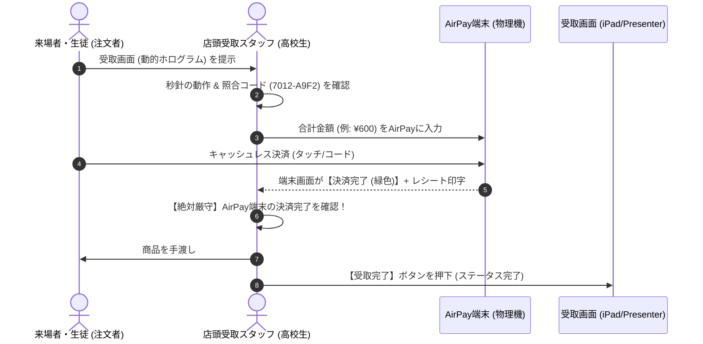

# 南陵祭2026 仕様変更設計書：POS・KDS・店頭受取オペレーション編
**Specification Change Design: POS, KDS & Store Counter Operations**

- **文書番号**: SEC-SPEC-2026-13
- **関連監査文書**:
  - `00_総合脆弱性監査報告書.md`
  - `03_POSモバイルオーダー脆弱性分析.md`
  - `01_Firebaseセキュリティルール脆弱性分析.md`
  - `02_CloudFunctionsバックエンド脆弱性分析.md`
- **作成日**: 2026年9月9日
- **策定責任者**: POS・モバイルオーダー・店舗運用専門監査官 (POS & Mobile Order Auditor)
- **対象領域**: 店舗運営フロントエンド（`pos/` 配下）、現場受渡オペレーション、端末キッティング

---

## 1. 概要と基本方針

### 1.1 仕様変更の目的と背景

南陵祭2026のセキュリティ監査（`03_POSモバイルオーダー脆弱性分析.md`）において、POS・モバイルオーダー・店舗運用ドメインにおける以下の重大な脆弱性および現場運用上のリスクが特定された：

1. **厨房KDS（`kitchen.html`）および受渡（`presenter.html`）における蓄積型XSS（Stored XSS）**: 注文カスタマイズ文字列を介した店舗端末の権限乗っ取りリスク。
2. **受取番号（連番）の推測可能性と口頭伝達による商品横取りリスク**: 店頭受取時のなりすまし・食い逃げリスク。
3. **店頭キオスクiPad（`sok.html`）の店舗管理者権限保持とブラウザ脱出リスク**: 来場者・生徒による店舗管理者ポータルへの侵入とデータ改ざんリスク。
4. **呼出モニター（`monitor.html`）の全公開データ依存とサイネージ誤操作リスク**: Firestoreルール改訂への不整合と店頭でのログアウト被害。
5. **店舗管理ポータル（`portal.html`）のLocalStorage過信と他店売上URL漏洩**: 認証バイパス表示および機密スプレッドシートURLの露出。
6. **AirPay手動決済とシステム連携の不整合、および受渡押し忘れによる「冤罪BAN」リスク**: 混雑時のスタッフ操作漏れによる無実の生徒へのペナルティ誤付与。

本設計書は、これらの課題を**「フロントエンドUI/UXの安全化」**、**「端末キッティング（ハードウェア施錠）」**、**「現場オペレーション手順の厳格化」** の3軸から総合的に解決するための実践的仕様変更を定義する。

### 1.2 設計基本方針

```
┌────────────────────────────────────────────────────────────────────────┐
│                        3層防御アーキテクチャ                           │
├───────────────────┬───────────────────┬────────────────────────────────┤
│ 1. UI/UXの防壁     │ 2. 端末の物理防壁 │ 3. 現場運用の防壁              │
│ (Secure Code)     │ (Kiosk Hardening) │ (Operational Procedure)       │
├───────────────────┼───────────────────┼────────────────────────────────┤
│ ・textContent化   │ ・iOSアクセスガイド│ ・口頭確認の完全禁止           │
│ ・動的照合ホログラム│ ・URLバー/ホーム施錠│ ・AirPay緑画面+動的画面の2重確認│
│ ・Claims厳格照合  │ ・パスコード本部集中│ ・冤罪BAN防止の受渡完了フロー  │
└───────────────────┴───────────────────┴────────────────────────────────┘
```

---

## 2. 厨房KDS・受渡カウンターのXSS完全根絶仕様

### 2.1 課題と脆弱性の所在

`pos/kitchen.html`（L966〜L970）および `pos/presenter.html`（L966〜L970）において、注文アイテムの `customizations`（トッピングやオプション）をレンダリングする際、以下のように `innerHTML` に未エスケープのまま文字列を結合している：

```javascript
// 脆弱な現行コード（kitchen.html / presenter.html）
return `<div class="customization-row">
          <span class="cust-badge ${badgeClass}">${displayMode}</span>
          <span class="cust-text">${target}</span>
        </div>`;
```

また、`pos/pos-alert.js`（L43）においても、管理者緊急通知メッセージを未エスケープで展開している：
```javascript
// 脆弱な現行コード（pos-alert.js）
<span>${data.posAlertMessage.replace(/\n/g, "<br>")}</span>
```

これにより、悪意ある生徒がモバイルオーダーAPI経由で `` などのスクリプトを注文データに混入させた場合、**店舗管理者権限を持つ厨房・受渡カウンターのiPad上でスクリプトが即座に自動実行され、セッションハイジャックや店舗データ破壊が発生する**。

### 2.2 改修仕様：DOMノード生成（安全なレンダリング）への移行

HTML文字列結合による `innerHTML` 展開を全面廃止し、**ブラウザネイティブの `createElement` および `textContent` によるDOMノード構築**、または**厳格なHTMLエスケープユーティリティの適用**を義務付ける。

#### (1) 共通エスケープ関数の定義（`pos/utils/escape.js` または各画面先頭）

```javascript
/**
 * 文字列中の特殊文字を安全に無害化する関数
 * @param {*} str - エスケープ対象
 * @returns {string} サニタイズ済み文字列
 */
export function escapeHtml(str) {
  if (str == null) return "";
  return String(str)
    .replace(/&/g, "&amp;")
    .replace(/</g, "&lt;")
    .replace(/>/g, "&gt;")
    .replace(/"/g, "&quot;")
    .replace(/'/g, "&#39;");
}
```

#### (2) `kitchen.html` / `presenter.html` のアイテムレンダリング改修

文字列テンプレートではなく、DOM要素を安全に構築する `buildItemElement` 関数に変更する：

```javascript
/**
 * 注文アイテム行要素を安全に構築する
 * @param {Object} item - 注文商品データ
 * @returns {HTMLElement} 安全に生成されたDOM要素
 */
function createSafeItemElement(item) {
  const itemRow = document.createElement("div");
  itemRow.className = "item-row";

  const itemMain = document.createElement("div");
  itemMain.className = "item-main";

  const itemQty = document.createElement("div");
  itemQty.className = "item-qty";
  itemQty.textContent = Number(item.quantity) || 1;

  const itemName = document.createElement("div");
  itemName.className = "item-name";
  itemName.textContent = item.name || "名称未設定";

  itemMain.appendChild(itemQty);
  itemMain.appendChild(itemName);
  itemRow.appendChild(itemMain);

  // カスタマイズ（トッピング）の安全な展開
  if (item.customizations && Array.isArray(item.customizations) && item.customizations.length > 0) {
    const custContainer = document.createElement("div");
    custContainer.className = "item-customizations";

    item.customizations.forEach((c) => {
      let mode = "", target = "";
      if (typeof c === "object" && c !== null) {
        mode = c.mode || "";
        target = c.target || c.name || "";
      } else {
        target = String(c);
      }

      const row = document.createElement("div");
      row.className = "customization-row";

      const badge = document.createElement("span");
      let badgeClass = "bg-gray";
      let displayMode = mode || "OPT";

      if (mode === "ADD") {
        badgeClass = "bg-green";
      } else if (mode === "NO" || mode === "REMOVE") {
        badgeClass = "bg-red";
        displayMode = "NO";
      }
      badge.className = `cust-badge ${badgeClass}`;
      badge.textContent = displayMode; // 安全なテキスト代入

      const text = document.createElement("span");
      text.className = mode === "NO" || mode === "REMOVE" ? "cust-text text-alert" : "cust-text";
      text.textContent = target; // 安全なテキスト代入（XSS完全防御）

      row.appendChild(badge);
      row.appendChild(text);
      custContainer.appendChild(row);
    });

    itemRow.appendChild(custContainer);
  }

  return itemRow;
}
```

#### (3) `pos-alert.js` の改修仕様

改行を安全に反映しつつスクリプトを遮断するため、エスケープ後に `<br>` 置換を行う、あるいは `textContent` と `style="white-space: pre-wrap;"` を用いる：

```javascript
// 改修後（pos-alert.js L43付近）
const msgSpan = document.createElement("span");
msgSpan.style.whiteSpace = "pre-wrap";
msgSpan.textContent = data.posAlertMessage; // innerHTMLではなくtextContentを使用
```

---

## 3. 店頭商品横取り（なりすまし・食い逃げ）防止仕様

### 3.1 脅威シナリオと脆弱性の本質

- **現状**: 受取番号（`receiptNumber`）は POS: `100〜999`、SOK: `2000〜2999`、Mobile: `7000〜7999` の**完全な連番**。
- **脅威**: 呼出モニター（`monitor.html`）を見た悪意ある者が「あ、今7012番が呼ばれた」と確認し、受取口へ行って「7012番です」と口頭で告げる、または静止画スクリーンショットを見せることで、他人の商品を不正に横取り受取（食い逃げ）できる。

```
[悪意ある生徒] ──(モニターで7012番を確認)──> [受取カウンター]
                                                      │
                                                      ├─「7012番です」(口頭)
                                                      ├─ または偽のスクショ提示
                                                      v
                                              [高校生スタッフ] ──(誤って商品手渡し)──> 被害発生！
```

### 3.2 現場受渡オペレーションの新ルール：【3大禁止事項】

1. **番号の口頭申告のみによる商品手渡しの完全禁止**:
   「7012番です」と口頭で言われた場合、スタッフは絶対に商品を渡してはならない。必ずスマホ画面のリアルタイム認証UIを提示させる。
2. **静止画スクリーンショット提示の受取拒否**:
   生徒が画面を見せる際、スタッフは「画面が動いているか（秒針が動いているか）」を目視確認する。
3. **AirPay決済前の商品手渡しの完全禁止**:
   モバイルオーダー・SOKは事前オンライン決済ではなく**店頭キャッシュレス決済**であるため、「決済完了」の前に商品を触らせてはならない。

---

### 3.3 スマホ受取画面（`status.html` / `mobile-order.html`）の「動的認証UI」仕様

生徒の画面が「本物のアクティブな注文画面」であることをスタッフが一目で判断できるように、以下の動的要素を組み込む。

#### (1) 動的認証UIの画面構成仕様

```
┌────────────────────────────────────────────────┐
│   南陵祭 2026 公式モバイルオーダー 受取証       │
├────────────────────────────────────────────────┤
│                                                │
│         受取番号 : # 7012                       │
│                                                │
│   ┌────────────────────────────────────────┐   │
│   │  [動的照合ホログラム]                   │   │
│   │  🌈 動くグラデーション光彩アニメーション │   │
│   │  ⏱ リアルタイム照合時刻: 12:34:56     │   │
│   │  🔑 照合コード: [ 7012 - A9F2 ]        │   │
│   └────────────────────────────────────────┘   │
│                                                │
│   注文内容: カステラ(チョコ) × 2              │
│   合計金額: ¥600                               │
│                                                │
│   ──────────────────────────────────────────   │
│   【スタッフ操作エリア】                       │
│   ※ お客様は押さないでください                 │
│   ┌────────────────────────────────────────┐   │
│   │  👉 [スライドして受取完了を照合]        │   │
│   └────────────────────────────────────────┘   │
└────────────────────────────────────────────────┘
```

#### (2) 動的要素の技術仕様

##### ① リアルタイム秒針付き動的クロノメーター
端末内部時計と同期し、毎秒ミリ秒単位で針が動くデジタルクロックを表示する。静止画スクショでは秒数が停止しているため、一目で偽造を見破れる。

```javascript
// status.html / mobile-order.html に組み込む動的クロック
function startSecurityChronometer() {
  const clockEl = document.getElementById("security-chronometer");
  if (!clockEl) return;
  setInterval(() => {
    const now = new Date();
    const timeStr = `${String(now.getHours()).padStart(2, '0')}:${String(now.getMinutes()).padStart(2, '0')}:${String(now.getSeconds()).padStart(2, '0')}`;
    clockEl.textContent = timeStr;
  }, 500);
}
```

##### ② CSSキーフレームによる偽造防止ホログラムアニメーション
背景で虹色（またはブランドカラー）のグラデーション波紋が滑らかにループ移動するアニメーション。画面録画でない限り模倣できない視覚効果。

```css
/* 偽造防止ホログラムバナー */
.security-hologram {
  background: linear-gradient(135deg, #3b82f6, #8b5cf6, #ec4899, #3b82f6);
  background-size: 300% 300%;
  animation: hologramWave 3s ease infinite;
  padding: 12px;
  border-radius: 12px;
  color: #ffffff;
  text-align: center;
  font-weight: 800;
  box-shadow: 0 4px 15px rgba(59, 130, 246, 0.4);
}

@keyframes hologramWave {
  0% { background-position: 0% 50%; }
  50% { background-position: 100% 50%; }
  100% { background-position: 0% 50%; }
}
```

##### ③ 照合コード（Verify Code）の導入
連番である `receiptNumber`（7012）に加え、推測不可能な `orderId` の末尾4桁（例: `A9F2`）を組み合わせた `7012 - A9F2` を太字で表示。KDS（`kitchen.html` / `presenter.html`）側にもこの末尾4桁を表示し、完全一致を確認する。

---

### 3.4 AirPay決済目視確認と商品手渡しの確実な連動手順（現場マニュアル）

店舗受取カウンターのスタッフは、以下の**「3点ロック手順（Triple Check）」**を1件ごとに必ず実行する。



---

## 4. セルフオーダーキオスクiPad（`sok.html`）の端末セキュリティ仕様

### 4.1 端末固有のリスク分析

店頭に設置される `pos/sok.html` は、注文作成権限を持つスタッフアカウント（`token.role === "store_admin"`）でログインされたブラウザ（Safari等）で稼働する。
端末に何のOS施錠も施されていない場合、来場者や生徒がホーム画面へ戻る、SafariのURLバーをタップして `portal.html` を開く、あるいは他サイトを閲覧するなどの不正行為が極めて容易に行えてしまう。

### 4.2 iOS「アクセスガイド（Guided Access）」キッティング仕様書

南陵祭の全SOK端末（iPad）は、一般開放前に以下の手順で**物理的・OSレベルで単一アプリに施錠（キオスク化）**しなければならない。

#### (1) iPad OS設定手順（事前キッティング）

1. **アクセスガイドの有効化**:
   - `設定` → `アクセシビリティ` → `アクセスガイド` を **オン** に設定。
   - `パスコード設定` → `アクセスガイドのパスコードを設定`：
     - **【重要】パスコードは実行委員会セキュリティ統括が定めた共通管理者パスコード（6桁英数）を設定する。店舗の生徒には絶対に教えない。**
   - `画面の自動ロック`: **「なし」**（運用中にスリープして画面が消えるのを防止）。
2. **Safariの起動とキオスク画面の固定**:
   - Safariで `https://[本番ドメイン]/pos/sok.html?storeId=XXX` を開く。
   - スタッフログインを完了させ、スタートアップ画面を表示させる。
3. **アクセスガイドの開始とタッチ制限エリアの設定**:
   - トップボタン（またはホームボタン）を **トリプルクリック** してアクセスガイドメニューを表示。
   - 左下の `オプション` をタップ：
     - **サイドボタン（電源ボタン）**: オフ（電源OFF防止）
     - **音量ボタン**: オフ
     - **動作（画面回転）**: オフ
     - **キーボード**: オン（トッピング等の文字入力が必要な場合のみ）
     - **タッチ**: オン
   - **【最重要】無効化エリアの指定**:
     - 画面最上部の **「Safari URLバー / タブ領域」** を指で囲み、グレーアウト（タッチ無効）にする。
     - これにより、画面上部を何度タップしてもURLの編集やタブの切り替えが一切不可能になる。
   - 右上の **「開始」** をタップしてキオスク施錠完了。

---

### 4.3 パスコード管理体制および生徒・来場者による脱出防止マニュアル

| 役割 | 権限 / 担当業務 |
|---|---|
| **実行委員会 セキュリティ統括** | アクセスガイドのマスターパスコードを保持。毎朝の端末設置時に施錠を実施。 |
| **各店舗 責任者（生徒代表）** | 端末の電源コード接続、画面拭き取り清掃、動作確認。パスコードは非保持。 |
| **店頭スタッフ（生徒）** | 注文サポート、用紙切れ確認。画面に異常が発生した場合は本部へ即時連絡。 |

- **トラブル発生時のルール**:
  Safariがクラッシュした場合、または端末エラーが発生した場合は、店舗スタッフが勝手に再起動を試みず、**「本部セキュリティ巡回班」を呼び出してパスコード解除・再設定**を行わせる。

---

## 5. 呼出モニター（`monitor.html`）の仕様変更

### 5.1 Firestoreセキュリティルール改訂に伴うデータバインド仕様

#### (1) 背景と課題
`01_Firebaseセキュリティルール脆弱性分析.md` において、`firestore.rules` の `orders` コレクションに対する `status == ready_for_pickup` の全公開ルールは、注文スクレイピングの温床となるため廃止・厳格化が勧告されている。

#### (2) 公開用集約コレクション（`public_display`）の導入仕様
一般来場者・サイネージ用モニター（`monitor.html`）が、機密情報を含む `orders` コレクションを直接リスニングするのを廃止し、**表示に必要な最小限の情報（受取番号とステータスのみ）を集約した公開用ドキュメントを Cloud Functions 経由で生成・同期する**。

```
[Cloud Functions] ──(ステータス変更トリガー)──> [Firestore: public_display/{storeId}]
                                                      │ { readyNumbers: [7012, 7015],
                                                      │   cookingNumbers: [7018, 7019] }
                                                      v
                                        [呼出モニター: monitor.html] (安全に購読)
```

- **Firestore スキーマ (`public_display/{storeId}`)**:
  ```json
  {
    "storeId": "301",
    "readyNumbers": [7012, 7015, 2003],
    "preparingNumbers": [7018, 7019, 2004],
    "updatedAt": "2026-09-09T10:00:00Z"
  }
  ```
- **セキュリティルール**:
  ```javascript
  match /public_display/{storeId} {
    allow read: if true; // 誰でも読める（番号の配列のみで安全）
    allow write: if false; // Functionsからのみ更新
  }
  ```
- **`monitor.html` の読み取りロジック変更**:
  `collection("orders")` への2つの重いクエリ（L763, L791）を廃止し、単一ドキュメント `doc(db, "public_display", STORE_ID)` のリアルタイムリスナーに統合する。ネットワーク負荷が激減し、同時接続数制限にも耐えうる構造となる。

---

### 5.2 サイネージ専用モード（誤操作・いたずら完全防止）

- **ハンバーガーボタン（従業員メニュー）の非表示化**:
  店頭サイネージとして動作させる場合、URLパラメータに `?kiosk=1` または `?signage=1` を付与することで、メニューボタン（`#menu-btn`）をDOMから完全に削除する。
- **全画面タッチ無効化**:
  サイネージ表示中は誤タップによる画面崩れを防ぐため、CSSで `pointer-events: none;` を適用する。

```javascript
// monitor.html 内でのサイネージモード適用
if (urlParams.get("signage") === "1") {
  const menuBtn = document.querySelector(".menu-btn");
  if (menuBtn) menuBtn.remove(); // 従業員メニューを完全削除
  document.body.style.userSelect = "none";
  document.body.style.cursor = "none";
}
```

---

## 6. 店舗管理ポータル（`portal.html`）の認証・データ保護仕様

### 6.1 `localStorage` 過信の是正（Custom Claims による厳格検証）

#### (1) 現状の脆弱性
`localStorage.getItem("nanryosai_store_id")` が存在する場合、Custom Claimsの検証を行わずに `startApp()` を実行してしまうため、コンソールから他店舗IDを書き込むだけで他店舗のポータル表示が立ち上がってしまう（VULN-04）。

#### (2) 改修後の認証ガード仕様

```javascript
// 改修後（portal.html Auth Logic）
watchUser(async (user) => {
  const loader = document.getElementById("global-loader");
  if (loader) loader.classList.remove("active");

  if (!user) {
    showLoginOverlay();
    return;
  }

  // 1. 在校生権限チェック
  const claims = await getClaims();
  if (!isEffectiveStudent(claims)) {
    showDomainError(user);
    return;
  }

  // 2. Custom Claims の storeId と role を検証
  const userRole = claims.role;
  const userStoreId = claims.storeId;

  const cachedId = localStorage.getItem("nanryosai_store_id");

  // トークン自体に店舗管理者権限が付与されているか厳格に照合
  if (userRole === "store_admin" && userStoreId) {
    if (cachedId && cachedId !== userStoreId) {
      console.warn("Storage storeId mismatch. Correcting to Token storeId.");
      localStorage.setItem("nanryosai_store_id", userStoreId);
    }
    currentStoreId = userStoreId;
    startApp(); // 正当なClaims保持時のみ起動
  } else {
    // Claimsを持っていない場合は、過去のLocalStorageを破棄してパスワード入力を強制
    localStorage.removeItem("nanryosai_store_id");
    showStorePasswordModal();
  }
});
```

---

### 6.2 スプレッドシートURLの完全秘匿化

#### (1) 背景
`stores/{storeId}` ドキュメント内に保存されている `spreadsheetUrl` は、一般公開ルール（`allow read: if true;`）により、本来非公開であるべき各クラスの売上スプレッドシートURLが誰でも閲覧可能になっている。

#### (2) 改修仕様
1. **データ移行**:
   `stores/{storeId}.spreadsheetUrl` フィールドを廃止し、アクセス不可の `store_secrets/{storeId}.spreadsheetUrl` へ完全移管する。
2. **専用Callable Functionの提供**:
   店舗責任者がスプレッドシートを開く際は、Cloud Functions `getStoreSpreadsheetUrl` を新設し、呼び出し元の `token.storeId === storeId` を検証した上でURLを返却する。

---

### 6.3 グローバル露出オブジェクトの排除

`pos/portal.html` L3370 付近に存在するデバッグ用コードを完全削除する：

```javascript
// 削除対象（本番コードに含めてはならない）
// window.firebaseFunctions = functions;
// window.httpsCallable = httpsCallable;
```

---

## 7. 現場混雑時の「冤罪BAN防止」運用＆システム仕様

### 7.1 構造的リスクのメカニズム

```
[生徒が商品を正常受取] ──> 美味しく飲食中
          │
          │ (スタッフが超多忙で画面の「受取完了」ボタンを押し忘れる！)
          v
[システム上は ready_for_pickup のまま放置]
          │
          │ (5分経過)
          v
[Scheduled Function: abandonStaleOrders が毎分巡回]
          │
          v
[ステータスを強制的に abandoned (期限切れ廃棄) に変更！]
          │
          v
[ペナルティスコア加算 ──> 生徒が自動BAN (利用停止) に！！] ──> 【重大な冤罪トラブル発生】
```

文化祭当日のピーク時（11:30〜13:30）、模擬店の店頭は戦場のような混雑となり、高校生スタッフが商品を手渡した後にiPadのボタンを押し忘れる事故は**100%の確率で発生する**。これを放置すれば、無実の生徒が次々とBANされ、本部に苦情が殺到してシステム運用が破綻する。

---

### 7.2 冤罪BAN根絶のための仕様変更

#### (1) システム変更：自動BANからの即時除外（Grace Periodと警告の導入）

1. **`abandonStaleOrders` の仕様変更**:
   - 呼出後5分経過で直ちに `abandoned` に倒す仕様を改め、**「8分経過」** に猶予を延長する。
   - 自動 `abandoned` 移行時、直ちにBAN（`banned_users` 追加）を行うのではなく、`unclaimed_warnings`（未受取警告フラグ）を立てるに留め、**即日自動BANを停止する**。
   - 当日のBAN執行は、実行委員会による目視確認（明らかに悪質な複数回放置）の承認制とする。

#### (2) KDS・受渡画面における「放置アラート」UI仕様

受渡カウンターの端末（`presenter.html` / `kitchen.html`）において、呼出完了から**3分が経過しても「受取完了」が押されていない注文カードを黄色点滅、4分経過で赤色点滅＋警告音**を鳴らし、スタッフにボタン押下または呼出の再確認を促す。

```javascript
// presenter.html 内のタイマー監視ロジック
function checkStalePickupOrders() {
  const now = Date.now();
  document.querySelectorAll(".order-card[data-status='ready_for_pickup']").forEach((card) => {
    const readyAt = Number(card.dataset.readyAt);
    const elapsedMinutes = (now - readyAt) / 60000;

    if (elapsedMinutes >= 4.0) {
      card.classList.add("card-critical-stale"); // 赤色激しく点滅
    } else if (elapsedMinutes >= 3.0) {
      card.classList.add("card-warning-stale");  // 黄色点滅
    }
  });
}
```

```css
/* 放置警告アニメーション */
.card-critical-stale {
  border: 3px solid #ef4444 !important;
  animation: pulseAlert 1s infinite alternate;
}
@keyframes pulseAlert {
  from { background-color: rgba(239, 68, 68, 0.1); }
  to { background-color: rgba(239, 68, 68, 0.3); }
}
```

#### (3) 現場運用ルール：受渡口での「ダブルチェック」

- 受渡カウンターに専任スタッフを2名配置し、**「1名が商品を渡し、もう1名がiPadの受取完了ボタンを確実に押す」** ペア運用を店舗マニュアルに明記する。
- 万が一、生徒から「商品は受け取ったのにBANされた/期限切れと表示された」と申し出があった場合に備え、本部管理画面（`superadmin.html`）からワンクリックでペナルティを解除できる `unbanUser` 導線を現場本部に配備する。

---

## 8. 仕様変更タスク一覧とロードマップ

| No | 改修タスク項目 | 対象ファイル | 担当区分 | 優先度 |
|:---:|---|---|---|:---:|
| **T-01** | KDS・受渡画面のアイテム表示DOMノード化（XSS根絶） | `kitchen.html`<br>`presenter.html` | フロントエンド | 🚨 最優先 |
| **T-02** | システムアラート表示の安全化（textContent化） | `pos-alert.js` | フロントエンド | 🚨 最優先 |
| **T-03** | 受取画面への動的クロノメーター・ホログラム・照合コード実装 | `status.html`<br>`mobile-order.html` | フロントエンド | 🚨 最優先 |
| **T-04** | SOK端末iPadのアクセスガイド施錠マニュアル作成とキッティング | 現場iPad端末群 | インフラ/運用 | 🚨 最優先 |
| **T-05** | 店頭受渡オペレーション「3点ロック手順」の店舗配布マニュアル化 | 店舗運営マニュアル | 現場運用 | 🚨 最優先 |
| **T-06** | 呼出モニターのサイネージモード実装と集約データ購読化 | `monitor.html`<br>`functions/index.js` | フルスタック | 🔴 高 |
| **T-07** | ポータルのLocalStorage過信是正とスプレッドシートURL隔離 | `portal.html`<br>`firestore.rules` | フルスタック | 🔴 高 |
| **T-08** | 自動廃棄の猶予延長およびKDS放置アラートUI実装（冤罪BAN防止） | `functions/index.js`<br>`presenter.html` | フルスタック | 🔴 高 |

---
**仕様設計書作成完了**: 2026年9月9日  
**POS・モバイルオーダー・店舗運用専門監査官 (POS & Mobile Order Auditor)**
