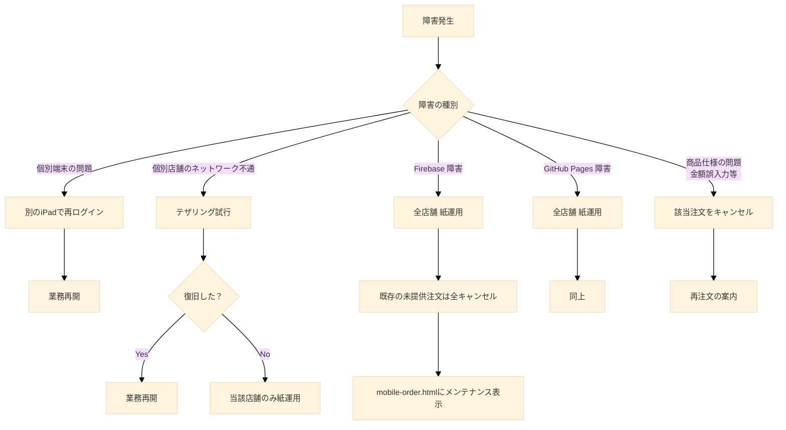

## 第10章 運用・障害対応

### 10.1 本章の目的

本章は、本システムを文化祭当日に運用するための体制と、障害発生時の対応手順を記述する。第9章までに記述した技術仕様が、現実の運用にどのように接続されるかを明らかにし、当日の混乱を最小化することを目的とする。

本章の対象読者は、出店団体スタッフおよびコンピュータ科学部の部員である。

### 10.2 運用の前提条件

本システムの運用にあたり、以下を前提条件とする。

#### 10.2.1 端末

南陵高校では生徒1人1台iPadが配布されている。各出店団体のスタッフは、文化祭当日に自身のiPadを充電済みの状態で持参する。本システムの各画面（`pos.html`、`kitchen.html`、`presenter.html`、`portal.html`）は、これらの個人iPadで操作する。専用の端末を別途確保する必要はない。

#### 10.2.2 ネットワーク

各端末は学校Wi-Fi「BYOD2018」に接続して動作することを基本とする。BYOD2018が利用できない場合は、スタッフ個人のスマートフォンによるテザリングを代替手段とする。いずれの通信手段も利用できない場合は、当該店舗は紙運用に切り替える。

来場者は自身のスマートフォンの通信環境（モバイル回線等）で `mobile-order.html` を利用する。文化祭当日のモバイル回線混雑により来場者側の通信が不安定になる可能性があるが、これは本システム側で対応できる範囲を超えるものであり、来場者にはSOKまたは有人POSの利用を案内する。

#### 10.2.3 運営主体

本システムの運営主体はコンピュータ科学部と各出店団体である。システムに関する判断・連絡・サポートはコンピュータ科学部と各団体の間で完結する。

#### 10.2.4 営業ステータス

店舗画面（`portal.html`）には、営業ステータスとして「営業前」「営業中」「営業終了」の3状態を設ける。営業ステータスの遷移は以下の通りである。

- **営業前 → 営業中**: 開店時にスタッフが `portal.html` から操作する。
- **営業中 → 営業終了**: 閉店時にスタッフが `portal.html` から操作する。

営業ステータスが「営業中」以外の場合、`mobile-order.html` には「現在この店舗は営業しておりません」等のメッセージを表示し、新規注文の受付を停止する。SOK経由の注文受付も同様に停止する。

### 10.3 スタッフの運用方針

#### 10.3.1 全員がすべてのポジションを担当できる体制

高校の文化祭において、固定的な役職やシフトを厳密に定義することは現実的ではない。本システムでは、各出店団体のスタッフ全員が、すべてのポジション（レジ・厨房・提供口・ポータル管理）の操作を習得し、誰でもどのポジションでも対応できる状態を目指す。

当日のポジション配置は各団体内で柔軟に決定してよい。特定の1人に責任を集中させる運用ではなく、その場にいるスタッフが状況に応じて判断・対応する形を想定する。

#### 10.3.2 各画面の概要

スタッフが操作する画面と、その機能は以下の通りである。

**`portal.html`（店舗ポータル）**

店舗全体の管理を行う画面である。メニューの有効化・無効化（`isAvailable` の切り替え）、商品の販売停止、営業ステータスの変更、売上サマリーの確認ができる。Googleアカウントでのログインに加え、店舗パスワードによる認証を経てアクセスする。

**`pos.html`（有人POSレジ）**

来場者から口頭で受けた注文をシステムに入力する画面である。注文入力、受付番号の発番を行う。スマートフォンを所持していない来場者や、対面での注文を希望する来場者を主な対象とする。

**`kitchen.html`（厨房画面）**

注文一覧を表示し、調理ステータスを管理する画面である。新規注文の通知音が鳴り、調理完了時に「調理完了」ボタンを押下して `ready_to_serve` へ遷移させる。厨房は濡れ・汚れが発生しやすいため、端末には防水ケース等の保護を推奨する。

**`presenter.html`（提供口画面）**

完成商品の呼び出し・決済確認・引き渡しを管理する画面である。「呼び出し（準備完了）」ボタン押下による来場者への通知、AirPay決済画面の金額照合、「受渡完了」ボタン押下による完了処理を行う。第9章9.11.2節で述べた通り、AirPay決済完了画面の金額と `presenter.html` に表示された合計金額の目視照合は、本システムにおける唯一の金額不正対策であり、最重要の確認事項である。

#### 10.3.3 コンピュータ科学部の当日サポート

当日のシステム障害対応および技術的問い合わせへの対応は、コンピュータ科学部（実質的にプロジェクトリーダー）が担う。障害発生時の原因切り分け、紙運用への切り替え判断、Firebase Consoleでの使用量監視等を行う。

### 10.4 トレーニング体制

#### 10.4.1 トレーニングの方針

各出店団体のスタッフ全員が、すべての画面（`portal.html`、`pos.html`、`kitchen.html`、`presenter.html`）の操作を習得する。役割別ではなく、全スタッフが全画面を扱えることを目標とする。

#### 10.4.2 トレーニングの実施方法

各店舗ポータル（`portal.html`）にトレーニング機能を実装する。各団体スタッフは、このトレーニング機能を通じて操作を習得する。トレーニングでは以下の内容を扱う。

- `pos.html` の操作手順：注文入力、トッピング選択、受付番号の伝達
- `kitchen.html` の操作手順：注文一覧の確認、調理完了操作、通知音への対応
- `presenter.html` の操作手順：呼び出し、AirPay決済画面の金額照合、受渡完了操作
- `portal.html` の操作手順：メニュー管理、営業ステータス変更、売上確認

最重要トピックとして、提供口での金額照合の重要性を強調する。

#### 10.4.3 対面リハーサル

文化祭開催の数日前に、コンピュータ科学部主催の対面リハーサルを実施する。各出店団体から少なくとも1名が参加し、実機を用いたシミュレーションを行う。具体的な日程はコンピュータ科学部と各団体の間で調整する。

### 10.5 売上集計と当日の監視

#### 10.5.1 リアルタイム売上監視

各出店団体には、専用のGoogleスプレッドシートが割り当てられる。注文の作成および更新が発生するたびに、Cloud Functionsの `onOrderUpdatedSpreadsheet`（注文ドキュメントの作成・更新時に onUpdate トリガーで起動） がトリガーされ、スプレッドシートに自動で行が追加・更新される。

スプレッドシートには以下の情報が含まれる。

- 注文ID
- 受付番号
- 注文経路（モバイル / SOK / POS）
- 商品内訳と数量
- 合計金額
- 注文ステータス
- 各種タイムスタンプ（注文作成、調理完了、呼び出し、提供完了等）

#### 10.5.2 ダッシュボード機能

`portal.html` には売上サマリー機能を実装する。スプレッドシートを開かずとも、画面上で本日の総注文数、総売上金額、ステータス別の注文件数、経路別の注文件数を確認できる。

#### 10.5.3 文化祭終了後の集計

文化祭最終日の閉店時刻に、スタッフが `portal.html` から「営業終了」操作を実行する。各出店団体は、自店舗のスプレッドシートを基に売上集計を行う。必要に応じてGoogle Apps Scriptによる集計マクロを利用できる。

### 10.6 障害発生時の対応原則

本システムは、文化祭という時間制約の厳しい運用環境で動作する。障害発生時には、システムの復旧を試みるよりも、紙運用への切り替えを優先する原則を採用する。

#### 10.6.1 紙運用優先の原則

障害発生時、システムの復旧を試みる時間と紙運用への切り替えを完了する時間を比較し、迷った場合は紙運用に切り替える。文化祭の限られた営業時間において、復旧待ちで販売機会を失うことは避ける。

紙運用への切り替え判断は、各店舗スタッフとコンピュータ科学部担当が協議して行う。全店舗一斉の切り替えだけでなく、特定の店舗のみ、あるいは特定の経路（例：モバイルオーダーのみ）の切り替えも許容する。

#### 10.6.2 障害の種別と対応

想定される障害と、それぞれの対応方針を以下に示す。

#### 10.6.3 個別端末の問題

iPadのバッテリー切れ、故障等が想定される。生徒全員がiPadを所持しているため、問題が発生した端末を交換し、業務を継続する。

#### 10.6.4 個別店舗のネットワーク不通

BYOD2018が不安定になる等、当該店舗のみインターネット接続が不安定になる状況が想定される。

まずスタッフ個人のスマートフォンによるテザリングを試みる。テザリングでも復旧しない場合は、当該店舗のみ紙運用に切り替える。復旧後、紙の注文をシステムに事後入力するかは状況に応じて判断する（基本的には事後入力は行わず、紙の集計を別途行う）。

#### 10.6.5 Firebase 障害

Firebaseの各サービス（Firestore、Cloud Functions、Authentication等）が広域で利用不能となる状況が想定される。これはGoogle側の障害であり、本システム側で対応する手段は存在しない。

コンピュータ科学部担当がFirebaseのステータスページを確認し、全体障害が確認された場合は全店舗紙運用への切り替えを決定する。障害発生時点で既に注文済みかつ未提供の注文は、全キャンセルとする。支払いはAirPayの手動QRコード決済（システム外）であるため、未提供分についてはキャンセル扱いで対応する。

また、`mobile-order.html` 等のWebページ上に「現在システムは利用できません。店頭にて紙での注文をお願いします」等のメンテナンスメッセージを表示できる仕組みを設計上用意しておく（GitHub Pagesが生存している場合に限る）。

#### 10.6.6 GitHub Pages 障害

GitHub Pagesが利用不能となり、フロントエンドにアクセスできない状況が想定される。Firebase障害時と同様、全店舗紙運用に切り替える。

#### 10.6.7 AirPay 障害

AirPayは本システムに組み込まれておらず、店頭での手動QRコード決済として運用される。AirPay決済システム自体の障害は本システムの管轄外であり、AirPay側の対応に委ねる。

### 10.7 紙運用への切り替え手順

紙運用への切り替えが決定された場合、各店舗は以下の手順で運用を移行する。

#### 10.7.1 切り替えの連絡

コンピュータ科学部担当が各店舗に対し、紙運用への切り替え対象（全経路 / 特定経路のみ）と切り替え開始の旨を連絡する。

#### 10.7.2 紙番号札の準備

各店舗は、事前に以下を準備しておく。

- 連番が印刷された紙番号札
- 油性マジック（受付番号や金額の記入用）
- 注文内容を記録する紙伝票

これは去年までの紙注文と同等のシステムであり、バックアップとして常に準備しておく。

#### 10.7.3 紙運用中の注文受付フロー

紙運用中の注文受付は以下の流れとする。

1. 来場者が口頭で注文する
2. スタッフが紙伝票に注文内容と金額を記入する
3. スタッフが紙番号札を来場者に手渡す
4. 紙伝票を厨房に渡す
5. 厨房スタッフは紙伝票を見て調理する
6. 調理完了後、紙伝票を提供口に渡す
7. 提供口スタッフは番号を呼び出す（音声、ホワイトボード等）
8. 来場者が番号札を提示する
9. 提供口スタッフはAirPay決済画面を確認し、金額照合の上で商品を引き渡す

紙運用中も、AirPay手動QRコード決済は継続する。金額照合の重要性は紙運用中も同様である。

#### 10.7.4 紙運用からシステム運用への復帰

障害が解消された場合、システム運用への復帰判断はコンピュータ科学部担当が行う。復旧からシステムの安定動作が確認されており、かつ残り営業時間に余裕がある場合に復帰を検討する。残り営業時間が短い場合や、復帰によるオペレーション混乱のリスクが高い場合は、当日は紙運用を継続する。

### 10.8 苦情対応

#### 10.8.1 一次受け

来場者からの苦情は、まずその場にいるスタッフが受け付ける。操作方法の質問やメニューの確認等、軽微な問題はその場で対応する。

#### 10.8.2 二次受け

一次受けで解決できない苦情は、その場にいるスタッフ間で協議して対応する。商品の無償提供や値引きの判断、個別注文の対応等を行う。

#### 10.8.3 三次受け

店舗スタッフで解決できない苦情、またはシステムに起因する問題は、コンピュータ科学部にエスカレーションする。必要に応じて顧問の先生または学校管理職に連絡する。

#### 10.8.4 想定される苦情の類型

**「注文した商品が出てこない」**  

注文IDまたは受付番号を確認し、`presenter.html` または `portal.html` で注文の現在ステータスを確認する。調理中または提供準備中であればその旨を説明する。`completed` であるが受け取っていないという主張の場合、第9章9.11.1節で述べた番号横取り被害の可能性を検討し、スタッフの判断で再提供する。

**「決済が完了したのに商品が出てこない」**  

来場者のAirPay決済履歴を確認させ、決済日時と注文情報の整合性を確認する。決済済みであることが確認できれば、スタッフの判断で商品を提供する。

**「注文をキャンセルしたい」**  

モバイルオーダーおよび SOK経由の注文は、原則としてキャンセル不可とする。POS経由の注文も同様の扱いとする。

**「決済できない」**  

AirPayアプリの不具合または来場者の残高不足が原因として想定される。これは本システムの管轄外であり、来場者自身での対応を案内する。

**「BANされた」**  

第8章で述べた放置ペナルティ機構により利用停止となったユーザーから解除依頼があった場合、コンピュータ科学部担当が状況に応じて個別に対応を判断する。

### 10.9 文化祭終了後の作業

文化祭終了後、コンピュータ科学部として以下の作業を実施する。

#### 10.9.1 即日作業

文化祭最終日の閉店後、以下を実施する。

- 各店舗の営業ステータスが「営業終了」になっていることの確認
- 各店舗のスプレッドシートの最終状態の確認

#### 10.9.2 1ヶ月以内の作業

- システム上の注文データのバックアップ
- スタッフからのフィードバック収集
- 障害発生事例の記録
- システムの改善点の洗い出し
- 翌年度に向けた引き継ぎドキュメントの作成
- 個人情報の削除準備

#### 10.9.3 3ヶ月以内の作業

- 第9章9.9.3節に基づく個人情報の完全削除
- Firebaseプロジェクトのクリーンアップ
- 翌年度への技術的知見の引き継ぎ完了

---
