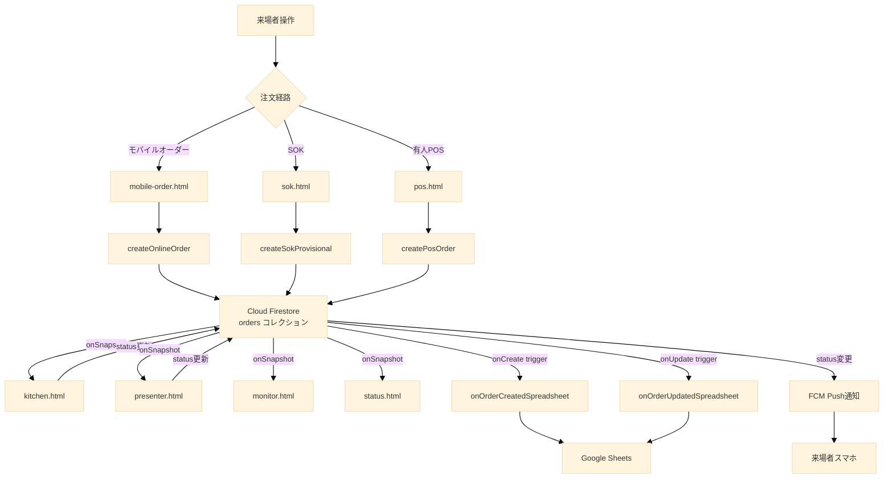

## 第2章 システム全体像

### 2.1 アーキテクチャ概観

本システムは、フロントエンド（来場者および出店団体スタッフが操作するウェブブラウザ）、バックエンド（Google が提供する Firebase 基盤）、外部連携サービス（au PAY、Google スプレッドシート等）の三層構造で構成される。

各層の役割は以下の通りである。

**フロントエンド**は、ウェブブラウザ上で動作する HTML、CSS、JavaScript で構成される静的ファイル群である。来場者は自身のスマートフォンのブラウザから、出店団体スタッフは設置された iPad またはノートPCのブラウザから、それぞれ本システムにアクセスする。フロントエンドは画面の描画とユーザー操作の受付を担当し、データの永続化や決済処理などはすべてバックエンドに委譲する。

**バックエンド**は、Firebase が提供する複数のクラウドサービスを組み合わせて構成される。データベース、認証、サーバーサイド処理、リアルタイム通知の各機能を提供する。フロントエンドとは Firebase SDK（Software Development Kit、ソフトウェア開発キット）を介して通信する。

**外部連携サービス**は、Firebase の枠外で本システムと連携する第三者のサービスである。決済を担当する au PAY、売上データの可視化を担当する Google スプレッドシートなどがこれに該当する。

以下に全体構成図を示す。

```plantuml
@startuml system_architecture
title 南陵祭2026 POSシステム 全体構成図

' A4幅に固定しつつ、文字サイズを維持・拡大
scale 800 width
skinparam defaultFontSize 14
skinparam maxMessageSize 80

skinparam componentStyle rectangle
skinparam packageStyle rectangle
skinparam wrapWidth 100

package "フロントエンド (GitHub Pages)" #LightBlue {
  package "来場者向け画面" {
    [mobile-order.html]
    [sok.html]
    [sok-to.html]
    [status.html]
    [account.html]
    [login.html]
  }
  package "スタッフ向け画面" {
    [portal.html]
    [pos.html]
    [kitchen.html]
    [presenter.html]
    [monitor.html]
  }
}

package "バックエンド (Firebase)" #LightGreen {
  [Firebase Authentication] as Auth
  [Cloud Firestore] as Firestore
  [Cloud Functions] as Functions
  [Cloud Storage] as Storage
  [Firebase Cloud Messaging] as FCM
  [Firebase App Check] as AppCheck
  [Scheduled Functions] as Scheduler
}

package "外部連携サービス" #LightCoral {
  [au PAY] as AuPay
  [Google Sheets] as Sheets
  [Google Apps Script] as GAS
  [reCAPTCHA v3] as Recaptcha
}

' 縦並びを強制
"フロントエンド (GitHub Pages)" -[hidden]down-> "バックエンド (Firebase)"
"バックエンド (Firebase)" -[hidden]down-> "外部連携サービス"

[mobile-order.html] --> Auth
[mobile-order.html] --> Firestore
[mobile-order.html] --> Functions
[mobile-order.html] --> FCM

[sok.html] --> Functions
[sok.html] --> Firestore

[sok-to.html] --> Auth
[sok-to.html] --> Firestore
[sok-to.html] --> FCM

[status.html] --> Firestore
[status.html] --> FCM

[login.html] --> Auth
[account.html] --> Auth
[account.html] --> Firestore

[portal.html] --> Auth
[portal.html] --> Firestore
[portal.html] --> Storage

[pos.html] --> Functions
[pos.html] --> Firestore
[kitchen.html] --> Firestore
[presenter.html] --> Firestore
[monitor.html] --> Firestore

Functions --> Firestore
Functions --> Sheets
Scheduler --> Firestore
AppCheck --> Recaptcha
Sheets <-- GAS

note right of AuPay
  決済は店頭設置のQRコードを
  来場者スマホで読み取り、
  手動で実行する。
  本システムからAPI連携は行わない。
end note

@enduml
```



### 2.2 フロントエンド

#### 2.2.1 ホスティング

フロントエンドの全静的ファイルは、GitHub Pages（GitHub が提供する無料の静的ファイルホスティングサービス）にホストされる。具体的なURLは以下の通りである。

```
https://ynr-cs.github.io/nanryosai-2026/
```

このURL配下に、`main/login.html`、`pos/portal.html`、`pos/kitchen.html` などの全HTMLファイルが配置される。来場者および出店団体スタッフは、このURLを起点として各画面にアクセスする。

GitHub Pages を採用した理由は以下の通りである。

**無料**  
コンピュータ科学部の予算制約下において、ホスティングコストをゼロとできることは大きな利点である。

**バージョン管理との統合**  
ソースコードを管理する Git リポジトリと同一のサービスでホスティングが行えるため、デプロイ作業が `git push` のみで完結する。

**HTTPS の標準対応**  
GitHub Pages はすべてのサイトで HTTPS（暗号化された通信）が標準で有効となる。Firebase Authentication は HTTPS 環境を前提としているため、この対応は必須である。

**静的ファイルのみで完結する設計に適合**  
本システムのフロントエンドはサーバーサイドの動的処理を一切持たず、すべて静的ファイルで構成される。GitHub Pages の制約と本システムの設計方針が完全に一致する。

#### 2.2.2 採用技術

フロントエンドはビルドツールを使用しないシンプルな構成を採用する。

**HTML、CSS、JavaScript（Vanilla JS）**  
React、Vue.js などのフレームワーク、TypeScript、Webpack などのビルドツールは一切使用しない。すべて素のHTML、CSS、JavaScript（Vanilla JS、フレームワーク非依存のJavaScript）で記述される。

**ES Modules（ECMAScript Modules）**  
JavaScript のモジュール機構として、ブラウザ標準のES Modulesを使用する。`import`、`export` 文によりファイル間でコードを共有する。

**Firebase SDK（JavaScript版）**  
Firebase へのアクセスは公式の JavaScript SDK 経由で行う。SDK は CDN（Content Delivery Network、コンテンツ配信網）から動的に読み込まれる。

この技術選定の理由は以下の通りである。

**ビルド環境の不要化**  
ビルドツールを導入すると、Node.js のバージョン管理、依存パッケージの管理、ビルド設定ファイルの保守などの追加作業が発生する。これらを排除することで、保守の負担を軽減する。

**GitHub Pages との適合性**  
GitHub Pages はビルド済みの静的ファイルをそのまま配信する。Vanilla JS で書かれたコードはビルド不要でそのまま動作する。

**起動の高速化**  
フレームワークを使用しないため、ページの初期読み込みが軽量となる。可能な限り高速に画面を表示できる。

### 2.3 バックエンド

バックエンドは Firebase（Googleが提供するアプリケーション開発プラットフォーム）の各サービスを組み合わせて構成される。本システムでは以下の Firebase サービスを使用する。

#### 2.3.1 Firebase Authentication

ユーザー認証を担当するサービスである。本システムでは以下の認証方式を使用する。

**Googleアカウントによるログイン**  
来場者および出店団体スタッフは、自身の Google アカウントでログインする。Firebase Authentication が Googleの認証基盤と連携し、ユーザーIDの発行と認証セッションの管理を行う。


認証方式の詳細は第3章で扱う。

#### 2.3.2 Cloud Firestore

注文情報、商品マスタ、店舗情報、ユーザー情報など、システムが扱う永続データを保持するクラウド型データベースである。

**リージョン**  
本システムが使用する Cloud Firestore のリージョンは `asia-northeast1`（東京）である。日本国内のユーザーが主な利用者であるため、地理的に最も近いリージョンを選択している。これにより、データベースアクセスの遅延を最小化する。

**リアルタイム同期**  
Firestore は `onSnapshot` というリアルタイム同期機能を提供する。あるクライアントがデータを更新すると、同じデータを監視している他のクライアントに即座に変更が反映される。本システムでは、厨房・提供口・モニター・ステータス確認など各画面が、注文ステータスの変化をリアルタイムに受信する仕組みとしてこの機能を活用する。

データモデルの詳細は第4章で扱う。

#### 2.3.3 Cloud Functions

サーバーサイドの処理を実行する仕組みである。フロントエンドから直接実行できない、または実行すべきでない処理を Cloud Functions が担当する。

**用途**  
本システムでは Cloud Functions を以下の用途で使用する。

- 注文の作成（受付番号の安全な発番、在庫チェック、トランザクション処理）
- 注文ステータス変更時のスプレッドシート書き込み
- 注文ステータス変更時のPush通知送信
- 放置注文の検出とペナルティ実行（Scheduled Function、第8章で詳述）
- 会場管理者の認証（独自セッショントークン発行）

**リージョン**  
Cloud Functions のリージョンは `asia-northeast1`（東京）である。Firestore と同一リージョンに配置することで、関数からデータベースへのアクセス遅延を最小化する。

**世代の使い分け**  
Cloud Functions には第一世代（1st gen）と第二世代（2nd gen）の二つの世代が存在する。本システムでは両世代を併用し、関数の特性に応じて使い分ける。

第一世代を使用する関数は、システムの基幹となる同期的処理である。具体的には以下が該当する。

- `getNextReceiptNumber`: 受付番号のアトミックな発番
- `createOnlineOrder`: モバイルオーダーの注文作成
- `loginVenueAdmin`: ステージ発表・催し物会場（venues）の管理者認証

第二世代を使用する関数は、Firestore のドキュメント変更を契機とするトリガー型の非同期処理である。具体的には以下が該当する。

- `onOrderCreatedSpreadsheet`: 注文作成時のスプレッドシート書き込み
- `onOrderUpdatedSpreadsheet`: 注文更新時のスプレッドシート書き込み

第一世代と第二世代の使い分け基準は、第二世代がより新しく機能が豊富であるが、一部の旧API（呼び出し方式や認証連携の詳細）が変更されているため、既存資産との互換性が必要な基幹関数では第一世代を維持し、新規追加のトリガー関数では第二世代を採用するという方針である。

#### 2.3.4 Cloud Storage

商品画像などのバイナリファイル（画像、動画など）を保管するストレージサービスである。

**用途**  
出店団体が `portal.html` 経由でアップロードする商品画像を Cloud Storage に保管する。アップロード時には、フロントエンド側で画像を WebP 形式に変換・軽量化してから送信する。これにより、ストレージ容量と通信量の両方を削減する。

**リージョン**  
Cloud Storage のリージョンは `us-central1`（米国中部）である。Firestore および Cloud Functions が `asia-northeast1` であるのに対し、Cloud Storage のみ異なるリージョンを採用する理由は、Firebase の無料枠（無償で利用できる範囲）の都合による。Cloud Storage は `us-central1` でのみ無料枠が提供されるため、本システムのコスト要件に基づきこのリージョンを選択している。

商品画像の表示は来場者のブラウザから直接 Cloud Storage の公開URLを参照する形で行うため、リージョンの違いによる遅延は実用上問題とならない。

#### 2.3.5 Firebase Cloud Messaging（FCM）

ウェブブラウザにPush通知を送信するサービスである。来場者がサイトを閉じている状態でも、商品の準備完了などの重要な通知を端末に届けることができる。

**用途**  
本システムでは以下のタイミングで FCM による Push通知を送信する。

- 商品が呼び出し中（提供準備完了）になったとき
- 注文がキャンセルされたとき

通知を受け取るためには、来場者がブラウザで通知許可を与えている必要がある。許可は `mobile-order.html` の初回ログイン時、または `sok-to.html` のSOK引き継ぎ時に取得する。

#### 2.3.6 Firebase App Check

不正なAPIリクエストを遮断するサービスである。本システムが配布したフロントエンドからのリクエストのみを Firebase バックエンドが受け付けるよう制限する役割を持つ。

**仕組み**  
App Check は reCAPTCHA v3（Googleが提供する高度なボット検出サービス）と連携する。フロントエンドが Firebase API を呼び出す前に、reCAPTCHA v3 からトークンを取得し、そのトークンを Firebase が検証する。トークンが正当でない場合、リクエストは拒否される。

**ウォームアップ戦略**  
App Check のトークン取得は、初期化時にあらかじめ非同期で実行される。ユーザー操作（ログインボタン押下など）と同時にトークン取得を行うと、ポップアップブロックの原因となる可能性があるためである。事前にトークンを取得しておくことで、ユーザー操作のタイミングではトークン取得済みの状態となり、ポップアップブロックを回避する。

#### 2.3.7 Scheduled Functions

定期的に自動実行されるサーバーサイド処理である。Cloud Functions の一機能として提供される。

**用途**  
本システムでは、放置注文（呼び出し後15分経過しても受け取られない注文）を検出し、ペナルティを実行する処理に Scheduled Functions を使用する。1分ごとに自動起動し、対象注文を検索して必要な更新を行う。

詳細は第8章で扱う。

### 2.4 外部連携サービス

#### 2.4.1 au PAY

KDDI が提供するQRコード決済サービスである。本システムにおける唯一の決済手段である。

**運用方式**  
本システムは au PAY のAPIとは連携せず、店頭での手動QRコード決済方式を採用する。各出店団体は店頭にau PAYのQRコードを掲示し、来場者は商品受け取り時に自身のスマートフォンでQRコードを読み取り、表示された支払いフォームに金額を手入力して決済を実行する。決済完了画面をスタッフに提示し、目視確認の上で商品が引き渡される。

**決済時刻の集約**  
すべての決済は、商品提供のタイミング（提供口での受け渡し時）に行われる。注文時点での決済は行わない。これにより、混雑により注文が処理できなくなった場合のキャンセル対応が容易となる。

**現金との関係**  
学校の方針により、現時点で文化祭での取引はほぼすべてがAUPになっていることから、本システム自体は現金取扱を一切想定しない。

#### 2.4.2 Google Sheets（Googleスプレッドシート）

クラウド型の表計算サービスである。本システムでは売上データの可視化と分析の出力先として使用する。

**書き込みの仕組み**  
注文の作成および更新が発生すると、Cloud Functions の `onOrderCreatedSpreadsheet` および `onOrderUpdatedSpreadsheet` 関数がトリガーされ、対応する出店団体のスプレッドシートに自動でデータが追記される。各出店団体は自身のスプレッドシートをリアルタイムに参照することで、当日の売上状況を把握できる。

**店舗ごとの分離**  
各出店団体には専用のスプレッドシートが割り当てられる。店舗のメタデータ（`stores` コレクション）には `spreadsheetId` フィールドが存在し、書き込み先のスプレッドシートを特定する。

#### 2.4.3 Google Apps Script（GAS）

Googleが提供するスクリプト実行環境である。本システムでは、Google スプレッドシート上での集計や帳票出力など、文化祭終了後の事後処理に GAS を活用する。本システムのリアルタイム動作には直接関与しない。

#### 2.4.4 reCAPTCHA v3

Googleが提供する高度なボット検出サービスである。Firebase App Check のトークン発行のバックエンドとして利用される。来場者は意識的に reCAPTCHA を操作することはなく、バックグラウンドで自動的にスコアリングが行われる。

### 2.5 データの流れ

注文が作成されてから商品が提供されるまでの、データの流れを示す。



このデータフローの特徴は以下の通りである。

**注文作成は必ず Cloud Functions 経由**  
モバイル、SOK、POSのいずれの経路でも、注文の作成は Cloud Functions を経由する。フロントエンドから Firestore への直接書き込みは Firestore セキュリティルールにより禁止されている。これにより、受付番号の重複防止、在庫チェック、注文金額の正当性確認などをサーバー側で確実に実行できる。

**ステータス更新はリアルタイム伝播**  
注文ステータスが変化すると、`onSnapshot` を監視している各画面（厨房、提供口、モニター、ステータス確認など）に即座に伝播する。リロード操作を必要とせず、各スタッフや来場者は常に最新の状態を確認しながら行動できる。

**スプレッドシート書き込みは非同期**  
注文作成・更新はフロントエンドへの応答を遅らせず、スプレッドシート書き込みは Cloud Functions のトリガーとしてバックグラウンドで実行される。スプレッドシート書き込みに失敗しても、注文処理そのものには影響しない。

### 2.6 採用技術一覧表

本章で述べた技術スタックを以下の表にまとめる。

| 領域         | 技術・サービス                    | 役割                           | リージョン等    |
| ------------ | --------------------------------- | ------------------------------ | --------------- |
| ホスティング | GitHub Pages                      | 静的ファイル配信               | グローバル      |
| マークアップ | HTML5                             | 画面構造                       | -               |
| スタイル     | CSS3                              | 画面装飾                       | -               |
| スクリプト   | Vanilla JavaScript (ES Modules)   | 動的処理                       | -               |
| 認証         | Firebase Authentication           | Google認証                     | グローバル      |
| データベース | Cloud Firestore                   | データ永続化・リアルタイム同期 | asia-northeast1 |
| サーバー処理 | Cloud Functions (1st gen)         | 基幹処理                       | asia-northeast1 |
| サーバー処理 | Cloud Functions (2nd gen)         | トリガー処理                   | asia-northeast1 |
| 定期実行     | Cloud Scheduler / Cloud Functions | 放置検出                       | asia-northeast1 |
| ストレージ   | Cloud Storage                     | 商品画像保管                   | us-central1     |
| 通知         | Firebase Cloud Messaging          | Web Push通知                   | グローバル      |
| セキュリティ | Firebase App Check                | 不正リクエスト遮断             | グローバル      |
| ボット検出   | reCAPTCHA v3                      | App Checkトークン発行          | グローバル      |
| 決済         | au PAY                            | 手動QR決済                     | 日本            |
| 集計出力     | Google Sheets                     | 売上データ可視化               | グローバル      |
| 集計処理     | Google Apps Script                | 事後集計                       | グローバル      |

### 2.7 まとめ

本章では、本システムが Firebase を中核とする三層構造で構成されること、フロントエンドはビルド不要の Vanilla JavaScript で記述されることを示した。au PAY との API 連携は行わず、決済はすべて店頭での手動QR方式に統一されている。リージョン選定はコストとパフォーマンスのバランスから、Firestore および Cloud Functions は東京、Cloud Storage は米国中部となっている。

次章では、これらの基盤の上で動作する認証・認可の仕組みを詳述する。

---
