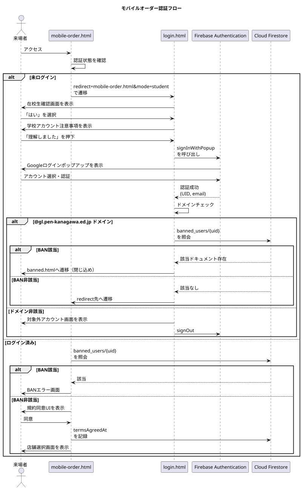
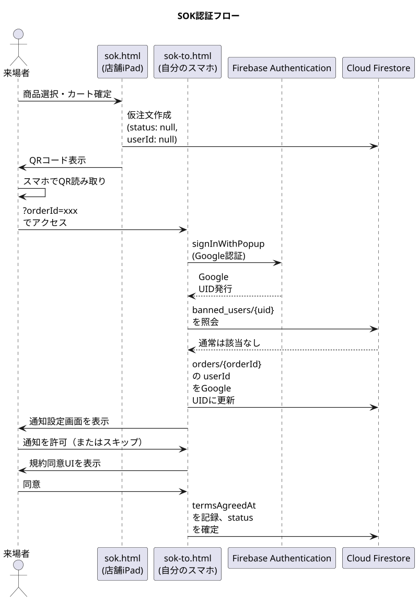

## 第3章 認証・認可設計

### 3.1 章の目的

本章では、本システムにおける認証（Authentication、ユーザーが誰であるかを確認すること）と認可（Authorization、認証されたユーザーが何を行えるかを規定すること）の設計を記述する。

本システムは、来場者と出店団体スタッフという性質の異なる二種類の利用者を抱える。それぞれの利用者に適切な認証手段を提供し、かつ不正な利用を防ぐための設計を以下に詳述する。

### 3.2 認証エントリーポイントの設計方針

本システムでは、認証エントリーポイント（ログイン処理を行う画面）を二つに集約する。

**`login.html`**  
来場者向けの認証エントリーポイントである。`mobile-order.html`、`account.html` などすべての来場者向け画面は、認証が必要なアクションを行う際に `login.html` へリダイレクトする。`login.html` 自身が独立してログイン処理を完結させ、認証完了後に元の画面へ戻る。

**`portal.html`**  
出店団体スタッフおよび実行委員向けの認証ハブである。`pos.html`、`kitchen.html`、`presenter.html`、`monitor.html` の各スタッフ画面は、独立したログイン画面を持たない。未ログイン状態でこれらの画面にアクセスすると、すべて `portal.html` へ強制的にリダイレクトされ、そこで認証および店舗権限の確認が行われる。

この二系統に集約する設計の利点は以下の通りである。

**保守性の向上**  
ログイン処理のコードが二箇所のみに存在することで、認証ロジックの変更は最小限のファイル修正で完結する。

**ユーザー体験の一貫性**  
来場者は常に `login.html` の同じUIを通じてログインするため、複数の画面ごとに異なるログイン画面に遭遇する混乱が生じない。

**セキュリティ集約**  
ドメイン制限、BANチェック、利用規約同意の取得などのセキュリティ・コンプライアンス処理を、二箇所に集約して確実に実装できる。

### 3.3 来場者向け認証 (`login.html`)

#### 3.3.1 担う責務の一覧

`login.html` は以下の責務を担う。

- Googleアカウントによるログイン処理
- 在校生確認モード（`?mode=student` クエリパラメータが付与された場合）の表示と分岐
- 一般来場者モード（クエリパラメータなしまたは `?mode=guest`）の表示と分岐
- ドメインチェック（`@gl.pen-kanagawa.ed.jp` の検証）
- login.html でのBANチェックの実行（`banned_users` コレクションへの照会）
- ログイン後の遷移先決定（`?redirect=` クエリパラメータの解釈と検証）
- 既ログイン状態の検出と自動リダイレクト
- ポップアップブロック発生時のガイダンスUI表示

#### 3.3.2 ログイン方式: Popup-only 戦略

Firebase Authentication は、Googleアカウントによるログインを実装するために二つの方式を提供している。一つは `signInWithPopup`（ポップアップウィンドウで認証する方式）、もう一つは `signInWithRedirect`（同じウィンドウ内でGoogleの認証ページへ遷移する方式）である。

本システムは `signInWithPopup` のみを使用する Popup-only 戦略を採用する。

**Popup-only 戦略を採用する理由**  
GitHub Pages 上にホストされたサイトは、Google の認証ドメインに対してサードパーティCookie（異なるドメイン間で共有されるCookie）の制限を受ける。`signInWithRedirect` 方式は、リダイレクト後に元のサイトへ戻る際にサードパーティCookieが必要となるが、現代のブラウザはこの方式に対するCookieアクセスを既定で制限している。結果として、`signInWithRedirect` は本システムの環境では正常に動作しない。

`signInWithPopup` 方式は、別ウィンドウで認証を完結させ、認証結果をJavaScriptのメッセージング機構で元のウィンドウに伝達する。この方式はサードパーティCookieに依存しないため、GitHub Pages 環境でも確実に動作する。

**ポップアップブロック対策**  
`signInWithPopup` はブラウザがポップアップウィンドウを開けることを前提としている。スマートフォンのブラウザや、ポップアップブロック設定が有効なブラウザでは、ログインボタンを押してもポップアップが開かない場合がある。

本システムは、ポップアップが開けなかった場合（`auth/popup-blocked` エラー）を検出し、ユーザーに対して「ブラウザの設定からポップアップを許可してから、再度ログインボタンを押してください」というガイダンスUIを自動表示する。これにより、技術的な失敗を放置せず、ユーザーの再試行を促す。

#### 3.3.3 在校生モードと一般来場者モード

`login.html` は、起動時のクエリパラメータ `?mode` の値により、二つのモードに分岐する。

**在校生モード (`?mode=student`)**  
モバイルオーダー (`mobile-order.html`) からのリダイレクトでこのモードが起動する。在校生モードでは、ログインに使用できるアカウントが `@gl.pen-kanagawa.ed.jp` ドメイン（および後述する開発者特例アカウント）に限定される。

在校生モードのフローは以下の通りである。

1. 「あなたは在校生ですか？」という確認画面を表示する
2. 「はい」を選択した場合、学校アカウントの利用に関する注意事項を表示する
3. 「理解しました」を押下後、Googleログインのポップアップを表示する
4. 認証成功後、ログインしたアカウントのメールアドレスがドメイン要件を満たすかチェックする
5. ドメイン要件を満たさない場合、「対象外アカウント」画面を表示し、ログアウトとアカウント切替を促す
6. ドメイン要件を満たす場合、`?redirect=` で指定された元の画面へ遷移する

**一般来場者モード (`?mode=guest` またはパラメータなし)**  
直前の「あなたは在校生ですか？」という質問で「いいえ」を選択した来場者、または既に一般来場者としてログイン済みのユーザー向けに提供されるモードである。一般来場者モードでは、ドメインによる制限は行われず、任意のGoogleアカウントでログイン可能である。ただし、モバイルオーダー機能は利用できない。

一般来場者モードのフローは以下の通りである。

1. 「Googleアカウントでログイン」ボタンを表示する
2. 押下時にGoogleログインのポップアップを表示する
3. 認証成功後、ゲストウェルカム画面（お気に入り等の機能案内）を表示する
4. 利用可能な機能の案内後、`?redirect=` で指定された元の画面へ遷移する

#### 3.3.4 ドメイン制限の根拠

在校生モードで `@gl.pen-kanagawa.ed.jp` ドメインに限定する理由は、以下の通りである。

**配布範囲の特定性**  
`@gl.pen-kanagawa.ed.jp` は、神奈川県教育委員会が運営する Google for Education 環境のドメインである。`gl` は generalized login、`pen-kanagawa` は神奈川県教育委員会を意味する。このドメインのアカウントは、神奈川県立高校に在籍する生徒および勤務する教員にのみ配布される。すなわち、このドメインのアカウントを所持していること自体が、神奈川県立高校の関係者であることを実質的に証明する。

**海外からの不正アクセスの防止**  
モバイルオーダー機能は来場者の物理的な来校を前提として設計されている。しかし、ウェブサイトはインターネット上に公開されているため、原理的には世界中のどこからでもアクセス可能である。ドメイン制限がない場合、海外からの不正注文（例: イギリスやブラジルの利用者が悪意で注文を作成し、商品の準備を妨害する）が技術的に可能となる。ドメイン制限により、このリスクを実質的に排除する。

**運用コストの低さ**  
ドメインによる制限は、Firebase Authentication の認証成功後に文字列パターンマッチで判定するのみであり、実装コストが極めて低い。にもかかわらず、一定の不正アクセス防止効果を持つ。

#### 3.3.5 ドメイン判定ロジック

ドメイン判定は以下のロジックで実装される。

```javascript
function isStudentEmail(email) {
  if (!email) return false;
  return (
    email.endsWith("@gl.pen-kanagawa.ed.jp") || email === "ynrcs1000@gmail.com"
  );
}
```

`ynrcs1000@gmail.com` は開発者特例アカウントである。本システムの開発・テスト時に開発者が使用するアカウントとして、ドメイン制限の例外として許可される。このアカウントはスーパー管理者権限を持ち、本番運用中であっても全店舗のデータ閲覧および操作が可能である。

#### 3.3.6 教員のモバイルオーダー利用

教員は `@gl.pen-kanagawa.ed.jp` ドメインのアカウントを持つため、生徒と同一の認証フローでログインできる。ただし、教員は調理を行う側ではなく来場者として注文を行う立場であり、セルフオーダーキオスク（SOK）または有人POSを利用することを想定している。

外部スタッフ（OB・保護者ボランティア・業者など）は本システムの認証スコープ外である。運営作業が必要な場合は、生徒または教員の端末・アカウントを通じた代理操作で対応する運用とする。

#### 3.3.7 リダイレクト処理

`login.html` は、認証完了後の遷移先を `?redirect=` クエリパラメータで受け取る。リダイレクト処理は以下のセキュリティチェックを経て実行される。

**同一オリジン検証**  
`getSafeRedirect` 関数により、リダイレクト先URLが本システムと同じオリジン（同じプロトコル・ドメイン・ポート）であることを検証する。外部URLへのリダイレクトは拒否され、`portal.html` または `mobile-order.html` などの既定ページへフォールバックする。

これは、悪意ある第三者が `?redirect=https://attacker.example.com/` のようなURLを生成し、ログイン後に攻撃者のサイトへ誘導するオープンリダイレクト攻撃を防ぐ目的である。

**ループ防止**  
`?redirect=` の値が `login.html` 自身を指していた場合、無限リダイレクトループを防ぐためフォールバックページへ遷移する。

#### 3.3.8 既ログイン時の自動リダイレクト

`login.html` は、画面表示と並行して `onAuthStateChanged`（Firebase Authentication が提供する認証状態の監視機能）でユーザーのログイン状態を監視する。すでにログイン済みのユーザーが `login.html` にアクセスした場合、ログインフォームを表示せず、即座に `?redirect=` で指定された遷移先へ自動的に進む。これにより、すでにログインしている来場者が再度ログイン操作を要求されることを防ぐ。

### 3.4 SOK利用者向け認証

#### 3.4.1 Google認証への一本化

セルフオーダーキオスク（SOK）を利用する来場者についても、モバイルオーダーと同様に **Googleアカウントによる認証（`signInWithPopup`）** を必須とする。
かつては匿名認証を許可する設計も検討されたが、不正利用の防止および注文の確実な追跡のため、すべての来場者向け注文経路においてGoogle認証に一本化する。

#### 3.4.2 SOK利用時の認証フロー

SOKにおける認証は、来場者が自身のスマートフォンで `sok-to.html` を開いた時点で実行される。

1. SOK端末 (`sok.html`) で来場者が商品選択を完了し、QRコードが表示される
2. 来場者が自身のスマートフォンでQRコードを読み取る
3. スマートフォンのブラウザで `sok-to.html?orderId=...` が開かれる
4. ページ初期化時に、Googleログインを要求する
5. 認証成功後、発行されたGoogle UIDが注文ドキュメントの `userId` フィールドに紐付けられる
6. 以降、来場者は自身のGoogleアカウントで注文を追跡可能となる

### 3.5 BANチェック機構

#### 3.5.1 BANの目的

放置キャンセル（呼び出し後に商品を受け取らない行為）を繰り返す利用者に対して、本システムへのアクセスを制限することで、商品廃棄の発生と他の来場者への迷惑を抑止する。

#### 3.5.2 `banned_users` コレクションの構造

利用停止対象となったユーザーは、Firestore の `banned_users` コレクションに記録される。コレクションの構造は以下の通りである。

```
banned_users/{uid}
├ bannedAt: Timestamp        // BAN記録日時
├ reason: string             // BAN理由（例: "abandoned_order"）
├ orderId: string            // 原因となった注文のID
└ bannedBy: string           // BAN実行者（"auto_scheduler" または実行者UID）
```

ドキュメントIDは、BAN対象となったユーザーのUIDそのものである。これにより、UIDをキーとした存在チェックが効率的に行える。

#### 3.5.3 BANチェックの実行タイミング

BANチェックは、以下のタイミングで実行される。

**ログイン直後（`login.html` （来場者向け画面のみ））**  
Googleアカウントでのログイン成功直後、認証されたユーザーのUIDをキーに `banned_users` コレクションを照会する。該当ドキュメントが存在する場合、ログインを中断し、エラーメッセージを表示する。


#### 3.5.4 BAN該当時のUI

BANに該当するユーザーがログインを試みた場合、`banned.html` へ強制的に遷移（閉じ込め）させる。
同画面では以下の趣旨のホラー的なメッセージを表示し、別のアカウントへの切り替え（ログアウト）手段を提供しないことで、事実上システムへの再アクセスを不能にする。

```
このアカウントは、過去の利用状況により本システムの利用が制限されています。
```

#### 3.5.5 15分放置キャンセルに伴う自動BAN（仕様定義済み・未実装）

本システムの運用において、最も警戒すべきリスクの一つが「商品の受け取り放棄」である。調理が完了し、呼び出しが開始されてから一定時間（15分）経過しても来場者が提供口に現れない場合、その注文は「放置された」とみなされる。

> **実装状態について**: 本機能は仕様として定義されているが、開発・テスト運用においてペナルティに抵触しやすく開発サイクルを阻害するため、現時点では**意図的に実装を保留**している。本番運用に向けて実装予定。

本機能が実装された場合、放置された注文に対しては以下の処理が自動的に実行される（詳細は第8章に記述）。

1. 注文ステータスを `abandoned`（放棄）に変更する
2. 当該ユーザーを `banned_users` コレクションに登録する

これにより、意図的ないたずら注文や、無責任な注文放棄を行ったユーザーは、次回以降の南陵祭期間中、本システムを利用した注文が一切行えなくなる。これは、限られた食材と調理時間を有効に活用し、真に商品を必要とする来場者への提供を優先するための措置である。

#### 3.5.6 BANの発生源

`banned_users` コレクションへの記録は、以下のいずれかの経路で発生する。

自動記録（Scheduled Function）
放置キャンセルを検出する `Scheduled Function` が、対象注文のユーザーUIDを自動的に `banned_users` に記録する。`bannedBy` フィールドには `"auto_scheduler"` が設定される。詳細は第8章で扱う。

**手動記録（運営による判断）**  
運営側の判断により、特定のユーザーを手動でBANする必要が生じた場合、Firebase Console から直接 `banned_users` コレクションにドキュメントを追加することで対応する。`bannedBy` フィールドには実行者のUIDを記録する。

### 3.6 利用規約への同意取得

#### 3.6.1 同意取得の目的

放置キャンセルに対するペナルティ（利用停止）を実行するためには、利用者が事前にペナルティの存在を認識し、合意していることが必要である。法的・倫理的観点の双方から、利用規約への明示的な同意を取得する仕組みを設ける。

#### 3.6.2 同意取得のタイミングと場所

同意取得は注文経路ごとに以下のタイミングで行われる。

**モバイルオーダー**  
`mobile-order.html` において、店舗選択画面を表示する直前に同意UIを表示する。来場者は規約を読み、同意のチェックボックスをオンにすることで店舗選択画面に進める。同意の事実とタイムスタンプは Firestore に記録される。

**SOK**  
`sok-to.html` において、注文確定ボタンを押す直前に同意UIを表示する。SOK端末側の `sok.html` ではなく、来場者自身のスマートフォン上で同意を取得する。これは、同意の主体が SOK端末の操作者ではなく、注文の正規所有者（=スマートフォンで `sok-to.html` を開いた来場者）であることを明確にする目的による。

**有人POS**  
有人POSでは規約同意UIは設置しない。これは以下の理由による。

- 有人POSを利用する来場者に対して、画面上での規約同意を求める運用が現実的でない
- 万一放置キャンセルが発生しても、有人POSでは紙の番号札を持つ利用者を特定する手段がない（=BAN自体を実行できない）

有人POSでは規約同意の代わりに、レジ担当スタッフが口頭で「商品ができたら呼び出しますので、必ず受け取りに来てください」と伝える運用とする。

#### 3.6.3 同意の記録方法

同意が取得されると、以下の情報が Firestore に記録される。

**注文ドキュメントへの記録**  
注文ドキュメント (`orders/{orderId}`) の `termsAgreedAt` フィールドにタイムスタンプを記録する。これにより、各注文に対して同意が取得済みであることを後から検証できる。

**ユーザードキュメントへの記録（任意）**  
モバイルオーダーの場合、`users/{uid}` ドキュメントにも初回同意のタイムスタンプを記録することで、二回目以降の注文時に再度の同意取得を省略する設計が可能である。ただし、本書執筆時点では各注文ごとに同意を取得する方針とする。

### 3.8 Firebase App Check との連携

認証は「ユーザーが誰であるか」を確認する仕組みであるが、Firebase App Check は「リクエストが正規のフロントエンドから発信されたものであるか」を確認する仕組みである。両者は補完関係にある。

**App Check が阻止するもの**  
本システムが配布した `mobile-order.html` などのフロントエンドを経由せず、攻撃者が独自のスクリプトから直接 Firebase API を呼び出す行為を阻止する。例えば、認証済みのユーザーが自身の認証トークンを使って、本来のフロントエンドが許可しない方法でAPIを大量に呼び出すような行為に対する防御となる。

**App Check の有効範囲**  
本システムでは、Cloud Firestore へのアクセス、Cloud Functions の呼び出し、Cloud Storage へのアクセスのすべてに対して App Check を有効化する。フロントエンドはページ初期化時に reCAPTCHA v3 からトークンを取得し、以降のすべてのAPI呼び出しにこのトークンを添付する。

**ユーザーへの透過性**  
App Check は来場者からは完全に透過的（不可視）に動作する。来場者は reCAPTCHA を意識的に操作することはなく、ページを閲覧する行動パターンや端末情報からバックグラウンドでスコアリングが行われる。

### 3.9 認証の全体フロー図

来場者がモバイルオーダーを利用する際の認証フローを以下に示す。



SOK利用時の認証フローを以下に示す。



### 3.10 まとめ

本章では、本システムにおける認証・認可の設計を述べた。来場者向けは `login.html`、スタッフ向けは `portal.html` の二系統に集約され、それぞれ異なる要件に応じた認証フローを提供する。すべての来場者向け注文経路においてGoogleアカウントによるログイン（Popup-only 戦略）が必須となる。

ドメイン制限により海外からの不正アクセスを防ぎ、BANチェック機構（`banned.html` への閉じ込め）により悪質な利用者を排除する。これらに加えて Firebase App Check が、フロントエンド以外からの不正なAPI呼び出しを阻止する多層防御を構成する。

次章では、これらの認証情報を含むすべてのデータを格納する Cloud Firestore の構造を詳述する。

---
