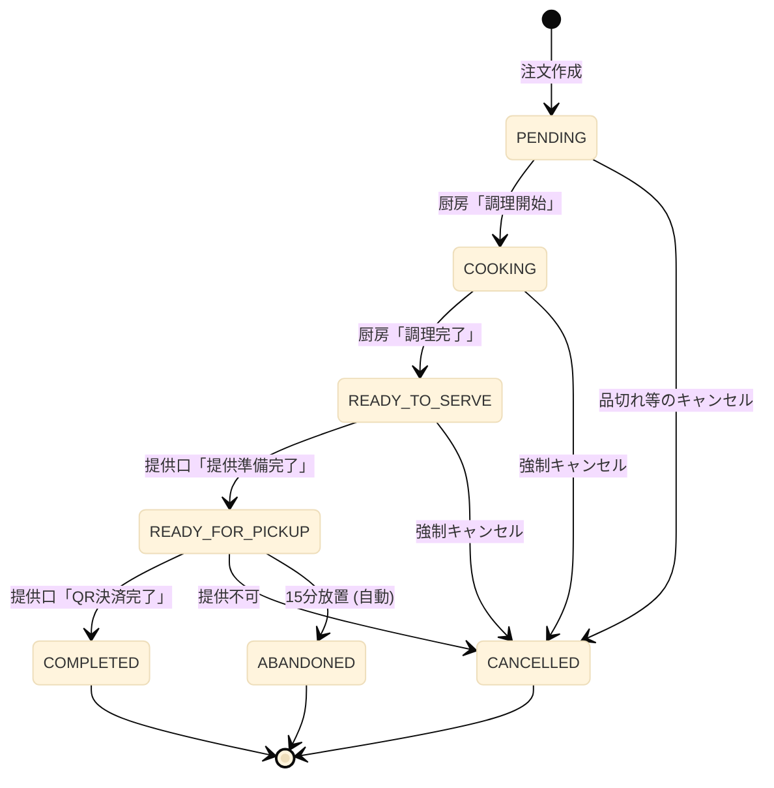
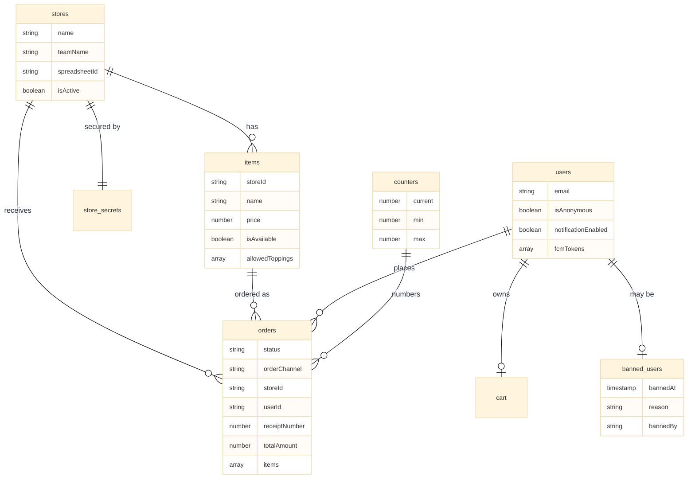

## 第4章 データモデル設計

### 4.1 章の目的

本章では、本システムが Cloud Firestore 上に保持するすべてのデータの構造を完全に文書化する。コレクション（データの分類単位）の一覧、各コレクション内のドキュメント（データの個別レコード）が持つフィールド（項目）、フィールドの型と意味、データ間の関係を以下に詳述する。

本章はシステム全体の挙動を決定する設計図であり、後続の章（特に第6章のシナリオ別注文フロー、第7章の共通オペレーションフロー、第9章のセキュリティ設計）はすべて本章のデータ構造を前提として記述される。

### 4.2 Firestore の基本概念

Cloud Firestore はドキュメント指向のNoSQLデータベースである。本章を読む上で必要な基本概念を以下に整理する。

**ドキュメント (Document)**  
データの最小単位である。キーと値のペアで構成され、JSONに似た構造を持つ。各ドキュメントには一意のID（ドキュメントID）が付与される。

**コレクション (Collection)**  
ドキュメントを束ねる入れ物である。リレーショナルデータベースの「テーブル」に近い概念であるが、コレクション内のドキュメントが同じスキーマを持つことは強制されない。

**サブコレクション (Subcollection)**  
ドキュメント内に入れ子状に作成されるコレクションである。例えば `users/{uid}/cart` は、`users` コレクション内の特定ユーザードキュメントに紐づく `cart` サブコレクションを意味する。

**フィールド (Field)**  
ドキュメント内のキーと値のペアである。値の型として、文字列、数値、真偽値、タイムスタンプ、配列、マップ（入れ子オブジェクト）などが使用できる。

**Timestamp**  
日時を表す Firestore 固有の型である。サーバー側で記録された日時を、タイムゾーン情報を含めて保持する。

### 4.3 コレクション一覧

本システムが使用する全コレクションを以下に示す。

| コレクション名 | 種別 | 役割 |
|---|---|---|
| `stores` | マスタ | 店舗（出店団体）のメタデータ |
| `items` | マスタ | 商品マスタ |
| `orders` | トランザクション | 注文データ |
| `users` | トランザクション | ユーザープロファイル |
| `users/{uid}/cart` | サブコレクション | ユーザーのカート |
| `counters` | システム | 受付番号などのアトミックカウンタ |
| `store_secrets` | セキュリティ | 店舗パスワード等の機密情報 |
| `banned_users` | セキュリティ | 利用停止対象ユーザー |
| `venues` | システム | 会場ステータス管理 |
| `venue_admin_sessions` | セキュリティ | 会場管理者セッショントークン |

それぞれの詳細を以下の節で記述する。

### 4.4 マスタ系コレクション

#### 4.4.1 `stores` コレクション

出店する各団体（店舗）のメタデータを保持する。

**ドキュメントID**  
店舗を一意に識別するID（例: `store_101`、`store_taiyaki` など）。

**フィールド構造**

| フィールド | 型 | 説明 |
|---|---|---|
| `name` | string | 出店団体の正式名称（例: 「2年A組」） |
| `teamName` | string | 来場者向けの店舗名（例: 「たい焼きカフェ」） |
| `spreadsheetId` | string | この店舗の売上を書き込む Google スプレッドシートのID |
| `isActive` | boolean | 店舗が営業中であるか否か |
| `createdAt` | Timestamp | レコード作成日時 |
| `updatedAt` | Timestamp | 最終更新日時 |

**用途**  
店舗一覧画面（モバイルオーダーの店舗選択画面、SOK起動時の店舗確認など）で参照される。スタッフ画面（`portal.html`）からは、店舗責任者により `teamName` の編集が行われる場合がある。

#### 4.4.2 `items` コレクション

各店舗が販売する商品のマスタデータを保持する。`items` は独立したトップレベルコレクションとして配置され、各商品ドキュメントは `storeId` フィールドにより特定の店舗に紐付けられる。

**ドキュメントID**  
商品を一意に識別するID（自動生成またはスラッグ形式）。

**フィールド構造**

| フィールド | 型 | 説明 |
|---|---|---|
| `storeId` | string | この商品を販売する店舗のID |
| `name` | string | 商品名 |
| `description` | string | 商品説明文 |
| `price` | number | 販売価格（税込、円単位の整数） |
| `imageUrl` | string | 商品画像のURL（Cloud Storage 上の公開URL） |
| `isAvailable` | boolean | 販売中であるか否か。`false` の場合、UI上で「売切」または「販売停止」として表示 |
| `allowedToppings` | array&lt;string&gt; | 選択可能なトッピングの配列（各要素はトッピング名の文字列） |
| `displayOrder` | number | 店舗内での表示順序 |
| `createdAt` | Timestamp | レコード作成日時 |
| `updatedAt` | Timestamp | 最終更新日時 |

**販売可否の管理**  
本システムでは数値による在庫数（個数）の自動減算は行わない。販売可否は `isAvailable` の真偽値のみで管理し、店舗責任者が `portal.html` 経由で手動で「販売中／売切」を切り替える運用とする。これは、文化祭という特殊な運用環境において、リアルタイムでの数値在庫管理が現実的でないとの判断による。

**トッピングの管理**  
トッピングは各商品ドキュメントの `allowedToppings` 配列で管理される。例えば「たい焼き」のドキュメントが `allowedToppings: ["あんこ", "クリーム", "チョコ"]` を持つ場合、注文時に来場者はこの3種類から選択できる。トッピングごとの追加料金や個別の販売可否は本書執筆時点では管理しない。

**画像のアップロード**  
商品画像は `portal.html` から店舗責任者がアップロードする。アップロード時にはフロントエンド（Canvas API）で画像が WebP 形式に変換され、長辺1200ピクセルにリサイズされた後、Cloud Storage に保存される。保存後の公開URLが `imageUrl` フィールドに記録される。

### 4.5 トランザクション系コレクション

#### 4.5.1 `orders` コレクション

すべての注文データを保持する、本システムの中核となるコレクションである。

**ドキュメントID**  
Firestore により自動生成される一意のID。

**フィールド構造**

| フィールド | 型 | 説明 |
|---|---|---|
| `status` | string | 注文の現在のステータス。詳細は4.6節 |
| `orderChannel` | string | 注文経路。`"mobile"`、`"sok"`、`"pos"` のいずれか |
| `paymentMethod` | string | 決済方式。本システムでは常に `"au_pay_manual"` |
| `storeId` | string | 注文先の店舗ID |
| `items` | array&lt;map&gt; | 注文された商品の配列。各要素は商品情報のマップ |
| `totalAmount` | number | 合計金額（円単位の整数） |
| `receiptNumber` | number | 受付番号。詳細は4.7節 |
| `userId` | string \| null | 注文者のUID。Googleアカウントまたは匿名認証のUID |
| `createdBy` | string \| null | POS注文の場合、操作したスタッフのUID |
| `posTerminalId` | string \| null | POS注文の場合、操作端末のID |
| `cancellationReason` | string \| null | キャンセル時の理由 |
| `note` | string \| null | スタッフによる手動メモ（緊急対応の記録など） |
| `createdAt` | Timestamp | 注文作成日時 |
| `updatedAt` | Timestamp | 最終更新日時 |
| `cookingStartedAt` | Timestamp \| null | 調理開始日時（厨房が「調理開始」を押した時刻） |
| `readyToServeAt` | Timestamp \| null | 調理完了日時（厨房が「調理完了」を押した時刻） |
| `readyForPickupAt` | Timestamp \| null | 提供準備完了日時。**ペナルティ判定の基準時刻** |
| `completedAt` | Timestamp \| null | 提供完了日時 |
| `cancelledAt` | Timestamp \| null | キャンセル日時 |
| `paidAt` | Timestamp \| null | 決済完了日時（提供口でスタッフが「QR決済完了」を押した時刻） |
| `termsAgreedAt` | Timestamp \| null | 利用規約への同意日時。POS注文の場合は常に `null` |

**`items` 配列の各要素の構造**  
`items` 配列は、注文された商品ごとに以下のマップ構造を持つ要素を含む。

| サブフィールド | 型 | 説明 |
|---|---|---|
| `itemId` | string | `items` コレクションのドキュメントID |
| `name` | string | 注文時点での商品名（マスタ変更の影響を受けないようスナップショットとして保持） |
| `price` | number | 注文時点での単価 |
| `quantity` | number | 注文数量 |
| `customizations` | array&lt;string&gt; | 選択されたトッピング等の配列 |

**スナップショット保持の理由**  
`items` 配列内には商品名と価格を直接保持する。これは、`items` コレクションのマスタが後から変更された場合でも、過去の注文の表示・集計が正しく行えるようにするためである。リレーショナルデータベース的な参照整合性ではなく、注文時点での情報を凍結する設計を採用する。

#### 4.5.2 `users` コレクション

各ユーザーのプロファイル情報を保持する。

**ドキュメントID**  
Firebase Authentication により発行されたUID。Googleアカウントの場合も匿名認証の場合も、UIDをそのままドキュメントIDとして使用する。

**フィールド構造**

| フィールド | 型 | 説明 |
|---|---|---|
| `email` | string \| null | Googleアカウントのメールアドレス。匿名ユーザーの場合は `null` |
| `displayName` | string \| null | Googleアカウントの表示名 |
| `isAnonymous` | boolean | 匿名認証ユーザーか否か |
| `notificationEnabled` | boolean | Push通知を許可しているか |
| `fcmTokens` | array&lt;string&gt; | FCMの登録トークン配列。複数端末対応 |
| `termsAgreedAt` | Timestamp \| null | 初回の規約同意日時 |
| `favoriteItemIds` | array&lt;string&gt; | お気に入りに登録された商品ID配列 |
| `createdAt` | Timestamp | 初回ログイン日時 |
| `lastLoginAt` | Timestamp | 最終ログイン日時 |

#### 4.5.3 `users/{uid}/cart` サブコレクション

ユーザーごとのカート情報を保持する。モバイルオーダーで「カートに追加」した商品は、最終的にこのサブコレクションに同期される。

**ライフサイクル**  
本サブコレクションは以下のライフサイクルで運用される。

1. ブラウジング中（メニュー閲覧・カート操作中）は、カート情報はブラウザ内のJavaScript変数に保持される
2. 来場者が「注文確定」ボタンを押下すると、ローカル変数の内容が Firestore の `users/{uid}/cart` に同期される
3. Cloud Function `createOnlineOrder` が呼び出され、注文ドキュメントが `orders` コレクションに作成される
4. 注文作成成功時、Cloud Function 側で `users/{uid}/cart` の内容がクリアされる

このライフサイクルにより、ブラウジング中は Firestore へのアクセス回数を削減でき、確定後は確実にサーバー側でカートのクリーンアップが行われる。

**ドキュメント構造**  
カート内の各商品が一つのドキュメントとして保存される。フィールドは `orders.items` 配列の各要素と同様の構造を持つ。

**匿名ユーザーのカート**  
匿名認証ユーザーは、本システムにおいてはカートを使用しない。SOKフローでは商品選択は SOK端末側で完結し、カート同期は行われないためである。匿名ユーザーが `mobile-order.html` にアクセスすることは、ドメイン制限により実質的に発生しない。

#### 4.5.4 `counters` コレクション

受付番号などの連番を安全に発番するためのアトミックカウンタを保持するコレクションである。

**主なドキュメント**

| ドキュメントID | 用途 |
|---|---|
| `counters/receipt_mobile` | モバイルオーダーの受付番号（7000番台） |
| `counters/receipt_sok` | SOKの受付番号（2000番台） |
| `counters/receipt_pos` | POSの受付番号（100〜999） |

**フィールド構造**

| フィールド | 型 | 説明 |
|---|---|---|
| `current` | number | 直近に発番された番号 |
| `min` | number | この採番系列の最小値 |
| `max` | number | この採番系列の最大値 |
| `updatedAt` | Timestamp | 最終発番日時 |

**アトミックな発番**  
受付番号の発番は Firestore のトランザクション機能を使用し、複数の同時注文があっても番号が重複しないことを保証する。発番ロジックの詳細は4.7節で詳述する。

### 4.6 注文ステータスの定義

#### 4.6.1 ステータス値の一覧

注文の状態は `orders.status` フィールドの値で表現される。本システムが使用するステータス値は以下の7種類である。

| ステータス値 | 意味 |
|---|---|
| `PENDING` | 注文受付済み。厨房が調理を開始する前の状態 |
| `COOKING` | 厨房が調理中 |
| `READY_TO_SERVE` | 調理完了。提供口で最終準備中 |
| `READY_FOR_PICKUP` | 呼び出し中。来場者の受け取り待ち |
| `COMPLETED` | 商品提供完了。決済も完了 |
| `CANCELLED` | キャンセル。来場者または店舗都合 |
| `ABANDONED` | 放置による強制終了。利用規約違反 |

これら7種類のステータスは、すべての注文経路（モバイル、SOK、POS）で共通である。経路の違いは `orderChannel` フィールドで表現され、ステータス値そのものには反映されない。

#### 4.6.2 各ステータスの詳細

**`PENDING`（注文受付済み）**  
注文ドキュメントが作成された直後の状態である。厨房がまだ調理に着手していない。`kitchen.html` の画面に「新規注文」として表示され、厨房スタッフの確認を待つ。

**`COOKING`（調理中）**  
厨房スタッフが `kitchen.html` で「調理開始」ボタンを押下した時点で遷移する。`cookingStartedAt` フィールドにタイムスタンプが記録される。厨房スタッフは並行して複数の注文を `COOKING` 状態で扱うことができる。

**`READY_TO_SERVE`（提供口準備中）**  
厨房スタッフが「調理完了」ボタンを押下した時点で遷移する。`readyToServeAt` フィールドにタイムスタンプが記録される。`kitchen.html` から該当注文の表示が消え、`presenter.html` に「準備待ち」として表示される。提供口スタッフは商品を仕上げ、トレイへの盛り付けや包装を行う。

**`READY_FOR_PICKUP`（呼び出し中）**  
提供口スタッフが `presenter.html` で「提供準備完了」ボタンを押下した時点で遷移する。`readyForPickupAt` フィールドにタイムスタンプが記録される。このタイムスタンプは放置ペナルティの判定基準となる重要なフィールドである。

このステータスへの遷移をトリガーに、`monitor.html` への番号表示、合成音声による呼び出し、来場者スマートフォンへのFCM Push通知、`status.html` の表示更新が一斉に実行される。

**`COMPLETED`（提供完了）**  
来場者が商品を受け取り、提供口スタッフが `presenter.html` で「QR決済完了」ボタンを押下した時点で遷移する。`completedAt` および `paidAt` フィールドにタイムスタンプが記録される。これが正常終了の最終ステータスである。

**`CANCELLED`（キャンセル）**  
何らかの理由で注文が取消された状態である。キャンセルが発生する場面は以下の通りである。

- 商品が品切れとなり提供できないことが判明した場合（提供口スタッフが「提供不可・キャンセル」を押下）
- 来場者が注文確定後、決済前に注文を取り消した場合（モバイル/SOKでのみ可能）
- スタッフが何らかの判断でキャンセルを実行した場合

`cancelledAt` および `cancellationReason` フィールドが記録される。

**`ABANDONED`（放置）**  
`READY_FOR_PICKUP` の状態で15分以上来場者が受け取りに来なかった注文に対して、Scheduled Function が自動的に遷移させるステータスである。`CANCELLED` とは区別される。

`ABANDONED` が記録されると同時に、対象ユーザーのUIDが `banned_users` コレクションに記録される（自動BAN）。詳細は第8章で扱う。

#### 4.6.3 ステータス遷移図

注文ステータスの正常な遷移を以下に示す。



#### 4.6.4 ステータス遷移時の責務

各ステータス遷移は、以下のコンポーネントが責務を持つ。

| 遷移 | 実行主体 | トリガー操作 | 記録フィールド |
|---|---|---|---|
| ⇒ `PENDING` | Cloud Function | 注文作成時 | `createdAt` |
| `PENDING` ⇒ `COOKING` | `kitchen.html` | 「調理開始」押下 | `cookingStartedAt` |
| `COOKING` ⇒ `READY_TO_SERVE` | `kitchen.html` | 「調理完了」押下 | `readyToServeAt` |
| `READY_TO_SERVE` ⇒ `READY_FOR_PICKUP` | `presenter.html` | 「提供準備完了」押下 | `readyForPickupAt` |
| `READY_FOR_PICKUP` ⇒ `COMPLETED` | `presenter.html` | 「QR決済完了」押下 | `completedAt`, `paidAt` |
| 任意 ⇒ `CANCELLED` | `presenter.html` 等 | 「キャンセル」押下 | `cancelledAt`, `cancellationReason` |
| `READY_FOR_PICKUP` ⇒ `ABANDONED` | Scheduled Function | 自動検出 | `cancelledAt` または `abandonedAt`、`banned_users` への記録 |

ステータス遷移は、各画面が直接 Firestore に書き込みを行うか、Cloud Function を経由するかは、画面ごとに使い分けられる。一般に、副作用（FCM Push通知の送信、スプレッドシート書き込み）が伴う遷移はトリガー型の Cloud Function (`onUpdate`) で対応するため、画面側は単純に Firestore のドキュメント更新のみを行う。

### 4.7 受付番号の体系と発番ロジック

#### 4.7.1 受付番号レンジ

受付番号は注文経路ごとに独立した数値範囲（レンジ）から発番される。

| 注文経路 | レンジ | 桁数 |
|---|---|---|
| モバイルオーダー | 7000 〜 7999 | 4桁 |
| SOK | 2000 〜 2999 | 4桁 |
| 有人POS | 100 〜 999 | 3桁 |

レンジを経路ごとに分離する目的は以下の通りである。

**経路の即時識別**  
受付番号の桁数と先頭の数字を見るだけで、その注文がどの経路から来たかが直感的にわかる。例えば呼び出し画面に「7521番」と表示されれば、これがモバイルオーダーの注文であると即座に判別できる。

**番号衝突の防止**  
レンジが重複しないため、異なる経路の同時発番でも番号が衝突する可能性がない。

**運用上の柔軟性**  
特定経路に問題が発生した場合（例: モバイルオーダーの全番号を後から特定したい場合）、レンジで容易にフィルタできる。

#### 4.7.2 POS端末ごとの分離は行わない

POS端末は複数台が同時に稼働する場合があるが、本システムでは端末ごとに番号レンジを分離せず、すべてのPOS端末が共通の `100〜999` レンジから発番する。

これは、厨房側での番号管理を単純化するためである。端末ごとに「100番台」「200番台」と分けると、厨房スタッフは「100番台はA端末、200番台はB端末」と意識する必要が生じ、運用負荷が増大する。共通レンジとすることで、厨房は番号の出所を意識せず、純粋に注文順に処理することに集中できる。

なお、注文ドキュメントには `posTerminalId` フィールドが記録されるため、後から「どの端末から発行された注文か」を集計することは可能である。

#### 4.7.3 番号の重複と再利用

番号の「重複禁止」は、現在まだアクティブな注文（受け渡しまたはキャンセルが完了していない注文）の間でのみ適用される。

具体的には以下のルールで運用される。

**アクティブな注文**  
ステータスが `PENDING`、`COOKING`、`READY_TO_SERVE`、`READY_FOR_PICKUP` のいずれかである注文。これらの注文の受付番号は、他の注文と重複してはならない。

**完了済みの注文**  
ステータスが `COMPLETED`、`CANCELLED`、`ABANDONED` のいずれかである注文。これらの番号は再利用可能となる。

#### 4.7.4 循環発番ロジック

各レンジの最大値（例: モバイルなら7999）に達した後、次の発番要求があると最小値（7000）に戻り、空き番号を順に探索する。空き番号とは、その番号が現在アクティブな注文に使用されていないことを意味する。

発番ロジックの疑似コードを以下に示す。

```javascript
async function getNextReceiptNumber(channel) {
  const ranges = {
    mobile: { min: 7000, max: 7999 },
    sok: { min: 2000, max: 2999 },
    pos: { min: 100, max: 999 }
  };
  const { min, max } = ranges[channel];
  
  return await firestore.runTransaction(async (tx) => {
    const counterRef = firestore.doc(`counters/receipt_${channel}`);
    const counter = await tx.get(counterRef);
    let candidate = (counter.data()?.current ?? min - 1) + 1;
    
    for (let attempt = 0; attempt < 50; attempt++) {
      if (candidate > max) candidate = min;
      
      const isInUse = await checkActiveOrderExists(channel, candidate, tx);
      if (!isInUse) {
        tx.set(counterRef, {
          current: candidate,
          min: min,
          max: max,
          updatedAt: serverTimestamp()
        });
        return candidate;
      }
      candidate++;
    }
    
    throw new Error("受付番号の発番に失敗しました（50回連続して空き番号が見つかりませんでした）");
  });
}
```

#### 4.7.5 50回試行ルール（安全機構）

発番処理は最大50回まで連続して空き番号を探索する。50回連続して全ての候補番号がアクティブな注文に使用されている場合、発番は失敗としエラーを返す。

これは、以下の異常状態を検出するための安全機構である。

**完了処理の漏れ**  
スタッフが商品を渡した後に `presenter.html` で「QR決済完了」を押し忘れているなど、運用上のミスにより注文が `READY_FOR_PICKUP` のまま滞留している場合、空き番号が枯渇する。50回ルールはこの異常を検出する。

**異常な負荷**  
通常の運用では「同時に存在しうる未受取の注文数」が1000件を超えることは想定されない。50回連続で番号が埋まっている場合、システムまたは運用に何らかの異常があることを示唆する。

発番失敗時は、フロントエンドにエラーが返され、注文を試みた利用者には「現在注文を受け付けられません。スタッフにお声がけください」という趣旨のメッセージが表示される。

#### 4.7.6 番号枯渇への対応

「商品を受け渡したら、即座にシステム上で `COMPLETED` にする」という運用ルールが徹底されていれば、各レンジの上限（999個または1000個）に達することはまずない。番号枯渇への根本的な対策は、提供口スタッフに対する徹底したオペレーション教育である。

万一実運用で頻繁に枯渇が発生する場合、レンジの拡大（例: モバイルを 70000〜79999 の5桁に変更）を検討する余地はあるが、本書執筆時点ではその必要性は想定していない。

### 4.8 セキュリティ・システム系コレクション

#### 4.8.1 `store_secrets` コレクション

各店舗の機密情報を保持する。具体的には、店舗管理画面（`portal.html` 経由でアクセスする店舗管理機能）に入るためのパスワードハッシュなどが格納される。

**アクセス制御**  
このコレクションは Firestore セキュリティルールにより、クライアントからの読み取り・書き込みが完全に禁止されている。アクセスは Cloud Functions のみが可能である。

**ドキュメントID**  
店舗ID（`stores` コレクションのドキュメントIDと一致）。

**フィールド構造**

| フィールド | 型 | 説明 |
|---|---|---|
| `passwordHash` | string | 店舗パスワードのハッシュ値 |
| `salt` | string | ハッシュ計算に使用するソルト |
| `updatedAt` | Timestamp | 最終更新日時 |

#### 4.8.2 `banned_users` コレクション

利用停止対象となったユーザーを記録する。詳細は第3章および第8章で扱うが、本節ではデータ構造のみ記述する。

**ドキュメントID**  
利用停止対象ユーザーのUID。

**フィールド構造**

| フィールド | 型 | 説明 |
|---|---|---|
| `bannedAt` | Timestamp | BAN記録日時 |
| `reason` | string | BAN理由（例: `"abandoned_order"`、`"manual_ban"`） |
| `orderId` | string \| null | 原因となった注文のID |
| `bannedBy` | string | BAN実行者。`"auto_scheduler"` または実行者のUID |

#### 4.8.3 `venues` および `venue_admin_sessions` コレクション

会場（体育館などの催し物会場）のステータスを管理するためのコレクション群である。これらは注文システムとは独立した機能であるが、システム全体の一部として `pos/` ディレクトリ配下のアプリケーションで管理される。

`venues` は会場メタデータと現在のステータス（混雑状況など）を保持し、`venue_admin_sessions` は会場管理者の独自セッショントークンを保持する。注文フローには直接関与しないため、本書では詳細を扱わない。

### 4.9 データモデルの関係図

主要なコレクション間の関係を以下に示す。



### 4.10 注文ドキュメントのライフサイクル例

ある一つの注文が、作成から完了までにどのようにフィールドが変化するかを以下に示す。これはモバイルオーダーの正常系の例である。

**ステップ1: 注文作成 (`PENDING`)**

```json
{
  "status": "PENDING",
  "orderChannel": "mobile",
  "paymentMethod": "au_pay_manual",
  "storeId": "store_101",
  "userId": "uid_abc123",
  "receiptNumber": 7042,
  "items": [
    {
      "itemId": "item_taiyaki_anko",
      "name": "たい焼き（あんこ）",
      "price": 250,
      "quantity": 2,
      "customizations": []
    }
  ],
  "totalAmount": 500,
  "termsAgreedAt": "2026-09-12T10:23:15+09:00",
  "createdAt": "2026-09-12T10:23:18+09:00",
  "updatedAt": "2026-09-12T10:23:18+09:00",
  "cookingStartedAt": null,
  "readyToServeAt": null,
  "readyForPickupAt": null,
  "completedAt": null,
  "cancelledAt": null,
  "paidAt": null,
  "cancellationReason": null
}
```

**ステップ2: 調理開始 (`COOKING`)**  
`status` が `COOKING` に、`cookingStartedAt` にタイムスタンプが記録される。`updatedAt` も更新される。

**ステップ3: 調理完了 (`READY_TO_SERVE`)**  
`status` が `READY_TO_SERVE` に、`readyToServeAt` にタイムスタンプが記録される。

**ステップ4: 提供準備完了 (`READY_FOR_PICKUP`)**  
`status` が `READY_FOR_PICKUP` に、`readyForPickupAt` にタイムスタンプが記録される。この時刻からカウントが始まり、15分経過時にペナルティ判定の対象となる。

**ステップ5: 提供完了 (`COMPLETED`)**  
`status` が `COMPLETED` に、`completedAt` および `paidAt` にタイムスタンプが記録される。

最終状態は以下のようになる。

```json
{
  "status": "COMPLETED",
  "orderChannel": "mobile",
  "paymentMethod": "au_pay_manual",
  "storeId": "store_101",
  "userId": "uid_abc123",
  "receiptNumber": 7042,
  "items": [...],
  "totalAmount": 500,
  "termsAgreedAt": "2026-09-12T10:23:15+09:00",
  "createdAt": "2026-09-12T10:23:18+09:00",
  "updatedAt": "2026-09-12T10:38:42+09:00",
  "cookingStartedAt": "2026-09-12T10:25:03+09:00",
  "readyToServeAt": "2026-09-12T10:34:51+09:00",
  "readyForPickupAt": "2026-09-12T10:35:20+09:00",
  "completedAt": "2026-09-12T10:38:42+09:00",
  "paidAt": "2026-09-12T10:38:42+09:00",
  "cancelledAt": null,
  "cancellationReason": null
}
```

このように、各フィールドは時系列に沿って一方向に追記されていき、注文の全履歴が一つのドキュメント内に保持される。これにより、後から特定の注文の処理時間（例: 「調理にかかった時間」「呼び出してから受け取りまでの時間」）を集計することが可能である。

### 4.11 まとめ

本章では、本システムが Cloud Firestore 上に保持する全データの構造を述べた。`stores`、`items` のマスタ系、`orders`、`users` のトランザクション系、`counters`、`banned_users` などのシステム系を整理し、特に注文ステータスの7状態と受付番号の発番ロジックを詳述した。

すべての注文経路で共通の `orders` コレクションを使用し、ステータスは7種類に統一されている。経路の違いは `orderChannel` フィールドで表現される。受付番号は経路ごとにレンジを分離し、循環再利用と50回試行による安全機構を備える。

次章では、これらのデータを操作する画面群（HTMLファイル）の役割を詳述する。

---
