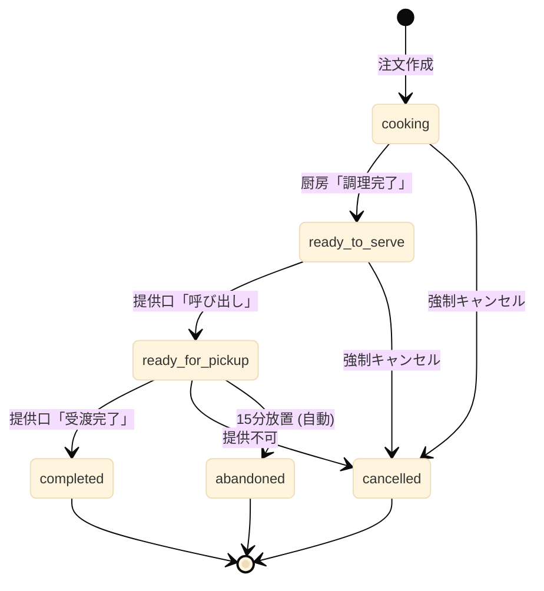
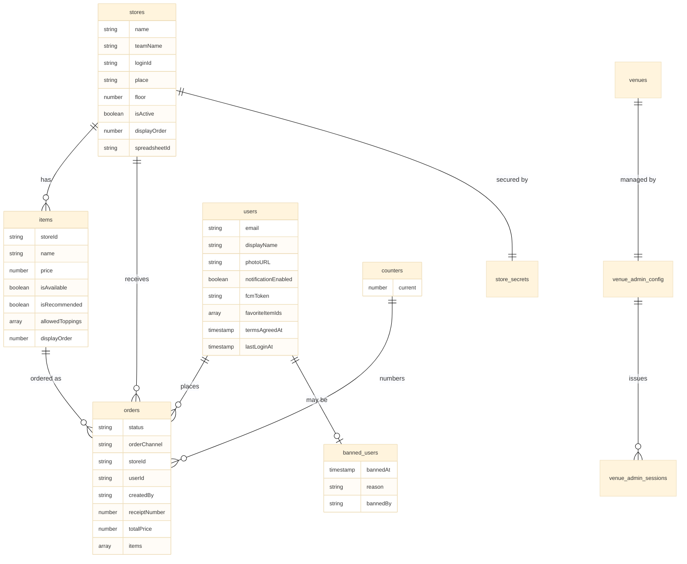

## 第4章 データモデル設計

### 4.1 章の目的

本章では、本システムが Cloud Firestore 上に保持するすべてのデータの構造を完全に文書化する。コレクション（データの分類単位）の一覧、各コレクション内のドキュメント（データの個別レコード）が持つフィールド（項目）、フィールドの型と意味、データ間の関係を以下に詳述する。

本章はシステム全体の挙動を決定する設計図であり、後続の章（特に第6章のシナリオ別注文フロー、第7章の共通オペレーションフロー、第9章のセキュリティ設計）はすべて本章のデータ構造を前提として記述される。

本章では完成形の仕様のみを記述する。本書執筆時点で未実装である機能については、その箇所に未実装である旨を明記する。

### 4.2 Firestore の基本概念および命名規則

#### 4.2.1 基本概念

Cloud Firestore（Google が提供するクラウド型NoSQLデータベース）はドキュメント指向のデータベースである。本章を読む上で必要な基本概念を以下に整理する。

**ドキュメント (Document)**  
データの最小単位である。キーと値のペアで構成され、JSONに似た構造を持つ。各ドキュメントには一意のID（ドキュメントID）が付与される。

**コレクション (Collection)**  
ドキュメントを束ねる入れ物である。リレーショナルデータベースの「テーブル」に近い概念であるが、コレクション内のドキュメントが同じスキーマを持つことは強制されない。

**フィールド (Field)**  
ドキュメント内のキーと値のペアである。値の型として、文字列、数値、真偽値、タイムスタンプ、配列、マップ（入れ子オブジェクト）などが使用できる。

**Timestamp**  
日時を表す Firestore 固有の型である。サーバー側で記録された日時を、タイムゾーン情報を含めて保持する。

**トランザクション (Transaction)**  
複数のドキュメントへの読み書きを単一の原子的操作として実行する Firestore の機能である。本システムでは受付番号の発番処理で使用する。詳細は4.7節で扱う。

#### 4.2.2 命名規則

本システムでは以下の命名規則を採用する。

**コレクション名**  
複数形小文字とする。複数の単語を含む場合はスネークケース（単語間をアンダースコアで区切る）を用いる。例: `orders`、`store_secrets`。

**ドキュメントID**  
コレクションごとに規則が異なる。各コレクションの説明にて個別に定義する。

**フィールド名**  
キャメルケース（最初の単語は小文字、後続の単語の先頭を大文字）とする。例: `orderChannel`、`receiptNumber`。

**ステータス値・列挙値**  
小文字スネークケースとする。例: `ready_for_pickup`、`mobile`。

**タイムスタンプフィールド**  
「動詞過去形 + At」の形式で命名する。例: `createdAt`、`completedAt`、`readyForPickupAt`。

### 4.3 コレクション一覧

本システムが使用する全コレクションを以下に示す。

| コレクション名         | 種別             | 役割                         | 実装状況                                                    |
| ---------------------- | ---------------- | ---------------------------- | ----------------------------------------------------------- |
| `stores`               | マスタ           | 販売店舗のメタデータ         | 実装済                                                      |
| `items`                | マスタ           | 商品マスタ                   | 実装済                                                      |
| `orders`               | トランザクション | 注文データ                   | 実装済                                                      |
| `users`                | トランザクション | ユーザープロファイル         | 実装済                                                      |
| `counters`             | システム         | 受付番号発番カウンタ         | 実装済                                                      |
| `store_secrets`        | セキュリティ     | 店舗認証用機密情報           | 実装済                                                      |
| `venues`               | システム         | 会場ステータス管理           | 実装済                                                      |
| `venue_admin_config`   | セキュリティ     | 会場管理者認証設定           | 実装済                                                      |
| `venue_admin_sessions` | セキュリティ     | 会場管理者セッショントークン | 実装済                                                      |
| `_metadata`            | システム         | マスタ同期のバージョン管理   | 実装済                                                      |
| `banned_users`         | セキュリティ     | 利用停止対象ユーザー         | ※本コレクションへの自動記録処理は本書執筆時点で未実装である |

本システムでは、Firestore 上に `users/{uid}/cart` サブコレクションを保持しない。カート情報はクライアント側でローカル変数として保持し、注文確定時に Cloud Functions（Firebase 上で動作するサーバー処理）へ直接送信する。詳細は4.5.3節で扱う。

それぞれのコレクションの詳細を以下の節で記述する。

### 4.4 マスタ系コレクション

#### 4.4.1 `stores` コレクション

販売を行う各団体（店舗）のメタデータを保持する。展示のみを行う団体（メニュー販売を行わない団体）は本コレクションには登録されない。展示団体の情報はクライアント側の `data.js` にのみ保持される。

**ドキュメントID**  
店舗を一意に識別する固定IDである。`data.js` の `projectData[].id` の値をそのまま使用する。例: `101`、`taiyaki`。

**フィールド構造**

| フィールド       | 型        | 説明                                         |
| ---------------- | --------- | -------------------------------------------- |
| `name`           | string    | 出店団体の正式名称（例: 「2年A組」）         |
| `teamName`       | string    | 来場者向けの店舗名（例: 「たい焼きカフェ」） |
| `loginId`        | string    | 店舗ログインに使用する識別子                 |
| `place`          | string    | 出店場所（例: 「中庭テントA」）              |
| `floor`          | number    | 階数                                         |
| `description`    | string    | 店舗の説明文                                 |
| `operationStatus`| string    | 店舗の営業ステータス（"before_open", "open", "closed"等） |
| `displayOrder`   | number    | 店舗一覧画面における表示順                   |
| `spreadsheetId`  | string    | 売上連携先 Google スプレッドシートのID       |
| `spreadsheetUrl` | string    | スプレッドシートへの直接リンクURL            |
| `createdAt`      | Timestamp | レコード作成日時                             |
| `updatedAt`      | Timestamp | 最終更新日時                                 |

**スプレッドシート連携**  
本システムでは、すべての販売店舗が Google スプレッドシートとの自動連携を行う。注文の作成・更新時に対応するスプレッドシートへ自動で行が追記・更新される。`spreadsheetId` および `spreadsheetUrl` はすべての店舗において保持される必須フィールドである。

**用途**  
`stores` は `mobile-order.html` における店舗選択、`portal.html` における店舗管理、売上連携処理で参照される。

#### 4.4.2 `items` コレクション

各店舗が販売する商品のマスタデータを保持する。`items` は独立したトップレベルコレクションとして配置され、各商品ドキュメントは `storeId` フィールドにより特定の店舗に紐付けられる。

**ドキュメントID**  
`{storeId}_{itemId}` の形式で構成される明示IDである。`storeId` は `stores` コレクションのドキュメントID、`itemId` は `data.js` 内の `menu` 配列の各要素に付与された一意の識別子である。例: `101_yakisoba_sauce`、`101_potato`。

ドキュメントIDを明示化することにより、同期処理を冪等に実行できる。すなわち、同一の `data.js` を複数回同期しても、商品ドキュメントは増加せず、既存ドキュメントが上書きされる挙動となる。

**フィールド構造**

| フィールド        | 型                  | 説明                                                                           |
| ----------------- | ------------------- | ------------------------------------------------------------------------------ |
| `storeId`         | string              | この商品を販売する店舗のID                                                     |
| `name`            | string              | 商品名                                                                         |
| `description`     | string              | 商品説明文                                                                     |
| `price`           | number              | 販売価格（税込、円単位の整数）                                                 |
| `imageUrl`        | string \| null      | 商品画像のURL（Cloud Storage 上の公開URL）                                     |
| `isAvailable`     | boolean             | 販売中であるか否か。`false` の場合、UI上で「売切」または「販売停止」として表示 |
| `isRecommended`   | boolean             | おすすめ商品であるか否か                                                       |
| `allowedToppings` | array&lt;string&gt; | 選択可能なトッピング名の配列                                                   |
| `displayOrder`    | number              | 店舗内での表示順序                                                             |
| `createdAt`       | Timestamp           | レコード作成日時                                                               |
| `updatedAt`       | Timestamp           | 最終更新日時                                                                   |

**販売可否の管理**  
本システムでは数値による在庫数（個数）の自動減算は行わない。販売可否は `isAvailable` の真偽値のみで管理し、店舗責任者が `portal.html` 経由で手動で「販売中／売切」を切り替える運用とする。これは、文化祭という特殊な運用環境において、リアルタイムでの数値在庫管理が現実的でないとの判断による。

**トッピングの管理**  
トッピングは各商品ドキュメントの `allowedToppings` 配列で管理される。例えば「たい焼き」のドキュメントが `allowedToppings: ["あんこ", "クリーム", "チョコ"]` を持つ場合、注文時に来場者はこの3種類から選択できる。トッピングごとの追加料金は発生しない。トッピング個別の販売可否は管理しない。

**表示順序の管理**  
`displayOrder` フィールドは商品一覧画面における表示順を制御する。Firestore のドキュメント取得順は仕様上保証されないため、表示順を安定化するためには本フィールドを用いた `orderBy("displayOrder", "asc")` 句が必要である。

`displayOrder` の値は `data.js` の `menu` 配列のインデックス（0始まり）から自動採番される。すなわち、`data.js` 上で `menu` 配列の先頭に配置された商品が `displayOrder: 0` として登録され、画面上でも先頭に表示される。

**画像のアップロード**  
商品画像は `portal.html` から店舗責任者がアップロードする。アップロード時にはフロントエンド（Canvas API）で画像が WebP 形式に変換され、長辺1200ピクセルにリサイズされた後、Cloud Storage に保存される。保存後の公開URLが `imageUrl` フィールドに記録される。

### 4.5 トランザクション系コレクション

#### 4.5.1 `orders` コレクション

すべての注文データを保持する、本システムの中核となるコレクションである。注文経路の違いは `orderChannel` フィールドで表現され、注文の進行状態は `status` フィールドで表現される。

**ドキュメントID**  
Firestore により自動生成される一意のID。

**フィールド構造**

| フィールド           | 型                | 説明                                                                                                |
| -------------------- | ----------------- | --------------------------------------------------------------------------------------------------- |
| `status`             | string            | 注文の現在のステータス。詳細は4.6節                                                                 |
| `orderChannel`       | string            | 注文経路。`"pos"`、`"mobile"`、`"sok"` のいずれか                                                   |
| `storeId`            | string            | 注文先の店舗ID                                                                                      |
| `items`              | array&lt;map&gt;  | 注文された商品の配列                                                                                |
| `totalPrice`         | number            | 合計金額（円単位の整数）                                                                            |
| `receiptNumber`      | number            | 受付番号。詳細は4.7節                                                                               |
| `userId`             | string \| null    | 注文者のUID。`mobile` は必須、`pos` および `sok` は `null`                                          |
| `createdBy`          | string \| null    | POS注文の場合、操作したスタッフのUID。集計および監査用途で保持する。`mobile` および `sok` は `null` |
| `cancellationReason` | string \| null    | キャンセル時の理由                                                                                  |
| `note`               | string \| null    | スタッフによる手動メモ。`adminUpdateOrderStatus` Function による強制変更時に変更理由が記録される    |
| `createdAt`          | Timestamp         | 注文作成日時。本システムでは厨房工程開始時刻を兼ねる                                                |
| `readyToServeAt`     | Timestamp \| null | 調理完了日時                                                                                        |
| `readyForPickupAt`   | Timestamp \| null | 提供準備完了日時。**ペナルティ判定の基準時刻**                                                      |
| `completedAt`        | Timestamp \| null | 提供完了日時                                                                                        |
| `cancelledAt`        | Timestamp \| null | キャンセル日時                                                                                      |
| `abandonedAt`        | Timestamp \| null | 放置による強制終了日時                                                                              |
| `updatedAt`          | Timestamp         | 最終更新日時                                                                                        |

**`items` 配列の各要素の構造**

| サブフィールド   | 型               | 説明                                   |
| ---------------- | ---------------- | -------------------------------------- |
| `itemId`         | string           | `items` コレクションのドキュメントID   |
| `name`           | string           | 注文時点での商品名（スナップショット） |
| `price`          | number           | 注文時点での単価（スナップショット）   |
| `quantity`       | number           | 注文数量                               |
| `customizations` | array&lt;map&gt; | 選択されたカスタマイズの配列           |

**`customizations` 配列の各要素の構造**

| サブフィールド | 型     | 説明                                    |
| -------------- | ------ | --------------------------------------- |
| `mode`         | string | カスタマイズ種別。`"ADD"` または `"NO"` |
| `target`       | string | 対象トッピング名                        |

**スナップショット保持の理由**  
`items` 配列内には商品名と価格を直接保持する。これは、`items` コレクションのマスタが後から変更された場合でも、過去の注文の表示・集計が正しく行えるようにするためである。リレーショナルデータベース的な参照整合性ではなく、注文時点での情報を凍結する設計を採用する。

**経路情報の保持**  
注文がどの経路から作成されたかは、`orderChannel` フィールドの単一の値で表現される。受付番号のレンジから経路を推定するロジックは用いない。`orderChannel` の値と意味は以下の通りである。

| 値         | 意味                                                                                                                       |
| ---------- | -------------------------------------------------------------------------------------------------------------------------- |
| `"pos"`    | 有人POSレジ（`pos.html`）から作成された注文                                                                                |
| `"mobile"` | モバイルオーダー（`mobile-order.html`）から作成された注文                                                                  |
| `"sok"`    | セルフオーダー端末（`sok.html`）から作成された注文。※`sok.html` および対応する Cloud Function は本書執筆時点で未実装である |

**注文作成方針**  
注文作成は必ず Cloud Functions 経由で行う。クライアントは `storeId`、`itemId`、数量、カスタマイズのみを送信し、サーバー側で以下の処理を実施する。

1. 商品存在確認（`items` コレクションへの照会）
2. 店舗一致確認（`items.storeId` と注文の `storeId` の照合）
3. 販売可否確認（`isAvailable === true` の検証）
4. 価格再計算（クライアントから受け取った価格は信用しない）
5. 受付番号発番（4.7節参照）
6. 注文ドキュメントの作成

価格情報をクライアントから受け取った値ではなくサーバー側で再計算する設計により、クライアント改ざんによる不正注文を防止する。

#### 4.5.2 `users` コレクション

各ユーザーのプロファイル情報を保持する。本システムはGoogle認証のみを使用するため、すべてのユーザーがGoogleアカウントに紐づく。匿名認証は使用しない。

**ドキュメントID**  
Firebase Authentication（Firebase が提供する認証機構）により発行されたUID。

**フィールド構造**

| フィールド            | 型                  | 説明                                                                                            |
| --------------------- | ------------------- | ----------------------------------------------------------------------------------------------- |
| `email`               | string              | Googleアカウントのメールアドレス                                                                |
| `displayName`         | string \| null      | Googleアカウントの表示名                                                                        |
| `photoURL`            | string \| null      | Googleアカウントのプロフィール画像URL                                                           |
| `notificationEnabled` | boolean             | Push通知を許可しているか                                                                        |
| `fcmToken`            | string \| null      | FCM（Firebase Cloud Messaging）の登録トークン。単一端末分のみ保持                               |
| `permissionStatus`    | string              | 通知許可の状態（`"granted"`、`"denied"`、`"default"`、`"skipped"`、`"unsupported"` のいずれか） |
| `deviceType`          | string              | 端末種別（`"ios_or_mac"`、`"other"` のいずれか）                                                |
| `termsAgreedAt`       | Timestamp \| null   | 初回の規約同意日時                                                                              |
| `favoriteItemIds`     | array&lt;string&gt; | お気に入りに登録された商品ID配列                                                                |
| `createdAt`           | Timestamp           | 初回ログイン日時                                                                                |
| `lastLoginAt`         | Timestamp           | 最終ログイン日時                                                                                |

**利用規約同意の管理**  
利用規約への同意日時は `users.termsAgreedAt` のみで管理する。`orders` ドキュメント側には保持しない。これにより、ユーザーごとの初回同意日時を一意に追跡できる。

**お気に入り機能**  
`favoriteItemIds` 配列により、来場者は気に入った商品を保存できる。本フィールドへの追加・削除はクライアントから直接 Firestore に書き込まれる（`users/{uid}` への書き込み権限は本人にのみ許可される）。

#### 4.5.3 カート情報の取り扱い

カート情報は Firestore に永続化しない。来場者がモバイルオーダーで商品を選択している間、カート情報はブラウザ内のJavaScript変数にのみ保持される。

注文確定時、`mobile-order.html` は `createOrder` Cloud Function に対して `items` 配列を引数として直接渡す。Cloud Function 側では受け取った `items` 配列に基づき注文ドキュメントを作成する。

この設計により、Firestore への書き込み回数が削減され、カート同期処理に伴う二重書き込みも発生しない。ブラウザを閉じた場合カート内容は失われるが、文化祭という短時間の運用環境においてこの制約は許容される。

#### 4.5.4 `counters` コレクション

受付番号の連番を安全に発番するためのアトミックカウンタを保持するコレクションである。

**ドキュメント構成**  
本コレクションには、注文経路ごとに独立した3つのドキュメントを配置する。

| ドキュメントID            | 用途                                         |
| ------------------------- | -------------------------------------------- |
| `counters/receipt_pos`    | POS経路の受付番号カウンタ（100〜999）        |
| `counters/receipt_mobile` | モバイル経路の受付番号カウンタ（7000〜7999） |
| `counters/receipt_sok`    | SOK経路の受付番号カウンタ（2000〜2999）      |

経路ごとにドキュメントを分離することにより、トランザクションのロック範囲が経路ごとに独立する。すなわち、POS注文の発番処理とモバイル注文の発番処理が同時に発生しても相互にブロックしない。

**フィールド構造**

| フィールド  | 型        | 説明                 |
| ----------- | --------- | -------------------- |
| `current`   | number    | 直近に発番された番号 |
| `updatedAt` | Timestamp | 最終発番日時         |

番号レンジの最小値・最大値はドキュメントには保持せず、Cloud Functions のコード内に定数として定義される。レンジは運用中に変更されることが想定されないため、コード側での管理で十分である。

**アトミックな発番**  
受付番号の発番は Firestore のトランザクション機能を使用する。詳細は4.7節で扱う。

### 4.6 注文ステータスの定義

#### 4.6.1 ステータス値の一覧

注文の状態は `orders.status` フィールドの値で表現される。本システムが使用するステータス値は以下の6種類である。

| ステータス値       | 意味                                         |
| ------------------ | -------------------------------------------- |
| `cooking`          | 調理中。注文受付と同時にこの状態で開始される |
| `ready_to_serve`   | 調理完了。提供口で最終準備中                 |
| `ready_for_pickup` | 呼び出し中。来場者の受け取り待ち             |
| `completed`        | 商品提供完了。決済も完了                     |
| `cancelled`        | キャンセル。来場者または店舗都合             |
| `abandoned`        | 放置による強制終了。利用規約違反             |

これら6種類のステータスは、すべての注文経路（モバイル、SOK、POS）で共通である。経路の違いは `orderChannel` フィールドで表現され、ステータス値そのものには反映されない。

#### 4.6.2 各ステータスの詳細

**`cooking`（調理中）**  
注文ドキュメントが作成された直後の初期状態である。本システムでは「注文を受けた瞬間に厨房は調理に着手する」という運用前提のもと、専用の「調理開始」操作を設けず、注文作成と同時にこのステータスから開始する設計を採用している。

このステータスの注文は `kitchen.html` の画面に表示され、厨房スタッフが調理を行う。

**`ready_to_serve`（提供口準備中）**  
厨房スタッフが `kitchen.html` で「調理完了」ボタンを押下した時点で遷移する。`readyToServeAt` フィールドにタイムスタンプが記録される。`kitchen.html` から該当注文の表示が消え、`presenter.html` に「呼び出し前」として表示される。提供口スタッフは商品を仕上げ、トレイへの盛り付けや包装を行う。

**`ready_for_pickup`（呼び出し中）**  
提供口スタッフが `presenter.html` で「呼び出し（準備完了）」ボタンを押下した時点で遷移する。`readyForPickupAt` フィールドにタイムスタンプが記録される。このタイムスタンプは放置ペナルティの判定基準となる重要なフィールドである。

このステータスへの遷移をトリガーに、`monitor.html` への番号表示、合成音声による呼び出し、来場者スマートフォンへのFCM Push通知、`status.html` の表示更新が一斉に実行される。

**`completed`（提供完了）**  
来場者が商品を受け取り、提供口スタッフが `presenter.html` で「受渡完了」ボタンを押下した時点で遷移する。`completedAt` フィールドにタイムスタンプが記録される。これが正常終了の最終ステータスである。

このステータスへの到達は、商品の物理的な受け渡しが完了したことに加え、決済が完了していることをも意味する。決済の確認は提供口スタッフが受渡完了ボタンを押下する直前に、来場者がAirPay決済画面を提示することで行う。

**`cancelled`（キャンセル）**  
何らかの理由で注文が取消された状態である。キャンセルが発生する場面は以下の通りである。

- 商品が品切れとなり提供できないことが判明した場合（提供口スタッフが「提供不可・キャンセル」を押下）
- スタッフが何らかの判断でキャンセルを実行した場合

`cancelledAt` および `cancellationReason` フィールドが記録される。

**`abandoned`（放置）**  
`ready_for_pickup` の状態で15分以上来場者が受け取りに来なかった注文に対して、Scheduled Function が自動的に遷移させるステータスである。`cancelled` とは区別される。`abandonedAt` にタイムスタンプが記録される。

`abandoned` が記録されると同時に、対象ユーザーのUIDが `banned_users` コレクションに記録される（自動BAN）。詳細は第8章で扱う。

※本ステータスへの自動遷移処理および `banned_users` への自動記録処理は、本書執筆時点で未実装である。

#### 4.6.3 ステータス遷移図

注文ステータスの遷移を以下に示す。



#### 4.6.4 ステータス遷移時の責務マップ

各ステータス遷移は、特定の Cloud Function が責務を持つ。クライアント画面は Cloud Function を呼び出すのみであり、Firestore に対する直接の書き込みは行わない。

| 遷移                                  | 呼び出し主体                             | 実行 Function            | 記録フィールド                                      |
| ------------------------------------- | ---------------------------------------- | ------------------------ | --------------------------------------------------- |
| ⇒ `cooking`                           | クライアント（mobile-order / pos / sok） | `createOrder`            | `createdAt`, `updatedAt`                            |
| `cooking` ⇒ `ready_to_serve`          | `kitchen.html`                           | `kitchenComplete`        | `readyToServeAt`, `updatedAt`                       |
| `ready_to_serve` ⇒ `ready_for_pickup` | `presenter.html`                         | `callForPickup`          | `readyForPickupAt`, `updatedAt`                     |
| `ready_for_pickup` ⇒ `completed`      | `presenter.html`                         | `completeOrder`          | `completedAt`, `updatedAt`                          |
| 任意 ⇒ `cancelled`                    | `presenter.html` 等                      | `cancelOrder`            | `cancelledAt`, `cancellationReason`, `updatedAt`    |
| `ready_for_pickup` ⇒ `abandoned`      | Scheduled Function                       | `abandonStaleOrders`     | `abandonedAt`, `updatedAt`、`banned_users` への記録 |
| 任意 ⇒ 任意（管理者強制）             | `portal.html`                            | `adminUpdateOrderStatus` | 該当タイムスタンプ, `note`, `updatedAt`             |

各遷移に伴う副作用（FCM Push通知の送信、Google スプレッドシートへの書き込みなど）は、`orders` ドキュメントの `onUpdate` トリガーで起動する別 Function（`sendOrderUpdateNotification`、`onOrderUpdatedSpreadsheet` など）が担当する。詳細は第7章で扱う。

`monitor.html` は表示専用画面であり、注文ステータスを更新する Function は呼び出さない。

※`abandonStaleOrders` Scheduled Function は本書執筆時点で未実装である。  
※`createOrder` Function の SOK 経路対応部分は本書執筆時点で未実装である。

#### 4.6.5 ステータス更新 Function の責務

クライアントから `orders` ドキュメントを直接更新することは、Firestore セキュリティルールにより完全に禁止される。すべてのステータス更新は Cloud Functions を経由しなければならない。

この設計を採用する理由は以下の通りである。

第一に、不正な遷移を防止できる。例えば「`cooking` から `completed` へ直接遷移する」といった、業務フロー上ありえない遷移を Function 側で検証して拒否できる。

第二に、副作用を確実に発火できる。タイムスタンプの記録、FCM通知の送信などを Function 内で一括して行うことで、画面ごとの実装差異を排除できる。

第三に、監査ログを確実に残せる。誰がどの遷移を実行したかを Function 側で記録できる。

通常運用で使用される遷移用 Function は以下の4種類である。

**`kitchenComplete({ orderId })`**  
`cooking` から `ready_to_serve` への遷移のみを許可する。厨房スタッフが認証済みであり、対象注文の `storeId` に対する `store_admin` 権限を持つことを検証する。

**`callForPickup({ orderId })`**  
`ready_to_serve` から `ready_for_pickup` への遷移のみを許可する。提供口スタッフが認証済みであり、対象注文の `storeId` に対する `store_admin` 権限を持つことを検証する。

**`completeOrder({ orderId })`**  
`ready_for_pickup` から `completed` への遷移のみを許可する。提供口スタッフが認証済みであり、対象注文の `storeId` に対する `store_admin` 権限を持つことを検証する。

**`cancelOrder({ orderId, reason })`**  
`cooking`、`ready_to_serve`、`ready_for_pickup` のいずれかから `cancelled` への遷移を許可する。`reason` 引数は必須である。

これら4つの Function は、それぞれ単一の遷移パターンのみを許可する厳格な責務を持つ。

管理者専用の遷移 Function として、以下が存在する。

**`adminUpdateOrderStatus({ orderId, newStatus, reason })`**  
任意のステータスから任意のステータスへの強制遷移を許可する。SuperAdmin または当該店舗の `store_admin` のみ実行可能である。`reason` 引数は必須であり、`note` フィールドに「強制変更: (reason)」の形式で記録される。これは提供口で「受渡完了」を押し忘れたまま放置された注文の救済、誤って `completed` にしてしまった注文の差し戻しなどの例外運用に使用される。

注文作成用の Function として、以下が存在する。

**`createOrder({ orderChannel, storeId, items })`**  
全経路共通の注文作成 Function である。`orderChannel` の値により内部処理が分岐する。`pos` の場合は `createdBy` にスタッフUIDを記録し `userId` は `null` とする。`mobile` の場合は `userId` に認証済みUIDを記録し `createdBy` は `null` とする。`sok` の場合は両方とも `null` とする。

※`abandonStaleOrders` Scheduled Function（`ready_for_pickup` から `abandoned` への自動遷移）は本書執筆時点で未実装である。

### 4.7 受付番号の体系と発番ロジック

#### 4.7.1 受付番号レンジ

受付番号は注文経路ごとに独立した数値範囲（レンジ）から発番される。

| 注文経路         | レンジ       | 桁数 |
| ---------------- | ------------ | ---- |
| モバイルオーダー | 7000 〜 7999 | 4桁  |
| SOK              | 2000 〜 2999 | 4桁  |
| 有人POS          | 100 〜 999   | 3桁  |

レンジを経路ごとに分離する目的は以下の通りである。

**経路の即時識別**  
受付番号の桁数と先頭の数字を見るだけで、その注文がどの経路から来たかが直感的にわかる。例えば呼び出し画面に「7521番」と表示されれば、これがモバイルオーダーの注文であると即座に判別できる。

**番号衝突の防止**  
レンジが重複しないため、異なる経路の同時発番でも番号が衝突する可能性がない。

**運用上の柔軟性**  
特定経路に問題が発生した場合、レンジで容易にフィルタできる。

なお、経路の判別は `orderChannel` フィールドを参照することが正式な手段である。受付番号レンジによる経路判定は、UI上の即時識別のための副次的な手がかりとして位置付けられる。

#### 4.7.2 POS端末ごとの分離は行わない

POS端末は複数台が同時に稼働する場合があるが、本システムでは端末ごとに番号レンジを分離せず、すべてのPOS端末が共通の `100〜999` レンジから発番する。

これは、厨房側での番号管理を単純化するためである。端末ごとに「100番台」「200番台」と分けると、厨房スタッフは「100番台はA端末、200番台はB端末」と意識する必要が生じ、運用負荷が増大する。共通レンジとすることで、厨房は番号の出所を意識せず、純粋に注文順に処理することに集中できる。

#### 4.7.3 番号の重複と再利用

番号の「重複禁止」は、現在まだアクティブな注文（受け渡しまたはキャンセルが完了していない注文）の間でのみ適用される。

**アクティブな注文**  
ステータスが `cooking`、`ready_to_serve`、`ready_for_pickup` のいずれかである注文。これらの注文の受付番号は、他の注文と重複してはならない。

**完了済みの注文**  
ステータスが `completed`、`cancelled`、`abandoned` のいずれかである注文。これらの番号は再利用可能となる。

#### 4.7.4 循環発番ロジック

各レンジの最大値（例: モバイルなら7999）に達した後、次の発番要求があると最小値（7000）に戻り、空き番号を順に探索する。空き番号とは、その番号が現在アクティブな注文に使用されていないことを意味する。

発番ロジックの疑似コードを以下に示す。

```javascript
async function getNextReceiptNumber(channel) {
  const ranges = {
    pos: { min: 100, max: 999 },
    mobile: { min: 7000, max: 7999 },
    sok: { min: 2000, max: 2999 },
  };
  const { min, max } = ranges[channel];
  const rangeSize = max - min + 1; // POS:900、mobile/sok:1000

  return await firestore.runTransaction(async (tx) => {
    const counterRef = firestore.doc(`counters/receipt_${channel}`);
    const counterSnap = await tx.get(counterRef);
    let candidate = (counterSnap.data()?.current ?? min - 1) + 1;

    for (let attempt = 0; attempt < rangeSize; attempt++) {
      if (candidate > max) candidate = min;

      const isInUse = await checkActiveOrderExists(channel, candidate, tx);
      if (!isInUse) {
        tx.set(
          counterRef,
          {
            current: candidate,
            updatedAt: serverTimestamp(),
          },
          { merge: true },
        );
        return candidate;
      }
      candidate++;
    }

    throw new Error("受付番号の空きが存在しません");
  });
}
```

#### 4.7.5 トランザクションによる排他制御の設計意図

受付番号の発番処理は Firestore のトランザクション機能を用いて実行される。本節ではトランザクションが何をロックし、何を保証するかを明示する。

**ロック対象**  
発番処理のトランザクションは、`counters/receipt_{channel}` ドキュメントを排他ロックの対象とする。すなわち、同一経路に対する発番要求が同時に複数発生した場合、Firestore はトランザクションを直列化し、片方が完了するまでもう片方を待機させる。

**経路ごとの独立性**  
カウンタドキュメントは経路ごとに分離されている（`counters/receipt_pos`、`counters/receipt_mobile`、`counters/receipt_sok`）ため、異なる経路の発番処理は相互にブロックしない。POS注文とモバイル注文が同時に発番要求を出しても、それぞれ独立したトランザクションとして並列実行される。

**保証される性質**  
このトランザクション設計により、以下の性質が保証される。

1. 同一経路内で同一の受付番号が複数の注文に同時に割り当てられることはない（重複発番の防止）
2. カウンタの `current` 値の更新と注文ドキュメントの作成が同一トランザクション内で行われるため、「番号を発番したが注文ドキュメントの作成に失敗する」という中途半端な状態は発生しない
3. アクティブな注文の存在チェック（`checkActiveOrderExists`）もトランザクション内で実行されるため、チェック直後に他の注文が同じ番号を取得することはない

**トランザクションを使わない場合の問題**  
仮にトランザクションを使わず、カウンタの読み取り・更新を別操作として実行すると、複数の同時注文において「両方が同じ `current` 値を読み取り、両方が同じ番号を発番する」という重複が発生しうる。本システムでは Firestore トランザクションによってこの問題を構造的に排除する。

#### 4.7.6 レンジ全探索ルール

発番処理は、各レンジのサイズ全体（POS で900回、モバイル・SOK で1000回）まで連続して空き番号を探索する。レンジ全体を一周しても空き番号が見つからなかった場合、発番は失敗としエラーを返す。

レンジ全体を探索する設計の理由は以下の通りである。

**一時的な偏りへの耐性**  
固定回数（例: 50回）のみを試行する設計では、アクティブな注文が連続した番号領域に偏在している場合、実際にはレンジ内に空き番号があるにもかかわらず発番が失敗する可能性がある。レンジ全体を探索することで、空き番号が存在する限り必ず発番が成功することが保証される。

**真の枯渇の検出**  
レンジ全体を探索しても空きが見つからない場合、それは真の意味でレンジが枯渇していることを示す。この状態はシステムまたは運用の異常（提供口での `completed` 操作の漏れなど）を示唆するため、エラーとして検出すべき事象である。

発番失敗時は、フロントエンドにエラーが返され、注文を試みた利用者には「現在注文を受け付けられません。スタッフにお声がけください」という趣旨のメッセージが表示される。

#### 4.7.7 番号枯渇への対応

「商品を受け渡したら、即座にシステム上で `completed` にする」という運用ルールが徹底されていれば、各レンジの上限に達することはまずない。番号枯渇への根本的な対策は、提供口スタッフに対する徹底したオペレーション教育である。

### 4.8 セキュリティ・システム系コレクション

#### 4.8.1 `store_secrets` コレクション

各店舗の機密情報を保持する。具体的には、店舗管理画面（`portal.html` 経由でアクセスする店舗管理機能）に入るためのパスワードハッシュなどが格納される。

**アクセス制御**  
このコレクションは Firestore セキュリティルールにより、クライアントからの読み取り・書き込みが完全に禁止されている。アクセスは Cloud Functions のみが可能である。

**ドキュメントID**  
店舗ID（`stores` コレクションのドキュメントIDと一致）。

**フィールド構造**

| フィールド  | 型        | 説明                                                   |
| ----------- | --------- | ------------------------------------------------------ |
| `hash`      | string    | 店舗パスワードのハッシュ値（PBKDF2、SHA-512、10000回） |
| `salt`      | string    | ハッシュ計算に使用するソルト                           |
| `updatedAt` | Timestamp | 最終更新日時                                           |

#### 4.8.2 `banned_users` コレクション

利用停止対象となったユーザーを記録する。詳細は第3章および第8章で扱うが、本節ではデータ構造のみ記述する。

**ドキュメントID**  
利用停止対象ユーザーのUID。

**フィールド構造**

| フィールド | 型             | 説明                                               |
| ---------- | -------------- | -------------------------------------------------- |
| `bannedAt` | Timestamp      | BAN記録日時                                        |
| `reason`   | string         | BAN理由（例: `"abandoned_order"`、`"manual_ban"`） |
| `orderId`  | string \| null | 原因となった注文のID                               |
| `bannedBy` | string         | BAN実行者。`"auto_scheduler"` または実行者のUID    |

※本コレクションへの自動記録処理（`abandoned` ステータスへの自動遷移に連動するもの）は、本書執筆時点で未実装である。

#### 4.8.3 `venues` および関連コレクション

会場（体育館などの催し物会場）のステータスを管理するためのコレクション群である。これらは注文システムとは独立した機能であるが、システム全体の一部として管理される。

**`venues` コレクション**  
会場メタデータと現在のステータス（進行中の演目など）を保持する。

| フィールド       | 型             | 説明                                                                |
| ---------------- | -------------- | ------------------------------------------------------------------- |
| `status`         | string         | 開催状態（`"preparing"`、`"soon"`、`"live"`、`"ended"` のいずれか） |
| `currentEventId` | string \| null | 現在進行中の演目ID                                                  |
| `nextEventId`    | string \| null | 次の演目ID                                                          |
| `updatedAt`      | Timestamp      | 最終更新日時                                                        |

**`venue_admin_config` コレクション**  
会場管理画面のログイン用設定を保持する。Firebase Authenticationを使わない独立した認証フローのために存在する。本コレクションには `settings` ドキュメントが配置される。

| フィールド    | 型        | 説明                                    |
| ------------- | --------- | --------------------------------------- |
| `accessToken` | string    | URLパラメータで照合するアクセストークン |
| `hash`        | string    | 管理者パスワードのハッシュ値            |
| `salt`        | string    | ハッシュ計算に使用するソルト            |
| `updatedAt`   | Timestamp | 最終更新日時                            |

**`venue_admin_sessions` コレクション**  
会場管理者の有効なセッショントークンを保持する。ドキュメントIDがセッショントークン自身である。

| フィールド  | 型        | 説明               |
| ----------- | --------- | ------------------ |
| `createdAt` | Timestamp | セッション発行日時 |

セッションの有効期限は24時間である。これらの認証フローは注文フローには直接関与しないため、本書では詳細を扱わない。

#### 4.8.4 `_metadata` コレクション

マスタデータの同期状態を管理するためのコレクションである。

**主なドキュメント**  
`_metadata/master_sync` ドキュメントは、`admin_sync.html` から実行されたマスタ同期のバージョン情報を保持する。

**フィールド構造（`_metadata/master_sync`）**

| フィールド  | 型        | 説明                                               |
| ----------- | --------- | -------------------------------------------------- |
| `version`   | string    | 同期実行時のバージョン番号（タイムスタンプ文字列） |
| `updatedAt` | Timestamp | 同期実行日時                                       |

クライアント側の `data.js` には `dataVersion` 定数が記述されており、本ドキュメントの `version` と照合することで、Firestore のデータと `data.js` の同期状態を判定できる。

### 4.9 データモデルの関係図

主要なコレクション間の関係を以下に示す。



※`banned_users` への自動記録処理は本書執筆時点で未実装である。

### 4.10 注文ドキュメントのライフサイクル例

ある一つの注文が、作成から完了までにどのようにフィールドが変化するかを以下に示す。これはモバイルオーダーの正常系の例である。

**ステップ1: 注文作成 (`cooking`)**

```json
{
  "status": "cooking",
  "orderChannel": "mobile",
  "storeId": "101",
  "userId": "uid_abc123",
  "createdBy": null,
  "receiptNumber": 7042,
  "items": [
    {
      "itemId": "101_taiyaki_anko",
      "name": "たい焼き(あんこ)",
      "price": 250,
      "quantity": 2,
      "customizations": []
    }
  ],
  "totalPrice": 500,
  "note": null,
  "cancellationReason": null,
  "createdAt": "2026-09-12T10:23:18+09:00",
  "readyToServeAt": null,
  "readyForPickupAt": null,
  "completedAt": null,
  "cancelledAt": null,
  "abandonedAt": null,
  "updatedAt": "2026-09-12T10:23:18+09:00"
}
```

**ステップ2: 調理完了 (`ready_to_serve`)**  
`kitchen.html` で厨房スタッフが「調理完了」ボタンを押下し、`kitchenComplete` Function が実行される。`status` が `ready_to_serve` に、`readyToServeAt` にタイムスタンプが記録される。`updatedAt` も更新される。

**ステップ3: 呼び出し開始 (`ready_for_pickup`)**  
`presenter.html` で提供口スタッフが「呼び出し」ボタンを押下し、`callForPickup` Function が実行される。`status` が `ready_for_pickup` に、`readyForPickupAt` にタイムスタンプが記録される。この時刻からカウントが始まり、15分経過時にペナルティ判定の対象となる。

**ステップ4: 提供完了 (`completed`)**  
`presenter.html` で提供口スタッフが「受渡完了」ボタンを押下し、`completeOrder` Function が実行される。`status` が `completed` に、`completedAt` にタイムスタンプが記録される。

最終状態は以下のようになる。

```json
{
  "status": "completed",
  "orderChannel": "mobile",
  "storeId": "101",
  "userId": "uid_abc123",
  "createdBy": null,
  "receiptNumber": 7042,
  "items": [
    {
      "itemId": "101_taiyaki_anko",
      "name": "たい焼き(あんこ)",
      "price": 250,
      "quantity": 2,
      "customizations": []
    }
  ],
  "totalPrice": 500,
  "note": null,
  "cancellationReason": null,
  "createdAt": "2026-09-12T10:23:18+09:00",
  "readyToServeAt": "2026-09-12T10:34:51+09:00",
  "readyForPickupAt": "2026-09-12T10:35:20+09:00",
  "completedAt": "2026-09-12T10:38:42+09:00",
  "cancelledAt": null,
  "abandonedAt": null,
  "updatedAt": "2026-09-12T10:38:42+09:00"
}
```

POS注文の場合、基本構造は同一であり、相違点は以下のみである。

- `orderChannel` が `"pos"` になる
- `userId` が `null` になる
- `createdBy` に操作したスタッフUIDが記録される
- `receiptNumber` が 100〜999 のレンジから発番される

このように、各フィールドは時系列に沿って一方向に追記されていき、注文の全履歴が一つのドキュメント内に保持される。これにより、後から特定の注文の処理時間（例: 「調理にかかった時間」「呼び出してから受け取りまでの時間」）を集計することが可能である。

### 4.11 まとめ

本章では、本システムが Cloud Firestore 上に保持する全データの構造を定義した。`stores`、`items` のマスタ系、`orders`、`users` のトランザクション系、`counters`、`store_secrets`、`banned_users` などのシステム系・セキュリティ系、`venues` 系および `_metadata` を整理し、特に注文ステータスの6状態と受付番号の発番ロジックを詳述した。

すべての注文経路で共通の `orders` コレクションを使用し、ステータスは6種類（`cooking`、`ready_to_serve`、`ready_for_pickup`、`completed`、`cancelled`、`abandoned`)に統一されている。経路の違いは `orderChannel` フィールドで表現される。受付番号は経路ごとにレンジを分離し、経路ごとに独立した `counters` ドキュメントで管理する。Firestore トランザクションによりカウンタドキュメントを排他ロックして同時注文時の番号衝突を防止し、レンジ全体を探索することで一時的な番号の偏在による発番失敗を回避する。

すべてのステータス更新は Cloud Functions（`createOrder`、`kitchenComplete`、`callForPickup`、`completeOrder`、`cancelOrder`、`adminUpdateOrderStatus`、`abandonStaleOrders`）を経由して行われ、クライアントから `orders` ドキュメントへの直接書き込みは Firestore セキュリティルールにより禁止される。

本書執筆時点で未実装の機能は以下の通りである。

- SOK経路（`sok.html` および `createOrder` の `sok` 分岐処理）
- `abandoned` ステータスへの自動遷移処理（`abandonStaleOrders` Scheduled Function）
- `banned_users` への自動記録処理

これらの機能は本章のデータモデル定義に従って実装される。

次章では、これらのデータを操作する画面群（HTMLファイル）の役割を詳述する。
