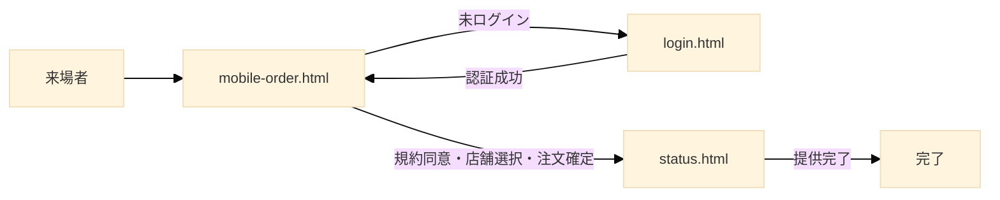
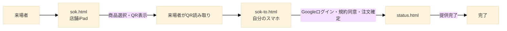
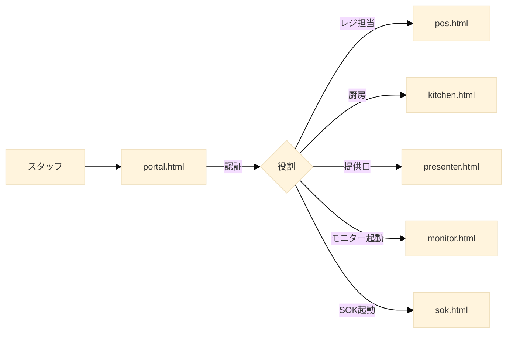

## 第5章 画面構成と責務

### 5.1 章の目的

本章では、本システムを構成する全HTMLファイル（画面）の役割を一覧化し、各画面が担う責務、利用者、画面間の遷移関係を明確化する。

本システムはシングルページアプリケーション（SPA）ではなく、画面ごとにHTMLファイルを分離する伝統的なマルチページ構成を採用する。これは、各画面の責務を明確に分離し、特定の画面に問題が発生しても他の画面は影響を受けないという独立性を重視した設計である。

### 5.2 画面の分類

本システムの画面は、利用者と用途により以下のように分類される。

**来場者向け画面**  
来場者が自身のスマートフォン、または店舗設置のSOK端末で操作する画面。

- `login.html`: 認証エントリーポイント
- `mobile-order.html`: モバイルオーダー
- `sok.html`: セルフオーダーキオスク
- `sok-to.html`: SOK→スマートフォン引き継ぎ
- `status.html`: 注文ステータス確認
- `account.html`: アカウントダッシュボード

**スタッフ向け画面**  
出店団体スタッフ、実行委員、教員などが操作する画面。

- `portal.html`: スタッフ認証ハブ・店舗管理
- `pos.html`: 有人レジ
- `kitchen.html`: 厨房KDS
- `presenter.html`: 提供口
- `monitor.html`: 来場者向け呼び出しモニター

`monitor.html` は来場者が見る画面であるが、表示内容と運用主体がスタッフ側にあるため、本書ではスタッフ向け画面に分類する。

### 5.3 画面一覧表

各画面の責務と利用者を一覧表で示す。

| ファイル            | 配置    | 利用者           | 主な役割                     |
| ------------------- | ------- | ---------------- | ---------------------------- |
| `login.html`        | `main/` | 来場者全般       | 認証エントリーポイント       |
| `mobile-order.html` | `pos/`  | 在校生           | モバイルオーダーの注文       |
| `sok.html`          | `pos/`  | 一般来場者       | SOK端末上での商品選択        |
| `sok-to.html`       | `pos/`  | 一般来場者       | スマホでの注文引き継ぎ       |
| `status.html`       | `pos/`  | 来場者全般       | 注文ステータスの確認         |
| `account.html`      | `main/` | 来場者全般       | アカウントダッシュボード     |
| `portal.html`       | `pos/`  | 出店団体スタッフ | スタッフ認証ハブ・店舗管理   |
| `pos.html`          | `pos/`  | レジ担当スタッフ | 有人レジ                     |
| `kitchen.html`      | `pos/`  | 厨房スタッフ     | 注文ステータス管理（厨房側） |
| `presenter.html`    | `pos/`  | 提供口スタッフ   | 呼び出し・受け渡し管理       |
| `monitor.html`      | `pos/`  | 来場者（表示）   | 呼び出し番号の大画面表示     |

### 5.4 来場者向け画面の詳細

#### 5.4.1 `login.html`

**配置**: `main/login.html`  
**利用者**: 来場者全般  
**役割**: 来場者向け認証の唯一のエントリーポイント

**主な機能**

- Googleアカウントによるログイン処理（`signInWithPopup`）
- 在校生確認モード（`?mode=student`）と一般来場者モード（`?mode=guest` またはパラメータなし）の分岐
- ドメイン制限の適用（`@gl.pen-kanagawa.ed.jp` の検証）— `isStudentEmail()` として login.html 内にインライン実装されている（設計書5.8.1で auth.js の機能として記載されていたのは誤りであった）
- BANチェック — BANチェックは login.html 単体ではなく、全画面共通の仕組みとして設計される。BAN対象者はどの画面にアクセスしても `main/banned.html` に遷移する。現時点では未実装
- ログイン後の遷移先決定（`?redirect=` クエリパラメータの解釈）
- 既ログイン時の自動リダイレクト
- ポップアップブロック発生時のガイダンス表示

> **注記**: 利用規約への同意取得は login.html ではなく `mobile-order.html` の step-terms で行われる。

**遷移元**

- `mobile-order.html`（未ログイン状態でアクセスした場合）
- `account.html`（未ログイン状態でアクセスした場合）
- `index.html`、`detail.html` 等の公式サイト画面（お気に入り登録時、未ログインの場合）— 未実装
- 来場者が直接URLを入力した場合

**遷移先**

- `?redirect=` で指定された画面（モバイルオーダー、アカウント等）
- 認証失敗時はログイン画面に留まる
- BAN該当時は `main/banned.html` へ遷移（未実装）

詳細は第3章を参照のこと。

#### 5.4.2 `mobile-order.html`

**配置**: `pos/mobile-order.html`  
**利用者**: 在校生（`@gl.pen-kanagawa.ed.jp` ドメイン保有者）  
**役割**: モバイルオーダーの注文受付

**主な機能**

- 認証状態とドメイン要件の検証（未認証なら `login.html` へリダイレクト）
- 利用規約への同意取得UI（未同意の場合のみ）
- 店舗一覧の表示（`stores` コレクションの取得（getDocs、一回取得））
- 店舗選択
- メニュー表示（`items` コレクションを `storeId` でフィルタリング）
- 商品の販売可否（`isAvailable`）に応じたUI制御
- カート操作（追加、数量変更、削除）
- カート内容のローカル保持（注文確定までは Firestore に書き込まない）
- 注文確定処理（Cloud Function `createOnlineOrder` の呼び出し）
- 注文確定後の `status.html` への遷移

**画面構成**

1. 通知設定画面（step-notification：初回または未設定時、規約同意画面の前に表示）
2. 規約同意画面（初回または未同意時）
3. 店舗選択画面
4. メニュー表示画面（カートを画面下部に常時表示）
5. カート確認・注文確定画面

**遷移元**

- `login.html`（認証完了時）
- 来場者が直接URLを入力した場合

**遷移先**

- 注文確定後 → `status.html?orderId=...`
- 未認証時 → `login.html?redirect=mobile-order.html&mode=student`

#### 5.4.3 `sok.html`

**配置**: `pos/sok.html`  
**利用者**: 一般来場者（外部の方）  
**役割**: 店舗設置のセルフオーダーキオスク端末上で動作する商品選択画面

**主な機能**

- 起動時のクエリパラメータ `?storeId=` から店舗IDを取得
- 該当店舗のメニューをフルスクリーンで表示
- タッチ操作によるカート操作
- 注文確定時のCloud Function `createOrderFromSok` 呼び出し
- 受付番号の表示と、`sok-to.html` へのリンクを含むQRコードの生成
- QR表示後20秒で自動的にメニュー画面に戻る
- メニューに戻る前に、操作中の人が「次の人へ」ボタンで明示的にリセット可能

> **注記**: 本画面は現時点で未実装である。設計内容自体は変更なし。

**起動方法**  
SOK端末は、店舗責任者が `portal.html` 経由で起動する。`portal.html` 上で「SOKを起動」を選択すると、`sok.html?storeId=store_101` のような形式で店舗IDが付与されたURLが開かれる。SOK端末は起動後、店舗IDを保持し、別店舗のSOKとして誤動作しないよう設計される。

**設置形態**  
各店舗にiPad（生徒に配布されている学校支給端末）を設置する。設置台数は本書執筆時点で各店舗3台程度を想定するが未確定である。複数台設置する場合、すべてのSOK端末は同じ店舗の `?storeId=` を使用する。

**注文タイムアウト**  
QRコード生成から15分以内に、来場者がスマートフォンでQRコードを読み取り `sok-to.html` で注文確定を行わなかった場合、その仮注文は自動的にキャンセルされる。これは Scheduled Function またはクライアント側のタイムアウト処理により実装される（実装方式は本書執筆時点で未確定）。

**遷移元**

- `portal.html` からの起動
- 来場者の「次の人へ」操作後、メニュー画面に戻る（自画面内ループ）

**遷移先**

- 自画面内でのメニュー → カート → QR表示 → メニューのループ
- 来場者のスマートフォン側で `sok-to.html` が開かれる（SOK端末自体は遷移しない）

#### 5.4.4 `sok-to.html`

**配置**: `pos/sok-to.html`  
**利用者**: SOK経由の一般来場者  
**役割**: SOKで作成された仮注文を、来場者自身のスマートフォンに引き継ぐ

> **注記**: 本画面は現時点で未実装である。設計内容自体は変更なし。

**ファイル名の由来**  
"to" は takeover（引き継ぎ）の略である。SOK端末上で開始された注文を、来場者自身のスマートフォンに「引き継ぐ」ことから命名されている。

※本ファイル名は本書執筆時点で暫定的なものであり、最終的な命名は変更される可能性がある。

**主な機能**

- クエリパラメータ `?orderId=` で渡された仮注文IDを取得
- 仮注文の存在と状態（タイムアウト前であること）を確認
- Googleアカウントによるログイン（匿名認証は廃止）
- 発行されたUIDを、注文ドキュメントの `userId` フィールドに紐付け
- Push通知の許可要求とFCMトークンの登録
- 注文内容の最終確認画面の表示
- 利用規約への同意取得（チェックボックス）
- 「注文確定」ボタンの押下による status の確定
- `status.html` への遷移

**`status.html` から責務を分離する理由**  
`status.html` は純粋に注文ステータスを表示する画面として保つことが、保守性の観点で重要である。SOKフローには認証、通知許可、規約同意、注文確定という多段階の処理があり、これらをすべて `status.html` に組み込むと、一つの画面が複数の状態を持つ巨大な分岐ロジックを抱えることとなり、保守困難になる。

`sok-to.html` を独立した画面として設けることで、SOK特有の引き継ぎ処理を一箇所に閉じ込め、`status.html` は単一責務を保つ。

**遷移元**

- 来場者が `sok.html` のQRコードを読み取った時のみ

**遷移先**

- 注文確定後 → `status.html?orderId=...`
- 仮注文が見つからない、またはタイムアウト済みの場合 → エラー画面

#### 5.4.5 `status.html`

**配置**: `pos/status.html`  
**利用者**: モバイルオーダー利用者およびSOK利用者  
**役割**: 自身の注文の現在のステータスをリアルタイムで確認する

**主な機能**

- クエリパラメータ `?orderId=` で指定された注文の Firestore リアルタイム購読（`onSnapshot`）
- 注文ステータスに応じた画面表示の切り替え
- 受付番号の大きな表示
- 推定待ち時間の表示（同じ店舗の前方にある注文数から計算）
- `ready_for_pickup` 時の強調表示と「提供口でこの画面をお見せください」の案内
- 「提供口で au PAY のQRコードを読み取って決済してください」の説明表示

**ステータス別の表示内容**

| ステータス         | 意味                                                                           |
| ------------------ | -------------------------------------------------------------------------------- |
| `cooking`          | 調理中。注文受付と同時にこの状態で開始される                                 |
| `ready_to_serve`   | 調理完了。提供口で最終準備中                                                   |
| `ready_for_pickup` | 呼び出し中。来場者の受け取り待ち                                             |
| `completed`        | 商品提供完了。決済も完了                                                     |
| `cancelled`        | キャンセル。来場者または店舗都合                                             |
| `abandoned`        | 放置による強制終了。利用規約違反                                           |

> **注記**: 設計書の大文字ステータス（PENDING, COOKING, READY_TO_SERVE等）はすべてsnake_caseに統一。PENDING は廃止され cooking で開始、COMPLETED は completed に統一（completed_at_store / completed_online の区分は廃止）、ABANDONED は abandoned に修正（abandoned_and_paid ではない）。
>
> なお、現在の status.html と account.html の実装コードには completed_at_store, completed_online, abandoned_and_paid が残っている。これらは実装側の修正が必要な箇所である。

**閲覧権限**  
Firestore セキュリティルールにより、注文ドキュメントの `userId` フィールドが、現在のログインユーザーのUIDと一致する場合のみ閲覧可能である。第三者が `?orderId=...` のURLを推測してアクセスしても、Firestore からデータを取得できないため、注文内容は表示されない。

**遷移元**

- `mobile-order.html`（注文確定後）
- `sok-to.html`（注文確定後）
- 来場者がブックマーク等から再アクセスした場合
- Push通知のクリック

**遷移先**

- 来場者が能動的に閉じる

#### 5.4.6 `account.html`

**配置**: `main/account.html`  
**利用者**: ログイン済みの来場者全般  
**役割**: アカウントの総合ダッシュボード

**主な機能**

- 認証情報の表示（メールアドレス、表示名）
- 過去の注文履歴の閲覧
- お気に入り商品の管理
- 通知設定の変更
- アカウントの削除
- ログアウト

**位置づけ**  
`account.html` はモバイルオーダーの利用者だけでなく、お気に入り機能やお知らせ機能を利用する一般来場者も対象とする。本システムが文化祭以後も発展する場合の永続的なユーザーダッシュボードとして設計されている。

**遷移元**

- `login.html`（認証完了後、特定機能を求めて遷移してきた場合）
- ナビゲーションメニューからの直接アクセス

**遷移先**

- 各サブ機能（注文履歴、お気に入り等）の表示は同一画面内のタブまたはセクションで切り替え
- ログアウト時 → `login.html` またはトップページ

### 5.5 スタッフ向け画面の詳細

#### 5.5.1 `portal.html`

**配置**: `pos/portal.html`  
**利用者**: 出店団体スタッフ、実行委員、教員  
**役割**: スタッフ向け機能の認証ハブと店舗管理

**主な機能**

- スタッフ用ツール群（POS、Kitchen、Presenter、Monitor）への入口
- Auth Guard としての機能（未ログイン時のスタッフ画面アクセスを遮断）
- 店舗パスワードの検証（`store_secrets` コレクションを Cloud Function 経由で照会）
- 店舗選択（一人のスタッフが複数店舗を管理する場合）
- メニュー（`items`）の登録・編集
- 商品画像のアップロード（クライアントサイド WebP 変換、Cloud Storage への送信）
- 売上ダッシュボード（時間別・累積・商品別チャート、前日比、リアルタイムランキング、併売分析）
- 注文検索機能（キーワード、日付、ステータスフィルタ）
- 注文詳細モーダル（ステータスの手動変更機能）
- ライブフィード（直近注文のリアルタイム表示）
- SOK端末の起動（`sok.html?storeId=...` を新規タブで開く）
- 各種スタッフ画面（POS、Kitchen等）への起動
- トレーニングモード（`training/index.html` への導線）
- ドメインチェック（`@gl.pen-kanagawa.ed.jp` 限定。マスターアカウントあり）
- ローカルストレージによる店舗IDキャッシュ（再ログイン不要化）
- `?return=` パラメータによる元画面へのリダイレクト（Auth Hub機能）

**Auth Guard の動作**  
`pos/` 配下のスタッフ画面（`pos.html`、`kitchen.html`、`presenter.html`）は、いずれも単独でのログイン画面を持たない。これらの画面は起動時に認証状態を確認し、未認証の場合は強制的に `portal.html` へリダイレクトする。リダイレクトURLの形式は `portal.html?return=元URL&s=storeId` であり、portal.htmlでの認証完了後に `return` パラメータで元の画面に自動的に戻る。`portal.html` がスタッフ認証の唯一の入口として機能する。

> **注記**: portal.htmlは auth.js を使用せず、独自にFirebaseを初期化している。設計書5.8.1でportal.htmlがauth.jsの利用元として記載されていたのは誤りであった。

**遷移元**

- スタッフによる直接アクセス
- 各スタッフ画面からの未認証時リダイレクト

**遷移先**

- 各スタッフ画面（`pos.html`、`kitchen.html`、`presenter.html`、`monitor.html`）
- SOK端末用に `sok.html?storeId=...` を別タブで起動

#### 5.5.2 `pos.html`

**配置**: `pos/pos.html`  
**利用者**: レジ担当スタッフ  
**役割**: 有人レジでの注文入力

**主な機能**

- メニュー一覧の表示（タッチ操作に最適化されたボタン形式）
- 売り切れ商品のSOLD OUT表示とタッチ操作無効化
- 商品のリアルタイム同期（`onSnapshot` でportal.html側の在庫変更を即時反映）
- カート機能（モバイルオーダーと同様の操作感）
- 数量調整UI（＋／－ボタン）
- 全消去機能（確認モーダル付き）
- 商品にトッピングを付加する操作
- 注文確定時の Cloud Function `createPosOrder` 呼び出し
- 受付番号の表示（紙に書いて来場者に手渡すため）
- 経過時間タイマー（注文開始からの秒数表示）
- ドメインチェック
- レシートの表示（任意印刷機能は本書執筆時点では未定）

> **注記**: 端末ID (`posTerminalId`) の保持と注文への記録は設計書に記載があるが実装されていない。

**操作の高速化**  
レジ業務は処理速度が重視されるため、UIは大きなボタンと最小限の確認ステップで構成される。誤操作の取り消しは、注文確定後でも `presenter.html` 側からキャンセル可能なため、レジ画面では確認ダイアログを最小限とする。

**遷移元**

- `portal.html`

**遷移先**

- 注文確定後、自画面内で次の注文の入力に戻る

#### 5.5.3 `kitchen.html`

**配置**: `pos/kitchen.html`  
**利用者**: 厨房スタッフ  
**役割**: 注文の調理ステータス管理

**主な機能**

- ステータスが `cooking` の注文をリアルタイム購読し、画面に表示
- 注文の表示順序（基本は古い順、必要に応じて店舗別フィルタ）
- 注文ごとに「完了」ボタンを表示（1段階のみ）
- 「完了」押下時：status を `ready_to_serve` に更新、`readyToServeAt` を記録
- 新規注文受信時の通知音再生
- 経路別の視覚的区別（モバイル、SOK、POSをアイコンや色で識別）
- ズーム機能（画面表示倍率の調整）
- 履歴モーダル（完了済み注文の一覧と「元に戻す」機能）
- 経過時間タイマー（10分超過で赤点滅アラート）
- ドメインチェック

**画面表示の特徴**  
厨房という環境（手が濡れる、油汚れがある、画面に近づけない）を考慮し、以下のUI設計を採用する。

- 大きなフォント（注文番号は特に大きく）
- 高コントラストの色使い
- ボタンは画面の広い面積を占め、タッチしやすく
- 注文一覧は時系列で並び、画面スクロール最小化のためカード形式で配置

**遷移元**

- `portal.html`

**遷移先**

- スタッフが能動的に閉じる

#### 5.5.4 `presenter.html`

**配置**: `pos/presenter.html`  
**利用者**: 提供口スタッフ  
**役割**: 商品の呼び出しと受け渡し管理

**主な機能**

- ステータスが `ready_to_serve` および `ready_for_pickup` の注文をリアルタイム購読
- `ready_to_serve` の注文: 「呼び出し（準備完了）」ボタン → `ready_for_pickup` に更新
- `ready_for_pickup` かつ POS注文: 「QR決済完了（画面確認）」ボタン → `completed` に更新
- `ready_for_pickup` かつ モバイル注文: 「モニターで決済待機中...」表示（操作ボタンなし、来場者のモニター操作を待つ）
- ドロップダウンメニュー内: 「緊急完了（手動）」「提供不可・キャンセル」
- POS/Mobileの経路判定（受付番号7000-7999をMobileと識別）
- 注文内容（商品リスト、トッピング）の表示
- ズーム機能
- ドメインチェック

> **注記**: 設計書に記載されていた「注文の合計金額を表示（決済時のスタッフによる目視確認用）」は実装に見当たらない。合計金額の表示は presenter.html ではなく monitor.html の注文確認画面で行われる。
>
> また、「au PAY 手動決済では、来場者がスマートフォンに金額を手入力する。スタッフは presenter.html の合計金額表示と、来場者のスマートフォン画面の金額を目視で照合する」という運用フローは実装と一致していない可能性がある。

**ボタン配置の設計方針**  
誤操作を避けるため、メインの操作ボタンとキャンセル系ボタンは明確に分離する。キャンセル系操作はドロップダウンメニュー内に格納され、確認ダイアログを伴う。

**遷移元**

- `portal.html`

**遷移先**

- スタッフが能動的に閉じる

#### 5.5.5 `monitor.html`

**配置**: `pos/monitor.html`  
**利用者**: 来場者（操作）およびスタッフ（管理）  
**役割**: 呼び出し番号の大画面表示、および来場者による番号入力・決済操作

**主な機能**

- 2カラム構成（左: お呼出中 `ready_for_pickup`、右: 準備中 `cooking`/`ready_to_serve` 等）
- 画面タップで番号入力モードへ遷移
- テンキーによる受付番号入力
- 番号入力後の注文確認表示（商品リスト、合計金額）
- 「auPayで支払う（デモ）」ボタン（Cloud Function `mockAuPayPayment` 呼び出し）
- POS注文の場合はレジ案内表示
- 自動タイムアウト（操作なしでモニター表示に復帰）
- 受け取り完了（`completed` 遷移）時に該当番号を一覧から削除
- 従業員サイドメニュー（ズーム、ログアウト）
- ドメインチェック

**設置形態**  
店舗のカウンター付近、または提供口の上部に設置される。来場者がカウンターから少し離れた位置でも視認できるよう、文字サイズは可能な限り大きくする。

**閲覧権限**  
Googleログイン（在校生ドメイン `@gl.pen-kanagawa.ed.jp` 限定）が必要である。

> **注記**: 設計書に記載されていた「認証は不要」「合成音声によるアナウンス」「キャンセル発生時の表示」は実装に見当たらない。実装では来場者が操作する画面でもあり、認証が必須である。

**遷移元**

- スタッフによる直接アクセス

**遷移先**

- 起動後は閉じない（常時表示）

#### 5.5.6 スタッフ画面の共通設計パターン

全スタッフ画面（`portal.html`、`pos.html`、`kitchen.html`、`presenter.html`、`monitor.html`）に共通する実装パターンを以下に記載する。

- 全スタッフ画面にドメインチェック（`@gl.pen-kanagawa.ed.jp`）が実装されている
- マスターアカウント（`ynrcs1000@gmail.com`）によるドメインチェックのバイパス
- 未認証時は `portal.html?return=元URL&s=storeId` へリダイレクト
- `portal.html` 認証後に `return` パラメータで元画面に自動復帰
- 全スタッフ画面が auth.js を使用せず独自にFirebaseを初期化している


### 5.6 画面遷移図

来場者がモバイルオーダーで注文する場合の画面遷移を以下に示す。



来場者がSOKで注文する場合の画面遷移を以下に示す。



スタッフ画面の起動フローを以下に示す。



### 5.7 ファイル配置

ソースコードリポジトリ上のファイル配置を以下に示す。

```
nanryosai-2026/
├── index.html                  // トップページ（南陵祭サイト）
├── main/
│   ├── login.html
│   ├── account.html
│   ├── admin_sync.html        // データ同期ツール（SSOTからFirestoreへ）
│   ├── banned.html            // BAN対象者向け画面（未実装）
│   ├── auth.js                // 認証・Firebase初期化共通モジュール
│   ├── app-shell.js           // 共通UI（ヘッダー・ナビ・テーマ）
│   └── ...
├── pos/
│   ├── portal.html
│   ├── pos.html
│   ├── kitchen.html
│   ├── presenter.html
│   ├── monitor.html
│   ├── sok.html
│   ├── mobile-order.html
│   ├── sok-to.html
│   ├── status.html
│   └── training/              // スタッフ向けトレーニング資料
│       ├── pos-training.html
│       ├── presenter-training.html
│       └── admin-training.html
└── functions/                 // Cloud Functions のソースコード
    ├── index.js
    └── ...
```

> **注記**: `main/admin/` 配下に `venue.html` 等が存在するが、本章の範囲外とする。

### 5.8 共通モジュール

複数の画面から共有して使用される JavaScript モジュールを以下に示す。

#### 5.8.1 `auth.js`

認証処理およびFirebase初期化の共通ロジックを提供するモジュール。

**提供する関数**

- `login()`: Googleアカウントによるログイン処理（アプリ内ブラウザ検出、popup-blocked処理を含む）
- `logout()`: ログアウト処理
- `watchUser(callback)`: 認証状態の監視
- `getCurrentUser()`: 現在のユーザーを同期的に取得
- `requireLogin(options)`: ログイン要求ヘルパー（login.htmlへのリダイレクト、現在スタブ）

**統合された責務**

auth.jsは認証処理だけでなく、以下の責務も統合して担っている。

- Firebaseアプリの初期化
- Firestore、Authentication、Storage、Functions、Messaging各サービスのインスタンス取得とexport
- App Check（reCAPTCHA v3）の初期化とトークンウォームアップ
- ログイン時のFirestoreユーザープロファイル保存

> **注記**: 以下の関数は設計書に記載されていたが実装されていない（今後も実装予定なし）。
> - `initializeAuth()` — モジュールトップレベルで自動実行されるため関数として存在しない
> - `loginAnonymously()` — 匿名認証廃止のため未実装
> - `linkAccount()` — 同上
> - `isStudentEmail(email)` — auth.jsには存在せず、login.html内にインライン実装
> - `getSafeRedirect(url)` — 未実装

**利用元**

- `main/login.html`
- `main/account.html`
- `main/app-shell.js`（→ main/配下の全画面、pos/mobile-order.html、pos/status.html経由で間接利用）
- `pos/mobile-order.html`
- `pos/status.html`

以下はauth.jsを利用していない（独自にFirebaseを初期化）。

- `pos/portal.html`
- `pos/pos.html`
- `pos/kitchen.html`
- `pos/presenter.html`
- `pos/monitor.html`

#### ~~5.8.2 `firebase-config.js`~~ — 削除

実在しない。機能はすべてauth.jsに統合済みである。

#### ~~5.8.3 `order-helpers.js`~~ — 削除

実在しない。「想定」と記載されていたが実装されていない。

#### 5.8.4 `data.js` (SSOT)

システム全体のマスターデータを保持する JavaScript ファイル。

- `main/data/data.js` に配置される
- 企画データ（`projectData`）、ステージスケジュール（`stageData`）などの定義を含む
- 食品店舗だけでなく、展示・ステージ企画を含む全企画のマスターデータを保持している
- これがシステムにおける唯一の信頼できる情報源（SSOT）となる
- `admin_sync.html` を通じて、このファイルの内容が Firestore へ同期される
- ESモジュールではなく、`window.projectData` / `window.stageData` としてグローバルに公開

**SSOT運用の詳細**

- 同期は洗い替え方式（対象店舗のitemsを全削除→再作成）
- アプリ稼働中の参照先はdata.jsではなくFirestoreの `stores`/`items` コレクション
- 商品画像URLは `portal.html` 経由でFirestoreに直接保存されるため、同期前にエクスポート機能で画像URLをdata.jsに取り込む逆方向フローが必要

#### 5.8.5 `app-shell.js`（新設）

来場者向け画面の共通UIコンポーネントを提供するモジュール。

**主な機能**

- 共通ヘッダー・ボトムナビゲーション・ハンバーガーメニューの注入
- 認証状態に応じたナビゲーションUI更新（ゲストアイコン↔ユーザーアバター）
- アクティブ注文検出とバッジ表示
- 「オーダー」タブのスマートナビゲーション（アクティブ注文があれば `status.html` へ遷移）
- テーマ切り替え（ライト/ダーク/自動）
- `CHANGELOG.md` からのバージョン表示

**利用元**

- `main/` 配下のほぼ全画面
- `pos/mobile-order.html`
- `pos/status.html`
- `404.html`

**非利用**

- スタッフ専用画面（`portal.html`、`kitchen.html`、`pos.html` 等）
- `admin_sync.html`

### 5.9 SOK設置運用の詳細

#### 5.9.1 設置構成

各出店団体には、店舗カウンター付近にSOK端末を設置する。

**端末**: 学校が生徒に配布しているiPad  
**設置台数**: 各店舗3台程度（本書執筆時点で未確定）  
**配置**: 来場者がカウンター前に並んだ際、自然に操作できる位置  
**保護**: スタンドまたは固定具で安定させ、画面が見やすい角度に固定

#### 5.9.2 端末の起動と店舗紐付け

SOK端末は朝の営業開始時に、店舗責任者が以下の手順で起動する。

1. iPad のブラウザで `portal.html` にアクセスする
2. 店舗パスワードを入力して認証を完了する
3. 「SOK端末として起動」ボタンを押下する
4. 自動的に `sok.html?storeId=店舗ID` が新しいタブで開く
5. ブラウザを全画面表示にし、スワイプ操作以外でタブを切り替えられないよう設定

`?storeId=` パラメータにより、その端末がどの店舗のSOKとして動作するかが特定される。同じ店舗内に複数台設置する場合、すべての端末が同じ `?storeId=` で起動される。

#### 5.9.3 来場者の操作フロー

1. 来場者がSOK端末の前に立ち、メニュー画面から商品をタッチして選択する
2. カートを確認し、「注文確定」ボタンを押す
3. 受付番号とQRコードが画面に表示される
4. 来場者が自身のスマートフォンでQRコードを読み取り、`sok-to.html` を開く
5. SOK端末は20秒経過後、自動的にメニュー画面に戻る
6. 次の来場者が利用可能になる

#### 5.9.4 「次の人へ」ボタン

QR表示画面には「次の人へ」ボタンを配置する。来場者がQR読み取りを完了した時点で、自動の20秒待機を待たずに次の操作者がメニュー画面に戻れる。これは、待機時間を短縮し、混雑時の処理速度を向上させる目的である。

#### 5.9.5 タイムアウトと自動キャンセル

SOK で仮注文（status: `cooking`、`userId: null`）が作成されてから15分以内に、来場者がスマートフォンで `sok-to.html` を開き、注文を確定しなかった場合、その仮注文は自動的にキャンセルされる。

これは Cloud Functions の Scheduled Function による定期スキャン（1分ごとに15分超過の `userId: null` 注文を検出してキャンセル）によって実装される。

タイムアウトでキャンセルされた仮注文は、受付番号が解放され、次の発番時に再利用される可能性がある。

### 5.10 まとめ

本章では、本システムを構成する11個のHTMLファイルの役割を一覧化し、それぞれの責務、利用者、機能、画面間の遷移関係を詳述した。

来場者向け画面は `login.html` を認証エントリーポイントとし、`mobile-order.html`、`sok.html`、`sok-to.html`、`status.html`、`account.html` で構成される。スタッフ向け画面は `portal.html` を認証ハブとし、`pos.html`、`kitchen.html`、`presenter.html`、`monitor.html` で構成される。

`status.html` の単一責務維持のため、SOKフローでは独立した `sok-to.html` が引き継ぎ処理を担う。SOK端末は `?storeId=` パラメータで店舗紐付けされ、各店舗にiPadを複数台設置する形態で運用される。

次章では、これら画面群の上で実行される、注文経路ごとの詳細フローを記述する。

---
