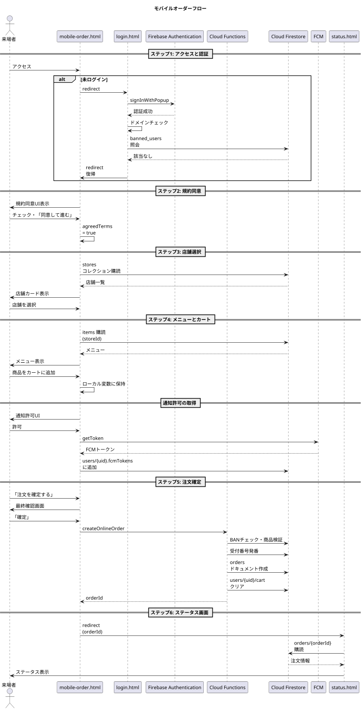
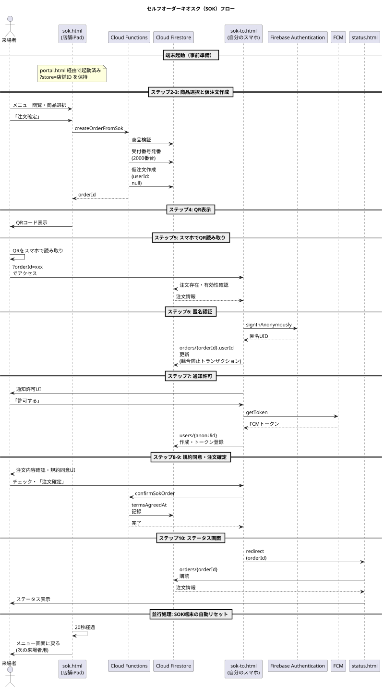
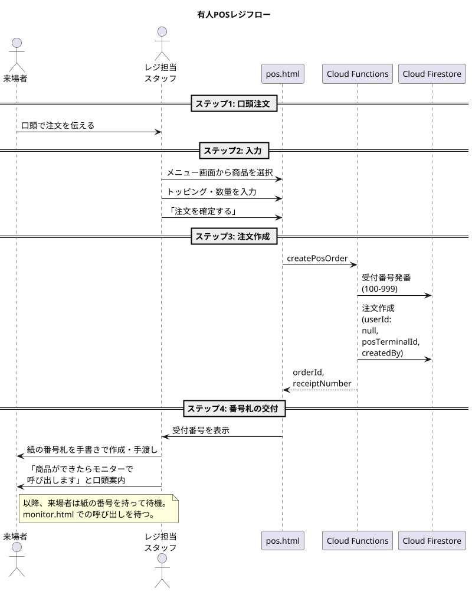

## 第6章 シナリオ別注文フロー

### 6.1 章の目的

本章では、本システムが提供する3つの注文経路、すなわちモバイルオーダー、セルフオーダーキオスク（SOK）、有人POSレジについて、それぞれの注文受付から注文確定までのフローを詳述する。

注文確定後の調理から商品提供までの共通フローは第7章で扱う。本章では、各経路がどのように注文を受け付け、Firestore の `orders` コレクションに `status: cooking` の注文ドキュメントを生成するかを記述することが目的である。

### 6.2 3経路の比較

3つの注文経路の特徴を以下の表で示す。

| 観点                     | モバイルオーダー                            | SOK                         | 有人POS                |
| ------------------------ | ------------------------------------------- | --------------------------- | ---------------------- |
| 第一の柱としての位置づけ | 主たる経路                                  | 補助経路                    | 例外経路               |
| 利用者                   | 在校生                                      | 一般来場者                  | 高齢者・特殊事例       |
| 認証                     | Googleアカウント (`@gl.pen-kanagawa.ed.jp`) | 匿名認証（後から昇格可能）  | スタッフ認証のみ       |
| 操作場所                 | 来場者の自宅・校内任意の場所                | 店舗カウンターのSOK端末     | 店舗カウンター（口頭） |
| 利用デバイス             | 来場者のスマートフォン                      | 店舗設置iPad + 来場者スマホ | スタッフのPOS端末      |
| 受付番号レンジ           | 7000〜7999                                  | 2000〜2999                  | 100〜999               |
| 規約同意                 | あり（店舗選択前）                          | あり（スマホ側）            | なし                   |
| 通知（FCM）              | あり                                        | あり                        | なし                   |
| ステータス確認画面       | `status.html`                               | `status.html`               | なし（紙の番号札のみ） |

### 6.3 モバイルオーダーフロー

#### 6.3.1 目的と利用者

モバイルオーダーは、本システムの第一の柱として位置づけられる注文経路である。来場者は自身のスマートフォンを使い、物理的な行列に並ばずに注文を完了できる。

利用者は `@gl.pen-kanagawa.ed.jp` ドメインのGoogleアカウントを保有する者、すなわち神奈川県立高校の生徒および教員に限定される。これは海外を含む不正アクセスを防ぐためのドメイン制限による。

#### 6.3.2 全体フロー概要

モバイルオーダーは以下のステップで構成される。

1. アクセスと認証
2. 規約同意
3. 店舗選択
4. メニュー閲覧とカート操作
5. 注文確定
6. ステータス画面への遷移

各ステップを以下に詳述する。

#### 6.3.3 ステップ1: アクセスと認証

**起点**  
来場者は校内に掲示されたQRコード、または南陵祭の公式ウェブサイトのリンクから `mobile-order.html` にアクセスする。

**認証状態の判定**  
`mobile-order.html` は起動時に Firebase Authentication の認証状態を確認する。

未ログインの場合、以下のURLパラメータを付与して `login.html` へ自動的にリダイレクトする。

```
login.html?mode=student&redirect=%2Fmain%2Fmobile-order.html
```

ログイン済みでドメイン要件を満たす場合、認証状態をそのまま維持して次のステップに進む。

ログイン済みであるがドメイン要件を満たさない場合（過去に別ドメインでログインした履歴がある場合）、強制的にログアウトを実行し、`login.html` へリダイレクトする。

**`login.html` での処理**  
第3章で詳述した在校生モードの認証フローが実行される。認証成功後、`?redirect=` で指定されたURL（`mobile-order.html`）へ遷移する。

**BANチェック**  
`mobile-order.html` は認証済みユーザーのUIDを使い、`banned_users` コレクションを照会する。該当ドキュメントが存在する場合、画面全体に「このアカウントは利用が制限されています」というメッセージを表示し、それ以降の操作を不能とする。

#### 6.3.4 ステップ2: 規約同意

**同意取得の必要性**  
本システムは放置キャンセルに対するペナルティを実施する設計であり、その実施には事前の同意取得が前提となる。同意取得は店舗選択画面の表示前に行われる。

**同意UI**  
規約同意UIは以下の要素で構成される。

- 規約本文の表示（スクロール可能なエリア）
- 重要部分（特に「呼び出し後15分以内に受け取りに来ない場合、利用停止となる」旨）の強調表示
- 「上記の利用規約に同意します」というチェックボックス
- 「同意して進む」ボタン（チェックボックスがオンになるまで非活性）

**同意の記録**  
来場者がチェックボックスをオンにし、「同意して進む」ボタンを押下した時点で、以下の処理が実行される。

1. ローカル変数 `agreedTerms` を `true` に設定
2. 後続の `createOnlineOrder` 呼び出し時に、注文ドキュメントの `termsAgreedAt` フィールドに同意時刻が記録される

`users/{uid}` ドキュメントへの永続的な同意記録は、本書執筆時点では行わない。各注文ごとに同意を取得する方針とする。

#### 6.3.5 ステップ3: 店舗選択

**店舗一覧の取得**  
規約同意後、画面は店舗選択モードに切り替わる。`stores` コレクションから `isActive: true` の店舗をリアルタイムで取得し、画面に一覧表示する。

**表示内容**  
各店舗カードには以下の情報を表示する。

- 店舗名（`teamName`）
- 出店団体名（`name`）
- 店舗のアイコンまたは代表画像（任意）

**選択操作**  
来場者が店舗カードをタップすると、その店舗のメニュー画面に遷移する。`mobile-order.html` 内のJavaScript状態管理により、ページ遷移なしで画面が切り替わる。

#### 6.3.6 ステップ4: メニュー閲覧とカート操作

**メニュー取得**  
選択された店舗の `storeId` を使用して、`items` コレクションを `where("storeId", "==", storeId)` でクエリする。`displayOrder` 順に整列して画面に表示する。

**販売状態の反映**  
`isAvailable: false` の商品は、グレーアウト表示し「売切」または「販売停止」のラベルを重ねる。タップしてもカートに追加できない。`onSnapshot` でリアルタイム購読しているため、出店団体が `portal.html` から販売停止に切り替えると、即座に来場者の画面に反映される。

**商品詳細とカート追加**  
商品をタップすると、商品詳細画面（モーダルまたはサブページ）が開く。詳細画面では以下の操作が可能である。

- 商品説明と画像の閲覧
- 数量の選択
- トッピングの選択（`allowedToppings` の配列から複数選択）
- カートへの追加

**カート画面**  
画面下部にはカートの状態が常に表示される（合計金額と「カートを見る」ボタン）。カート画面では各商品の数量変更、削除、トッピング修正が可能である。

**カートのローカル保持**  
カート操作中は、すべての変更がブラウザのJavaScript変数およびローカルストレージに保持される。Firestore への書き込みは発生しない。これにより、ブラウジング中のFirestore読み取り回数を削減する。

#### 6.3.7 ステップ5: 注文確定

**最終確認画面**  
カート画面で「注文を確定する」ボタンを押下すると、最終確認画面が表示される。注文内容、合計金額、店舗名、提供口での決済が必要である旨を改めて表示する。

**`createOnlineOrder` の呼び出し**  
来場者が最終確認画面で「確定」を押下すると、Cloud Function `createOnlineOrder` が呼び出される。

呼び出し時のリクエストパラメータ：

```json
{
  "storeId": "store_101",
  "items": [
    {
      "itemId": "item_taiyaki_anko",
      "quantity": 2,
      "customizations": []
    }
  ],
  "termsAgreedAt": "2026-09-12T10:23:15+09:00"
}
```

**Cloud Function 内の処理**  
`createOnlineOrder` は以下の処理を順に実行する。

1. 認証されたユーザーのUIDを取得（クライアントから渡されない、サーバー側で確実に検証）
2. `banned_users` コレクションでBANチェック
3. 各 `itemId` を `items` コレクションで検証し、`isAvailable: true` であることを確認
4. 商品名と価格をマスタからスナップショットとして取得
5. `totalAmount` を計算（クライアントから渡された金額は信用しない）
6. 受付番号を発番（`getNextReceiptNumber("mobile")`）
7. 注文ドキュメントを `orders` コレクションに作成
8. `users/{uid}/cart` サブコレクションをクリア
9. 作成された注文ドキュメントのIDを返却

**作成される注文ドキュメント**

```json
{
  "status": "cooking",
  "orderChannel": "mobile",
  "paymentMethod": "au_pay_manual",
  "storeId": "store_101",
  "userId": "uid_abc123",
  "receiptNumber": 7042,
  "items": [
    {
      "itemId": "item_taiyaki_anko",
      "name": "たい焼き（あんこ）",
      "price": 250,
      "quantity": 2,
      "customizations": []
    }
  ],
  "totalAmount": 500,
  "termsAgreedAt": "2026-09-12T10:23:15+09:00",
  "createdAt": "2026-09-12T10:23:18+09:00",
  "updatedAt": "2026-09-12T10:23:18+09:00",
  "cookingStartedAt": null,
  "readyToServeAt": null,
  "readyForPickupAt": null,
  "completedAt": null,
  "cancelledAt": null,
  "paidAt": null,
  "cancellationReason": null,
  "createdBy": null,
  "posTerminalId": null,
  "note": null
}
```

**エラーハンドリング**  
以下のいずれかの状況では `createOnlineOrder` はエラーを返却する。

- 認証されていない
- BANに該当する
- 商品が販売停止になっている（`isAvailable: false`）
- 受付番号の発番に失敗した（50回試行ルール）

エラー発生時は、来場者の画面に状況に応じたメッセージが表示される。たとえば商品の販売停止が判明した場合は「商品が売り切れになりました。カートをご確認ください」と表示し、カート画面に戻す。

#### 6.3.8 ステップ6: ステータス画面への遷移

注文ドキュメントの作成が成功すると、フロントエンドはレスポンスに含まれる注文IDを使い、`status.html?orderId=...` へ遷移する。来場者は以降、`status.html` でリアルタイムにステータスの変化を確認できる。

#### 6.3.9 通知許可の取得

通知許可（FCM）は、`mobile-order.html` の初回ログイン直後、または `status.html` の初回表示時に要求される。許可が得られた場合、FCMトークンが取得され `users/{uid}` の `fcmTokens` 配列に追加される。許可が得られない場合は、`status.html` 上での目視確認のみで通知を受け取る運用となる。

#### 6.3.10 シーケンス図

モバイルオーダーフローのシーケンス図を以下に示す。



### 6.4 セルフオーダーキオスク（SOK）フロー

#### 6.4.1 目的と利用者

SOKは本システムの第二の柱として位置づけられる注文経路である。利用者は `@gl.pen-kanagawa.ed.jp` ドメインを保有しない一般来場者（外部の方）である。

ドメイン制限により海外からの不正アクセスを排除する設計上、外部の来場者は本来モバイルオーダーを利用できない。しかし、文化祭という性質上、外部の来場者にも注文の利便性を提供する必要がある。SOKは「物理的に校内のSOK端末を操作できる」という条件を満たす者のみが利用できる注文経路として設計されており、これにより「現地にいる人」だけにアクセスを限定する。

#### 6.4.2 全体フロー概要

SOKフローは以下の二つの段階で構成される。

**段階A: SOK端末上での操作**

1. 端末の起動と店舗紐付け
2. メニュー閲覧と商品選択
3. 注文確定（仮注文の作成）
4. QRコード表示

**段階B: 来場者のスマートフォン上での操作** 5. QRコード読み取りと `sok-to.html` のオープン 6. 匿名認証 7. 通知許可 8. 注文内容確認と規約同意 9. 注文確定（仮注文の本注文化）10. ステータス画面への遷移

各ステップを以下に詳述する。

#### 6.4.3 ステップ1: 端末の起動と店舗紐付け

**起動主体**  
店舗責任者が朝の営業開始時に、自店舗のiPadでSOKを起動する。

**起動手順**

1. iPadのブラウザで `portal.html` にアクセス
2. Googleアカウントで認証し、店舗パスワードを入力
3. 「SOK端末として起動」ボタンを押下
4. 自動的に新しいタブで `sok.html?store=店舗ID` が開かれる
5. ブラウザを全画面表示モードに切り替え

`?store=` パラメータにより、その端末は当日、特定の店舗のSOKとして固定される。複数台設置する場合、すべての端末で同じパラメータが使用される。

#### 6.4.4 ステップ2: メニュー閲覧と商品選択

**メニュー表示**  
`sok.html` は起動時に `?store=` パラメータから店舗IDを取得し、`items` コレクションを購読する。タッチ操作に最適化された大きなボタン形式でメニューを表示する。

**操作インターフェース**  
SOK端末は来場者が立ったまま操作するため、以下の設計指針を採用する。

- 大きなボタンと余白
- 最小限のスクロール（1画面に収まるメニュー数を想定）
- カート操作はその場で確認できる位置に配置
- 戻る・キャンセルボタンを目立つ位置に配置

**カート操作**  
モバイルオーダーと同様に、商品の追加、数量変更、削除、トッピング選択が可能である。カート内容はSOK端末のJavaScript変数に保持される。

#### 6.4.5 ステップ3: 注文確定（仮注文の作成）

**「注文確定」ボタン**  
来場者がカート画面で「注文確定」ボタンを押下すると、Cloud Function `createOrderFromSok` が呼び出される。

**Cloud Function 内の処理**

1. リクエストの検証（店舗ID、商品ID、数量など）
2. 各 `itemId` の販売可否を確認
3. 受付番号を発番（`getNextReceiptNumber("sok")`）
4. 仮注文ドキュメントを `orders` コレクションに作成
5. 注文ドキュメントのIDを返却

**作成される仮注文ドキュメント**

```json
{
  "status": "cooking",
  "orderChannel": "sok",
  "paymentMethod": "au_pay_manual",
  "storeId": "store_101",
  "userId": null,
  "receiptNumber": 2018,
  "items": [...],
  "totalAmount": 750,
  "termsAgreedAt": null,
  "createdAt": "2026-09-12T11:05:30+09:00",
  "updatedAt": "2026-09-12T11:05:30+09:00",
  "cookingStartedAt": null,
  "readyToServeAt": null,
  "readyForPickupAt": null,
  "completedAt": null,
  "cancelledAt": null,
  "paidAt": null,
  "cancellationReason": null,
  "createdBy": null,
  "posTerminalId": null,
  "note": null
}
```

`userId` は `null` で作成される。これは本注文化（`sok-to.html` での確定）時に、来場者の匿名UIDが書き込まれるまでの暫定状態である。

**status の扱い**  
仮注文の段階で status は `cooking` で作成される。ただし、この段階ではまだ `userId` が確定していないため、厨房側に表示してよいか否かは設計判断が必要である。

本書では以下の方針を採用する：仮注文は `userId: null` の状態で `cooking` ステータスのため `kitchen.html` に表示される可能性があるが、`kitchen.html` 側のクエリ条件で `userId != null` をフィルタとして加え、本注文化されるまで厨房に表示されないようにする。

※このフィルタの実装方針は本書執筆時点で未確定であり、別の実装手段（例: 仮注文用の別ステータス値の導入）を採用する可能性がある。

#### 6.4.6 ステップ4: QRコード表示

**QRコードの内容**  
仮注文ドキュメントのIDを使い、以下のURLを生成する。

```
https://ynr-cs.github.io/nanryosai-2026/main/sok-to.html?orderId=xxxxxxxx
```

このURLをQRコード描画ライブラリで生成し、画面に大きく表示する。

**画面表示**  
QR表示画面には以下の要素を含める。

- QRコード（中央に大きく表示）
- 受付番号
- 案内文：「QRコードをご自身のスマートフォンで読み取ってください」
- 重要な注意：「最初に読み取った方が、注文者として確定します」
- 「次の人へ」ボタン

**有効期限**  
仮注文の有効期限は作成から15分間である。15分以内に来場者がQRを読み取り、`sok-to.html` で注文確定を完了しなかった場合、仮注文は自動的にキャンセルされる。

**自動リセット**  
QR表示から20秒経過すると、SOK端末は自動的にメニュー画面に戻る。これは「次の来場者がすぐに利用できるように」する目的である。20秒待たずに「次の人へ」ボタンで明示的にリセットすることもできる。

#### 6.4.7 ステップ5: QRコード読み取りと `sok-to.html` のオープン

**読み取り操作**  
来場者は自身のスマートフォンのカメラまたはQR読み取りアプリでQRコードをスキャンする。スマートフォンのブラウザで `sok-to.html?orderId=xxxxxxxx` が開かれる。

**初期化処理**  
`sok-to.html` は起動時に以下の処理を実行する。

1. `?orderId=` パラメータから注文IDを取得
2. Firestore から該当注文ドキュメントを取得
3. 注文の存在と有効性を確認
   - 存在しない場合：エラー画面「注文が見つかりません」
   - すでに `userId` が紐付いている場合：エラー画面「この注文はすでに確定されています」
   - 作成から15分超過：エラー画面「有効期限が切れています」

#### 6.4.8 ステップ6: 匿名認証

**匿名認証の実行**  
注文の有効性確認後、`signInAnonymously` を呼び出して匿名認証を実行する。

**UIDの紐付け**  
発行された匿名UIDを使い、注文ドキュメントの `userId` フィールドを更新する。この時点で、その注文の正規所有者がこの匿名UIDのユーザーとして確定する。

```json
{
  "userId": "anon_xyz789",
  ...
}
```

**競合防止**  
複数の来場者が同じQRを同時に読み取った場合、最初に `userId` を更新したリクエストのみが成功する。Firestore のトランザクションまたは `runTransaction` を使い、`userId == null` であることを条件に更新を行う。

```javascript
await firestore.runTransaction(async (tx) => {
  const order = await tx.get(orderRef);
  if (order.data().userId !== null) {
    throw new Error("この注文はすでに確定されています");
  }
  tx.update(orderRef, {
    userId: anonUid,
    updatedAt: serverTimestamp(),
  });
});
```

#### 6.4.9 ステップ7: 通知許可

**通知許可UI**  
匿名認証成功後、Push通知の許可を要求する。

「商品の準備ができたらお知らせします。通知を許可してください」というメッセージとともに、「許可する」「あとで」のボタンを表示する。

**FCMトークンの登録**  
来場者が許可した場合、FCMトークンを取得し、`users/{anonUid}` ドキュメントの `fcmTokens` 配列に追加する。匿名ユーザー用の `users` ドキュメントが存在しない場合、新規に作成する。

```json
users/anon_xyz789
{
  "email": null,
  "displayName": null,
  "isAnonymous": true,
  "notificationEnabled": true,
  "fcmTokens": ["fcm_token_string_here"],
  "termsAgreedAt": null,
  "favoriteItemIds": [],
  "createdAt": "2026-09-12T11:08:42+09:00",
  "lastLoginAt": "2026-09-12T11:08:42+09:00"
}
```

#### 6.4.10 ステップ8: 注文内容確認と規約同意

**最終確認画面**  
通知許可の処理後、注文内容の最終確認画面を表示する。

表示内容：

- 注文した商品の一覧
- 各商品の価格と数量
- 合計金額
- 受付番号
- 重要な利用規約（特に呼び出し後15分以内の受け取り義務）の強調表示

**規約同意**  
画面下部に以下の要素を配置する。

- 「上記の利用規約に同意し、注文を確定します」というチェックボックス
- 「○○○円の注文を確定する」ボタン（チェックボックスがオンになるまで非活性）

#### 6.4.11 ステップ9: 注文確定（本注文化）

**確定操作**  
来場者がチェックボックスをオンにし、「注文を確定する」ボタンを押下すると、Cloud Function `confirmSokOrder`（仮称）が呼び出される。

**Cloud Function 内の処理**

1. 認証されたユーザー（匿名UID）を取得
2. 注文ドキュメントの `userId` が認証ユーザーのUIDと一致することを確認
3. `termsAgreedAt` フィールドにタイムスタンプを記録
4. status は `cooking` を維持（仮注文時にすでに `cooking` で作成されているため）

この時点で、注文は完全に確定し、厨房側で調理可能な状態となる。

#### 6.4.12 ステップ10: ステータス画面への遷移

注文確定後、`sok-to.html` は `status.html?orderId=...` へ遷移する。来場者は以降、`status.html` でリアルタイムにステータスの変化を確認できる。

#### 6.4.13 シーケンス図

SOKフローのシーケンス図を以下に示す。



### 6.5 有人POSレジフロー

#### 6.5.1 目的と利用者

有人POSは本システムにおける例外的な経路である。以下のいずれかに該当する場合に利用される。

- スマートフォンを所持していない来場者（高齢者など）
- スマートフォンを使用できない状況の来場者
- 複雑な注文（特殊な要望を含む注文）でスタッフの介入が必要な場合
- モバイルオーダーやSOKでトラブルが発生した場合の代替経路

#### 6.5.2 全体フロー概要

1. 来場者の口頭注文
2. レジ担当スタッフによる入力
3. 注文ドキュメントの作成
4. 紙の番号札の交付

各ステップを以下に詳述する。

#### 6.5.3 ステップ1: 来場者の口頭注文

来場者は店舗カウンターに並び、レジ担当スタッフに口頭で注文を伝える。スタッフは必要に応じて来場者にメニューを示し、希望商品とトッピングを確認する。

#### 6.5.4 ステップ2: レジ担当スタッフによる入力

**`pos.html` の起動**  
レジ担当スタッフはあらかじめ `portal.html` から認証を済ませ、`pos.html` を開いた状態で待機している。

**端末IDの保持**  
`pos.html` はローカルストレージに端末ID（例: `pos_terminal_a`）を保持している。この端末IDは初期セットアップ時に設定され、当日は変更されない。

**注文入力**  
スタッフは画面上のメニュー一覧から、来場者の注文を再現する。

- 商品ボタンをタップしてカートに追加
- 数量を増減
- トッピングを選択
- 必要に応じてメモを記入

**注文確定**  
内容を確認後、「注文を確定する」ボタンを押下する。

#### 6.5.5 ステップ3: 注文ドキュメントの作成

**`createPosOrder` の呼び出し**  
スタッフが「注文を確定する」を押下すると、Cloud Function `createPosOrder` が呼び出される。

**Cloud Function 内の処理**

1. スタッフのUID（`createdBy`）を取得
2. リクエストパラメータの検証
3. 各 `itemId` の販売可否を確認
4. 受付番号を発番（`getNextReceiptNumber("pos")`）
5. 注文ドキュメントを作成
6. 注文IDと受付番号を返却

**作成される注文ドキュメント**

```json
{
  "status": "cooking",
  "orderChannel": "pos",
  "paymentMethod": "au_pay_manual",
  "storeId": "store_101",
  "userId": null,
  "receiptNumber": 142,
  "items": [...],
  "totalAmount": 600,
  "termsAgreedAt": null,
  "createdAt": "2026-09-12T11:32:15+09:00",
  "updatedAt": "2026-09-12T11:32:15+09:00",
  "cookingStartedAt": null,
  "readyToServeAt": null,
  "readyForPickupAt": null,
  "completedAt": null,
  "cancelledAt": null,
  "paidAt": null,
  "cancellationReason": null,
  "createdBy": "uid_staff_001",
  "posTerminalId": "pos_terminal_a",
  "note": null
}
```

POS注文では `userId` は `null` のまま維持される。POS注文の来場者は本システム上のアカウントを持たず、紙の番号札のみで識別されるためである。

`termsAgreedAt` も `null` である。POS注文では規約同意UIを設置しない（第3章6節参照）。

#### 6.5.6 ステップ4: 紙の番号札の交付

**画面表示**  
注文確定後、`pos.html` には大きく受付番号が表示される。

**紙の交付**  
スタッフは紙片に受付番号を書き、来場者に手渡す。来場者には以下の趣旨を口頭で伝える。

「番号札をお持ちください。商品ができましたら、こちらの呼び出しモニターに番号が表示されますので、お受け取りにお越しください。」

**紙の準備**  
当日、各店舗には番号札用の小さな紙片を準備する。手書きまたは事前印刷した連番紙を使用する。手書きの場合、スタッフが受付番号を画面で確認しながら記入する。

#### 6.5.7 規約同意を取得しない理由

POS注文では規約同意UIを設置しないが、その背景は以下の通りである。

**実施が困難**  
高齢者がチェックボックスを操作する、規約を読み込む、というUI操作は現実的でない。レジ担当スタッフが来場者の代わりに同意操作を行うことは、同意の主体を曖昧にし、規約の有効性を損なう。

**ペナルティ実行が不可能**  
POS注文は `userId: null` であり、来場者は本システム上で個人を特定されない。仮に放置キャンセルが発生しても、その来場者を後から識別してBANに登録する手段がない。したがって、規約同意を取得しても実質的な意味を持たない。

**現場での口頭案内で代替**  
レジ担当スタッフは紙の番号札を渡す際、口頭で「商品ができたら呼び出しますので、必ず受け取りに来てください」と伝える。これは形式的な同意ではないが、現場での合意形成として機能する。

#### 6.5.8 シーケンス図

有人POSフローのシーケンス図を以下に示す。



### 6.6 3経路の比較まとめ

3つの注文経路における処理の差分を以下に整理する。

| 項目                  | モバイルオーダー                 | SOK                                      | 有人POS                  |
| --------------------- | -------------------------------- | ---------------------------------------- | ------------------------ |
| 認証方式              | Googleアカウント（学校ドメイン） | 匿名認証                                 | スタッフ認証のみ         |
| `userId` の値         | 学校アカウントUID                | 匿名UID                                  | `null`                   |
| 規約同意              | あり (`termsAgreedAt` 記録)      | あり (`termsAgreedAt` 記録)              | なし (`null`)            |
| 受付番号              | 7000番台                         | 2000番台                                 | 100〜999                 |
| 注文作成関数          | `createOnlineOrder`              | `createOrderFromSok` + `confirmSokOrder` | `createPosOrder`         |
| `createdBy` の値      | `null`                           | `null`                                   | スタッフUID              |
| `posTerminalId` の値  | `null`                           | `null`                                   | 端末ID                   |
| 通知（FCM）           | あり                             | あり                                     | なし                     |
| ステータス画面        | `status.html`                    | `status.html`                            | なし（モニターと紙のみ） |
| 規約違反時のBAN対象性 | あり                             | あり                                     | なし（個人特定不可）     |

### 6.7 まとめ

本章では、3つの注文経路の詳細フローを記述した。モバイルオーダーは在校生向けの主要経路として、SOKは外部来場者向けの現地限定経路として、有人POSはスマートフォン非保持者向けの例外経路として、それぞれの役割を明確に分担する。

すべての経路は最終的に Firestore の `orders` コレクションに `status: cooking` の注文ドキュメントを作成する。ここから先は経路を問わず共通のフローで処理される。次章では、その共通フロー（調理から提供まで）を詳述する。

---
