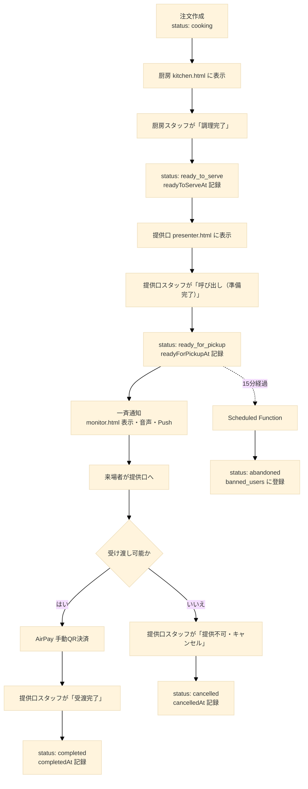
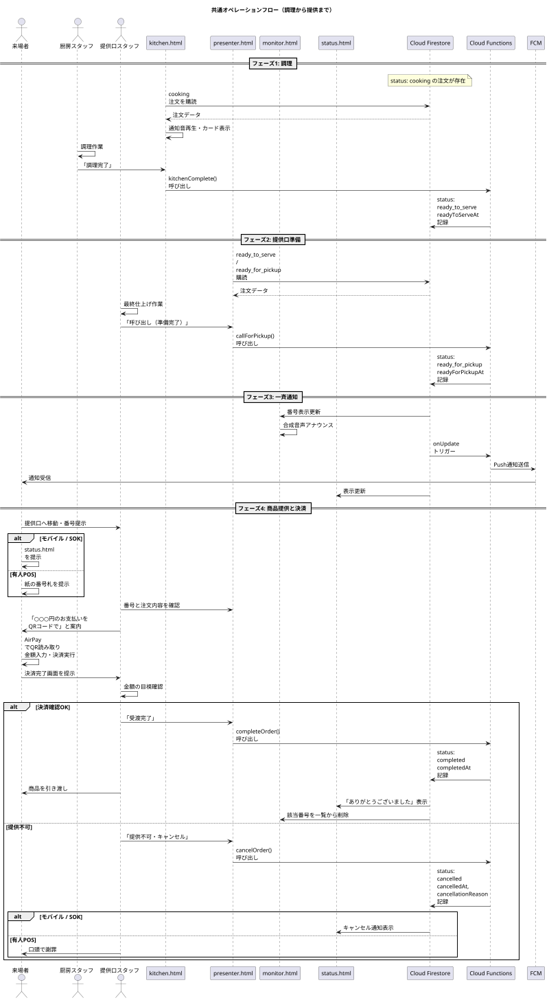

## 第7章 共通オペレーションフロー

### 7.1 章の目的

本章では、注文経路（モバイルオーダー、SOK、有人POS）を問わず、注文ドキュメントが `orders` コレクションに `status: cooking` で作成された後、商品が来場者に提供されて注文が完了するまでの共通フローを記述する。

このフローは厨房スタッフ、提供口スタッフ、来場者の三者の協調動作によって進行する。各ステータス遷移のトリガー、関連画面の表示更新、Push通知の発火タイミングを以下に詳述する。

### 7.2 全体フロー概観

注文ドキュメントが作成されてから完了するまでの大まかな流れを以下に示す。



このフローは注文経路によらず共通である。経路の違いは `orderChannel` フィールドにのみ反映され、ステータス遷移や処理内容には影響しない。

### 7.3 フェーズ1: 調理（厨房オペレーション）

#### 7.3.1 厨房画面 (`kitchen.html`) の常時購読

**購読クエリ**  
`kitchen.html` は起動時から常に、Firestore の `orders` コレクションに対して以下の条件でリアルタイム購読を開始する。

```javascript
firestore
  .collection("orders")
  .where("storeId", "==", currentStoreId)
  .where("status", "==", "cooking")
  .where("userId", "!=", null) // 仮注文を除外
  .orderBy("createdAt", "asc");
```

`storeId` フィルタにより、その厨房に関係する店舗の注文のみが表示される。`status` フィルタにより、`cooking`（調理中）の注文が表示対象となる。`userId != null` フィルタは、SOKフローで仮注文（`userId: null` で作成された未確定状態）を除外するためのものである。

※`userId != null` フィルタの実装方針は本書執筆時点で未確定であり、別の方法（例: 仮注文用の中間ステータス値の導入）が採用される可能性がある。

#### 7.3.2 新規注文の受信と通知

**画面への追加表示**  
新たな `cooking` 注文が `onSnapshot` を通じて受信されると、画面の注文一覧の末尾に新しいカードが追加表示される。

**通知音の再生**  
新規注文の受信タイミングで、厨房に通知音を再生する。これは厨房スタッフが画面を常に注視していなくても、新規注文の発生を聴覚で認識できるようにする目的である。

**経路の視覚的識別**  
注文カードには `orderChannel` フィールドに応じたアイコンまたは色を表示する。

| `orderChannel` | 視覚的表現                   |
| -------------- | ---------------------------- |
| `mobile`       | スマートフォンアイコン、青色 |
| `sok`          | キオスク端末アイコン、緑色   |
| `pos`          | レジアイコン、橙色           |

これにより、厨房スタッフは注文の発生源を一目で把握できる。

#### 7.3.3 注文カードの表示内容

各注文カードには以下の情報を表示する。

- 受付番号（最も大きく表示）
- 注文経路アイコン
- 商品リスト（商品名、数量、トッピング）
- 注文受付からの経過時間
- 「調理完了」ボタン

経過時間の表示は、注文が長時間放置されないよう、厨房スタッフへの注意喚起の役割を果たす。

#### 7.3.4 「調理完了」操作

**操作主体**  
厨房スタッフが、調理が完了した注文に対して「調理完了」ボタンを押下する。

**処理内容**  
`kitchenComplete` Cloud Function を呼び出し、対象の注文ドキュメントを更新する。クライアントからの直接更新は行わない。

```javascript
const kitchenComplete = firebase.functions().httpsCallable("kitchenComplete");
await kitchenComplete({ orderId: currentOrderId });
```

**画面表示の変化**  
`status: "ready_to_serve"` は `kitchen.html` の購読クエリの対象外となるため、注文カードは画面から消える。同時に、`presenter.html` の購読クエリには `ready_to_serve` が含まれているため、注文カードが提供口画面に出現する。

#### 7.3.6 厨房オペレーションの設計上の考慮点

**画面の見やすさ**  
厨房環境（手が濡れる、油汚れがある）を考慮し、画面はタッチしやすく、誤操作しにくい大きなボタン設計とする。

**操作の取り消し**  
誤って「調理完了」を押した場合の取り消し機能は、本書執筆時点では明示的に設計しない。誤操作が判明した場合、提供口スタッフ側で適切に処理する（例: `ready_to_serve` になってしまったが実は調理が未完了の場合、提供口スタッフに口頭で伝え、調理完了まで `presenter.html` 側で「呼び出し（準備完了）」を押さない運用とする）。

### 7.4 フェーズ2: 提供口準備

#### 7.4.1 提供口画面 (`presenter.html`) の常時購読

**購読クエリ**  
`presenter.html` は起動時から以下の条件でリアルタイム購読を開始する。

```javascript
firestore
  .collection("orders")
  .where("storeId", "==", currentStoreId)
  .where("status", "in", ["ready_to_serve", "ready_for_pickup"])
  .orderBy("readyToServeAt", "asc");
```

`ready_to_serve`（提供口準備中）と `ready_for_pickup`（呼び出し中）の両方を対象とすることで、提供口スタッフは「これから準備する注文」と「呼び出し中で受け渡し待ちの注文」の両方を把握できる。

#### 7.4.2 注文カードの表示内容

各注文カードには以下の情報を表示する。

- 受付番号（最も大きく表示）
- 注文経路アイコン
- 商品リスト（商品名、数量、トッピング）
- 合計金額（決済時の目視確認用）
- 現在のステータス（`ready_to_serve` または `ready_for_pickup`）
- 状態に応じたボタン

ステータスごとのボタン表示は以下の通りである。

| ステータス         | 表示するボタン                             |
| ------------------ | ------------------------------------------ |
| `ready_to_serve`   | 「呼び出し（準備完了）」、「提供不可・キャンセル」 |
| `ready_for_pickup` | 「受渡完了」、「提供不可・キャンセル」     |

#### 7.4.3 提供口スタッフの作業内容

**最終準備**  
提供口スタッフは `ready_to_serve` の注文に対して、商品の最終的な仕上げ作業を行う。具体的には以下のような作業である。

- 商品をトレイに盛り付ける
- スプーン、フォーク、紙ナプキンなどの付属品を添える
- 包装または袋詰め
- 注文内容（特にトッピング）を最終確認

**「呼び出し（準備完了）」操作**  
最終準備が完了したら、対応する注文の「呼び出し（準備完了）」ボタンを押下する。

**処理内容**  
`callForPickup` Cloud Function を呼び出し、対象の注文ドキュメントを更新する。

```javascript
const callForPickup = firebase.functions().httpsCallable("callForPickup");
await callForPickup({ orderId: currentOrderId });
```

`readyForPickupAt` は放置ペナルティの判定基準となる重要なフィールドである。この時刻を起点として15分が経過すると、Scheduled Function による自動キャンセルの対象となる。

### 7.5 フェーズ3: 一斉通知

#### 7.5.1 通知のトリガー

注文ドキュメントの status が `ready_for_pickup` に更新されたことをトリガーに、複数の通知が一斉に発火する。これらの通知はそれぞれ異なる仕組みで実装される。

#### 7.5.2 `monitor.html` への番号表示

**表示の更新**  
`monitor.html` は以下の条件でリアルタイム購読を行っている。

```javascript
firestore
  .collection("orders")
  .where("status", "==", "ready_for_pickup")
  .orderBy("readyForPickupAt", "asc");
```

新たに `ready_for_pickup` 状態となった注文の受付番号が、画面に大きく追加表示される。

**表示形式**  
画面には呼び出し中の番号が一覧で表示される。最新の番号は強調表示（点滅または色変化）し、来場者の注意を引く。

```
==========================================
       お呼び出し中
==========================================

      7042    2018    142

==========================================
   番号でお呼びします
   提供口へお越しください
==========================================
```

**店舗別表示**  
複数店舗が同じ `monitor.html` を共有する場合、店舗ごとに区切って番号を表示する。各店舗が個別に `monitor.html` を運用する場合は、`?store=` パラメータでフィルタリングし、自店舗の番号のみ表示する。

#### 7.5.3 合成音声によるアナウンス

**Speech Synthesis API**  
`monitor.html` は新規番号の追加を検出すると、ブラウザの Speech Synthesis API を使い、音声でアナウンスを行う。

**アナウンス文言**

```
「[番号]番のお客様、お受け取りください」
```

例：「7042番のお客様、お受け取りください」

**音声設定**

- 言語: 日本語（`ja-JP`）
- 音量: 最大付近（環境音に負けない程度）
- 話速: やや遅め（聞き取りやすさを優先）

**複数番号の連続アナウンス**  
複数の番号がほぼ同時に呼び出された場合、順次アナウンスを行う。アナウンスのキューイングを実装し、前のアナウンスが終わってから次のアナウンスが開始されるようにする。

#### 7.5.4 来場者スマートフォンへのPush通知

**FCM Push通知の発火**  
注文ドキュメントの status が `ready_for_pickup` に更新されたことをトリガーに、Cloud Functions のトリガー関数 `sendOrderUpdateNotification` が起動する。

**通知の送信処理**  
トリガー関数（`sendOrderUpdateNotification`）は以下の処理を実行する。

1. 注文ドキュメントから `userId` を取得
2. `userId` が `null` の場合（POS注文）はPush通知をスキップ
3. `userId` を使い `users/{userId}` ドキュメントから `fcmToken` （単一の文字列）を取得
4. FCMトークンが存在する場合、以下の通知ペイロードを送信

```json
{
  "notification": {
    "title": "ご注文の準備ができました！",
    "body": "受付番号 7042 のお客様、提供口でお受け取りください。"
  },
  "data": {
    "orderId": "xxxxxxxx",
    "click_action": "https://ynr-cs.github.io/nanryosai-2026/main/status.html?orderId=xxxxxxxx"
  }
}
```

**通知タップ時の挙動**  
Push通知をタップすると、来場者のブラウザで `status.html?orderId=...` が開かれる。来場者は通知をタップして直接ステータス画面に遷移できる。

**通知不許可ユーザーへの対応**  
`users/{userId}.notificationEnabled` が `false`、または `fcmToken` が `null` の場合、Push通知は送信されない。これらの来場者は `status.html` をブラウザで開いたまま待機することで、ステータスの変化をリアルタイムに認識する。

#### 7.5.5 `status.html` の表示更新

**リアルタイム更新**  
来場者の `status.html` は対象注文を `onSnapshot` で購読しているため、status の変化が即座に画面に反映される。

**`ready_for_pickup` 時の表示**  
画面の表示は以下のように切り替わる。

- 背景色を強調色（例: 黄色や緑）に変更
- 大きな文字で「商品の準備ができました！」と表示
- 受付番号を画面いっぱいに表示
- 「提供口へお越しください。15分以内にお受け取りください」と案内
- 「提供口で AirPay のQRコードを読み取って決済してください」と決済方法を案内

**バイブレーション（対応端末のみ）**  
ブラウザの Vibration API に対応する端末では、`ready_for_pickup` への遷移時に短いバイブレーションを発火する。これは Push通知と並行して、視覚的・聴覚的に呼び出しを認識できるようにする補助手段である。

### 7.6 フェーズ4: 商品提供と決済

#### 7.6.1 来場者の提供口への移動

通知（モニター表示、音声、Push、`status.html` 更新）を認識した来場者は、提供口へ移動する。

**経路ごとの番号提示方法**

| 経路             | 番号の提示方法                                            |
| ---------------- | --------------------------------------------------------- |
| モバイルオーダー | 来場者がスマートフォンで `status.html` を開き、画面を提示 |
| SOK              | 来場者がスマートフォンで `status.html` を開き、画面を提示 |
| 有人POS          | 来場者が手書きの紙の番号札を提示                          |

#### 7.6.2 提供口スタッフの確認作業

**番号の確認**  
提供口スタッフは、来場者から提示された番号と、`presenter.html` 上の `ready_for_pickup` の注文番号を照合する。

**注文内容の確認**  
スタッフは `presenter.html` 上で該当注文の商品リストを確認し、用意した商品が注文内容と一致することを最終確認する。

#### 7.6.3 AirPay 手動QR決済

**QRコードの読み取り**  
スタッフは「あちらのQRコードを読み取って、お支払いをお願いします」と来場者に案内する。各店舗のカウンターには AirPay の店舗QRコードが大きく掲示されている。

**金額の入力**  
来場者は自身のスマートフォンで AirPay アプリを起動し、QRコードを読み取る。表示された支払いフォームに金額を手入力する。スタッフは「○○○円のお支払いをお願いします」と金額を口頭で伝える。

**決済の実行**  
来場者は AirPay アプリ上で支払いを実行する。決済完了後、アプリには決済完了画面が表示される。

**決済完了画面の提示**  
来場者は決済完了画面をスタッフに見せる。スタッフは以下を目視で確認する。

- 決済が完了している旨の表示
- 決済金額が `presenter.html` 上の合計金額と一致すること
- 決済日時が直近であること（過去の決済画面を流用していないこと）

#### 7.6.4 「受渡完了」操作

**操作主体**  
提供口スタッフが、決済完了画面を確認した後、`presenter.html` 上で「受渡完了」ボタンを押下する。

**処理内容**  
`completeOrder` Cloud Function を呼び出し、対象の注文ドキュメントを更新する。クライアントからの直接更新は行わない。

```javascript
const completeOrder = firebase.functions().httpsCallable("completeOrder");
await completeOrder({ orderId: currentOrderId });
```

**商品の引き渡し**  
スタッフは商品を来場者に引き渡し、「ありがとうございました」と声をかける。

**画面表示の変化**

- `presenter.html`: 該当注文カードが画面から消える
- `monitor.html`: 該当番号が呼び出し一覧から消える
- `status.html`: 「ありがとうございました」の表示に切り替わる
- 来場者の `users/{uid}` ドキュメントの注文履歴に追加される（`account.html` の注文履歴で参照可能）

#### 7.6.5 提供口オペレーションの設計上の考慮点

**スタッフの目視確認の重要性**  
AirPay 手動QR決済方式は、来場者が金額を手入力するため、誤入力（または意図的な改ざん）の可能性が原理的に存在する。スタッフによる目視確認が、本システムにおける唯一の金額検証手段である。

混雑時にはこの確認が形骸化するリスクがあるため、スタッフトレーニングにおいて「必ず金額を確認してから完了ボタンを押す」ことを徹底する。

**完了ボタンの押し忘れリスク**  
スタッフが商品を渡した後に「受渡完了」ボタンを押し忘れると、注文は `ready_for_pickup` のまま残り続ける。受付番号が解放されず、放置ペナルティの誤発動の原因となる。

これを防ぐため、`presenter.html` の運用では「商品を渡す前に完了ボタンを押す」または「商品を渡した直後にすぐ押す」というルールを徹底する。

### 7.7 フェーズ5: 提供不可・キャンセル

#### 7.7.1 キャンセルが発生する場面

提供不可によるキャンセルは、以下のような場面で発生する。

- 商品の品質に問題があった場合（落下、汚損など）
- 来場者から注文取消の依頼があった場合（決済前であれば）
- スタッフのミスにより重複した注文を作成した場合
- その他、何らかの理由で商品を提供できないと判明した場合

#### 7.7.2 「提供不可・キャンセル」操作

**操作主体**  
提供口スタッフ（または厨房スタッフ）が、`presenter.html` または `kitchen.html` で「提供不可・キャンセル」ボタンを押下する。

**確認ダイアログ**  
誤操作を防ぐため、「この注文をキャンセルしてよろしいですか？」という確認ダイアログを表示する。スタッフが「はい」を選択した場合のみ、キャンセル処理を実行する。

**理由の入力（任意）**  
キャンセル理由を選択するUIを表示する。

- 「商品が提供できない」
- 「お客様都合」
- 「重複注文」
- 「その他（自由入力）」

**処理内容**  
`cancelOrder` Cloud Function を呼び出し、対象の注文ドキュメントを更新する。クライアントからの直接更新は行わない。

```javascript
const cancelOrder = firebase.functions().httpsCallable("cancelOrder");
await cancelOrder({ orderId: currentOrderId, reason: "商品が提供できない" });
```

#### 7.7.3 経路別の対応

**モバイルオーダー / SOK の場合**  
来場者の `status.html` には以下の趣旨のメッセージが表示される。

```
申し訳ございません。本注文は店舗都合によりキャンセルされました。
お支払いは発生しておりませんので、ご安心ください。
```

決済は提供時に行われる方式のため、キャンセルされた注文は決済そのものが発生していない。来場者に金銭的な負担は生じない。

**有人POSの場合**  
来場者は紙の番号札のみで識別される。`status.html` を見ていないため、自分の注文がキャンセルされたことをシステム経由で知ることができない。

このため、有人POS注文のキャンセル時は、提供口スタッフが直接来場者に口頭で謝罪し、状況を説明する運用とする。

```
「申し訳ございません。○○番でご注文の[商品名]ですが、[理由]のため、
本日のご提供ができなくなってしまいました。誠に申し訳ございません。」
```

`monitor.html` 上では、キャンセルされた番号は呼び出し一覧から削除される。同時に「○○番のご注文はキャンセルとなりました」という一時的な案内表示を、画面の隅に短時間表示する設計を採用する余地がある（実装は本書執筆時点で未確定）。

### 7.8 共通フローのシーケンス図

ここまでの共通フローを統合したシーケンス図を以下に示す。



### 7.9 ステータス遷移と各画面の関係

各ステータスにおいて、各画面がどのように動作するかをまとめる。

| ステータス         | `kitchen.html` | `presenter.html`   | `monitor.html` | `status.html`                    |
| ------------------ | -------------- | ------------------ | -------------- | -------------------------------- |
| `cooking`          | 表示・通知音   | 非表示             | 非表示         | 「注文を受け付けました（調理中）」 |
| `ready_to_serve`   | 非表示         | 「準備中」表示     | 非表示         | 「もうすぐ完成します」           |
| `ready_for_pickup` | 非表示         | 「呼び出し中」表示 | 番号表示・音声 | 強調表示・「提供口へ」           |
| `completed`        | 非表示         | 非表示             | 非表示         | 「ありがとうございました」       |
| `cancelled`        | 非表示         | 非表示             | 非表示         | 「キャンセルされました」         |
| `abandoned`        | 非表示         | 非表示             | 非表示         | 「期限切れにより放棄されました」 |

### 7.10 並列性と競合の考慮

#### 7.10.1 複数注文の並列処理

文化祭のピーク時には、各店舗で同時に複数の注文が並行して処理される。本システムは Firestore のリアルタイム同期と楽観的並行性制御により、複数注文の並列処理を自然にサポートする。

各注文は独立したドキュメントとして扱われ、ステータス遷移は注文ごとに独立して進行する。厨房スタッフが注文Aを `cooking` にしている間に、別のスタッフが注文Bを `cooking` にすることに何ら問題はない。

#### 7.10.2 同時操作の競合

ごく稀に、二人のスタッフが同じ注文の同じボタンを同時に押す状況が発生し得る。例えば、二人の提供口スタッフが同じ注文の「QR決済完了」を同時に押した場合である。

この場合、両者の更新リクエストは Firestore に対して並列に発行されるが、最終的な状態は「`completed` に遷移した」という同じ結果に収束する。`completedAt` のタイムスタンプはサーバ側で計算されるため、いずれか一方の値で上書きされる。実用上、この競合は問題とならない。

#### 7.10.3 異常な遷移の防止

本システムでは、すべてのステータス遷移はCloud Functions（`kitchenComplete`、`callForPickup`など）を経由して行われる設計である。そのため、意図しないステータス遷移（例: `completed` から `cooking` に戻る、`cancelled` から `ready_for_pickup` に戻るなど）を防ぐための妥当性検証（バリデーション）は、Cloud Functions内のロジックで実装される。

クライアント（フロントエンド）からの `orders` コレクションへの直接更新は、Firestoreセキュリティルールによって全面的に禁止（`allow update: if false;`）されるため、悪意のある直接書き込みによる不正なステータス遷移は原理的に発生しない。詳細なセキュリティルールの設計は第9章で扱う。

### 7.11 まとめ

本章では、注文経路を問わず共通する、調理から提供までのオペレーションフローを記述した。`cooking` から `completed`（または `cancelled`）までのステータス遷移は、厨房スタッフ、提供口スタッフ、そして自動化された通知機構の協調によって進行する。

`ready_for_pickup` への遷移をトリガーに、`monitor.html` の番号表示、合成音声、FCM Push通知、`status.html` の更新が一斉に発火する。これにより来場者は複数の手段で呼び出しを認識でき、いずれかが届かなかった場合のフェールセーフを実現している。

AirPay 手動QR決済は提供時に行われ、スタッフによる目視確認が金額検証の唯一の手段となる。これは原理的に完全防御不可能な設計であり、第9章でその構造的限界を明示的に扱う。

次章では、`ready_for_pickup` のまま15分以上放置された注文に対する、自動ペナルティ機構を詳述する。

---
