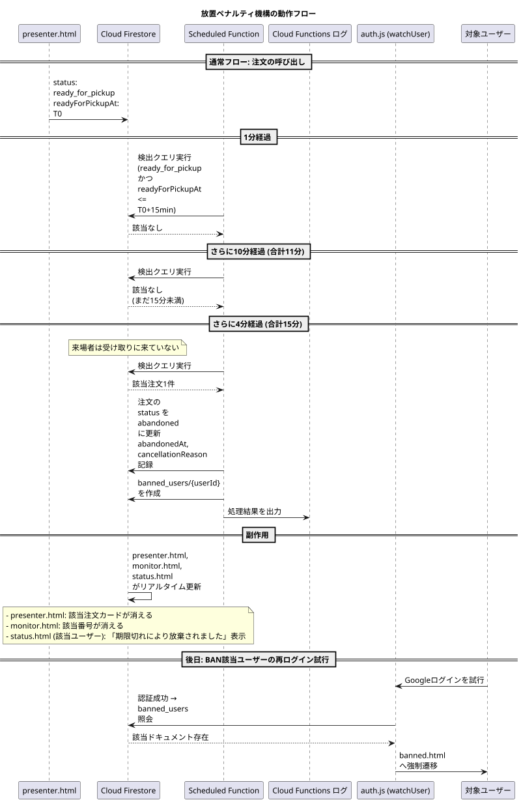

## 第8章 放置ペナルティ機構

### 8.1 章の目的

本章では、商品の準備が完了し呼び出し中の状態（`ready_for_pickup`）であるにもかかわらず、来場者が15分以上経過しても受け取りに来なかった注文を自動検出し、ペナルティを実行する仕組みを記述する。

このペナルティ機構の目的は、放置キャンセルの発生を抑止し、商品廃棄を最小化すること、および他の利用者への迷惑を防ぐことである。

### 8.2 ペナルティの背景と必要性

#### 8.2.1 放置キャンセル問題

文化祭の運用において、以下のような問題が発生し得る。

**商品廃棄の発生**  
来場者が注文した商品が完成し提供口で呼び出されているにもかかわらず、来場者が受け取りに来ない場合、その商品は時間の経過とともに品質が劣化する。最終的に廃棄せざるを得なくなり、店舗側に金銭的・心理的負担が生じる。

**運用への悪影響**  
呼び出し中の番号が長時間滞留すると、`monitor.html` の表示が乱雑になり、他の来場者の混乱を招く。また、`presenter.html` 上にも長時間の `ready_for_pickup` 注文が残り続け、提供口スタッフの作業効率を低下させる。

**受付番号の枯渇**  
`ready_for_pickup` のまま放置された注文は受付番号を占有し続ける。第4章で述べた受付番号レンジの枯渇を招く原因となり、最悪の場合、新規注文の受付が停止する事態を招く。

#### 8.2.2 ペナルティによる抑止

これらの問題を抑止するため、本システムでは以下の二段階の対策を講じる。

**事前抑止**  
注文確定前に利用規約への明示的な同意を取得する（第3章および第6章で詳述）。来場者は「呼び出し後15分以内に受け取りに来ないと利用停止となる」ことを認識した上で注文を行う。

**事後対応**  
15分の経過を自動検出し、放置注文を `abandoned` ステータスに遷移させ、対象ユーザーを `banned_users` コレクションに記録する。記録されたユーザーは以降、本システムへのログインが不可能となる。

### 8.3 ペナルティ機構の構成要素

ペナルティ機構は以下の四つの構成要素で実現される。

**Scheduled Function**  
1分ごとに自動起動し、対象注文を検出して `abandoned` への遷移と BAN 登録を実行する。

**`banned_users` コレクション**  
利用停止対象となったユーザーを記録する Firestore コレクション。第3章および第4章で構造を述べた。

**ログイン時の BAN チェック**  
来場者がログインを試みた際、`banned_users` コレクションを照会し、該当ユーザーのログインを中断する。第3章で詳述した。

**Cloud Functions内のBANチェック（二層防御）**  
クライアント側の `auth.js` によるBANチェックはDevToolsで回避可能であるため、注文作成等のCloud Function（`createOrder` 等）の冒頭でもサーバー側BANチェックを実行する。クライアント側とサーバー側の二層構成により、BANの回避を困難にする。

**規約同意の事前取得**  
注文確定前に利用規約への同意を取得し、`users/{uid}.termsAgreedAt` に記録する。第6章で詳述した。

本章ではこのうち、Scheduled Function の動作と `abandoned` 遷移の詳細を記述する。

### 8.4 Scheduled Function の動作

#### 8.4.1 起動間隔

Scheduled Function は1分ごとに自動的に起動する。Firebase の Cloud Scheduler 機能と連携し、以下のような定義で実装される。

```javascript
exports.abandonStaleOrders = onSchedule(
  {
    schedule: "every 1 minutes",
    timeZone: "Asia/Tokyo",
    region: "asia-northeast1"
  },
  async (event) => {
    // 検出と処理
  }
);
```

1分という起動間隔は、ペナルティ判定の精度（最大1分の遅延を許容）と、Firebase の課金量（呼び出し回数）のバランスから決定された。10分間隔では検出が遅すぎ、10秒間隔では呼び出し回数が過剰となる。

#### 8.4.2 検出クエリ

Scheduled Function は起動ごとに、以下の条件で `orders` コレクションを検索する。

```javascript
const fifteenMinutesAgo = new Date(Date.now() - 15 * 60 * 1000);

const query = firestore.collection("orders")
  .where("status", "==", "ready_for_pickup")
  .where("readyForPickupAt", "<=", fifteenMinutesAgo);
```

**検索条件の解説**

- `status == "ready_for_pickup"`: 現在呼び出し中の注文に限定する
- `readyForPickupAt <= 15分前`: 呼び出し開始から15分以上経過している

15分の経過判定は、`readyForPickupAt` フィールドに記録されたタイムスタンプを基準とする。`presenter.html` で「提供準備完了」が押された時刻からカウントが開始される。

#### 8.4.3 検出された注文への処理

クエリで検出された各注文に対して、以下の処理を順次実行する。

**ステップ1: ステータスの更新**  
注文ドキュメントを `abandoned` ステータスに更新する。

```javascript
await orderRef.update({
  status: "abandoned",
  abandonedAt: serverTimestamp(),
  cancellationReason: "15分放置による自動キャンセル",
  updatedAt: serverTimestamp()
});
```

`abandonedAt` フィールドには `abandoned` への遷移時刻を記録する。`cancelled` の場合の `cancelledAt` と同様に「注文が完了せず終了した」という性質を共有するためである。両者は `status` フィールドの値で明確に区別される。

**ステップ2: BAN登録**  
注文の `userId` フィールドを使い、`banned_users` コレクションに新しいドキュメントを作成する。

```javascript
const userId = orderData.userId;
if (userId !== null) {
  await firestore.collection("banned_users").doc(userId).set({
    bannedAt: serverTimestamp(),
    reason: "abandoned_order",
    orderId: orderRef.id,
    bannedBy: "auto_scheduler"
  });
}
```

`userId` が `null` の場合（POS注文）は BAN 登録を行わない。POS注文は来場者が個人として識別されないため、BAN 登録の対象外である。

**ステップ3: ログ出力**  
処理結果を Cloud Functions のログに出力する。

```javascript
console.log(`[abandoned] Order ${orderRef.id}, User ${userId}, ` +
            `ReceiptNumber ${orderData.receiptNumber}, ` +
            `ReadyAt ${orderData.readyForPickupAt.toDate().toISOString()}`);
```

このログは、運用上の確認、トラブル調査、ペナルティの監査などに使用される。

#### 8.4.4 並列処理と冪等性

検出された注文は逐次的に処理される。Cloud Functions の同一インスタンス内では並列実行を行わないが、起動間隔（1分）よりも処理が長くかかる場合、次回起動時に重複して処理される可能性がある。

これを防ぐため、各処理は冪等性（同じ操作を複数回実行しても結果が変わらない性質）を持つよう設計される。

- `status` の更新は `ready_for_pickup` から `abandoned` への一方向であり、すでに `abandoned` になっている注文は次回検出クエリで該当しない
- `banned_users` への登録は `set` メソッドを使用し、すでに存在する場合は上書きする（重複登録は発生するが結果は同じ）

これにより、ペナルティ処理の重複実行は実害を生まない。

### 8.5 自動決済確定の不可性

#### 8.5.1 設計上の制約

旧来の設計では、放置注文に対して au PAY API を呼び出し、与信確保された支払いを強制的に売上確定（Capture）させる方針が検討された。しかし本システムでは、au PAY との API 連携を行わない方針を採用している。

このため、放置注文に対する自動決済確定は実装されない。放置された注文は決済が発生しないまま `abandoned` ステータスで終了する。

#### 8.5.2 商品の取扱

`abandoned` 状態となった注文の商品は、決済が発生しないため、形式上は「商品が無料で廃棄された」という状態となる。これは店舗にとって金銭的損失となるが、本システムでは以下の理由で受容する。

**規約による事前同意**  
来場者は注文確定時に「呼び出し後15分以内に受け取りに来ない場合のペナルティ」に同意している。商品廃棄が発生することは、この同意の前提となっている。

**ペナルティの抑止効果**  
BAN 登録という「アカウント利用停止」のペナルティは、来場者にとって相応の心理的コストを伴う。多くの来場者は呼び出しに応じて商品を受け取りに来ると期待される。

**運用上の現実性**  
au PAY 手動QR決済方式では、決済タイミングが提供時に統一されている。事前与信確保が存在しないため、強制決済の仕組みを構築することは技術的にも運用的にも複雑である。試験導入年度においては、この複雑性を回避し運用のシンプルさを優先する。

#### 8.5.3 在庫の取扱

`abandoned` 状態となった注文の在庫戻し処理は、本システムでは実装しない。これは本システムが数値による在庫管理（個数の自動減算）を行わない方針（第4章参照）に基づく。

`isAvailable` の真偽値による販売可否管理のみを採用するため、`abandoned` 注文が発生してもマスタデータに対する自動操作は不要である。店舗責任者が必要に応じて `portal.html` から `isAvailable` を手動で切り替える運用となる。

### 8.6 BANの効果

#### 8.6.1 BAN登録後のユーザー体験

`banned_users` コレクションに登録されたユーザーが、本システムにログインを試みた場合の挙動は以下の通りである。

**全画面共通のBANチェック**

認証機能を利用する全ての画面において、`auth.js` の `watchUser()` 内でBANチェックが実行される。これにより、`main/` 配下の全画面、および `auth.js` を利用する `pos/mobile-order.html`、`pos/status.html` でBANチェックが有効となる。SOK経由の来場者（Google認証）も同様にこのチェックが適用される。

1. 来場者が Googleアカウントによるログインを実行
2. Firebase Authentication が認証を成功させ、UIDが確定（`onAuthStateChanged` が発火）
3. `auth.js` が取得した UID で `banned_users` コレクションを照会
4. 該当ドキュメントが存在することを確認
5. 認証状態は維持したまま（`signOut()` は実行しない）、`sessionStorage` 経由でBAN情報を受け渡し、`main/banned.html` へ `location.replace()` で強制遷移する

BANチェック結果は5分間クライアント側でキャッシュし、毎回のFirestore読み取りを回避する。また、Firestore障害時はfail-openとし、BANチェック失敗時はアプリの全停止を避けるため通過させる。

`banned.html` の仕様は以下の通りである：

- `app-shell.js` を読まないスタンドアロン構成とし、`auth.js` も読まない（リダイレクトループ防止）
- 黒背景に目玉モチーフや「……見ましたよね？」等のホラー演出テキストを配置
- BAN情報（メール・理由・日時）を表示
- アカウント切り替えボタンやホームへ戻るリンクは設置せず、ログアウト手段を提供しない（`signOut()` せずログイン状態を維持することで、BAN対象者は `banned.html` から抜け出せず、別アカウントへの切り替えもできない設計）
- ページ下部に異議申し立てフォームへのリンクのみを設置（誤BAN時の救済手段）

#### 8.6.2 BANの解除

本書執筆時点では、BANの自動解除機構は実装しない。一度 `banned_users` に登録されたユーザーは、運営による手動解除（Firebase Console からのドキュメント削除）が行われない限り、永続的にログインを拒否される。

これは、放置キャンセルという行為が一度限りの偶発事象ではなく、利用規約への明示的違反として扱われるべきとの判断による。

#### 8.6.3 BANの回避手段とその限界

来場者が新しい Google アカウントを作成し、別のアカウントで再度ログインすることで、形式上は BAN を回避できる。これは本システムの構造的限界の一つである。

しかし、以下の理由から実質的には十分な抑止効果が期待できる。

**ドメイン制限の存在**  
モバイルオーダーは `@gl.pen-kanagawa.ed.jp` ドメインに限定されており、このドメインのアカウントは神奈川県教育委員会から個人に紐付いた形で配布される。同一個人が複数のドメインアカウントを取得することは原理的に困難である。

**心理的コスト**  
BAN を回避するために新規アカウントを作成し、再度規約同意を行うという行為自体が一定の心理的コストを伴う。多くの一般的な来場者は、そこまでの努力をして再度システムを利用しようとは考えないと想定される。

**SOKのドメイン制限なしGoogle認証**  
SOK経由の来場者はドメイン制限なしのGoogle認証を使用する。BAN対象ユーザーが個人Gmailで新規アカウントを作成してSOK経由で再利用する可能性は、モバイルオーダー（ドメイン制限あり）と比較して高い。ただし、SOK利用には物理的に校内のSOK端末を操作する必要があるため、悪意ある継続的な不正利用は現実的に困難である。

### 8.7 規約同意との整合性

#### 8.7.1 同意の有効性

ペナルティ機構が法的・倫理的に有効に機能するためには、来場者が事前に「ペナルティの存在」を認識し、明示的に同意していることが必要である。

本システムでは以下の運用により同意の有効性を担保する。

**初回同意の取得**  
初回未同意時のみ規約同意UIを表示する。`users/{uid}.termsAgreedAt` にタイムスタンプが記録済みの来場者に対しては、規約同意画面をスキップする（第5章 5.4.2節、第6章 6.3.4節と整合）。

**同意内容の明示**  
規約文書の中で、「呼び出し後15分以内に受け取りに来ない場合、利用停止となる」旨を強調表示する。文章の中に埋もれない形で、視覚的に目立つ箇所に配置する。

**チェックボックスによる能動的同意**  
「同意します」のチェックボックスを必須とし、これがオンになっていない限り注文確定ボタンを非活性とする。来場者が能動的に同意を表明する操作を行わなければ先に進めない設計とする。

**タイムスタンプの記録**  
同意の事実とその時刻を `users/{uid}.termsAgreedAt` に記録する。後から「いつ同意したか」を検証可能とする。

#### 8.7.2 同意のないPOS注文への対応

POS注文では規約同意を取得しない（第3章および第6章参照）。このため、POS注文は本ペナルティ機構の対象外となる。

具体的な扱いは以下の通りである。

- POS注文の `userId` は `null` であり、BAN 登録の対象とならない
- POS注文が `ready_for_pickup` で15分以上放置された場合、Scheduled Function は `userId == null` を確認し、ステータス更新のみ行い BAN 登録を行わない

ただし、`status` を `abandoned` に更新するか、それとも `ready_for_pickup` のまま放置するかは設計判断となる。本書では、POS注文も含めて15分経過時には `abandoned` に更新する方針を採用する。これは以下の理由による。

- 受付番号を解放することで、番号枯渇を防止する
- `monitor.html` の呼び出し一覧から消すことで、他の来場者の混乱を防ぐ
- `presenter.html` の作業対象から外すことで、提供口スタッフの作業を整理する

POS注文の `abandoned` 遷移時は、`cancellationReason` に「15分放置による自動キャンセル（POS注文・BAN対象外）」と記録する。

### 8.8 Scheduled Function の運用方針

#### 8.8.1 開発・テスト期間中の取扱

ペナルティ機構は本番運用時にのみ有効化する方針を採用する。開発・テスト期間中は Scheduled Function を有効化しない。

これは以下の理由による。

**開発効率の確保**  
本システムの開発過程では、開発者が複数回のテスト注文を作成し、各ステータス遷移を確認する作業が頻繁に発生する。`ready_for_pickup` で意図的に放置した状態で動作を確認したい場合、ペナルティが自動的に発動すると検証作業が阻害される。

**テストアカウントの BAN 防止**  
開発者が使用するテスト用Googleアカウント（`@gl.pen-kanagawa.ed.jp` ドメインの開発者アカウントや、開発者特例アカウント `ynrcs1000@gmail.com`）が誤って `banned_users` に登録されると、開発者自身がログイン不能となり、復旧作業が必要となる。

**Cloud Functions の課金抑制**  
Scheduled Function は1分ごとに起動する。開発期間中もこの間隔で稼働させると、開発に必要のない呼び出しが累積し、Cloud Functions の課金量が増加する。本番運用に必要な予算を保全するため、開発期間中は停止しておく方針が望ましい。

#### 8.8.2 有効化のタイミング

Scheduled Function は文化祭本番直前に有効化する。具体的なタイミングは以下を想定する。

- 文化祭前日のリハーサル時：ペナルティ機構を含む全機能の最終動作確認のため、有効化する
- 文化祭当日朝：本番運用開始時から有効化された状態とする

#### 8.8.3 有効化の方法

Scheduled Function を「有効化されていない」状態から「有効化された」状態にする具体的方法は、本書執筆時点で未確定である。以下のいずれかの方式が候補となる。

**方式A: コードレベルでの分岐**  
Scheduled Function 内に環境変数による分岐を実装し、`PENALTY_ENABLED=true` の場合のみ実際の処理を実行する。本番直前に環境変数を切り替える。

```javascript
exports.checkAbandonedOrders = onSchedule(
  { schedule: "every 1 minutes", region: "asia-northeast1" },
  async (event) => {
    if (process.env.PENALTY_ENABLED !== "true") {
      console.log("Penalty mechanism is disabled. Skipping.");
      return;
    }
    // 実際の処理
  }
);
```

**方式B: Firebase Console での手動無効化**  
Scheduled Function 自体は実装してデプロイするが、Firebase Console から該当のスケジュールを手動で無効化する。本番直前に手動で再有効化する。

**方式C: デプロイの除外**  
Scheduled Function のソースコードは実装するが、`firebase deploy` の対象から除外する。本番直前に対象に含めて再デプロイする。

これらの方式の選択は、本番直前の運用判断に委ねる。

### 8.9 BANの手動操作

#### 8.9.1 手動BAN登録

Scheduled Function による自動 BAN 以外に、運営側の判断による手動 BAN が必要となる場合がある。例えば、規約違反ではないものの、システム的に問題のある利用が確認された場合である。

手動 BAN は以下の手順で実行する。

1. Firebase Console にアクセスし、Firestore データベースを開く
2. `banned_users` コレクションに新しいドキュメントを作成
3. ドキュメント ID として、対象ユーザーの UID を入力
4. フィールドを以下の通り設定

```json
{
  "bannedAt": "2026-09-12T15:42:18+09:00",
  "reason": "manual_ban",
  "orderId": null,
  "bannedBy": "uid_of_admin"
}
```

#### 8.9.2 手動BAN解除

BAN を解除する場合は、`banned_users` コレクションから対象ユーザーのドキュメントを削除する。次回ログイン試行時から、通常通りログインできる状態に復帰する。

### 8.10 ペナルティ機構の動作フロー

ペナルティ機構の動作を時系列で整理した図を以下に示す。



### 8.11 設計上の考慮点と既知の限界

#### 8.11.1 偽陽性のリスク

15分という閾値は、来場者が呼び出しに気付いてから提供口に到達するまでの時間を考慮して設定されている。しかし、以下のような状況では正当な来場者が誤って BAN される可能性がある。

**通信障害**  
来場者のスマートフォンが電波の弱い場所にあり、Push通知が遅延した場合。

**気付きの遅れ**  
来場者がスマートフォンを確認していない、または音声呼び出しを聞き逃した場合。

**移動の困難**  
混雑により提供口へ到達するのに時間がかかった場合。

これらは原理的に避けがたい偽陽性であり、本システムでは「15分は十分な余裕時間である」との判断のもとで運用する。万一誤った BAN が発生した場合、第8章9節の手動 BAN 解除手順により対応する。

#### 8.11.2 タイムスタンプの正確性

Scheduled Function は Cloud Functions の実行環境のシステム時刻を基準に判定を行う。一方、`readyForPickupAt` フィールドは Firestore の `serverTimestamp()` で記録される。両者はともに UTC で管理されるが、わずかな時刻ずれが生じる可能性がある。

実用上、このずれは数百ミリ秒以内に収まると想定され、15分という閾値に対しては無視できる範囲である。

#### 8.11.3 Scheduled Function の起動失敗

Cloud Scheduler および Cloud Functions の障害により、Scheduled Function が予定通り起動しない場合、ペナルティの検出が遅延する。

ただし、起動失敗の状態が続いても、復旧後には過去に該当する注文がすべて検出クエリでヒットする（`readyForPickupAt <= 15分前` の条件は時間が経過しても満たされ続けるため）。検出のタイミングは遅れるが、検出漏れは発生しない。

#### 8.11.4 BAN該当ユーザーの新規アカウント取得

第8章6節3項で述べた通り、BAN 該当ユーザーが新規 Google アカウントを取得して再度ログインすることは原理的に可能である。ドメイン制限と心理的コストにより実質的な抑止効果は期待できるが、完全な防御ではない。

この限界は受容するものとし、追加の対策（例: 端末識別子による BAN）は本システムでは実装しない。

### 8.12 まとめ

本章では、放置キャンセルに対する自動ペナルティ機構を記述した。1分ごとに起動する Scheduled Function が `ready_for_pickup` で15分以上経過した注文を検出し、`abandoned` ステータスへの遷移と `banned_users` コレクションへの登録を実行する。

au PAY API 連携を行わない設計上、自動決済確定は実装されない。`abandoned` 注文は決済が発生しないまま終了する。これは商品廃棄として店舗の負担となるが、規約同意と BAN による抑止効果により、発生頻度は実用上の許容範囲に収まると期待される。

Scheduled Function は開発・テスト期間中は無効化し、本番直前に有効化する運用方針を採用する。この有効化方法は実装段階で適宜判断する。

次章では、本章のペナルティ機構を含むシステム全体のセキュリティ設計と、原理的に防げない既知の構造的限界を扱う。

---
