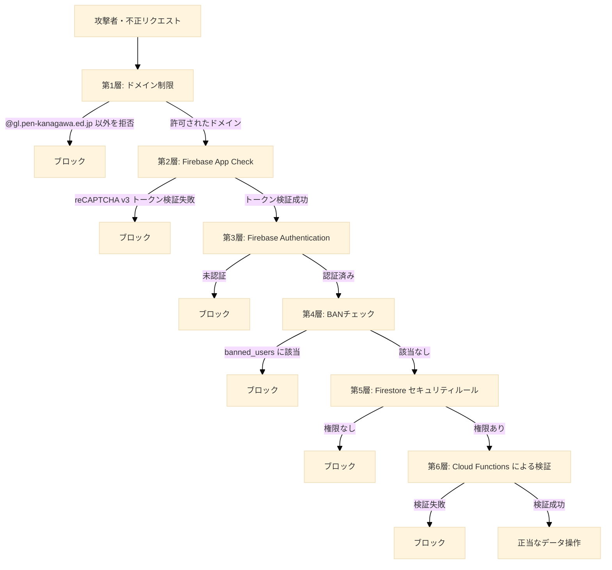

## 第9章 セキュリティ設計

### 9.1 本章の目的

本章は、本システムにおけるセキュリティ設計を統合的に記述する。これまでの章で個別に言及してきた認証、認可、データアクセス制御、不正リクエスト遮断などの仕組みを、ここで「多層防御（Defense in Depth、複数の独立した防御層を重ねる設計思想）」の観点から再構成する。

加えて、本章は本システムが原理的に防ぐことのできない構造的限界についても誠実に記述する。手動QRコード決済方式を採用するという運用上の制約から生じる脆弱性は、ソフトウェアの実装によって完全には解消できない。本書はこれらの限界を隠蔽せず、運用でどのようにカバーするかを明示する。

校長先生および学校管理職の読者に向けて、本章は「ここまでは守れる、ここからは運用でカバーする」という線を明確に引くことを目的とする。

### 9.2 多層防御の全体像

本システムのセキュリティは、外側から内側へ向かって以下の層で構成される。各層は独立して機能し、いずれかの層が破られても他の層が防御を継続する。



各層の詳細を以降の節で記述する。

### 9.3 第1層: ドメイン制限

#### 9.3.1 役割

モバイルオーダー機能（`mobile-order.html`）の利用を、神奈川県教育委員会から県立高校生・教員に配布されている `@gl.pen-kanagawa.ed.jp` ドメインのGoogleアカウント、および開発者特例として `ynrcs1000@gmail.com` を保有するユーザーに限定する。

#### 9.3.2 防御対象の脅威

本層が防ぐ脅威は以下である。

**海外からの不正注文**  
本システムは GitHub Pages 上で公開されており、URLを知っていれば世界中のどこからでもアクセス可能である。ドメイン制限がない場合、イギリス、ブラジル、その他任意の国から注文が作成され、来場者が実在しないにもかかわらず厨房スタッフが調理を開始してしまう事態が発生し得る。

**部外者によるいたずら注文**  
学校とは無関係の第三者が、悪意またはいたずら目的で大量の注文を作成し、業務妨害を行う事態を防ぐ。

#### 9.3.3 実装方式

`login.html` がGoogleログイン後、ユーザーのメールアドレスを検査する。`@gl.pen-kanagawa.ed.jp` で終わる、または `ynrcs1000@gmail.com` に完全一致するメールアドレスのみを許可する。これら以外のメールアドレスでログインしたユーザーには「利用対象外アカウント」画面を表示し、モバイルオーダーへの遷移を中断する。

詳細な実装は第3章に記述されている。

#### 9.3.4 限界と補完

ドメイン制限により海外からの不正注文は防げるが、`@gl.pen-kanagawa.ed.jp` を保有する正規ユーザー（在校生・教員）が悪意を持って注文を行う事態は防げない。この種の脅威は本層では防御対象外とし、第8章の放置ペナルティ機構および校内の生活指導によって対応する。

なお、SOK経由の注文と有人POSによる注文は、ドメイン制限の対象外である。SOKは現地に物理的に存在することが利用条件となるため、海外からのアクセスは原理的に不可能である。POSはスタッフが操作するため、来場者のドメインは無関係である。

### 9.4 第2層: Firebase App Check

#### 9.4.1 役割

正規のフロントエンド（`https://ynr-cs.github.io/nanryosai-2026/` 配下から配信されたページ）からのリクエストのみを Firebase バックエンドに通すゲートとして機能する。

#### 9.4.2 防御対象の脅威

本層が防ぐ脅威は以下である。

**自動化された大量リクエスト**  
攻撃者がスクリプトを用いて、Firebase の API エンドポイントに直接大量のリクエストを送信する事態。これは本システムの Cloud Functions 実行回数や Firestore 読み書き回数を不正に増大させ、課金額を膨張させる攻撃（請求書攻撃、Bill Shock Attack）の典型的な手段である。

**自作クライアントによる API 直接呼び出し**  
攻撃者が独自のクライアントプログラムを作成し、Firebase の API を呼び出して不正なデータを書き込もうとする事態。

#### 9.4.3 実装方式

App Check は reCAPTCHA v3 と連携する。フロントエンドが Firebase API を呼び出す前に、reCAPTCHA v3 からトークンを取得し、リクエスト時にそのトークンを添付する。Firebase バックエンドはトークンを検証し、不正なトークンを持つリクエストを拒否する。

reCAPTCHA v3 は、ブラウザのフィンガープリント、操作パターン、IPアドレスなど多数のシグナルからリクエストの正当性をスコアリングする。スクリプトによる自動化や、ブラウザ以外のクライアントからのリクエストは低スコアと判定され、トークン発行が拒否される。

#### 9.4.4 ウォームアップ戦略

App Check トークンの取得は、Firebase 初期化時に非同期で先行実行される。ユーザーがログインボタンを押下した瞬間にトークン取得を開始すると、トークン取得とログインポップアップ表示が競合し、ブラウザのポップアップブロッカーがログインポップアップを誤って遮断する可能性がある。

事前にトークンを取得しておくことで、ユーザー操作のタイミングではトークン取得済みの状態となり、ポップアップブロックを回避する。

### 9.5 第3層: Firebase Authentication

#### 9.5.1 役割

リクエストを発行したユーザーが、システムに登録された正当なユーザーであることを保証する。

#### 9.5.2 防御対象の脅威

本層が防ぐ脅威は以下である。

**未認証ユーザーによるデータアクセス**  
ログインしていないユーザーが、注文情報や個人情報を含むデータにアクセスする事態。

**他人へのなりすまし**  
あるユーザーが他のユーザーになりすまして注文を行う、またはステータスを参照する事態。

#### 9.5.3 実装方式

Firebase Authentication が、Googleアカウントによるログイン（signInWithPopup）によりユーザーIDを発行する。発行されたユーザーIDは、以降のすべての Firestore リクエストおよび Cloud Functions 呼び出しに自動的に添付される。

第3章で述べた通り、本システムでは `signInWithPopup` のみを採用する Popup-only 戦略を採る。`signInWithRedirect` は GitHub Pages のサードパーティ Cookie 制限により動作しないためである。


### 9.6 第4層: BANチェック

#### 9.6.1 役割

放置ペナルティの対象となったユーザーが、再ログインによりシステムを再利用することを防ぐ。

#### 9.6.2 防御対象の脅威

**ペナルティを受けたユーザーの再アクセス**  
第8章で述べた放置ペナルティ機構により `banned_users` コレクションに登録されたユーザーが、ログアウトと再ログインを繰り返してペナルティを回避する事態。

#### 9.6.3 実装方式

BANチェックは `auth.js` の `watchUser()` 内で全画面共通に実行される。`main/` 配下の全画面、および `auth.js` を利用する画面（`pos/mobile-order.html`、`pos/status.html`）において、認証状態が確定した直後に `banned_users/{uid}` を照会する。該当ドキュメントが存在する場合、`main/banned.html` へ強制遷移する。`signOut()` は実行せず、BAN対象者をログイン状態のまま `banned.html` に閉じ込める設計とする。

BANチェック結果は5分間クライアント側でキャッシュし、毎ページ遷移でのFirestore読み取りを回避する。Firestore障害時はfail-open（BANチェック失敗時はアプリ全停止を避けるため通過させる）とする。

また、Cloud Functions（`createOrder` 等）の冒頭でもサーバー側BANチェックを実行する二層防御を採用する。クライアント側のBANチェックはDevToolsで回避可能なため、サーバー側でも必ず検証する。

#### 9.6.4 限界

ユーザーが新たに別のGoogleアカウントを取得して再登録すれば、BANを回避できる。`@gl.pen-kanagawa.ed.jp` ドメインのアカウントは生徒一人につき一つが配布されているため、生徒であれば容易に追加アカウントを取得することはできない。ただし、複数のメールアドレスを保有する教員、または開発者特例アカウントの保有者がBAN対象となった場合、本層のみではペナルティを完全に強制できない。これは本システムの制約として受容する。

### 9.7 第5層: Firestore セキュリティルール

#### 9.7.1 役割

Firestore データベースに対する読み取り・書き込み権限を、リクエストを発行したユーザーごとに制御する。Firebase Authentication が「誰であるか」を保証するのに対し、Firestore セキュリティルールは「何ができるか」を規定する。

#### 9.7.2 設計方針

本システムのセキュリティルールは、以下の方針に基づいて設計される。

**最小権限の原則**  
各ユーザーには、業務上必要最小限の権限のみを付与する。来場者は自身の注文情報のみを参照でき、他人の注文情報には一切アクセスできない。

**書き込みは Cloud Functions 経由を強制**  
注文の作成および更新は、原則としてフロントエンドからの直接書き込みを禁止し、Cloud Functions を経由させる。これにより、サーバー側で受付番号の発番、在庫チェック、金額計算などの検証を確実に実行できる。

**機密データへのアクセス完全禁止**  
店舗パスワード等の機密情報を格納する `store_secrets` コレクションは、クライアントからのアクセスを完全に禁止する。Cloud Functions のみがアクセス権を持つ。

#### 9.7.3 主要なルール

以下に、主要なコレクションに対するルールの代表例を示す。実装上は同等の意味を持つ表現で記述される。

```javascript
rules_version = '2';
service cloud.firestore {
  match /databases/{database}/documents {

    // 注文コレクション
    match /orders/{orderId} {
      // 読み取り: 自身の注文、またはSOKの未確定仮注文（個人情報を含まないため許可）
      allow read: if (request.auth != null && request.auth.uid == resource.data.userId)
                  || (resource.data.orderChannel == 'sok' && resource.data.sokStatus == 'pending');

      // 作成: クライアントからの直接作成は禁止
      // (Cloud Functions が Admin SDK で作成するため、ルールを通らない)
      allow create: if false;

      // 更新: クライアントからの直接更新は禁止
      // (Cloud Functions が Admin SDK で更新するため、ルールを通らない)
      allow update: if false;

      // 削除: 完全禁止（キャンセルは status 更新で表現）
      allow delete: if false;
    }

    // 商品マスタ
    match /items/{itemId} {
      // 読み取り: 全ユーザー許可（メニュー閲覧のため）
      allow read: if true;
      // 書き込み: 店舗管理者のみ（portal.html 経由）
      allow write: if isStoreManager(request.auth.uid, resource.data.storeId);
    }

    // 店舗マスタ
    match /stores/{storeId} {
      allow read: if true;
      allow write: if isStoreManager(request.auth.uid, storeId);
    }

    // ユーザープロファイル
    match /users/{userId} {
      allow read, write: if request.auth != null
                         && request.auth.uid == userId;

    }

    // BANリスト
    match /banned_users/{userId} {
      // 読み取り: 自身のBAN状態のみ確認可能
      allow read: if request.auth != null
                  && request.auth.uid == userId;
      // 書き込み: 完全禁止（Cloud Functions のみ）
      allow write: if false;
    }

    // 機密情報
    match /store_secrets/{document=**} {
      // クライアントからのアクセスを完全禁止
      allow read, write: if false;
    }

    // 受付番号カウンタ
    match /receipt_counters/{counterId} {
      // 読み取り: スタッフのみ
      allow read: if isStaff(request.auth.uid);
      // 書き込み: 完全禁止（Cloud Functions のトランザクション内のみ）
      allow write: if false;
    }
  }
}
```

このルールにより、たとえ攻撃者が App Check を突破して直接 Firestore に書き込みを試みたとしても、適切な権限を持たないリクエストはすべて拒否される。

#### 9.7.4 注文ドキュメントのアクセス制御の意味

注文ドキュメントの読み取り権限を「自身の `userId` と一致するもの」に限定するルールには、以下の意味がある。

**未確定仮注文（pending）の一時公開と保護**  
SOK で作成された仮注文は最初は `sokStatus: "pending"` として誰でも読み取れる状態にあるが、生成されたQRコードを最初に読み取ったユーザーがGoogle認証によりUIDを発行し `claimSokOrder` を呼び出すと、注文ドキュメントの `userId` フィールドにそのUIDが記録され、`sokStatus` は `"claimed"` に遷移する。以降、その注文の閲覧は当該UIDのユーザーに限定される。第三者がQRコードのURLを知り得たとしても、確定後のデータを取得しようとすればルールにより拒否される。

**他人の注文番号を盗み見る攻撃への防御**  
攻撃者が他人の注文の受付番号や金額を知ることはできない。この情報を得るには物理的に画面を覗き込むか、提供口での呼び出しを聞くしかなく、システム経由での情報漏洩は遮断される。

### 9.8 第6層: Cloud Functions による検証

#### 9.8.1 役割

注文の作成という最も重要なトランザクションを、サーバーサイドで完全に制御する。クライアント側のロジックには一切信頼を置かない。

#### 9.8.2 防御対象の脅威

**金額の不正操作**  
クライアント側で「合計金額1000円」と表示されている注文を、リクエスト時に「合計金額0円」に書き換えて送信する事態。

**存在しない商品の注文**  
クライアント側のJavaScriptを改変し、`items` コレクションに存在しない商品IDで注文を作成しようとする事態。

**販売停止中商品の注文**  
`isAvailable: false` となっている商品を、クライアント側のUI制御を回避して注文しようとする事態。

**受付番号の重複**  
複数のユーザーが同時に注文を確定した際、同じ受付番号が二つの注文に発行される事態。

#### 9.8.3 実装方式

`createOrder` Cloud Function（`orderChannel` パラメータにより内部で経路別に分岐）は、以下の検証をすべて実行する。

**商品の実在性検証**  
リクエストに含まれる各商品IDについて、`items` コレクションに該当ドキュメントが存在することを確認する。

**販売状態の検証**  
各商品の `isAvailable` フィールドが `true` であることを確認する。`false` の商品が含まれる場合、注文作成を拒否する。

**金額の再計算**  
クライアントから送信された合計金額を信頼せず、サーバー側で `items` コレクションの最新価格を参照して合計金額を再計算する。再計算結果を `totalPrice` フィールドに記録する。

**受付番号のアトミック発番**  
Firestore のトランザクション機能を用いて、`receipt_counters` コレクションのカウンタを排他的にインクリメントし、重複しない受付番号を発行する。詳細は第4章に記述されている。

**規約同意の確認**  
モバイルオーダーおよびSOK経由の注文では、`users/{uid}.termsAgreedAt` フィールドを参照し、規約同意済みであることを確認する。同意なしに注文を作成しようとするリクエストは拒否する。

これらすべての検証に成功した場合のみ、注文ドキュメントが `orders` コレクションに作成される。

### 9.9 個人情報の取扱

#### 9.9.1 取得する情報

本システムが取得する個人情報は以下に限定される。

- Googleアカウントのメールアドレス（ドメイン判定および利用者の識別に使用）
- Googleアカウントの表示名（注文画面でのユーザー表示に使用、任意）
- Googleアカウントのプロフィール画像URL（注文画面でのユーザー表示に使用、任意）
- Firebase Authentication が発行する内部ユーザーID（システム内部の識別子）
- 注文内容（商品、数量、合計金額、注文日時）
- Push通知用のFCMトークン（端末識別子、通知許可をしたユーザーのみ）

#### 9.9.2 取得しない情報

以下の情報は取得しない。

- 氏名（Googleアカウントの表示名以外の本名）
- 住所
- 電話番号
- 学校内の所属（学年、クラス、部活動等）
- 決済情報（クレジットカード番号、au PAY 残高情報等）
- 生体情報

#### 9.9.3 データの保管期間

本システムが保持するデータは、文化祭終了後の集計作業完了をもって削除される。具体的には以下の方針とする。

- 注文データ（`orders` コレクション）: 文化祭終了後3ヶ月以内に集計を完了し、その後削除する
- ユーザープロファイル（`users` コレクション）: 同上
- BANリスト（`banned_users` コレクション）: 同上
- 商品マスタおよび店舗マスタ: アーカイブとして保持する場合がある

データ削除のタイミングおよび方法については、文化祭終了後に実行委員会と協議の上で確定する。※本項目の具体的な削除日程は本書執筆時点で未確定である。

#### 9.9.4 データの開示

本システムが取得した個人情報は、以下の場合を除き第三者に開示しない。

- 当該ユーザー本人が `account.html` から自身のデータを参照する場合
- 法令に基づく開示要請があった場合
- 学校管理職または実行委員会が、ペナルティ対応または苦情対応のために必要と判断した場合

### 9.10 通信の暗号化

本システムが扱うすべての通信は、HTTPSにより暗号化される。

**フロントエンドの配信**  
GitHub Pages はすべてのサイトで HTTPS を強制する。HTTPでアクセスした場合は自動的にHTTPSへリダイレクトされる。

**Firebase APIへの通信**  
Firebase SDK は内部的にHTTPSのみを使用する。HTTPでのAPI呼び出しは行われない。

**Cloud Storageへのアクセス**  
商品画像の取得もHTTPS経由で行われる。

**外部サービスとの通信**  
Cloud Functions から Google スプレッドシートへの書き込みは、Google 内部のセキュアな通信経路を経由する。

### 9.11 構造的限界と運用カバー

本節は、本システムが**原理的に防ぐことのできない**脆弱性について誠実に記述する。これらは個別の実装ミスではなく、本システムが採用する運用方式（手動QRコード決済、手動の番号照合）から不可避的に生じる限界である。

これらの限界は本システム固有の問題ではなく、紙伝票による従来の運用にも存在していた問題である。本システムの導入により新たに発生する脆弱性ではないが、本書の読者が誤解しないよう、ここで明示する。

#### 9.11.1 番号横取り

**脅威の内容**  
他人の呼び出し番号を聞き、または `monitor.html` の表示を覗き見て、自分の番号として提供口で受け取りを主張する攻撃。

**システム側で防げない理由**  
提供口スタッフは、提示された受付番号と注文内容を `presenter.html` で確認するが、提示者が当該番号の正当な注文者であるかを判定する手段を持たない。本人確認書類の提示を求める運用は、文化祭の規模と来場者の利便性を考慮すると現実的でない。

**運用によるカバー**  
モバイルオーダーおよびSOK経由の注文では、来場者は提供口で `status.html` のスマートフォン画面を提示する。`status.html` は Firestore セキュリティルールにより、当該注文の `userId` と一致するユーザーにのみ表示される。提供口スタッフは、紙の番号ではなくスマートフォン画面の番号を確認することを原則とする。これにより、画面そのものが本人確認の代替となる。

POS経由の注文は紙の番号札のみが本人確認手段となる。POSは高齢者や複雑な注文に限定された経路であり、来場者数も限定的であるため、本リスクは限定的に受容する。

**過去の運用との比較**  
紙伝票による従来の運用でも、紙を拾った第三者が商品を受け取る可能性は存在していた。本システムは少なくともモバイルオーダーおよびSOK経路においては、画面表示と Firestore セキュリティルールの組み合わせにより、過去より強固な本人確認を実現している。

#### 9.11.2 金額改ざん

**脅威の内容**  
au PAY 手動QRコード決済では、来場者が支払い金額を自身のスマートフォンに手入力する。攻撃者が「合計500円の注文」に対して「100円」と入力して決済を完了させ、決済完了画面をスタッフに提示する事態。

**システム側で防げない理由**  
au PAY のAPIと連携していないため、本システムは支払い金額を制御する手段を持たない。決済完了画面の検証はスタッフの目視のみに依存する。

**運用によるカバー**  
提供口スタッフは、来場者の決済完了画面に表示された金額と、`presenter.html` に表示された注文の合計金額を目視で照合する。金額が一致しない場合は、商品の引き渡しを拒否し、再決済を求める。

トレーニングマニュアルにおいて、提供口スタッフの最重要確認事項として「金額の照合」を位置づける。

**根本的な制約**  
本脆弱性は、現金禁止運用かつ手動QRコード決済を採用するすべての文化祭・イベントに共通する構造的問題である。本システム固有の問題ではない。本システムの導入により新たに発生する脆弱性ではない点を強調する。

au PAY のAPI連携を導入すれば本脆弱性は解消されるが、本システムでは第11章に述べる理由により、API連携を採用しない。

#### 9.11.3 開発者ツールによる画面表示の改ざん

**脅威の内容**  
ブラウザの開発者ツール（F12キー等で開く開発支援機能）を用いて、画面に表示される受付番号や注文内容のDOM（Document Object Model、画面の構造を表すデータ）を書き換え、虚偽の画面をスタッフに提示する事態。

**システム側で防げない理由**  
画面の表示はクライアントサイドで描画されるため、ユーザーの端末上で任意に書き換えることが可能である。これはWeb技術の根本的な性質であり、回避不能である。

**運用によるカバーと残存リスクの限定**  
DOM改ざんによってクライアント画面は偽装できるが、Firestore データベース上の真のデータは改ざんできない。提供口スタッフは `presenter.html` で注文情報を確認するが、`presenter.html` のデータは Firestore から直接取得されるため、来場者側のDOM改ざんの影響を受けない。

したがって、来場者がDOM改ざんで虚偽の画面を提示しても、提供口スタッフは Firestore 上の真の注文情報と照合するため、誤った商品が引き渡される可能性は限定的である。

ただし、来場者が「金額」のDOMを改ざんして「自分の注文金額は安い」と主張する事態は防げない。これは前節の「金額改ざん」と同様、目視照合で対処する。

#### 9.11.4 Firestore コスト攻撃

**脅威の内容**  
正規のフロントエンドを多数のタブで同時に開き、リアルタイム購読を意図的に大量発生させ、Firestore の読み取り回数を不正に膨張させて課金額を増大させる事態。

**運用によるカバー**  
本システムは Firebase の無料枠の範囲で運用することを前提に設計されている。読み取り回数の上限を超えた場合、Firebase Console から日次の使用量制限を設定することで、課金が一定額を超える前にサービスを停止できる。

文化祭当日に本攻撃を検知した場合、開発メンバーまたは実行委員会が Firebase Console から該当する Firestore のアクセスを一時的に制限する運用とする。

#### 9.11.5 限界の総括

本システムの構造的限界は、以下の3点に集約される。

1. **手動QR決済方式**による金額不正の可能性
2. **紙の番号札**を使用するPOS経路における本人確認の弱さ
3. **クライアントサイド描画**による画面表示の改ざん可能性

これらはいずれも、文化祭の規模、コスト制約、来場者の利便性を考慮した設計上のトレードオフの結果として残存する。本システムは、これらの限界を運用とスタッフトレーニングによってカバーする方針を採用する。

### 9.12 セキュリティ脅威モデル一覧

本章で扱った脅威と対策を以下の表にまとめる。

| 脅威                                  | 主たる対策層           | 対策内容                        | 残存リスク                       |
| ------------------------------------- | ---------------------- | ------------------------------- | -------------------------------- |
| 海外からの不正注文                    | 第1層: ドメイン制限    | `@gl.pen-kanagawa.ed.jp` 限定   | 正規ドメイン保有者の悪意ある注文 |
| 自動化された大量リクエスト            | 第2層: App Check       | reCAPTCHA v3 によるトークン検証 | reCAPTCHA を突破する高度なボット |
| 自作クライアントによるAPI直接呼び出し | 第2層: App Check       | 同上                            | 同上                             |
| 未認証ユーザーによるアクセス          | 第3層: Authentication  | Googleログインのみ              | なし                             |
| なりすまし                            | 第3層: Authentication  | Googleの認証基盤に依存          | Googleアカウントの侵害           |
| ペナルティ受領者の再アクセス          | 第4層: BANチェック     | `banned_users` 照会             | 別アカウントによる回避           |
| 他人の注文情報の閲覧                  | 第5層: Firestore Rules | `userId` 一致チェック           | 物理的な画面覗き見               |
| 機密情報への不正アクセス              | 第5層: Firestore Rules | `store_secrets` 完全禁止        | なし                             |
| 金額の不正書換（API送信時）           | 第6層: Cloud Functions | サーバー側で再計算              | なし                             |
| 受付番号の重複                        | 第6層: Cloud Functions | アトミックトランザクション      | なし                             |
| 番号横取り                            | 運用カバー             | スマホ画面提示・スタッフ目視    | POS経路では限定的に残存          |
| 金額改ざん（決済画面）                | 運用カバー             | スタッフ目視照合                | 構造的に完全防御不能             |
| DOM改ざんによる虚偽画面提示           | 運用カバー             | サーバー側データとの照合        | 構造的に完全防御不能             |
| Firestoreコスト攻撃                   | 運用カバー             | 使用量制限・監視                | 攻撃検知の遅延                   |

### 9.13 まとめ

本章では、本システムが採用する6層の多層防御を体系的に記述した。ドメイン制限、App Check、Firebase Authentication、BANチェック、Firestoreセキュリティルール、Cloud Functions による検証の各層は、それぞれ独立して機能し、いずれかの層が破られても他の層が防御を継続する設計となっている。

同時に、手動QRコード決済方式に起因する構造的限界についても誠実に記述した。これらは個別の実装ミスではなく、本システムの運用方式から不可避的に生じる限界であり、運用とスタッフトレーニングによってカバーされる。

本システムは、無料の技術スタックと最小限の運用負荷の中で、文化祭という限定された期間・規模の運用に耐えうる現実的なセキュリティ水準を実現することを目標として設計されている。

次章では、これらのセキュリティ機構が実際の運用にどのように接続されるか、当日のスタッフ役割分担と障害対応を含めた運用設計を記述する。

---
