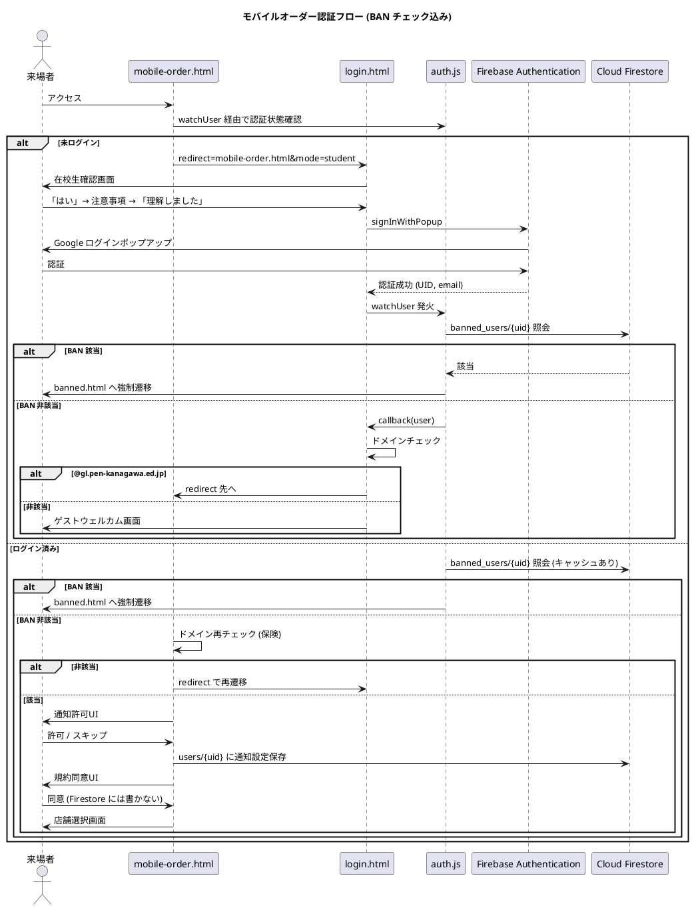

# BAN 機能 計画メモ

**Status**: ドラフト / 未実装  
**Last Updated**: 2026-05-10  

> このファイルは `設計図/scrap/` 配下の作業メモです。
> 仕様が確定したら `antigravity/` 配下の正式コンテキストへ統合してください。

---

## 1. 背景・目的

`mobile-order.html` の利用規約に「**違反時は全サービスから永久 BAN します**」と明記しているが、現状の実装には BAN チェック機構が存在しない。文言と実装の整合性を取り、かつ運用上の抑止力として機能する BAN 機能を導入する。

### 想定される BAN 発動ケース
- モバイルオーダーで「15分以内に受取に来ない」

---

## 2. 設計方針

### 2.1 BAN チェックの位置

**ドメインチェックより先に BAN チェックを実行する。**

理由:
- BAN は「全サービス出禁」のため、在校生／一般客を問わず最優先で弾く
- 一般客（個人 Gmail）でログインしてお気に入り機能を使う人にも BAN は効かせるべき
- ドメイン NG ユーザーを `step-guest-welcome` に流す前に BAN 判定する必要がある

```
ログイン成功 (UID 確定)
  ↓
[1] BAN チェック (banned_users/{uid})
  ├─ BAN該当 → banned.html へ強制遷移 (signOut しない、脱出手段なし)
  └─ BAN非該当 → 次へ
  ↓
[2] ドメインチェック (mode=student のときのみ)
  ├─ 該当 → モバイルオーダーへ
  └─ 非該当 → ゲスト機能のみ案内
```

### 2.2 BAN チェックの実装場所

**全ページ共通: `auth.js` の `watchUser()` 内で実装する。**

採用理由:
- 規約文言「全サービスから永久 BAN」と一致する
- 実装が一箇所に集約されてバグりにくい
- BAN 対象者がアプリのどこを開いても専用画面に飛ぶ設計で抑止力が高い
- `app-shell.js` 経由で `auth.js` が全ページから読まれているため、追加の差し込み作業が不要

不採用案:
- ❌ モバイルオーダー関連ページのみで BAN チェック  
  → 規約文言との不整合。お気に入り機能は使えてしまう。
- ❌ ハイブリッド（ページごとにブロック粒度を変える）  
  → 実装複雑化のメリットが薄い。

### 2.3 サーバー側の二層防御

クライアントだけだと DevTools で `banCache` を書き換えれば回避できる。
`functions/index.js` の以下の Function 冒頭にも BAN チェックを入れる:

- `createOrder` — 必須
- `mockAuPayPayment` — 推奨
- その他、課金・注文に絡む Function — 必須

```js
// 例: createOrder
const banDoc = await db.collection("banned_users").doc(uid).get();
if (banDoc.exists) {
  throw new functions.https.HttpsError(
    "permission-denied",
    "このアカウントは利用が停止されています。"
  );
}
```

### 2.4 BAN ページの世界観

`banned.html` は **`app-shell.js` を読まないスタンドアロン構成** とする。

理由:
- ヘッダー・ボトムナビが出ると黒背景＋目玉演出の世界観が壊れる
- `auth.js` が走らないことでリダイレクトループのリスクがゼロになる
- ロジックが単純化される

---

## 3. データ構造

### 3.1 Firestore: `banned_users/{uid}`

```
banned_users/{uid}
  ├─ reason: string          // "モバイルオーダー受取期限超過 (3回)" など
  ├─ bannedAt: Timestamp     // BAN 日時
  ├─ bannedBy: string        // 操作した管理者の email
  ├─ email: string           // BAN 時点のメール（参考情報）
  └─ note?: string           // 内部メモ（任意）
```

`uid` をドキュメント ID にすることで、`getDoc(doc(db, "banned_users", uid))` だけで O(1) チェックできる。

### 3.2 Firestore Security Rules（追加予定）

```
match /banned_users/{uid} {
  // 本人は自分の BAN ドキュメントを読める（理由表示のため）
  allow read: if request.auth != null && request.auth.uid == uid;
  // 書き込みは Cloud Functions 経由のみ（Super Admin）
  allow write: if false;
}
```

### 3.3 SessionStorage（クライアント一時保存）

```
key: "ban_info"
value: JSON {
  email: string,
  reason: string,
  bannedAt: ISO8601 string
}
```

`banned.html` で表示用に使う。`auth.js` が `banned.html` へ遷移する直前にセットする。

---

## 4. クライアント実装方針

### 4.1 `auth.js` 改造案（概念コード）

```js
// BAN 判定キャッシュ (UID -> {isBanned, reason, checkedAt})
const banCache = new Map();
const BAN_CACHE_TTL = 5 * 60 * 1000; // 5分

async function checkBanStatus(uid) {
  const cached = banCache.get(uid);
  if (cached && Date.now() - cached.checkedAt < BAN_CACHE_TTL) {
    return cached;
  }

  try {
    const banDoc = await getDoc(doc(db, "banned_users", uid));
    const result = banDoc.exists()
      ? {
          isBanned: true,
          reason: banDoc.data().reason || "規約違反",
          bannedAt: banDoc.data().bannedAt?.toDate(),
          checkedAt: Date.now(),
        }
      : { isBanned: false, checkedAt: Date.now() };
    banCache.set(uid, result);
    return result;
  } catch (e) {
    console.warn("[Auth] BAN check failed:", e);
    // fail-open: Firestore 障害でアプリ全停止を避ける
    return { isBanned: false, checkedAt: Date.now() };
  }
}

function isBannedPage() {
  return location.pathname.endsWith("banned.html");
}

function watchUser(callback) {
  onAuthStateChanged(auth, async (user) => {
    currentUser = user;

    if (user && !isBannedPage()) {
      const banStatus = await checkBanStatus(user.uid);
      if (banStatus.isBanned) {
        sessionStorage.setItem("ban_info", JSON.stringify({
          email: user.email,
          reason: banStatus.reason,
          bannedAt: banStatus.bannedAt?.toISOString(),
        }));
        // signOut() は実行しない — banned.html に閉じ込める
        const bannedUrl = new URL("./banned.html", import.meta.url).href;
        location.replace(bannedUrl);
        return;
      }
    }

    callback(user);
  });
}
```

### 4.2 注意すべき既存コードの干渉

| ファイル | 問題 | 対応 |
|---|---|---|
| `account.html` | `authTimeout` (2.5秒) が BAN チェック中に発火しうる | BAN チェックをキャッシュ化することで初回のみのコストにする。または timeout を 4 秒に延長 |
| `mobile-order.html` | `init()` 内で独自にドメイン再チェックしている | BAN チェックは `auth.js` の `watchUser` に任せる。ドメインチェックはそのまま残してOK |
| `app-shell.js` | `watchUser` の callback でアバター表示等を行う | BAN ユーザーは callback が呼ばれずリダイレクトするので、UI 更新が走らないのは想定通り |

### 4.3 `requireLogin()` のスタブ

`auth.js` の `requireLogin()` も将来 BAN チェックを通すこと。`watchUser` と同じロジックを共通関数化しておくのが望ましい。

---

## 5. `banned.html` の仕様

### 5.1 構成
- `app-shell.js` / `style.css` を読まないスタンドアロン HTML
- 真っ黒背景＋目玉モチーフ＋ホラー演出テキスト
- 中央に BAN 情報（メール・理由・日時）を控えめに表示
- 下部アクション:
  - 異議申し立てフォームリンクのみ（「お心当たりがない場合はこちら」）
  - ログアウトボタン・アカウント切り替え・ホームへ戻るリンクは一切設置しない

### 5.2 誤 BAN 申し立て窓口
ページ下部に Google フォーム等への小さなリンクを設置:
> 「お心当たりがない場合はこちら」 → 異議申し立てフォーム

これがないと誤 BAN 時に救済手段がなくなる。

### 5.3 表示する BAN 情報の優先順位
1. `sessionStorage.ban_info` がある場合 → そこから読む
2. ない場合（`banned.html` 直アクセス等） → 「アクセスが拒否されました」のみ表示

---

## 6. 運用フロー

### 6.1 BAN を実行する手順（暫定）
1. Super Admin (`ynrcs1000@gmail.com`) が Firestore Console を開く
2. `banned_users/{uid}` ドキュメントを手動作成
3. `reason`, `bannedAt`, `bannedBy`, `email` を入力
4. 該当ユーザーは次回 `watchUser` 発火時に `banned.html` へリダイレクトされる

将来的には Super Admin 用の BAN 管理画面 (`admin/ban-manage.html`) を作る想定。

### 6.2 BAN 解除手順（暫定）
1. Firestore Console から `banned_users/{uid}` を削除
2. BAN解除後、対象ユーザーのブラウザでは `auth.js` のBANキャッシュが最大5分残る。解除後はキャッシュ期限切れを待つか、ユーザーにブラウザのリロードを依頼する。ただし `signOut()` していないため、認証状態は維持されており、キャッシュ期限切れ後は通常通り利用可能となる。

### 6.3 BAN ログの保管
削除前に `banned_users_archive/{uid}_{timestamp}` などにコピーを残す運用を推奨（Cloud Functions で自動化可能）。

---

## 7. 未決事項・TODO

- [ ] `banned.html` のデザイン最終確定（現状: 真っ黒＋目玉モチーフのドラフトあり）
- [ ] 誤 BAN 申し立てフォームの URL 確定
- [ ] `auth.js` への `checkBanStatus` / `watchUser` 改造の実装
- [ ] `functions/index.js` の `createOrder` ほかへサーバー側 BAN チェック追加
- [ ] Firestore Security Rules への `banned_users` 設定追加
- [ ] `account.html` の `authTimeout` 値の調整検討（2.5s → 4s）
- [ ] BAN 管理画面 (`admin/ban-manage.html`) の要否判断
- [ ] BAN 自動発動条件のロジック策定（受取期限超過カウント等を Cloud Functions で集計するか）
- [ ] `sok-to.html` でのGoogle認証時のBANチェック（または `auth.js` 共通チェックで対応済みとしてTODOから除外）

---

## 8. 関連ファイル

- `main/auth.js` — `watchUser` の改造ポイント
- `main/login.html` — フロー図上は登場するが、BAN チェック自体は `auth.js` 側で完結
- `main/account.html` — `authTimeout` との干渉に注意
- `main/banned.html` — 新規作成（ドラフト済み）
- `pos/mobile-order.html` — 規約文言「永久 BAN」の出典
- `functions/index.js` — サーバー側二層防御の実装先

---

## 9. 認証フロー（最新版・参考）


