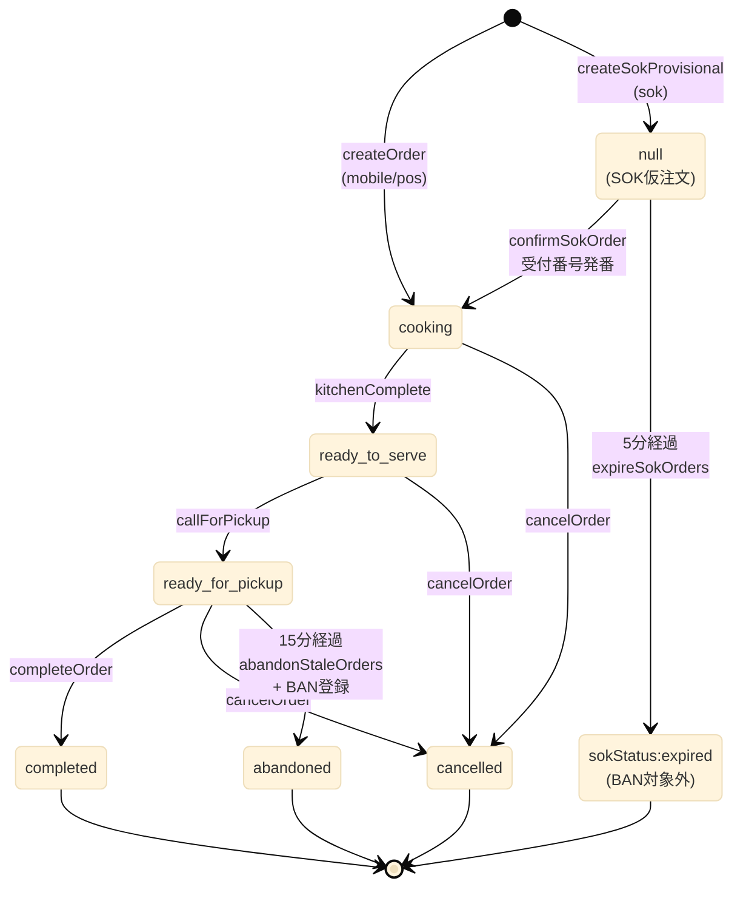
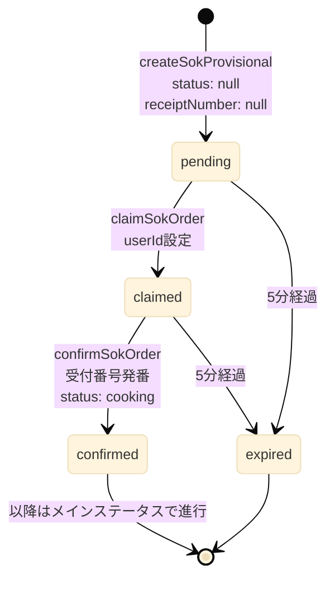
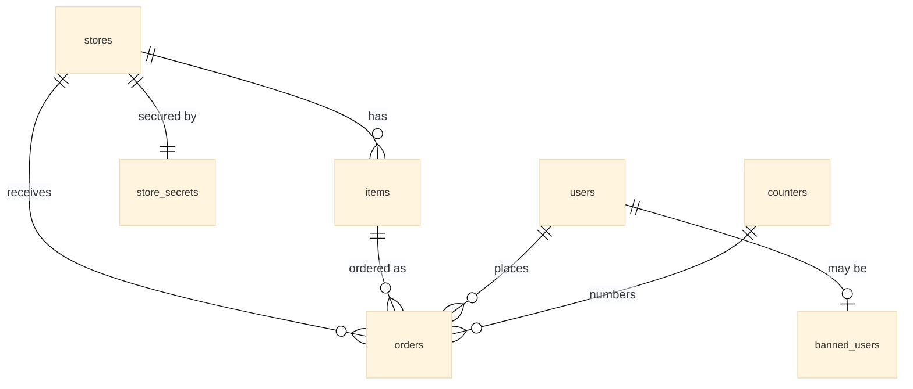
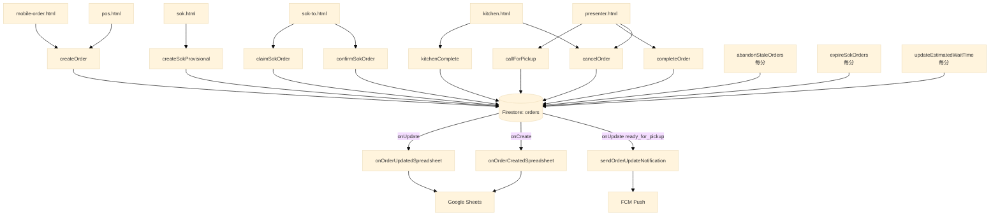
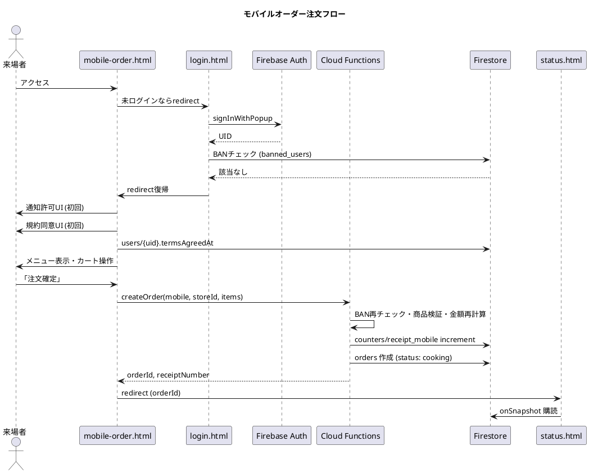
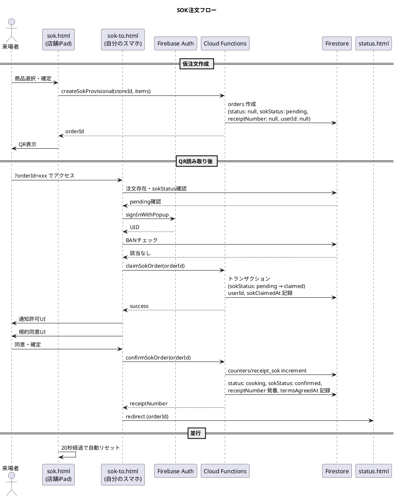
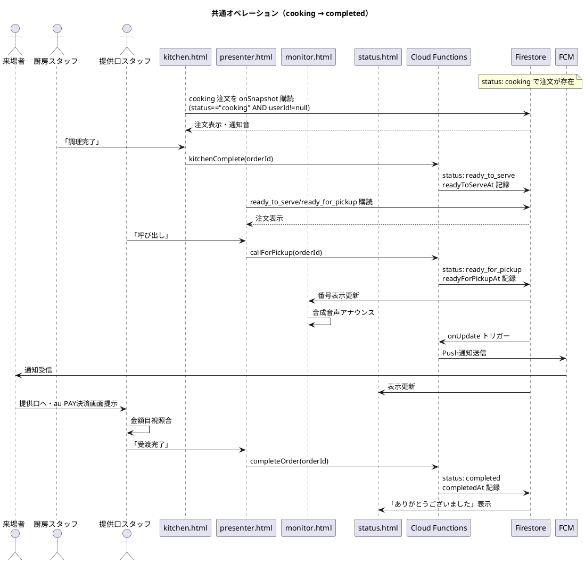
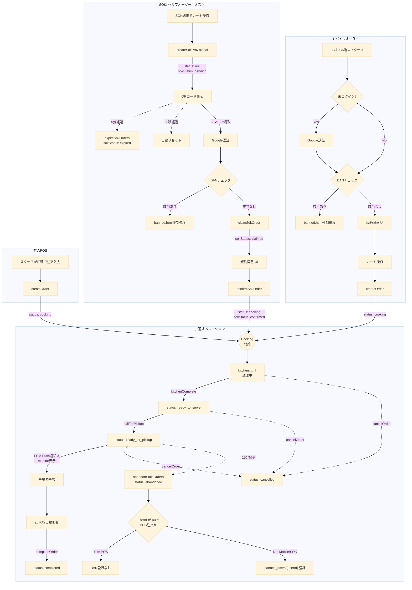
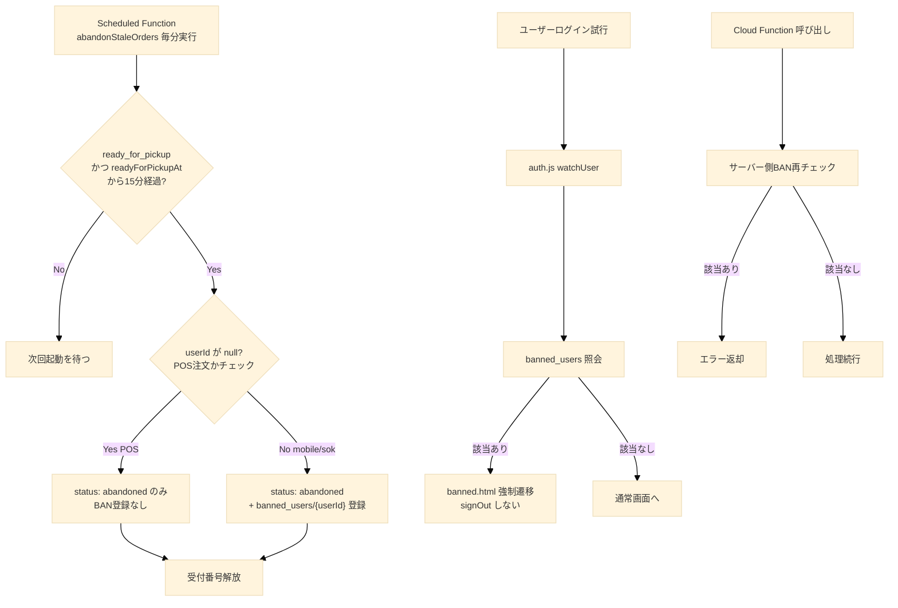

# 南陵祭2026 POS・モバイルオーダーシステム 設計憲法

**版**: 1.0
**発行日**: 2026年5月25日
**位置づけ**: 本ドキュメントは唯一の真実の源泉（SSOT）である。他のすべてのドキュメント・実装はこれに従う。本ドキュメントと矛盾する記述は他のドキュメントが誤りである。

---

## 1. ステータス機械

### 1.1 メインステータス `orders.status`

| 値                 | 意味                                                           |
| ------------------ | -------------------------------------------------------------- |
| `null`             | SOK 仮注文（未確定）専用。`sokStatus` で進行管理する           |
| `cooking`          | 調理中。注文確定と同時にこの状態で開始し、kitchen に表示される |
| `ready_to_serve`   | 調理完了・提供口で最終準備中                                   |
| `ready_for_pickup` | 呼び出し中・受け取り待ち                                       |
| `completed`        | 提供完了                                                       |
| `cancelled`        | キャンセル（人為的）                                           |
| `abandoned`        | 15分放置による強制終了（BAN付随）                              |

**重要**: 「調理開始」操作は存在しない。注文確定と同時に `cooking` から開始する。

### 1.2 メインステータス遷移表

| 現在               | 次                 | トリガー関数                     | 記録フィールド                       | 実行主体            |
| ------------------ | ------------------ | -------------------------------- | ------------------------------------ | ------------------- |
| (none)             | `cooking`          | `createOrder`                    | `createdAt`                          | client (mobile/pos) |
| (none)             | `null`             | `createSokProvisional`           | `createdAt`                          | client (sok端末)    |
| `null`             | `cooking`          | `confirmSokOrder`                | `termsAgreedAt`, `receiptNumber`発番 | client (sok-to)     |
| `cooking`          | `ready_to_serve`   | `kitchenComplete`                | `readyToServeAt`                     | kitchen             |
| `ready_to_serve`   | `ready_for_pickup` | `callForPickup`                  | `readyForPickupAt`                   | presenter           |
| `ready_for_pickup` | `completed`        | `completeOrder`                  | `completedAt`                        | presenter           |
| 任意               | `cancelled`        | `cancelOrder`                    | `cancelledAt`, `cancellationReason`  | presenter/kitchen   |
| `ready_for_pickup` | `abandoned`        | `abandonStaleOrders` (Scheduled) | `abandonedAt`                        | system              |
| 任意               | 任意               | `adminUpdateOrderStatus`         | 該当 + `note`                        | admin               |

### 1.3 ステータス遷移図（メイン）



### 1.4 SOK専用ステータス `orders.sokStatus`

SOK経路の注文のみ持つ。他経路では未定義。

| 値          | 意味                                     |
| ----------- | ---------------------------------------- |
| `pending`   | 仮注文作成済み・QR表示中・claim待ち      |
| `claimed`   | スマホ側でclaim済み・確定待ち            |
| `confirmed` | 確定済み（`status` も `cooking` に遷移） |
| `expired`   | 5分タイムアウトで失効（BAN対象外）       |

### 1.5 SOK専用ステータス遷移表

| 現在                   | 次          | トリガー関数                  | 記録フィールド                                     |
| ---------------------- | ----------- | ----------------------------- | -------------------------------------------------- |
| (none)                 | `pending`   | `createSokProvisional`        | `createdAt`                                        |
| `pending`              | `claimed`   | `claimSokOrder`               | `sokClaimedAt`, `userId`                           |
| `claimed`              | `confirmed` | `confirmSokOrder`             | `sokConfirmedAt`, `termsAgreedAt`, `receiptNumber` |
| `pending` or `claimed` | `expired`   | `expireSokOrders` (Scheduled) | `expiredAt`                                        |

### 1.6 SOKステータス遷移図



---

## 2. 経路定義

`orders.orderChannel` の値。経路の判別は本フィールドのみで行う。受付番号レンジは副次的識別手段とする。

| 値       | 経路                   | 利用者                           | 受付番号レンジ |
| -------- | ---------------------- | -------------------------------- | -------------- |
| `mobile` | モバイルオーダー       | 在校生（@gl.pen-kanagawa.ed.jp） | 7000–7999      |
| `sok`    | セルフオーダーキオスク | 一般来場者                       | 2000–2999      |
| `pos`    | 有人POSレジ            | レジ担当スタッフ経由             | 100–999        |

---

## 3. データモデル（フィールド辞書）

**本節に記載されていないフィールドは存在してはならない。**

### 3.1 `orders/{orderId}`

| フィールド           | 型                | 必須                 | 説明                                   |
| -------------------- | ----------------- | -------------------- | -------------------------------------- |
| `status`             | string \| null    | ✓                    | §1.1 参照                              |
| `sokStatus`          | string \| null    | sok時                | §1.4 参照                              |
| `orderChannel`       | string            | ✓                    | `mobile` / `sok` / `pos`               |
| `storeId`            | string            | ✓                    | 店舗ID                                 |
| `items`              | array&lt;map&gt;  | ✓                    | 商品配列（§3.1.1）                     |
| `totalPrice`         | number            | ✓                    | 合計金額（円・整数）                   |
| `receiptNumber`      | number \| null    | confirm後必須        | 受付番号。SOK仮注文中は `null`         |
| `userId`             | string \| null    | mobile/sok確定後必須 | 注文者UID。POSは常に `null`            |
| `createdBy`          | string \| null    | pos時必須            | 操作スタッフUID。mobile/sokは `null`   |
| `cancellationReason` | string \| null    | cancel時必須         | キャンセル理由                         |
| `note`               | string \| null    | admin変更時          | スタッフメモ・強制変更理由             |
| `termsAgreedAt`      | Timestamp \| null | mobile/sok必須       | 規約同意日時                           |
| `createdAt`          | Timestamp         | ✓                    | 注文作成日時                           |
| `readyToServeAt`     | Timestamp \| null | -                    | 調理完了日時                           |
| `readyForPickupAt`   | Timestamp \| null | -                    | 呼び出し日時（**ペナルティ基準時刻**） |
| `completedAt`        | Timestamp \| null | -                    | 提供完了日時                           |
| `cancelledAt`        | Timestamp \| null | -                    | キャンセル日時                         |
| `abandonedAt`        | Timestamp \| null | -                    | 放置強制終了日時                       |
| `sokClaimedAt`       | Timestamp \| null | sok時                | SOK claim日時                          |
| `sokConfirmedAt`     | Timestamp \| null | sok時                | SOK confirm日時                        |
| `expiredAt`          | Timestamp \| null | sok expire時         | SOK失効日時                            |
| `updatedAt`          | Timestamp         | ✓                    | 最終更新日時                           |

#### 3.1.1 `items` 配列要素

| フィールド       | 型               | 説明                               |
| ---------------- | ---------------- | ---------------------------------- |
| `itemId`         | string           | 商品ID                             |
| `name`           | string           | 商品名（注文時点スナップショット） |
| `price`          | number           | 単価（注文時点スナップショット）   |
| `quantity`       | number           | 数量                               |
| `customizations` | array&lt;map&gt; | カスタマイズ（§3.1.2）             |

#### 3.1.2 `customizations` 配列要素

| フィールド | 型     | 説明             |
| ---------- | ------ | ---------------- |
| `mode`     | string | `ADD` / `NO`     |
| `target`   | string | 対象トッピング名 |

### 3.2 `users/{uid}`

| フィールド            | 型                  | 必須 | 説明                                                         |
| --------------------- | ------------------- | ---- | ------------------------------------------------------------ |
| `email`               | string              | ✓    | メールアドレス                                               |
| `displayName`         | string \| null      | -    | 表示名                                                       |
| `photoURL`            | string \| null      | -    | プロフィール画像URL                                          |
| `notificationEnabled` | boolean             | ✓    | 通知許可状態                                                 |
| `fcmToken`            | string \| null      | -    | FCMトークン（単一端末分）                                    |
| `permissionStatus`    | string              | ✓    | `granted` / `denied` / `default` / `skipped` / `unsupported` |
| `deviceType`          | string              | -    | `ios_or_mac` / `other`                                       |
| `termsAgreedAt`       | Timestamp \| null   | -    | 初回規約同意日時                                             |
| `favoriteItemIds`     | array&lt;string&gt; | -    | お気に入り商品ID配列                                         |
| `createdAt`           | Timestamp           | ✓    | 初回ログイン日時                                             |
| `lastLoginAt`         | Timestamp           | ✓    | 最終ログイン日時                                             |

### 3.3 `stores/{storeId}`

| フィールド             | 型             | 必須 | 説明                              |
| ---------------------- | -------------- | ---- | --------------------------------- |
| `name`                 | string         | ✓    | 出店団体正式名称                  |
| `teamName`             | string         | ✓    | 来場者向け店舗名                  |
| `loginId`              | string         | ✓    | 店舗ログイン識別子                |
| `place`                | string         | ✓    | 出店場所                          |
| `floor`                | number         | ✓    | 階数                              |
| `description`          | string         | -    | 店舗説明                          |
| `operationStatus`      | string         | ✓    | `preparing` / `open` / `closed`   |
| `displayOrder`         | number         | ✓    | 表示順                            |
| `spreadsheetId`        | string         | ✓    | スプレッドシートID                |
| `spreadsheetUrl`       | string         | ✓    | スプレッドシートURL               |
| `estimatedWaitMinutes` | number \| null | -    | 推定待ち時間（Scheduled自動算出） |
| `createdAt`            | Timestamp      | ✓    | -                                 |
| `updatedAt`            | Timestamp      | ✓    | -                                 |

### 3.4 `items/{storeId}_{itemId}`

| フィールド        | 型                  | 必須 | 説明               |
| ----------------- | ------------------- | ---- | ------------------ |
| `storeId`         | string              | ✓    | 店舗ID             |
| `name`            | string              | ✓    | 商品名             |
| `description`     | string              | -    | 商品説明           |
| `price`           | number              | ✓    | 価格（円・整数）   |
| `imageUrl`        | string \| null      | -    | 画像URL            |
| `isAvailable`     | boolean             | ✓    | 販売中フラグ       |
| `isRecommended`   | boolean             | -    | おすすめフラグ     |
| `allowedToppings` | array&lt;string&gt; | -    | 選択可能トッピング |
| `displayOrder`    | number              | ✓    | 表示順             |
| `createdAt`       | Timestamp           | ✓    | -                  |
| `updatedAt`       | Timestamp           | ✓    | -                  |

### 3.5 `counters/{counterName}`

ドキュメントID: `receipt_pos` / `receipt_mobile` / `receipt_sok`

| フィールド  | 型        | 説明         |
| ----------- | --------- | ------------ |
| `current`   | number    | 直近発番値   |
| `updatedAt` | Timestamp | 最終発番日時 |

### 3.6 `banned_users/{uid}`

| フィールド | 型             | 説明                                        |
| ---------- | -------------- | ------------------------------------------- |
| `bannedAt` | Timestamp      | BAN日時                                     |
| `reason`   | string         | 理由（`abandoned_order` / `manual_ban` 等） |
| `orderId`  | string \| null | 原因注文ID                                  |
| `bannedBy` | string         | `auto_scheduler` または実行者UID            |

### 3.7 `store_secrets/{storeId}`

クライアントアクセス完全禁止。

| フィールド  | 型        | 説明               |
| ----------- | --------- | ------------------ |
| `hash`      | string    | パスワードハッシュ |
| `salt`      | string    | ソルト             |
| `updatedAt` | Timestamp | -                  |

### 3.8 `venues` 系コレクション

注文フローと独立。コレクション名のみ列挙: `venues`, `venue_admin_config`, `venue_admin_sessions`。詳細は別ドキュメントに委譲。

### 3.9 `_metadata/master_sync`

| フィールド  | 型        | 説明           |
| ----------- | --------- | -------------- |
| `version`   | string    | 同期バージョン |
| `updatedAt` | Timestamp | 同期日時       |

### 3.10 データモデル関係図



---

## 4. Cloud Functions（API契約）

### 4.1 注文作成系

| 関数名                 | 入力                                                  | 出力                         | 副作用                                                                   | 呼び出し元        |
| ---------------------- | ----------------------------------------------------- | ---------------------------- | ------------------------------------------------------------------------ | ----------------- |
| `createOrder`          | `{ orderChannel: "mobile" \| "pos", storeId, items }` | `{ orderId, receiptNumber }` | `orders` 作成（status: cooking）・受付番号発番・BAN/規約検証             | mobile-order, pos |
| `createSokProvisional` | `{ storeId, items }`                                  | `{ orderId }`                | `orders` 仮作成（status: null, sokStatus: pending, receiptNumber: null） | sok               |
| `claimSokOrder`        | `{ orderId }`                                         | `{ success: true }`          | `userId` 設定・`sokStatus: claimed`（トランザクション競合防止）          | sok-to            |
| `confirmSokOrder`      | `{ orderId }`                                         | `{ receiptNumber }`          | 受付番号発番・`sokStatus: confirmed`・`status: cooking` へ               | sok-to            |

### 4.2 ステータス遷移系

| 関数名                   | 入力                             | 遷移                                  | 権限                       |
| ------------------------ | -------------------------------- | ------------------------------------- | -------------------------- |
| `kitchenComplete`        | `{ orderId }`                    | `cooking` → `ready_to_serve`          | store_admin                |
| `callForPickup`          | `{ orderId }`                    | `ready_to_serve` → `ready_for_pickup` | store_admin                |
| `completeOrder`          | `{ orderId }`                    | `ready_for_pickup` → `completed`      | store_admin                |
| `cancelOrder`            | `{ orderId, reason }`            | 任意 → `cancelled`                    | store_admin                |
| `adminUpdateOrderStatus` | `{ orderId, newStatus, reason }` | 任意 → 任意                           | super_admin or store_admin |

### 4.3 Scheduled Functions（毎分実行）

| 関数名                    | 対象                                                           | 処理                                                                    |
| ------------------------- | -------------------------------------------------------------- | ----------------------------------------------------------------------- |
| `abandonStaleOrders`      | `status == ready_for_pickup` かつ `readyForPickupAt <= 15分前` | `abandoned` 化・`banned_users` 登録                                     |
| `expireSokOrders`         | `sokStatus in [pending, claimed]` かつ `createdAt <= 5分前`    | `sokStatus: expired`・BAN対象外                                         |
| `updateEstimatedWaitTime` | 全 `stores`                                                    | `cooking`/`ready_to_serve` の件数から `estimatedWaitMinutes` を自動算出 |

### 4.4 トリガー系（Firestore onCreate/onUpdate）

| 関数名                        | トリガー                                      | 処理                                 |
| ----------------------------- | --------------------------------------------- | ------------------------------------ |
| `onOrderCreatedSpreadsheet`   | `orders` onCreate                             | スプレッドシート行追加               |
| `onOrderUpdatedSpreadsheet`   | `orders` onUpdate                             | スプレッドシート行更新               |
| `sendOrderUpdateNotification` | `orders` onUpdate（`ready_for_pickup`遷移時） | `users/{userId}.fcmToken` へPush送信 |

### 4.5 その他

| 関数名            | 役割                             |
| ----------------- | -------------------------------- |
| `loginVenueAdmin` | venues管理者認証（注文フロー外） |

### 4.6 関数間データフロー



---

## 5. 経路別注文フロー

### 5.1 モバイルオーダー

1. `mobile-order.html` でログイン状態確認 → 未ログインなら `login.html?mode=student&redirect=...`
2. BANチェック（クライアント側・auth.js）
3. 通知許可UI（初回または未設定時）
4. 規約同意UI（初回または未同意時）→ `users/{uid}.termsAgreedAt` 記録
5. 店舗選択・メニュー閲覧・カート操作（ローカル変数のみ・Firestore保存なし）
6. `createOrder({ orderChannel: "mobile", storeId, items })` 呼び出し → `status: cooking` で作成
7. `status.html?orderId=...` へ遷移

### 5.2 SOK

**SOK端末側 (`sok.html`)**:

1. 起動時 `?storeId=` 取得
2. メニュー表示・カート操作
3. `createSokProvisional({ storeId, items })` 呼び出し → `status: null` / `sokStatus: pending`
4. QRコード表示（URL: `sok-to.html?orderId=...`）
5. 20秒で自動リセット または「次の人へ」ボタン

**スマホ側 (`sok-to.html`)**: 6. `?orderId=` 取得・注文存在/有効性確認7. Google認証（`signInWithPopup`、ドメイン制限なし）8. BANチェック9. `claimSokOrder({ orderId })` 呼び出し → `sokStatus: claimed` 10. 通知許可UI 11. 規約同意UI 12. `confirmSokOrder({ orderId })` 呼び出し → 受付番号発番・`status: cooking` / `sokStatus: confirmed` 13. `status.html?orderId=...` へ遷移

### 5.3 有人POS

1. スタッフが `pos.html` を開いている（`portal.html` 経由で認証済み）
2. 来場者の口頭注文をスタッフが入力
3. `createOrder({ orderChannel: "pos", storeId, items })` 呼び出し → `status: cooking`
4. 受付番号を画面表示・紙に手書きで来場者に手渡し
5. 規約同意UIなし・status.html遷移なし

### 5.4 共通オペレーション（注文確定後）

1. 注文作成 → `status: cooking`
2. `kitchen.html` に表示・通知音再生
3. 厨房スタッフが「調理完了」→ `kitchenComplete` → `ready_to_serve`
4. 提供口スタッフが「呼び出し」→ `callForPickup` → `ready_for_pickup`
5. 一斉通知（monitor表示・音声・FCM Push・status.html更新）
6. 来場者が提供口へ・au PAY手動QR決済・スタッフ目視照合
7. 提供口スタッフが「受渡完了」→ `completeOrder` → `completed`

### 5.5 シーケンス図（モバイルオーダー）



### 5.6 シーケンス図（SOK）



### 5.7 シーケンス図（共通オペレーション）



### 5.8 全体統合フローチャート



---

## 6. ファイル配置

### 6.1 来場者向け画面

| ファイル         | パス                    |
| ---------------- | ----------------------- |
| 認証集約画面     | `main/login.html`       |
| アカウント       | `main/account.html`     |
| BAN画面          | `main/banned.html`      |
| モバイルオーダー | `pos/mobile-order.html` |
| ステータス確認   | `pos/status.html`       |
| SOK端末          | `pos/sok.html`          |
| SOKスマホ引継ぎ  | `pos/sok-to.html`       |

### 6.2 スタッフ向け画面

| ファイル             | パス                 |
| -------------------- | -------------------- |
| ポータル（認証ハブ） | `pos/portal.html`    |
| 有人POS              | `pos/pos.html`       |
| 厨房KDS              | `pos/kitchen.html`   |
| 提供口               | `pos/presenter.html` |
| モニター             | `pos/monitor.html`   |

### 6.3 共通モジュール

| ファイル             | パス                   |
| -------------------- | ---------------------- |
| 認証・Firebase初期化 | `main/auth.js`         |
| 共通UIシェル         | `main/app-shell.js`    |
| SSOTデータ           | `main/data/data.js`    |
| データ同期ツール     | `main/admin_sync.html` |

---

## 7. 受付番号発番ルール

### 7.1 基本方針

- 経路ごとに独立した `counters/receipt_{channel}` ドキュメントで管理
- Firestore トランザクションでアトミックに `FieldValue.increment(1)` を実行
- レンジ上限到達時はレンジ最小値に循環
- アクティブな注文と番号衝突しない番号のみ発番（衝突時はリトライ）

### 7.2 番号レンジ

| 経路     | 最小値 | 最大値 | レンジサイズ |
| -------- | ------ | ------ | ------------ |
| `pos`    | 100    | 999    | 900          |
| `mobile` | 7000   | 7999   | 1000         |
| `sok`    | 2000   | 2999   | 1000         |

### 7.3 アクティブ・非アクティブ判定

| ステータス         | 区分                     | 番号         |
| ------------------ | ------------------------ | ------------ |
| `null` (SOK仮注文) | アクティブだが番号未発番 | -            |
| `cooking`          | アクティブ               | 再利用不可   |
| `ready_to_serve`   | アクティブ               | 再利用不可   |
| `ready_for_pickup` | アクティブ               | 再利用不可   |
| `completed`        | 非アクティブ             | **再利用可** |
| `cancelled`        | 非アクティブ             | **再利用可** |
| `abandoned`        | 非アクティブ             | **再利用可** |

### 7.4 発番アルゴリズム（疑似コード）

```javascript
async function getNextReceiptNumber(channel) {
  const ranges = {
    pos: { min: 100, max: 999 },
    mobile: { min: 7000, max: 7999 },
    sok: { min: 2000, max: 2999 },
  };
  const { min, max } = ranges[channel];
  const rangeSize = max - min + 1;

  return await firestore.runTransaction(async (tx) => {
    const counterRef = firestore.doc(`counters/receipt_${channel}`);
    const counterSnap = await tx.get(counterRef);
    let candidate = (counterSnap.data()?.current ?? min - 1) + 1;

    for (let attempt = 0; attempt < rangeSize; attempt++) {
      if (candidate > max) candidate = min;

      const isActive = await checkActiveOrderExists(channel, candidate, tx);
      if (!isActive) {
        tx.set(
          counterRef,
          {
            current: candidate,
            updatedAt: serverTimestamp(),
          },
          { merge: true },
        );
        return candidate;
      }
      candidate++;
    }
    throw new Error("受付番号の空きが存在しません");
  });
}
```

### 7.5 発番タイミング

| 経路   | 発番タイミング                                                      |
| ------ | ------------------------------------------------------------------- |
| mobile | `createOrder` 内で同時発番                                          |
| pos    | `createOrder` 内で同時発番                                          |
| sok    | `confirmSokOrder` 内で発番（`createSokProvisional` では発番しない） |

---

## 8. セキュリティルール要約

| コレクション         | read                                                                                     | create                  | update                  | delete      |
| -------------------- | ---------------------------------------------------------------------------------------- | ----------------------- | ----------------------- | ----------- |
| `orders`             | 自身（userId一致） / SOK pending仮注文 / `ready_for_pickup`の限定フィールド（monitor用） | ❌（Functions経由のみ） | ❌（Functions経由のみ） | ❌          |
| `items`              | 全員                                                                                     | store_admin             | store_admin             | store_admin |
| `stores`             | 全員                                                                                     | store_admin             | store_admin             | ❌          |
| `users/{uid}`        | 本人                                                                                     | 本人                    | 本人                    | 本人        |
| `banned_users/{uid}` | 本人のみ                                                                                 | ❌                      | ❌                      | ❌          |
| `store_secrets`      | ❌                                                                                       | ❌                      | ❌                      | ❌          |
| `counters`           | staff                                                                                    | ❌（Functions経由のみ） | ❌（Functions経由のみ） | ❌          |

### 8.1 `orders` 読み取りルール詳細

```javascript
match /orders/{orderId} {
  allow read: if
    // 自身の注文
    (request.auth != null && request.auth.uid == resource.data.userId)
    // SOK未確定仮注文（claim前の閲覧用）
    || (resource.data.orderChannel == "sok"
        && resource.data.sokStatus == "pending")
    // monitor.html 用の限定公開（status, receiptNumber, storeId のみ）
    || (resource.data.status == "ready_for_pickup"
        && /* 取得フィールド制限 */);

  allow create, update, delete: if false;
}
```

---

## 9. 認証要件

| 経路・画面       | 認証方式           | ドメイン制限                                                |
| ---------------- | ------------------ | ----------------------------------------------------------- |
| モバイルオーダー | Google認証         | `@gl.pen-kanagawa.ed.jp` + 開発者特例 `ynrcs1000@gmail.com` |
| SOK              | Google認証         | なし                                                        |
| POS              | スタッフGoogle認証 | `@gl.pen-kanagawa.ed.jp` + 開発者特例                       |
| 全スタッフ画面   | Google認証         | 同上                                                        |
| 匿名認証         | **使用しない**     | -                                                           |

---

## 10. 規約同意・BAN

### 10.1 規約同意

| 経路     | 同意取得                  | 記録先                                                           |
| -------- | ------------------------- | ---------------------------------------------------------------- |
| モバイル | 初回または未同意時        | `users/{uid}.termsAgreedAt` + `orders.termsAgreedAt`             |
| SOK      | 各注文時（`sok-to.html`） | `users/{uid}.termsAgreedAt`（初回のみ） + `orders.termsAgreedAt` |
| POS      | **取得しない**            | -                                                                |

### 10.2 BAN

- 自動BAN: `abandonStaleOrders` Scheduled Function が `banned_users/{uid}` に登録
- SOK expire は **BAN対象外**
- POS注文（`userId: null`）は **BAN対象外**
- BANチェック: クライアント側（`auth.js` の `watchUser()`）+ サーバー側（`createOrder` 等の冒頭）の二層
- BAN該当者は `main/banned.html` に強制遷移・ログアウトしない（閉じ込め設計）
- BAN自動解除なし・手動解除のみ

### 10.3 BANフロー



---

## 11. 「実装しない」確定リスト

以下は本システムでは実装しない:

- au PAY API連携
- メール通知
- SMS通知
- 数値による在庫管理（`isAvailable` 真偽値のみ）
- 外部スタッフ認証
- 来場者間メッセージ
- 多言語対応
- オフライン動作
- レコメンデーション
- ポイント・スタンプ
- 受付番号予約
- 事前予約注文
- 領収書発行
- 自動混雑予測（ただし Scheduled による待ち時間自動算出は実装する）
- 出店団体間連携
- 匿名認証
- 「調理開始」ボタン（`accepted` ステータス）

---

## 12. 未実装リスト（本番までに実装する）

- `pos/sok.html`
- `pos/sok-to.html`
- `main/banned.html`
- `createSokProvisional` 関数
- `claimSokOrder` 関数
- `confirmSokOrder` 関数
- `abandonStaleOrders` Scheduled Function
- `expireSokOrders` Scheduled Function
- `updateEstimatedWaitTime` Scheduled Function
- `banned_users` への自動記録処理
- `banned_users` への BAN チェック（クライアント・サーバー二層）

---

## 13. 改訂履歴

| 版  | 日付       | 内容                         |
| --- | ---------- | ---------------------------- |
| 1.0 | 2026-05-25 | 初版確定。設計憲法として制定 |

---

**END OF DOCUMENT**
