# 南陵祭2026 POS・モバイルオーダーシステム 設計計画書

**バージョン**: 1.1  
**発行日**: 2026年5月  
**発行**: 神奈川県立横浜南陵高校 コンピュータ科学部  
**プロジェクト**: 南陵祭2026 ウェブサイト & モバイルオーダー

---

## 第1章 はじめに

### 1.1 本書の目的

本書は、第24回南陵祭（2026年度）において運用される POS（Point of Sale、販売時点情報管理）システム、およびモバイルオーダーシステムの全体設計を記述した仕様書である。

本書が記述する対象は以下の通りである。

- システム全体のアーキテクチャ（構成）
- 採用技術とその選定理由
- 認証・認可（誰が何にアクセスできるか）の設計
- データベースの構造
- 画面ごとの役割と責務
- 注文経路ごとの処理フロー
- 注文受付から商品提供までの共通フロー
- 放置キャンセル防止のためのペナルティ機構
- セキュリティ設計と既知の構造的限界
- 当日の運用と障害発生時の対応
- 本システムで実装しないと決定した機能
- 現状実装と本書仕様との差分および移行作業項目

本書は、本システムが「文化祭当日にどのように動作するべきか」を完成形として記述したものであり、実装中の暫定状態や移行プロセスの詳細は第12章にのみ集約されている。第1章から第11章までは、すべて完成形の仕様としてお読みいただきたい。

### 1.2 本書の読み方

本書は、本システムの開発・運用に携わる関係者を広く対象として執筆されている。システムを俯瞰したい読者は第1章・第2章を、認証やデータ設計の詳細を知りたい読者は第3章・第4章を、当日の運用手順を確認したい読者は第10章を参照されたい。

技術用語は初出時に括弧書きで簡単に説明する形式を採用しており、専門的な背景がなくとも主要な概念を把握しながら読み進められるよう配慮している。

### 1.3 南陵祭におけるPOSシステムの位置づけ

南陵祭は、神奈川県立横浜南陵高校の生徒および出店団体が主体となって運営する文化祭である。例年、出店団体は紙の整理券・紙の伝票・現金または手動QR決済を組み合わせて販売を行ってきた。

2026年度の南陵祭においては、以下の課題に対応するため、本POSシステムを試験導入する。

**混雑緩和**  
人気店舗では注文待ち行列が発生し、来場者の体験を損なうとともに、隣接通路の安全確保にも影響を与える。モバイルオーダーにより、来場者が物理的な行列に並ばずに注文を確定できる仕組みを提供する。

**注文精度の向上**  
紙伝票による注文受付では、書き損じ・読み違いが発生しやすい。デジタル化された注文管理により、厨房と提供口の間で注文情報が完全に一致することを保証する。

**売上集計の自動化**  
紙伝票による集計は文化祭終了後の作業負荷を増大させ、また集計ミスの原因となる。本システムでは Google スプレッドシートへのリアルタイム書き出しにより、集計作業を実質的に不要とする。

**現金取扱の廃止**  
学校の方針により、文化祭での現金取扱は禁止されている。すべての決済は au PAY による手動QRコード決済で行われる。本システムは現金取扱を一切前提としない設計となっている。

### 1.4 試験導入年度としての位置づけ

2026年度の南陵祭は、本POSシステムの試験導入年度として位置づけられる。出店団体のうち、希望する団体に限定して本システムを利用してもらう運用とする。本書執筆時点で利用団体数は未確定であるが、最大で6団体程度を想定している。

試験導入年度であることから、以下の方針を採用する。

- 障害発生時には即座に紙運用へ切り替えられる体制を整備する
- 出店団体には事前にトレーニングを実施し、システム利用に習熟していただく
- 当日はコンピューター科学部によるサポート体制を確保する
- 本システムが機能不全に陥った場合でも、文化祭そのものの運営に支障が出ないよう、フォールバック手順を明確化する

### 1.5 本書の構成

本書は以下の章立てで構成される。

**第1章 はじめに**（本章）  
本書の目的、対象読者、システムの位置づけを記述する。

**第2章 システム全体像**  
アーキテクチャ全体を俯瞰し、フロントエンド・バックエンド・外部連携サービスの三層構造を解説する。採用技術とその選定理由を述べる。

**第3章 認証・認可設計**  
誰が何にアクセスできるかを規定する認証・認可の仕組みを記述する。Googleアカウントによるログイン、ドメイン制限、匿名認証、BANチェックなどの仕組みを扱う。

**第4章 データモデル設計**  
Cloud Firestore上のすべてのコレクション構造、注文ドキュメントのフィールド、注文ステータスの遷移、受付番号の体系を完全に文書化する。

**第5章 画面構成と責務**  
本システムを構成する全HTMLファイルの役割を一覧化し、画面遷移を明確化する。

**第6章 シナリオ別注文フロー**  
モバイルオーダー、セルフオーダーキオスク（SOK）、有人POSレジの3つの注文経路について、それぞれのフローを詳細に記述する。

**第7章 共通オペレーションフロー**  
注文受付後の調理から商品提供までの、3経路共通のフローを記述する。

**第8章 放置ペナルティ機構**  
呼び出し後に商品を受け取らない来場者を検出し、利用停止とする仕組みを記述する。

**第9章 セキュリティ設計**  
Firestoreセキュリティルール、App Check、ドメイン制限による多層防御を記述する。同時に、本システムが原理的に防げない構造的限界についても誠実に記述する。

**第10章 運用・障害対応**  
当日のスタッフ役割分担、トレーニング体制、障害発生時の紙運用への切り替え手順を記述する。

**第11章 本システムで実装しない機能**  
過去の検討において候補に挙がったが、本システムでは実装しないと決定された機能を明示する。

**第12章 現状実装と本書仕様との差分（移行作業項目）**  
本書の完成形仕様に、現状の実装を揃えるために必要な修正作業を一覧化する。本章は移行完了後に陳腐化する性質のものであり、本書の他章とは独立して読める構成となっている。

**第13章 付録**  
用語集、全シーケンス図の再掲、Cloud Functions関数一覧などを収録する。

### 1.6 本書の文体および表記規則

本書は仕様書として、以下の文体および表記規則に従って記述されている。

**文体**  
である調で統一する。主観的な表現（「思う」「考える」など）は使用せず、決定事項として記述する。

**用語**  
技術用語は初出時に括弧書きで簡単に説明する。例: 「Firestore（Googleが提供するクラウド型データベース）」。完全な技術解説は行わないが、文脈で意味が取れる程度の補足を加える。


**未確定事項の明示**  
本書執筆時点で未確定の事項については、その箇所に「※本項目は本書執筆時点で未確定である」と注釈を入れる。

**過去への言及の不在**  
本書は完成形のみを記述する。過去のバージョン、設計変更の経緯、廃止された機能への言及は第12章を除き行わない。

---
## 第2章 システム全体像

### 2.1 アーキテクチャ概観

本システムは、フロントエンド（来場者および出店団体スタッフが操作するウェブブラウザ）、バックエンド（Google が提供する Firebase 基盤）、外部連携サービス（au PAY、Google スプレッドシート等）の三層構造で構成される。

各層の役割は以下の通りである。

**フロントエンド**は、ウェブブラウザ上で動作する HTML、CSS、JavaScript で構成される静的ファイル群である。来場者は自身のスマートフォンのブラウザから、出店団体スタッフは設置された iPad またはノートPCのブラウザから、それぞれ本システムにアクセスする。フロントエンドは画面の描画とユーザー操作の受付を担当し、データの永続化や決済処理などはすべてバックエンドに委譲する。

**バックエンド**は、Firebase が提供する複数のクラウドサービスを組み合わせて構成される。データベース、認証、サーバーサイド処理、リアルタイム通知の各機能を提供する。フロントエンドとは Firebase SDK（Software Development Kit、ソフトウェア開発キット）を介して通信する。

**外部連携サービス**は、Firebase の枠外で本システムと連携する第三者のサービスである。決済を担当する au PAY、売上データの可視化を担当する Google スプレッドシートなどがこれに該当する。

以下に全体構成図を示す。

```plantuml
@startuml system_architecture
title 南陵祭2026 POSシステム 全体構成図

' A4幅に固定しつつ、文字サイズを維持・拡大
scale 800 width
skinparam defaultFontSize 14
skinparam maxMessageSize 80

skinparam componentStyle rectangle
skinparam packageStyle rectangle
skinparam wrapWidth 100

package "フロントエンド (GitHub Pages)" #LightBlue {
  package "来場者向け画面" {
    [mobile-order.html]
    [sok.html]
    [sok-to.html]
    [status.html]
    [account.html]
    [login.html]
  }
  package "スタッフ向け画面" {
    [portal.html]
    [pos.html]
    [kitchen.html]
    [presenter.html]
    [monitor.html]
  }
}

package "バックエンド (Firebase)" #LightGreen {
  [Firebase Authentication] as Auth
  [Cloud Firestore] as Firestore
  [Cloud Functions] as Functions
  [Cloud Storage] as Storage
  [Firebase Cloud Messaging] as FCM
  [Firebase App Check] as AppCheck
  [Scheduled Functions] as Scheduler
}

package "外部連携サービス" #LightCoral {
  [au PAY] as AuPay
  [Google Sheets] as Sheets
  [Google Apps Script] as GAS
  [reCAPTCHA v3] as Recaptcha
}

' 縦並びを強制
"フロントエンド (GitHub Pages)" -[hidden]down-> "バックエンド (Firebase)"
"バックエンド (Firebase)" -[hidden]down-> "外部連携サービス"

[mobile-order.html] --> Auth
[mobile-order.html] --> Firestore
[mobile-order.html] --> Functions
[mobile-order.html] --> FCM

[sok.html] --> Functions
[sok.html] --> Firestore

[sok-to.html] --> Auth
[sok-to.html] --> Firestore
[sok-to.html] --> FCM

[status.html] --> Firestore
[status.html] --> FCM

[login.html] --> Auth
[account.html] --> Auth
[account.html] --> Firestore

[portal.html] --> Auth
[portal.html] --> Firestore
[portal.html] --> Storage

[pos.html] --> Functions
[pos.html] --> Firestore
[kitchen.html] --> Firestore
[presenter.html] --> Firestore
[monitor.html] --> Firestore

Functions --> Firestore
Functions --> Sheets
Scheduler --> Firestore
AppCheck --> Recaptcha
Sheets <-- GAS

note right of AuPay
  決済は店頭設置のQRコードを
  来場者スマホで読み取り、
  手動で実行する。
  本システムからAPI連携は行わない。
end note

@enduml
```

### 2.2 フロントエンド

#### 2.2.1 ホスティング

フロントエンドの全静的ファイルは、GitHub Pages（GitHub が提供する無料の静的ファイルホスティングサービス）にホストされる。具体的なURLは以下の通りである。

```
https://ynr-cs.github.io/nanryosai-2026/
```

このURL配下に、`main/login.html`、`pos/portal.html`、`pos/kitchen.html` などの全HTMLファイルが配置される。来場者および出店団体スタッフは、このURLを起点として各画面にアクセスする。

GitHub Pages を採用した理由は以下の通りである。

**無料**  
コンピュータ科学部の予算制約下において、ホスティングコストをゼロとできることは大きな利点である。

**バージョン管理との統合**  
ソースコードを管理する Git リポジトリと同一のサービスでホスティングが行えるため、デプロイ作業が `git push` のみで完結する。

**HTTPS の標準対応**  
GitHub Pages はすべてのサイトで HTTPS（暗号化された通信）が標準で有効となる。Firebase Authentication は HTTPS 環境を前提としているため、この対応は必須である。

**静的ファイルのみで完結する設計に適合**  
本システムのフロントエンドはサーバーサイドの動的処理を一切持たず、すべて静的ファイルで構成される。GitHub Pages の制約と本システムの設計方針が完全に一致する。

#### 2.2.2 採用技術

フロントエンドはビルドツールを使用しないシンプルな構成を採用する。

**HTML、CSS、JavaScript（Vanilla JS）**  
React、Vue.js などのフレームワーク、TypeScript、Webpack などのビルドツールは一切使用しない。すべて素のHTML、CSS、JavaScript（Vanilla JS、フレームワーク非依存のJavaScript）で記述される。

**ES Modules（ECMAScript Modules）**  
JavaScript のモジュール機構として、ブラウザ標準のES Modulesを使用する。`import`、`export` 文によりファイル間でコードを共有する。

**Firebase SDK（JavaScript版）**  
Firebase へのアクセスは公式の JavaScript SDK 経由で行う。SDK は CDN（Content Delivery Network、コンテンツ配信網）から動的に読み込まれる。

この技術選定の理由は以下の通りである。

**ビルド環境の不要化**  
ビルドツールを導入すると、Node.js のバージョン管理、依存パッケージの管理、ビルド設定ファイルの保守などの追加作業が発生する。これらを排除することで、保守の負担を軽減する。

**GitHub Pages との適合性**  
GitHub Pages はビルド済みの静的ファイルをそのまま配信する。Vanilla JS で書かれたコードはビルド不要でそのまま動作する。

**起動の高速化**  
フレームワークを使用しないため、ページの初期読み込みが軽量となる。可能な限り高速に画面を表示できる。

### 2.3 バックエンド

バックエンドは Firebase（Googleが提供するアプリケーション開発プラットフォーム）の各サービスを組み合わせて構成される。本システムでは以下の Firebase サービスを使用する。

#### 2.3.1 Firebase Authentication

ユーザー認証を担当するサービスである。本システムでは以下の認証方式を使用する。

**Googleアカウントによるログイン**  
来場者および出店団体スタッフは、自身の Google アカウントでログインする。Firebase Authentication が Googleの認証基盤と連携し、ユーザーIDの発行と認証セッションの管理を行う。

**匿名認証**  
SOK経由で注文する来場者など、Googleアカウントでのログインが不要なケースでは、匿名認証によって一時的なユーザーIDを発行する。匿名認証で作成されたアカウントは、後から Google アカウントに昇格（紐付け）することが可能である。

認証方式の詳細は第3章で扱う。

#### 2.3.2 Cloud Firestore

注文情報、商品マスタ、店舗情報、ユーザー情報など、システムが扱う永続データを保持するクラウド型データベースである。

**リージョン**  
本システムが使用する Cloud Firestore のリージョンは `asia-northeast1`（東京）である。日本国内のユーザーが主な利用者であるため、地理的に最も近いリージョンを選択している。これにより、データベースアクセスの遅延を最小化する。

**リアルタイム同期**  
Firestore は `onSnapshot` というリアルタイム同期機能を提供する。あるクライアントがデータを更新すると、同じデータを監視している他のクライアントに即座に変更が反映される。本システムでは、厨房・提供口・モニター・ステータス確認など各画面が、注文ステータスの変化をリアルタイムに受信する仕組みとしてこの機能を活用する。

データモデルの詳細は第4章で扱う。

#### 2.3.3 Cloud Functions

サーバーサイドの処理を実行する仕組みである。フロントエンドから直接実行できない、または実行すべきでない処理を Cloud Functions が担当する。

**用途**  
本システムでは Cloud Functions を以下の用途で使用する。

- 注文の作成（受付番号の安全な発番、在庫チェック、トランザクション処理）
- 注文ステータス変更時のスプレッドシート書き込み
- 注文ステータス変更時のPush通知送信
- 放置注文の検出とペナルティ実行（Scheduled Function、第8章で詳述）
- 会場管理者の認証（独自セッショントークン発行）

**リージョン**  
Cloud Functions のリージョンは `asia-northeast1`（東京）である。Firestore と同一リージョンに配置することで、関数からデータベースへのアクセス遅延を最小化する。

**世代の使い分け**  
Cloud Functions には第一世代（1st gen）と第二世代（2nd gen）の二つの世代が存在する。本システムでは両世代を併用し、関数の特性に応じて使い分ける。

第一世代を使用する関数は、システムの基幹となる同期的処理である。具体的には以下が該当する。

- `getNextReceiptNumber`: 受付番号のアトミックな発番
- `createOnlineOrder`: モバイルオーダーの注文作成
- `loginVenueAdmin`: 会場管理者の認証

第二世代を使用する関数は、Firestore のドキュメント変更を契機とするトリガー型の非同期処理である。具体的には以下が該当する。

- `onOrderCreatedSpreadsheet`: 注文作成時のスプレッドシート書き込み
- `onOrderUpdatedSpreadsheet`: 注文更新時のスプレッドシート書き込み

第一世代と第二世代の使い分け基準は、第二世代がより新しく機能が豊富であるが、一部の旧API（呼び出し方式や認証連携の詳細）が変更されているため、既存資産との互換性が必要な基幹関数では第一世代を維持し、新規追加のトリガー関数では第二世代を採用するという方針である。

#### 2.3.4 Cloud Storage

商品画像などのバイナリファイル（画像、動画など）を保管するストレージサービスである。

**用途**  
出店団体が `portal.html` 経由でアップロードする商品画像を Cloud Storage に保管する。アップロード時には、フロントエンド側で画像を WebP 形式に変換・軽量化してから送信する。これにより、ストレージ容量と通信量の両方を削減する。

**リージョン**  
Cloud Storage のリージョンは `us-central1`（米国中部）である。Firestore および Cloud Functions が `asia-northeast1` であるのに対し、Cloud Storage のみ異なるリージョンを採用する理由は、Firebase の無料枠（無償で利用できる範囲）の都合による。Cloud Storage は `us-central1` でのみ無料枠が提供されるため、本システムのコスト要件に基づきこのリージョンを選択している。

商品画像の表示は来場者のブラウザから直接 Cloud Storage の公開URLを参照する形で行うため、リージョンの違いによる遅延は実用上問題とならない。

#### 2.3.5 Firebase Cloud Messaging（FCM）

ウェブブラウザにPush通知を送信するサービスである。来場者がサイトを閉じている状態でも、商品の準備完了などの重要な通知を端末に届けることができる。

**用途**  
本システムでは以下のタイミングで FCM による Push通知を送信する。

- 注文の調理が開始されたとき
- 商品が呼び出し中（提供準備完了）になったとき
- 注文がキャンセルされたとき

通知を受け取るためには、来場者がブラウザで通知許可を与えている必要がある。許可は `mobile-order.html` の初回ログイン時、または `sok-to.html` のSOK引き継ぎ時に取得する。

#### 2.3.6 Firebase App Check

不正なAPIリクエストを遮断するサービスである。本システムが配布したフロントエンドからのリクエストのみを Firebase バックエンドが受け付けるよう制限する役割を持つ。

**仕組み**  
App Check は reCAPTCHA v3（Googleが提供する高度なボット検出サービス）と連携する。フロントエンドが Firebase API を呼び出す前に、reCAPTCHA v3 からトークンを取得し、そのトークンを Firebase が検証する。トークンが正当でない場合、リクエストは拒否される。

**ウォームアップ戦略**  
App Check のトークン取得は、初期化時にあらかじめ非同期で実行される。ユーザー操作（ログインボタン押下など）と同時にトークン取得を行うと、ポップアップブロックの原因となる可能性があるためである。事前にトークンを取得しておくことで、ユーザー操作のタイミングではトークン取得済みの状態となり、ポップアップブロックを回避する。

#### 2.3.7 Scheduled Functions

定期的に自動実行されるサーバーサイド処理である。Cloud Functions の一機能として提供される。

**用途**  
本システムでは、放置注文（呼び出し後15分経過しても受け取られない注文）を検出し、ペナルティを実行する処理に Scheduled Functions を使用する。1分ごとに自動起動し、対象注文を検索して必要な更新を行う。

詳細は第8章で扱う。

### 2.4 外部連携サービス

#### 2.4.1 au PAY

KDDI が提供するQRコード決済サービスである。本システムにおける唯一の決済手段である。

**運用方式**  
本システムは au PAY のAPIとは連携せず、店頭での手動QRコード決済方式を採用する。各出店団体は店頭にau PAYのQRコードを掲示し、来場者は商品受け取り時に自身のスマートフォンでQRコードを読み取り、表示された支払いフォームに金額を手入力して決済を実行する。決済完了画面をスタッフに提示し、目視確認の上で商品が引き渡される。

**決済時刻の集約**  
すべての決済は、商品提供のタイミング（提供口での受け渡し時）に行われる。注文時点での決済は行わない。これにより、混雑により注文が処理できなくなった場合のキャンセル対応が容易となる。

**現金との関係**  
学校の方針により、現時点で文化祭での取引はほぼすべてがAUPになっていることから、本システム自体は現金取扱を一切想定しない。

#### 2.4.2 Google Sheets（Googleスプレッドシート）

クラウド型の表計算サービスである。本システムでは売上データの可視化と分析の出力先として使用する。

**書き込みの仕組み**  
注文の作成および更新が発生すると、Cloud Functions の `onOrderCreatedSpreadsheet` および `onOrderUpdatedSpreadsheet` 関数がトリガーされ、対応する出店団体のスプレッドシートに自動でデータが追記される。各出店団体は自身のスプレッドシートをリアルタイムに参照することで、当日の売上状況を把握できる。

**店舗ごとの分離**  
各出店団体には専用のスプレッドシートが割り当てられる。店舗のメタデータ（`stores` コレクション）には `spreadsheetId` フィールドが存在し、書き込み先のスプレッドシートを特定する。

#### 2.4.3 Google Apps Script（GAS）

Googleが提供するスクリプト実行環境である。本システムでは、Google スプレッドシート上での集計や帳票出力など、文化祭終了後の事後処理に GAS を活用する。本システムのリアルタイム動作には直接関与しない。

#### 2.4.4 reCAPTCHA v3

Googleが提供する高度なボット検出サービスである。Firebase App Check のトークン発行のバックエンドとして利用される。来場者は意識的に reCAPTCHA を操作することはなく、バックグラウンドで自動的にスコアリングが行われる。

### 2.5 データの流れ

注文が作成されてから商品が提供されるまでの、データの流れを示す。

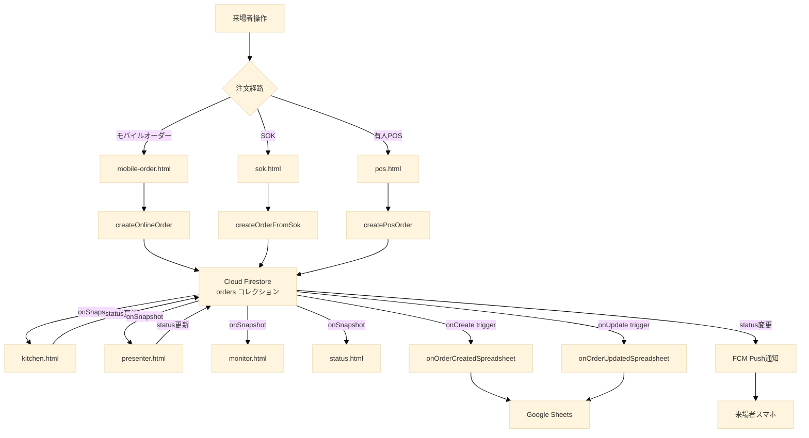

このデータフローの特徴は以下の通りである。

**注文作成は必ず Cloud Functions 経由**  
モバイル、SOK、POSのいずれの経路でも、注文の作成は Cloud Functions を経由する。フロントエンドから Firestore への直接書き込みは Firestore セキュリティルールにより禁止されている。これにより、受付番号の重複防止、在庫チェック、注文金額の正当性確認などをサーバー側で確実に実行できる。

**ステータス更新はリアルタイム伝播**  
注文ステータスが変化すると、`onSnapshot` を監視している各画面（厨房、提供口、モニター、ステータス確認など）に即座に伝播する。リロード操作を必要とせず、各スタッフや来場者は常に最新の状態を確認しながら行動できる。

**スプレッドシート書き込みは非同期**  
注文作成・更新はフロントエンドへの応答を遅らせず、スプレッドシート書き込みは Cloud Functions のトリガーとしてバックグラウンドで実行される。スプレッドシート書き込みに失敗しても、注文処理そのものには影響しない。

### 2.6 採用技術一覧表

本章で述べた技術スタックを以下の表にまとめる。

| 領域 | 技術・サービス | 役割 | リージョン等 |
|---|---|---|---|
| ホスティング | GitHub Pages | 静的ファイル配信 | グローバル |
| マークアップ | HTML5 | 画面構造 | - |
| スタイル | CSS3 | 画面装飾 | - |
| スクリプト | Vanilla JavaScript (ES Modules) | 動的処理 | - |
| 認証 | Firebase Authentication | Google認証・匿名認証 | グローバル |
| データベース | Cloud Firestore | データ永続化・リアルタイム同期 | asia-northeast1 |
| サーバー処理 | Cloud Functions (1st gen) | 基幹処理 | asia-northeast1 |
| サーバー処理 | Cloud Functions (2nd gen) | トリガー処理 | asia-northeast1 |
| 定期実行 | Cloud Scheduler / Cloud Functions | 放置検出 | asia-northeast1 |
| ストレージ | Cloud Storage | 商品画像保管 | us-central1 |
| 通知 | Firebase Cloud Messaging | Web Push通知 | グローバル |
| セキュリティ | Firebase App Check | 不正リクエスト遮断 | グローバル |
| ボット検出 | reCAPTCHA v3 | App Checkトークン発行 | グローバル |
| 決済 | au PAY | 手動QR決済 | 日本 |
| 集計出力 | Google Sheets | 売上データ可視化 | グローバル |
| 集計処理 | Google Apps Script | 事後集計 | グローバル |

### 2.7 まとめ

本章では、本システムが Firebase を中核とする三層構造で構成されること、フロントエンドはビルド不要の Vanilla JavaScript で記述されることを示した。au PAY との API 連携は行わず、決済はすべて店頭での手動QR方式に統一されている。リージョン選定はコストとパフォーマンスのバランスから、Firestore および Cloud Functions は東京、Cloud Storage は米国中部となっている。

次章では、これらの基盤の上で動作する認証・認可の仕組みを詳述する。

---
## 第3章 認証・認可設計

### 3.1 章の目的

本章では、本システムにおける認証（Authentication、ユーザーが誰であるかを確認すること）と認可（Authorization、認証されたユーザーが何を行えるかを規定すること）の設計を記述する。

本システムは、来場者と出店団体スタッフという性質の異なる二種類の利用者を抱える。それぞれの利用者に適切な認証手段を提供し、かつ不正な利用を防ぐための設計を以下に詳述する。

### 3.2 認証エントリーポイントの設計方針

本システムでは、認証エントリーポイント（ログイン処理を行う画面）を二つに集約する。

**`login.html`**  
来場者向けの認証エントリーポイントである。`mobile-order.html`、`account.html` などすべての来場者向け画面は、認証が必要なアクションを行う際に `login.html` へリダイレクトする。`login.html` 自身が独立してログイン処理を完結させ、認証完了後に元の画面へ戻る。

**`portal.html`**  
出店団体スタッフおよび実行委員向けの認証ハブである。`pos.html`、`kitchen.html`、`presenter.html`、`monitor.html` の各スタッフ画面は、独立したログイン画面を持たない。未ログイン状態でこれらの画面にアクセスすると、すべて `portal.html` へ強制的にリダイレクトされ、そこで認証および店舗権限の確認が行われる。

この二系統に集約する設計の利点は以下の通りである。

**保守性の向上**  
ログイン処理のコードが二箇所のみに存在することで、認証ロジックの変更は最小限のファイル修正で完結する。

**ユーザー体験の一貫性**  
来場者は常に `login.html` の同じUIを通じてログインするため、複数の画面ごとに異なるログイン画面に遭遇する混乱が生じない。

**セキュリティ集約**  
ドメイン制限、BANチェック、利用規約同意の取得などのセキュリティ・コンプライアンス処理を、二箇所に集約して確実に実装できる。

### 3.3 来場者向け認証 (`login.html`)

#### 3.3.1 担う責務の一覧

`login.html` は以下の責務を担う。

- Googleアカウントによるログイン処理
- 在校生確認モード（`?mode=student` クエリパラメータが付与された場合）の表示と分岐
- 一般来場者モード（クエリパラメータなしまたは `?mode=guest`）の表示と分岐
- ドメインチェック（`@gl.pen-kanagawa.ed.jp` の検証）
- BANチェック（`banned_users` コレクションへの照会）
- ログイン後の遷移先決定（`?redirect=` クエリパラメータの解釈と検証）
- 既ログイン状態の検出と自動リダイレクト
- ポップアップブロック発生時のガイダンスUI表示
- 利用規約への同意取得（初回ログイン時）

#### 3.3.2 ログイン方式: Popup-only 戦略

Firebase Authentication は、Googleアカウントによるログインを実装するために二つの方式を提供している。一つは `signInWithPopup`（ポップアップウィンドウで認証する方式）、もう一つは `signInWithRedirect`（同じウィンドウ内でGoogleの認証ページへ遷移する方式）である。

本システムは `signInWithPopup` のみを使用する Popup-only 戦略を採用する。

**Popup-only 戦略を採用する理由**  
GitHub Pages 上にホストされたサイトは、Google の認証ドメインに対してサードパーティCookie（異なるドメイン間で共有されるCookie）の制限を受ける。`signInWithRedirect` 方式は、リダイレクト後に元のサイトへ戻る際にサードパーティCookieが必要となるが、現代のブラウザはこの方式に対するCookieアクセスを既定で制限している。結果として、`signInWithRedirect` は本システムの環境では正常に動作しない。

`signInWithPopup` 方式は、別ウィンドウで認証を完結させ、認証結果をJavaScriptのメッセージング機構で元のウィンドウに伝達する。この方式はサードパーティCookieに依存しないため、GitHub Pages 環境でも確実に動作する。

**ポップアップブロック対策**  
`signInWithPopup` はブラウザがポップアップウィンドウを開けることを前提としている。スマートフォンのブラウザや、ポップアップブロック設定が有効なブラウザでは、ログインボタンを押してもポップアップが開かない場合がある。

本システムは、ポップアップが開けなかった場合（`auth/popup-blocked` エラー）を検出し、ユーザーに対して「ブラウザの設定からポップアップを許可してから、再度ログインボタンを押してください」というガイダンスUIを自動表示する。これにより、技術的な失敗を放置せず、ユーザーの再試行を促す。

#### 3.3.3 在校生モードと一般来場者モード

`login.html` は、起動時のクエリパラメータ `?mode` の値により、二つのモードに分岐する。

**在校生モード (`?mode=student`)**  
モバイルオーダー (`mobile-order.html`) からのリダイレクトでこのモードが起動する。在校生モードでは、ログインに使用できるアカウントが `@gl.pen-kanagawa.ed.jp` ドメイン（および後述する開発者特例アカウント）に限定される。

在校生モードのフローは以下の通りである。

1. 「あなたは在校生ですか？」という確認画面を表示する
2. 「はい」を選択した場合、学校アカウントの利用に関する注意事項を表示する
3. 「理解しました」を押下後、Googleログインのポップアップを表示する
4. 認証成功後、ログインしたアカウントのメールアドレスがドメイン要件を満たすかチェックする
5. ドメイン要件を満たさない場合、「対象外アカウント」画面を表示し、ログアウトとアカウント切替を促す
6. ドメイン要件を満たす場合、`?redirect=` で指定された元の画面へ遷移する

**一般来場者モード (`?mode=guest` またはパラメータなし)**  
直前の「あなたは在校生ですか？」という質問で「いいえ」を選択した来場者、または既に一般来場者としてログイン済みのユーザー向けに提供されるモードである。一般来場者モードでは、ドメインによる制限は行われず、任意のGoogleアカウントでログイン可能である。ただし、モバイルオーダー機能は利用できない。

一般来場者モードのフローは以下の通りである。

1. 「Googleアカウントでログイン」ボタンを表示する
2. 押下時にGoogleログインのポップアップを表示する
3. 認証成功後、ゲストウェルカム画面（お気に入り等の機能案内）を表示する
4. 利用可能な機能の案内後、`?redirect=` で指定された元の画面へ遷移する

#### 3.3.4 ドメイン制限の根拠

在校生モードで `@gl.pen-kanagawa.ed.jp` ドメインに限定する理由は、以下の通りである。

**配布範囲の特定性**  
`@gl.pen-kanagawa.ed.jp` は、神奈川県教育委員会が運営する Google for Education 環境のドメインである。`gl` は generalized login、`pen-kanagawa` は神奈川県教育委員会を意味する。このドメインのアカウントは、神奈川県立高校に在籍する生徒および勤務する教員にのみ配布される。すなわち、このドメインのアカウントを所持していること自体が、神奈川県立高校の関係者であることを実質的に証明する。

**海外からの不正アクセスの防止**  
モバイルオーダー機能は来場者の物理的な来校を前提として設計されている。しかし、ウェブサイトはインターネット上に公開されているため、原理的には世界中のどこからでもアクセス可能である。ドメイン制限がない場合、海外からの不正注文（例: イギリスやブラジルの利用者が悪意で注文を作成し、商品の準備を妨害する）が技術的に可能となる。ドメイン制限により、このリスクを実質的に排除する。

**運用コストの低さ**  
ドメインによる制限は、Firebase Authentication の認証成功後に文字列パターンマッチで判定するのみであり、実装コストが極めて低い。にもかかわらず、一定の不正アクセス防止効果を持つ。

#### 3.3.5 ドメイン判定ロジック

ドメイン判定は以下のロジックで実装される。

```javascript
function isStudentEmail(email) {
  if (!email) return false;
  return (
    email.endsWith("@gl.pen-kanagawa.ed.jp") ||
    email === "ynrcs1000@gmail.com"
  );
}
```

`ynrcs1000@gmail.com` は開発者特例アカウントである。本システムの開発・テスト時に開発者が使用するアカウントとして、ドメイン制限の例外として許可される。このアカウントはスーパー管理者権限を持ち、本番運用中であっても全店舗のデータ閲覧および操作が可能である。

#### 3.3.6 教員のモバイルオーダー利用

教員は `@gl.pen-kanagawa.ed.jp` ドメインのアカウントを持つため、生徒と同一の認証フローでログインできる。ただし、教員は調理を行う側ではなく来場者として注文を行う立場であり、セルフオーダーキオスク（SOK）または有人POSを利用することを想定している。

外部スタッフ（OB・保護者ボランティア・業者など）は本システムの認証スコープ外である。運営作業が必要な場合は、生徒または教員の端末・アカウントを通じた代理操作で対応する運用とする。

#### 3.3.7 リダイレクト処理

`login.html` は、認証完了後の遷移先を `?redirect=` クエリパラメータで受け取る。リダイレクト処理は以下のセキュリティチェックを経て実行される。

**同一オリジン検証**  
`getSafeRedirect` 関数により、リダイレクト先URLが本システムと同じオリジン（同じプロトコル・ドメイン・ポート）であることを検証する。外部URLへのリダイレクトは拒否され、`portal.html` または `mobile-order.html` などの既定ページへフォールバックする。

これは、悪意ある第三者が `?redirect=https://attacker.example.com/` のようなURLを生成し、ログイン後に攻撃者のサイトへ誘導するオープンリダイレクト攻撃を防ぐ目的である。

**ループ防止**  
`?redirect=` の値が `login.html` 自身を指していた場合、無限リダイレクトループを防ぐためフォールバックページへ遷移する。

#### 3.3.8 既ログイン時の自動リダイレクト

`login.html` は、画面表示と並行して `onAuthStateChanged`（Firebase Authentication が提供する認証状態の監視機能）でユーザーのログイン状態を監視する。すでにログイン済みのユーザーが `login.html` にアクセスした場合、ログインフォームを表示せず、即座に `?redirect=` で指定された遷移先へ自動的に進む。これにより、すでにログインしている来場者が再度ログイン操作を要求されることを防ぐ。

### 3.4 SOK利用者向け認証: 匿名認証とGoogleアカウント昇格

#### 3.4.1 匿名認証の目的

セルフオーダーキオスク（SOK）を利用する来場者は、必ずしもGoogleアカウントを保持しているとは限らず、また保持していたとしてもログイン操作を強制することは利用体験を損なう。一方で、注文の追跡（自分の注文ステータスを確認する、Push通知を受け取る、他人の注文を覗き見させない）のためには、来場者ごとに一意のユーザーIDが必要である。

この要件を両立するため、本システムはSOK利用者に対して **匿名認証** を採用する。

**匿名認証の仕組み**  
Firebase Authentication が提供する匿名認証機能により、Googleアカウントへのログインを行うことなく、一時的なユーザーID（UID）を発行する。匿名認証されたユーザーは、Googleアカウントでログインしたユーザーと同様に、Firestore のセキュリティルールやFCMの登録などで「認証済みユーザー」として扱われる。

#### 3.4.2 匿名認証の発火タイミング

SOKフローにおける匿名認証は、`sok-to.html` を開いた時点で実行される。具体的には以下の流れである。

1. SOK端末 (`sok.html`) で来場者が商品選択を完了し、QRコードが表示される
2. 来場者が自身のスマートフォンでQRコードを読み取る
3. スマートフォンのブラウザで `sok-to.html?orderId=...` が開かれる
4. ページ初期化時に、`signInAnonymously` 関数により匿名認証を実行する
5. 匿名UIDが発行され、注文ドキュメントの `userId` フィールドに紐付けられる
6. 以降、来場者はこの匿名UIDで認証された状態となる

#### 3.4.3 注文紐付けの確定タイミング

`sok-to.html` を開いた時点で発行される匿名UIDが、その注文の正規の所有者として確定する。ここで重要な運用上の注意点は、SOK端末に表示されたQRコードを最初に読み取り `sok-to.html` を開いた来場者が、その注文の正規所有者となることである。

このため、SOK端末の画面には以下の趣旨のメッセージを大きく表示する。

```
QRコードが表示されたら、すぐにご自身のスマートフォンで読み取ってください。
最初に読み取った方が、注文者として確定します。
```

#### 3.4.4 Googleアカウントへの昇格

匿名認証されたユーザーは、後からGoogleアカウントでログインすることで、匿名アカウントを既存のGoogleアカウントに紐付ける（昇格させる）ことができる。

**昇格の仕組み**  
Firebase Authentication が提供する `linkWithCredential` 関数により、現在の匿名認証セッションに対してGoogleアカウントの認証情報を結びつける。結果として、匿名UIDは破棄され、Googleアカウントに対応する正規のUIDが代替として割り当てられる。匿名UIDで作成された注文ドキュメント等は、新しいUIDに引き継がれる。

**昇格の動機**  
SOK利用者がGoogleアカウントへの昇格を行う動機は以下のようなものが想定される。

- 注文履歴を `account.html` 上で永続的に確認したい
- お気に入り機能を利用したい
- 複数の端末から同じアカウントで注文ステータスを確認したい

**昇格の起点**  
昇格処理は `account.html` または `login.html` から実行する。`status.html` 上には昇格用のUIを設置しない。これは、`status.html` を純粋な「ステータス表示画面」として保つ設計方針による。`status.html` には「アカウント連携する」ボタンのみを配置し、押下時には `login.html` または `account.html` へ遷移する。

### 3.5 BANチェック機構

#### 3.5.1 BANの目的

放置キャンセル（呼び出し後に商品を受け取らない行為）を繰り返す利用者に対して、本システムへのアクセスを制限することで、商品廃棄の発生と他の来場者への迷惑を抑止する。

#### 3.5.2 `banned_users` コレクションの構造

利用停止対象となったユーザーは、Firestore の `banned_users` コレクションに記録される。コレクションの構造は以下の通りである。

```
banned_users/{uid}
├ bannedAt: Timestamp        // BAN記録日時
├ reason: string             // BAN理由（例: "abandoned_order"）
├ orderId: string            // 原因となった注文のID
└ bannedBy: string           // BAN実行者（"auto_scheduler" または実行者UID）
```

ドキュメントIDは、BAN対象となったユーザーのUIDそのものである。これにより、UIDをキーとした存在チェックが効率的に行える。

#### 3.5.3 BANチェックの実行タイミング

BANチェックは、以下のタイミングで実行される。

**ログイン直後（`login.html` および `portal.html`）**  
Googleアカウントでのログイン成功直後、認証されたユーザーのUIDをキーに `banned_users` コレクションを照会する。該当ドキュメントが存在する場合、ログインを中断し、エラーメッセージを表示する。

**匿名認証直後（`sok-to.html`）**  
匿名認証で発行されたUIDをキーに `banned_users` コレクションを照会する。該当する場合（理論上は新規UIDなので発生しないが、防御的に実装する）、注文確定処理を中断する。

**Googleアカウント昇格時**  
匿名アカウントをGoogleアカウントに昇格させる際、昇格先のGoogleアカウントUIDが `banned_users` に存在する場合、昇格処理を中断する。

#### 3.5.4 BAN該当時のUI

BANに該当するユーザーがログインを試みた場合、以下の趣旨のメッセージを表示する。

```
このアカウントは、過去の利用状況により本システムの利用が制限されています。
ご不明な点がある場合は、運営本部までお問い合わせください。
```

ログインセッションは即座に破棄され、認証状態は未ログインに戻される。

#### 3.5.5 15分放置キャンセルに伴う自動BAN（仕様定義済み・未実装）

本システムの運用において、最も警戒すべきリスクの一つが「商品の受け取り放棄」である。調理が完了し、呼び出しが開始されてから一定時間（15分）経過しても来場者が提供口に現れない場合、その注文は「放置された」とみなされる。

> **実装状態について**: 本機能は仕様として定義されているが、開発・テスト運用においてペナルティに抵触しやすく開発サイクルを阻害するため、現時点では**意図的に実装を保留**している。本番運用に向けて実装予定。

本機能が実装された場合、放置された注文に対しては以下の処理が自動的に実行される（詳細は第8章に記述）。

1. 注文ステータスを `abandoned`（放棄）に変更する
2. 当該ユーザーを `banned_users` コレクションに登録する

これにより、意図的ないたずら注文や、無責任な注文放棄を行ったユーザーは、次回以降の南陵祭期間中、本システムを利用した注文が一切行えなくなる。これは、限られた食材と調理時間を有効に活用し、真に商品を必要とする来場者への提供を優先するための措置である。

#### 3.5.6 BANの発生源

`banned_users` コレクションへの記録は、以下のいずれかの経路で発生する。

自動記録（Scheduled Function）
放置キャンセルを検出する `Scheduled Function` が、対象注文のユーザーUIDを自動的に `banned_users` に記録する。`bannedBy` フィールドには `"auto_scheduler"` が設定される。詳細は第8章で扱う。

**手動記録（運営による判断）**  
運営側の判断により、特定のユーザーを手動でBANする必要が生じた場合、Firebase Console から直接 `banned_users` コレクションにドキュメントを追加することで対応する。`bannedBy` フィールドには実行者のUIDを記録する。

### 3.6 利用規約への同意取得

#### 3.6.1 同意取得の目的

放置キャンセルに対するペナルティ（利用停止）を実行するためには、利用者が事前にペナルティの存在を認識し、合意していることが必要である。法的・倫理的観点の双方から、利用規約への明示的な同意を取得する仕組みを設ける。

#### 3.6.2 同意取得のタイミングと場所

同意取得は注文経路ごとに以下のタイミングで行われる。

**モバイルオーダー**  
`mobile-order.html` において、店舗選択画面を表示する直前に同意UIを表示する。来場者は規約を読み、同意のチェックボックスをオンにすることで店舗選択画面に進める。同意の事実とタイムスタンプは Firestore に記録される。

**SOK**  
`sok-to.html` において、注文確定ボタンを押す直前に同意UIを表示する。SOK端末側の `sok.html` ではなく、来場者自身のスマートフォン上で同意を取得する。これは、同意の主体が SOK端末の操作者ではなく、注文の正規所有者（=スマートフォンで `sok-to.html` を開いた来場者）であることを明確にする目的による。

**有人POS**  
有人POSでは規約同意UIは設置しない。これは以下の理由による。

- 有人POSを利用する来場者に対して、画面上での規約同意を求める運用が現実的でない
- 万一放置キャンセルが発生しても、有人POSでは紙の番号札を持つ利用者を特定する手段がない（=BAN自体を実行できない）

有人POSでは規約同意の代わりに、レジ担当スタッフが口頭で「商品ができたら呼び出しますので、必ず受け取りに来てください」と伝える運用とする。

#### 3.6.3 同意の記録方法

同意が取得されると、以下の情報が Firestore に記録される。

**注文ドキュメントへの記録**  
注文ドキュメント (`orders/{orderId}`) の `termsAgreedAt` フィールドにタイムスタンプを記録する。これにより、各注文に対して同意が取得済みであることを後から検証できる。

**ユーザードキュメントへの記録（任意）**  
モバイルオーダーの場合、`users/{uid}` ドキュメントにも初回同意のタイムスタンプを記録することで、二回目以降の注文時に再度の同意取得を省略する設計が可能である。ただし、本書執筆時点では各注文ごとに同意を取得する方針とする。


### 3.8 Firebase App Check との連携

認証は「ユーザーが誰であるか」を確認する仕組みであるが、Firebase App Check は「リクエストが正規のフロントエンドから発信されたものであるか」を確認する仕組みである。両者は補完関係にある。

**App Check が阻止するもの**  
本システムが配布した `mobile-order.html` などのフロントエンドを経由せず、攻撃者が独自のスクリプトから直接 Firebase API を呼び出す行為を阻止する。例えば、認証済みのユーザーが自身の認証トークンを使って、本来のフロントエンドが許可しない方法でAPIを大量に呼び出すような行為に対する防御となる。

**App Check の有効範囲**  
本システムでは、Cloud Firestore へのアクセス、Cloud Functions の呼び出し、Cloud Storage へのアクセスのすべてに対して App Check を有効化する。フロントエンドはページ初期化時に reCAPTCHA v3 からトークンを取得し、以降のすべてのAPI呼び出しにこのトークンを添付する。

**ユーザーへの透過性**  
App Check は来場者からは完全に透過的（不可視）に動作する。来場者は reCAPTCHA を意識的に操作することはなく、ページを閲覧する行動パターンや端末情報からバックグラウンドでスコアリングが行われる。

### 3.9 認証の全体フロー図

来場者がモバイルオーダーを利用する際の認証フローを以下に示す。

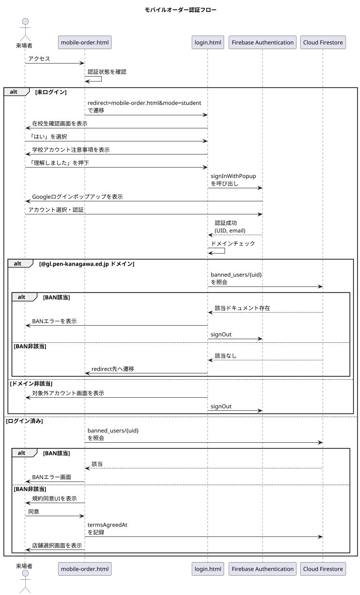

SOK利用時の認証フローを以下に示す。

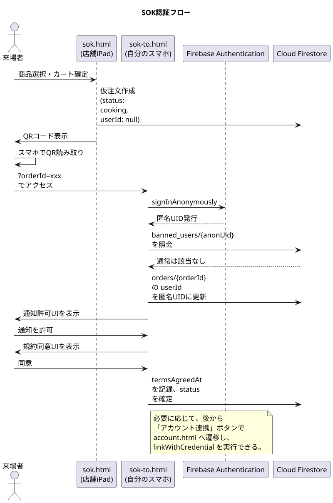

### 3.10 まとめ

本章では、本システムにおける認証・認可の設計を述べた。来場者向けは `login.html`、スタッフ向けは `portal.html` の二系統に集約され、それぞれ異なる要件に応じた認証フローを提供する。Googleアカウントによるログインは Popup-only 戦略で実装され、SOK利用者には匿名認証とGoogleアカウント昇格の仕組みが提供される。

ドメイン制限により海外からの不正アクセスを防ぎ、BANチェック機構により悪質な利用者を排除する。これらに加えて Firebase App Check が、フロントエンド以外からの不正なAPI呼び出しを阻止する多層防御を構成する。

次章では、これらの認証情報を含むすべてのデータを格納する Cloud Firestore の構造を詳述する。

---
## 第4章 データモデル設計

### 4.1 章の目的

本章では、本システムが Cloud Firestore 上に保持するすべてのデータの構造を完全に文書化する。コレクション（データの分類単位）の一覧、各コレクション内のドキュメント（データの個別レコード）が持つフィールド（項目）、フィールドの型と意味、データ間の関係を以下に詳述する。

本章はシステム全体の挙動を決定する設計図であり、後続の章（特に第6章のシナリオ別注文フロー、第7章の共通オペレーションフロー、第9章のセキュリティ設計）はすべて本章のデータ構造を前提として記述される。

本章では完成形の仕様のみを記述する。本書執筆時点で未実装である機能については、その箇所に未実装である旨を明記する。

### 4.2 Firestore の基本概念および命名規則

#### 4.2.1 基本概念

Cloud Firestore（Google が提供するクラウド型NoSQLデータベース）はドキュメント指向のデータベースである。本章を読む上で必要な基本概念を以下に整理する。

**ドキュメント (Document)**  
データの最小単位である。キーと値のペアで構成され、JSONに似た構造を持つ。各ドキュメントには一意のID（ドキュメントID）が付与される。

**コレクション (Collection)**  
ドキュメントを束ねる入れ物である。リレーショナルデータベースの「テーブル」に近い概念であるが、コレクション内のドキュメントが同じスキーマを持つことは強制されない。

**フィールド (Field)**  
ドキュメント内のキーと値のペアである。値の型として、文字列、数値、真偽値、タイムスタンプ、配列、マップ（入れ子オブジェクト）などが使用できる。

**Timestamp**  
日時を表す Firestore 固有の型である。サーバー側で記録された日時を、タイムゾーン情報を含めて保持する。

**トランザクション (Transaction)**  
複数のドキュメントへの読み書きを単一の原子的操作として実行する Firestore の機能である。本システムでは受付番号の発番処理で使用する。詳細は4.7節で扱う。

#### 4.2.2 命名規則

本システムでは以下の命名規則を採用する。

**コレクション名**  
複数形小文字とする。複数の単語を含む場合はスネークケース（単語間をアンダースコアで区切る）を用いる。例: `orders`、`store_secrets`。

**ドキュメントID**  
コレクションごとに規則が異なる。各コレクションの説明にて個別に定義する。

**フィールド名**  
キャメルケース（最初の単語は小文字、後続の単語の先頭を大文字）とする。例: `orderChannel`、`receiptNumber`。

**ステータス値・列挙値**  
小文字スネークケースとする。例: `ready_for_pickup`、`mobile`。

**タイムスタンプフィールド**  
「動詞過去形 + At」の形式で命名する。例: `createdAt`、`completedAt`、`readyForPickupAt`。

### 4.3 コレクション一覧

本システムが使用する全コレクションを以下に示す。

| コレクション名         | 種別             | 役割                         | 実装状況                                                    |
| ---------------------- | ---------------- | ---------------------------- | ----------------------------------------------------------- |
| `stores`               | マスタ           | 販売店舗のメタデータ         | 実装済                                                      |
| `items`                | マスタ           | 商品マスタ                   | 実装済                                                      |
| `orders`               | トランザクション | 注文データ                   | 実装済                                                      |
| `users`                | トランザクション | ユーザープロファイル         | 実装済                                                      |
| `counters`             | システム         | 受付番号発番カウンタ         | 実装済                                                      |
| `store_secrets`        | セキュリティ     | 店舗認証用機密情報           | 実装済                                                      |
| `venues`               | システム         | 会場ステータス管理           | 実装済                                                      |
| `venue_admin_config`   | セキュリティ     | 会場管理者認証設定           | 実装済                                                      |
| `venue_admin_sessions` | セキュリティ     | 会場管理者セッショントークン | 実装済                                                      |
| `_metadata`            | システム         | マスタ同期のバージョン管理   | 実装済                                                      |
| `banned_users`         | セキュリティ     | 利用停止対象ユーザー         | ※本コレクションへの自動記録処理は本書執筆時点で未実装である |

本システムでは、Firestore 上に `users/{uid}/cart` サブコレクションを保持しない。カート情報はクライアント側でローカル変数として保持し、注文確定時に Cloud Functions（Firebase 上で動作するサーバー処理）へ直接送信する。詳細は4.5.3節で扱う。

それぞれのコレクションの詳細を以下の節で記述する。

### 4.4 マスタ系コレクション

#### 4.4.1 `stores` コレクション

販売を行う各団体（店舗）のメタデータを保持する。展示のみを行う団体（メニュー販売を行わない団体）は本コレクションには登録されない。展示団体の情報はクライアント側の `data.js` にのみ保持される。

**ドキュメントID**  
店舗を一意に識別する固定IDである。`data.js` の `projectData[].id` の値をそのまま使用する。例: `101`、`taiyaki`。

**フィールド構造**

| フィールド       | 型        | 説明                                         |
| ---------------- | --------- | -------------------------------------------- |
| `name`           | string    | 出店団体の正式名称（例: 「2年A組」）         |
| `teamName`       | string    | 来場者向けの店舗名（例: 「たい焼きカフェ」） |
| `loginId`        | string    | 店舗ログインに使用する識別子                 |
| `place`          | string    | 出店場所（例: 「中庭テントA」）              |
| `floor`          | number    | 階数                                         |
| `description`    | string    | 店舗の説明文                                 |
| `isActive`       | boolean   | 店舗が営業中であるか否か                     |
| `displayOrder`   | number    | 店舗一覧画面における表示順                   |
| `spreadsheetId`  | string    | 売上連携先 Google スプレッドシートのID       |
| `spreadsheetUrl` | string    | スプレッドシートへの直接リンクURL            |
| `createdAt`      | Timestamp | レコード作成日時                             |
| `updatedAt`      | Timestamp | 最終更新日時                                 |

**スプレッドシート連携**  
本システムでは、すべての販売店舗が Google スプレッドシートとの自動連携を行う。注文の作成・更新時に対応するスプレッドシートへ自動で行が追記・更新される。`spreadsheetId` および `spreadsheetUrl` はすべての店舗において保持される必須フィールドである。

**用途**  
`stores` は `mobile-order.html` における店舗選択、`portal.html` における店舗管理、売上連携処理で参照される。

#### 4.4.2 `items` コレクション

各店舗が販売する商品のマスタデータを保持する。`items` は独立したトップレベルコレクションとして配置され、各商品ドキュメントは `storeId` フィールドにより特定の店舗に紐付けられる。

**ドキュメントID**  
`{storeId}_{itemId}` の形式で構成される明示IDである。`storeId` は `stores` コレクションのドキュメントID、`itemId` は `data.js` 内の `menu` 配列の各要素に付与された一意の識別子である。例: `101_yakisoba_sauce`、`101_potato`。

ドキュメントIDを明示化することにより、同期処理を冪等に実行できる。すなわち、同一の `data.js` を複数回同期しても、商品ドキュメントは増加せず、既存ドキュメントが上書きされる挙動となる。

**フィールド構造**

| フィールド        | 型                  | 説明                                                                           |
| ----------------- | ------------------- | ------------------------------------------------------------------------------ |
| `storeId`         | string              | この商品を販売する店舗のID                                                     |
| `name`            | string              | 商品名                                                                         |
| `description`     | string              | 商品説明文                                                                     |
| `price`           | number              | 販売価格（税込、円単位の整数）                                                 |
| `imageUrl`        | string \| null      | 商品画像のURL（Cloud Storage 上の公開URL）                                     |
| `isAvailable`     | boolean             | 販売中であるか否か。`false` の場合、UI上で「売切」または「販売停止」として表示 |
| `isRecommended`   | boolean             | おすすめ商品であるか否か                                                       |
| `allowedToppings` | array&lt;string&gt; | 選択可能なトッピング名の配列                                                   |
| `displayOrder`    | number              | 店舗内での表示順序                                                             |
| `createdAt`       | Timestamp           | レコード作成日時                                                               |
| `updatedAt`       | Timestamp           | 最終更新日時                                                                   |

**販売可否の管理**  
本システムでは数値による在庫数（個数）の自動減算は行わない。販売可否は `isAvailable` の真偽値のみで管理し、店舗責任者が `portal.html` 経由で手動で「販売中／売切」を切り替える運用とする。これは、文化祭という特殊な運用環境において、リアルタイムでの数値在庫管理が現実的でないとの判断による。

**トッピングの管理**  
トッピングは各商品ドキュメントの `allowedToppings` 配列で管理される。例えば「たい焼き」のドキュメントが `allowedToppings: ["あんこ", "クリーム", "チョコ"]` を持つ場合、注文時に来場者はこの3種類から選択できる。トッピングごとの追加料金は発生しない。トッピング個別の販売可否は管理しない。

**表示順序の管理**  
`displayOrder` フィールドは商品一覧画面における表示順を制御する。Firestore のドキュメント取得順は仕様上保証されないため、表示順を安定化するためには本フィールドを用いた `orderBy("displayOrder", "asc")` 句が必要である。

`displayOrder` の値は `data.js` の `menu` 配列のインデックス（0始まり）から自動採番される。すなわち、`data.js` 上で `menu` 配列の先頭に配置された商品が `displayOrder: 0` として登録され、画面上でも先頭に表示される。

**画像のアップロード**  
商品画像は `portal.html` から店舗責任者がアップロードする。アップロード時にはフロントエンド（Canvas API）で画像が WebP 形式に変換され、長辺1200ピクセルにリサイズされた後、Cloud Storage に保存される。保存後の公開URLが `imageUrl` フィールドに記録される。

### 4.5 トランザクション系コレクション

#### 4.5.1 `orders` コレクション

すべての注文データを保持する、本システムの中核となるコレクションである。注文経路の違いは `orderChannel` フィールドで表現され、注文の進行状態は `status` フィールドで表現される。

**ドキュメントID**  
Firestore により自動生成される一意のID。

**フィールド構造**

| フィールド           | 型                | 説明                                                                                                |
| -------------------- | ----------------- | --------------------------------------------------------------------------------------------------- |
| `status`             | string            | 注文の現在のステータス。詳細は4.6節                                                                 |
| `orderChannel`       | string            | 注文経路。`"pos"`、`"mobile"`、`"sok"` のいずれか                                                   |
| `storeId`            | string            | 注文先の店舗ID                                                                                      |
| `items`              | array&lt;map&gt;  | 注文された商品の配列                                                                                |
| `totalPrice`         | number            | 合計金額（円単位の整数）                                                                            |
| `receiptNumber`      | number            | 受付番号。詳細は4.7節                                                                               |
| `userId`             | string \| null    | 注文者のUID。`mobile` は必須、`pos` および `sok` は `null`                                          |
| `createdBy`          | string \| null    | POS注文の場合、操作したスタッフのUID。集計および監査用途で保持する。`mobile` および `sok` は `null` |
| `cancellationReason` | string \| null    | キャンセル時の理由                                                                                  |
| `note`               | string \| null    | スタッフによる手動メモ。`adminUpdateOrderStatus` Function による強制変更時に変更理由が記録される    |
| `createdAt`          | Timestamp         | 注文作成日時。本システムでは厨房工程開始時刻を兼ねる                                                |
| `readyToServeAt`     | Timestamp \| null | 調理完了日時                                                                                        |
| `readyForPickupAt`   | Timestamp \| null | 提供準備完了日時。**ペナルティ判定の基準時刻**                                                      |
| `completedAt`        | Timestamp \| null | 提供完了日時                                                                                        |
| `cancelledAt`        | Timestamp \| null | キャンセル日時                                                                                      |
| `abandonedAt`        | Timestamp \| null | 放置による強制終了日時                                                                              |
| `updatedAt`          | Timestamp         | 最終更新日時                                                                                        |

**`items` 配列の各要素の構造**

| サブフィールド   | 型               | 説明                                   |
| ---------------- | ---------------- | -------------------------------------- |
| `itemId`         | string           | `items` コレクションのドキュメントID   |
| `name`           | string           | 注文時点での商品名（スナップショット） |
| `price`          | number           | 注文時点での単価（スナップショット）   |
| `quantity`       | number           | 注文数量                               |
| `customizations` | array&lt;map&gt; | 選択されたカスタマイズの配列           |

**`customizations` 配列の各要素の構造**

| サブフィールド | 型     | 説明                                    |
| -------------- | ------ | --------------------------------------- |
| `mode`         | string | カスタマイズ種別。`"ADD"` または `"NO"` |
| `target`       | string | 対象トッピング名                        |

**スナップショット保持の理由**  
`items` 配列内には商品名と価格を直接保持する。これは、`items` コレクションのマスタが後から変更された場合でも、過去の注文の表示・集計が正しく行えるようにするためである。リレーショナルデータベース的な参照整合性ではなく、注文時点での情報を凍結する設計を採用する。

**経路情報の保持**  
注文がどの経路から作成されたかは、`orderChannel` フィールドの単一の値で表現される。受付番号のレンジから経路を推定するロジックは用いない。`orderChannel` の値と意味は以下の通りである。

| 値         | 意味                                                                                                                       |
| ---------- | -------------------------------------------------------------------------------------------------------------------------- |
| `"pos"`    | 有人POSレジ（`pos.html`）から作成された注文                                                                                |
| `"mobile"` | モバイルオーダー（`mobile-order.html`）から作成された注文                                                                  |
| `"sok"`    | セルフオーダー端末（`sok.html`）から作成された注文。※`sok.html` および対応する Cloud Function は本書執筆時点で未実装である |

**注文作成方針**  
注文作成は必ず Cloud Functions 経由で行う。クライアントは `storeId`、`itemId`、数量、カスタマイズのみを送信し、サーバー側で以下の処理を実施する。

1. 商品存在確認（`items` コレクションへの照会）
2. 店舗一致確認（`items.storeId` と注文の `storeId` の照合）
3. 販売可否確認（`isAvailable === true` の検証）
4. 価格再計算（クライアントから受け取った価格は信用しない）
5. 受付番号発番（4.7節参照）
6. 注文ドキュメントの作成

価格情報をクライアントから受け取った値ではなくサーバー側で再計算する設計により、クライアント改ざんによる不正注文を防止する。

#### 4.5.2 `users` コレクション

各ユーザーのプロファイル情報を保持する。本システムはGoogle認証のみを使用するため、すべてのユーザーがGoogleアカウントに紐づく。匿名認証は使用しない。

**ドキュメントID**  
Firebase Authentication（Firebase が提供する認証機構）により発行されたUID。

**フィールド構造**

| フィールド            | 型                  | 説明                                                                                            |
| --------------------- | ------------------- | ----------------------------------------------------------------------------------------------- |
| `email`               | string              | Googleアカウントのメールアドレス                                                                |
| `displayName`         | string \| null      | Googleアカウントの表示名                                                                        |
| `photoURL`            | string \| null      | Googleアカウントのプロフィール画像URL                                                           |
| `notificationEnabled` | boolean             | Push通知を許可しているか                                                                        |
| `fcmToken`            | string \| null      | FCM（Firebase Cloud Messaging）の登録トークン。単一端末分のみ保持                               |
| `permissionStatus`    | string              | 通知許可の状態（`"granted"`、`"denied"`、`"default"`、`"skipped"`、`"unsupported"` のいずれか） |
| `deviceType`          | string              | 端末種別（`"ios_or_mac"`、`"other"` のいずれか）                                                |
| `termsAgreedAt`       | Timestamp \| null   | 初回の規約同意日時                                                                              |
| `favoriteItemIds`     | array&lt;string&gt; | お気に入りに登録された商品ID配列                                                                |
| `createdAt`           | Timestamp           | 初回ログイン日時                                                                                |
| `lastLoginAt`         | Timestamp           | 最終ログイン日時                                                                                |

**利用規約同意の管理**  
利用規約への同意日時は `users.termsAgreedAt` のみで管理する。`orders` ドキュメント側には保持しない。これにより、ユーザーごとの初回同意日時を一意に追跡できる。

**お気に入り機能**  
`favoriteItemIds` 配列により、来場者は気に入った商品を保存できる。本フィールドへの追加・削除はクライアントから直接 Firestore に書き込まれる（`users/{uid}` への書き込み権限は本人にのみ許可される）。

#### 4.5.3 カート情報の取り扱い

カート情報は Firestore に永続化しない。来場者がモバイルオーダーで商品を選択している間、カート情報はブラウザ内のJavaScript変数にのみ保持される。

注文確定時、`mobile-order.html` は `createOrder` Cloud Function に対して `items` 配列を引数として直接渡す。Cloud Function 側では受け取った `items` 配列に基づき注文ドキュメントを作成する。

この設計により、Firestore への書き込み回数が削減され、カート同期処理に伴う二重書き込みも発生しない。ブラウザを閉じた場合カート内容は失われるが、文化祭という短時間の運用環境においてこの制約は許容される。

#### 4.5.4 `counters` コレクション

受付番号の連番を安全に発番するためのアトミックカウンタを保持するコレクションである。

**ドキュメント構成**  
本コレクションには、注文経路ごとに独立した3つのドキュメントを配置する。

| ドキュメントID            | 用途                                         |
| ------------------------- | -------------------------------------------- |
| `counters/receipt_pos`    | POS経路の受付番号カウンタ（100〜999）        |
| `counters/receipt_mobile` | モバイル経路の受付番号カウンタ（7000〜7999） |
| `counters/receipt_sok`    | SOK経路の受付番号カウンタ（2000〜2999）      |

経路ごとにドキュメントを分離することにより、トランザクションのロック範囲が経路ごとに独立する。すなわち、POS注文の発番処理とモバイル注文の発番処理が同時に発生しても相互にブロックしない。

**フィールド構造**

| フィールド  | 型        | 説明                 |
| ----------- | --------- | -------------------- |
| `current`   | number    | 直近に発番された番号 |
| `updatedAt` | Timestamp | 最終発番日時         |

番号レンジの最小値・最大値はドキュメントには保持せず、Cloud Functions のコード内に定数として定義される。レンジは運用中に変更されることが想定されないため、コード側での管理で十分である。

**アトミックな発番**  
受付番号の発番は Firestore のトランザクション機能を使用する。詳細は4.7節で扱う。

### 4.6 注文ステータスの定義

#### 4.6.1 ステータス値の一覧

注文の状態は `orders.status` フィールドの値で表現される。本システムが使用するステータス値は以下の6種類である。

| ステータス値       | 意味                                         |
| ------------------ | -------------------------------------------- |
| `cooking`          | 調理中。注文受付と同時にこの状態で開始される |
| `ready_to_serve`   | 調理完了。提供口で最終準備中                 |
| `ready_for_pickup` | 呼び出し中。来場者の受け取り待ち             |
| `completed`        | 商品提供完了。決済も完了                     |
| `cancelled`        | キャンセル。来場者または店舗都合             |
| `abandoned`        | 放置による強制終了。利用規約違反             |

これら6種類のステータスは、すべての注文経路（モバイル、SOK、POS）で共通である。経路の違いは `orderChannel` フィールドで表現され、ステータス値そのものには反映されない。

#### 4.6.2 各ステータスの詳細

**`cooking`（調理中）**  
注文ドキュメントが作成された直後の初期状態である。本システムでは「注文を受けた瞬間に厨房は調理に着手する」という運用前提のもと、専用の「調理開始」操作を設けず、注文作成と同時にこのステータスから開始する設計を採用している。

このステータスの注文は `kitchen.html` の画面に表示され、厨房スタッフが調理を行う。

**`ready_to_serve`（提供口準備中）**  
厨房スタッフが `kitchen.html` で「調理完了」ボタンを押下した時点で遷移する。`readyToServeAt` フィールドにタイムスタンプが記録される。`kitchen.html` から該当注文の表示が消え、`presenter.html` に「呼び出し前」として表示される。提供口スタッフは商品を仕上げ、トレイへの盛り付けや包装を行う。

**`ready_for_pickup`（呼び出し中）**  
提供口スタッフが `presenter.html` で「呼び出し（準備完了）」ボタンを押下した時点で遷移する。`readyForPickupAt` フィールドにタイムスタンプが記録される。このタイムスタンプは放置ペナルティの判定基準となる重要なフィールドである。

このステータスへの遷移をトリガーに、`monitor.html` への番号表示、合成音声による呼び出し、来場者スマートフォンへのFCM Push通知、`status.html` の表示更新が一斉に実行される。

**`completed`（提供完了）**  
来場者が商品を受け取り、提供口スタッフが `presenter.html` で「受渡完了」ボタンを押下した時点で遷移する。`completedAt` フィールドにタイムスタンプが記録される。これが正常終了の最終ステータスである。

このステータスへの到達は、商品の物理的な受け渡しが完了したことに加え、決済が完了していることをも意味する。決済の確認は提供口スタッフが受渡完了ボタンを押下する直前に、来場者がauPay決済画面を提示することで行う。

**`cancelled`（キャンセル）**  
何らかの理由で注文が取消された状態である。キャンセルが発生する場面は以下の通りである。

- 商品が品切れとなり提供できないことが判明した場合（提供口スタッフが「提供不可・キャンセル」を押下）
- スタッフが何らかの判断でキャンセルを実行した場合

`cancelledAt` および `cancellationReason` フィールドが記録される。

**`abandoned`（放置）**  
`ready_for_pickup` の状態で15分以上来場者が受け取りに来なかった注文に対して、Scheduled Function が自動的に遷移させるステータスである。`cancelled` とは区別される。`abandonedAt` にタイムスタンプが記録される。

`abandoned` が記録されると同時に、対象ユーザーのUIDが `banned_users` コレクションに記録される（自動BAN）。詳細は第8章で扱う。

※本ステータスへの自動遷移処理および `banned_users` への自動記録処理は、本書執筆時点で未実装である。

#### 4.6.3 ステータス遷移図

注文ステータスの遷移を以下に示す。

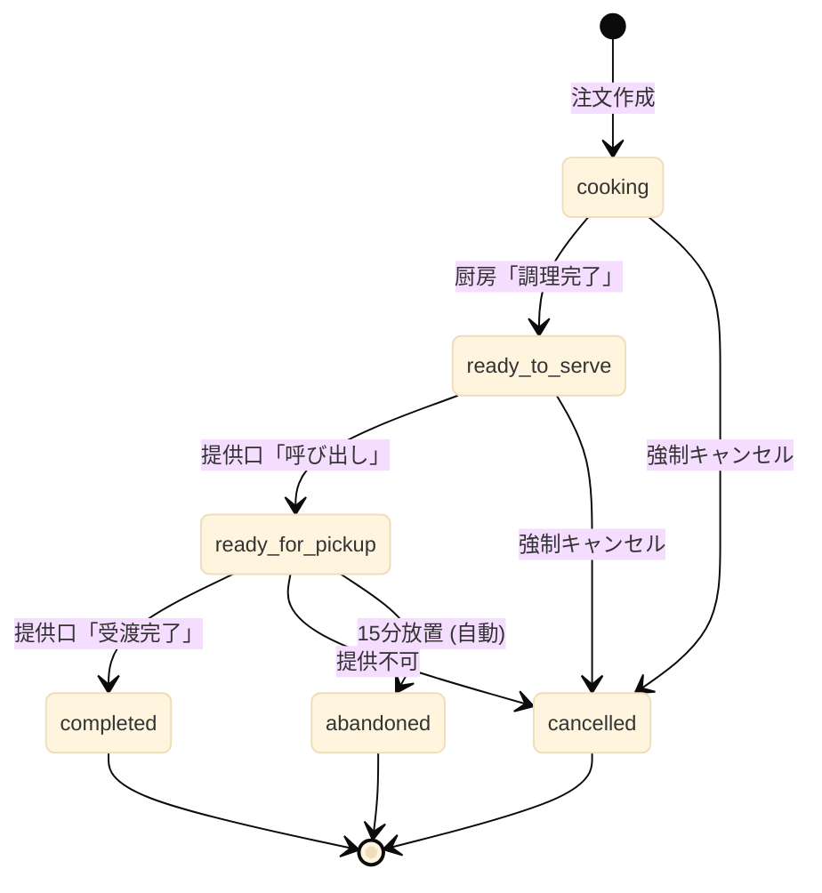

#### 4.6.4 ステータス遷移時の責務マップ

各ステータス遷移は、特定の Cloud Function が責務を持つ。クライアント画面は Cloud Function を呼び出すのみであり、Firestore に対する直接の書き込みは行わない。

| 遷移                                  | 呼び出し主体                             | 実行 Function            | 記録フィールド                                      |
| ------------------------------------- | ---------------------------------------- | ------------------------ | --------------------------------------------------- |
| ⇒ `cooking`                           | クライアント（mobile-order / pos / sok） | `createOrder`            | `createdAt`, `updatedAt`                            |
| `cooking` ⇒ `ready_to_serve`          | `kitchen.html`                           | `kitchenComplete`        | `readyToServeAt`, `updatedAt`                       |
| `ready_to_serve` ⇒ `ready_for_pickup` | `presenter.html`                         | `callForPickup`          | `readyForPickupAt`, `updatedAt`                     |
| `ready_for_pickup` ⇒ `completed`      | `presenter.html`                         | `completeOrder`          | `completedAt`, `updatedAt`                          |
| 任意 ⇒ `cancelled`                    | `presenter.html` 等                      | `cancelOrder`            | `cancelledAt`, `cancellationReason`, `updatedAt`    |
| `ready_for_pickup` ⇒ `abandoned`      | Scheduled Function                       | `abandonStaleOrders`     | `abandonedAt`, `updatedAt`、`banned_users` への記録 |
| 任意 ⇒ 任意（管理者強制）             | `portal.html`                            | `adminUpdateOrderStatus` | 該当タイムスタンプ, `note`, `updatedAt`             |

各遷移に伴う副作用（FCM Push通知の送信、Google スプレッドシートへの書き込みなど）は、`orders` ドキュメントの `onUpdate` トリガーで起動する別 Function（`sendOrderUpdateNotification`、`onOrderUpdatedSpreadsheet` など）が担当する。詳細は第7章で扱う。

`monitor.html` は表示専用画面であり、注文ステータスを更新する Function は呼び出さない。

※`abandonStaleOrders` Scheduled Function は本書執筆時点で未実装である。  
※`createOrder` Function の SOK 経路対応部分は本書執筆時点で未実装である。

#### 4.6.5 ステータス更新 Function の責務

クライアントから `orders` ドキュメントを直接更新することは、Firestore セキュリティルールにより完全に禁止される。すべてのステータス更新は Cloud Functions を経由しなければならない。

この設計を採用する理由は以下の通りである。

第一に、不正な遷移を防止できる。例えば「`cooking` から `completed` へ直接遷移する」といった、業務フロー上ありえない遷移を Function 側で検証して拒否できる。

第二に、副作用を確実に発火できる。タイムスタンプの記録、FCM通知の送信などを Function 内で一括して行うことで、画面ごとの実装差異を排除できる。

第三に、監査ログを確実に残せる。誰がどの遷移を実行したかを Function 側で記録できる。

通常運用で使用される遷移用 Function は以下の4種類である。

**`kitchenComplete({ orderId })`**  
`cooking` から `ready_to_serve` への遷移のみを許可する。厨房スタッフが認証済みであり、対象注文の `storeId` に対する `store_admin` 権限を持つことを検証する。

**`callForPickup({ orderId })`**  
`ready_to_serve` から `ready_for_pickup` への遷移のみを許可する。提供口スタッフが認証済みであり、対象注文の `storeId` に対する `store_admin` 権限を持つことを検証する。

**`completeOrder({ orderId })`**  
`ready_for_pickup` から `completed` への遷移のみを許可する。提供口スタッフが認証済みであり、対象注文の `storeId` に対する `store_admin` 権限を持つことを検証する。

**`cancelOrder({ orderId, reason })`**  
`cooking`、`ready_to_serve`、`ready_for_pickup` のいずれかから `cancelled` への遷移を許可する。`reason` 引数は必須である。

これら4つの Function は、それぞれ単一の遷移パターンのみを許可する厳格な責務を持つ。

管理者専用の遷移 Function として、以下が存在する。

**`adminUpdateOrderStatus({ orderId, newStatus, reason })`**  
任意のステータスから任意のステータスへの強制遷移を許可する。SuperAdmin または当該店舗の `store_admin` のみ実行可能である。`reason` 引数は必須であり、`note` フィールドに「強制変更: (reason)」の形式で記録される。これは提供口で「受渡完了」を押し忘れたまま放置された注文の救済、誤って `completed` にしてしまった注文の差し戻しなどの例外運用に使用される。

注文作成用の Function として、以下が存在する。

**`createOrder({ orderChannel, storeId, items })`**  
全経路共通の注文作成 Function である。`orderChannel` の値により内部処理が分岐する。`pos` の場合は `createdBy` にスタッフUIDを記録し `userId` は `null` とする。`mobile` の場合は `userId` に認証済みUIDを記録し `createdBy` は `null` とする。`sok` の場合は両方とも `null` とする。

※`abandonStaleOrders` Scheduled Function（`ready_for_pickup` から `abandoned` への自動遷移）は本書執筆時点で未実装である。

### 4.7 受付番号の体系と発番ロジック

#### 4.7.1 受付番号レンジ

受付番号は注文経路ごとに独立した数値範囲（レンジ）から発番される。

| 注文経路         | レンジ       | 桁数 |
| ---------------- | ------------ | ---- |
| モバイルオーダー | 7000 〜 7999 | 4桁  |
| SOK              | 2000 〜 2999 | 4桁  |
| 有人POS          | 100 〜 999   | 3桁  |

レンジを経路ごとに分離する目的は以下の通りである。

**経路の即時識別**  
受付番号の桁数と先頭の数字を見るだけで、その注文がどの経路から来たかが直感的にわかる。例えば呼び出し画面に「7521番」と表示されれば、これがモバイルオーダーの注文であると即座に判別できる。

**番号衝突の防止**  
レンジが重複しないため、異なる経路の同時発番でも番号が衝突する可能性がない。

**運用上の柔軟性**  
特定経路に問題が発生した場合、レンジで容易にフィルタできる。

なお、経路の判別は `orderChannel` フィールドを参照することが正式な手段である。受付番号レンジによる経路判定は、UI上の即時識別のための副次的な手がかりとして位置付けられる。

#### 4.7.2 POS端末ごとの分離は行わない

POS端末は複数台が同時に稼働する場合があるが、本システムでは端末ごとに番号レンジを分離せず、すべてのPOS端末が共通の `100〜999` レンジから発番する。

これは、厨房側での番号管理を単純化するためである。端末ごとに「100番台」「200番台」と分けると、厨房スタッフは「100番台はA端末、200番台はB端末」と意識する必要が生じ、運用負荷が増大する。共通レンジとすることで、厨房は番号の出所を意識せず、純粋に注文順に処理することに集中できる。

#### 4.7.3 番号の重複と再利用

番号の「重複禁止」は、現在まだアクティブな注文（受け渡しまたはキャンセルが完了していない注文）の間でのみ適用される。

**アクティブな注文**  
ステータスが `cooking`、`ready_to_serve`、`ready_for_pickup` のいずれかである注文。これらの注文の受付番号は、他の注文と重複してはならない。

**完了済みの注文**  
ステータスが `completed`、`cancelled`、`abandoned` のいずれかである注文。これらの番号は再利用可能となる。

#### 4.7.4 循環発番ロジック

各レンジの最大値（例: モバイルなら7999）に達した後、次の発番要求があると最小値（7000）に戻り、空き番号を順に探索する。空き番号とは、その番号が現在アクティブな注文に使用されていないことを意味する。

発番ロジックの疑似コードを以下に示す。

```javascript
async function getNextReceiptNumber(channel) {
  const ranges = {
    pos: { min: 100, max: 999 },
    mobile: { min: 7000, max: 7999 },
    sok: { min: 2000, max: 2999 },
  };
  const { min, max } = ranges[channel];
  const rangeSize = max - min + 1; // POS:900、mobile/sok:1000

  return await firestore.runTransaction(async (tx) => {
    const counterRef = firestore.doc(`counters/receipt_${channel}`);
    const counterSnap = await tx.get(counterRef);
    let candidate = (counterSnap.data()?.current ?? min - 1) + 1;

    for (let attempt = 0; attempt < rangeSize; attempt++) {
      if (candidate > max) candidate = min;

      const isInUse = await checkActiveOrderExists(channel, candidate, tx);
      if (!isInUse) {
        tx.set(
          counterRef,
          {
            current: candidate,
            updatedAt: serverTimestamp(),
          },
          { merge: true },
        );
        return candidate;
      }
      candidate++;
    }

    throw new Error("受付番号の空きが存在しません");
  });
}
```

#### 4.7.5 トランザクションによる排他制御の設計意図

受付番号の発番処理は Firestore のトランザクション機能を用いて実行される。本節ではトランザクションが何をロックし、何を保証するかを明示する。

**ロック対象**  
発番処理のトランザクションは、`counters/receipt_{channel}` ドキュメントを排他ロックの対象とする。すなわち、同一経路に対する発番要求が同時に複数発生した場合、Firestore はトランザクションを直列化し、片方が完了するまでもう片方を待機させる。

**経路ごとの独立性**  
カウンタドキュメントは経路ごとに分離されている（`counters/receipt_pos`、`counters/receipt_mobile`、`counters/receipt_sok`）ため、異なる経路の発番処理は相互にブロックしない。POS注文とモバイル注文が同時に発番要求を出しても、それぞれ独立したトランザクションとして並列実行される。

**保証される性質**  
このトランザクション設計により、以下の性質が保証される。

1. 同一経路内で同一の受付番号が複数の注文に同時に割り当てられることはない（重複発番の防止）
2. カウンタの `current` 値の更新と注文ドキュメントの作成が同一トランザクション内で行われるため、「番号を発番したが注文ドキュメントの作成に失敗する」という中途半端な状態は発生しない
3. アクティブな注文の存在チェック（`checkActiveOrderExists`）もトランザクション内で実行されるため、チェック直後に他の注文が同じ番号を取得することはない

**トランザクションを使わない場合の問題**  
仮にトランザクションを使わず、カウンタの読み取り・更新を別操作として実行すると、複数の同時注文において「両方が同じ `current` 値を読み取り、両方が同じ番号を発番する」という重複が発生しうる。本システムでは Firestore トランザクションによってこの問題を構造的に排除する。

#### 4.7.6 レンジ全探索ルール

発番処理は、各レンジのサイズ全体（POS で900回、モバイル・SOK で1000回）まで連続して空き番号を探索する。レンジ全体を一周しても空き番号が見つからなかった場合、発番は失敗としエラーを返す。

レンジ全体を探索する設計の理由は以下の通りである。

**一時的な偏りへの耐性**  
固定回数（例: 50回）のみを試行する設計では、アクティブな注文が連続した番号領域に偏在している場合、実際にはレンジ内に空き番号があるにもかかわらず発番が失敗する可能性がある。レンジ全体を探索することで、空き番号が存在する限り必ず発番が成功することが保証される。

**真の枯渇の検出**  
レンジ全体を探索しても空きが見つからない場合、それは真の意味でレンジが枯渇していることを示す。この状態はシステムまたは運用の異常（提供口での `completed` 操作の漏れなど）を示唆するため、エラーとして検出すべき事象である。

発番失敗時は、フロントエンドにエラーが返され、注文を試みた利用者には「現在注文を受け付けられません。スタッフにお声がけください」という趣旨のメッセージが表示される。

#### 4.7.7 番号枯渇への対応

「商品を受け渡したら、即座にシステム上で `completed` にする」という運用ルールが徹底されていれば、各レンジの上限に達することはまずない。番号枯渇への根本的な対策は、提供口スタッフに対する徹底したオペレーション教育である。

### 4.8 セキュリティ・システム系コレクション

#### 4.8.1 `store_secrets` コレクション

各店舗の機密情報を保持する。具体的には、店舗管理画面（`portal.html` 経由でアクセスする店舗管理機能）に入るためのパスワードハッシュなどが格納される。

**アクセス制御**  
このコレクションは Firestore セキュリティルールにより、クライアントからの読み取り・書き込みが完全に禁止されている。アクセスは Cloud Functions のみが可能である。

**ドキュメントID**  
店舗ID（`stores` コレクションのドキュメントIDと一致）。

**フィールド構造**

| フィールド  | 型        | 説明                                                   |
| ----------- | --------- | ------------------------------------------------------ |
| `hash`      | string    | 店舗パスワードのハッシュ値（PBKDF2、SHA-512、10000回） |
| `salt`      | string    | ハッシュ計算に使用するソルト                           |
| `updatedAt` | Timestamp | 最終更新日時                                           |

#### 4.8.2 `banned_users` コレクション

利用停止対象となったユーザーを記録する。詳細は第3章および第8章で扱うが、本節ではデータ構造のみ記述する。

**ドキュメントID**  
利用停止対象ユーザーのUID。

**フィールド構造**

| フィールド | 型             | 説明                                               |
| ---------- | -------------- | -------------------------------------------------- |
| `bannedAt` | Timestamp      | BAN記録日時                                        |
| `reason`   | string         | BAN理由（例: `"abandoned_order"`、`"manual_ban"`） |
| `orderId`  | string \| null | 原因となった注文のID                               |
| `bannedBy` | string         | BAN実行者。`"auto_scheduler"` または実行者のUID    |

※本コレクションへの自動記録処理（`abandoned` ステータスへの自動遷移に連動するもの）は、本書執筆時点で未実装である。

#### 4.8.3 `venues` および関連コレクション

会場（体育館などの催し物会場）のステータスを管理するためのコレクション群である。これらは注文システムとは独立した機能であるが、システム全体の一部として管理される。

**`venues` コレクション**  
会場メタデータと現在のステータス（進行中の演目など）を保持する。

| フィールド       | 型             | 説明                                                                |
| ---------------- | -------------- | ------------------------------------------------------------------- |
| `status`         | string         | 開催状態（`"preparing"`、`"soon"`、`"live"`、`"ended"` のいずれか） |
| `currentEventId` | string \| null | 現在進行中の演目ID                                                  |
| `nextEventId`    | string \| null | 次の演目ID                                                          |
| `updatedAt`      | Timestamp      | 最終更新日時                                                        |

**`venue_admin_config` コレクション**  
会場管理画面のログイン用設定を保持する。Firebase Authenticationを使わない独立した認証フローのために存在する。本コレクションには `settings` ドキュメントが配置される。

| フィールド    | 型        | 説明                                    |
| ------------- | --------- | --------------------------------------- |
| `accessToken` | string    | URLパラメータで照合するアクセストークン |
| `hash`        | string    | 管理者パスワードのハッシュ値            |
| `salt`        | string    | ハッシュ計算に使用するソルト            |
| `updatedAt`   | Timestamp | 最終更新日時                            |

**`venue_admin_sessions` コレクション**  
会場管理者の有効なセッショントークンを保持する。ドキュメントIDがセッショントークン自身である。

| フィールド  | 型        | 説明               |
| ----------- | --------- | ------------------ |
| `createdAt` | Timestamp | セッション発行日時 |

セッションの有効期限は24時間である。これらの認証フローは注文フローには直接関与しないため、本書では詳細を扱わない。

#### 4.8.4 `_metadata` コレクション

マスタデータの同期状態を管理するためのコレクションである。

**主なドキュメント**  
`_metadata/master_sync` ドキュメントは、`admin_sync.html` から実行されたマスタ同期のバージョン情報を保持する。

**フィールド構造（`_metadata/master_sync`）**

| フィールド  | 型        | 説明                                               |
| ----------- | --------- | -------------------------------------------------- |
| `version`   | string    | 同期実行時のバージョン番号（タイムスタンプ文字列） |
| `updatedAt` | Timestamp | 同期実行日時                                       |

クライアント側の `data.js` には `dataVersion` 定数が記述されており、本ドキュメントの `version` と照合することで、Firestore のデータと `data.js` の同期状態を判定できる。

### 4.9 データモデルの関係図

主要なコレクション間の関係を以下に示す。

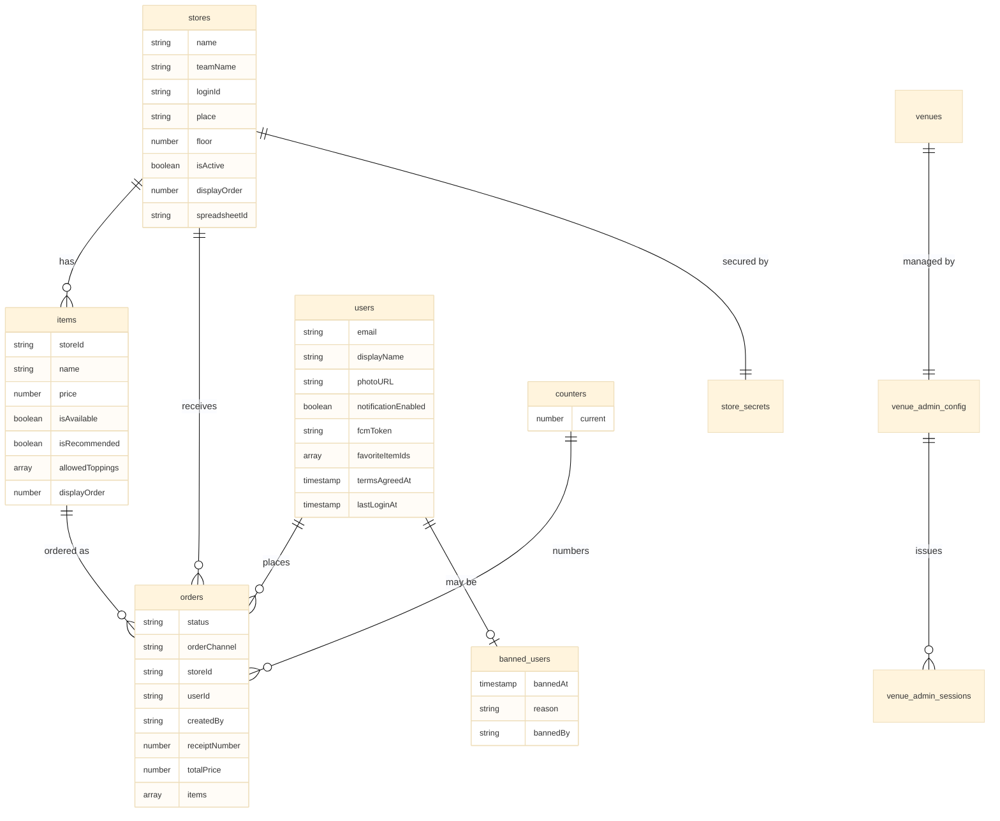

※`banned_users` への自動記録処理は本書執筆時点で未実装である。

### 4.10 注文ドキュメントのライフサイクル例

ある一つの注文が、作成から完了までにどのようにフィールドが変化するかを以下に示す。これはモバイルオーダーの正常系の例である。

**ステップ1: 注文作成 (`cooking`)**

```json
{
  "status": "cooking",
  "orderChannel": "mobile",
  "storeId": "101",
  "userId": "uid_abc123",
  "createdBy": null,
  "receiptNumber": 7042,
  "items": [
    {
      "itemId": "101_taiyaki_anko",
      "name": "たい焼き(あんこ)",
      "price": 250,
      "quantity": 2,
      "customizations": []
    }
  ],
  "totalPrice": 500,
  "note": null,
  "cancellationReason": null,
  "createdAt": "2026-09-12T10:23:18+09:00",
  "readyToServeAt": null,
  "readyForPickupAt": null,
  "completedAt": null,
  "cancelledAt": null,
  "abandonedAt": null,
  "updatedAt": "2026-09-12T10:23:18+09:00"
}
```

**ステップ2: 調理完了 (`ready_to_serve`)**  
`kitchen.html` で厨房スタッフが「調理完了」ボタンを押下し、`kitchenComplete` Function が実行される。`status` が `ready_to_serve` に、`readyToServeAt` にタイムスタンプが記録される。`updatedAt` も更新される。

**ステップ3: 呼び出し開始 (`ready_for_pickup`)**  
`presenter.html` で提供口スタッフが「呼び出し」ボタンを押下し、`callForPickup` Function が実行される。`status` が `ready_for_pickup` に、`readyForPickupAt` にタイムスタンプが記録される。この時刻からカウントが始まり、15分経過時にペナルティ判定の対象となる。

**ステップ4: 提供完了 (`completed`)**  
`presenter.html` で提供口スタッフが「受渡完了」ボタンを押下し、`completeOrder` Function が実行される。`status` が `completed` に、`completedAt` にタイムスタンプが記録される。

最終状態は以下のようになる。

```json
{
  "status": "completed",
  "orderChannel": "mobile",
  "storeId": "101",
  "userId": "uid_abc123",
  "createdBy": null,
  "receiptNumber": 7042,
  "items": [
    {
      "itemId": "101_taiyaki_anko",
      "name": "たい焼き(あんこ)",
      "price": 250,
      "quantity": 2,
      "customizations": []
    }
  ],
  "totalPrice": 500,
  "note": null,
  "cancellationReason": null,
  "createdAt": "2026-09-12T10:23:18+09:00",
  "readyToServeAt": "2026-09-12T10:34:51+09:00",
  "readyForPickupAt": "2026-09-12T10:35:20+09:00",
  "completedAt": "2026-09-12T10:38:42+09:00",
  "cancelledAt": null,
  "abandonedAt": null,
  "updatedAt": "2026-09-12T10:38:42+09:00"
}
```

POS注文の場合、基本構造は同一であり、相違点は以下のみである。

- `orderChannel` が `"pos"` になる
- `userId` が `null` になる
- `createdBy` に操作したスタッフUIDが記録される
- `receiptNumber` が 100〜999 のレンジから発番される

このように、各フィールドは時系列に沿って一方向に追記されていき、注文の全履歴が一つのドキュメント内に保持される。これにより、後から特定の注文の処理時間（例: 「調理にかかった時間」「呼び出してから受け取りまでの時間」）を集計することが可能である。

### 4.11 まとめ

本章では、本システムが Cloud Firestore 上に保持する全データの構造を定義した。`stores`、`items` のマスタ系、`orders`、`users` のトランザクション系、`counters`、`store_secrets`、`banned_users` などのシステム系・セキュリティ系、`venues` 系および `_metadata` を整理し、特に注文ステータスの6状態と受付番号の発番ロジックを詳述した。

すべての注文経路で共通の `orders` コレクションを使用し、ステータスは6種類（`cooking`、`ready_to_serve`、`ready_for_pickup`、`completed`、`cancelled`、`abandoned`)に統一されている。経路の違いは `orderChannel` フィールドで表現される。受付番号は経路ごとにレンジを分離し、経路ごとに独立した `counters` ドキュメントで管理する。Firestore トランザクションによりカウンタドキュメントを排他ロックして同時注文時の番号衝突を防止し、レンジ全体を探索することで一時的な番号の偏在による発番失敗を回避する。

すべてのステータス更新は Cloud Functions（`createOrder`、`kitchenComplete`、`callForPickup`、`completeOrder`、`cancelOrder`、`adminUpdateOrderStatus`、`abandonStaleOrders`）を経由して行われ、クライアントから `orders` ドキュメントへの直接書き込みは Firestore セキュリティルールにより禁止される。

本書執筆時点で未実装の機能は以下の通りである。

- SOK経路（`sok.html` および `createOrder` の `sok` 分岐処理）
- `abandoned` ステータスへの自動遷移処理（`abandonStaleOrders` Scheduled Function）
- `banned_users` への自動記録処理

これらの機能は本章のデータモデル定義に従って実装される。

次章では、これらのデータを操作する画面群（HTMLファイル）の役割を詳述する。
## 第5章 画面構成と責務

### 5.1 章の目的

本章では、本システムを構成する全HTMLファイル（画面）の役割を一覧化し、各画面が担う責務、利用者、画面間の遷移関係を明確化する。

本システムはシングルページアプリケーション（SPA）ではなく、画面ごとにHTMLファイルを分離する伝統的なマルチページ構成を採用する。これは、各画面の責務を明確に分離し、特定の画面に問題が発生しても他の画面は影響を受けないという独立性を重視した設計である。

### 5.2 画面の分類

本システムの画面は、利用者と用途により以下のように分類される。

**来場者向け画面**  
来場者が自身のスマートフォン、または店舗設置のSOK端末で操作する画面。

- `login.html`: 認証エントリーポイント
- `mobile-order.html`: モバイルオーダー
- `sok.html`: セルフオーダーキオスク
- `sok-to.html`: SOK→スマートフォン引き継ぎ
- `status.html`: 注文ステータス確認
- `account.html`: アカウントダッシュボード

**スタッフ向け画面**  
出店団体スタッフ、実行委員、教員などが操作する画面。

- `portal.html`: スタッフ認証ハブ・店舗管理
- `pos.html`: 有人レジ
- `kitchen.html`: 厨房KDS
- `presenter.html`: 提供口
- `monitor.html`: 来場者向け呼び出しモニター

`monitor.html` は来場者が見る画面であるが、表示内容と運用主体がスタッフ側にあるため、本書ではスタッフ向け画面に分類する。

### 5.3 画面一覧表

各画面の責務と利用者を一覧表で示す。

| ファイル | 配置 | 利用者 | 主な役割 |
|---|---|---|---|
| `login.html` | `main/` | 来場者全般 | 認証エントリーポイント |
| `mobile-order.html` | `main/` | 在校生 | モバイルオーダーの注文 |
| `sok.html` | `pos/` | 一般来場者 | SOK端末上での商品選択 |
| `sok-to.html` | `main/` | 一般来場者 | スマホでの注文引き継ぎ |
| `status.html` | `main/` | 来場者全般 | 注文ステータスの確認 |
| `account.html` | `main/` | 来場者全般 | アカウントダッシュボード |
| `portal.html` | `pos/` | 出店団体スタッフ | スタッフ認証ハブ・店舗管理 |
| `pos.html` | `pos/` | レジ担当スタッフ | 有人レジ |
| `kitchen.html` | `pos/` | 厨房スタッフ | 注文ステータス管理（厨房側） |
| `presenter.html` | `pos/` | 提供口スタッフ | 呼び出し・受け渡し管理 |
| `monitor.html` | `pos/` | 来場者（表示） | 呼び出し番号の大画面表示 |

### 5.4 来場者向け画面の詳細

#### 5.4.1 `login.html`

**配置**: `main/login.html`  
**利用者**: 来場者全般  
**役割**: 来場者向け認証の唯一のエントリーポイント

**主な機能**

- Googleアカウントによるログイン処理（`signInWithPopup`）
- 在校生確認モード（`?mode=student`）と一般来場者モード（`?mode=guest` またはパラメータなし）の分岐
- ドメイン制限の適用（`@gl.pen-kanagawa.ed.jp` の検証）
- BANチェック（`banned_users` コレクションへの照会）
- ログイン後の遷移先決定（`?redirect=` クエリパラメータの解釈）
- 既ログイン時の自動リダイレクト
- ポップアップブロック発生時のガイダンス表示
- 利用規約への同意取得（初回ログイン時）

**遷移元**

- `mobile-order.html`（未ログイン状態でアクセスした場合）
- `account.html`（未ログイン状態でアクセスした場合）
- 来場者が直接URLを入力した場合

**遷移先**

- `?redirect=` で指定された画面（モバイルオーダー、アカウント等）
- 認証失敗時はログイン画面に留まる
- BAN該当時はエラー画面を表示

詳細は第3章を参照のこと。

#### 5.4.2 `mobile-order.html`

**配置**: `main/mobile-order.html`  
**利用者**: 在校生（`@gl.pen-kanagawa.ed.jp` ドメイン保有者）  
**役割**: モバイルオーダーの注文受付

**主な機能**

- 認証状態とドメイン要件の検証（未認証なら `login.html` へリダイレクト）
- 利用規約への同意取得UI（未同意の場合のみ）
- 店舗一覧の表示（`stores` コレクションのリアルタイム取得）
- 店舗選択
- メニュー表示（`items` コレクションを `storeId` でフィルタリング）
- 商品の販売可否（`isAvailable`）に応じたUI制御
- カート操作（追加、数量変更、削除）
- カート内容のローカル保持（注文確定までは Firestore に書き込まない）
- 注文確定処理（Cloud Function `createOnlineOrder` の呼び出し）
- 注文確定後の `status.html` への遷移

**画面構成**

1. 規約同意画面（初回または未同意時）
2. 店舗選択画面
3. メニュー表示画面（カートを画面下部に常時表示）
4. カート確認・注文確定画面

**遷移元**

- `login.html`（認証完了時）
- 来場者が直接URLを入力した場合

**遷移先**

- 注文確定後 → `status.html?orderId=...`
- 未認証時 → `login.html?redirect=mobile-order.html&mode=student`

#### 5.4.3 `sok.html`

**配置**: `pos/sok.html`  
**利用者**: 一般来場者（外部の方）  
**役割**: 店舗設置のセルフオーダーキオスク端末上で動作する商品選択画面

**主な機能**

- 起動時のクエリパラメータ `?store=` から店舗IDを取得
- 該当店舗のメニューをフルスクリーンで表示
- タッチ操作によるカート操作
- 注文確定時のCloud Function `createOrderFromSok` 呼び出し
- 受付番号の表示と、`sok-to.html` へのリンクを含むQRコードの生成
- QR表示後20秒で自動的にメニュー画面に戻る
- メニューに戻る前に、操作中の人が「次の人へ」ボタンで明示的にリセット可能

**起動方法**  
SOK端末は、店舗責任者が `portal.html` 経由で起動する。`portal.html` 上で「SOKを起動」を選択すると、`sok.html?store=store_101` のような形式で店舗IDが付与されたURLが開かれる。SOK端末は起動後、店舗IDを保持し、別店舗のSOKとして誤動作しないよう設計される。

**設置形態**  
各店舗にiPad（生徒に配布されている学校支給端末）を設置する。設置台数は本書執筆時点で各店舗3台程度を想定するが未確定である。複数台設置する場合、すべてのSOK端末は同じ店舗の `?store=` を使用する。

**注文タイムアウト**  
QRコード生成から15分以内に、来場者がスマートフォンでQRコードを読み取り `sok-to.html` で注文確定を行わなかった場合、その仮注文は自動的にキャンセルされる。これは Scheduled Function またはクライアント側のタイムアウト処理により実装される（実装方式は本書執筆時点で未確定）。

**遷移元**

- `portal.html` からの起動
- 来場者の「次の人へ」操作後、メニュー画面に戻る（自画面内ループ）

**遷移先**

- 自画面内でのメニュー → カート → QR表示 → メニューのループ
- 来場者のスマートフォン側で `sok-to.html` が開かれる（SOK端末自体は遷移しない）

#### 5.4.4 `sok-to.html`

**配置**: `main/sok-to.html`  
**利用者**: SOK経由の一般来場者  
**役割**: SOKで作成された仮注文を、来場者自身のスマートフォンに引き継ぐ

**ファイル名の由来**  
"to" は takeover（引き継ぎ）の略である。SOK端末上で開始された注文を、来場者自身のスマートフォンに「引き継ぐ」ことから命名されている。

※本ファイル名は本書執筆時点で暫定的なものであり、最終的な命名は変更される可能性がある。

**主な機能**

- クエリパラメータ `?orderId=` で渡された仮注文IDを取得
- 仮注文の存在と状態（タイムアウト前であること）を確認
- Firebase Authentication の匿名認証を実行（`signInAnonymously`）
- 発行された匿名UIDを、注文ドキュメントの `userId` フィールドに紐付け
- Push通知の許可要求とFCMトークンの登録
- 注文内容の最終確認画面の表示
- 利用規約への同意取得（チェックボックス）
- 「注文確定」ボタンの押下による status の確定
- `status.html` への遷移

**`status.html` から責務を分離する理由**  
`status.html` は純粋に注文ステータスを表示する画面として保つことが、保守性の観点で重要である。SOKフローには認証、通知許可、規約同意、注文確定という多段階の処理があり、これらをすべて `status.html` に組み込むと、一つの画面が複数の状態を持つ巨大な分岐ロジックを抱えることとなり、保守困難になる。

`sok-to.html` を独立した画面として設けることで、SOK特有の引き継ぎ処理を一箇所に閉じ込め、`status.html` は単一責務を保つ。

**遷移元**

- 来場者が `sok.html` のQRコードを読み取った時のみ

**遷移先**

- 注文確定後 → `status.html?orderId=...`
- 仮注文が見つからない、またはタイムアウト済みの場合 → エラー画面

#### 5.4.5 `status.html`

**配置**: `main/status.html`  
**利用者**: モバイルオーダー利用者およびSOK利用者  
**役割**: 自身の注文の現在のステータスをリアルタイムで確認する

**主な機能**

- クエリパラメータ `?orderId=` で指定された注文の Firestore リアルタイム購読（`onSnapshot`）
- 注文ステータスに応じた画面表示の切り替え
- 受付番号の大きな表示
- 推定待ち時間の表示（同じ店舗の前方にある注文数から計算）
- `ready_for_pickup` 時の強調表示と「提供口でこの画面をお見せください」の案内
- 「提供口で au PAY のQRコードを読み取って決済してください」の説明表示
- アカウント連携への導線（匿名ユーザーの場合のみ「アカウント連携する」ボタンを表示し、`login.html` または `account.html` へ遷移）

**ステータス別の表示内容**

| ステータス | 表示内容 |
|---|---|
| `cooking` | 「注文を受け付けました。調理開始までお待ちください」 |
| `cooking` | 「現在調理中です」 |
| `ready_to_serve` | 「もうすぐ完成します」 |
| `ready_for_pickup` | 「商品の準備ができました！提供口へお越しください。15分以内にお受け取りください」 |
| `completed` | 「ありがとうございました！またのご利用をお待ちしております」 |
| `cancelled` | 「申し訳ございません。本注文はキャンセルされました」 |
| `abandoned` | 「本注文はお受け取り期限を過ぎたため、放棄されました」 |

**閲覧権限**  
Firestore セキュリティルールにより、注文ドキュメントの `userId` フィールドが、現在のログインユーザーのUIDと一致する場合のみ閲覧可能である。第三者が `?orderId=...` のURLを推測してアクセスしても、Firestore からデータを取得できないため、注文内容は表示されない。

**遷移元**

- `mobile-order.html`（注文確定後）
- `sok-to.html`（注文確定後）
- 来場者がブックマーク等から再アクセスした場合
- Push通知のクリック

**遷移先**

- 「アカウント連携する」ボタン押下時 → `login.html` または `account.html`
- 来場者が能動的に閉じる

#### 5.4.6 `account.html`

**配置**: `main/account.html`  
**利用者**: ログイン済みの来場者全般  
**役割**: アカウントの総合ダッシュボード

**主な機能**

- 認証情報の表示（メールアドレス、表示名）
- 過去の注文履歴の閲覧
- お気に入り商品の管理
- 通知設定の変更
- 匿名アカウントからGoogleアカウントへの昇格（`linkWithCredential`）
- アカウントの削除
- ログアウト

**位置づけ**  
`account.html` はモバイルオーダーの利用者だけでなく、お気に入り機能やお知らせ機能を利用する一般来場者も対象とする。本システムが文化祭以後も発展する場合の永続的なユーザーダッシュボードとして設計されている。

**遷移元**

- `login.html`（認証完了後、特定機能を求めて遷移してきた場合）
- ナビゲーションメニューからの直接アクセス
- `status.html` の「アカウント連携する」ボタン

**遷移先**

- 各サブ機能（注文履歴、お気に入り等）の表示は同一画面内のタブまたはセクションで切り替え
- ログアウト時 → `login.html` またはトップページ

### 5.5 スタッフ向け画面の詳細

#### 5.5.1 `portal.html`

**配置**: `pos/portal.html`  
**利用者**: 出店団体スタッフ、実行委員、教員  
**役割**: スタッフ向け機能の認証ハブと店舗管理

**主な機能**

- スタッフ用ツール群（POS、Kitchen、Presenter、Monitor）への入口
- Auth Guard としての機能（未ログイン時のスタッフ画面アクセスを遮断）
- 店舗パスワードの検証（`store_secrets` コレクションを Cloud Function 経由で照会）
- 店舗選択（一人のスタッフが複数店舗を管理する場合）
- メニュー（`items`）の登録・編集
- 商品画像のアップロード（クライアントサイド WebP 変換、Cloud Storage への送信）
- 売上サマリーの表示
- SOK端末の起動（`sok.html?store=...` を新規タブで開く）
- 各種スタッフ画面（POS、Kitchen等）への起動

**Auth Guard の動作**  
`pos/` 配下のスタッフ画面（`pos.html`、`kitchen.html`、`presenter.html`）は、いずれも単独でのログイン画面を持たない。これらの画面は起動時に認証状態を確認し、未認証の場合は強制的に `portal.html` へリダイレクトする。`portal.html` がスタッフ認証の唯一の入口として機能する。

**遷移元**

- スタッフによる直接アクセス
- 各スタッフ画面からの未認証時リダイレクト

**遷移先**

- 各スタッフ画面（`pos.html`、`kitchen.html`、`presenter.html`、`monitor.html`）
- SOK端末用に `sok.html?store=...` を別タブで起動

#### 5.5.2 `pos.html`

**配置**: `pos/pos.html`  
**利用者**: レジ担当スタッフ  
**役割**: 有人レジでの注文入力

**主な機能**

- メニュー一覧の表示（タッチ操作に最適化されたボタン形式）
- カート機能（モバイルオーダーと同様の操作感）
- 商品にトッピングを付加する操作
- 注文確定時の Cloud Function `createPosOrder` 呼び出し
- 受付番号の表示（紙に書いて来場者に手渡すため）
- 端末ID (`posTerminalId`) の保持と注文への記録
- レシートの表示（任意印刷機能は本書執筆時点では未定）

**端末ID の保持**  
POS端末は起動時に、ローカルストレージに端末ID（例: `pos_terminal_a`）を保持する。各注文ドキュメントの `posTerminalId` フィールドに、この端末IDが記録される。これにより、後から「どの端末で発行された注文か」を集計できる。

**操作の高速化**  
レジ業務は処理速度が重視されるため、UIは大きなボタンと最小限の確認ステップで構成される。誤操作の取り消しは、注文確定後でも `presenter.html` 側からキャンセル可能なため、レジ画面では確認ダイアログを最小限とする。

**遷移元**

- `portal.html`

**遷移先**

- 注文確定後、自画面内で次の注文の入力に戻る

#### 5.5.3 `kitchen.html`

**配置**: `pos/kitchen.html`  
**利用者**: 厨房スタッフ  
**役割**: 注文の調理ステータス管理

**主な機能**

- ステータスが `cooking` および `cooking` の注文をリアルタイム購読し、画面に表示
- 注文の表示順序（基本は古い順、必要に応じて店舗別フィルタ）
- 注文ごとに「調理開始」「調理完了」ボタンを表示
- 「調理開始」押下時：status を `cooking` に更新、`cookingStartedAt` を記録
- 「調理完了」押下時：status を `ready_to_serve` に更新、`readyToServeAt` を記録
- 新規注文受信時の通知音再生
- 経路別の視覚的区別（モバイル、SOK、POSをアイコンや色で識別）

**画面表示の特徴**  
厨房という環境（手が濡れる、油汚れがある、画面に近づけない）を考慮し、以下のUI設計を採用する。

- 大きなフォント（注文番号は特に大きく）
- 高コントラストの色使い
- ボタンは画面の広い面積を占め、タッチしやすく
- 注文一覧は時系列で並び、画面スクロール最小化のためカード形式で配置

**遷移元**

- `portal.html`

**遷移先**

- スタッフが能動的に閉じる

#### 5.5.4 `presenter.html`

**配置**: `pos/presenter.html`  
**利用者**: 提供口スタッフ  
**役割**: 商品の呼び出しと受け渡し管理

**主な機能**

- ステータスが `ready_to_serve` および `ready_for_pickup` の注文をリアルタイム購読
- 注文ごとに以下のボタンを表示：
  - 「提供準備完了」（`ready_to_serve` の場合）
  - 「QR決済完了」「提供不可・キャンセル」（`ready_for_pickup` の場合）
- 「提供準備完了」押下時：status を `ready_for_pickup` に更新、`readyForPickupAt` を記録
- 「QR決済完了」押下時：status を `completed` に更新、`completedAt`、`paidAt` を記録
- 「提供不可・キャンセル」押下時：status を `cancelled` に更新、`cancelledAt`、`cancellationReason` を記録
- 注文の合計金額を表示（決済時のスタッフによる目視確認用）
- 注文内容（商品リスト、トッピング）の表示

**ボタン配置の設計方針**  
誤操作を避けるため、「QR決済完了」と「提供不可・キャンセル」は色を明確に分け、距離を置いて配置する。「提供不可・キャンセル」は確認ダイアログを伴う。

**金額表示**  
au PAY 手動決済では、来場者がスマートフォンに金額を手入力する。スタッフは `presenter.html` の合計金額表示と、来場者のスマートフォン画面の金額を目視で照合する。これは本システムが採用する手動決済における唯一の金額検証手段である。

**遷移元**

- `portal.html`

**遷移先**

- スタッフが能動的に閉じる

#### 5.5.5 `monitor.html`

**配置**: `pos/monitor.html`  
**利用者**: 来場者（表示の閲覧）  
**役割**: 呼び出し中の注文番号を大画面表示する

**主な機能**

- ステータスが `ready_for_pickup` の注文の受付番号をリアルタイム購読
- 大画面に番号を表示（卓上iPadまたはより大きなディスプレイ）
- 新規呼び出し時の合成音声によるアナウンス（例: 「7042番のお客様、お受け取りください」）
- キャンセル発生時の表示（「○○番の注文はキャンセルされました」）
- 受け取り完了（`completed` 遷移）時に該当番号を一覧から削除

**設置形態**  
店舗のカウンター付近、または提供口の上部に設置される。来場者がカウンターから少し離れた位置でも視認できるよう、文字サイズは可能な限り大きくする。

**音声合成**  
ブラウザ標準の Speech Synthesis API を使用する。日本語音声（`ja-JP`）で番号を読み上げる。同時に複数の番号が呼び出された場合、順次アナウンスを行う。

**閲覧権限**  
`monitor.html` は来場者全員が見る性質の画面であるため、認証は不要である。Firestore セキュリティルール上は、`ready_for_pickup` 状態の注文の受付番号と店舗IDのみを公開読み取り可能とする限定的な権限を付与する。

**遷移元**

- スタッフによる直接アクセス（電源を入れて起動）

**遷移先**

- 起動後は閉じない（常時表示）

### 5.6 画面遷移図

来場者がモバイルオーダーで注文する場合の画面遷移を以下に示す。

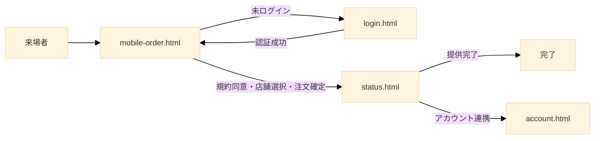

来場者がSOKで注文する場合の画面遷移を以下に示す。

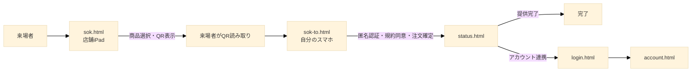

スタッフ画面の起動フローを以下に示す。

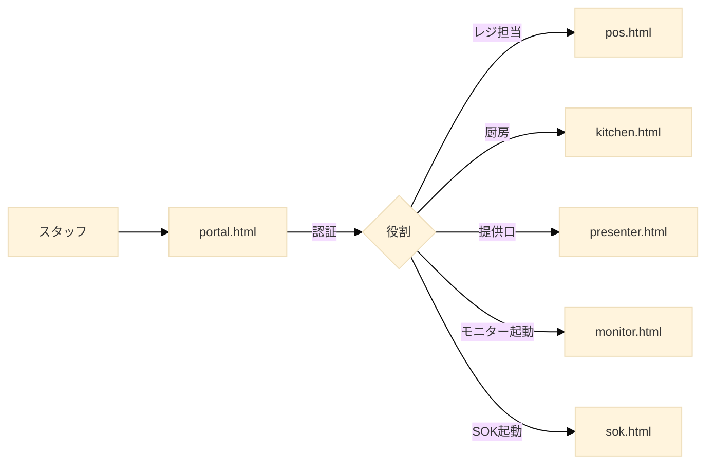

### 5.7 ファイル配置

ソースコードリポジトリ上のファイル配置を以下に示す。

```
nanryosai-2026/
├── index.html                  // トップページ（南陵祭サイト）
├── main/
│   ├── login.html
│   ├── mobile-order.html
│   ├── sok-to.html
│   ├── status.html
│   ├── account.html
│   ├── auth.js                // 認証共通モジュール
│   ├── firebase-config.js     // Firebase 初期化
│   └── ...
├── pos/
│   ├── portal.html
│   ├── pos.html
│   ├── kitchen.html
│   ├── presenter.html
│   ├── monitor.html
│   ├── sok.html
│   └── training/              // スタッフ向けトレーニング資料
│       ├── pos-training.html
│       ├── presenter-training.html
│       └── admin-training.html
├── admin/                     // 実行委員・管理用
│   ├── admin_sync.html        // データ同期ツール（SSOTからFirestoreへ）
│   └── ...
└── functions/                 // Cloud Functions のソースコード
    ├── index.js
    └── ...
```

### 5.8 共通モジュール

複数の画面から共有して使用される JavaScript モジュールを以下に示す。

#### 5.8.1 `auth.js`

認証処理の共通ロジックを提供するモジュール。

- `initializeAuth()`: Firebase Authentication の初期化
- `login()`: Googleアカウントによるログイン処理
- `loginAnonymously()`: 匿名認証の実行
- `linkAccount()`: 匿名アカウントからGoogleアカウントへの昇格
- `logout()`: ログアウト処理
- `watchUser(callback)`: 認証状態の監視
- `isStudentEmail(email)`: ドメイン判定
- `getSafeRedirect(url)`: リダイレクト先の検証

このモジュールは `login.html`、`mobile-order.html`、`sok-to.html`、`account.html`、`portal.html` から利用される。

#### 5.8.2 `firebase-config.js`

Firebase の初期化設定を集約したモジュール。

- Firebase アプリの初期化
- Firestore、Authentication、Functions、Storage、Messaging 各サービスのインスタンス取得
- App Check の初期化（reCAPTCHA v3 トークンのウォームアップ）

すべての画面から最初に読み込まれる。

#### 5.8.3 `order-helpers.js`

注文関連の共通ロジックを提供するモジュール（想定）。

- `subscribeOrder(orderId, callback)`: 注文ドキュメントの購読
- `formatOrderItems(items)`: 注文内容の表示用フォーマット
- `calculateWaitingTime(order)`: 推定待ち時間の計算
- `getStatusLabel(status)`: ステータスの日本語表示

`status.html`、`presenter.html`、`kitchen.html` などから利用される。

#### 5.8.4 `data.js` (SSOT)

システム全体のマスターデータを保持する JavaScript ファイル。

- `main/data/data.js` に配置される
- 店舗情報（`STORES`）、商品情報（`ITEMS`）などの定義を含む
- これがシステムにおける唯一の信頼できる情報源（SSOT）となる
- `admin_sync.html` を通じて、このファイルの内容が Firestore へ同期される

### 5.9 SOK設置運用の詳細

#### 5.9.1 設置構成

各出店団体には、店舗カウンター付近にSOK端末を設置する。

**端末**: 学校が生徒に配布しているiPad  
**設置台数**: 各店舗3台程度（本書執筆時点で未確定）  
**配置**: 来場者がカウンター前に並んだ際、自然に操作できる位置  
**保護**: スタンドまたは固定具で安定させ、画面が見やすい角度に固定

#### 5.9.2 端末の起動と店舗紐付け

SOK端末は朝の営業開始時に、店舗責任者が以下の手順で起動する。

1. iPad のブラウザで `portal.html` にアクセスする
2. 店舗パスワードを入力して認証を完了する
3. 「SOK端末として起動」ボタンを押下する
4. 自動的に `sok.html?store=店舗ID` が新しいタブで開く
5. ブラウザを全画面表示にし、スワイプ操作以外でタブを切り替えられないよう設定

`?store=` パラメータにより、その端末がどの店舗のSOKとして動作するかが特定される。同じ店舗内に複数台設置する場合、すべての端末が同じ `?store=` で起動される。

#### 5.9.3 来場者の操作フロー

1. 来場者がSOK端末の前に立ち、メニュー画面から商品をタッチして選択する
2. カートを確認し、「注文確定」ボタンを押す
3. 受付番号とQRコードが画面に表示される
4. 来場者が自身のスマートフォンでQRコードを読み取り、`sok-to.html` を開く
5. SOK端末は20秒経過後、自動的にメニュー画面に戻る
6. 次の来場者が利用可能になる

#### 5.9.4 「次の人へ」ボタン

QR表示画面には「次の人へ」ボタンを配置する。来場者がQR読み取りを完了した時点で、自動の20秒待機を待たずに次の操作者がメニュー画面に戻れる。これは、待機時間を短縮し、混雑時の処理速度を向上させる目的である。

#### 5.9.5 タイムアウトと自動キャンセル

SOK で仮注文（status: `cooking`、`userId: null`）が作成されてから15分以内に、来場者がスマートフォンで `sok-to.html` を開き、注文を確定しなかった場合、その仮注文は自動的にキャンセルされる。

これは Cloud Functions の Scheduled Function による定期スキャン（1分ごとに15分超過の `userId: null` 注文を検出してキャンセル）によって実装される。

タイムアウトでキャンセルされた仮注文は、受付番号が解放され、次の発番時に再利用される可能性がある。

### 5.10 まとめ

本章では、本システムを構成する11個のHTMLファイルの役割を一覧化し、それぞれの責務、利用者、機能、画面間の遷移関係を詳述した。

来場者向け画面は `login.html` を認証エントリーポイントとし、`mobile-order.html`、`sok.html`、`sok-to.html`、`status.html`、`account.html` で構成される。スタッフ向け画面は `portal.html` を認証ハブとし、`pos.html`、`kitchen.html`、`presenter.html`、`monitor.html` で構成される。

`status.html` の単一責務維持のため、SOKフローでは独立した `sok-to.html` が引き継ぎ処理を担う。SOK端末は `?store=` パラメータで店舗紐付けされ、各店舗にiPadを複数台設置する形態で運用される。

次章では、これら画面群の上で実行される、注文経路ごとの詳細フローを記述する。

---
## 第6章 シナリオ別注文フロー

### 6.1 章の目的

本章では、本システムが提供する3つの注文経路、すなわちモバイルオーダー、セルフオーダーキオスク（SOK）、有人POSレジについて、それぞれの注文受付から注文確定までのフローを詳述する。

注文確定後の調理から商品提供までの共通フローは第7章で扱う。本章では、各経路がどのように注文を受け付け、Firestore の `orders` コレクションに `status: cooking` の注文ドキュメントを生成するかを記述することが目的である。

### 6.2 3経路の比較

3つの注文経路の特徴を以下の表で示す。

| 観点 | モバイルオーダー | SOK | 有人POS |
|---|---|---|---|
| 第一の柱としての位置づけ | 主たる経路 | 補助経路 | 例外経路 |
| 利用者 | 在校生 | 一般来場者 | 高齢者・特殊事例 |
| 認証 | Googleアカウント (`@gl.pen-kanagawa.ed.jp`) | 匿名認証（後から昇格可能） | スタッフ認証のみ |
| 操作場所 | 来場者の自宅・校内任意の場所 | 店舗カウンターのSOK端末 | 店舗カウンター（口頭） |
| 利用デバイス | 来場者のスマートフォン | 店舗設置iPad + 来場者スマホ | スタッフのPOS端末 |
| 受付番号レンジ | 7000〜7999 | 2000〜2999 | 100〜999 |
| 規約同意 | あり（店舗選択前） | あり（スマホ側） | なし |
| 通知（FCM） | あり | あり | なし |
| ステータス確認画面 | `status.html` | `status.html` | なし（紙の番号札のみ） |

### 6.3 モバイルオーダーフロー

#### 6.3.1 目的と利用者

モバイルオーダーは、本システムの第一の柱として位置づけられる注文経路である。来場者は自身のスマートフォンを使い、物理的な行列に並ばずに注文を完了できる。

利用者は `@gl.pen-kanagawa.ed.jp` ドメインのGoogleアカウントを保有する者、すなわち神奈川県立高校の生徒および教員に限定される。これは海外を含む不正アクセスを防ぐためのドメイン制限による。

#### 6.3.2 全体フロー概要

モバイルオーダーは以下のステップで構成される。

1. アクセスと認証
2. 規約同意
3. 店舗選択
4. メニュー閲覧とカート操作
5. 注文確定
6. ステータス画面への遷移

各ステップを以下に詳述する。

#### 6.3.3 ステップ1: アクセスと認証

**起点**  
来場者は校内に掲示されたQRコード、または南陵祭の公式ウェブサイトのリンクから `mobile-order.html` にアクセスする。

**認証状態の判定**  
`mobile-order.html` は起動時に Firebase Authentication の認証状態を確認する。

未ログインの場合、以下のURLパラメータを付与して `login.html` へ自動的にリダイレクトする。

```
login.html?mode=student&redirect=%2Fmain%2Fmobile-order.html
```

ログイン済みでドメイン要件を満たす場合、認証状態をそのまま維持して次のステップに進む。

ログイン済みであるがドメイン要件を満たさない場合（過去に別ドメインでログインした履歴がある場合）、強制的にログアウトを実行し、`login.html` へリダイレクトする。

**`login.html` での処理**  
第3章で詳述した在校生モードの認証フローが実行される。認証成功後、`?redirect=` で指定されたURL（`mobile-order.html`）へ遷移する。

**BANチェック**  
`mobile-order.html` は認証済みユーザーのUIDを使い、`banned_users` コレクションを照会する。該当ドキュメントが存在する場合、画面全体に「このアカウントは利用が制限されています」というメッセージを表示し、それ以降の操作を不能とする。

#### 6.3.4 ステップ2: 規約同意

**同意取得の必要性**  
本システムは放置キャンセルに対するペナルティを実施する設計であり、その実施には事前の同意取得が前提となる。同意取得は店舗選択画面の表示前に行われる。

**同意UI**  
規約同意UIは以下の要素で構成される。

- 規約本文の表示（スクロール可能なエリア）
- 重要部分（特に「呼び出し後15分以内に受け取りに来ない場合、利用停止となる」旨）の強調表示
- 「上記の利用規約に同意します」というチェックボックス
- 「同意して進む」ボタン（チェックボックスがオンになるまで非活性）

**同意の記録**  
来場者がチェックボックスをオンにし、「同意して進む」ボタンを押下した時点で、以下の処理が実行される。

1. ローカル変数 `agreedTerms` を `true` に設定
2. 後続の `createOnlineOrder` 呼び出し時に、注文ドキュメントの `termsAgreedAt` フィールドに同意時刻が記録される

`users/{uid}` ドキュメントへの永続的な同意記録は、本書執筆時点では行わない。各注文ごとに同意を取得する方針とする。

#### 6.3.5 ステップ3: 店舗選択

**店舗一覧の取得**  
規約同意後、画面は店舗選択モードに切り替わる。`stores` コレクションから `isActive: true` の店舗をリアルタイムで取得し、画面に一覧表示する。

**表示内容**  
各店舗カードには以下の情報を表示する。

- 店舗名（`teamName`）
- 出店団体名（`name`）
- 店舗のアイコンまたは代表画像（任意）

**選択操作**  
来場者が店舗カードをタップすると、その店舗のメニュー画面に遷移する。`mobile-order.html` 内のJavaScript状態管理により、ページ遷移なしで画面が切り替わる。

#### 6.3.6 ステップ4: メニュー閲覧とカート操作

**メニュー取得**  
選択された店舗の `storeId` を使用して、`items` コレクションを `where("storeId", "==", storeId)` でクエリする。`displayOrder` 順に整列して画面に表示する。

**販売状態の反映**  
`isAvailable: false` の商品は、グレーアウト表示し「売切」または「販売停止」のラベルを重ねる。タップしてもカートに追加できない。`onSnapshot` でリアルタイム購読しているため、出店団体が `portal.html` から販売停止に切り替えると、即座に来場者の画面に反映される。

**商品詳細とカート追加**  
商品をタップすると、商品詳細画面（モーダルまたはサブページ）が開く。詳細画面では以下の操作が可能である。

- 商品説明と画像の閲覧
- 数量の選択
- トッピングの選択（`allowedToppings` の配列から複数選択）
- カートへの追加

**カート画面**  
画面下部にはカートの状態が常に表示される（合計金額と「カートを見る」ボタン）。カート画面では各商品の数量変更、削除、トッピング修正が可能である。

**カートのローカル保持**  
カート操作中は、すべての変更がブラウザのJavaScript変数およびローカルストレージに保持される。Firestore への書き込みは発生しない。これにより、ブラウジング中のFirestore読み取り回数を削減する。

#### 6.3.7 ステップ5: 注文確定

**最終確認画面**  
カート画面で「注文を確定する」ボタンを押下すると、最終確認画面が表示される。注文内容、合計金額、店舗名、提供口での決済が必要である旨を改めて表示する。

**`createOnlineOrder` の呼び出し**  
来場者が最終確認画面で「確定」を押下すると、Cloud Function `createOnlineOrder` が呼び出される。

呼び出し時のリクエストパラメータ：

```json
{
  "storeId": "store_101",
  "items": [
    {
      "itemId": "item_taiyaki_anko",
      "quantity": 2,
      "customizations": []
    }
  ],
  "termsAgreedAt": "2026-09-12T10:23:15+09:00"
}
```

**Cloud Function 内の処理**  
`createOnlineOrder` は以下の処理を順に実行する。

1. 認証されたユーザーのUIDを取得（クライアントから渡されない、サーバー側で確実に検証）
2. `banned_users` コレクションでBANチェック
3. 各 `itemId` を `items` コレクションで検証し、`isAvailable: true` であることを確認
4. 商品名と価格をマスタからスナップショットとして取得
5. `totalAmount` を計算（クライアントから渡された金額は信用しない）
6. 受付番号を発番（`getNextReceiptNumber("mobile")`）
7. 注文ドキュメントを `orders` コレクションに作成
8. `users/{uid}/cart` サブコレクションをクリア
9. 作成された注文ドキュメントのIDを返却

**作成される注文ドキュメント**

```json
{
  "status": "cooking",
  "orderChannel": "mobile",
  "paymentMethod": "au_pay_manual",
  "storeId": "store_101",
  "userId": "uid_abc123",
  "receiptNumber": 7042,
  "items": [
    {
      "itemId": "item_taiyaki_anko",
      "name": "たい焼き（あんこ）",
      "price": 250,
      "quantity": 2,
      "customizations": []
    }
  ],
  "totalAmount": 500,
  "termsAgreedAt": "2026-09-12T10:23:15+09:00",
  "createdAt": "2026-09-12T10:23:18+09:00",
  "updatedAt": "2026-09-12T10:23:18+09:00",
  "cookingStartedAt": null,
  "readyToServeAt": null,
  "readyForPickupAt": null,
  "completedAt": null,
  "cancelledAt": null,
  "paidAt": null,
  "cancellationReason": null,
  "createdBy": null,
  "posTerminalId": null,
  "note": null
}
```

**エラーハンドリング**  
以下のいずれかの状況では `createOnlineOrder` はエラーを返却する。

- 認証されていない
- BANに該当する
- 商品が販売停止になっている（`isAvailable: false`）
- 受付番号の発番に失敗した（50回試行ルール）

エラー発生時は、来場者の画面に状況に応じたメッセージが表示される。たとえば商品の販売停止が判明した場合は「商品が売り切れになりました。カートをご確認ください」と表示し、カート画面に戻す。

#### 6.3.8 ステップ6: ステータス画面への遷移

注文ドキュメントの作成が成功すると、フロントエンドはレスポンスに含まれる注文IDを使い、`status.html?orderId=...` へ遷移する。来場者は以降、`status.html` でリアルタイムにステータスの変化を確認できる。

#### 6.3.9 通知許可の取得

通知許可（FCM）は、`mobile-order.html` の初回ログイン直後、または `status.html` の初回表示時に要求される。許可が得られた場合、FCMトークンが取得され `users/{uid}` の `fcmTokens` 配列に追加される。許可が得られない場合は、`status.html` 上での目視確認のみで通知を受け取る運用となる。

#### 6.3.10 シーケンス図

モバイルオーダーフローのシーケンス図を以下に示す。

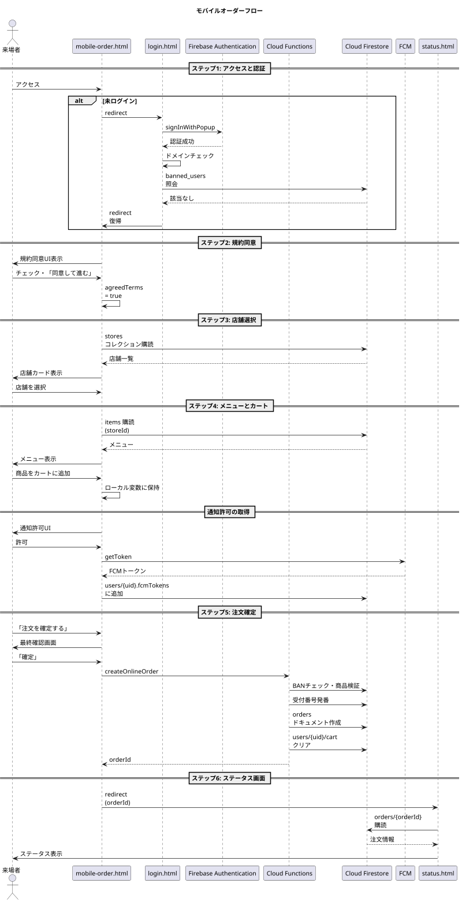

### 6.4 セルフオーダーキオスク（SOK）フロー

#### 6.4.1 目的と利用者

SOKは本システムの第二の柱として位置づけられる注文経路である。利用者は `@gl.pen-kanagawa.ed.jp` ドメインを保有しない一般来場者（外部の方）である。

ドメイン制限により海外からの不正アクセスを排除する設計上、外部の来場者は本来モバイルオーダーを利用できない。しかし、文化祭という性質上、外部の来場者にも注文の利便性を提供する必要がある。SOKは「物理的に校内のSOK端末を操作できる」という条件を満たす者のみが利用できる注文経路として設計されており、これにより「現地にいる人」だけにアクセスを限定する。

#### 6.4.2 全体フロー概要

SOKフローは以下の二つの段階で構成される。

**段階A: SOK端末上での操作**
1. 端末の起動と店舗紐付け
2. メニュー閲覧と商品選択
3. 注文確定（仮注文の作成）
4. QRコード表示

**段階B: 来場者のスマートフォン上での操作**
5. QRコード読み取りと `sok-to.html` のオープン
6. 匿名認証
7. 通知許可
8. 注文内容確認と規約同意
9. 注文確定（仮注文の本注文化）
10. ステータス画面への遷移

各ステップを以下に詳述する。

#### 6.4.3 ステップ1: 端末の起動と店舗紐付け

**起動主体**  
店舗責任者が朝の営業開始時に、自店舗のiPadでSOKを起動する。

**起動手順**

1. iPadのブラウザで `portal.html` にアクセス
2. Googleアカウントで認証し、店舗パスワードを入力
3. 「SOK端末として起動」ボタンを押下
4. 自動的に新しいタブで `sok.html?store=店舗ID` が開かれる
5. ブラウザを全画面表示モードに切り替え

`?store=` パラメータにより、その端末は当日、特定の店舗のSOKとして固定される。複数台設置する場合、すべての端末で同じパラメータが使用される。

#### 6.4.4 ステップ2: メニュー閲覧と商品選択

**メニュー表示**  
`sok.html` は起動時に `?store=` パラメータから店舗IDを取得し、`items` コレクションを購読する。タッチ操作に最適化された大きなボタン形式でメニューを表示する。

**操作インターフェース**  
SOK端末は来場者が立ったまま操作するため、以下の設計指針を採用する。

- 大きなボタンと余白
- 最小限のスクロール（1画面に収まるメニュー数を想定）
- カート操作はその場で確認できる位置に配置
- 戻る・キャンセルボタンを目立つ位置に配置

**カート操作**  
モバイルオーダーと同様に、商品の追加、数量変更、削除、トッピング選択が可能である。カート内容はSOK端末のJavaScript変数に保持される。

#### 6.4.5 ステップ3: 注文確定（仮注文の作成）

**「注文確定」ボタン**  
来場者がカート画面で「注文確定」ボタンを押下すると、Cloud Function `createOrderFromSok` が呼び出される。

**Cloud Function 内の処理**

1. リクエストの検証（店舗ID、商品ID、数量など）
2. 各 `itemId` の販売可否を確認
3. 受付番号を発番（`getNextReceiptNumber("sok")`）
4. 仮注文ドキュメントを `orders` コレクションに作成
5. 注文ドキュメントのIDを返却

**作成される仮注文ドキュメント**

```json
{
  "status": "cooking",
  "orderChannel": "sok",
  "paymentMethod": "au_pay_manual",
  "storeId": "store_101",
  "userId": null,
  "receiptNumber": 2018,
  "items": [...],
  "totalAmount": 750,
  "termsAgreedAt": null,
  "createdAt": "2026-09-12T11:05:30+09:00",
  "updatedAt": "2026-09-12T11:05:30+09:00",
  "cookingStartedAt": null,
  "readyToServeAt": null,
  "readyForPickupAt": null,
  "completedAt": null,
  "cancelledAt": null,
  "paidAt": null,
  "cancellationReason": null,
  "createdBy": null,
  "posTerminalId": null,
  "note": null
}
```

`userId` は `null` で作成される。これは本注文化（`sok-to.html` での確定）時に、来場者の匿名UIDが書き込まれるまでの暫定状態である。

**status の扱い**  
仮注文の段階で status は `cooking` で作成される。ただし、この段階ではまだ `userId` が確定していないため、厨房側に表示してよいか否かは設計判断が必要である。

本書では以下の方針を採用する：仮注文は `userId: null` の状態で `cooking` ステータスのため `kitchen.html` に表示される可能性があるが、`kitchen.html` 側のクエリ条件で `userId != null` をフィルタとして加え、本注文化されるまで厨房に表示されないようにする。

※このフィルタの実装方針は本書執筆時点で未確定であり、別の実装手段（例: 仮注文用の別ステータス値の導入）を採用する可能性がある。

#### 6.4.6 ステップ4: QRコード表示

**QRコードの内容**  
仮注文ドキュメントのIDを使い、以下のURLを生成する。

```
https://ynr-cs.github.io/nanryosai-2026/main/sok-to.html?orderId=xxxxxxxx
```

このURLをQRコード描画ライブラリで生成し、画面に大きく表示する。

**画面表示**  
QR表示画面には以下の要素を含める。

- QRコード（中央に大きく表示）
- 受付番号
- 案内文：「QRコードをご自身のスマートフォンで読み取ってください」
- 重要な注意：「最初に読み取った方が、注文者として確定します」
- 「次の人へ」ボタン

**有効期限**  
仮注文の有効期限は作成から15分間である。15分以内に来場者がQRを読み取り、`sok-to.html` で注文確定を完了しなかった場合、仮注文は自動的にキャンセルされる。

**自動リセット**  
QR表示から20秒経過すると、SOK端末は自動的にメニュー画面に戻る。これは「次の来場者がすぐに利用できるように」する目的である。20秒待たずに「次の人へ」ボタンで明示的にリセットすることもできる。

#### 6.4.7 ステップ5: QRコード読み取りと `sok-to.html` のオープン

**読み取り操作**  
来場者は自身のスマートフォンのカメラまたはQR読み取りアプリでQRコードをスキャンする。スマートフォンのブラウザで `sok-to.html?orderId=xxxxxxxx` が開かれる。

**初期化処理**  
`sok-to.html` は起動時に以下の処理を実行する。

1. `?orderId=` パラメータから注文IDを取得
2. Firestore から該当注文ドキュメントを取得
3. 注文の存在と有効性を確認
   - 存在しない場合：エラー画面「注文が見つかりません」
   - すでに `userId` が紐付いている場合：エラー画面「この注文はすでに確定されています」
   - 作成から15分超過：エラー画面「有効期限が切れています」

#### 6.4.8 ステップ6: 匿名認証

**匿名認証の実行**  
注文の有効性確認後、`signInAnonymously` を呼び出して匿名認証を実行する。

**UIDの紐付け**  
発行された匿名UIDを使い、注文ドキュメントの `userId` フィールドを更新する。この時点で、その注文の正規所有者がこの匿名UIDのユーザーとして確定する。

```json
{
  "userId": "anon_xyz789",
  ...
}
```

**競合防止**  
複数の来場者が同じQRを同時に読み取った場合、最初に `userId` を更新したリクエストのみが成功する。Firestore のトランザクションまたは `runTransaction` を使い、`userId == null` であることを条件に更新を行う。

```javascript
await firestore.runTransaction(async (tx) => {
  const order = await tx.get(orderRef);
  if (order.data().userId !== null) {
    throw new Error("この注文はすでに確定されています");
  }
  tx.update(orderRef, {
    userId: anonUid,
    updatedAt: serverTimestamp()
  });
});
```

#### 6.4.9 ステップ7: 通知許可

**通知許可UI**  
匿名認証成功後、Push通知の許可を要求する。

「商品の準備ができたらお知らせします。通知を許可してください」というメッセージとともに、「許可する」「あとで」のボタンを表示する。

**FCMトークンの登録**  
来場者が許可した場合、FCMトークンを取得し、`users/{anonUid}` ドキュメントの `fcmTokens` 配列に追加する。匿名ユーザー用の `users` ドキュメントが存在しない場合、新規に作成する。

```json
users/anon_xyz789
{
  "email": null,
  "displayName": null,
  "isAnonymous": true,
  "notificationEnabled": true,
  "fcmTokens": ["fcm_token_string_here"],
  "termsAgreedAt": null,
  "favoriteItemIds": [],
  "createdAt": "2026-09-12T11:08:42+09:00",
  "lastLoginAt": "2026-09-12T11:08:42+09:00"
}
```

#### 6.4.10 ステップ8: 注文内容確認と規約同意

**最終確認画面**  
通知許可の処理後、注文内容の最終確認画面を表示する。

表示内容：
- 注文した商品の一覧
- 各商品の価格と数量
- 合計金額
- 受付番号
- 重要な利用規約（特に呼び出し後15分以内の受け取り義務）の強調表示

**規約同意**  
画面下部に以下の要素を配置する。

- 「上記の利用規約に同意し、注文を確定します」というチェックボックス
- 「○○○円の注文を確定する」ボタン（チェックボックスがオンになるまで非活性）

#### 6.4.11 ステップ9: 注文確定（本注文化）

**確定操作**  
来場者がチェックボックスをオンにし、「注文を確定する」ボタンを押下すると、Cloud Function `confirmSokOrder`（仮称）が呼び出される。

**Cloud Function 内の処理**

1. 認証されたユーザー（匿名UID）を取得
2. 注文ドキュメントの `userId` が認証ユーザーのUIDと一致することを確認
3. `termsAgreedAt` フィールドにタイムスタンプを記録
4. status は `cooking` を維持（仮注文時にすでに `cooking` で作成されているため）

この時点で、注文は完全に確定し、厨房側で調理可能な状態となる。

#### 6.4.12 ステップ10: ステータス画面への遷移

注文確定後、`sok-to.html` は `status.html?orderId=...` へ遷移する。来場者は以降、`status.html` でリアルタイムにステータスの変化を確認できる。

#### 6.4.13 シーケンス図

SOKフローのシーケンス図を以下に示す。

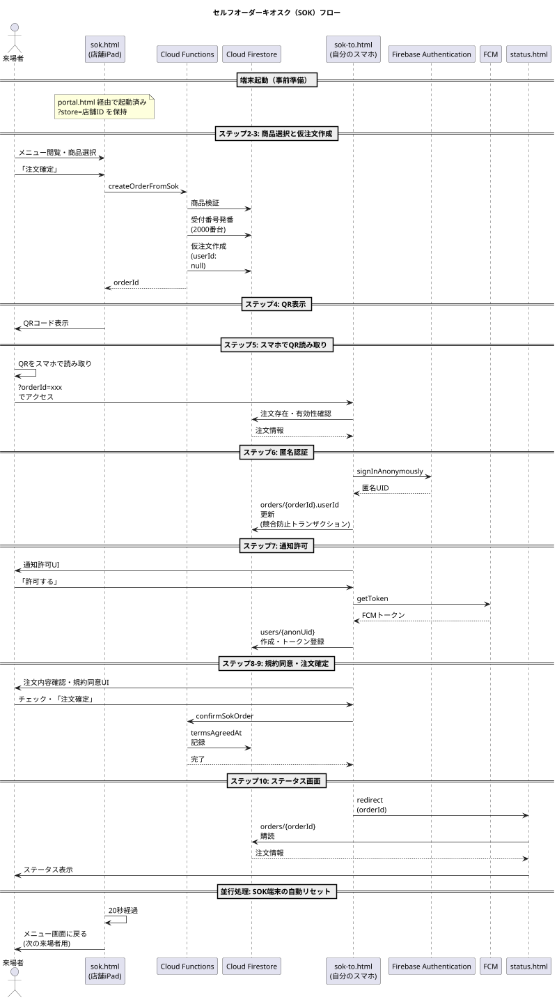

### 6.5 有人POSレジフロー

#### 6.5.1 目的と利用者

有人POSは本システムにおける例外的な経路である。以下のいずれかに該当する場合に利用される。

- スマートフォンを所持していない来場者（高齢者など）
- スマートフォンを使用できない状況の来場者
- 複雑な注文（特殊な要望を含む注文）でスタッフの介入が必要な場合
- モバイルオーダーやSOKでトラブルが発生した場合の代替経路

#### 6.5.2 全体フロー概要

1. 来場者の口頭注文
2. レジ担当スタッフによる入力
3. 注文ドキュメントの作成
4. 紙の番号札の交付

各ステップを以下に詳述する。

#### 6.5.3 ステップ1: 来場者の口頭注文

来場者は店舗カウンターに並び、レジ担当スタッフに口頭で注文を伝える。スタッフは必要に応じて来場者にメニューを示し、希望商品とトッピングを確認する。

#### 6.5.4 ステップ2: レジ担当スタッフによる入力

**`pos.html` の起動**  
レジ担当スタッフはあらかじめ `portal.html` から認証を済ませ、`pos.html` を開いた状態で待機している。

**端末IDの保持**  
`pos.html` はローカルストレージに端末ID（例: `pos_terminal_a`）を保持している。この端末IDは初期セットアップ時に設定され、当日は変更されない。

**注文入力**  
スタッフは画面上のメニュー一覧から、来場者の注文を再現する。

- 商品ボタンをタップしてカートに追加
- 数量を増減
- トッピングを選択
- 必要に応じてメモを記入

**注文確定**  
内容を確認後、「注文を確定する」ボタンを押下する。

#### 6.5.5 ステップ3: 注文ドキュメントの作成

**`createPosOrder` の呼び出し**  
スタッフが「注文を確定する」を押下すると、Cloud Function `createPosOrder` が呼び出される。

**Cloud Function 内の処理**

1. スタッフのUID（`createdBy`）を取得
2. リクエストパラメータの検証
3. 各 `itemId` の販売可否を確認
4. 受付番号を発番（`getNextReceiptNumber("pos")`）
5. 注文ドキュメントを作成
6. 注文IDと受付番号を返却

**作成される注文ドキュメント**

```json
{
  "status": "cooking",
  "orderChannel": "pos",
  "paymentMethod": "au_pay_manual",
  "storeId": "store_101",
  "userId": null,
  "receiptNumber": 142,
  "items": [...],
  "totalAmount": 600,
  "termsAgreedAt": null,
  "createdAt": "2026-09-12T11:32:15+09:00",
  "updatedAt": "2026-09-12T11:32:15+09:00",
  "cookingStartedAt": null,
  "readyToServeAt": null,
  "readyForPickupAt": null,
  "completedAt": null,
  "cancelledAt": null,
  "paidAt": null,
  "cancellationReason": null,
  "createdBy": "uid_staff_001",
  "posTerminalId": "pos_terminal_a",
  "note": null
}
```

POS注文では `userId` は `null` のまま維持される。POS注文の来場者は本システム上のアカウントを持たず、紙の番号札のみで識別されるためである。

`termsAgreedAt` も `null` である。POS注文では規約同意UIを設置しない（第3章6節参照）。

#### 6.5.6 ステップ4: 紙の番号札の交付

**画面表示**  
注文確定後、`pos.html` には大きく受付番号が表示される。

**紙の交付**  
スタッフは紙片に受付番号を書き、来場者に手渡す。来場者には以下の趣旨を口頭で伝える。

「番号札をお持ちください。商品ができましたら、こちらの呼び出しモニターに番号が表示されますので、お受け取りにお越しください。」

**紙の準備**  
当日、各店舗には番号札用の小さな紙片を準備する。手書きまたは事前印刷した連番紙を使用する。手書きの場合、スタッフが受付番号を画面で確認しながら記入する。

#### 6.5.7 規約同意を取得しない理由

POS注文では規約同意UIを設置しないが、その背景は以下の通りである。

**実施が困難**  
高齢者がチェックボックスを操作する、規約を読み込む、というUI操作は現実的でない。レジ担当スタッフが来場者の代わりに同意操作を行うことは、同意の主体を曖昧にし、規約の有効性を損なう。

**ペナルティ実行が不可能**  
POS注文は `userId: null` であり、来場者は本システム上で個人を特定されない。仮に放置キャンセルが発生しても、その来場者を後から識別してBANに登録する手段がない。したがって、規約同意を取得しても実質的な意味を持たない。

**現場での口頭案内で代替**  
レジ担当スタッフは紙の番号札を渡す際、口頭で「商品ができたら呼び出しますので、必ず受け取りに来てください」と伝える。これは形式的な同意ではないが、現場での合意形成として機能する。

#### 6.5.8 シーケンス図

有人POSフローのシーケンス図を以下に示す。

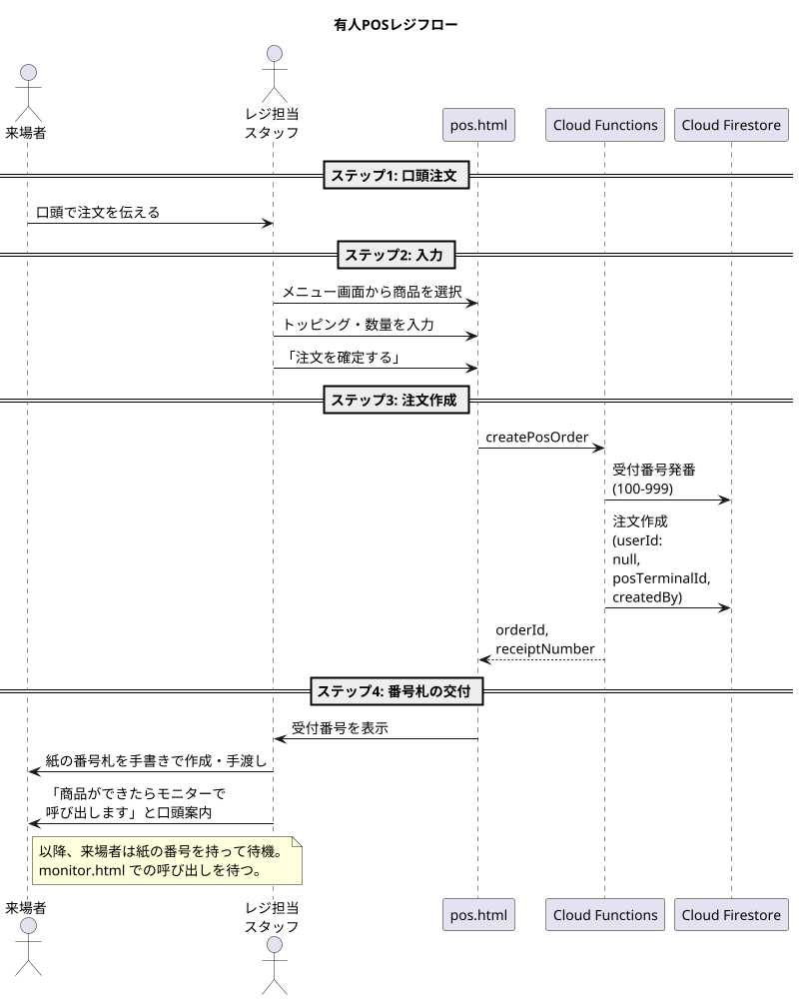

### 6.6 3経路の比較まとめ

3つの注文経路における処理の差分を以下に整理する。

| 項目 | モバイルオーダー | SOK | 有人POS |
|---|---|---|---|
| 認証方式 | Googleアカウント（学校ドメイン） | 匿名認証 | スタッフ認証のみ |
| `userId` の値 | 学校アカウントUID | 匿名UID | `null` |
| 規約同意 | あり (`termsAgreedAt` 記録) | あり (`termsAgreedAt` 記録) | なし (`null`) |
| 受付番号 | 7000番台 | 2000番台 | 100〜999 |
| 注文作成関数 | `createOnlineOrder` | `createOrderFromSok` + `confirmSokOrder` | `createPosOrder` |
| `createdBy` の値 | `null` | `null` | スタッフUID |
| `posTerminalId` の値 | `null` | `null` | 端末ID |
| 通知（FCM） | あり | あり | なし |
| ステータス画面 | `status.html` | `status.html` | なし（モニターと紙のみ） |
| 規約違反時のBAN対象性 | あり | あり | なし（個人特定不可） |

### 6.7 まとめ

本章では、3つの注文経路の詳細フローを記述した。モバイルオーダーは在校生向けの主要経路として、SOKは外部来場者向けの現地限定経路として、有人POSはスマートフォン非保持者向けの例外経路として、それぞれの役割を明確に分担する。

すべての経路は最終的に Firestore の `orders` コレクションに `status: cooking` の注文ドキュメントを作成する。ここから先は経路を問わず共通のフローで処理される。次章では、その共通フロー（調理から提供まで）を詳述する。

---
## 第7章 共通オペレーションフロー

### 7.1 章の目的

本章では、注文経路（モバイルオーダー、SOK、有人POS）を問わず、注文ドキュメントが `orders` コレクションに `status: cooking` で作成された後、商品が来場者に提供されて注文が完了するまでの共通フローを記述する。

このフローは厨房スタッフ、提供口スタッフ、来場者の三者の協調動作によって進行する。各ステータス遷移のトリガー、関連画面の表示更新、Push通知の発火タイミングを以下に詳述する。

### 7.2 全体フロー概観

注文ドキュメントが作成されてから完了するまでの大まかな流れを以下に示す。

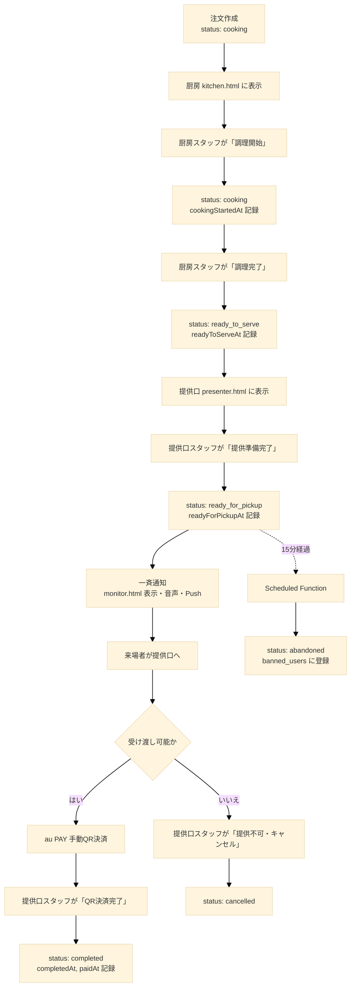

このフローは注文経路によらず共通である。経路の違いは `orderChannel` フィールドにのみ反映され、ステータス遷移や処理内容には影響しない。

### 7.3 フェーズ1: 調理（厨房オペレーション）

#### 7.3.1 厨房画面 (`kitchen.html`) の常時購読

**購読クエリ**  
`kitchen.html` は起動時から常に、Firestore の `orders` コレクションに対して以下の条件でリアルタイム購読を開始する。

```javascript
firestore.collection("orders")
  .where("storeId", "==", currentStoreId)
  .where("status", "in", ["cooking", "cooking"])
  .where("userId", "!=", null)  // 仮注文を除外
  .orderBy("createdAt", "asc")
```

`storeId` フィルタにより、その厨房に関係する店舗の注文のみが表示される。`status` フィルタにより、`cooking`（新規注文）と `cooking`（調理中）の注文が表示対象となる。`userId != null` フィルタは、SOKフローで仮注文（`userId: null` で作成された未確定状態）を除外するためのものである。

※`userId != null` フィルタの実装方針は本書執筆時点で未確定であり、別の方法（例: 仮注文用の中間ステータス値の導入）が採用される可能性がある。

#### 7.3.2 新規注文の受信と通知

**画面への追加表示**  
新たな `cooking` 注文が `onSnapshot` を通じて受信されると、画面の注文一覧の末尾に新しいカードが追加表示される。

**通知音の再生**  
新規注文の受信タイミングで、厨房に通知音を再生する。これは厨房スタッフが画面を常に注視していなくても、新規注文の発生を聴覚で認識できるようにする目的である。

**経路の視覚的識別**  
注文カードには `orderChannel` フィールドに応じたアイコンまたは色を表示する。

| `orderChannel` | 視覚的表現 |
|---|---|
| `mobile` | スマートフォンアイコン、青色 |
| `sok` | キオスク端末アイコン、緑色 |
| `pos` | レジアイコン、橙色 |

これにより、厨房スタッフは注文の発生源を一目で把握できる。

#### 7.3.3 注文カードの表示内容

各注文カードには以下の情報を表示する。

- 受付番号（最も大きく表示）
- 注文経路アイコン
- 商品リスト（商品名、数量、トッピング）
- 注文受付からの経過時間
- 「調理開始」または「調理完了」ボタン

経過時間の表示は、注文が長時間放置されないよう、厨房スタッフへの注意喚起の役割を果たす。

#### 7.3.4 「調理開始」操作

**操作主体**  
厨房スタッフが、自分が今から調理する注文に対して「調理開始」ボタンを押下する。

**処理内容**  
`kitchen.html` は対応する注文ドキュメントに以下の更新を行う。

```javascript
{
  status: "cooking",
  cookingStartedAt: serverTimestamp(),
  updatedAt: serverTimestamp()
}
```

**画面表示の変化**  
`kitchen.html` の購読クエリは `status: "cooking"` も対象に含むため、注文カードは画面から消えず、「調理中」の表示状態に切り替わる。ボタンの表示は「調理開始」から「調理完了」に変わる。

**並行調理の対応**  
厨房スタッフは複数の注文を並行して調理することが一般的である。複数の注文を `cooking` 状態に同時に持つことは設計上問題ない。

#### 7.3.5 「調理完了」操作

**操作主体**  
厨房スタッフが、調理が完了した注文に対して「調理完了」ボタンを押下する。

**処理内容**  
注文ドキュメントに以下の更新を行う。

```javascript
{
  status: "ready_to_serve",
  readyToServeAt: serverTimestamp(),
  updatedAt: serverTimestamp()
}
```

**画面表示の変化**  
`status: "ready_to_serve"` は `kitchen.html` の購読クエリの対象外となるため、注文カードは画面から消える。同時に、`presenter.html` の購読クエリには `ready_to_serve` が含まれているため、注文カードが提供口画面に出現する。

#### 7.3.6 厨房オペレーションの設計上の考慮点

**画面の見やすさ**  
厨房環境（手が濡れる、油汚れがある）を考慮し、画面はタッチしやすく、誤操作しにくい設計とする。「調理開始」と「調理完了」のボタンは色を分け、明確に視覚的差別化を行う。

**操作の取り消し**  
誤って「調理開始」または「調理完了」を押した場合の取り消し機能は、本書執筆時点では明示的に設計しない。誤操作が判明した場合、提供口スタッフ側で適切に処理する（例: `ready_to_serve` になってしまったが実は調理が未完了の場合、提供口スタッフに口頭で伝え、調理完了まで `presenter.html` 側で「提供準備完了」を押さない運用とする）。

### 7.4 フェーズ2: 提供口準備

#### 7.4.1 提供口画面 (`presenter.html`) の常時購読

**購読クエリ**  
`presenter.html` は起動時から以下の条件でリアルタイム購読を開始する。

```javascript
firestore.collection("orders")
  .where("storeId", "==", currentStoreId)
  .where("status", "in", ["ready_to_serve", "ready_for_pickup"])
  .orderBy("readyToServeAt", "asc")
```

`ready_to_serve`（提供口準備中）と `ready_for_pickup`（呼び出し中）の両方を対象とすることで、提供口スタッフは「これから準備する注文」と「呼び出し中で受け渡し待ちの注文」の両方を把握できる。

#### 7.4.2 注文カードの表示内容

各注文カードには以下の情報を表示する。

- 受付番号（最も大きく表示）
- 注文経路アイコン
- 商品リスト（商品名、数量、トッピング）
- 合計金額（決済時の目視確認用）
- 現在のステータス（`ready_to_serve` または `ready_for_pickup`）
- 状態に応じたボタン

ステータスごとのボタン表示は以下の通りである。

| ステータス | 表示するボタン |
|---|---|
| `ready_to_serve` | 「提供準備完了」、「提供不可・キャンセル」 |
| `ready_for_pickup` | 「QR決済完了」、「提供不可・キャンセル」 |

#### 7.4.3 提供口スタッフの作業内容

**最終準備**  
提供口スタッフは `ready_to_serve` の注文に対して、商品の最終的な仕上げ作業を行う。具体的には以下のような作業である。

- 商品をトレイに盛り付ける
- スプーン、フォーク、紙ナプキンなどの付属品を添える
- 包装または袋詰め
- 注文内容（特にトッピング）を最終確認

**「提供準備完了」操作**  
最終準備が完了したら、対応する注文の「提供準備完了」ボタンを押下する。

**処理内容**  
`presenter.html` は対応する注文ドキュメントに以下の更新を行う。

```javascript
{
  status: "ready_for_pickup",
  readyForPickupAt: serverTimestamp(),
  updatedAt: serverTimestamp()
}
```

`readyForPickupAt` は放置ペナルティの判定基準となる重要なフィールドである。この時刻を起点として15分が経過すると、Scheduled Function による自動キャンセルの対象となる。

### 7.5 フェーズ3: 一斉通知

#### 7.5.1 通知のトリガー

注文ドキュメントの status が `ready_for_pickup` に更新されたことをトリガーに、複数の通知が一斉に発火する。これらの通知はそれぞれ異なる仕組みで実装される。

#### 7.5.2 `monitor.html` への番号表示

**表示の更新**  
`monitor.html` は以下の条件でリアルタイム購読を行っている。

```javascript
firestore.collection("orders")
  .where("status", "==", "ready_for_pickup")
  .orderBy("readyForPickupAt", "asc")
```

新たに `ready_for_pickup` 状態となった注文の受付番号が、画面に大きく追加表示される。

**表示形式**  
画面には呼び出し中の番号が一覧で表示される。最新の番号は強調表示（点滅または色変化）し、来場者の注意を引く。

```
==========================================
       お呼び出し中
==========================================

      7042    2018    142

==========================================
   番号でお呼びします
   提供口へお越しください
==========================================
```

**店舗別表示**  
複数店舗が同じ `monitor.html` を共有する場合、店舗ごとに区切って番号を表示する。各店舗が個別に `monitor.html` を運用する場合は、`?store=` パラメータでフィルタリングし、自店舗の番号のみ表示する。

#### 7.5.3 合成音声によるアナウンス

**Speech Synthesis API**  
`monitor.html` は新規番号の追加を検出すると、ブラウザの Speech Synthesis API を使い、音声でアナウンスを行う。

**アナウンス文言**

```
「[番号]番のお客様、お受け取りください」
```

例：「7042番のお客様、お受け取りください」

**音声設定**  
- 言語: 日本語（`ja-JP`）
- 音量: 最大付近（環境音に負けない程度）
- 話速: やや遅め（聞き取りやすさを優先）

**複数番号の連続アナウンス**  
複数の番号がほぼ同時に呼び出された場合、順次アナウンスを行う。アナウンスのキューイングを実装し、前のアナウンスが終わってから次のアナウンスが開始されるようにする。

#### 7.5.4 来場者スマートフォンへのPush通知

**FCM Push通知の発火**  
注文ドキュメントの status が `ready_for_pickup` に更新されたことをトリガーに、Cloud Functions のトリガー関数（例: `onOrderStatusChanged`）が起動する。

**通知の送信処理**  
トリガー関数は以下の処理を実行する。

1. 注文ドキュメントから `userId` を取得
2. `userId` が `null` の場合（POS注文）はPush通知をスキップ
3. `userId` を使い `users/{userId}` ドキュメントから `fcmTokens` 配列を取得
4. 各FCMトークンに対して以下の通知ペイロードを送信

```json
{
  "notification": {
    "title": "ご注文の準備ができました！",
    "body": "受付番号 7042 のお客様、提供口でお受け取りください。"
  },
  "data": {
    "orderId": "xxxxxxxx",
    "click_action": "https://ynr-cs.github.io/nanryosai-2026/main/status.html?orderId=xxxxxxxx"
  }
}
```

**通知タップ時の挙動**  
Push通知をタップすると、来場者のブラウザで `status.html?orderId=...` が開かれる。来場者は通知をタップして直接ステータス画面に遷移できる。

**通知不許可ユーザーへの対応**  
`users/{userId}.notificationEnabled` が `false`、または `fcmTokens` が空配列の場合、Push通知は送信されない。これらの来場者は `status.html` をブラウザで開いたまま待機することで、ステータスの変化をリアルタイムに認識する。

#### 7.5.5 `status.html` の表示更新

**リアルタイム更新**  
来場者の `status.html` は対象注文を `onSnapshot` で購読しているため、status の変化が即座に画面に反映される。

**`ready_for_pickup` 時の表示**  
画面の表示は以下のように切り替わる。

- 背景色を強調色（例: 黄色や緑）に変更
- 大きな文字で「商品の準備ができました！」と表示
- 受付番号を画面いっぱいに表示
- 「提供口へお越しください。15分以内にお受け取りください」と案内
- 「提供口で au PAY のQRコードを読み取って決済してください」と決済方法を案内

**バイブレーション（対応端末のみ）**  
ブラウザの Vibration API に対応する端末では、`ready_for_pickup` への遷移時に短いバイブレーションを発火する。これは Push通知と並行して、視覚的・聴覚的に呼び出しを認識できるようにする補助手段である。

### 7.6 フェーズ4: 商品提供と決済

#### 7.6.1 来場者の提供口への移動

通知（モニター表示、音声、Push、`status.html` 更新）を認識した来場者は、提供口へ移動する。

**経路ごとの番号提示方法**

| 経路 | 番号の提示方法 |
|---|---|
| モバイルオーダー | 来場者がスマートフォンで `status.html` を開き、画面を提示 |
| SOK | 来場者がスマートフォンで `status.html` を開き、画面を提示 |
| 有人POS | 来場者が手書きの紙の番号札を提示 |

#### 7.6.2 提供口スタッフの確認作業

**番号の確認**  
提供口スタッフは、来場者から提示された番号と、`presenter.html` 上の `ready_for_pickup` の注文番号を照合する。

**注文内容の確認**  
スタッフは `presenter.html` 上で該当注文の商品リストを確認し、用意した商品が注文内容と一致することを最終確認する。

#### 7.6.3 au PAY 手動QR決済

**QRコードの読み取り**  
スタッフは「あちらのQRコードを読み取って、お支払いをお願いします」と来場者に案内する。各店舗のカウンターには au PAY の店舗QRコードが大きく掲示されている。

**金額の入力**  
来場者は自身のスマートフォンで au PAY アプリを起動し、QRコードを読み取る。表示された支払いフォームに金額を手入力する。スタッフは「○○○円のお支払いをお願いします」と金額を口頭で伝える。

**決済の実行**  
来場者は au PAY アプリ上で支払いを実行する。決済完了後、アプリには決済完了画面が表示される。

**決済完了画面の提示**  
来場者は決済完了画面をスタッフに見せる。スタッフは以下を目視で確認する。

- 決済が完了している旨の表示
- 決済金額が `presenter.html` 上の合計金額と一致すること
- 決済日時が直近であること（過去の決済画面を流用していないこと）

#### 7.6.4 「QR決済完了」操作

**操作主体**  
提供口スタッフが、決済完了画面を確認した後、`presenter.html` 上で「QR決済完了」ボタンを押下する。

**処理内容**  
注文ドキュメントに以下の更新を行う。

```javascript
{
  status: "completed",
  completedAt: serverTimestamp(),
  paidAt: serverTimestamp(),
  updatedAt: serverTimestamp()
}
```

**商品の引き渡し**  
スタッフは商品を来場者に引き渡し、「ありがとうございました」と声をかける。

**画面表示の変化**  
- `presenter.html`: 該当注文カードが画面から消える
- `monitor.html`: 該当番号が呼び出し一覧から消える
- `status.html`: 「ありがとうございました」の表示に切り替わる
- 来場者の `users/{uid}` ドキュメントの注文履歴に追加される（`account.html` の注文履歴で参照可能）

#### 7.6.5 提供口オペレーションの設計上の考慮点

**スタッフの目視確認の重要性**  
au PAY 手動QR決済方式は、来場者が金額を手入力するため、誤入力（または意図的な改ざん）の可能性が原理的に存在する。スタッフによる目視確認が、本システムにおける唯一の金額検証手段である。

混雑時にはこの確認が形骸化するリスクがあるため、スタッフトレーニングにおいて「必ず金額を確認してから完了ボタンを押す」ことを徹底する。

**完了ボタンの押し忘れリスク**  
スタッフが商品を渡した後に「QR決済完了」ボタンを押し忘れると、注文は `ready_for_pickup` のまま残り続ける。受付番号が解放されず、放置ペナルティの誤発動の原因となる。

これを防ぐため、`presenter.html` の運用では「商品を渡す前に完了ボタンを押す」または「商品を渡した直後にすぐ押す」というルールを徹底する。

### 7.7 フェーズ5: 提供不可・キャンセル

#### 7.7.1 キャンセルが発生する場面

提供不可によるキャンセルは、以下のような場面で発生する。

- 商品の品質に問題があった場合（落下、汚損など）
- 来場者から注文取消の依頼があった場合（決済前であれば）
- スタッフのミスにより重複した注文を作成した場合
- その他、何らかの理由で商品を提供できないと判明した場合

#### 7.7.2 「提供不可・キャンセル」操作

**操作主体**  
提供口スタッフ（または厨房スタッフ）が、`presenter.html` または `kitchen.html` で「提供不可・キャンセル」ボタンを押下する。

**確認ダイアログ**  
誤操作を防ぐため、「この注文をキャンセルしてよろしいですか？」という確認ダイアログを表示する。スタッフが「はい」を選択した場合のみ、キャンセル処理を実行する。

**理由の入力（任意）**  
キャンセル理由を選択するUIを表示する。

- 「商品が提供できない」
- 「お客様都合」
- 「重複注文」
- 「その他（自由入力）」

**処理内容**  
注文ドキュメントに以下の更新を行う。

```javascript
{
  status: "cancelled",
  cancelledAt: serverTimestamp(),
  cancellationReason: "商品が提供できない",
  updatedAt: serverTimestamp()
}
```

#### 7.7.3 経路別の対応

**モバイルオーダー / SOK の場合**  
来場者の `status.html` には以下の趣旨のメッセージが表示される。

```
申し訳ございません。本注文は店舗都合によりキャンセルされました。
お支払いは発生しておりませんので、ご安心ください。
```

決済は提供時に行われる方式のため、キャンセルされた注文は決済そのものが発生していない。来場者に金銭的な負担は生じない。

**有人POSの場合**  
来場者は紙の番号札のみで識別される。`status.html` を見ていないため、自分の注文がキャンセルされたことをシステム経由で知ることができない。

このため、有人POS注文のキャンセル時は、提供口スタッフが直接来場者に口頭で謝罪し、状況を説明する運用とする。

```
「申し訳ございません。○○番でご注文の[商品名]ですが、[理由]のため、
本日のご提供ができなくなってしまいました。誠に申し訳ございません。」
```

`monitor.html` 上では、キャンセルされた番号は呼び出し一覧から削除される。同時に「○○番のご注文はキャンセルとなりました」という一時的な案内表示を、画面の隅に短時間表示する設計を採用する余地がある（実装は本書執筆時点で未確定）。

### 7.8 共通フローのシーケンス図

ここまでの共通フローを統合したシーケンス図を以下に示す。

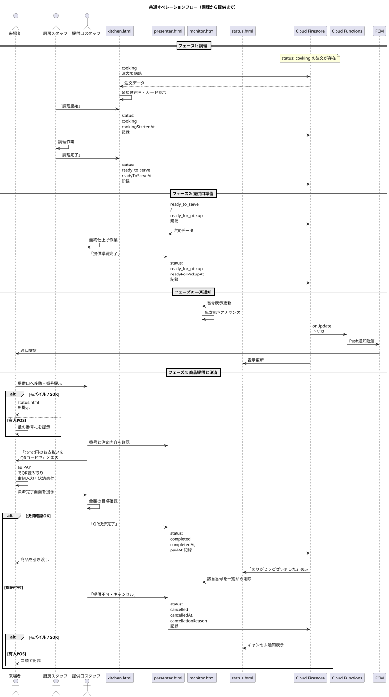

### 7.9 ステータス遷移と各画面の関係

各ステータスにおいて、各画面がどのように動作するかをまとめる。

| ステータス | `kitchen.html` | `presenter.html` | `monitor.html` | `status.html` |
|---|---|---|---|---|
| `cooking` | 表示・通知音 | 非表示 | 非表示 | 「注文を受け付けました」 |
| `cooking` | 「調理中」表示 | 非表示 | 非表示 | 「調理中です」 |
| `ready_to_serve` | 非表示 | 「準備中」表示 | 非表示 | 「もうすぐ完成します」 |
| `ready_for_pickup` | 非表示 | 「呼び出し中」表示 | 番号表示・音声 | 強調表示・「提供口へ」 |
| `completed` | 非表示 | 非表示 | 非表示 | 「ありがとうございました」 |
| `cancelled` | 非表示 | 非表示 | 非表示 | 「キャンセルされました」 |
| `abandoned` | 非表示 | 非表示 | 非表示 | 「期限切れにより放棄されました」 |

### 7.10 並列性と競合の考慮

#### 7.10.1 複数注文の並列処理

文化祭のピーク時には、各店舗で同時に複数の注文が並行して処理される。本システムは Firestore のリアルタイム同期と楽観的並行性制御により、複数注文の並列処理を自然にサポートする。

各注文は独立したドキュメントとして扱われ、ステータス遷移は注文ごとに独立して進行する。厨房スタッフが注文Aを `cooking` にしている間に、別のスタッフが注文Bを `cooking` にすることに何ら問題はない。

#### 7.10.2 同時操作の競合

ごく稀に、二人のスタッフが同じ注文の同じボタンを同時に押す状況が発生し得る。例えば、二人の提供口スタッフが同じ注文の「QR決済完了」を同時に押した場合である。

この場合、両者の更新リクエストは Firestore に対して並列に発行されるが、最終的な状態は「`completed` に遷移した」という同じ結果に収束する。`completedAt` のタイムスタンプはサーバ側で計算されるため、いずれか一方の値で上書きされる。実用上、この競合は問題とならない。

#### 7.10.3 異常な遷移の防止

意図しないステータス遷移（例: `completed` から `cooking` に戻る、`cancelled` から `ready_for_pickup` に戻るなど）を防ぐため、Firestore セキュリティルールで遷移の妥当性を検証する仕組みを実装する余地がある。

```
match /orders/{orderId} {
  allow update: if isValidStatusTransition(
    resource.data.status,
    request.resource.data.status
  );
}
```

`isValidStatusTransition` 関数では、許可されるステータス遷移パターンを列挙し、それ以外の遷移を拒否する。詳細な実装は第9章で扱う。

### 7.11 まとめ

本章では、注文経路を問わず共通する、調理から提供までのオペレーションフローを記述した。`cooking` から `completed`（または `cancelled`）までのステータス遷移は、厨房スタッフ、提供口スタッフ、そして自動化された通知機構の協調によって進行する。

`ready_for_pickup` への遷移をトリガーに、`monitor.html` の番号表示、合成音声、FCM Push通知、`status.html` の更新が一斉に発火する。これにより来場者は複数の手段で呼び出しを認識でき、いずれかが届かなかった場合のフェールセーフを実現している。

au PAY 手動QR決済は提供時に行われ、スタッフによる目視確認が金額検証の唯一の手段となる。これは原理的に完全防御不可能な設計であり、第9章でその構造的限界を明示的に扱う。

次章では、`ready_for_pickup` のまま15分以上放置された注文に対する、自動ペナルティ機構を詳述する。

---
## 第8章 放置ペナルティ機構

### 8.1 章の目的

本章では、商品の準備が完了し呼び出し中の状態（`ready_for_pickup`）であるにもかかわらず、来場者が15分以上経過しても受け取りに来なかった注文を自動検出し、ペナルティを実行する仕組みを記述する。

このペナルティ機構の目的は、放置キャンセルの発生を抑止し、商品廃棄を最小化すること、および他の利用者への迷惑を防ぐことである。

### 8.2 ペナルティの背景と必要性

#### 8.2.1 放置キャンセル問題

文化祭の運用において、以下のような問題が発生し得る。

**商品廃棄の発生**  
来場者が注文した商品が完成し提供口で呼び出されているにもかかわらず、来場者が受け取りに来ない場合、その商品は時間の経過とともに品質が劣化する。最終的に廃棄せざるを得なくなり、店舗側に金銭的・心理的負担が生じる。

**運用への悪影響**  
呼び出し中の番号が長時間滞留すると、`monitor.html` の表示が乱雑になり、他の来場者の混乱を招く。また、`presenter.html` 上にも長時間の `ready_for_pickup` 注文が残り続け、提供口スタッフの作業効率を低下させる。

**受付番号の枯渇**  
`ready_for_pickup` のまま放置された注文は受付番号を占有し続ける。第4章で述べた50回試行ルールに抵触する原因となり、最悪の場合、新規注文の受付が停止する事態を招く。

#### 8.2.2 ペナルティによる抑止

これらの問題を抑止するため、本システムでは以下の二段階の対策を講じる。

**事前抑止**  
注文確定前に利用規約への明示的な同意を取得する（第3章および第6章で詳述）。来場者は「呼び出し後15分以内に受け取りに来ないと利用停止となる」ことを認識した上で注文を行う。

**事後対応**  
15分の経過を自動検出し、放置注文を `abandoned` ステータスに遷移させ、対象ユーザーを `banned_users` コレクションに記録する。記録されたユーザーは以降、本システムへのログインが不可能となる。

### 8.3 ペナルティ機構の構成要素

ペナルティ機構は以下の四つの構成要素で実現される。

**Scheduled Function**  
1分ごとに自動起動し、対象注文を検出して `abandoned` への遷移と BAN 登録を実行する。

**`banned_users` コレクション**  
利用停止対象となったユーザーを記録する Firestore コレクション。第3章および第4章で構造を述べた。

**ログイン時の BAN チェック**  
来場者がログインを試みた際、`banned_users` コレクションを照会し、該当ユーザーのログインを中断する。第3章で詳述した。

**規約同意の事前取得**  
注文確定前に利用規約への同意を取得し、`termsAgreedAt` フィールドに記録する。第6章で詳述した。

本章ではこのうち、Scheduled Function の動作と `abandoned` 遷移の詳細を記述する。

### 8.4 Scheduled Function の動作

#### 8.4.1 起動間隔

Scheduled Function は1分ごとに自動的に起動する。Firebase の Cloud Scheduler 機能と連携し、以下のような定義で実装される。

```javascript
exports.checkabandonedOrders = onSchedule(
  {
    schedule: "every 1 minutes",
    timeZone: "Asia/Tokyo",
    region: "asia-northeast1"
  },
  async (event) => {
    // 検出と処理
  }
);
```

1分という起動間隔は、ペナルティ判定の精度（最大1分の遅延を許容）と、Firebase の課金量（呼び出し回数）のバランスから決定された。10分間隔では検出が遅すぎ、10秒間隔では呼び出し回数が過剰となる。

#### 8.4.2 検出クエリ

Scheduled Function は起動ごとに、以下の条件で `orders` コレクションを検索する。

```javascript
const fifteenMinutesAgo = new Date(Date.now() - 15 * 60 * 1000);

const query = firestore.collection("orders")
  .where("status", "==", "ready_for_pickup")
  .where("readyForPickupAt", "<=", fifteenMinutesAgo);
```

**検索条件の解説**

- `status == "ready_for_pickup"`: 現在呼び出し中の注文に限定する
- `readyForPickupAt <= 15分前`: 呼び出し開始から15分以上経過している

15分の経過判定は、`readyForPickupAt` フィールドに記録されたタイムスタンプを基準とする。`presenter.html` で「提供準備完了」が押された時刻からカウントが開始される。

#### 8.4.3 検出された注文への処理

クエリで検出された各注文に対して、以下の処理を順次実行する。

**ステップ1: ステータスの更新**  
注文ドキュメントを `abandoned` ステータスに更新する。

```javascript
await orderRef.update({
  status: "abandoned",
  cancelledAt: serverTimestamp(),
  cancellationReason: "15分放置による自動キャンセル",
  updatedAt: serverTimestamp()
});
```

`cancelledAt` フィールドには `abandoned` への遷移時刻を記録する。`cancelled` と同じフィールドを使用するのは、両者ともに「注文が完了せず終了した」という性質を共有するためである。両者は `status` フィールドの値で明確に区別される。

**ステップ2: BAN登録**  
注文の `userId` フィールドを使い、`banned_users` コレクションに新しいドキュメントを作成する。

```javascript
const userId = orderData.userId;
if (userId !== null) {
  await firestore.collection("banned_users").doc(userId).set({
    bannedAt: serverTimestamp(),
    reason: "abandoned_order",
    orderId: orderRef.id,
    bannedBy: "auto_scheduler"
  });
}
```

`userId` が `null` の場合（POS注文）は BAN 登録を行わない。POS注文は来場者が個人として識別されないため、BAN 登録の対象外である。

**ステップ3: ログ出力**  
処理結果を Cloud Functions のログに出力する。

```javascript
console.log(`[abandoned] Order ${orderRef.id}, User ${userId}, ` +
            `ReceiptNumber ${orderData.receiptNumber}, ` +
            `ReadyAt ${orderData.readyForPickupAt.toDate().toISOString()}`);
```

このログは、運用上の確認、トラブル調査、ペナルティの監査などに使用される。

#### 8.4.4 並列処理と冪等性

検出された注文は逐次的に処理される。Cloud Functions の同一インスタンス内では並列実行を行わないが、起動間隔（1分）よりも処理が長くかかる場合、次回起動時に重複して処理される可能性がある。

これを防ぐため、各処理は冪等性（同じ操作を複数回実行しても結果が変わらない性質）を持つよう設計される。

- `status` の更新は `ready_for_pickup` から `abandoned` への一方向であり、すでに `abandoned` になっている注文は次回検出クエリで該当しない
- `banned_users` への登録は `set` メソッドを使用し、すでに存在する場合は上書きする（重複登録は発生するが結果は同じ）

これにより、ペナルティ処理の重複実行は実害を生まない。

### 8.5 自動決済確定の不可性

#### 8.5.1 設計上の制約

旧来の設計では、放置注文に対して au PAY API を呼び出し、与信確保された支払いを強制的に売上確定（Capture）させる方針が検討された。しかし本システムでは、au PAY との API 連携を行わない方針を採用している。

このため、放置注文に対する自動決済確定は実装されない。放置された注文は決済が発生しないまま `abandoned` ステータスで終了する。

#### 8.5.2 商品の取扱

`abandoned` 状態となった注文の商品は、決済が発生しないため、形式上は「商品が無料で廃棄された」という状態となる。これは店舗にとって金銭的損失となるが、本システムでは以下の理由で受容する。

**規約による事前同意**  
来場者は注文確定時に「呼び出し後15分以内に受け取りに来ない場合のペナルティ」に同意している。商品廃棄が発生することは、この同意の前提となっている。

**ペナルティの抑止効果**  
BAN 登録という「アカウント利用停止」のペナルティは、来場者にとって相応の心理的コストを伴う。多くの来場者は呼び出しに応じて商品を受け取りに来ると期待される。

**運用上の現実性**  
au PAY 手動QR決済方式では、決済タイミングが提供時に統一されている。事前与信確保が存在しないため、強制決済の仕組みを構築することは技術的にも運用的にも複雑である。試験導入年度においては、この複雑性を回避し運用のシンプルさを優先する。

#### 8.5.3 在庫の取扱

`abandoned` 状態となった注文の在庫戻し処理は、本システムでは実装しない。これは本システムが数値による在庫管理（個数の自動減算）を行わない方針（第4章参照）に基づく。

`isAvailable` の真偽値による販売可否管理のみを採用するため、`abandoned` 注文が発生してもマスタデータに対する自動操作は不要である。店舗責任者が必要に応じて `portal.html` から `isAvailable` を手動で切り替える運用となる。

### 8.6 BANの効果

#### 8.6.1 BAN登録後のユーザー体験

`banned_users` コレクションに登録されたユーザーが、本システムにログインを試みた場合の挙動は以下の通りである。

**`login.html` でのGoogleログイン**

1. 来場者が `login.html` で Googleアカウントによるログインを実行
2. Firebase Authentication が認証を成功させ、UIDを取得
3. `login.html` は取得した UID で `banned_users` コレクションを照会
4. 該当ドキュメントが存在することを確認
5. 即座に `signOut()` を実行し、認証セッションを破棄
6. エラー画面を表示

エラー画面の表示文言は以下の通りである。

```
このアカウントは、過去の利用状況により本システムの利用が
制限されています。

ご不明な点がある場合は、運営本部までお問い合わせください。
```

**`sok-to.html` での匿名認証時**  
匿名認証で発行される UID は新規発行されるものであり、原理上 `banned_users` に該当することは発生しない。ただし防御的実装として、匿名認証直後にも `banned_users` 照会を行う。万一該当した場合は同様にエラー画面を表示する。

#### 8.6.2 BANの解除

本書執筆時点では、BANの自動解除機構は実装しない。一度 `banned_users` に登録されたユーザーは、運営による手動解除（Firebase Console からのドキュメント削除）が行われない限り、永続的にログインを拒否される。

これは、放置キャンセルという行為が一度限りの偶発事象ではなく、利用規約への明示的違反として扱われるべきとの判断による。

#### 8.6.3 BANの回避手段とその限界

来場者が新しい Google アカウントを作成し、別のアカウントで再度ログインすることで、形式上は BAN を回避できる。これは本システムの構造的限界の一つである。

しかし、以下の理由から実質的には十分な抑止効果が期待できる。

**ドメイン制限の存在**  
モバイルオーダーは `@gl.pen-kanagawa.ed.jp` ドメインに限定されており、このドメインのアカウントは神奈川県教育委員会から個人に紐付いた形で配布される。同一個人が複数のドメインアカウントを取得することは原理的に困難である。

**心理的コスト**  
BAN を回避するために新規アカウントを作成し、再度規約同意を行うという行為自体が一定の心理的コストを伴う。多くの一般的な来場者は、そこまでの努力をして再度システムを利用しようとは考えないと想定される。

**SOKの匿名認証**  
SOK 利用者の場合、匿名認証 UID は毎回新規発行されるため、形式上は BAN の影響を受けない。しかし、SOK 利用には物理的に校内のSOK端末を操作するという制約があり、悪意ある利用者の継続的な不正利用は現実的に困難である。

### 8.7 規約同意との整合性

#### 8.7.1 同意の有効性

ペナルティ機構が法的・倫理的に有効に機能するためには、来場者が事前に「ペナルティの存在」を認識し、明示的に同意していることが必要である。

本システムでは以下の運用により同意の有効性を担保する。

**注文ごとの同意取得**  
モバイルオーダーおよびSOKでは、各注文の確定前に必ず規約同意UIを表示する。同意済みであることをローカルに保持して再表示を省略するような実装は採用しない。

**同意内容の明示**  
規約文書の中で、「呼び出し後15分以内に受け取りに来ない場合、利用停止となる」旨を強調表示する。文章の中に埋もれない形で、視覚的に目立つ箇所に配置する。

**チェックボックスによる能動的同意**  
「同意します」のチェックボックスを必須とし、これがオンになっていない限り注文確定ボタンを非活性とする。来場者が能動的に同意を表明する操作を行わなければ先に進めない設計とする。

**タイムスタンプの記録**  
同意の事実とその時刻を `termsAgreedAt` フィールドに記録する。後から「いつ同意したか」を検証可能とする。

#### 8.7.2 同意のないPOS注文への対応

POS注文では規約同意を取得しない（第3章および第6章参照）。このため、POS注文は本ペナルティ機構の対象外となる。

具体的な扱いは以下の通りである。

- POS注文の `userId` は `null` であり、BAN 登録の対象とならない
- POS注文が `ready_for_pickup` で15分以上放置された場合、Scheduled Function は `userId == null` を確認し、ステータス更新のみ行い BAN 登録を行わない

ただし、`status` を `abandoned` に更新するか、それとも `ready_for_pickup` のまま放置するかは設計判断となる。本書では、POS注文も含めて15分経過時には `abandoned` に更新する方針を採用する。これは以下の理由による。

- 受付番号を解放することで、番号枯渇を防止する
- `monitor.html` の呼び出し一覧から消すことで、他の来場者の混乱を防ぐ
- `presenter.html` の作業対象から外すことで、提供口スタッフの作業を整理する

POS注文の `abandoned` 遷移時は、`cancellationReason` に「15分放置による自動キャンセル（POS注文・BAN対象外）」と記録する。

### 8.8 Scheduled Function の運用方針

#### 8.8.1 開発・テスト期間中の取扱

ペナルティ機構は本番運用時にのみ有効化する方針を採用する。開発・テスト期間中は Scheduled Function を有効化しない。

これは以下の理由による。

**開発効率の確保**  
本システムの開発過程では、開発者が複数回のテスト注文を作成し、各ステータス遷移を確認する作業が頻繁に発生する。`ready_for_pickup` で意図的に放置した状態で動作を確認したい場合、ペナルティが自動的に発動すると検証作業が阻害される。

**テストアカウントの BAN 防止**  
開発者が使用するテスト用Googleアカウント（`@gl.pen-kanagawa.ed.jp` ドメインの開発者アカウントや、開発者特例アカウント `ynrcs1000@gmail.com`）が誤って `banned_users` に登録されると、開発者自身がログイン不能となり、復旧作業が必要となる。

**Cloud Functions の課金抑制**  
Scheduled Function は1分ごとに起動する。開発期間中もこの間隔で稼働させると、開発に必要のない呼び出しが累積し、Cloud Functions の課金量が増加する。本番運用に必要な予算を保全するため、開発期間中は停止しておく方針が望ましい。

#### 8.8.2 有効化のタイミング

Scheduled Function は文化祭本番直前に有効化する。具体的なタイミングは以下を想定する。

- 文化祭前日のリハーサル時：ペナルティ機構を含む全機能の最終動作確認のため、有効化する
- 文化祭当日朝：本番運用開始時から有効化された状態とする

#### 8.8.3 有効化の方法

Scheduled Function を「有効化されていない」状態から「有効化された」状態にする具体的方法は、本書執筆時点で未確定である。以下のいずれかの方式が候補となる。

**方式A: コードレベルでの分岐**  
Scheduled Function 内に環境変数による分岐を実装し、`PENALTY_ENABLED=true` の場合のみ実際の処理を実行する。本番直前に環境変数を切り替える。

```javascript
exports.checkAbandonedOrders = onSchedule(
  { schedule: "every 1 minutes", region: "asia-northeast1" },
  async (event) => {
    if (process.env.PENALTY_ENABLED !== "true") {
      console.log("Penalty mechanism is disabled. Skipping.");
      return;
    }
    // 実際の処理
  }
);
```

**方式B: Firebase Console での手動無効化**  
Scheduled Function 自体は実装してデプロイするが、Firebase Console から該当のスケジュールを手動で無効化する。本番直前に手動で再有効化する。

**方式C: デプロイの除外**  
Scheduled Function のソースコードは実装するが、`firebase deploy` の対象から除外する。本番直前に対象に含めて再デプロイする。

これらの方式の選択は、本番直前の運用判断に委ねる。

### 8.9 BANの手動操作

#### 8.9.1 手動BAN登録

Scheduled Function による自動 BAN 以外に、運営側の判断による手動 BAN が必要となる場合がある。例えば、規約違反ではないものの、システム的に問題のある利用が確認された場合である。

手動 BAN は以下の手順で実行する。

1. Firebase Console にアクセスし、Firestore データベースを開く
2. `banned_users` コレクションに新しいドキュメントを作成
3. ドキュメント ID として、対象ユーザーの UID を入力
4. フィールドを以下の通り設定

```json
{
  "bannedAt": "2026-09-12T15:42:18+09:00",
  "reason": "manual_ban",
  "orderId": null,
  "bannedBy": "uid_of_admin"
}
```

#### 8.9.2 手動BAN解除

BAN を解除する場合は、`banned_users` コレクションから対象ユーザーのドキュメントを削除する。次回ログイン試行時から、通常通りログインできる状態に復帰する。

### 8.10 ペナルティ機構の動作フロー

ペナルティ機構の動作を時系列で整理した図を以下に示す。

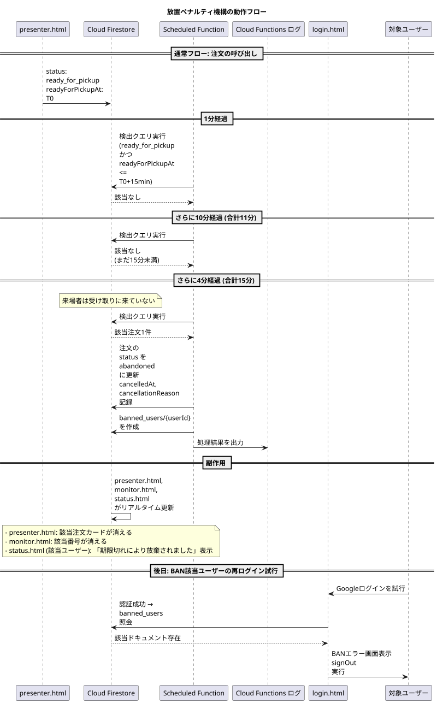

### 8.11 設計上の考慮点と既知の限界

#### 8.11.1 偽陽性のリスク

15分という閾値は、来場者が呼び出しに気付いてから提供口に到達するまでの時間を考慮して設定されている。しかし、以下のような状況では正当な来場者が誤って BAN される可能性がある。

**通信障害**  
来場者のスマートフォンが電波の弱い場所にあり、Push通知が遅延した場合。

**気付きの遅れ**  
来場者がスマートフォンを確認していない、または音声呼び出しを聞き逃した場合。

**移動の困難**  
混雑により提供口へ到達するのに時間がかかった場合。

これらは原理的に避けがたい偽陽性であり、本システムでは「15分は十分な余裕時間である」との判断のもとで運用する。万一誤った BAN が発生した場合、第8章9節の手動 BAN 解除手順により対応する。

#### 8.11.2 タイムスタンプの正確性

Scheduled Function は Cloud Functions の実行環境のシステム時刻を基準に判定を行う。一方、`readyForPickupAt` フィールドは Firestore の `serverTimestamp()` で記録される。両者はともに UTC で管理されるが、わずかな時刻ずれが生じる可能性がある。

実用上、このずれは数百ミリ秒以内に収まると想定され、15分という閾値に対しては無視できる範囲である。

#### 8.11.3 Scheduled Function の起動失敗

Cloud Scheduler および Cloud Functions の障害により、Scheduled Function が予定通り起動しない場合、ペナルティの検出が遅延する。

ただし、起動失敗の状態が続いても、復旧後には過去に該当する注文がすべて検出クエリでヒットする（`readyForPickupAt <= 15分前` の条件は時間が経過しても満たされ続けるため）。検出のタイミングは遅れるが、検出漏れは発生しない。

#### 8.11.4 BAN該当ユーザーの新規アカウント取得

第8章6節3項で述べた通り、BAN 該当ユーザーが新規 Google アカウントを取得して再度ログインすることは原理的に可能である。ドメイン制限と心理的コストにより実質的な抑止効果は期待できるが、完全な防御ではない。

この限界は受容するものとし、追加の対策（例: 端末識別子による BAN）は本システムでは実装しない。

### 8.12 まとめ

本章では、放置キャンセルに対する自動ペナルティ機構を記述した。1分ごとに起動する Scheduled Function が `ready_for_pickup` で15分以上経過した注文を検出し、`abandoned` ステータスへの遷移と `banned_users` コレクションへの登録を実行する。

au PAY API 連携を行わない設計上、自動決済確定は実装されない。`abandoned` 注文は決済が発生しないまま終了する。これは商品廃棄として店舗の負担となるが、規約同意と BAN による抑止効果により、発生頻度は実用上の許容範囲に収まると期待される。

Scheduled Function は開発・テスト期間中は無効化し、本番直前に有効化する運用方針を採用する。この有効化方法は実装段階で適宜判断する。

次章では、本章のペナルティ機構を含むシステム全体のセキュリティ設計と、原理的に防げない既知の構造的限界を扱う。

---
## 第9章 セキュリティ設計

### 9.1 本章の目的

本章は、本システムにおけるセキュリティ設計を統合的に記述する。これまでの章で個別に言及してきた認証、認可、データアクセス制御、不正リクエスト遮断などの仕組みを、ここで「多層防御（Defense in Depth、複数の独立した防御層を重ねる設計思想）」の観点から再構成する。

加えて、本章は本システムが原理的に防ぐことのできない構造的限界についても誠実に記述する。手動QRコード決済方式を採用するという運用上の制約から生じる脆弱性は、ソフトウェアの実装によって完全には解消できない。本書はこれらの限界を隠蔽せず、運用でどのようにカバーするかを明示する。

校長先生および学校管理職の読者に向けて、本章は「ここまでは守れる、ここからは運用でカバーする」という線を明確に引くことを目的とする。

### 9.2 多層防御の全体像

本システムのセキュリティは、外側から内側へ向かって以下の層で構成される。各層は独立して機能し、いずれかの層が破られても他の層が防御を継続する。

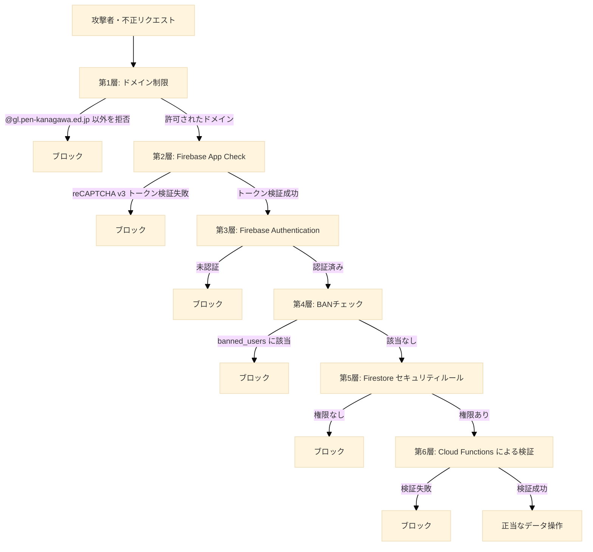

各層の詳細を以降の節で記述する。

### 9.3 第1層: ドメイン制限

#### 9.3.1 役割

モバイルオーダー機能（`mobile-order.html`）の利用を、神奈川県教育委員会から県立高校生・教員に配布されている `@gl.pen-kanagawa.ed.jp` ドメインのGoogleアカウント、および開発者特例として `ynrcs1000@gmail.com` を保有するユーザーに限定する。

#### 9.3.2 防御対象の脅威

本層が防ぐ脅威は以下である。

**海外からの不正注文**  
本システムは GitHub Pages 上で公開されており、URLを知っていれば世界中のどこからでもアクセス可能である。ドメイン制限がない場合、イギリス、ブラジル、その他任意の国から注文が作成され、来場者が実在しないにもかかわらず厨房スタッフが調理を開始してしまう事態が発生し得る。

**部外者によるいたずら注文**  
学校とは無関係の第三者が、悪意またはいたずら目的で大量の注文を作成し、業務妨害を行う事態を防ぐ。

#### 9.3.3 実装方式

`login.html` がGoogleログイン後、ユーザーのメールアドレスを検査する。`@gl.pen-kanagawa.ed.jp` で終わる、または `ynrcs1000@gmail.com` に完全一致するメールアドレスのみを許可する。これら以外のメールアドレスでログインしたユーザーには「利用対象外アカウント」画面を表示し、モバイルオーダーへの遷移を中断する。

詳細な実装は第3章に記述されている。

#### 9.3.4 限界と補完

ドメイン制限により海外からの不正注文は防げるが、`@gl.pen-kanagawa.ed.jp` を保有する正規ユーザー（在校生・教員）が悪意を持って注文を行う事態は防げない。この種の脅威は本層では防御対象外とし、第8章の放置ペナルティ機構および校内の生活指導によって対応する。

なお、SOK経由の注文と有人POSによる注文は、ドメイン制限の対象外である。SOKは現地に物理的に存在することが利用条件となるため、海外からのアクセスは原理的に不可能である。POSはスタッフが操作するため、来場者のドメインは無関係である。

### 9.4 第2層: Firebase App Check

#### 9.4.1 役割

正規のフロントエンド（`https://ynr-cs.github.io/nanryosai-2026/` 配下から配信されたページ）からのリクエストのみを Firebase バックエンドに通すゲートとして機能する。

#### 9.4.2 防御対象の脅威

本層が防ぐ脅威は以下である。

**自動化された大量リクエスト**  
攻撃者がスクリプトを用いて、Firebase の API エンドポイントに直接大量のリクエストを送信する事態。これは本システムの Cloud Functions 実行回数や Firestore 読み書き回数を不正に増大させ、課金額を膨張させる攻撃（請求書攻撃、Bill Shock Attack）の典型的な手段である。

**自作クライアントによる API 直接呼び出し**  
攻撃者が独自のクライアントプログラムを作成し、Firebase の API を呼び出して不正なデータを書き込もうとする事態。

#### 9.4.3 実装方式

App Check は reCAPTCHA v3 と連携する。フロントエンドが Firebase API を呼び出す前に、reCAPTCHA v3 からトークンを取得し、リクエスト時にそのトークンを添付する。Firebase バックエンドはトークンを検証し、不正なトークンを持つリクエストを拒否する。

reCAPTCHA v3 は、ブラウザのフィンガープリント、操作パターン、IPアドレスなど多数のシグナルからリクエストの正当性をスコアリングする。スクリプトによる自動化や、ブラウザ以外のクライアントからのリクエストは低スコアと判定され、トークン発行が拒否される。

#### 9.4.4 ウォームアップ戦略

App Check トークンの取得は、Firebase 初期化時に非同期で先行実行される。ユーザーがログインボタンを押下した瞬間にトークン取得を開始すると、トークン取得とログインポップアップ表示が競合し、ブラウザのポップアップブロッカーがログインポップアップを誤って遮断する可能性がある。

事前にトークンを取得しておくことで、ユーザー操作のタイミングではトークン取得済みの状態となり、ポップアップブロックを回避する。

### 9.5 第3層: Firebase Authentication

#### 9.5.1 役割

リクエストを発行したユーザーが、システムに登録された正当なユーザーであることを保証する。

#### 9.5.2 防御対象の脅威

本層が防ぐ脅威は以下である。

**未認証ユーザーによるデータアクセス**  
ログインしていないユーザーが、注文情報や個人情報を含むデータにアクセスする事態。

**他人へのなりすまし**  
あるユーザーが他のユーザーになりすまして注文を行う、またはステータスを参照する事態。

#### 9.5.3 実装方式

Firebase Authentication が、Googleアカウントによるログインまたは匿名認証によりユーザーIDを発行する。発行されたユーザーIDは、以降のすべての Firestore リクエストおよび Cloud Functions 呼び出しに自動的に添付される。

第3章で述べた通り、本システムでは `signInWithPopup` のみを採用する Popup-only 戦略を採る。`signInWithRedirect` は GitHub Pages のサードパーティ Cookie 制限により動作しないためである。

匿名認証で発行されたユーザーIDは、後から `linkWithCredential` を用いて Google アカウントに紐付けることが可能である。SOK経由で注文した来場者がアカウントの永続化を希望する場合、`account.html` 経由でこの昇格を実行できる。

### 9.6 第4層: BANチェック

#### 9.6.1 役割

放置ペナルティの対象となったユーザーが、再ログインによりシステムを再利用することを防ぐ。

#### 9.6.2 防御対象の脅威

**ペナルティを受けたユーザーの再アクセス**  
第8章で述べた放置ペナルティ機構により `banned_users` コレクションに登録されたユーザーが、ログアウトと再ログインを繰り返してペナルティを回避する事態。

#### 9.6.3 実装方式

`login.html` および `portal.html` の認証フローにおいて、Firebase Authentication によるログイン成功直後に、Firestore の `banned_users` コレクションに当該ユーザーIDが存在するかを照会する。存在する場合は、ログイン処理を中断し、エラーメッセージを表示してすべての操作を拒否する。

照会処理の詳細は第8章に記述されている。

#### 9.6.4 限界

ユーザーが新たに別のGoogleアカウントを取得して再登録すれば、BANを回避できる。`@gl.pen-kanagawa.ed.jp` ドメインのアカウントは生徒一人につき一つが配布されているため、生徒であれば容易に追加アカウントを取得することはできない。ただし、複数のメールアドレスを保有する教員、または開発者特例アカウントの保有者がBAN対象となった場合、本層のみではペナルティを完全に強制できない。これは本システムの制約として受容する。

### 9.7 第5層: Firestore セキュリティルール

#### 9.7.1 役割

Firestore データベースに対する読み取り・書き込み権限を、リクエストを発行したユーザーごとに制御する。Firebase Authentication が「誰であるか」を保証するのに対し、Firestore セキュリティルールは「何ができるか」を規定する。

#### 9.7.2 設計方針

本システムのセキュリティルールは、以下の方針に基づいて設計される。

**最小権限の原則**  
各ユーザーには、業務上必要最小限の権限のみを付与する。来場者は自身の注文情報のみを参照でき、他人の注文情報には一切アクセスできない。

**書き込みは Cloud Functions 経由を強制**  
注文の作成および更新は、原則としてフロントエンドからの直接書き込みを禁止し、Cloud Functions を経由させる。これにより、サーバー側で受付番号の発番、在庫チェック、金額計算などの検証を確実に実行できる。

**機密データへのアクセス完全禁止**  
店舗パスワード等の機密情報を格納する `store_secrets` コレクションは、クライアントからのアクセスを完全に禁止する。Cloud Functions のみがアクセス権を持つ。

#### 9.7.3 主要なルール

以下に、主要なコレクションに対するルールの代表例を示す。実装上は同等の意味を持つ表現で記述される。

```javascript
rules_version = '2';
service cloud.firestore {
  match /databases/{database}/documents {

    // 注文コレクション
    match /orders/{orderId} {
      // 読み取り: 認証済みかつ自身の注文のみ
      allow read: if request.auth != null
                  && request.auth.uid == resource.data.userId;
      
      // 作成: クライアントからの直接作成は禁止
      // (Cloud Functions が Admin SDK で作成するため、ルールを通らない)
      allow create: if false;
      
      // 更新: 提供口・厨房スタッフ（後述のスタッフ判定）のみ
      allow update: if isStaff(request.auth.uid);
      
      // 削除: 完全禁止（キャンセルは status 更新で表現）
      allow delete: if false;
    }

    // 商品マスタ
    match /items/{itemId} {
      // 読み取り: 全ユーザー許可（メニュー閲覧のため）
      allow read: if true;
      // 書き込み: 店舗管理者のみ（portal.html 経由）
      allow write: if isStoreManager(request.auth.uid, resource.data.storeId);
    }

    // 店舗マスタ
    match /stores/{storeId} {
      allow read: if true;
      allow write: if isStoreManager(request.auth.uid, storeId);
    }

    // ユーザープロファイル
    match /users/{userId} {
      allow read, write: if request.auth != null
                         && request.auth.uid == userId;
      
      // カートサブコレクション
      match /cart/{itemId} {
        allow read, write: if request.auth != null
                           && request.auth.uid == userId;
      }
    }

    // BANリスト
    match /banned_users/{userId} {
      // 読み取り: 自身のBAN状態のみ確認可能
      allow read: if request.auth != null
                  && request.auth.uid == userId;
      // 書き込み: 完全禁止（Cloud Functions のみ）
      allow write: if false;
    }

    // 機密情報
    match /store_secrets/{document=**} {
      // クライアントからのアクセスを完全禁止
      allow read, write: if false;
    }

    // 受付番号カウンタ
    match /counters/{counterId} {
      // 読み取り: スタッフのみ
      allow read: if isStaff(request.auth.uid);
      // 書き込み: 完全禁止（Cloud Functions のトランザクション内のみ）
      allow write: if false;
    }
  }
}
```

このルールにより、たとえ攻撃者が App Check を突破して直接 Firestore に書き込みを試みたとしても、適切な権限を持たないリクエストはすべて拒否される。

#### 9.7.4 注文ドキュメントのアクセス制御の意味

注文ドキュメントの読み取り権限を「自身の `userId` と一致するもの」に限定するルールには、以下の意味がある。

**SOK経由の匿名注文の保護**  
SOK で生成されたQRコードを最初に読み取ったユーザーには匿名認証によりUIDが発行され、注文ドキュメントの `userId` フィールドにそのUIDが記録される。以降、その注文の閲覧は当該UIDのユーザーに限定される。第三者がQRコードのURLを知り得たとしても、`status.html` でデータを取得しようとすればルールにより拒否される。

**他人の注文番号を盗み見る攻撃への防御**  
攻撃者が他人の注文の受付番号や金額を知ることはできない。この情報を得るには物理的に画面を覗き込むか、提供口での呼び出しを聞くしかなく、システム経由での情報漏洩は遮断される。

### 9.8 第6層: Cloud Functions による検証

#### 9.8.1 役割

注文の作成という最も重要なトランザクションを、サーバーサイドで完全に制御する。クライアント側のロジックには一切信頼を置かない。

#### 9.8.2 防御対象の脅威

**金額の不正操作**  
クライアント側で「合計金額1000円」と表示されている注文を、リクエスト時に「合計金額0円」に書き換えて送信する事態。

**存在しない商品の注文**  
クライアント側のJavaScriptを改変し、`items` コレクションに存在しない商品IDで注文を作成しようとする事態。

**販売停止中商品の注文**  
`isAvailable: false` となっている商品を、クライアント側のUI制御を回避して注文しようとする事態。

**受付番号の重複**  
複数のユーザーが同時に注文を確定した際、同じ受付番号が二つの注文に発行される事態。

#### 9.8.3 実装方式

`createOnlineOrder`、`createOrderFromSok`、`createPosOrder` の各 Cloud Function は、以下の検証をすべて実行する。

**商品の実在性検証**  
リクエストに含まれる各商品IDについて、`items` コレクションに該当ドキュメントが存在することを確認する。

**販売状態の検証**  
各商品の `isAvailable` フィールドが `true` であることを確認する。`false` の商品が含まれる場合、注文作成を拒否する。

**金額の再計算**  
クライアントから送信された合計金額を信頼せず、サーバー側で `items` コレクションの最新価格を参照して合計金額を再計算する。再計算結果を `totalPrice` フィールドに記録する。

**受付番号のアトミック発番**  
Firestore のトランザクション機能を用いて、`counters` コレクションのカウンタを排他的にインクリメントし、重複しない受付番号を発行する。詳細は第4章に記述されている。

**規約同意の確認**  
モバイルオーダーおよびSOK経由の注文では、`termsAgreedAt` フィールドの存在を確認する。同意なしに注文を作成しようとするリクエストは拒否する。

これらすべての検証に成功した場合のみ、注文ドキュメントが `orders` コレクションに作成される。

### 9.9 個人情報の取扱

#### 9.9.1 取得する情報

本システムが取得する個人情報は以下に限定される。

- Googleアカウントのメールアドレス（ドメイン判定および利用者の識別に使用）
- Googleアカウントの表示名（注文画面でのユーザー表示に使用、任意）
- Googleアカウントのプロフィール画像URL（注文画面でのユーザー表示に使用、任意）
- Firebase Authentication が発行する内部ユーザーID（システム内部の識別子）
- 注文内容（商品、数量、合計金額、注文日時）
- Push通知用のFCMトークン（端末識別子、通知許可をしたユーザーのみ）

#### 9.9.2 取得しない情報

以下の情報は取得しない。

- 氏名（Googleアカウントの表示名以外の本名）
- 住所
- 電話番号
- 学校内の所属（学年、クラス、部活動等）
- 決済情報（クレジットカード番号、au PAY 残高情報等）
- 生体情報

#### 9.9.3 データの保管期間

本システムが保持するデータは、文化祭終了後の集計作業完了をもって削除される。具体的には以下の方針とする。

- 注文データ（`orders` コレクション）: 文化祭終了後3ヶ月以内に集計を完了し、その後削除する
- ユーザープロファイル（`users` コレクション）: 同上
- BANリスト（`banned_users` コレクション）: 同上
- 商品マスタおよび店舗マスタ: アーカイブとして保持する場合がある

データ削除のタイミングおよび方法については、文化祭終了後に実行委員会と協議の上で確定する。※本項目の具体的な削除日程は本書執筆時点で未確定である。

#### 9.9.4 データの開示

本システムが取得した個人情報は、以下の場合を除き第三者に開示しない。

- 当該ユーザー本人が `account.html` から自身のデータを参照する場合
- 法令に基づく開示要請があった場合
- 学校管理職または実行委員会が、ペナルティ対応または苦情対応のために必要と判断した場合

### 9.10 通信の暗号化

本システムが扱うすべての通信は、HTTPSにより暗号化される。

**フロントエンドの配信**  
GitHub Pages はすべてのサイトで HTTPS を強制する。HTTPでアクセスした場合は自動的にHTTPSへリダイレクトされる。

**Firebase APIへの通信**  
Firebase SDK は内部的にHTTPSのみを使用する。HTTPでのAPI呼び出しは行われない。

**Cloud Storageへのアクセス**  
商品画像の取得もHTTPS経由で行われる。

**外部サービスとの通信**  
Cloud Functions から Google スプレッドシートへの書き込みは、Google 内部のセキュアな通信経路を経由する。

### 9.11 構造的限界と運用カバー

本節は、本システムが**原理的に防ぐことのできない**脆弱性について誠実に記述する。これらは個別の実装ミスではなく、本システムが採用する運用方式（手動QRコード決済、手動の番号照合）から不可避的に生じる限界である。

これらの限界は本システム固有の問題ではなく、紙伝票による従来の運用にも存在していた問題である。本システムの導入により新たに発生する脆弱性ではないが、本書の読者が誤解しないよう、ここで明示する。

#### 9.11.1 番号横取り

**脅威の内容**  
他人の呼び出し番号を聞き、または `monitor.html` の表示を覗き見て、自分の番号として提供口で受け取りを主張する攻撃。

**システム側で防げない理由**  
提供口スタッフは、提示された受付番号と注文内容を `presenter.html` で確認するが、提示者が当該番号の正当な注文者であるかを判定する手段を持たない。本人確認書類の提示を求める運用は、文化祭の規模と来場者の利便性を考慮すると現実的でない。

**運用によるカバー**  
モバイルオーダーおよびSOK経由の注文では、来場者は提供口で `status.html` のスマートフォン画面を提示する。`status.html` は Firestore セキュリティルールにより、当該注文の `userId` と一致するユーザーにのみ表示される。提供口スタッフは、紙の番号ではなくスマートフォン画面の番号を確認することを原則とする。これにより、画面そのものが本人確認の代替となる。

POS経由の注文は紙の番号札のみが本人確認手段となる。POSは高齢者や複雑な注文に限定された経路であり、来場者数も限定的であるため、本リスクは限定的に受容する。

**過去の運用との比較**  
紙伝票による従来の運用でも、紙を拾った第三者が商品を受け取る可能性は存在していた。本システムは少なくともモバイルオーダーおよびSOK経路においては、画面表示と Firestore セキュリティルールの組み合わせにより、過去より強固な本人確認を実現している。

#### 9.11.2 金額改ざん

**脅威の内容**  
au PAY 手動QRコード決済では、来場者が支払い金額を自身のスマートフォンに手入力する。攻撃者が「合計500円の注文」に対して「100円」と入力して決済を完了させ、決済完了画面をスタッフに提示する事態。

**システム側で防げない理由**  
au PAY のAPIと連携していないため、本システムは支払い金額を制御する手段を持たない。決済完了画面の検証はスタッフの目視のみに依存する。

**運用によるカバー**  
提供口スタッフは、来場者の決済完了画面に表示された金額と、`presenter.html` に表示された注文の合計金額を目視で照合する。金額が一致しない場合は、商品の引き渡しを拒否し、再決済を求める。

トレーニングマニュアルにおいて、提供口スタッフの最重要確認事項として「金額の照合」を位置づける。

**根本的な制約**  
本脆弱性は、現金禁止運用かつ手動QRコード決済を採用するすべての文化祭・イベントに共通する構造的問題である。本システム固有の問題ではない。本システムの導入により新たに発生する脆弱性ではない点を強調する。

au PAY のAPI連携を導入すれば本脆弱性は解消されるが、本システムでは第11章に述べる理由により、API連携を採用しない。

#### 9.11.3 開発者ツールによる画面表示の改ざん

**脅威の内容**  
ブラウザの開発者ツール（F12キー等で開く開発支援機能）を用いて、画面に表示される受付番号や注文内容のDOM（Document Object Model、画面の構造を表すデータ）を書き換え、虚偽の画面をスタッフに提示する事態。

**システム側で防げない理由**  
画面の表示はクライアントサイドで描画されるため、ユーザーの端末上で任意に書き換えることが可能である。これはWeb技術の根本的な性質であり、回避不能である。

**運用によるカバーと残存リスクの限定**  
DOM改ざんによってクライアント画面は偽装できるが、Firestore データベース上の真のデータは改ざんできない。提供口スタッフは `presenter.html` で注文情報を確認するが、`presenter.html` のデータは Firestore から直接取得されるため、来場者側のDOM改ざんの影響を受けない。

したがって、来場者がDOM改ざんで虚偽の画面を提示しても、提供口スタッフは Firestore 上の真の注文情報と照合するため、誤った商品が引き渡される可能性は限定的である。

ただし、来場者が「金額」のDOMを改ざんして「自分の注文金額は安い」と主張する事態は防げない。これは前節の「金額改ざん」と同様、目視照合で対処する。

#### 9.11.4 Firestore コスト攻撃

**脅威の内容**  
正規のフロントエンドを多数のタブで同時に開き、リアルタイム購読を意図的に大量発生させ、Firestore の読み取り回数を不正に膨張させて課金額を増大させる事態。

**運用によるカバー**  
本システムは Firebase の無料枠の範囲で運用することを前提に設計されている。読み取り回数の上限を超えた場合、Firebase Console から日次の使用量制限を設定することで、課金が一定額を超える前にサービスを停止できる。

文化祭当日に本攻撃を検知した場合、開発メンバーまたは実行委員会が Firebase Console から該当する Firestore のアクセスを一時的に制限する運用とする。

#### 9.11.5 限界の総括

本システムの構造的限界は、以下の3点に集約される。

1. **手動QR決済方式**による金額不正の可能性
2. **紙の番号札**を使用するPOS経路における本人確認の弱さ
3. **クライアントサイド描画**による画面表示の改ざん可能性

これらはいずれも、文化祭の規模、コスト制約、来場者の利便性を考慮した設計上のトレードオフの結果として残存する。本システムは、これらの限界を運用とスタッフトレーニングによってカバーする方針を採用する。

### 9.12 セキュリティ脅威モデル一覧

本章で扱った脅威と対策を以下の表にまとめる。

| 脅威 | 主たる対策層 | 対策内容 | 残存リスク |
|---|---|---|---|
| 海外からの不正注文 | 第1層: ドメイン制限 | `@gl.pen-kanagawa.ed.jp` 限定 | 正規ドメイン保有者の悪意ある注文 |
| 自動化された大量リクエスト | 第2層: App Check | reCAPTCHA v3 によるトークン検証 | reCAPTCHA を突破する高度なボット |
| 自作クライアントによるAPI直接呼び出し | 第2層: App Check | 同上 | 同上 |
| 未認証ユーザーによるアクセス | 第3層: Authentication | Googleログインまたは匿名認証 | なし |
| なりすまし | 第3層: Authentication | Googleの認証基盤に依存 | Googleアカウントの侵害 |
| ペナルティ受領者の再アクセス | 第4層: BANチェック | `banned_users` 照会 | 別アカウントによる回避 |
| 他人の注文情報の閲覧 | 第5層: Firestore Rules | `userId` 一致チェック | 物理的な画面覗き見 |
| 機密情報への不正アクセス | 第5層: Firestore Rules | `store_secrets` 完全禁止 | なし |
| 金額の不正書換（API送信時） | 第6層: Cloud Functions | サーバー側で再計算 | なし |
| 受付番号の重複 | 第6層: Cloud Functions | アトミックトランザクション | なし |
| 番号横取り | 運用カバー | スマホ画面提示・スタッフ目視 | POS経路では限定的に残存 |
| 金額改ざん（決済画面） | 運用カバー | スタッフ目視照合 | 構造的に完全防御不能 |
| DOM改ざんによる虚偽画面提示 | 運用カバー | サーバー側データとの照合 | 構造的に完全防御不能 |
| Firestoreコスト攻撃 | 運用カバー | 使用量制限・監視 | 攻撃検知の遅延 |

### 9.13 まとめ

本章では、本システムが採用する6層の多層防御を体系的に記述した。ドメイン制限、App Check、Firebase Authentication、BANチェック、Firestoreセキュリティルール、Cloud Functions による検証の各層は、それぞれ独立して機能し、いずれかの層が破られても他の層が防御を継続する設計となっている。

同時に、手動QRコード決済方式に起因する構造的限界についても誠実に記述した。これらは個別の実装ミスではなく、本システムの運用方式から不可避的に生じる限界であり、運用とスタッフトレーニングによってカバーされる。

本システムは、無料の技術スタックと最小限の運用負荷の中で、文化祭という限定された期間・規模の運用に耐えうる現実的なセキュリティ水準を実現することを目標として設計されている。

次章では、これらのセキュリティ機構が実際の運用にどのように接続されるか、当日のスタッフ役割分担と障害対応を含めた運用設計を記述する。

---
## 第10章 運用・障害対応

### 10.1 本章の目的

本章は、本システムを文化祭当日に運用するための体制と、障害発生時の対応手順を記述する。第9章までに記述した技術仕様が、現実の運用にどのように接続されるかを明らかにし、当日の混乱を最小化することを目的とする。

本章の対象読者は主に以下である。

- **出店団体スタッフ**: 当日の役割と操作手順の確認のため
- **南陵祭実行委員会**: 全体運用と障害発生時の判断のため
- **コンピュータ科学部の開発メンバー**: 当日のサポート体制と障害対応の指針のため

### 10.2 当日のスタッフ役割分担

各出店団体において、以下の役割を持つスタッフが配置される。一人が複数の役割を兼務する場合もあるが、責務の分離を明確にすることで、当日のオペレーションが円滑に進むことを目指す。

#### 10.2.1 店舗責任者

**主たる責務**  
店舗全体のオペレーション統括と、システム上の店舗管理を担う。

**操作する画面**  
`portal.html` を主に使用する。

**当日の主な作業**  
- 開店時のメニュー有効化（`isAvailable` の切り替え）
- 商品の販売停止判断（材料切れ等）
- スプレッドシートによる売上状況の監視
- スタッフ間のシフト調整
- 来場者からの苦情・トラブル対応の一次受け
- 障害発生時の実行委員会への連絡

**必要な認証**  
店舗責任者は、Google アカウントでのログインに加え、`portal.html` における店舗パスワードによる二段階の認証を経て店舗管理機能にアクセスする。店舗パスワードは `store_secrets` コレクションに格納されており、第9章で述べた通りクライアントから直接アクセスできない。

#### 10.2.2 レジ担当スタッフ

**主たる責務**  
有人POSレジでの注文受付を担う。来場者から口頭で受けた注文を `pos.html` に入力する。

**操作する画面**  
`pos.html` を主に使用する。

**当日の主な作業**  
- POS端末の起動と認証
- 来場者からの注文受付と入力
- 受付番号の紙への記入と来場者への手渡し
- 「もうすぐ売り切れます」等の口頭案内

**対象とする来場者**  
高齢者、複雑なカスタマイズを希望する来場者、スマートフォンを所持していない来場者などを主たる対象とする。一般的な来場者には、店頭に設置された SOK の利用を案内する。

#### 10.2.3 厨房スタッフ

**主たる責務**  
注文された商品の調理と、調理ステータスの更新を担う。

**操作する画面**  
`kitchen.html` を主に使用する。

**当日の主な作業**  
- `kitchen.html` の注文一覧の常時監視
- 注文に対する「調理開始」ボタン押下（`cooking` への遷移）
- 調理完了時の「調理完了」ボタン押下（`ready_to_serve` への遷移）
- 通知音による新規注文の認識
- 材料切れ・調理機材トラブル等の店舗責任者への報告

**端末配置**  
厨房は調理作業のため濡れる・汚れる可能性が高い場所である。`kitchen.html` を表示する端末は、防水ケース等の保護策を講じた上で、調理担当者の視界に常に入る位置に固定する。

#### 10.2.4 提供口スタッフ

**主たる責務**  
完成した商品の最終準備、来場者への呼び出し、決済確認、商品の引き渡しを担う。本システムにおいて最も多くの判断を行う役割である。

**操作する画面**  
`presenter.html` を主に使用する。

**当日の主な作業**  
- 厨房から完成商品を受け取る
- スプーン、ナプキン等の最終準備
- 「提供準備完了」ボタン押下（`ready_for_pickup` への遷移、自動呼び出し開始）
- 来場者からの番号提示の受付
- au PAY 決済画面の金額確認
- 商品の引き渡し
- 「QR決済 完了」ボタン押下（`completed` への遷移）
- 提供不可・キャンセル時の「提供不可・キャンセル」ボタン押下（`cancelled` への遷移）

**最重要確認事項**  
第9章9.11.2節で述べた通り、提供口スタッフは au PAY 決済完了画面の金額と、`presenter.html` に表示された注文の合計金額を**必ず目視で照合する**。これは本システムにおける唯一の金額不正対策であり、提供口スタッフの責務として最重要事項に位置づけられる。

#### 10.2.5 SOK案内スタッフ

**主たる責務**  
店頭に設置された SOK iPad の操作補助と、来場者の動線整理を担う。

**操作する画面**  
直接的な画面操作は行わないが、SOK の状況を目視で確認する。

**当日の主な作業**  
- SOK iPad の前で迷っている来場者への声かけ
- QRコード読み取り操作の補助
- 紙運用への切り替え時の来場者誘導
- iPad のバッテリー残量・通信状態の監視

#### 10.2.6 コンピュータ科学部 サポート担当

**主たる責務**  
当日のシステム障害対応、出店団体からの技術的問い合わせへの対応を担う。

**操作する画面**  
全画面を必要に応じて使用する。Firebase Console、GitHub Pages の管理画面にもアクセス可能とする。

**当日の主な作業**  
- 各出店団体の巡回によるシステム稼働状況の確認
- 障害発生時の原因切り分け
- 必要に応じた紙運用への切り替え判断
- Firebase Console での使用量監視
- 終了時のデータバックアップ

**配置**  
※当日の具体的なサポート担当者の配置と人数は本書執筆時点で未確定である。コンピュータ科学部の部員のうち、本プロジェクトに深く関与した者を中心に配置する方針とする。

#### 10.2.7 役割分担一覧表

| 役割 | 主操作画面 | 必要人数（目安） | 主たる責務 |
|---|---|---|---|
| 店舗責任者 | `portal.html` | 各店舗1名 | 全体統括 |
| レジ担当スタッフ | `pos.html` | 各店舗1〜2名 | 対面注文受付 |
| 厨房スタッフ | `kitchen.html` | 各店舗2〜4名 | 調理 |
| 提供口スタッフ | `presenter.html` | 各店舗1〜2名 | 提供・決済確認 |
| SOK案内スタッフ | （目視のみ） | 各店舗1名 | SOK案内 |
| コンピュータ科学部サポート | 全画面 | 全体で2〜4名 | 技術サポート |

※必要人数は目安であり、各出店団体の規模と運営方針により増減する。

### 10.3 トレーニング体制

#### 10.3.1 トレーニング教材

本システムの運用に先立ち、以下のトレーニング教材を整備する。教材は `pos/training` ディレクトリに配置される。

**POSトレーニング教材**  
レジ担当スタッフを対象とする。`pos.html` の操作手順、注文入力の流れ、トッピングの選択方法、受付番号の伝達方法を扱う。

**プレゼンタートレーニング教材**  
提供口スタッフを対象とする。`presenter.html` の操作手順、`ready_to_serve` から `completed` までのステータス遷移、au PAY 決済画面の金額照合手順、提供不可・キャンセル時の対応を扱う。最重要トピックとして金額照合の重要性を強調する。

**管理者トレーニング教材**  
店舗責任者を対象とする。`portal.html` の全機能、メニュー登録・編集、商品画像のアップロード、`isAvailable` の切り替え、売上監視を扱う。

**厨房トレーニング教材**  
厨房スタッフを対象とする。`kitchen.html` の操作、調理開始・調理完了のタイミング、通知音への対応を扱う。

#### 10.3.2 トレーニングの実施時期

文化祭開催の2週間前までに、各出店団体のスタッフ全員が該当する役割のトレーニング教材を一通り視聴・閲覧することを必須とする。各出店団体は、トレーニング完了報告を実行委員会に提出する。

文化祭開催の3日前から前日にかけて、コンピュータ科学部主催の対面リハーサルを実施する。各出店団体から少なくとも1名が参加し、実機を用いたシミュレーションを行う。

※具体的なトレーニング実施日程は本書執筆時点で未確定である。実行委員会の調整により決定する。

#### 10.3.3 当日の朝礼

文化祭開催当日の開店前に、各出店団体内で15分程度の朝礼を実施する。朝礼では以下を確認する。

- 当日のメニューと販売停止商品
- 各スタッフの役割と配置
- 障害発生時の連絡先（コンピュータ科学部サポート担当の連絡方法）
- 本日の特記事項（雨天時の対応、悪天候による中止判断基準等）

### 10.4 売上集計と当日の監視

#### 10.4.1 リアルタイム売上監視

各出店団体には、専用の Google スプレッドシートが割り当てられる。注文の作成および更新が発生するたびに、Cloud Functions の `onOrderCreatedSpreadsheet` および `onOrderUpdatedSpreadsheet` がトリガーされ、スプレッドシートに自動で行が追加・更新される。

店舗責任者は、自店舗のスプレッドシートをタブレットまたはスマートフォンで開きっぱなしにしておくことで、当日の売上状況をリアルタイムで把握できる。スプレッドシートには以下の情報が含まれる。

- 注文ID
- 受付番号
- 注文経路（モバイル / SOK / POS）
- 商品内訳と数量
- 合計金額
- 注文ステータス
- 各種タイムスタンプ（注文作成、調理開始、調理完了、提供完了等）

#### 10.4.2 ダッシュボード機能

`portal.html` には、店舗責任者向けの売上サマリー機能が実装されている。スプレッドシートを開かずとも、画面上で以下の情報を確認できる。

- 本日の総注文数
- 本日の総売上金額
- ステータス別の注文件数（調理中、呼出中、完了、キャンセル等）
- 経路別の注文件数

#### 10.4.3 文化祭終了後の集計

文化祭終了後の集計作業は、以下の流れで行う。

1. 文化祭最終日の閉店時刻に、各店舗責任者が `portal.html` から「営業終了」操作を実行する（※具体的な操作仕様は本書執筆時点で未確定である）
2. 各出店団体は、自店舗のスプレッドシートを基に売上集計を行う
3. 必要に応じて Google Apps Script による集計マクロを実行する
4. 集計結果を実行委員会に提出する
5. 実行委員会は全店舗の集計を統合し、文化祭全体の収支報告を作成する

### 10.5 障害発生時の対応原則

本システムは、文化祭という時間制約の厳しい運用環境で動作する。障害発生時には、システムの復旧を試みるよりも、紙運用への切り替えを優先する原則を採用する。

#### 10.5.1 紙運用優先の原則

以下の原則に従う。

**復旧時間に賭けない**  
障害発生時、システムの復旧を試みる時間と、紙運用への切り替えを完了する時間を比較し、迷った場合は紙運用に切り替える。文化祭の限られた営業時間において、復旧待ちで販売機会を失うことは避ける。

**判断は実行委員会またはコンピュータ科学部サポート担当**  
紙運用への切り替え判断は、各店舗責任者の独断ではなく、実行委員会またはコンピュータ科学部サポート担当が一元的に行う。これにより、出店団体間で対応が分散する事態を防ぐ。

**部分的な切り替えも許容**  
全店舗一斉の切り替えだけでなく、特定の店舗のみ、あるいは特定の経路（例: モバイルオーダーのみ）の切り替えも許容する。

#### 10.5.2 障害の種別と対応

想定される障害と、それぞれの対応方針を以下に示す。

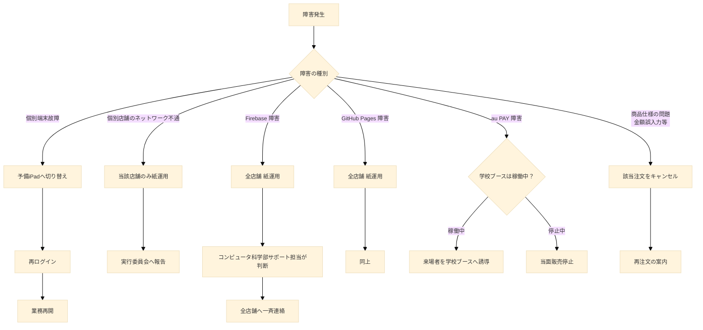

#### 10.5.3 個別端末の故障

iPad の故障、ノートPCのバッテリー切れ、防水ケースへの水侵入等が想定される。

**対応手順**

1. 各店舗は予備の iPad を最低1台確保しておく
2. 故障発生時、予備機にログインして業務を継続する
3. 故障した端末は速やかに退避させる
4. 業務に支障が出る場合、コンピュータ科学部サポート担当に連絡する

#### 10.5.4 個別店舗のネットワーク不通

特定の店舗のみ Wi-Fi が不安定になる、モバイル回線が混雑するなど、当該店舗のみインターネット接続が不安定になる状況が想定される。

**対応手順**

1. 店舗責任者は、ネットワーク復旧を5分間試みる
2. 5分以内に復旧しない場合、当該店舗のみ紙運用に切り替える
3. 実行委員会に状況を報告する
4. 復旧後、紙の注文をシステムに事後入力するかは状況に応じて判断する（基本的には事後入力は行わず、紙の集計を別途行う）

#### 10.5.5 Firebase 障害

Firebase の各サービス（Firestore、Cloud Functions、Authentication 等）が広域で利用不能となる状況が想定される。これは Google 側の障害であり、本システム側で対応する手段は存在しない。

**対応手順**

1. コンピュータ科学部サポート担当が Firebase の[ステータスページ](https://status.firebase.google.com/) を確認する
2. Firebase 全体の障害が確認された場合、全店舗紙運用への切り替えを決定する
3. 実行委員会経由で、全出店団体に一斉連絡する（無線、メッセンジャーアプリ等）
4. 紙運用が開始されたことを来場者向けにも掲示する
5. Firebase 復旧後、紙運用を継続するかシステム運用に戻すかをコンピュータ科学部サポート担当が判断する

#### 10.5.6 GitHub Pages 障害

GitHub Pages が利用不能となり、フロントエンドにアクセスできない状況が想定される。

**対応手順**

Firebase 障害時と同様の手順を取る。

#### 10.5.7 au PAY 障害

au PAY のサービス自体が障害となり、決済が実行できない状況が想定される。

**対応手順**

1. 提供口スタッフは、来場者の決済が失敗していることを確認する
2. 店舗責任者は、校内設置の au PAY 公式ブースに状況を確認する
3. 学校ブースが稼働中である場合、来場者を学校ブースへ誘導し、現金から au PAY 残高への変換を行ってもらう
4. 学校ブース自体も停止している場合、当面の販売を停止する判断を行う
5. 既に調理が完了している商品については、提供口スタッフが個別に対応する（無償提供、後日決済の連絡先取得等の判断は店舗責任者が行う）

### 10.6 紙運用への切り替え手順

紙運用への切り替えが決定された場合、各店舗は以下の手順で運用を移行する。

#### 10.6.1 切り替えの号令

実行委員会またはコンピュータ科学部サポート担当が、各店舗責任者に対し以下の情報を含む連絡を行う。

- 紙運用への切り替え対象（全経路 / 特定経路のみ）
- 切り替え開始時刻
- 紙運用継続の見込み時間（不明な場合は「未定」と伝える）
- 既存のシステム上の注文の取り扱い方針

#### 10.6.2 紙番号札の準備

各店舗は、事前に以下を準備しておく。

- 100番から始まる連番が印刷された紙番号札（最低200枚）
- 油性マジック（受付番号や金額の記入用）
- 注文内容を記録する紙伝票（最低100枚）
- バインダーまたはクリップボード

紙番号札の番号レンジは、システム上の POS 受付番号と重複する可能性があるが、紙運用中はシステムへの入力を行わないため、重複は問題とならない。紙運用終了後にシステム運用に戻す場合は、システム上のカウンタ状態を確認した上で、新規番号からの発番を再開する。

#### 10.6.3 既存のシステム上の注文の処理

システム障害発生時点で、既に注文済みかつ未提供の注文が `orders` コレクションに残っている可能性がある。これらの注文の取り扱いは以下の通りとする。

**Firebase が利用可能な場合（個別店舗のネットワーク不通等）**  
既存注文は `kitchen.html` で確認可能であるため、復旧後にステータスを進める。紙運用と並行して、既存注文の調理・提供を継続する。

**Firebase 全体が利用不能な場合**  
既存注文の状態を画面で確認できない。各店舗は手元のメモ・記憶を頼りに、可能な範囲で既存注文の対応を行う。完全な対応は期待できないため、来場者からの問い合わせがあった場合は丁寧に状況を説明し、必要に応じて返金対応を行う。

#### 10.6.4 紙運用中の注文受付フロー

紙運用中の注文受付は以下の流れとする。

1. 来場者が口頭で注文する
2. レジ担当スタッフが紙伝票に注文内容と金額を記入する
3. レジ担当スタッフが紙番号札に番号を記入し、来場者に手渡す
4. レジ担当スタッフは紙伝票を厨房に渡す
5. 厨房スタッフは紙伝票を見て調理する
6. 調理完了後、紙伝票を提供口に渡す
7. 提供口スタッフは番号を呼び出す（音声、ホワイトボード等）
8. 来場者が番号札を提示する
9. 提供口スタッフは au PAY 決済画面を確認し、金額照合の上で商品を引き渡す

紙運用中も、au PAY 手動QRコード決済は継続する。第9章9.11.2節で述べた金額照合の重要性は紙運用中も同様である。

#### 10.6.5 紙運用からシステム運用への復帰

障害が解消された場合、システム運用への復帰判断はコンピュータ科学部サポート担当が行う。判断基準は以下である。

- 復旧から30分以上経過し、システムの安定動作が確認されている
- 残り営業時間が30分以上ある
- 復帰によるオペレーション混乱のリスクが、システム運用継続のメリットを上回らない

これらを満たす場合、システム運用への復帰を実行委員会経由で各店舗に通知する。残り営業時間が短い場合や、復帰によるリスクが高い場合は、当日は紙運用を継続し、翌日以降にシステム運用を再開する。

### 10.7 当日の通信環境

#### 10.7.1 想定される通信手段

本システムは Firebase との通信を必須とするため、各端末は何らかの形でインターネット接続を確保する必要がある。想定される通信手段は以下である。

**学校 Wi-Fi**  
校内に整備された Wi-Fi ネットワークを第一の通信手段とする。各端末は学校 Wi-Fi に接続して動作することを基本とする。

**モバイル回線（スタッフ端末のテザリング）**  
学校 Wi-Fi が利用不能となった場合、スタッフのスマートフォンによるテザリングを補助手段とする。ただし、文化祭当日は来場者によりモバイル回線が混雑する可能性が高く、安定性は期待できない。

**iPad のセルラーモデル**  
SOK iPad のうち、セルラーモデル（SIMカード対応モデル）が利用可能な場合は、Wi-Fi 障害時の代替手段として活用する。

#### 10.7.2 来場者の通信環境

来場者は自身のスマートフォンの通信環境（モバイル回線または学校提供のゲスト Wi-Fi）でシステムを利用する。文化祭当日のモバイル回線の混雑により、来場者側の通信が一時的に不安定になる可能性がある。

来場者の通信不調により `mobile-order.html` または `status.html` がロードできない場合、来場者は SOK または有人POSに案内されることとなる。これは本システムの設計上、避けることのできない事態である。

### 10.8 苦情対応

#### 10.8.1 一次受け

来場者からの苦情は、まず提供口スタッフまたはレジ担当スタッフが受け付ける。一次受けの段階で解決可能な軽微な問題（操作方法の質問、メニューの確認等）は、その場で対応する。

#### 10.8.2 二次受け

一次受けで解決できない苦情は、店舗責任者にエスカレーションする。店舗責任者は以下の権限を持つ。

- 商品の無償提供または値引きの判断
- 個別注文のキャンセル判断
- 来場者の連絡先取得（重大なトラブル時のみ）

#### 10.8.3 三次受け

店舗責任者で解決できない苦情、または複数店舗にまたがる問題は、実行委員会にエスカレーションする。実行委員会は、必要に応じて顧問の先生または学校管理職に連絡する。

#### 10.8.4 想定される苦情の類型

以下の類型が想定される。

**「注文した商品が出てこない」**  
注文IDまたは受付番号を確認し、`presenter.html` または `portal.html` で注文の現在ステータスを確認する。`completed` または `cancelled` 以外であれば、調理または提供準備中であることを説明する。`completed` であるが受け取っていないという主張の場合、第9章9.11.1節で述べた番号横取り被害の可能性を検討し、店舗責任者の判断で再提供する。

**「決済が完了したのに商品が出てこない」**  
来場者の au PAY 決済履歴を確認させ、決済日時と注文情報の整合性を確認する。決済済みであることが確認できれば、店舗責任者の判断で商品を提供する。

**「注文をキャンセルしたい」**  
モバイルオーダーおよび SOK経由の注文は、調理開始前（`cooking` ステータス）であれば店舗責任者の判断でキャンセル可能とする。`cooking` 以降は、原則としてキャンセル不可とする。POS経由の注文も同様の扱いとする。

**「決済できない」**  
au PAY アプリの不具合または来場者の残高不足が原因として想定される。学校 au PAY ブースへの誘導を行う。

**「BANされた」**  
第8章で述べた放置ペナルティ機構により利用停止となったユーザーから、解除依頼があった場合の対応は以下とする。文化祭当日中の解除は原則として行わない。文化祭終了後、必要に応じてコンピュータ科学部サポート担当が個別に対応を判断する。

### 10.9 文化祭終了後の作業

文化祭終了後、以下の作業を実施する。

#### 10.9.1 即日作業

文化祭最終日の閉店後、以下を実施する。

- 各端末からのログアウト
- 端末の物理的な回収と返却
- 紙伝票の回収と保管
- 各店舗のスプレッドシートの最終状態の確認

#### 10.9.2 1週間以内の作業

- 各出店団体の売上集計の完了と実行委員会への提出
- システム上の注文データのバックアップ（CSVエクスポート等）
- スタッフからのフィードバック収集
- 障害発生事例の記録

#### 10.9.3 1ヶ月以内の作業

- 来場者からのフィードバックの収集と分析
- システムの改善点の洗い出し
- 翌年度に向けた引き継ぎドキュメントの作成
- 個人情報の削除準備

#### 10.9.4 3ヶ月以内の作業

- 第9章9.9.3節に基づく個人情報の削除実行
- 翌年度の運用に向けたデータ構造の見直し
- 本書（設計計画書）の改訂

### 10.10 まとめ

本章では、本システムの当日運用と障害対応について記述した。各役割の責務を明確化し、トレーニング体制と紙運用への切り替え手順を定めた。本システムは、技術的に堅牢であるだけでなく、現実の文化祭運営において発生しうる障害・苦情に対し、即応可能な運用体制を持つ。

紙運用優先の原則は、本システムの開発思想を端的に示している。本システムは文化祭運営の効率化を目的とするが、文化祭そのものの成功に必須の存在ではない。システムが機能不全に陥った場合でも、文化祭は紙運用により継続可能でなければならない。本システムは、この前提のもとで設計・運用される。

次章では、本システムで意図的に実装しないと決定された機能を明示する。

---
## 第11章 本システムで実装しない機能

### 11.1 本章の目的

本章は、本システムが**意図的に実装しないと決定した機能**を明示する。これらの機能は、過去の検討段階において候補に挙がったが、コスト、運用負荷、学校方針、技術的制約、または優先度の判断により、本システムでは採用しないと最終決定されたものである。

本章を独立した章として設ける理由は、以下の通りである。

**読者の期待値調整**  
一般的に POS システムやモバイルオーダーシステムが備える機能のうち、本システムが備えないものを明示することで、読者（特に校長先生、実行委員会、出店団体スタッフ）の期待値と本システムの実態の乖離を防ぐ。

**実装範囲の明確化**  
開発メンバーに対し、「これは作らない」を明確に示すことで、不要な実装作業を防ぐ。要望が発生した際の判断基準を提供する。

**翌年度以降への申し送り**  
本書は本システムの一次仕様書として、翌年度以降のシステム開発の基礎資料となる。「現時点では実装しない」と決定された機能であっても、翌年度に状況が変われば実装候補となり得る。本章は、そのような将来の判断のための情報源となる。

本章で「実装しない」とされる機能は、第8章で述べた「本書執筆時点では無効化されているが、本番運用時には有効化する」放置ペナルティ機構とは性質が異なる。本章の機能は、本システムのライフサイクル全体を通じて実装されないものである。

### 11.2 au PAY API連携

#### 11.2.1 機能の概要

au PAY のサーバーサイド API を利用し、決済処理をシステム的に制御する機能である。具体的には以下が想定される。

- 与信確保（Authorization、決済枠の事前確保）
- 売上確定（Capture、確保された決済枠の引き落とし実行）
- 与信解放（Cancel/Void、確保された決済枠の解放）
- 取引履歴の取得

API連携が実装されれば、注文時点で来場者の残高から決済枠を確保し、商品提供時に確定する仕組みが可能となる。これにより、第9章9.11.2節で述べた金額改ざんの構造的限界が解消され、また第8章の放置ペナルティにおける自動売上確定（放棄注文の代金の自動回収）も実現可能となる。

#### 11.2.2 実装しない理由

**導入手続きの複雑性**  
au PAY の API を業務利用するには、KDDI との事前協議および加盟店契約が必要となる。学校という組織の特性上、契約手続きには複数の決裁プロセスを経る必要があり、文化祭の準備期間内での完了が現実的でない。

**学校方針との整合性**  
学校はすでに校内設置の au PAY 公式ブースを通じた決済運用を確立している。各出店団体が独自に API 連携を行うことは、学校全体の決済方針と二重管理の関係となり、運用上の混乱を招く可能性がある。

**コスト**  
API 連携には、加盟店手数料、システム連携の開発工数、テスト運用のコストが発生する。コンピュータ科学部の予算と人員リソースの制約下では、これらを賄うことが困難である。

**試験導入年度としての位置づけ**  
本システムは試験導入年度として、まずは手動QRコード決済で運用を確立することを優先する。API 連携はシステムの安定運用が確認された後の将来的な拡張課題として位置づける。

#### 11.2.3 影響と代替

API 連携を実装しないことにより、以下の影響が生じる。

- 金額改ざんの可能性が運用カバーに依存する（第9章9.11.2節）
- 放置ペナルティにおいて、放棄注文の代金を自動回収できない（第8章）
- 注文時の与信確保ができないため、決済時刻が商品提供時に集約される

これらの影響は、本システムの運用設計全体に織り込み済みである。手動QRコード決済による運用、提供口スタッフによる金額目視照合、放置ペナルティを「決済確定なし」で設計する方針は、いずれも API 非連携を前提として最適化されている。

### 11.3 メール通知機能

#### 11.3.1 機能の概要

注文受付完了、調理開始、商品準備完了、キャンセル等のタイミングで、来場者の登録メールアドレスに通知メールを送信する機能である。SendGrid、Amazon SES、Mailgun 等のメール配信サービスを Cloud Functions と連携させる構成が一般的に想定される。

#### 11.3.2 実装しない理由

**Push通知での代替**  
本システムは Firebase Cloud Messaging による Web Push 通知を採用している。Push通知は、メール通知と比較して以下の利点を持つ。

- 即時性が高い（メールは配信遅延が発生し得る）
- 来場者の操作（メールアプリを開く）を必要としない
- スパムフィルタによる遮断のリスクがない

メール通知が提供する価値の大部分は Push 通知で代替可能であり、両者を併用する必要性は低い。

**外部サービス契約の追加負担**  
メール配信サービスの利用には、別途のアカウント作成、API キーの管理、無料枠と従量課金の管理が必要となる。本システムが扱うサービス数を最小化する方針と整合しない。

**通信量とコスト**  
注文の各ステータス遷移ごとにメール送信を行うと、文化祭1日あたり数千通のメール送信が発生する可能性がある。無料枠を超過した場合の費用負担を回避する。

**個人情報の取扱範囲の最小化**  
メール送信機能を実装すると、メールアドレスを「Googleアカウントの識別子」としてだけでなく「能動的な通信先」として保持・利用することとなる。第9章9.9節で述べた個人情報の取扱最小化の方針と整合させるため、メールアドレスは識別子としての利用に留める。

#### 11.3.3 影響と代替

メール通知を実装しないことにより、以下の影響が生じる。

- Push 通知許可を拒否した来場者は、ステータス変化の自動通知を受け取れない
- ブラウザを閉じた状態での通知が受け取れない場合がある（端末・ブラウザの仕様による）

これらの影響への対処として、来場者は `status.html` を能動的に開いて確認する手段を持つ。`status.html` はリアルタイム同期により最新ステータスを表示するため、Push 通知が届かなくても情報取得は可能である。

### 11.4 数値による在庫管理

#### 11.4.1 機能の概要

各商品について、在庫個数を数値で管理し、注文ごとに自動減算する機能である。在庫が0となった商品は自動的に販売停止となり、メニューから「売り切れ」表示される。

#### 11.4.2 実装しない理由

**実態との乖離**  
文化祭の出店において、在庫数は厳密に把握されないことが多い。食材の歩留まり、調理時のロス、来場者数の変動等により、計画値と実績値が大きく乖離する。数値在庫管理を導入しても、現場のスタッフが正確な在庫数を入力できない場合、システム上の在庫数は信頼できない情報となる。

**運用負荷の増大**  
食材の追加調達、廃棄、ロス等が発生するたびに、店舗責任者が在庫数を手動補正する必要が生じる。文化祭の繁忙期において、この補正作業を確実に実施することは現実的でない。

**真偽値による代替で十分**  
本システムでは `items` コレクションの `isAvailable` フィールド（真偽値）により、商品の販売可否のみを管理する。店舗責任者は、現場の状況を見て「もう作れない」と判断した時点で、`portal.html` から `isAvailable` を `false` に切り替える。これにより、数値管理に伴う複雑性を排除しつつ、来場者への「売り切れ」表示は実現できる。

**システム規模の制約**  
試験導入年度として、システムの複雑性を最小限に抑え、確実に動作する範囲に機能を絞る方針と整合する。

#### 11.4.3 影響と代替

数値在庫管理を実装しないことにより、以下の機能は提供されない。

- 残り在庫数の来場者への表示
- 在庫が一定数を下回った際のアラート
- 在庫切れ時の自動的な販売停止
- 第8章で述べた放置注文発生時の在庫数自動戻し

これらは `isAvailable` の手動切り替えと、現場スタッフの口頭コミュニケーションで代替する。

### 11.5 外部スタッフ認証

#### 11.5.1 機能の概要

`@gl.pen-kanagawa.ed.jp` ドメインを保有しない外部関係者（OB、保護者ボランティア、業者等）が、運営側のスタッフとしてシステムにアクセスできる仕組みである。具体的には、ホワイトリスト方式によるメールアドレス登録、専用の認証フロー、独自の権限管理が想定される。

#### 11.5.2 実装しない理由

**学校方針との整合性**  
本システムは、神奈川県立横浜南陵高校の在校生・教員が運営する文化祭のために構築されたものである。運営側スタッフは在校生・教員に限定されることが学校の方針であり、外部関係者の運営参加は別途の運用で対応される。

**認証機構の複雑化回避**  
ドメイン制限による認証は、本システムのセキュリティ設計の中核である（第9章9.3節）。例外を設けると、ホワイトリストの管理、追加・削除フローの整備、誤登録時の影響範囲拡大等のリスクが生じる。シンプルな認証機構を維持することで、セキュリティ事故のリスクを低減する。

**実利用の不在**  
本書執筆時点で、外部スタッフがシステムにアクセスする必要がある具体的な業務シナリオは存在しない。仮に必要が生じた場合は、在校生または教員のスタッフが代行操作することで対応可能である。

#### 11.5.3 影響と代替

外部スタッフ認証を実装しないことにより、以下の影響が生じる。

- OB・保護者ボランティアが直接システムを操作することはできない
- 外部業者が売上データに直接アクセスすることはできない

これらは、在校生または教員のスタッフによる代行操作、または Google スプレッドシートの閲覧権限を限定的に共有することで代替する。

### 11.6 SMS通知

#### 11.6.1 機能の概要

来場者の電話番号に対し、SMS（Short Message Service、ショートメッセージサービス）で各種通知を送信する機能である。

#### 11.6.2 実装しない理由

**電話番号の取得を行わない**  
第9章9.9節で述べた通り、本システムは個人情報の取得を最小化する方針であり、電話番号は取得しない。SMS通知の実装は、電話番号の取得を前提とする時点で本方針に反する。

**コストと外部サービス依存**  
SMS送信には1通あたりの送信費用が発生する。文化祭の規模を考慮すると、累計コストが無視できない金額となる可能性がある。

**Push通知での代替**  
メール通知と同様、Push通知が代替手段として機能する。

#### 11.6.3 影響と代替

SMS通知の代替は、Push通知および `status.html` の能動的な確認とする。

### 11.7 来場者間メッセージ機能

#### 11.7.1 機能の概要

来場者同士、または来場者と出店団体スタッフがシステム上でメッセージを送受信する機能である。「友人と注文を共有」「店舗への質問」等が想定される用途である。

#### 11.7.2 実装しない理由

**スコープ外**  
本システムは POS およびモバイルオーダーを目的としており、SNS 的な機能はスコープ外である。

**いじめ・ハラスメントのリスク**  
学校という環境においてメッセージ機能を提供することは、いじめやハラスメントの温床となるリスクを伴う。これらへの対策（モデレーション、通報機能、ブロック機能）の実装には大きな開発・運用コストが必要となり、本システムの目的からも逸脱する。

**プライバシー上の懸念**  
来場者間のメッセージ機能は、個人間の通信履歴を Firestore 上に保持することとなる。第9章9.9節の個人情報最小化の方針と整合しない。

### 11.8 多言語対応

#### 11.8.1 機能の概要

画面の表示言語を複数の言語（英語、中国語、韓国語等）から選択できるようにする機能である。

#### 11.8.2 実装しない理由

**主たる利用者**  
本システムの主たる利用者は、日本語を理解する在校生・教員・地域の来場者である。多言語対応の優先度は低い。

**翻訳品質の保証コスト**  
多言語化には、各言語の翻訳作業、用語統一、メニュー内容の翻訳等、相応の作業コストが発生する。誤訳が含まれる場合、来場者の混乱を招くリスクもある。

**試験導入年度としての位置づけ**  
試験導入年度として、まず日本語のみで運用を確立することを優先する。多言語対応は将来の拡張課題として位置づける。

#### 11.8.3 影響と代替

外国語話者の来場者には、有人POSレジでの口頭対応、または同伴者による通訳を案内する。

### 11.9 オフライン動作

#### 11.9.1 機能の概要

ネットワーク接続が切断された状態でも、システムが部分的に動作し続ける機能である。具体的には、PWA（Progressive Web App）化、IndexedDB へのローカルキャッシュ、オフライン時の注文受付と後続の同期処理等が想定される。

#### 11.9.2 実装しない理由

**設計の複雑化**  
オフライン対応は、データの競合解決、整合性の保証、エラーハンドリングの複雑化を伴う。受付番号のような一意性が要求されるデータをオフラインで発行することは技術的に困難である。

**Firebase の特性との整合性**  
Firebase はオンライン前提の設計を強く志向しており、Firestore のオフライン対応機能は読み取り中心である。書き込みのオフライン対応は、本システムの要件に対しては不十分である。

**紙運用への切り替えで代替可能**  
第10章で述べた通り、本システムはネットワーク障害時に紙運用へ切り替える運用設計を採用している。オフライン動作を技術的に実装する代わりに、紙という最も信頼性の高いオフライン手段を採用することで、複雑性を排除する。

#### 11.9.3 影響と代替

ネットワーク切断時は紙運用への切り替えで対応する。詳細は第10章10.5節および10.6節を参照のこと。

### 11.10 来場者向けレコメンデーション

#### 11.10.1 機能の概要

来場者の過去の注文履歴や閲覧履歴を分析し、おすすめ商品を提示する機能である。「あなたへのおすすめ」「人気商品ランキング」等が想定される。

#### 11.10.2 実装しない理由

**データ量の不足**  
試験導入年度として、システムの利用期間は文化祭開催期間（2日間程度）に限定される。レコメンデーションのアルゴリズムが意味のある推薦を行うために必要なデータ量に達しない。

**実装コスト**  
レコメンデーション機能の実装には、データ収集、アルゴリズム設計、UI 実装の各段階で開発工数が発生する。試験導入年度の優先度としては低い。

**プライバシーへの配慮**  
来場者の閲覧履歴を行動分析に利用することは、第9章9.9節の個人情報最小化の方針と整合しない。

### 11.11 ポイント・スタンプカード機能

#### 11.11.1 機能の概要

来場者が注文するごとにポイントを付与し、一定数貯めると割引や特典と交換できる機能である。

#### 11.11.2 実装しない理由

**文化祭の運用期間**  
文化祭は年1回・2日間程度の開催であり、ポイントを継続的に貯める運用が成立しない。

**金銭価値の管理リスク**  
ポイントは事実上の擬似通貨であり、不正取得や残高の取扱に伴うリスクが発生する。学校が運営するシステムとして、これらのリスクを負うことは適切でない。

**スコープ外**  
本システムは販売管理を目的としており、来場者の継続利用を促進するマーケティング機能はスコープ外である。

### 11.12 受付番号の予約・指定機能

#### 11.12.1 機能の概要

来場者が好みの受付番号（誕生日の数字、ラッキーナンバー等）を指定して予約できる機能である。

#### 11.12.2 実装しない理由

**システム設計との不整合**  
本システムは、受付番号を Firestore のアトミックトランザクションにより自動発番する設計である（第4章および第9章9.8.3節）。番号の指定機能を実装すると、発番ロジックが複雑化し、重複防止の保証が困難となる。

**運用上の混乱**  
特定の番号への希望が集中した場合、先着順や抽選等の追加ルールが必要となる。文化祭の繁忙期に、これらのルール運用は現実的でない。

**サービスとしての必要性**  
受付番号は注文識別のための機能的な番号であり、来場者にとって個別の意味を持つことは想定されない。

### 11.13 注文の事前予約（来場前注文）

#### 11.13.1 機能の概要

来場者が文化祭来場前に、自宅等から商品を予約注文しておき、来場時に受け取る機能である。

#### 11.13.2 実装しない理由

**運用上の困難**  
予約注文を受け付けると、来場者の到着時刻に合わせた調理スケジューリングが必要となる。来場者の到着が予測通りに進まない場合、商品の品質維持が困難となる。

**キャンセル対応の複雑化**  
予約後にキャンセルが発生した場合、決済の取り消し、調理材料の無駄、業務効率の低下等の問題が発生する。第8章の放置ペナルティ機構と類似の対応が必要となるが、来場前の状況把握は現場側からは困難である。

**ドメイン制限との整合性**  
モバイルオーダー機能は `@gl.pen-kanagawa.ed.jp` ドメインに限定される。予約注文を可能とすると、在校生は学校外からも注文可能となり、海外からの不正注文への防御（第9章9.3節）が回避される経路となる。

#### 11.13.3 代替手段

来場後にモバイルオーダーで注文することで、行列に並ばずに商品を受け取ることが可能である。事前予約による時短効果は、来場後のモバイルオーダーで実質的に代替される。

### 11.14 領収書の発行

#### 11.14.1 機能の概要

来場者の要求に応じて、PDF形式またはメール形式での領収書を発行する機能である。

#### 11.14.2 実装しない理由

**少額決済の特性**  
本システムで取り扱う各注文の金額は、文化祭の出店物の特性から、数百円から1500円程度が中心となる。これらの少額決済について、領収書の発行需要は限定的である。

**au PAY 側で履歴保持**  
au PAY による決済履歴は、来場者自身の au PAY アプリで確認可能である。決済の証跡は au PAY が提供する仕組みで充足される。

**実装コスト**  
領収書フォーマットの設計、PDF生成ライブラリの統合、宛名情報の取得等、実装コストが必要となる。試験導入年度の優先度としては低い。

#### 11.14.3 代替手段

領収書が必要な来場者には、店舗責任者が手書きの領収書を交付することで対応する。

### 11.15 自動の混雑予測

#### 11.15.1 機能の概要

過去の注文データや時間帯別の来場者数から、混雑状況を予測し、来場者に「あと約何分待ち」を表示する機能である。

#### 11.15.2 実装しない理由

**データ量の不足**  
試験導入年度として運用データが蓄積されていないため、予測モデルが機能しない。

**予測の不確実性**  
文化祭の来場者数は天候、出演プログラム、その他の要因に強く影響される。予測精度が低い場合、誤った情報を表示することで来場者の不満を招くリスクがある。

**現場感覚での代替**  
店舗責任者および提供口スタッフが、現場の状況を見て口頭で「あと10分くらいかかります」と案内することで、十分な情報提供が可能である。

### 11.16 出店団体間の連携機能

#### 11.16.1 機能の概要

複数の出店団体の商品をまとめて注文・決済する機能、または出店団体間で在庫・スタッフを融通する機能である。

#### 11.16.2 実装しない理由

**会計の独立性**  
各出店団体は、それぞれ独立した会計を持つ。複数団体にまたがる注文・決済は、会計の分離を複雑化させる。

**運用上の責任分担**  
各出店団体は、自団体の商品の調理・提供・苦情対応に責任を持つ。複数団体にまたがる注文では、責任の所在が不明確となる。

**スコープ外**  
本システムは、各出店団体が独立してシステムを運用することを前提に設計されている。団体間の連携は本システムのスコープ外である。

### 11.17 実装しない機能の総括

本章で挙げた「実装しない機能」を以下の表にまとめる。

| 機能 | 主な不採用理由 | 代替手段 |
|---|---|---|
| au PAY API連携 | 契約手続き・コスト・試験運用の優先 | 手動QR決済 + 目視照合 |
| メール通知 | Push通知で代替可能・コスト | FCM Push通知 + `status.html` |
| 数値在庫管理 | 実態との乖離・運用負荷 | `isAvailable` 真偽値管理 |
| 外部スタッフ認証 | セキュリティ単純化・実利用なし | 在校生・教員による代行 |
| SMS通知 | 電話番号取得回避・コスト | Push通知 |
| 来場者間メッセージ | スコープ外・リスク | なし |
| 多言語対応 | 主利用者は日本語話者・コスト | 口頭対応 |
| オフライン動作 | 設計複雑化 | 紙運用への切り替え |
| レコメンデーション | データ不足・コスト | なし |
| ポイント・スタンプ | 文化祭の運用期間・リスク | なし |
| 受付番号の予約・指定 | 設計との不整合 | なし |
| 事前予約注文 | 運用困難・ドメイン制限回避経路 | 来場後のモバイルオーダー |
| 領収書発行 | 少額決済・au PAY履歴で代替 | 手書き領収書 |
| 自動混雑予測 | データ不足・精度問題 | 現場の口頭案内 |
| 出店団体間連携 | 会計独立性・スコープ外 | なし |

### 11.18 翌年度以降の検討候補

本章で「実装しない」とした機能のうち、翌年度以降に状況が変われば実装が検討され得るものは以下である。

- **au PAY API連携**: 学校全体の決済方針が変更された場合、または専門の決済処理担当者を配置できる場合
- **多言語対応**: 来場者層の変化により外国語話者の比率が増加した場合
- **数値在庫管理**: 出店団体の運用が成熟し、正確な在庫入力が可能となった場合
- **来場前事前予約**: 文化祭の運用方針が「事前予約制」に変更された場合

これらの判断は、翌年度以降の本システム開発担当者と実行委員会の協議により行う。

### 11.19 まとめ

本章では、本システムが意図的に実装しない機能を15項目にわたり列挙し、それぞれの不採用理由と代替手段を明示した。これらの決定は、コスト、運用負荷、学校方針、技術的制約、試験導入年度としての位置づけ等の複数の要因を総合的に勘案した結果である。

本システムは、文化祭という限定された規模・期間の運用に対し、最小限の機能で確実に動作することを優先する設計思想を採用している。本章で挙げた機能の不在は、本システムの欠陥ではなく、明示的な設計判断の結果である。

次章では、本書の完成形仕様に対し、現状の実装が乖離している箇所を整理し、移行作業項目を一覧化する。

---
## 第12章 現状実装と本書仕様との差分（移行作業項目）

### 12.1 本章の位置づけ

本章は、本書（第1章から第11章）が記述する**完成形の仕様**に対し、本書執筆時点における**現状の実装**が乖離している箇所を一覧化し、その差分を埋めるために必要な移行作業を明示する。

本章は本書の他章と性質が異なる。第1章から第11章が「文化祭当日に動作するシステム」の仕様を恒久的に記述したものであるのに対し、本章は移行作業の完了とともに陳腐化する性質を持つ。移行作業がすべて完了した時点で、本章の記述は歴史的記録となる。

#### 12.1.1 本章の対象読者

本章の主たる対象読者は以下である。

- **コンピュータ科学部の開発メンバー**: 移行作業の実施担当者として
- **プロジェクトマネージャ（PdM）自身**: 進捗管理および優先順位付けのため

校長先生、実行委員会、出店団体スタッフは、本章を読む必要は基本的にない。これらの読者にとっては、第1章から第11章が記述する完成形仕様のみが関心事項となる。

#### 12.1.2 本章の独立性

本章は、本書の他章とは独立して読める構成とする。各節において、本書のどの章・節の仕様に対する差分であるかを明示し、相互参照を容易とする。本章のみを取り出して、開発メンバーへのタスク指示書として配布することも想定する。

#### 12.1.3 移行作業の総体的な性格

移行作業の総体は、新規機能の追加と既存機能の整理が混在する。具体的には以下の四種類に分類される。

**A. 命名・スキーマの統一**  
現状の実装で命名やフィールド構成が乱立している箇所を、本書仕様の命名規則に統一する作業。

**B. 新規フィールドの追加**  
本書仕様で要求されるが現状の実装に存在しないフィールドを追加する作業。

**C. 新規画面・新規機能の実装**  
本書仕様で要求されるが現状の実装に存在しない画面・機能を新規実装する作業。

**D. 不要機能の削除**  
現状の実装に存在するが本書仕様では不要な機能を削除する作業。

各節において、該当する作業がA〜Dのいずれに分類されるかを示す。

### 12.2 注文ステータス体系の統一

**作業分類**: A（命名・スキーマの統一）  
**本書仕様の参照先**: 第4章（データモデル設計）、第7章（共通オペレーションフロー）

#### 12.2.1 本書の完成形仕様

本書では、注文ステータスを以下の値で統一する。

```
（注文受付） → cooking → ready_to_serve → ready_for_pickup → completed
                                                       ↘ abandoned（15分放置）
途中で → cancelled
```

すべての注文経路（モバイル、SOK、POS）で、上記のステータス遷移に従う。経路や決済方法の違いは `orderChannel` フィールドで表現し、ステータス値そのものでは区別しない。

#### 12.2.2 現状の実装

現状の実装では、以下のステータス値が混在している。

- `authorized`（モバイルオーダー注文受付直後）
- `unpaid_at_pos`（POS注文受付直後）
- `ready_to_serve`
- `ready_for_pickup`
- `completed`（モバイル注文の完了）
- `completed`（POS注文の完了）
- `cancelled`
- `abandoned`

これらは、過去の設計（au PAY API連携時代の与信確保方式）の名残および経路ごとの完了状態の区別が含まれており、本書仕様と乖離している。

#### 12.2.3 必要な修正

**ステータス値の置換マッピング**

| 現状の値 | 本書の値 |
|---|---|
| `authorized` | `cooking` |
| `unpaid_at_pos` | `cooking` |
| `ready_to_serve` | `ready_to_serve` |
| `ready_for_pickup` | `ready_for_pickup` |
| `completed` | `completed` |
| `completed` | `completed` |
| `cancelled` | `cancelled` |
| `abandoned` | `abandoned` |

新規追加されるステータス値: `cooking`（厨房が「調理開始」を押下した状態。現状の実装には存在しない）

**修正対象のファイル**

ステータス値を参照しているすべてのファイルを修正する。具体的には以下が該当する。

- `pos/kitchen.html`: 厨房KDS。ステータス監視と更新ロジック
- `pos/presenter.html`: 提供口。ステータス監視と更新ロジック
- `pos/pos.html`: 有人POSレジ。注文作成時のステータス設定
- `pos/portal.html`: 店舗管理。注文一覧の表示
- `pos/monitor.html`: 来場者向けモニター。`ready_for_pickup` の表示
- `main/mobile-order.html`: モバイルオーダー
- `main/status.html`: 注文ステータス確認
- Cloud Functions の各関数: `createOnlineOrder`、`createPosOrder`、その他ステータスを書き込む関数
- Firestore セキュリティルール: ステータス値による条件分岐がある場合

**既存データの取り扱い**

開発・テスト中の既存注文データに含まれる旧ステータス値は、移行作業の一環として一括変換するか、テストデータとして削除する。本番運用開始前にデータベースは初期化されるため、本番運用には影響しない。

#### 12.2.4 検証項目

- すべてのファイルで旧ステータス値の参照がないことを `grep` 等で確認する
- 各画面において、本書仕様のステータス遷移が正しく動作することをテストする
- Firestore セキュリティルールが新ステータス値で正しく機能することを確認する

### 12.3 注文ドキュメントへのフィールド追加

**作業分類**: B（新規フィールドの追加）  
**本書仕様の参照先**: 第4章（データモデル設計）

#### 12.3.1 本書の完成形仕様

本書では、注文ドキュメントに以下のフィールドが存在することを前提としている。

- `orderChannel`: 注文経路（`"mobile"` / `"sok"` / `"pos"` のいずれか）
- `cookingStartedAt`: 調理開始時刻
- `readyToServeAt`: 調理完了（提供口準備中）になった時刻
- `readyForPickupAt`: 呼び出し開始時刻（**ペナルティ判定の基準となる重要フィールド**）
- `termsAgreedAt`: 規約同意の取得時刻
- `posTerminalId`: POS注文時の操作端末識別子
- `cancellationReason`: キャンセル時の理由

#### 12.3.2 現状の実装

これらのフィールドはいずれも存在しない。経路判別は `receiptNumber` の範囲で動的に判定し、タイムスタンプは `updatedAt` および `completedAt` で代用されている。規約同意の事実は記録されていない。

#### 12.3.3 必要な修正

**`orderChannel` の追加**

注文作成を行うすべての Cloud Function において、`orderChannel` フィールドを明示的に書き込む。

- `createOnlineOrder` → `orderChannel: "mobile"` を設定
- `createOrderFromSok` → `orderChannel: "sok"` を設定
- `createPosOrder` → `orderChannel: "pos"` を設定

注文を表示・分類する各画面において、`receiptNumber` の範囲による判定ロジックを `orderChannel` フィールド参照に書き換える。

**タイムスタンプフィールドの追加**

各ステータス遷移時に、対応するタイムスタンプフィールドを記録する。

| ステータス遷移 | 記録するフィールド | 操作元 |
|---|---|---|
| 注文受付（開始） → `cooking` | `cookingStartedAt` | `kitchen.html` 「調理開始」 |
| `cooking` → `ready_to_serve` | `readyToServeAt` | `kitchen.html` 「調理完了」 |
| `ready_to_serve` → `ready_for_pickup` | `readyForPickupAt` | `presenter.html` 「提供準備完了」 |
| 任意 → `completed` | `completedAt`（既存） | `presenter.html` 「QR決済完了」 |
| 任意 → `cancelled` | `cancelledAt`（既存）+ `cancellationReason` | `presenter.html` 等 |
| `ready_for_pickup` → `abandoned` | （`abandonedAt` 追加を推奨） | Scheduled Function |

`readyForPickupAt` は第8章の放置ペナルティ機構において、現在時刻との差分を計算する基準フィールドとなる。本フィールドが正しく記録されていることは、ペナルティ機構が正常動作する前提条件である。

**`termsAgreedAt` の追加**

モバイルオーダーおよびSOK経由の注文作成時、規約同意UIで取得した同意のタイムスタンプを `termsAgreedAt` フィールドに記録する。POS経由の注文では本フィールドは設定されない（または `null` を設定する）。

**`posTerminalId` の追加**

`createPosOrder` 関数において、操作中のPOS端末を識別する文字列を `posTerminalId` フィールドに記録する。端末の識別方式（端末ごとの一意IDを持つか、設置場所による命名にするか等）は実装時に決定する。※識別方式の詳細は本書執筆時点で未確定である。

**`cancellationReason` の追加**

`presenter.html` の「提供不可・キャンセル」操作時、キャンセル理由を入力するUIを設け、入力された理由を `cancellationReason` フィールドに記録する。理由の選択肢は以下を想定する。

- 商品の準備不可（材料切れ等）
- 来場者の長時間不在
- 来場者からの申し出
- その他（自由記述）

#### 12.3.4 検証項目

- 各 Cloud Function が新規フィールドを正しく書き込むことをテストする
- 各画面が新規フィールドを参照する箇所で、フィールドが未定義の場合のフォールバック処理を確認する（移行期間中は両方のデータが混在する可能性があるため）
- スプレッドシート書き込みのフォーマットを新規フィールドに対応させる

### 12.4 SOK機能の新規実装

**作業分類**: C（新規画面・新規機能の実装）  
**本書仕様の参照先**: 第5章（画面構成と責務）、第6章2節（セルフオーダーキオスク）

#### 12.4.1 本書の完成形仕様

本書では、SOK経路として以下の二画面が存在することを前提としている。

- `sok.html`: 店舗設置の iPad で表示するメニュー画面
- `sok-to.html`: スマートフォンで開かれる引き継ぎ画面

これらが連携して、外部来場者向けの注文受付を実現する。

#### 12.4.2 現状の実装

`sok.html` および `sok-to.html` はいずれも未実装である。SOK経路全体が存在しない状態となっている。

#### 12.4.3 必要な実装

**`sok.html` の新規実装**

以下の機能を持つ画面を実装する。

- URLクエリパラメータ `?store=` から店舗IDを取得し、当該店舗のメニューを表示
- 商品選択とカート確定のUI
- カート確定後、Cloud Function `createOrderFromSok` を呼び出して仮注文を作成
- 注文IDを含むQRコードを画面に表示
- QR表示開始から20秒経過、または「メニューに戻る」ボタン押下でメニュー画面に戻る
- アクセス時の認証は不要（スタッフが `portal.html` から起動するため）

**`sok-to.html` の新規実装**

以下の機能を持つ画面を実装する。

- URLクエリパラメータから注文IDを取得
- Firebase 匿名認証によるサインインを自動実行
- 注文ドキュメントの `userId` フィールドに匿名UIDを書き込み
- Web Push 通知許可の要求
- 規約同意UIの表示と同意取得
- 「注文を確定する」ボタンによる最終確定
- 確定後、`status.html` へ遷移

**Cloud Function `createOrderFromSok` の新規実装**

以下の機能を持つ関数を実装する。

- 引数として店舗ID、カート情報を受け取る
- 受付番号 2000番台をアトミックに発番
- 注文ドキュメントを `status: "cooking"`、`orderChannel: "sok"` で作成
- ただし `userId` および `termsAgreedAt` は未設定のまま作成（後続で `sok-to.html` が設定）
- 作成された注文IDを返却

**15分タイムアウトの実装**

第6章2節で述べた、QR生成から15分以内に `sok-to.html` 経由の引き継ぎがなされない場合の自動キャンセル処理を実装する。実装方式は以下のいずれかとする。

- (案1) Scheduled Function による定期検出（1分ごと、またはより低頻度）
- (案2) Firestore のTTL（Time To Live、自動削除）機能の活用
- (案3) `sok.html` 側のクライアントタイマーによる cancellation 通知

※実装方式は本書執筆時点で未確定である。第8章のScheduled Functionと統合運用することが望ましい。

**Firestore セキュリティルールの更新**

匿名認証ユーザーが、自身の `userId` と一致する注文ドキュメントを読み書きできるようにルールを更新する。第9章9.7節の例示ルールが既にこの要件を満たしているため、現状ルールがそれに準拠しているかを検証する。

#### 12.4.4 検証項目

- iPad で `sok.html` を表示し、メニュー選択からQR生成までの一連の動作を確認する
- スマートフォンでQRを読み取り、`sok-to.html` の表示と匿名認証、規約同意、注文確定の動作を確認する
- 第三者がQRのURLを直接知った場合に、Firestore セキュリティルールにより閲覧が拒否されることを確認する
- 15分タイムアウトの動作を確認する

### 12.5 匿名認証の有効化と昇格機能の実装

**作業分類**: B/C（新規機能の実装）  
**本書仕様の参照先**: 第3章（認証・認可設計）

#### 12.5.1 本書の完成形仕様

本書では、SOK経路において匿名認証が利用可能であり、匿名認証で作成されたアカウントを `linkWithCredential` API により Google アカウントへ昇格できることを前提としている。

#### 12.5.2 現状の実装

Firebase Authentication の匿名認証は無効化されている。`linkWithCredential` を使用する箇所も実装されていない。

#### 12.5.3 必要な修正

**Firebase Console での匿名認証の有効化**

Firebase Console の Authentication セクションで、匿名認証プロバイダを有効化する。

**`sok-to.html` における匿名サインイン処理の実装**

`sok-to.html` のロード時に、Firebase Authentication の `signInAnonymously` を自動実行する。既に何らかの認証セッションが存在する場合（過去にログインしていた場合）は、そちらを優先する。

**昇格処理の実装場所**

匿名アカウントから Google アカウントへの昇格は、以下のいずれかの画面で実行可能とする。

- `account.html`: アカウントダッシュボード上で「Googleアカウントに紐付ける」ボタンを設置
- `login.html`: 既に匿名認証済みのユーザーが Google ログインを試みた際、自動的に `linkWithCredential` を実行

※具体的な昇格UIの設置場所は本書執筆時点で未確定である。`account.html` を主たる設置場所とする方針が想定される。

**昇格時のデータ引き継ぎ**

昇格処理においては、以下の情報が引き継がれる必要がある。

- Firestore の `users/{uid}` プロファイル（匿名UIDから新UIDへの移行）
- 過去の注文データの `userId` フィールド（匿名UIDから新UIDへの一括書き換え）

これらはCloud Function側で処理することを推奨する。クライアント側での書き換えは、Firestoreセキュリティルールにより拒否される可能性が高い。

#### 12.5.4 検証項目

- SOK経由で匿名認証された状態で、`account.html` から Google ログインを実行した際、注文データが新UIDに引き継がれることを確認する
- 昇格後、過去の匿名UID時の注文情報が `status.html` で表示されることを確認する
- 既にGoogle認証済みのユーザーがSOK経由でアクセスした場合、匿名認証ではなく既存のGoogle認証セッションが使用されることを確認する

### 12.6 規約同意機構の整備

**作業分類**: A/B（命名統一 + 新規フィールド）  
**本書仕様の参照先**: 第8章（放置ペナルティ機構）

#### 12.6.1 本書の完成形仕様

本書では、モバイルオーダーおよびSOK経由の注文において、規約同意UIによる同意取得と、`termsAgreedAt` フィールドへのタイムスタンプ記録が行われることを前提としている。POS経由の注文では規約同意UIは設置されず、`termsAgreedAt` も記録されない。

#### 12.6.2 現状の実装

- `mobile-order.html`: 店舗選択画面の前に規約同意UIが実装済み。ただし、同意の事実が `termsAgreedAt` フィールドに正しく書き込まれているかは要確認である。
- `sok.html` および `sok-to.html`: 未実装のため、規約同意UIも存在しない。
- `pos.html`: 規約同意UIは設置されていない（本書仕様通り）。

#### 12.6.3 必要な修正

**モバイルオーダー側の確認と修正**

`mobile-order.html` の規約同意UIが取得した同意情報が、注文作成時に `createOnlineOrder` を経由して `termsAgreedAt` フィールドに記録されることを確認する。記録されていない場合、以下の修正を行う。

- フロントエンド側で同意取得時刻を保持
- `createOnlineOrder` 呼び出し時にタイムスタンプを引数として送信
- Cloud Function 側で `termsAgreedAt` フィールドに書き込み

**SOK側の新規実装**

12.4節で述べた `sok-to.html` の実装に、規約同意UIを組み込む。注文確定ボタン押下時に同意取得時刻を記録し、Firestore上の注文ドキュメントの `termsAgreedAt` フィールドを更新する。

**規約文言の整備**

規約文言は、第8章で述べたペナルティ条項を中心とした以下の内容を含む。

- 注文後、呼び出し開始から15分以内に商品を受け取ること
- 受け取りが遅延した場合、商品の廃棄および利用停止が行われること
- 利用停止は無期限であり、解除は別途の手続きが必要であること
- 個人情報の取扱（第9章9.9節を参照）

※規約文言の確定は本書執筆時点で未完了である。実行委員会および顧問の先生による確認・承認を得た上で確定する。

#### 12.6.4 検証項目

- モバイルオーダーで規約同意後に注文を作成した際、Firestore の注文ドキュメントに `termsAgreedAt` が記録されることを確認する
- SOK経由でも同様に確認する
- POS経由の注文では `termsAgreedAt` が記録されない（または `null` である）ことを確認する

### 12.7 BANチェック機構の実装

**作業分類**: C（新規機能の実装）  
**本書仕様の参照先**: 第3章6節、第8章、第9章6節

#### 12.7.1 本書の完成形仕様

本書では、ログイン時に `banned_users` コレクションを照会し、当該ユーザーがBAN対象である場合はログイン処理を中断する機構が存在することを前提としている。

#### 12.7.2 現状の実装

`banned_users` コレクションは存在しない。BAN照会ロジックも実装されていない。

#### 12.7.3 必要な実装

**`banned_users` コレクションのスキーマ定義**

以下の構造を持つコレクションを定義する。

```
banned_users/{userId}
├ bannedAt: Timestamp（BAN実行時刻）
├ reason: string（BAN理由、例: "auto_penalty_15min_abandoned"）
├ orderId: string | null（原因となった注文ID）
└ bannedBy: "auto_scheduler" | "manual_staff"（BAN実行主体）
```

**Firestore セキュリティルールの追加**

第9章7節の例示ルールに従い、`banned_users` コレクションへのクライアントからの書き込みを完全禁止し、読み取りは自身のドキュメントのみ許可する。

**ログイン時の照会ロジックの実装**

`login.html` の認証成功直後（および `portal.html` の認証フローにおいても）、以下の処理を追加する。

1. ログイン成功で取得したユーザーIDを用いて、`banned_users/{uid}` ドキュメントを読み取る
2. ドキュメントが存在する場合、ログイン処理を中断する
3. 「あなたのアカウントは利用が制限されています」というエラーメッセージを表示する
4. 自動リダイレクトは行わず、ユーザーがブラウザを閉じるまで状態を保持する

**ペナルティ実行関数からの書き込み**

第8章で述べた Scheduled Function、および手動BAN処理から、`banned_users` コレクションへのドキュメント書き込み処理を実装する。

#### 12.7.4 検証項目

- テスト用に `banned_users` コレクションへ自身のUIDを書き込み、ログインが拒否されることを確認する
- 拒否時のエラーメッセージが正しく表示されることを確認する
- BAN対象ユーザーが Firestore のデータに直接書き込みを試みた場合、セキュリティルールにより拒否されることを確認する

### 12.8 Scheduled Function（放置ペナルティ自動実行）の実装

**作業分類**: C（新規機能の実装）  
**本書仕様の参照先**: 第8章（放置ペナルティ機構）

#### 12.8.1 本書の完成形仕様

本書では、1分ごとに自動起動し、`ready_for_pickup` ステータスかつ `readyForPickupAt` から15分超過した注文を `abandoned` ステータスに更新し、当該ユーザーIDを `banned_users` コレクションに記録する Scheduled Function が存在することを前提としている。

#### 12.8.2 現状の実装

Scheduled Function は実装されていない。

#### 12.8.3 必要な実装

**関数の実装**

第二世代の Cloud Function として実装する。スケジュール定義は以下を想定する。

```
exports.detectAbandonedOrders = onSchedule(
  { schedule: "every 1 minutes", region: "asia-northeast1" },
  async (event) => {
    // 実装
  }
);
```

関数内のロジックは以下である。

1. Firestore から `status == "ready_for_pickup"` かつ `readyForPickupAt < (現在時刻 - 15分)` の注文を検索
2. 該当する各注文について、以下を実行する
   - ステータスを `abandoned` に更新
   - `abandonedAt` フィールドに現在時刻を記録
   - `banned_users/{userId}` ドキュメントを作成（既存の場合は更新）

#### 12.8.4 デプロイ・有効化の運用方針

本書執筆時点では、本関数は**デプロイしない**ことを基本方針とする。理由は以下である。

- 開発・テスト中の試験注文において、テスト用UIDがBANされてしまうと開発作業が停止するため
- Scheduled Function は無料枠を持つが、デプロイ済みの状態では微小ながら課金対象となる可能性があるため

本番運用開始の直前に、以下の手順でデプロイ・有効化する。

1. テストデータをすべて削除する
2. 関数をデプロイする
3. Firebase Console で関数のスケジュール実行が開始されたことを確認する
4. 1〜2分待機し、テスト用の `ready_for_pickup` 注文を一件作成して動作確認する
5. 確認後、テスト注文を削除する

文化祭終了後は、関数を停止または削除する。

#### 12.8.5 検証項目

- テスト環境において、`readyForPickupAt` を意図的に過去の時刻に設定した注文を作成し、関数が正しく検出して `abandoned` に更新することを確認する
- `banned_users` コレクションに該当UIDが正しく記録されることを確認する
- 関数の実行ログを Firebase Console で確認する

### 12.9 paymentMethod フィールドの統一

**作業分類**: A（命名・スキーマの統一）  
**本書仕様の参照先**: 第4章（データモデル設計）

#### 12.9.1 本書の完成形仕様

すべての注文で `paymentMethod: "au_pay_manual"` を使用する。経路や決済の状態に応じた値の使い分けは行わない。

#### 12.9.2 現状の実装

`paymentMethod` フィールドに、以下の値が混在している。

- `"ONLINE"`
- `"pos"`
- `"auPay"`
- `"online"`

#### 12.9.3 必要な修正

すべての注文作成箇所で、`paymentMethod` の値を `"au_pay_manual"` に統一する。

- `createOnlineOrder` の書き込み箇所
- `createPosOrder` の書き込み箇所
- `createOrderFromSok` の書き込み箇所

`paymentMethod` を参照する集計・表示ロジックも、`"au_pay_manual"` のみを期待する形に修正する。

経路の区別は `orderChannel` フィールドで行う（12.3節を参照）。

### 12.10 旧フィールド・旧ロジックの整理

**作業分類**: D（不要機能の削除）  
**本書仕様の参照先**: 第4章、第11章

#### 12.10.1 削除対象のフィールド

現状の実装に存在し、本書仕様では使用しないフィールドは以下である。

- `isPrepaid`: 経路判別は `orderChannel` で行うため不要
- `isOnlineOrder`: 同上
- `previousStatus`: ステータス遷移の前状態を保持していたが、本書仕様の単純な遷移では不要

これらを参照しているコード箇所を整理し、削除または `orderChannel` ベースのロジックへ書き換える。

#### 12.10.2 削除対象の関数・ロジック

- `mockAuPayPayment` 関数: au PAY API連携を行わない（第11章2節）ため、モック処理関数も不要となる
- `receiptNumber` の範囲による経路判別ロジック: `orderChannel` 参照に統一する（12.3節を参照）

#### 12.10.3 移行期の互換性

移行期間中は、旧フィールドを持つ既存データと、新フィールドを持つ新規データが混在する可能性がある。テストデータについては、移行作業の一環として削除またはマイグレーションを行う。本番運用開始時にはデータベースが初期化されるため、本番運用には影響しない。

### 12.11 既存実装で問題のないものの確認

本節では、現状の実装が既に本書仕様に準拠しており、修正が不要な箇所を整理する。これにより、移行作業の対象外であることを明確化する。

#### 12.11.1 認証基盤

- Googleアカウントによる Firebase Authentication: 実装済み
- `signInWithPopup` を採用した Popup-only 戦略: 実装済み
- `@gl.pen-kanagawa.ed.jp` ドメイン制限: 実装済み
- 開発者特例 `ynrcs1000@gmail.com`: 実装済み
- ポップアップブロック時のガイダンスUI: 実装済み

これらは本書第3章および第9章の仕様に準拠している。

#### 12.11.2 セキュリティ基盤

- Firebase App Check（reCAPTCHA v3連携）: 実装済み
- App Check トークンのウォームアップ戦略: 実装済み
- Cloud Functions 経由での注文作成（クライアントからの直接書き込み禁止）: 実装済み

これらは本書第9章の仕様に準拠している。

#### 12.11.3 データモデルの一部

- `stores`、`items` マスタコレクション: 実装済み
- `users/{uid}/cart` サブコレクション: 実装済み
- `counters/receipt` 等のアトミックカウンタ: 実装済み
- `store_secrets` への完全アクセス禁止: 実装済み

これらは本書第4章の仕様に準拠している。

#### 12.11.4 画面実装

- `mobile-order.html`、`status.html`、`account.html`、`login.html`: 実装済み
- `portal.html`、`pos.html`、`kitchen.html`、`presenter.html`、`monitor.html`: 実装済み

これらの画面の存在自体は本書第5章の仕様に準拠している。各画面内のステータス値の参照、フィールドの読み書きについては、12.2節および12.3節の修正が必要となる。

#### 12.11.5 外部連携

- Google スプレッドシート連携（`onOrderCreatedSpreadsheet`、`onOrderUpdatedSpreadsheet`）: 実装済み
- 商品画像のWebP変換と Cloud Storage アップロード: 実装済み

これらは本書第2章の仕様に準拠している。

### 12.12 移行作業の優先順位

移行作業項目を、本番運用開始までの優先順位に基づいて整理する。

#### 12.12.1 第1優先（システム動作の根幹）

これらの修正は、本システムが本書仕様通りに動作するための根幹となるものであり、最優先で実施する。

- **12.2 注文ステータス体系の統一**: 全画面・全関数の動作に直結する
- **12.3 注文ドキュメントへのフィールド追加**（特に `orderChannel` および `readyForPickupAt`）: 経路判別とペナルティ判定の基準となる
- **12.9 paymentMethod の統一**: 集計の整合性に直結する

#### 12.12.2 第2優先（新規機能の実装）

これらは新規機能であり、本書仕様の完成に必要であるが、第1優先の作業完了後に着手する。

- **12.4 SOK機能の新規実装**: 本書仕様の主要機能の一つ
- **12.5 匿名認証の有効化と昇格機能**: SOK機能の前提
- **12.7 BANチェック機構の実装**: ペナルティ機構の一部

#### 12.12.3 第3優先（本番運用直前）

これらは本番運用開始の直前に有効化する。

- **12.8 Scheduled Function のデプロイと有効化**: 開発・テスト中はデプロイしない方針

#### 12.12.4 任意・継続作業

これらは本番運用に必須ではないが、品質向上のため適宜実施する。

- **12.6 規約同意機構の整備**（モバイル側の `termsAgreedAt` 記録の確認）
- **12.10 旧フィールド・旧ロジックの整理**

### 12.13 移行作業の進捗管理

移行作業の進捗は、コンピュータ科学部のプロジェクト管理ツール（GitHub Issues 等）を用いて管理する。本章の各節を一つのIssueとして起票し、担当者と期日を設定して進捗を追跡する。

進捗管理の運用方針は以下である。

- 各Issueは本章の節番号と一致するタイトルを持つ
- 完了したIssueはクローズし、本章の対応する節にチェックマークを付与する（本書の改訂時）
- 移行作業の途中で本書仕様自体に変更が生じた場合、本書を改訂し、対応する節を更新する
- 移行完了時点で、本章を「全項目完了」と注記し、本書のバージョンをアップデートする

### 12.14 移行完了後の本章の取り扱い

すべての移行作業が完了し、現状の実装が本書第1章〜第11章の仕様に完全準拠した時点で、本章は歴史的記録としての性格に移行する。具体的には以下の運用とする。

- 本章は削除せず、本書に残置する
- 本章の冒頭に「本章に記載された移行作業はすべて完了済みである」旨を明記する
- 本書の翌年度版（南陵祭2027以降）を作成する際は、本章の構成を参考に、新たな差分があれば新章を起こす

これにより、本書は「2026年度の本システム移行作業の記録」としての価値も併せ持つこととなる。

### 12.15 まとめ

本章では、本書第1章〜第11章が記述する完成形仕様に対し、現状の実装の差分と必要な移行作業を整理した。差分は大きく以下に分類される。

1. **命名・スキーマの統一**: ステータス値、`paymentMethod` の統一
2. **新規フィールドの追加**: `orderChannel`、各種タイムスタンプ、`termsAgreedAt`、`posTerminalId`、`cancellationReason`
3. **新規画面・新規機能の実装**: SOK経路、匿名認証、BANチェック、Scheduled Function
4. **不要機能の削除**: 旧フィールド、`mockAuPayPayment` 関数、受付番号レンジ判別ロジック

これらの作業を、第1優先・第2優先・第3優先・任意の四段階に分けて実施することで、本番運用までに本書仕様への完全準拠を達成する。

本章は移行作業の完了とともに陳腐化する性質を持つが、本書の他章は文化祭当日に動作するシステムの恒久的仕様として、引き続き有効である。

次章では、本書全体の付録として、用語集、関数一覧、主要なシーケンス図の再掲等を収録する。

---
## 第13章 付録

本章は、本書本編（第1章から第12章まで）の理解を補助し、実装・運用・引継ぎの場面で参照されることを目的とした補足資料を収める。本編で初出時に簡易説明を付した技術用語の正式な定義、本書および関連ドキュメントで使用される略語、Firebase コンソールおよび GitHub リポジトリの主要識別子、よくある質問とその回答、そして本書の改訂履歴を含む。

本章は通読を前提とせず、必要に応じて該当節を引く形式での利用を想定する。各節は独立しており、本編の章番号への相互参照を可能な限り付与する。

### 13.1 用語集

本書で使用する技術用語および本プロジェクト固有の用語を、五十音順（日本語）およびアルファベット順（英語）に整理する。

#### 13.1.1 日本語用語

**受付番号（うけつけばんごう）**: 注文ごとに割り当てられる識別番号。経路別に範囲が定められており、モバイルオーダーは 7000 番台、SOK は 2000 番台、POS は 100 番から 999 番までを使用する。完了またはキャンセルされた注文の番号は再利用される。詳細は第4章および第7章を参照。

**運用切替（うんようきりかえ）**: システム障害時にデジタル運用から紙運用へ移行する判断および手順を指す。実行委員会または CS 部サポートが切替を判断する。第10章を参照。

**経路（けいろ）**: 注文がシステムに投入される入口を示す概念。モバイル、SOK、POS の三種が存在し、`orderChannel` フィールドに `"mobile"`, `"sok"`, `"pos"` のいずれかが格納される。第4章を参照。

**厨房（ちゅうぼう）**: 各店舗で調理を担当するエリア、および `kitchen.html` を操作するスタッフを指す。注文を `cooking` から `ready_to_serve` へ進めるのは厨房スタッフの責務。

**提供口（ていきょうぐち）**: 完成した商品を来場者に手渡すカウンタ。`presenter.html` を操作するスタッフが配置され、au PAY 手動 QR 決済の金額照合と商品引渡を担当する。

**店舗責任者（てんぽせきにんしゃ）**: 出店団体ごとに 1 名配置される運営責任者。`portal.html` を操作し、メニューの販売有無切替や売上監視を行う。Google アカウントに加え `store_secrets` パスワードによる二段階認証を経る。

**放置ペナルティ（ほうちペナルティ）**: 注文が `ready_for_pickup` 状態のまま 15 分以上経過した場合に、当該注文を `abandoned` に遷移させ、注文者を `banned_users` コレクションに登録する仕組み。第8章および第12章を参照。

**モバイルオーダー**: 来場者自身のスマートフォンを用いて行う注文方式。`mobile-order.html` から実行され、`@gl.pen-kanagawa.ed.jp` ドメインの Google アカウントによる認証を必須とする。本システムにおける第一の柱。

**ログイン昇格（ろぐいんしょうかく）**: 匿名認証で発行された UID を、Google アカウントログインによって正規ユーザに変換する操作。Firebase の `linkWithCredential` API を使用する。SOK 利用者がモバイルオーダーへ移行する際の主要シナリオ。第3章および第12章を参照。

#### 13.1.2 英語用語およびアルファベット略称

**Anonymous Authentication（匿名認証）**: Firebase Authentication が提供する、ユーザにメールアドレスやパスワードの入力を求めずに一意の UID を発行する認証方式。SOK 利用者の識別に用いる。

**App Check**: Firebase が提供する、バックエンド API への不正リクエストを遮断する仕組み。本システムでは reCAPTCHA v3 をプロバイダとして使用する。

**FCM（Firebase Cloud Messaging）**: Google が提供するクロスプラットフォームのメッセージング基盤。本システムではブラウザ向けの Web Push 通知に使用する。

**Firestore**: Google Cloud が提供する NoSQL ドキュメントデータベース。本システムにおける唯一の真実の源泉（SSOT）であり、`asia-northeast1`（東京）リージョンに配置される。

**onSnapshot**: Firestore SDK が提供するリアルタイムリスナー API。ドキュメントまたはクエリの変更を即座にクライアントへ通知する。厨房・提供口・モニター画面はすべて本 API を用いて注文の最新状態を監視する。

**POS（Point of Sale）**: 販売時点情報管理。本書では、レジ担当が来場者の口頭注文を受けて入力する経路、および `pos.html` 画面を指す。

**SOK（Self Order Kiosk）**: 自己注文端末。来場者が iPad の `sok.html` で商品を選択し、QR コード経由で自分のスマートフォンに注文を引き継ぐ方式。本システムにおける第二の柱。

**SSOT（Single Source of Truth）**: 真実の源泉。複数システム間でデータが乖離しないよう、唯一の権威ある保管場所を定める設計原則。本システムでは Cloud Firestore がこれに該当する。

**TLS（Transport Layer Security）**: 通信暗号化プロトコル。HTTPS の基盤技術であり、本システムのすべての外部通信に適用される。

**UID（User Identifier）**: Firebase Authentication がユーザに発行する一意の識別子。匿名認証・Google ログインのいずれにおいても 28 文字程度のランダム文字列となる。

### 13.2 略語表

本書で頻出する略語を一覧する。本編では初出時のみ正式名を併記しているため、本表は再確認用として参照されたい。

| 略語 | 正式名称 | 補足 |
|---|---|---|
| API | Application Programming Interface | アプリケーション間連携の窓口 |
| CDN | Content Delivery Network | 静的ファイル配信網 |
| CS部 | コンピュータ科学部 | 本システムの開発主体 |
| FCM | Firebase Cloud Messaging | Web Push 通知基盤 |
| GAS | Google Apps Script | Google Workspace 自動化基盤 |
| HTTPS | HTTP Secure | TLS で暗号化された HTTP |
| JS | JavaScript | フロントエンド言語 |
| PdM | Product Manager | 製品責任者 |
| POS | Point of Sale | 店頭レジ経路 |
| QR | Quick Response | 二次元コード規格 |
| SDK | Software Development Kit | 開発キット |
| SOK | Self Order Kiosk | 自己注文端末経路 |
| SSOT | Single Source of Truth | 真実の単一源泉 |
| TLS | Transport Layer Security | 通信暗号化プロトコル |
| UI | User Interface | 利用者接面 |
| UID | User Identifier | 利用者識別子 |
| URL | Uniform Resource Locator | ウェブ資源所在 |
| WebP | Web Picture format | Google が開発した画像形式 |

### 13.3 主要識別子一覧

本システムを運用・保守する上で必要となる主要な識別子を本節に集約する。本書本体には機密情報（API キー、パスワード等）を記載しないが、所在のみを示す。実際の値は別途、Firebase コンソールおよび CS 部内部で管理される秘密管理ドキュメントを参照すること。

#### 13.3.1 ホスティング

| 項目 | 値 |
|---|---|
| 本番サイト URL | https://ynr-cs.github.io/nanryosai-2026/ |
| GitHub 組織 | ynr-cs |
| GitHub リポジトリ | nanryosai-2026 |
| デフォルトブランチ | main |
| デプロイ方式 | GitHub Pages（main ブランチ自動デプロイ） |

#### 13.3.2 Firebase プロジェクト

| 項目 | 値 |
|---|---|
| プロジェクト ID | （CS 部内部管理。Firebase コンソールで確認） |
| Firestore リージョン | asia-northeast1（東京） |
| Cloud Functions リージョン | asia-northeast1（東京） |
| Cloud Storage リージョン | us-central1（米国中部、無料枠都合） |
| Authentication プロバイダ | Google、Anonymous |
| App Check プロバイダ | reCAPTCHA Enterprise |

#### 13.3.3 Cloud Functions 一覧

第1世代（同期処理・基幹）:

| 関数名 | 役割 | 章番号 |
|---|---|---|
| `getNextReceiptNumber` | 経路別受付番号の原子的発番 | 第4章, 第7章 |
| `createOnlineOrder` | モバイルオーダー注文作成 | 第6章 |
| `createOrderFromSok` | SOK 注文作成 | 第6章 |
| `createPosOrder` | POS 注文作成 | 第6章 |
| `loginVenueAdmin` | 店舗責任者の二段階認証 | 第3章 |

第2世代（トリガー・非同期）:

| 関数名 | トリガー | 役割 |
|---|---|---|
| `onOrderCreatedSpreadsheet` | Firestore onCreate (`orders`) | スプレッドシートへ注文行追加 |
| `onOrderUpdatedSpreadsheet` | Firestore onUpdate (`orders`) | スプレッドシート行更新 |
| `checkabandonedOrders` | Cloud Scheduler（毎分） | 放置注文の自動 abandoned 化 |

#### 13.3.4 Firestore コレクション一覧

| コレクション | 主用途 | 主参照章 |
|---|---|---|
| `orders` | 注文ドキュメント本体 | 第4章 |
| `users` | ユーザプロファイル・FCM トークン | 第3章, 第4章 |
| `stores` | 出店団体マスタ | 第4章 |
| `items` | 商品マスタ | 第4章 |
| `receipt_counters` | 経路別受付番号カウンタ | 第4章, 第7章 |
| `banned_users` | 放置ペナルティ対象者 | 第8章 |
| `store_secrets` | 店舗責任者パスワードハッシュ | 第3章（非公開） |
| `system_config` | 機能フラグ・運用設定 | 第10章 |

#### 13.3.5 主要 HTML ファイル一覧

| ファイル | 配置 | 用途 | 主参照章 |
|---|---|---|---|
| `index.html` | ルート | トップページ | 第5章 |
| `login.html` | ルート | 認証集約画面 | 第3章, 第5章 |
| `account.html` | ルート | アカウント情報・匿名昇格 | 第3章, 第5章 |
| `mobile-order.html` | `main/` | モバイルオーダー注文画面 | 第5章, 第6章 |
| `status.html` | `main/` | 注文ステータス確認画面 | 第5章, 第6章 |
| `sok.html` | `pos/` | SOK 自己注文端末画面 | 第5章, 第6章 |
| `sok-to.html` | `pos/` | SOK スマホ引継ぎ画面（仮称） | 第5章, 第6章 |
| `pos.html` | `pos/` | レジ担当注文入力画面 | 第5章, 第6章 |
| `kitchen.html` | `pos/` | 厨房用注文一覧画面 | 第5章, 第7章 |
| `presenter.html` | `pos/` | 提供口用画面 | 第5章, 第7章 |
| `monitor.html` | `pos/` | 来場者向け呼び出し表示 | 第5章, 第7章 |
| `portal.html` | `pos/` | 店舗責任者ダッシュボード | 第5章, 第10章 |

#### 13.3.6 外部サービス

| サービス | 用途 | 連携方式 |
|---|---|---|
| au PAY | 来場者からの決済受領 | 手動 QR、API 連携なし |
| Google Sheets | 売上リアルタイム可視化 | Cloud Functions 経由で書込 |
| Google Apps Script | 事後集計・帳票作成 | スプレッドシート連動 |
| reCAPTCHA Enterprise | App Check のボット検出 | App Check プロバイダ |
| Firebase ステータスページ | 障害情報確認 | https://status.firebase.google.com/ |

### 13.4 よくある質問（FAQ）

本節は、開発メンバー・出店スタッフ・実行委員会から本書執筆時点までに頻出した質問とその回答をまとめる。本編の該当章を参照すべき場合は、その章番号を併記する。

**Q1. なぜ現金を扱わないのか。**
A. 学校方針により、本システムでは現金を直接扱うことができない。すべての決済はau PAY 手動 QR 決済に統一される。来場者はau Pay ペイブースで現金を QR コードに引き換えてから各店舗で支払う。第6章および第10章を参照。

**Q2. なぜ au PAY API と直接連携しないのか。**
A. 連携には事業者契約と審査が必要であり、高校文化祭の規模および期間（一日のみ）では費用対効果が成立しない。手動 QR 決済はすでに過去の文化祭で運用実績があり、本システムは既存の運用フローに従う。第11章 11.1 節を参照。

**Q3. モバイルオーダーを使えるのは誰か。**
A. `@gl.pen-kanagawa.ed.jp` ドメインの Google アカウントを保有する横浜南陵高校在校生のみ。教職員アカウントも同一ドメインだが、教職員と生徒の権限差は本システムでは設けていない。開発者アカウント `ynrcs1000@gmail.com` は例外として許可される。一般来場者は SOK または POS を利用する。第3章を参照。

**Q4. SOK で QR コードを読み取った後、別の人がその QR を盗み撮りして自分のスマートフォンで開いた場合、注文を奪われないか。**
A. SOK の QR は `orderId` のみを含み、最初に `status.html` を開いた匿名認証 UID が当該注文の所有者として Firestore に記録される。Firestore セキュリティルールにより、所有者以外は注文ドキュメントを読めない。ただし運用としては、来場者に「QR を読み取ったら速やかに `status.html` を開く」よう案内する。第6章および第9章を参照。

**Q5. 受付番号が枯渇した場合はどうなるか。**
A. モバイル 7000 番台、SOK 2000 番台、POS 100 番から 999 番のそれぞれで、完了またはキャンセル済の番号は再利用される。同一範囲で連続 50 件のアクティブ注文がある状態で次の番号を発番できない場合、`getNextReceiptNumber` はエラーを返し、UI 側で「現在混雑しているため少々お待ちください」と表示する。第7章を参照。

**Q6. 放置ペナルティでバンされた場合、解除はどうするか。**
A. 文化祭は 1 日限りの開催のため、当日中の自動解除機能は提供しない。誤判定や正当な理由がある場合は、CS 部サポートが Firebase コンソールから `banned_users/{userId}` ドキュメントを手動削除する。第8章を参照。

**Q7. システムが停止したらどうなるか。**
A. 紙運用へ即切替する。番号札（100 番台、最低 200 枚）と紙伝票（最低 100 枚）を各店舗に事前配備しており、実行委員会または CS 部サポートが切替を判断する。決済は引き続き au PAY 手動 QR 決済を行う。第10章を参照。

**Q8. 匿名認証で注文した来場者が、後から Google アカウントでログインした場合、過去の注文履歴は引き継がれるか。**
A. `linkWithCredential` API により、匿名 UID と Google アカウントが結合される。これにより、注文ドキュメントの `userId` フィールドを更新することなく、同一 UID で過去注文を参照できる。第3章および第12章 12.5 節を参照。

**Q9. なぜ Cloud Storage だけ米国中部リージョンなのか。**
A. Firebase の無料枠（Spark プラン）における Cloud Storage は `us-central1` のみ対象であり、商品画像保存のコストを抑えるためにこのリージョンを選定した。レイテンシの影響は画像表示のみに限定され、業務上の支障はない。第2章を参照。

**Q10. 来場者が複数の店舗で同時に注文した場合、どう管理されるか。**
A. 注文ドキュメントは店舗ごとに独立して作成され、`storeId` フィールドで紐付く。`status.html` は当該ユーザの全注文を一覧表示するため、来場者は複数注文を同時に追跡できる。第5章を参照。

**Q11. 規約同意は法的に有効か。**
A. 本システムの規約はあくまで運用上のルールを示すものであり、法的拘束力ある契約として位置付けるものではない。放置ペナルティは当日のシステム運用上の措置に留まる。規約文の最終承認は南陵祭実行委員会で取得する。第8章を参照。

**Q12. 個人情報はいつ削除されるか。**
A. 文化祭終了後 3 か月以内に、Firestore の `users` コレクションおよび Authentication のユーザレコードを CS 部サポートが手動削除する。注文ドキュメントは事後集計に必要な範囲で匿名化処理を施した上で保管される。第9章を参照。

### 13.5 参考資料

本書執筆および本システム実装にあたり参照した公式ドキュメントを列挙する。リンク切れの可能性があるため、最新情報は各サービスの公式サイトで確認すること。

- Firebase 公式ドキュメント: https://firebase.google.com/docs
- Cloud Firestore セキュリティルール: https://firebase.google.com/docs/firestore/security/get-started
- Cloud Functions for Firebase: https://firebase.google.com/docs/functions
- Firebase Authentication: https://firebase.google.com/docs/auth
- Firebase App Check: https://firebase.google.com/docs/app-check
- Firebase Cloud Messaging（Web）: https://firebase.google.com/docs/cloud-messaging/js/client
- GitHub Pages ドキュメント: https://docs.github.com/pages
- au PAY 加盟店向けサイト: https://aupay.wallet.auone.jp/merchant/
- reCAPTCHA Enterprise: https://cloud.google.com/recaptcha-enterprise/docs
- Google Apps Script: https://developers.google.com/apps-script

### 13.6 関連ドキュメント

本書と並んで参照されることを想定する関連ドキュメントを列挙する。これらは本書の付随物ではなく、独立して保守される。

| ドキュメント | 用途 | 配置 |
|---|---|---|
| 出店スタッフトレーニング資料 | 各画面の操作教材 | `pos/training/` ディレクトリ |
| 店舗責任者マニュアル | `portal.html` 操作詳細 | `pos/training/portal/` |
| 厨房スタッフマニュアル | `kitchen.html` 操作詳細 | `pos/training/kitchen/` |
| 提供口スタッフマニュアル | `presenter.html` 操作詳細 | `pos/training/presenter/` |
| レジ担当マニュアル | `pos.html` 操作詳細 | `pos/training/pos/` |
| 障害対応フロー図 | 紙運用切替手順 | 実行委員会配布 |
| 規約文（来場者向け） | モバイル・SOK 利用前同意 | UI 内表示 |
| 秘密情報管理ドキュメント | API キー・パスワード | CS 部内部、本書非掲載 |

### 13.7 改訂履歴

本書の改訂履歴を以下に記録する。本書は完成形仕様を記述するものであり、原則として南陵祭2026の本番運用までに版を確定する。本番運用後に判明した課題は次年度版の検討材料とする。

| 版 | 発行日 | 主な変更点 | 発行者 |
|---|---|---|---|
| 1.1 | 2026年5月10日 | 全体監査・最新仕様（reCAPTCHA v3, SSOT, ペナルティ機構）の同期 | コンピュータ科学部（PdM） |
| 1.0 | 2026年5月 | 初版発行。第1章〜第13章を網羅。 | コンピュータ科学部（PdM） |

### 13.8 連絡先

本書および本システムに関する問い合わせは、以下を経由する。

- **開発・技術関連**: 神奈川県立横浜南陵高校 コンピュータ科学部（顧問経由）
- **運用・出店関連**: 南陵祭2026 実行委員会
- **緊急障害連絡（当日）**: CS 部サポート（当日連絡網は別途配布）

### 13.9 謝辞

本システムは、神奈川県立横浜南陵高校 コンピュータ科学部の部員、顧問教師、南陵祭2026 実行委員会、出店各団体、および試験運用に協力した在校生の協力なしには成立しなかった。各位の協力に深く謝意を表する。

また、本システムの基盤として無償または低コストで利用可能な高品質サービスを提供する Google（Firebase, Google Cloud, Google Workspace）、GitHub（GitHub Pages）、KDDI（au PAY）の各社に対しても、本書をもって謝意を表する。

### 13.10 本書の終わりに

本書は、南陵祭2026 における POS・モバイルオーダーシステムの完成形仕様を記述するものとして、第1章から本章までを以て完結する。本書が、開発メンバーの実装指針となり、運用スタッフの理解を助け、来場者に円滑な体験を提供する一助となることを願う。

文化祭は一日限りの祭典である。一日のために数か月を費やすこの営みに、本書が確かな道標となることを、執筆者一同期待している。

---

**南陵祭2026 POS・モバイルオーダーシステム 設計計画書**
**バージョン 1.1 / 2026年5月10日発行**
**神奈川県立横浜南陵高校 コンピュータ科学部**

