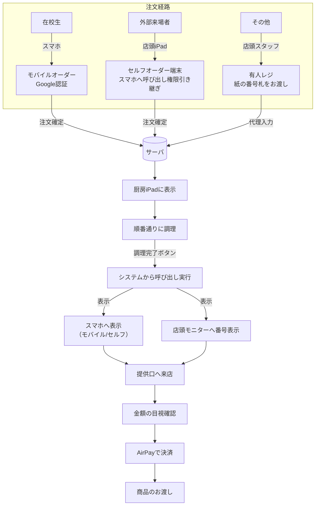

# 南陵祭2026 モバイルオーダー・POSシステム 導入提案書

**作成日**: 2026年6月10日  
**作成者**: 神奈川県立横浜南陵高校 コンピュータ科学部

---

## 第0章 目次

本提案書は、第24回南陵祭（2026年度）において、コンピュータ科学部が開発した「モバイルオーダーおよびPOS（販売管理）システム」の試験導入をご提案するものです。

システムの安全性、お金の取り扱いに関する確実なルール、そして万が一のトラブル時の対応策について、以下の構成で詳細をご説明いたします。

- **エグゼクティブサマリー**
- **第1章 はじめに**
- **第2章 現状の課題と導入のメリット**
- **第3章 システムの全体像**
- **第4章 お金のやり取りと決済の安全性**
- **第5章 トラブル・障害時の安全設計**
- **第6章 いたずら・放置注文への対策**
- **第7章 個人情報保護とサイバーセキュリティ**
- **第8章 導入に向けたスケジュールと教育体制**
- **第9章 おわりに**

---

## エグゼクティブサマリー

### ES.1 提案の概要

本提案は、第24回南陵祭（2026年度）の飲食店舗運営において、コンピュータ科学部が開発した「モバイルオーダー・POSシステム」を導入するものです。今年度はまず少数の希望団体から段階的に運用を開始し、検証結果を踏まえて来年度以降の拡大を目指します。

なお、本システムは現在学校で運用されているAirPay（クレジットカード・電子マネー・QR決済等）の仕組みをそのまま維持することを大前提としており、システム側に独自の決済機能を導入するものではありません。

### ES.2 解決したい課題

南陵祭の飲食店舗運営では、毎年以下の課題が繰り返し発生しています。

- 人気店舗の行列が通路を塞ぎ、来場者の安全な移動を妨げている
- 騒がしい環境での口頭注文と手書き伝票により、聞き間違いや伝票紛失などのミスが避けられない
- 南陵祭終了後の売上集計作業が煩雑で、生徒の大きな負担となっている

### ES.3 システムの仕組み

来場者がスマートフォンまたは店頭のiPadから注文すると、厨房のiPadに注文内容がリアルタイムで表示されます。調理が完了すると来場者のスマートフォンに呼び出し通知が届き、受取時に店頭のAirPay端末で決済を行い、商品受け渡しとなります。スマートフォンをお持ちでない方には、従来通りスタッフが口頭で注文を受け付ける有人レジを用意しています。

### ES.4 お金の安全性

本システムでは事前決済を採用せず、決済のタイミングを商品のお渡し時に限定しています。これにより、材料切れ等で商品を提供できない場合でも、事前決済を行わないため返金に伴う混乱やトラブルが極力生じない設計となっています。決済はスタッフがiPad上の正しい金額をAirPay端末に入力してお客様に支払いをしていただき、AirPay端末の決済完了画面を確認してから商品をお渡しします。

### ES.5 システム障害時の安全策

本システムは「システムは止まる可能性がある」という前提で設計されています。障害が発生した場合、現場の生徒は復旧を試みる必要はなく、あらかじめ準備してある紙の番号札と手書き伝票による運用に即座に切り替え、営業を継続します。当日はコンピュータ科学部の部員がサポート担当として待機し、切り替え判断や実行委員会への報告を行います。

### ES.6 個人情報の取り扱い

本システムが記録するのは、学校配布のGoogleアカウント情報と注文履歴のみです。住所・電話番号・決済口座情報などは入力画面すら存在せず、システム側でこれらを一切保持しないため、本システムからこれらの情報が漏洩するリスクを構造上排除しています。南陵祭終了後、事後処理の完了をもってデータは完全に消去します。

### ES.7 スケジュール

本システムの開発は2025年10月より着手しており、現在も開発・機能追加を続けています。本提案承認後は、導入団体の募集・マニュアル作成・環境構築を経て、9月上旬のトレーニングに臨み、南陵祭当日の安定運用を目指します。

---

## 第1章 はじめに

### 1.1 本提案の目的

南陵祭は、生徒と来場者が一体となって創り上げる素晴らしい学校行事です。しかし、毎年のように「人気飲食店舗での長蛇の列による通路の混雑」や、「手書きの紙伝票による注文ミス」、「南陵祭後の煩雑な売上集計作業」といった運営上の課題を抱えてきました。

私たちコンピュータ科学部は、日頃学んでいるITの技術を活用することで、これらの課題を解決し、南陵祭をより安全で、より快適な行事に進化させることができると考えました。

私たちが開発した「モバイルオーダー・POSシステム」は、来場者が自身のスマートフォンから行列に並ぶことなく注文でき、出店団体はiPad端末で注文や売上を正確に管理できる仕組みです。これにより、通路の混雑を解消し、生徒の運営負担を大幅に軽減することを目指しています。

### 1.2 なぜ「試験導入」なのか

本システムは、お金のやり取りを伴う「注文」という南陵祭の根幹に関わる重要な役割を担うため、システムが原因で南陵祭の運営に支障をきたすような事態は、極力避ける必要があります。

そこで、2026年度の南陵祭においては、全店舗への一斉導入は行わず、**最大3団体程度に限定した試験導入**とすることを提案いたします。

試験導入とすることで、以下の安全性を確保します。

- **影響範囲の限定**: 万が一システムに不具合が生じた場合でも、影響を受ける団体を限定し、南陵祭全体への影響を最小限に抑えます。
- **サポート体制**: 対象団体を絞ることで、私たちコンピュータ科学部の部員が各団体に対してサポートやトラブル対応を行うことが可能になります。
- **運用検証**: 今年度の試験導入で得られた反省点や改善点を洗い出し、来年度以降の本格導入に向けた安全な土台を作ります。

今年はあくまで「安全第一のスモールスタート」であることを、何よりも重視して設計・運用いたします。

### 1.3 学校方針との合致（現金取扱の廃止への対応）

現在、南陵祭における現金の直接的な取り扱いは、基本的に行われておらず、すべての決済は「AirPay」を用いたキャッシュレス決済に統一されています。

本システムは、この「現金取扱廃止」という学校のルールを大前提として設計されています。

システム内では現金の計算や管理を行う機能は一切排除しており、決済はすべて「商品のお渡し時に、店頭のAirPay端末でお支払いいただく」という、現在学校で定められている運用ルールに完全に則った形で行われます。

新しい決済の仕組みをシステム内に組み込むのではなく、**AirPay決済のルールをそのまま守りつつ、注文の受付と調理の順番待ちだけをデジタル化して整理する**というのが、本システムの正しい位置づけです。お金のやり取りに関する安全性については、第4章にてさらに詳しくご説明いたします。

## 第2章 現状の課題と導入のメリット

本章では、現在の南陵祭が抱えている具体的な課題と、本システムを導入することでそれらの課題がどのように解決され、どのようなメリットが生まれるのかをご説明いたします。

### 2.1 現在の南陵祭における課題

これまでの南陵祭における飲食店舗の運営では、主に「紙の整理券」と「手書きの伝票」を用いたアナログな手法がとられてきました。この手法には、以下のような大きな課題が存在しています。

**① 行列による通路の混雑と安全性の低下**
人気店舗では、注文をするための列と、商品を受け取るための列が混在し、長蛇の列が発生します。これにより通路が塞がれ、来場者の通行の妨げとなっています。

**② 手書き伝票による注文ミスと調理の混乱**
騒がしい環境の中で、スタッフが口頭で注文を聞き取り、紙の伝票に手書きで記録する方式では、「聞き間違い」や「書き損じ」、「文字が読み取れない」といったヒューマンエラーが避けられません。また、伝票の紛失や順番の前後が発生しやすく、厨房の混乱や来場者からのクレームの原因となっています。

**③ 売上集計作業の煩雑さ**
南陵祭終了後、生徒たちは疲労が溜まっている中で、売上の集計作業を行わなければなりません。この作業は非常に時間がかかる上、計算ミスが発生しやすく、生徒の大きな負担となっています。

### 2.2 システム導入による解決策とメリット

本システムを導入することで、上記の課題を解決し、来場者、出店団体（生徒）、そして学校運営の三者それぞれに大きなメリットをもたらします。

**【来場者のメリット：並ばずに南陵祭を満喫できる】**
来場者は、ご自身のスマートフォンからメニューを見て注文を済ませることができます。注文後は、商品の準備ができるまでその場を離れて構いません。商品の準備が整うとスマートフォンに「呼び出し通知」が届くため、それまでは他のクラスの展示やステージ発表を楽しむことができます。物理的な行列に縛られることなく、限られた南陵祭の時間を有効に使うことができます。

**【出店団体のメリット：ミスゼロの運営と集計作業の消滅】**
スマートフォンから入力された注文データは、そのまま厨房のiPad画面に正確に表示されます。手書きによる伝票の読み間違いや、注文の順番が前後するといったミスは、構造上極めて発生しにくい設計となっています。
さらに、注文データは自動的にGoogle スプレッドシートに記録・集計されていきます。そのため、営業終了後の面倒な伝票の数え上げや計算作業は実質的に不要となり、生徒の負担が劇的に軽減されます。

**【学校・運営のメリット：通路の確保による安全な南陵祭】**
来場者が店頭で待つ必要がなくなるため、店舗前の物理的な行列が大幅に短縮されます。これにより、塞がれがちだった通路のスペースが確保され、来場者が安全かつスムーズに移動できる環境が実現します。学校全体として、より安全で管理の行き届いた南陵祭運営が可能になります。

## 第3章 システムの全体像

本章では、このシステムが具体的にどのような手順で利用されるのかをご説明します。

本システムは、スマートフォンを使いこなす生徒だけでなく、外部からの来場者や、スマートフォンの操作が苦手な方まで、**すべての人を取り残さない**ことを前提に設計されています。

### 3.1 3つの注文経路

来場者の状況に合わせて、以下の3つの注文方法を用意しています。

**① 在校生向け：モバイルオーダー（ご自身のスマートフォンから）**
横浜南陵高校の生徒のメインとなる注文方法です。ご自身のスマートフォンからサイトにアクセスし、どこからでも注文が可能です。
_安全への配慮_：この機能は、学校から配布されているGoogleアカウント（`@gl.pen-kanagawa.ed.jp`）でログインした場合のみ利用できます。これにより、学校とは無関係の第三者が、外部からいたずらで注文を送信するような不正アクセスを未然にブロックします。

**② 外部来場者向け：セルフオーダー端末（店頭のiPadから）**
保護者や中学生など、外部の来場者向けの注文方法です。各店舗の店頭に設置されたiPad（セルフオーダー端末）の画面をタッチして商品を選びます。注文を確定するとiPadの画面にQRコードが表示されるので、それをご自身のスマートフォンで読み取っていただくことで、自分のスマホに「整理券（呼び出し通知機能）」を引き継ぐことができます。
_安全への配慮_：店頭のiPadを直接操作する必要があるため、会場に来場した人しか注文できません。これにより、外部からの不正な遠隔注文を防ぎます。

**③ スマートフォンをお持ちでない方向け：有人レジ（スタッフによる受付）**
スマートフォンをお持ちでない方や、機械の操作が苦手な方向けの注文方法です。従来通り、店頭のスタッフに口頭で注文を伝えていただきます。スタッフが手元のiPadに注文内容を入力し、手書きの「紙の番号札」をお渡しします。

### 3.2 注文からお渡しまでのシンプルな流れ

どの注文方法を選んだ場合でも、店舗の裏側（厨房や提供口）での作業の流れは一つに統一されており、生徒が混乱しないようシンプルに設計されています。

**ステップ1：注文の受付**
お客様が上記のいずれかの方法で注文が確定すると、データが瞬時にシステムに送信されます。

**ステップ2：調理（厨房での確認）**
厨房に設置されたiPadに、注文された商品が自動的に並んで表示されます。厨房のスタッフは、画面の指示に従って順番通りに調理を進めます。紙の伝票のように、風で飛んでいったり、順番がわからなくなったりすることはありません。

**ステップ3：呼び出し（完成の合図）**
調理が完了し、提供口のスタッフがiPadの「準備完了」ボタンを押すと、以下の2つが同時に行われます。

- 店頭に設置されたiPadに「呼び出し番号」が表示されます。
- モバイルオーダーやセルフオーダー端末を利用したお客様のスマートフォンに、「商品の準備ができました」という通知が届きます。

**ステップ4：お渡しと決済**
通知を受けた来場者が提供口にやってきます。スタッフは画面の番号と来場者の番号を照らし合わせます。その後、店頭のAirPay端末で決済をしていただき、商品をお渡しして完了となります。

決済の具体的な安全確認の手順については、次章で詳しくご説明いたします。

## 第4章 お金のやり取りと決済の安全性

本章では、学校運営において慎重な取り扱いが求められる「お金」に関する安全設計についてご説明します。

本システムは、最新のIT技術を活用していますが、決済部分については**あえてシステムによる自動化を行わず、確実性が高くトラブルの起きにくいアナログな手法**を採用しています。

### 4.1 決済のタイミングは「商品お渡し時」に統一

一般的なモバイルオーダーシステムでは、スマートフォンで注文ボタンを押した瞬間に決済が行われる事前決済が主流です。しかし、本システムではこれを採用せず、決済のタイミングを**商品のお渡し時に統一**しています。

**【事前決済にしない理由：返金トラブルの極小化】**
南陵祭の飲食店では、急な材料切れや、調理の失敗などにより、注文を受けた商品を提供できなくなる事態が発生する可能性があります。
もし事前決済を採用していた場合、商品を提供できないお客様に対してau PAYの決済取り消しや現金での返金対応をしなければならず、現場は混乱が生じやすくなります。

決済を商品のお渡し時に限定することで、万が一商品が提供できなくなった場合でも、システム上で注文をキャンセルするだけで済みます。お客様から事前にお金をいただいていないため、商品未提供時における金銭的な返金トラブルが発生する可能性を極力排除しています。

### 4.2 AirPay決済の確実な確認方法

本システムは、AirPayのシステムと直接連携（自動決済）するような複雑な仕組みは持っていません。決済の手順は以下の通り、現在学校で定められているルールと全く同じです。

1.  お客様が提供口にやってくる。
2.  スタッフがPOS用iPadで金額を確認し、隣に設置されたAirPay端末に手入力する。
3.  お客様がAirPay端末でクレジットカードや電子マネー、QR決済等を用いて支払いを行う。

**【金額間違いを防ぐ「目視確認」の徹底】**
この方式で唯一懸念されるのが、「お客様が入力する金額を間違える（あるいは意図的に安く入力する）」というリスクです。

これを防ぐため、提供口のスタッフには以下のルールを徹底させます。

- スタッフの手元のiPadには、そのお客様に請求すべき「正しい合計金額」が大きく表示されています。
- お客様が決済を完了したら、必ずAirPay端末の「決済完了画面」を確認します。
- **POS用iPadに表示されている金額と、AirPay端末で決済された金額が一致していることを確実に突き合わせるまで、商品は引き渡さない運用ルールを徹底します。**

システムによる自動確認ではなく、人と人との対面による目視確認こそが、南陵祭という環境下においては信頼性が高く、不正やミスを防ぐ強力な安全策となります。

## 第5章 トラブル・障害時の安全設計

本システムは非常に便利ですが、通信環境の悪化や機器の故障など、予期せぬトラブルが発生する可能性をゼロにすることはできません。私たちは**システムは止まる可能性がある**という前提に立ち、**システムが止まっても、南陵祭の営業を継続し、混乱を最小限に抑えるための**安全設計と運用ルールを構築しています。

### 5.1 「紙運用」への即時切り替え（フォールバック）

システムに何らかの異常が発生した場合、最も避けるべきは「システムを直そうとして現場が立ち止まり、お客様を長時間待たせてしまうこと」です。

そのため、本システムでは**トラブル時は原因究明を後回しにし、即座に『紙の整理券と手書き伝票』による運用に切り替える**という明確なルールを定めています。

- **事前準備の徹底**：システムを導入する店舗であっても、必ず事前に「紙の番号札」と「手書き用の伝票」を十分に用意しておきます。
- **迷わず切り替える**：システムの動作が不安定になったり、画面が動かなくなったりした場合、現場の生徒はシステムを直そうとする必要はありません。すぐに紙の運用に切り替え、注文の受付と商品の提供を継続します。

この「いつでもアナログに戻れる代替手段」を用意しておくことで、システム障害が南陵祭の混乱に直結するリスクを極限まで低減します。

### 5.2 ネットワーク障害や端末故障への備え

南陵祭当日は多くの人が集まるため、学校のWi-Fiが繋がりにくくなったり、使用しているiPad端末のバッテリーが切れたりするケースも想定されます。

- **端末の電池切れ**：各店舗には予備のiPad端末を準備しておきます。バッテリーが切れた場合は、すぐに予備機に交換して営業を続けます。
- **ネットワークの不調**：特定の店舗だけWi-Fiが繋がらなくなった場合は、その店舗だけを「紙運用」に切り替えます。他の正常に通信できている店舗は、そのままシステムを利用し続けることができます。

### 5.3 コンピュータ科学部による当日サポート体制

現場で調理や接客を行っている生徒たちに、システムのトラブル対応という重い責任を負わせることはありません。

南陵祭当日は、本システムを開発したコンピュータ科学部の部員がサポート担当として会場を巡回・待機します。

- 現場の生徒は、「システムがおかしいな」と思ったら、すぐにサポート担当を呼ぶだけで済みます。
- サポート担当が状況を素早く確認し、「予備機に交換する」「紙運用に切り替える」といった判断を現場に代わって行います。
- 大規模な通信障害などが発生した場合は、サポート担当から実行委員会へ速やかに報告し、全店舗一斉に紙運用へ切り替えるなどの全体指示を出します。

このように、システムの専門知識を持った生徒が裏方として現場を支えることで、出店団体の生徒たちは安心して目の前の接客や調理に集中することができます。

## 第6章 いたずら・放置注文への対策（ペナルティ機構）

本章では、モバイルオーダー特有の課題である「いたずら注文」や「商品の受け取り放置」を防ぐための、厳格なルールとシステムの仕組みについてご説明します。

### 6.1 放置注文（取りに来ない）のリスクと対策

スマートフォンからどこでも簡単に注文できるシステムは非常に便利ですが、一方で「注文したのに、いつまでも商品を受け取りに来ない」という事態が発生しやすくなる懸念があります。

商品が放置されると、せっかく作った料理が廃棄（食品ロス）になってしまい、一生懸命準備をした生徒たちの努力が無駄になってしまいます。また、提供口のスペースを圧迫し、他のお客様への提供が遅れる原因にもなります。

本システムでは、こうした無責任な注文を未然に防ぎ、真面目に南陵祭を楽しんでいる生徒や来場者を守るため、厳格なペナルティ（罰則）の仕組みを導入しています。

### 6.2 「15分ルール」と利用停止措置

商品の準備が完了し、お客様のスマートフォンや店頭のモニターで呼び出しを行ってから、15分が経過しても受け取りに来なかった場合、その注文はシステムによって<b>自動キャンセル(放棄)</b>として処理されます。

そして、この自動キャンセルを発生させたお客様のアカウントに対しては、**即座に本システムの利用停止措置**が発動します。

- **利用停止のペナルティ**：この措置を受けたアカウントは、以降のコンピュータ科学部が手掛けるサービスすべてで利用することができなくなります。
- **例外のない適用**：このルールはシステムによって自動的に判定・実行されるため、「友達と話していて忘れていた」といった理由であっても例外なく適用されます。

この厳格なルールにより、「注文したら必ず責任を持って受け取りに行く」という意識を強く持たせ、いたずらや放置を強力に抑止します。

### 6.3 事前の規約同意によるトラブル防止

このような厳しいペナルティを設けると、「そんなルールは知らなかった」「勝手に利用停止にされた」といったクレームが発生する懸念があります。

これを完全に防ぐため、本システムでは、お客様がスマートフォンで**注文を確定する直前の画面に、必ず「利用規約」を表示**します。

- 規約には、「呼び出し後15分以内に受け取りに来ない場合、商品は廃棄され、以降のコンピュータ科学部が手掛けるサービスすべてで利用することができなくなります」旨が、目立つように明記されています。
- お客様は、この規約を読んで**同意する**というチェックボックスにチェックを入れない限り、注文ボタンを押すことができない仕組みになっています。

事前に明確な同意を得た上でシステムを利用していただくため、万が一ペナルティが発動した場合でも、学校や出店団体側が不当なクレームから守られる設計となっています。

なお、万が一ペナルティが発動した場合でも、異議申し立て制度（6.4参照）により、正当な理由がある場合は措置の解除を申請することができます。

### 6.4 BAN措置に対する異議申し立て制度

本システムによるBAN措置は自動的に実行されますが、措置を受けたアカウントの利用者は、所定の異議申し立てフォームから申し立てを行うことができます。

申し立てを受けた後の審査フローは以下の通りです。申し立て内容をコンピュータ科学部責任者が確認・精査した上で、解除可否を判断します。審査結果はBANされたアカウントのメールアドレスに通知します。なお、利用規約違反が明確な場合はBANが維持されることがあります。

## 第7章 個人情報保護とサイバーセキュリティ

本章では、生徒や来場者の大切な個人情報をどのように守るのか、そして外部からのサイバー攻撃や不正アクセスをどのように防ぐのかについてご説明します。

学校で運用するシステムとして、情報漏洩のリスクを極限までゼロに近づけるための設計を行っています。本システムの基盤には、Googleが提供する堅牢なクラウドサービス「Firebase（ファイアベース）」を採用しており、世界最高水準のセキュリティ基準を満たしています。

### 7.1 取得する個人情報の最小化（持たない安全）

個人情報を守るための最も確実な方法は、「そもそも不要な個人情報をシステムに保存しない」ことです。本システムは、この「持たない安全」を徹底しています。

- **取得しない情報**：住所、電話番号、クレジットカード番号や口座情報などは、システムでは入力する画面すら存在しません。したがって、そもそもデータを保持しないため、本システムからこれらの情報が漏洩するリスク自体を構造上排除しています。
- **取得する情報**：システムが記録するのは、Firebase Authentication（Googleログイン）を通じて安全に取得した「Googleアカウントの識別子・メールアドレス」と、「何を注文したか（注文履歴）」のみです。

決済はすべて店頭の独立したAirPay端末で完結するため、本システムがお金に関する機密情報に触れることは一切ありません。

### 7.2 Firebaseによる堅牢な認証とアクセス制御

本システムのメイン機能であるモバイルオーダーはインターネット上に公開されていますが、不正なアクセスを防ぐための強力な多段防御を構築しています。

- **学校アカウントによる制限**：モバイルオーダー利用できるのは**神奈川県教育委員会から配布されている学校アカウント（`@gl.pen-kanagawa.ed.jp`）を持つ生徒のみ**に厳格に制限しています。学校外の第三者による不正ログインは入り口でブロックされます。
- **Firebase セキュリティルール（データ保護）**：データベース（Firestore）には厳格な「セキュリティルール」を設定しています。これにより、「自分の注文履歴しか見られない」「店舗スタッフしか全体の注文を見られない」といったアクセス制御がシステムレベルで強制され、万が一アプリの不具合があっても他人のデータが漏洩することはありません。
- **bot・サイバー攻撃対策**：Googleの強力なインフラであるFirebase上で稼働しているため、大規模なDDoS攻撃（サーバーをダウンさせる攻撃）から自動的に保護されます。また、reCAPTCHA v3などの技術を組み合わせることで、自動プログラム（bot）による大量のいたずら注文も遮断します。

### 7.3 外部来場者の安全な利用

学校アカウントを持たない外部の来場者は、自身のスマートフォンからモバイルオーダーを利用することはできません。

- **セルフオーダー端末の活用**：外部の方は、店頭に設置された「セルフオーダー（iPad）」を使う仕組みになっています。これにより、「実際に南陵祭の会場に足を運んでいる人」しかシステムに介入できず、外部からの遠隔操作による不正アクセスのリスクを効果的に低減しています。

### 7.4 データの確実な消去

南陵祭の期間中にFirebaseのデータベースに記録されたデータは、南陵祭終了後も永遠に保存され続けるわけではありません。

- **速やかなデータ消去**：南陵祭が終了し、売上の集計や事後処理が完了した後、システム上に残っている注文データやアカウント情報は、利用停止されたアカウント情報を除き、速やかに、かつ完全に消去します。

「必要な期間だけデータを使い、終わったら確実に消す」という運用ルールを徹底することで、将来にわたってデータが流出するリスクを断ち切ります。

## 第8章 導入に向けたスケジュールと教育体制

本システムを安全かつスムーズに運用するためには、システム自体の完成度だけでなく、実際に現場で操作する生徒たちの理解と習熟が不可欠です。本章では、南陵祭当日までの準備スケジュールと、出店団体に対する教育体制についてご説明します。

### 8.1 出店団体へのトレーニング（事前準備の徹底）

本システムを試験導入する団体の生徒に対しては、事前の操作トレーニングを必須とし、十分に操作に習熟した状態で当日の運営に臨む体制を整えます。

- **マニュアルの配布と事前学習**
  「レジ担当」「厨房担当」「提供口担当」「店舗責任者」といった役割ごとに、画面の操作手順やトラブル時の対応ルール（紙運用への切り替え等）をまとめた分かりやすいマニュアルを作成し、事前に配布します。

「機械の操作」だけでなく、「お客様のスマホ画面の金額をしっかり目視確認する」といったアナログな安全確認の重要性も、このトレーニングを通じて徹底的に指導します。

### 8.2 開発経緯と今後のスケジュール（ロードマップ）

本システムの開発は2025年10月より開始しており、現在も引き続き開発・機能追加を進めています。現時点ではシステム全体の一部機能（ページ）が未完成の状態であり、引き続き作業を行っています。

本提案承認後、南陵祭当日（9月11日、12日）までの大まかなスケジュールは以下の通りです。

- **〜2025年10月（完了）：開発着手**
  - コアシステム（モバイルオーダー・POS）の設計・開発を開始しました。
- **〜2026年6月現在（進行中）：開発継続中**
  - 引き続き開発および動作テストを実施しています。
  - 一部ページ・機能の完成が未了であり、引き続き作業を行っています。
- **6月〜7月：店舗の募集と環境整備**
  - 実行委員会と連携し、試験導入を希望する出店団体を募集・決定します。
  - 各店舗のメニュー情報や価格をシステムに登録し、本番用の環境を構築します。
- **7月〜8月：マニュアル作成**
  - 各役割（レジ・厨房・提供口・店舗責任者）向けの操作マニュアルや、店頭に掲示する案内ポスター等を作成します。
- **9月上旬：トレーニング**
  - 出店団体の生徒を対象としたトレーニングを実施します。
  - 万が一のトラブルに備えた「紙の番号札・伝票」の準備状況も確認します。
- **9月（南陵祭当日）：本番運用**
  - コンピュータ科学部のサポート担当が巡回・待機する万全の体制のもと、システムの運用を開始します。
- **南陵祭終了後：データ消去と振り返り**
  - 速やかにシステム上の個人情報・注文データを消去します。
  - 出店団体や来場者からの意見を集約し、来年度以降に向けた改善点をまとめます。

---

## 第9章 おわりに

ここまでお読みいただき、誠にありがとうございます。

私たちコンピュータ科学部は、単に「新しい技術を使ってみたい」という理由だけで本システムを開発したわけではありません。
「人気店舗の行列で通路が混雑する」「手書き伝票の集計で生徒が疲弊している」といった、南陵祭が抱えるリアルな課題を、自分たちが学んでいる技術で解決したいという強い思いからスタートしました。

お金のやり取りが伴う以上、学校や実行委員会の皆様が慎重になられるのは当然のことと理解しております。だからこそ、本システムは「すべてを自動化する」のではなく、「決済の確認は必ず人の目で行う」「トラブル時はすぐに紙に戻す」といった、**アナログで確実な安全策をシステムの中心に据えています。**

2026年度は、最大3団体程度に限定した「安全第一の試験導入」です。この小さな一歩が、生徒の負担を減らし、来場者の笑顔を増やし、南陵祭をより安全で素晴らしい行事へと進化させるための大きな挑戦になると確信しています。

本システムの試験導入につきまして、何卒ご検討とご承認を賜りますよう、よろしくお願い申し上げます。
